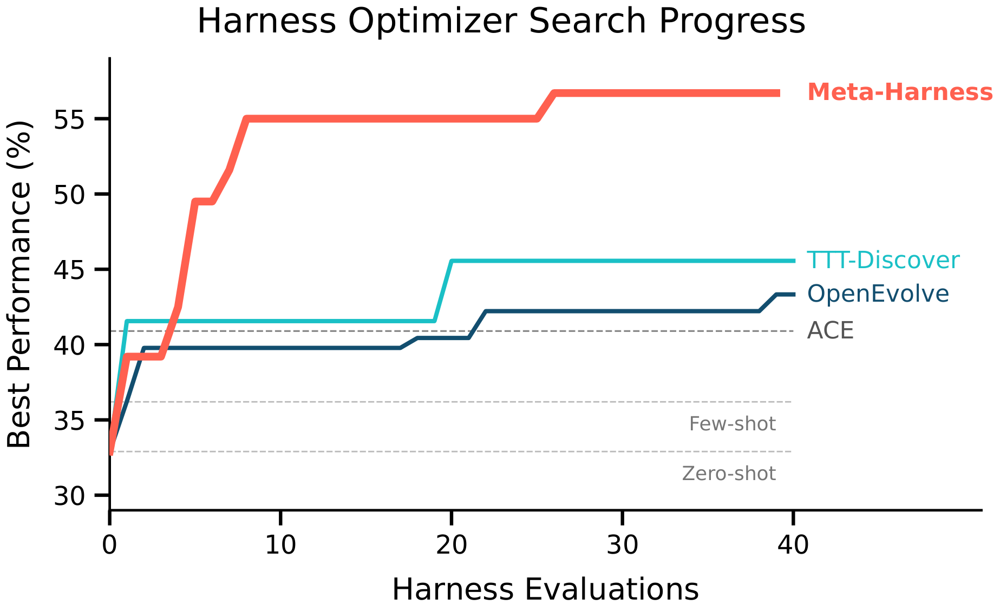
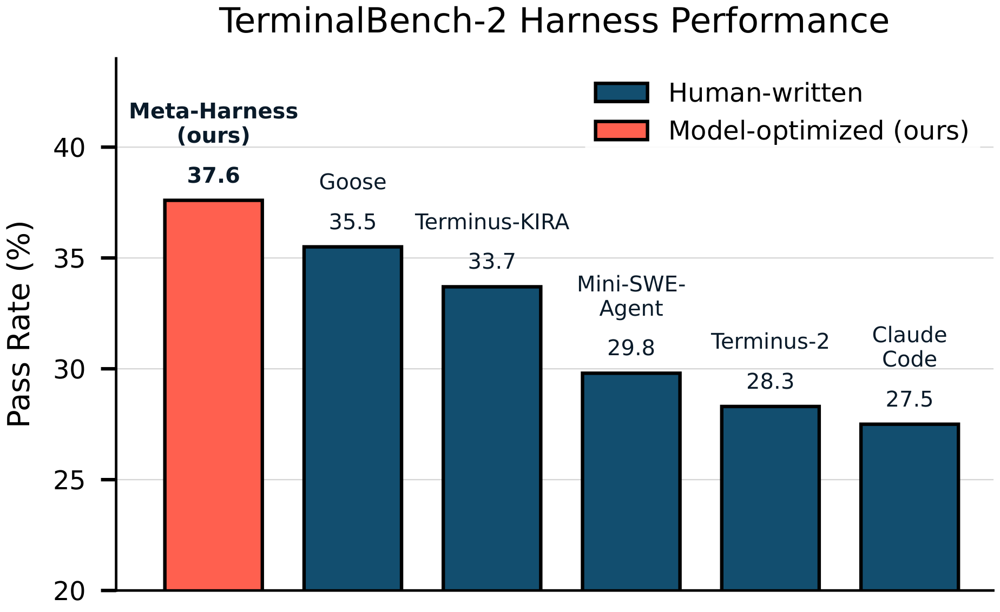
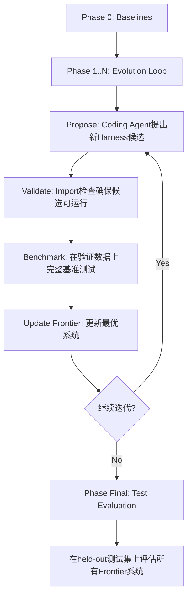
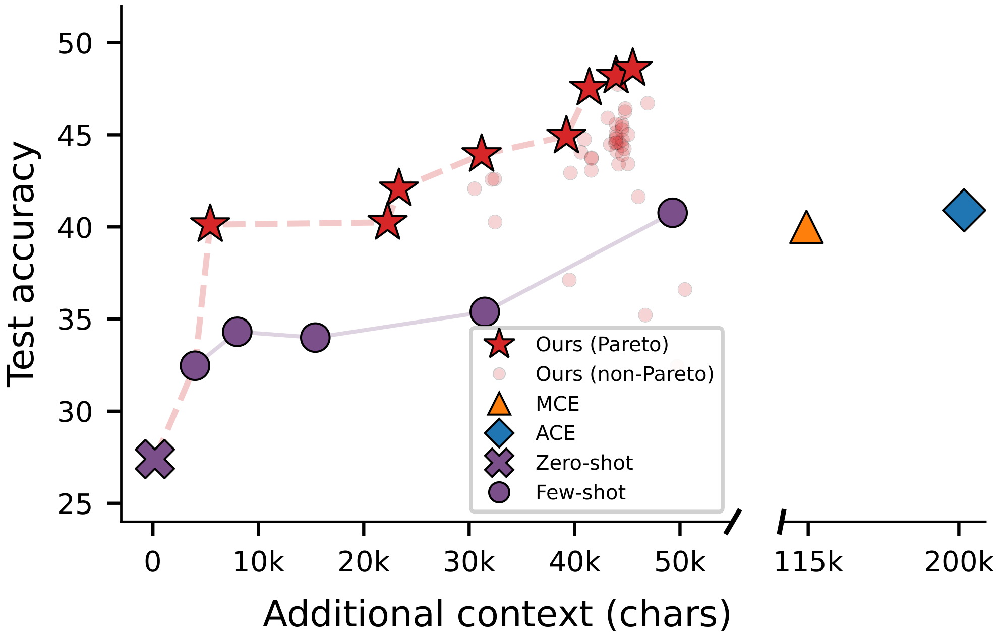
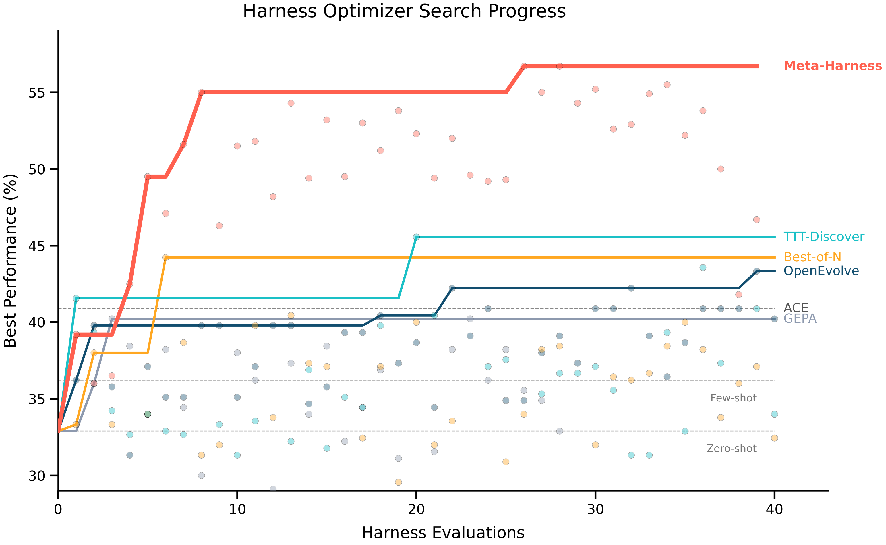
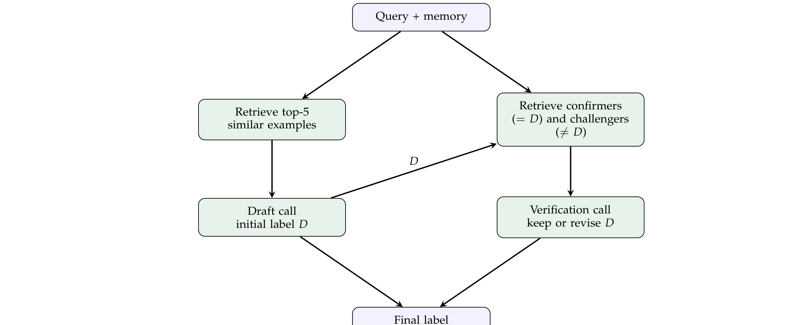
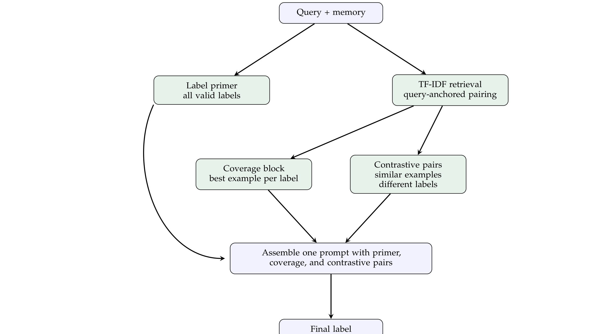
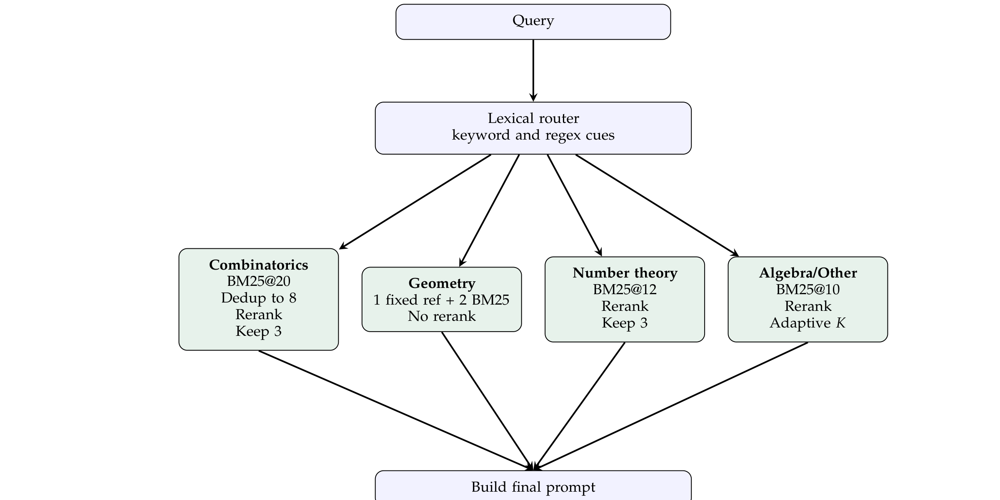
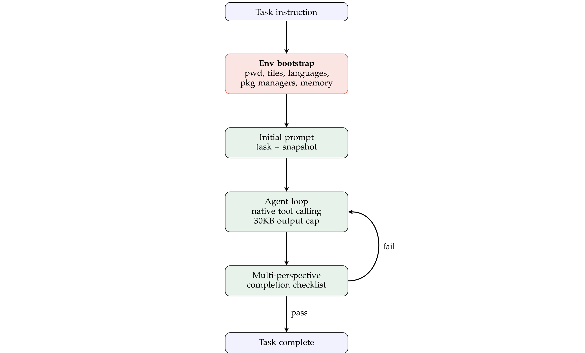

# Meta-Harness: End-to-End Optimization of Model Harnesses 论文调研报告

> **论文调研报告** - Stanford提出的Harness端到端优化框架

---

## 📋 基本信息

<p align="center"><b>表1：论文基本信息</b></p>

| 项目 | 内容 |
|-----|------|
| 论文标题 | Meta-Harness: End-to-End Optimization of Model Harnesses |
| 作者 | Yoonho Lee, Roshen Nair, Qizheng Zhang, Kangwook Lee, Omar Khattab, Chelsea Finn |
| 所属机构 | Stanford University, MIT, KRAFTON |
| 发表年份 | 2026 |
| 发表会议 | CoLM 2026 |
| 论文链接 | https://arxiv.org/abs/2603.28052 |
| PDF链接 | https://arxiv.org/pdf/2603.28052 |
| 项目主页 | https://yoonholee.com/meta-harness/ |
| 代码仓库 | https://github.com/stanford-iris-lab/meta-harness |
| TB2 Artifact | https://github.com/stanford-iris-lab/meta-harness-tbench2-artifact |
| 学科分类 | cs.AI (Artificial Intelligence) |

---

## 1. 研究背景与动机

### 1.1 问题定义

LLM-based Agent的性能不仅由其基础模型权重决定，还受到其**Harness**（模型运行框架）的深刻影响。Harness是围绕固定基础模型的可执行程序，决定了模型在工作时**存储什么、检索什么、展示什么**，包括：

- **Prompt构建器**: 构建输入提示词的代码
- **检索系统**: 决定何时检索、检索什么、如何排序
- **记忆更新器**: 管理经验的存储与读取
- **工具编排器**: 调用和管理外部工具
- **状态机**: Agent的执行流程控制
- **完成协议**: 判断任务完成的验证机制
- **上下文管理**: 何时截断、何时压缩历史

**核心比喻**：模型是引擎，Harness是变速箱、导航、仪表盘和刹车。即使引擎强劲，如果车辆不稳定，驾驶也会很糟糕。

**实证发现**：研究表明，在固定模型上仅改变Harness，同一基准测试上可产生**高达6倍的性能差异**[47]。



*图1（论文Figure 1左）: 文本分类上的Harness优化器搜索进度。Meta-Harness在最先进的手工Harness（ACE）和现有文本优化器（TTT-Discover、OpenEvolve）上表现更好，仅4次评估即达到次优方法的最终精度。*



*图2（论文Figure 1右）: TerminalBench-2上，Meta-Harness超越所有已报告的Claude Haiku 4.5 Harnesses，达到37.6% Pass率。*

### 1.2 研究动机

#### 现有Harness优化方法的局限性

<p align="center"><b>表1-1：文本优化方法及其设置对比（论文Table 1原文）</b></p>

| 方法 | 历史访问 | 日志内容 | MTok/iter |
|------|---------|---------|----------|
| OPRO [51] | Window | 过往(solution, score)对 | 0.002 |
| TextGrad [53] | Last | 当前artifact的文本反馈 | 0.015 |
| AlphaEvolve [35] | Window | 程序数据库 + 评估分数 | 0.022 |
| GEPA [1] | Summary | 来自rollout轨迹的反思性反馈 | 0.008 |
| Feedback Descent [26] | Summary | 比较 + 文本反馈 | 0.012 |
| TTT-Discover [54] | Window | 先前solution片段 | 0.026 |
| **Meta-Harness** | **Full** | **所有日志和分数** | **10.0** |

**核心洞察**：现有文本优化器将反馈压缩为标量分数、短模板或LLM摘要，每次优化步骤可用上下文仅100到30,000 token。而Meta-Harness的单次评估可产生高达10,000,000 token的诊断信息——**三个数量级的差距**。压缩反馈往往丢失追踪下游失败到早期Harness决策所需的信息。

#### 核心挑战：为什么文本优化不够？

Harness效果具有**长程依赖性**：

1. 一个"记忆中存储什么"的决策，可能只在数十步后才影响答案
2. 一个"完成前再确认一次"的状态机，可能在任务完成后将Agent困在重复验证中
3. 压缩反馈为标量分数或短摘要，会**丢弃诊断性细节**

**Meta-Harness的核心判断**：要优化Harness，不能将失败场景压扁。优化器需要看到**原始代码、完整轨迹、历史分数和工具输出**，自行决定查看哪些历史、比较哪些候选、修改哪些代码部分。

### 1.3 研究目标

论文提出Meta-Harness框架，目标是：

1. **端到端Harness优化**：将Harness视为可搜索的代码空间，而非单一文本片段
2. **完整历史访问**：让优化器（Coding Agent）访问所有历史候选源码、分数和执行轨迹
3. **超越人类设计**：在文本分类、数学推理和Agentic Coding上超越人工设计的Harness
4. **多目标Pareto优化**：同时考虑准确率和上下文成本

---

## 2. 核心贡献

### 2.1 主要贡献

<p align="center"><b>表2：论文主要贡献</b></p>

| 编号 | 贡献描述 |
|-----|---------|
| C1 | **概念创新**：定义"Model Harness"为围绕固定模型的可执行程序，将Harness优化从文本优化提升到代码空间搜索 |
| C2 | **架构创新**：提出以Coding Agent为Proposer、完整经验为可查询文件系统的进化搜索框架，实现非马尔可夫式搜索 |
| C3 | **实验突破**：在三大领域（文本分类、数学推理、Agentic Coding）超越人工设计Harness和现有文本优化器 |
| C4 | **工程实践**：开源完整框架和Terminal-Bench-2优化Artifact，提供ONBOARDING指南适配新领域 |

### 2.2 创新点

1. **方法创新**: 将Harness优化从"文本优化"提升到"代码空间搜索"——搜索完整Harness程序而非单个prompt片段
2. **技术创新**: 以文件系统作为经验界面，Coding Agent使用grep/cat/diff选择性读取历史，而非被动接收压缩摘要
3. **设计创新**: 反参数调优规则（Anti-Parameter-Tuning）和探索-利用轴追踪，确保搜索产生结构性创新而非数值微调
4. **实证创新**: 消融实验证明原始执行轨迹访问是关键因素，摘要不仅无法恢复信号，有时反而压缩掉诊断性细节

### 2.3 核心创新对比

<p align="center"><b>表3：Meta-Harness核心创新维度</b></p>

| 创新维度 | 描述 | 与现有方法的区别 |
|---------|-----|----------------|
| **完整历史访问** | 保存所有候选源码、分数和执行轨迹 | 传统优化器只保留当前最优或固定档案库 |
| **Coding Agent作为Proposer** | 使用可调用开发工具的代码Agent | 传统优化器使用裸LLM生成文本 |
| **非马尔可夫搜索** | Proposer可回顾任意历史候选进行跨轮比较和因果诊断 | 马尔可夫搜索仅从最近父代采样 |
| **代码空间正则化** | 搜索完整Harness程序（prompt、检索、记忆、工具编排） | 文本优化器只搜索prompt文本 |
| **多目标Pareto优化** | 同时考虑准确率和上下文成本 | 传统方法只追求单一指标 |

---

## 3. 方法详解

### 3.1 方法概述

**核心思想**：Meta-Harness将Harness优化定义为一个**进化搜索循环**，其中Coding Agent（当前为Claude Code + Opus）作为Proposer，读取所有历史经验（源码、分数、轨迹）作为可查询文件系统，迭代提出、验证、基准测试和进化Harness候选。

**关键设计哲学**：外循环本身故意保持简单——"提出候选、跑评估、写入结果目录、进入下一轮"。复杂决策（看什么、比较什么、修改什么）全部委托给Coding Agent。随着Coding Agent能力增强，这个外循环也会自然增强。

### 3.2 整体架构


*图3（论文Figure 2）: Meta-Harness搜索循环。(1) Agent读取包含所有先前候选源码、执行轨迹和分数的文件系统，提出新Harness。(2) 评估提出的Harness。(3) 所有日志（提出的代码、推理轨迹、评估分数）存储在文件系统的新的目录中，循环重复。*

Meta-Harness的进化搜索循环包含以下阶段：



### 3.3 核心算法

#### 3.3.1 算法流程

```
Algorithm: Meta-Harness Evolution Loop
Input: 基础模型M, 基线Harness集合H0, 搜索集D_search, 测试集D_test, 
       评估器E, 迭代数N
Output: Pareto前沿H_frontier

1: // Phase 0: 基线评估
2: H_frontier ← EVALUATE_BASELINES(M, H0, D_search, E)
3: 
4: // Phase 1..N: 进化搜索循环
5: for i = 1, 2, ..., N do
6:     // Step 1: Propose — Coding Agent提出新候选
7:     C_new ← PROPOSE(M, H_frontier, history, D_search, E)
8:     // Proposer读取历史经验文件系统，选择性诊断，提出结构性创新
9:     
10:    // Step 2: Validate — Import检查
11:    for c ∈ C_new do
12:        if IMPORT_CHECK(c) fails then REMOVE(c)
13:    end for
14:    
15:    // Step 3: Benchmark — 完整基准测试
16:    for c ∈ C_new do
17:        scores[c] ← BENCHMARK(M, c, D_search, E)
18:        traces[c] ← COLLECT_TRACES(M, c, D_search)
19:        // 将源码、分数、轨迹写入候选目录
20:    end for
21:    
22:    // Step 4: Update Frontier — Pareto前沿更新
23:    for each dataset d ∈ D_search do
24:        H_frontier[d] ← max(H_frontier[d], best_of(C_new, d))
25:    end for
26: end for
27: 
28: // Phase Final: 测试集评估
29: return EVALUATE(M, H_frontier, D_test, E)
```

#### 3.3.2 算法逐步解读

| 步骤 | 操作 | 设计意图 |
|-----|-----|---------|
| Phase 0 | 评估手工基线 | 建立性能起点和Pareto前沿 |
| Step 1 | Coding Agent提出候选 | 基于完整历史经验进行结构性创新 |
| Step 2 | Import检查 | 轻量验证先于昂贵评估，过滤无法运行的候选 |
| Step 3 | 完整基准测试 | 收集分数和完整轨迹，写入文件系统供后续轮次查阅 |
| Step 4 | Pareto前沿更新 | 每个数据集独立追踪最优，支持多目标优化 |

### 3.4 关键模块详解

#### 模块A: Coding Agent作为Proposer

- **功能**: 读取历史经验，诊断失败，提出新Harness候选
- **实现**: 使用Claude Code CLI (`claude -p`)，加载特定SKILL指令
- **关键特性**: 可调用grep/cat/diff/editor等开发工具，选择性读取历史

**每轮读取行为**（TerminalBench-2搜索运行统计数据）：
- 中位数每轮读取**82个文件**
- 约41%为历史Harness源代码
- 约40%为执行轨迹
- 约19%为分数和其他元数据

**SKILL.md指令核心规则**：

1. **反参数调优规则**：
   - ❌ "坏候选只调数值"（改pool大小、检索数量、上下文预算）
   - ✅ "好候选改变根本机制"（新检索算法、新prompt架构、新学习策略、新记忆结构）

2. **反过拟合规则**：
   - 禁止数据集特定提示
   - 记忆系统/Agent必须是通用目的的
   - 代码、prompt和注释中不能出现数据集名称

3. **探索-利用轴追踪**：
   - 每个候选标记探索的"轴"：A=Prompt模板, B=记忆内容, C=选择算法, D=记忆容量, E=学习触发, F=LLM在学习中的使用
   - 如果最近3轮探索同一轴，Proposer必须选择不同轴

4. **强制原型步骤**：
   - 每个候选必须先原型化再最终实现
   - 跳过原型化的候选"倾向于有bug或不产生改进"

#### 模块B: 经验作为可查询文件系统

- **功能**: 存储和暴露所有历史经验供Proposer查询
- **实现**: 每轮将候选源码、评估分数、推理轨迹、工具调用、模型输出和状态更新写入新目录
- **关键设计**: 历史不是prompt中的摘要，而是**可增长、可搜索、可比较的文件系统**

**Proposer的典型工作流**：
1. 使用`grep`搜索特定失败模式关键词
2. 使用`cat`读取特定候选源码
3. 使用`diff`比较不同候选的实现差异
4. 使用编辑器修改代码
5. 像工程师一样选择性读取，而非一次性消费所有历史

#### 模块C: claude_wrapper.py

- **功能**: 包装Claude Code CLI调用，解析输出，记录所有事件
- **实现**: subprocess调用`claude` CLI，解析stream-json输出
- **关键特性**：
  - 提取工具调用、文件读写、token使用量
  - 将所有事件记录到disk（meta.json, events.jsonl, 每个工具调用文件）
  - 使用Claude Pro/Max订阅认证（非API key），避免速率限制
  - 将SKILL指令作为系统prompt注入

#### 模块D: Pareto前沿追踪

- **功能**: 在每个数据集上独立追踪最优系统
- **实现**: `frontier_val.json`记录每个数据集的最优系统
- **设计意图**: 支持多目标优化——不是盲目堆叠上下文，而是在性能和成本之间找到更好的操作点

### 3.5 Terminal-Bench-2实验的Harness搜索空间

Terminal-Bench-2的搜索空间是**任意Python代码**。SKILL.md明确声明：

> "搜索空间是任意Python代码。你可以重写任何方法、调用任何库、发起原始API调用、添加新工具、改变LLM调用方式、重写命令执行、拦截和变换观察——任何可用Python表达的都可行。"

**可重写的核心方法**：

| 方法 | 功能 | 优化潜力 |
|-----|-----|---------|
| `_call_llm_with_tools` | 调用LLM API | 可改变模型选择、参数、缓存策略 |
| `_parse_tool_calls` | 解析工具调用 | 可添加预处理、过滤、重排序 |
| `_execute_commands` | 在tmux执行命令 | 可改变执行策略、错误处理、超时控制 |
| `_run_agent_loop` | 主循环 | 可改变循环逻辑、提前退出、重试策略 |
| `_get_completion_confirmation_message` | 完成确认 | 可改变确认协议，避免过度验证 |
| `_get_prompt_template_path` | 提示词路径 | 可切换不同prompt模板 |
| `_summarize_context` | 上下文压缩 | 可改变压缩策略、保留策略 |
| `_execute_image_read` | 图片读取 | 可改变图片处理方式 |

**继承要求**: Agent必须继承 `harbor.agents.terminus_2.terminus_2.Terminus2` 以保证评估Harness兼容性。

### 3.6 方法设计的关键洞察

1. **经验是训练材料**: 日志不是副产品，而是下一轮优化的训练材料
2. **SKILL文本是杠杆**: 搜索质量很大程度上取决于给Proposer的SKILL指令质量
3. **轻量验证先于昂贵评估**: Import检查过滤无法运行的候选，避免浪费基准测试资源
4. **非马尔可夫式搜索至关重要**: Proposer可以回顾任意历史候选，进行跨轮因果诊断
5. **外循环简单化**: 复杂决策委托给Coding Agent，框架本身只负责循环控制

### 3.7 与现有方法的核心区别

<p align="center"><b>表4：Meta-Harness与现有Harness优化方法的对比</b></p>

| 环节 | Human Engineering | OPRO/TextGrad | DSPy | Meta-Harness | Self-Harness |
|-----|------------------|--------------|------|--------------|--------------|
| **谁提出修改** | 人类专家 | LLM生成文本 | Teleprompter | Coding Agent (Claude Code) | 目标模型自己 |
| **搜索空间** | 手动诊断 | Prompt文本 | 声明式Pipeline | 任意Python代码 | 有限的编辑表面 |
| **反馈界面** | 人工判断 | 压缩摘要/标量分数 | 指标反馈 | 可查询文件系统 | 执行轨迹+证据包 |
| **历史访问** | 人类记忆 | 无或有限 | 无 | 完整历史（非马尔可夫） | 当前轮证据 |
| **优化范围** | 局部修补 | 单一prompt | Pipeline组件 | 完整Harness程序 | Prompt+运行时策略 |
| **验证方式** | 人工判断 | 自动评估 | 自动评估 | Import检查+基准测试 | 回归测试 |
| **可扩展性** | 低 | 中 | 中 | 高（依赖强Coding Agent） | 高（自包含） |

---

## 4. 实验分析

### 4.1 实验设置

#### 参考实验1: 文本分类（记忆系统搜索）

<p align="center"><b>表5：文本分类实验设置</b></p>

| 项目 | 内容 |
|-----|------|
| 任务 | 优化在线/离线文本分类的记忆系统 |
| 数据集 | USPTO, Symptom2Disease, LawBench等5个数据集 |
| 配置 | 200 train / 50 val / 100 test per dataset |
| 基线模型 | openrouter/openai/gpt-oss-120b |
| 基线Harness | no_memory, fewshot_all, fewshot_memory |
| 搜索目标 | MemorySystem的predict(), learn_from_batch(), get_state(), set_state() |

#### 参考实验2: Terminal-Bench-2.0（Agent脚手架进化）

<p align="center"><b>表6：Terminal-Bench-2实验设置</b></p>

| 项目 | 内容 |
|-----|------|
| 任务 | 进化Agent脚手架以解决89个终端编程任务 |
| 基线Harness | Terminus-KIRA |
| 模型 | Claude Opus 4.6 (anthropic/claude-opus-4-6) |
| 评估方式 | 2次搜索试验/任务 |
| 并发度 | 50 |
| 运行时间 | ~4-6小时/迭代 |
| 成本 | ~$500/迭代 |
| 评估基础设施 | Harbor + Runloop |

#### 参考实验3: IMO级数学推理

<p align="center"><b>表7：数学推理实验设置</b></p>

| 项目 | 内容 |
|-----|------|
| 任务 | 检索增强的数学推理 |
| 数据 | 200道IMO级数学问题 |
| 评估模型 | GPT-5.4-nano, GPT-5.4-mini, Gemini-3.1-Flash-Lite, Gemini-3-Flash, GPT-OSS-20B |
| 搜索目标 | 检索策略（BM25路由、去重、难度重排序） |

### 4.2 主实验结果

#### 文本分类结果

<p align="center"><b>表8：在线文本分类测试集指标（论文Table 2原文）</b></p>

| Harness | USPTO | S2D | Law | Avg Acc | Ctx $\downarrow$ |
|---------|-------|-----|-----|---------|-------|
| Zero-Shot | 12.0 | 63.2 | 7.0 | 27.4 | 0 |
| Few-Shot (8) | 14.0 | 67.9 | 21.0 | 34.3 | 2.0 |
| Few-Shot (32) | 13.0 | 72.2 | 21.0 | 35.4 | 7.9 |
| Few-Shot (all) | 15.0 | 78.3 | 29.0 | 40.8 | 12.3 |
| MCE$\dag$ | 14.0 | 83.0 | 23.0 | 40.0 | 28.5 |
| ACE$\dag$ | **16.0** | 77.8 | 29.0 | 40.9 | 50.8 |
| **Meta-Harness** | 14.0 | **86.8** | **45.0** | **48.6** | 11.4 |

*Ctx表示额外输入token数（千）；$\downarrow$越低越好；$\dag$: 来自ye2026meta的实现*

**核心发现**：
- Meta-Harness比ACE提升7.7个百分点，且仅用ACE的1/4上下文（11.4K vs 50.8K）
- 改进不是靠堆叠更多上下文，而是更聪明地选择和组织证据
- LawBench上提升最显著：45.0% vs 29.0%（+16pt）



*图4（论文Figure 3）: 准确率与上下文成本的Pareto前沿。展示了不同Harness变体在准确率和额外上下文之间的权衡。Meta-Harness发现的Label-Primed Query在准确率最高点（48.6%）而上下文成本适中（45.5K）。*

<p align="center"><b>表9：Pareto最优发现的变体（论文Table 9原文）</b></p>

| Variant | USPTO $\uparrow$ | Symptom $\uparrow$ | LawBench $\uparrow$ | Avg $\uparrow$ | Ctx $\downarrow$ |
|---------|-------|-----------|---------|---------|-------|
| **Meta-Harness (Draft Verification)** | **18.0** | 85.4 | 17.0 | 40.1 | 5.4 |
| Meta-Harness (Error-Annotated) | 9.0 | 87.7 | 24.0 | 40.2 | 22.3 |
| Meta-Harness (CoT Replay) | 13.0 | 88.2 | 25.0 | 42.1 | 23.3 |
| Meta-Harness (Cluster Coverage) | 12.0 | 86.8 | 33.0 | 43.9 | 31.2 |
| Meta-Harness (Cascade Retrieval) | 12.0 | 86.8 | 36.0 | 44.9 | 39.2 |
| Meta-Harness (RRF + Contrastive) | **18.0** | 89.6 | 35.0 | 47.5 | 41.4 |
| Meta-Harness (Relevance + Contrastive) | **18.0** | **90.6** | 36.0 | 48.2 | 43.9 |
| **Meta-Harness (Label-Primed Query)** | 14.0 | 86.8 | **45.0** | **48.6** | 45.5 |

*Ctx表示平均额外输入上下文字符数（千）；$\downarrow$越低越好。主文中选用的系统为Label-Primed Query。*

<p align="center"><b>表10：文本优化器对比（论文Table 4原文，搜索集精度）</b></p>

| Method | Median | Best |
|--------|--------|------|
| GEPA | 32.6 | 40.2 |
| Best-of-N | 34.0 | 44.2 |
| OpenEvolve | 39.1 | 43.3 |
| TTT-Discover | 34.1 | 45.6 |
| **Meta-Harness** | **50.0** | **56.7** |

**核心发现**：仅需4次评估即达到OpenEvolve/TTT-Discover的40次评估最终精度——**10倍搜索效率**。

<p align="center"><b>表11：OOD文本分类（论文Table 5原文，泛化性验证）</b></p>

| Harness | SciC | FiNER | Amz5 | FPB | GoEmo | Bank77 | News | SciT | TwHate | Avg Acc | Ctx $\downarrow$ |
|---------|------|-------|------|-----|-------|--------|------|------|--------|---------|-------|
| Zero-shot | 32.7 | 56.0 | 52.7 | 90.0 | 42.0 | 80.7 | 84.7 | 89.3 | 75.3 | 67.0 | - |
| Few-shot (8) | 34.0 | 63.0 | 54.0 | 90.0 | 44.0 | 82.7 | 84.7 | **91.3** | 76.7 | 68.9 | 2.2 |
| Few-shot (32) | 38.7 | 62.0 | 53.3 | 90.7 | 43.3 | **86.0** | 85.3 | 90.7 | 76.7 | 69.6 | 5.2 |
| Few-shot (all) | 35.3 | 61.0 | 50.0 | 93.3 | 42.7 | 80.7 | 84.0 | 90.0 | 76.7 | 68.2 | 7.4 |
| ACE | 40.7 | **74.0** | 48.0 | **96.7** | 44.0 | 83.3 | 86.0 | 90.7 | 68.7 | 70.2 | 11.7 |
| **Meta-Harness** | **53.3** | 67.0 | **60.0** | 94.0 | **46.0** | 82.7 | **86.7** | **91.3** | **77.3** | **73.1** | 7.3 |

**核心发现**：Meta-Harness在9个未见数据集上比ACE高2.9个百分点，发现的策略具有可迁移性。

#### IMO级数学推理结果

<p align="center"><b>表12：检索增强数学推理（论文Table 6原文）</b></p>

| Method | GPT-5.4n | GPT-5.4m | Gem-3.1FL | Gem-3F | GPT-20B | Avg. |
|--------|----------|----------|-----------|--------|---------|------|
| No Retriever | 23.0 | 28.8 | 28.6 | 42.6 | 47.6 | 34.1 |
| Dense Retrieval (k=1) | 27.1(+4.1) | 24.5(-4.3) | 31.3(+2.7) | 42.3(-0.3) | 46.9(-0.7) | 34.4(+0.3) |
| Dense Retrieval (k=5) | 31.1(+8.1) | 28.3(-0.5) | 37.1(+8.5) | 47.2(+4.6) | 46.7(-0.9) | 38.1(+4.0) |
| Random Few-shot | 23.1(+0.1) | 24.5(-4.3) | 31.0(+2.4) | 40.4(-2.2) | 41.8(-5.8) | 32.2(-1.9) |
| BM25 Retrieval | 30.2(+7.2) | 29.2(+0.4) | 32.8(+4.2) | 46.6(+4.0) | 48.9(+1.3) | 37.5(+3.4) |
| **Meta-Harness** | 31.7(+8.7) | 30.4(+1.6) | 34.9(+6.3) | 46.3(+3.7) | 50.6(+3.0) | **38.8**(+4.7) |

*括号内为与No Retriever基线的绝对提升（绿色正值/红色负值）*

**核心发现**：Meta-Harness在5个held-out模型上平均从34.1%提升到38.8%（+4.7pt），且在每个模型上均优于简单的BM25检索。检索是否有用取决于路由、过滤、重排序和插入格式——而非仅仅"是否检索"。Dense Retrieval (k=1) 在某些模型上反而降低性能。

#### Terminal-Bench-2结果

<p align="center"><b>表13：TerminalBench-2 Pass Rate（论文Table 7原文）</b></p>

| Harness | Auto | Pass (%) |
|---------|------|----------|
| **Claude Opus 4.6** | | |
| Claude Code | ✗ | 58.0 |
| Terminus 2 | ✗ | 62.9 |
| Mux | ✗ | 66.5 |
| Droid | ✗ | 69.9 |
| TongAgents | ✗ | 71.9 |
| MAYA-V2 | ✗ | 72.1 |
| Terminus-KIRA | ✗ | 74.7 |
| Capy | ✗ | 75.3 |
| ForgeCode | ✗ | 81.8 |
| **Meta-Harness** | ✓ | **76.4** |
| **Claude Haiku 4.5** | | |
| OpenHands | ✗ | 13.9 |
| Claude Code | ✗ | 27.5 |
| Terminus 2 | ✗ | 28.3 |
| Mini-SWE-Agent | ✗ | 29.8 |
| Terminus-KIRA | ✗ | 33.7 |
| Goose | ✗ | 35.5 |
| **Meta-Harness** | ✓ | **37.6** |

*Auto列：✓=自动优化发现，✗=人工设计*

**核心发现**：
- Opus 4.6上，Meta-Harness排名第2（仅次于ForgeCode的81.8%），超越强人工基线Terminus-KIRA（74.7%）
- Haiku 4.5上，Meta-Harness排名第1，超越所有已报告的Haiku Harness
- Meta-Harness是唯一自动优化发现的Harness，所有其他均为人工设计

### 4.3 搜索进度与消融实验



*图5（论文Figure 4）: 所有对比文本优化器在在线文本分类上的搜索集精度随评估次数的变化。Meta-Harness仅4次评估即达到其他方法40-60次评估的最终精度。*

<p align="center"><b>表14：Proposer信息访问消融（论文Table 3原文）</b></p>

| Method | Scores | Code | Summ. | Traces | Median $\uparrow$ | Best Acc $\uparrow$ | $>$ ZS |
|--------|--------|------|-------|--------|---------|----------|--------|
| Scores Only | ✓ | ✓ | ✗ | ✗ | 34.6 | 41.3 | 26 |
| Scores + Summary | ✓ | ✓ | ✓ | ✗ | 34.9 | 38.7 | 23 |
| **Meta-Harness (full)** | ✓ | ✓ | - | ✓ | **50.0** | **56.7** | 39 |

*$>$ ZS: 超越zero-shot基线的运行次数*

**核心发现**：
- 添加摘要不仅未能恢复原始轨迹中的信号，反而**压缩掉了诊断性细节**（Best Acc从41.3降至38.7）
- 完整访问比仅分数访问提升中位数15.4个百分点、最佳15.4个百分点
- **原始执行轨迹访问是关键因素**

<p align="center"><b>表15：Proposer文件访问统计（论文Table 8原文，TB2搜索运行）</b></p>

| 统计项 | 数值 |
|--------|------|
| 每轮读取文件数（中位数） | 82 |
| 源代码文件占比 | ~41% |
| 执行轨迹文件占比 | ~40% |
| 其他（分数、元数据）占比 | ~19% |

**核心发现**: Proposer像工程师一样选择性读取历史，而非一次性消费所有内容。大部分注意力集中在源码和轨迹上——这正是诊断Harness失败所需的关键信息。

### 4.4 发现的策略分析

#### 策略1: Draft-Verification分类Harness



*图6（论文Figure 5）: Draft-Verification分类Harness。第一次调用从5个检索示例生成草稿标签D；第二次调用检索5个确认者（标签=D）和5个挑战者（标签≠D），验证或纠正草稿标签。*

**两阶段设计**：
- **Stage 1**: 检索5个相似示例 → 生成草稿标签D
- **Stage 2**: 检索5个确认者（=D）+ 5个挑战者（≠D） → 验证或纠正D

**本质**: 将预测变为两步验证流程——第一步生成初步假设，第二步用支持和反对证据检验假设，类似科学假说验证方法。

#### 策略2: Label-Primed Query（文本分类）



*图7（论文Figure 6）: Label-Primed Query锚定分类Harness。程序构建一个单一大型prompt，包含：Label Primer（所有有效标签）、Coverage Block（每个标签最相关的示例）、Contrastive Block（相似输入属于不同标签的对比对）。这更像一个自动发现的分类边界构造器，而非简单的最近邻few-shot。*

**发现过程**: Meta-Harness自动发现了一种超越普通最近邻few-shot的分类边界构造器：

1. **Label Primer**: 显式列出所有有效标签空间
2. **Coverage Block**: 为每个标签选择与当前查询最相关的覆盖性示例
3. **Contrastive Block**: 添加"为什么相似输入属于不同标签"的对比对

**本质**: 这更像一个**自动发现的分类边界构造器**，而非简单的最近邻few-shot。

#### 验证-测试一致性


*图8（论文Figure 7）: 每个数据集上发现的文本分类策略的搜索集精度与测试集精度对比。大多数策略在搜索集和测试集上表现一致，表明改进不是对搜索集的简单过拟合。*

#### 策略3: 四路BM25程序（数学推理）



*图9（论文Figure 8）: 发现的数学检索Harness。一个词法路由器将每个查询分配到四条路径之一（组合学、几何、数论、代数/其他），每条路径有不同的候选数量、去重策略、难度重排序和返回示例数量。*

针对不同数学领域，自动发现了差异化的检索路由策略：

| 领域 | 检索策略 |
|------|---------|
| **组合学** | BM25 20 → 去重至8 → 难度重排序 → top 3 |
| **几何** | 1个硬NuminaMath参考 + 2个BM25近邻（无重排序） |
| **数论** | BM25 12 → 词法/难度/技术明确度重排序 |
| **代数/其他** | 自适应K选择 |

**核心洞察**: 实际收益来自"如何使用检索"，而非仅仅"是否检索"。

#### 策略4: 发现的TerminalBench-2 Harness与环境快照注入



*图10（论文Figure 9）: 发现的TerminalBench-2 Harness。继承了Terminus-KIRA的基础架构，关键修改是在Agent循环开始前运行超时保护的环境快照命令，注入工作目录、文件列表、可用语言版本等信息。*

Meta-Harness在TB2搜索中发现的最有效修改是在Agent循环开始前运行一个**超时保护的环境快照命令**，将以下信息注入初始prompt：

- 工作目录结构
- `/app`文件列表
- 可用语言及版本
- 包管理器信息
- 内存信息

**效果**: 节省Agent前2-5轮用于`ls`、`which python3`、检查包管理器的探索时间。

### 4.5 因果推理轨迹分析

Meta-Harness搜索过程中的因果推理行为：

| 轮次 | Proposer行为 | 因果推理 |
|-----|------------|---------|
| 1-2 | 同时尝试结构性修复和prompt模板修改 | 两者同时改变 → 无法区分因果 |
| 3 | 明确诊断"回归根源是prompt模板修改，而非结构性修复" | 隔离变量，仅测试较小结构性修改 |
| 4-6 | 测试较小的结构性修改 | 发现某些修改有轻微改进 |
| 7 | 转向**纯增量式修改**（环境快照注入） | 认定"完成流程和prompt模板很脆弱"，不应触碰 |
| 8 | 尝试组合优化 | 进一步细化环境快照策略 |

**核心洞察**: 这不是随机变异——这是**工程式归因**：哪些候选共享同一失败因素？哪些修复被其他修改混淆了？哪些组件不应首先触碰？

---

## 5. 相关工作

### 5.1 相关工作列表

<p align="center"><b>表16：相关工作对比</b></p>

| 论文/方法 | 年份 | 核心思想 | 与Meta-Harness关系 |
|----------|-----|---------|------------------|
| DSPy (Khattab et al.) | 2022-2026 | 声明式LM Pipeline优化 | Meta-Harness共同作者Khattab创建DSPy；Meta-Harness将概念扩展到任意Python代码 |
| OPRO (Google DeepMind) | 2023 | LLM作为优化器改进prompt | OPRO优化prompt；Meta-Harness优化完整Harness代码 |
| TextGrad | 2024 | 文本梯度下降优化 | 将反馈压缩为"梯度"；Meta-Harness保留完整轨迹 |
| AlphaEvolve (Google DeepMind) | 2025 | LLM驱动进化搜索 | 类似进化搜索，但反馈界面为压缩摘要 |
| ADAS (UIUC) | 2024 | 元Agent发现Agent架构 | 类似搜索概念，但Meta-Harness使用更结构化的领域规范 |
| Self-Harness (上海AI Lab) | 2026 | LLM自改进其运行Harness | Self-Harness由目标模型自己提出；Meta-Harness由更强外部Coding Agent提出 |
| AutoHarness (DeepMind) | 2026 | 自动合成代码约束框架 | AutoHarness合成代码约束；Meta-Harness进化完整Harness代码 |
| Meta-Evolution Harness (Sylph.AI) | 2026 | 两层元演化框架 | 类似双层优化概念，但Meta-Evolution是理论框架；Meta-Harness是实践框架 |
| LIFE-HARNESS (北大) | 2026 | 运行时四层适配 | 关注运行时适配；Meta-Harness关注离线进化搜索 |
| Agentic Harness Engineering (复旦) | 2026 | 可观测性驱动的Harness演化 | AHE关注可观测性；Meta-Harness关注进化搜索 |

### 5.2 与DSPy的渊源关系

Meta-Harness的共同作者Omar Khattab是DSPy框架的创建者。两者之间存在清晰的演进关系：

| 维度 | DSPy | Meta-Harness |
|-----|------|--------------|
| **优化对象** | 声明式Pipeline模块（prompt、检索器等） | 完整Harness程序（任意Python代码） |
| **优化器** | Teleprompter（内置优化算法） | Coding Agent（Claude Code） |
| **搜索空间** | DSPy定义的模块空间 | 任意Python代码空间 |
| **反馈界面** | 指标反馈 | 可查询文件系统 |
| **灵活性** | 受限于DSPy模块定义 | 不受任何框架限制 |

Meta-Harness可以看作是DSPy思想的**代码空间扩展**：从声明式Pipeline优化到任意代码搜索。

---

## 6. 局限性分析

### 6.1 论文声明的局限性

1. **依赖强Coding Agent**: 实验使用了Claude Code + Opus 4.6，方法效果依赖于Proposer Agent的质量
2. **TB2搜索-测试重叠**: Terminal-Bench-2实验中搜索集和最终评估共享同一89个任务（虽然作者进行了手动检查和regex审计）
3. **发布内容限制**: 发布的是发现的Terminal-Bench-2脚手架Artifact，而非完整的Meta-Harness外循环平台
4. **代码成熟度**: README声明"这是论文使用的代码的清理版本，除验证可运行外未经测试"

### 6.2 发现的潜在问题

<p align="center"><b>表17：潜在问题分析</b></p>

| 问题类型 | 描述 | 影响 |
|---------|-----|------|
| 方法层面 | 依赖强Coding Agent作为Proposer，成本高昂 | 小团队难以复现和采用 |
| 实验层面 | TB2搜索-测试使用同一任务集，存在过拟合风险 | 泛化性需要更多验证 |
| 实验层面 | 文本分类实验使用较小数据集（200 train） | 规模化效果不确定 |
| 实践层面 | 每次TB2迭代~$500成本，4-6小时运行 | 限制了迭代次数和可访问性 |
| 工程层面 | 框架目前绑定Claude Code CLI | 不容易切换到其他Proposer Agent |

### 6.3 未来工作方向

1. 探索使用较弱或开源Coding Agent作为Proposer的可能性
2. 开发更严格的搜索-测试分离评估协议
3. 将Meta-Harness框架适配到更多领域（ONBOARDING.md已提供模板）
4. 降低搜索成本，使更多研究团队能够采用
5. 研究发现的Harness策略的跨模型迁移性

---

## 7. 个人评价

### 7.1 优点

1. **范式突破**: 首次将Harness优化从"文本优化"提升到"代码空间搜索"，捕捉了Harness工程的核心挑战
2. **设计哲学深刻**: "外循环简单化，复杂决策委托给Agent"——这确保框架随Agent能力自然增强
3. **消融实验说服力强**: 清晰证明原始轨迹访问比压缩摘要更关键，摘要反而压缩掉诊断细节
4. **工程实用性高**: 开源框架、ONBOARDING指南、Terminal-Bench-2 Artifact，提供了从理论到实践的完整路径
5. **因果推理证据**: 搜索轨迹展示了工程式归因行为，而非随机变异

### 7.2 不足

1. **Proposer依赖性强**: 实验全部使用Claude Code + Opus 4.6，方法在其他Proposer上的效果未知
2. **成本高昂**: TB2每次迭代~$500，限制了可访问性和迭代深度
3. **搜索-测试重叠**: TB2实验使用同一任务集进行搜索和最终评估，过拟合风险不能完全排除
4. **领域覆盖偏窄**: 虽然覆盖三大领域，但每个领域的实验规模有限
5. **与Self-Harness缺乏直接对比**: 未在同一基准上进行两种方法的直接比较实验

### 7.3 适用场景

- **拥有强Coding Agent资源的团队**: 可直接采用Meta-Harness进行Harness优化
- **新模型发布时的Harness适配**: 快速为新模型寻找最优Harness
- **多数据集/多目标的Pareto优化**: 当需要同时优化多个指标时
- **需要发现结构性创新而非数值微调**: 反参数调优规则确保搜索质量

### 7.4 不适用场景

- **计算资源受限**: 每次迭代成本高，不适合预算有限的团队
- **缺乏强Coding Agent**: 方法效果依赖Proposer质量，弱Agent可能无法进行有效诊断
- **需要快速迭代**: 单次迭代4-6小时，不适合需要快速反馈的场景
- **小规模任务**: 搜索集太小可能导致过拟合

---

## 8. 启发与思考

### 8.1 技术启发

1. **经验是训练材料**: 日志/轨迹不是副产品，而是优化系统的核心训练数据。应该设计系统让轨迹可查询、可比较、可诊断
2. **摘要≠压缩**: 消融实验证明压缩摘要反而丢失关键信息。对于长程因果依赖的优化问题，保留原始数据比压缩更重要
3. **外循环简单化原则**: 将"看什么、比较什么、修改什么"的决策委托给Agent，框架只负责循环控制。这使得框架随Agent能力自然增强
4. **反参数调优作为搜索质量杠杆**: 强制Proposer提出结构性创新而非数值微调，是提高搜索质量的有效手段

### 8.2 可借鉴之处

1. **ONBOARDING指南模板**: Meta-Harness提供了将框架适配到新领域的结构化问卷，可借鉴其领域规范方法论
2. **SKILL.md指令设计**: 给Proposer的指令是搜索质量的关键杠杆，值得深入研究指令设计原则
3. **轻量验证先于昂贵评估**: Import检查过滤无效候选，避免浪费基准测试资源，是工程实践的简单但有效原则
4. **Pareto前沿追踪**: 多数据集独立追踪最优，支持多目标优化，是优化系统设计的通用模式

### 8.3 与Self-Harness的对比思考

| 维度 | Meta-Harness | Self-Harness |
|-----|--------------|--------------|
| **Proposer** | 强外部Coding Agent (Claude Code) | 目标模型自己 |
| **搜索空间** | 任意Python代码 | 有限的编辑表面 |
| **反馈界面** | 可查询文件系统 | 执行轨迹+证据包 |
| **验证方式** | Import检查+基准测试 | 回归测试（保守晋升） |
| **优势** | 更大的搜索空间、更强的诊断能力 | 自包含、成本更低、模型特异性 |
| **劣势** | 依赖强Agent、成本高 | 搜索空间受限、诊断能力有限 |
| **互补性** | 提供广泛搜索和强诊断 | 提供模型特异性和低成本 |

**核心问题**: Meta-Harness和Self-Harness是互补而非竞争——Meta-Harness提供广泛搜索和强诊断能力，Self-Harness提供模型特异性和低成本优化。理想系统可能结合两者的优势。

### 8.4 潜在改进方向

1. **混合Proposer策略**: 在早期轮次使用强外部Agent进行广泛搜索，后期轮次切换为目标模型自改进进行精细调优
2. **开源Proposer适配**: 开发适配开源Coding Agent（如Aider+开源LLM）的wrapper，降低成本门槛
3. **搜索-测试严格分离**: 在更多基准上使用严格分离的搜索集和测试集
4. **跨模型迁移研究**: 系统研究一个模型发现的Harness策略是否可以迁移到其他模型
5. **与AHE结合**: 将Meta-Harness的进化搜索与AHE的可观测性驱动相结合

### 8.5 后续行动

- [ ] 深入研究ONBOARDING.md，尝试将Meta-Harness适配到自己的领域
- [ ] 对比Meta-Harness和Self-Harness在同一基准上的效果
- [ ] 研究SKILL.md指令设计对搜索质量的影响
- [ ] 探索使用开源Coding Agent作为低成本Proposer的可行性
- [ ] 关注Meta-Harness的后续版本和社区扩展

---

## 参考文献

> 论文中引用的关键文献及本报告参考的文献

```bibtex
@article{lee2026metaharness,
  title={Meta-Harness: End-to-End Optimization of Model Harnesses},
  author={Lee, Yoonho and Nair, Roshen and Zhang, Qizheng and Lee, Kangwook and Khattab, Omar and Finn, Chelsea},
  journal={arXiv preprint arXiv:2603.28052},
  year={2026}
}

@inproceedings{khattab2024dspy,
  title={DSPy: Compiling Declarative Language Model Calls into Self-Improving Pipelines},
  author={Khattab, Omar and others},
  booktitle={arXiv},
  year={2024}
}

@article{yang2024opro,
  title={Large Language Models as Optimizers},
  author={Yang, Chengrun and others},
  journal={arXiv},
  year={2024}
}

@article{zelikman2024alphaevolve,
  title={AlphaEvolve: A Coding Agent for Scientific and Algorithmic Discovery},
  author={Zelikman, Eric and others},
  journal={arXiv},
  year={2025}
}

@inproceedings{zhang2026selfharness,
  title={Self-Harness: Harnesses That Improve Themselves},
  author={Zhang, Hangfan and others},
  booktitle={NeurIPS},
  year={2026}
}

@inproceedings{lou2026autoharness,
  title={AutoHarness: Improving LLM Agents by Automatically Synthesizing a Code Harness},
  author={Lou, Xinghua and others},
  booktitle={ICLR},
  year={2026}
}
```

---

## 附录

### A. 关键图表

| 报告图号 | 论文原图编号 | 描述 | 来源 | 报告内位置 |
|---------|------------|------|------|-----------|
| 图1 | Figure 1 (左) | 文本分类Harness优化器搜索进度 | arXiv源文件 `learning_curves_simple.pdf` | Section 1.1 |
| 图2 | Figure 1 (右) | TerminalBench-2 Harness性能对比 | arXiv源文件 `tbench_leaderboard.pdf` | Section 1.1 |
| 图3 | Figure 2 | Meta-Harness搜索循环架构 | arXiv源文件 `autoharness_v3.pdf` | Section 3.2 |
| 图4 | Figure 3 | Pareto前沿：准确率vs上下文成本 | arXiv源文件 `classification-pareto-5-ours.pdf` | Section 4.2 |
| 图5 | Figure 4 | 搜索集精度随评估次数变化 | arXiv源文件 `learning_curves.pdf` | Section 4.3 |
| 图6 | Figure 5 | Draft-Verification分类Harness | arXiv HTML SVG原图渲染 | Section 4.4 |
| 图7 | Figure 6 | Label-Primed Query分类Harness | arXiv HTML SVG原图渲染 | Section 4.4 |
| 图8 | Figure 7 | 搜索集vs测试集精度对比 | arXiv源文件 `val_vs_test_by_dataset.png` | Section 4.4 |
| 图9 | Figure 8 | 发现的数学检索Harness | arXiv HTML SVG原图渲染 | Section 4.4 |
| 图10 | Figure 9 | 发现的TerminalBench-2 Harness | arXiv HTML SVG原图渲染 | Section 4.4 |

### B. 关键表格

| 报告表号 | 论文对应Table | 描述 | 来源 | 报告内位置 |
|---------|-------------|------|------|-----------|
| 表1-1 | Table 1 | 文本优化方法及其设置对比 | arXiv源文件 `task_comparison.tex` | Section 1.2 |
| 表8 | Table 2 | 在线文本分类测试集指标 | arXiv源文件 `text_classification_gpt-oss-120b.tex` | Section 4.2 |
| 表9 | Table 9 | Pareto最优发现的变体 | arXiv源文件 `text_classification_pareto.tex` | Section 4.2 |
| 表10 | Table 4 | 文本优化器对比 | arXiv源文件 `text_classification_optimizer_comparison.tex` | Section 4.2 |
| 表11 | Table 5 | OOD文本分类 | arXiv源文件 `ood_classification_gpt-oss-120b.tex` | Section 4.2 |
| 表12 | Table 6 | 检索增强数学推理 | arXiv源文件 `retriever_comparison.tex` | Section 4.2 |
| 表13 | Table 7 | TerminalBench-2 Pass Rate | arXiv源文件 `terminalbench_results.tex` | Section 4.2 |
| 表14 | Table 3 | Proposer信息访问消融 | arXiv源文件 `text_classification_history_ablation.tex` | Section 4.4 |
| 表15 | Table 8 | Proposer文件访问统计 | 论文正文 | Section 4.6 |

### C. 流程图索引

| 图表 | 描述 | 报告内位置 |
|------|------|-----------|
| Mermaid Flowchart | Meta-Harness进化搜索循环 | Section 3.2 |
| Algorithm | Meta-Harness Evolution Loop | Section 3.3.1 |

### D. 辅助资料

本报告参考了以下微信公众号文章作为补充解读，文章内容存放于 `references/` 目录：

1. "Meta-Harness：让 Agent 自动进化自己的'运行时工程'" — https://mp.weixin.qq.com/s/nvIOF_hj6ET1L_XRuybJ1Q → `references/Meta-Harness：让 Agent 自动进化自己的"运行时工程"/`
2. "Meta-Harness：斯坦福最新Harness论文，林俊旸点赞" — https://mp.weixin.qq.com/s/vEdDLMXsMsXsOgFIhO0sqQ → `references/Meta-Harness：斯坦福最新Harness论文，林俊旸点赞/`

### E. 调研信息

- 调研人: Claude
- 调研时间: 2026-06-16
- 论文版本: arXiv v1 (2603.28052)
- 参考来源: arXiv论文、GitHub仓库、微信公众号文章2篇、ONBOARDING.md、SKILL.md、claude_wrapper.py

---

*模板版本: v2.2*
