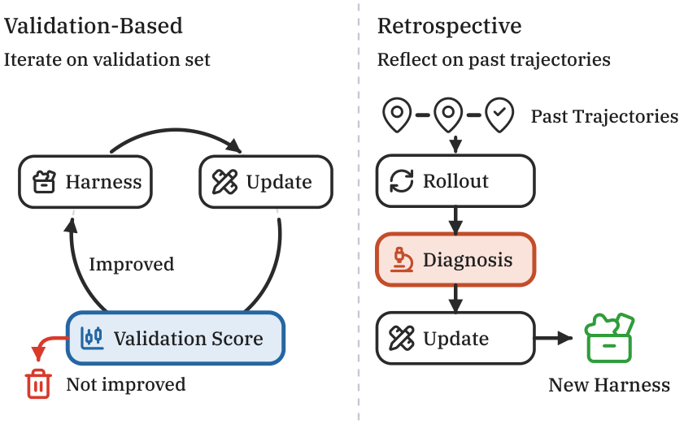
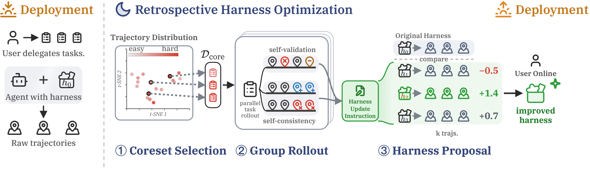
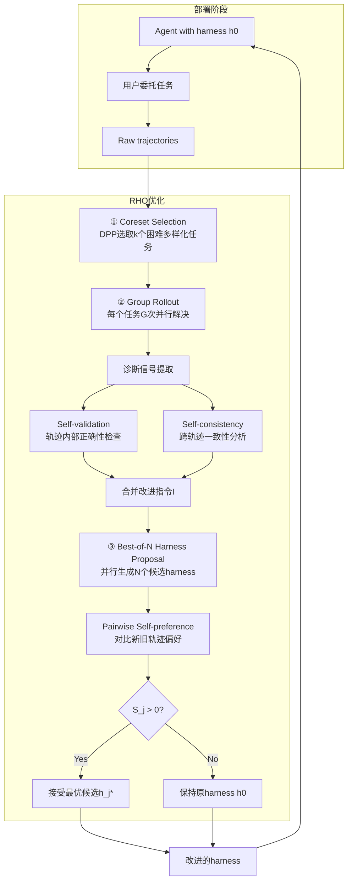
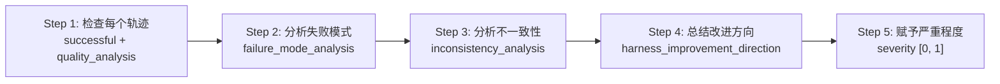
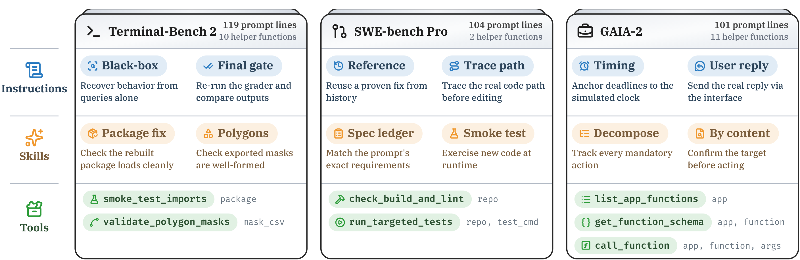
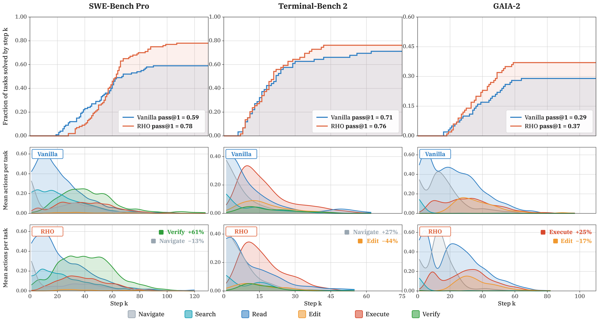
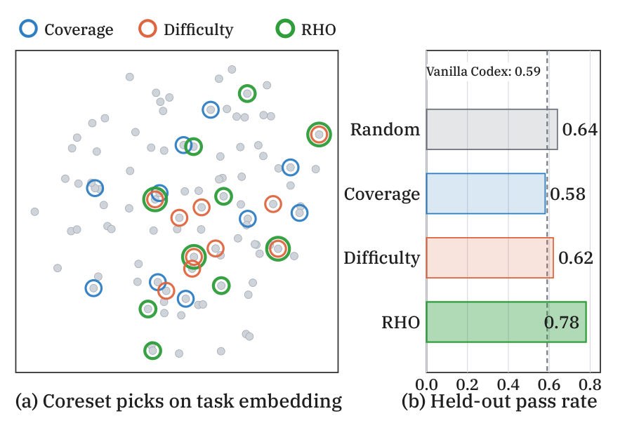
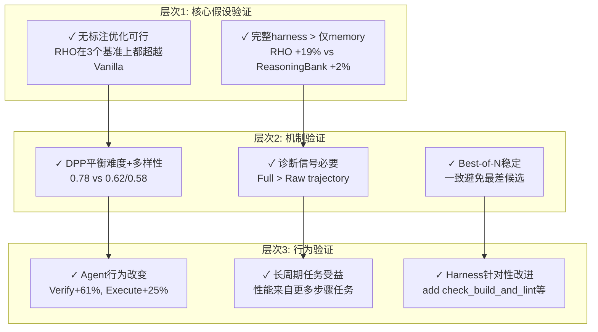

# Retrospective Harness Optimization (RHO) 论文调研报告

## 📋 基本信息

<p align="center"><b>表1：论文基本信息</b></p>

| 项目 | 内容 |
|-----|------|
| 论文标题 | Evolving Agents in the Dark: Retrospective Harness Optimization via Self-Preference |
| 作者 | Wenbo Pan¹, Shujie Liu², Chin-Yew Lin², Jingying Zeng², Xianfeng Tang², Xiangyang Zhou², Yan Lu², Xiaohua Jia¹ |
| 机构 | ¹City University of Hong Kong, ²Microsoft Research Asia |
| 发表时间 | 2026年6月 (arXiv:2606.05922v2) |
| 目标会议 | EMNLP 2026 |
| 论文链接 | https://arxiv.org/abs/2606.05922 |
| 项目主页 | https://paper-rho.wenbo.io |
| 代码仓库 | https://github.com/wbopan/retro-harness |
| 博客(中文) | https://www.wenbo.io/blog/zh/rho-dynamic-workflow/ |
| 博客(英文) | https://www.wenbo.io/blog/rho-dynamic-workflow/ |
| 许可证 | MIT |

---

## 1. 研究背景与动机

### 1.1 问题定义

AI Agent依赖**harness（工具包）**来完成复杂任务。论文对harness做了严格的形式化定义：

> 一个harness $h$ 是Agent可用于解决任务的工具、prompts和技能的持久集合。

给定任务 $t$ 和harness $h$，Agent通过推理-行动-观察的循环来尝试任务。这个多步骤过程生成**轨迹 $\tau$**，记录Agent读取的信息、思考链、使用的工具和最终输出。执行过程记为 $\tau = \mathrm{solve}(h, t)$。

随着Agent执行多个任务，它产生轨迹数据集 $\mathcal{D} = \{\tau_1, \tau_2, \ldots, \tau_n\}$。这些轨迹包含失败案例和有用洞察，可用于改进harness。

**优化目标**：找到最优harness $h^\star$，使其最大化未来任务的期望效用：

$$h^\star = \arg\max_{h'} \; \mathbb{E}_{t,\, \tau \sim \mathrm{solve}(h', t)} \left[ U(t, \tau) \right]$$

其中 $U(t, \tau)$ 是衡量轨迹质量的潜在效用函数。

### 1.2 研究动机

**核心矛盾**：

| 维度 | 验证反馈优化 | 回顾性优化 |
|-----|------------|---------|
| 数据要求 | 需要标注验证集 | 仅需过去轨迹 |
| 数据可得性 | 实际部署中难以收集 | Agent持续运行自然产生 |
| 信号来源 | 外部真实标签 | Agent内部自偏好 |

论文提出了**中心问题**：

> 当我们只能访问过去的轨迹时，能否改进Agent harness以提升未来性能？

**现有方法的两大局限性**：

1. **验证反馈优化**（OPRO、DSPy、TextGrad、ADAS、Meta-Harness）：全部依赖标注验证集迭代搜索。在实际部署中，收集能准确估计未来任务分布的验证集非常困难。

2. **经验积累方法**（Dynamic Cheatsheet、ReasoningBank、MemMA、Sleep-time Compute）：虽然不依赖标注，但只丰富了Agent的memory/context/skill list，**harness其余部分保持不变**。RHO与此不同——它优化**完整harness**，包括可执行工具和指令，而非仅优化memory。

### 1.3 研究目标

提出**Retrospective Harness Optimization (RHO)**，一种自监督方法：
- **仅使用过去的轨迹**优化Agent harness
- **无需任何外部标注或验证集**
- 通过单次回顾性过程（single retrospective pass）改进harness
- 优化**完整harness**（Skills + Tools + Instructions），而非仅Memory

---

## 2. 核心贡献

### 2.1 主要贡献

<p align="center"><b>表2：论文主要贡献</b></p>

| 编号 | 贡献描述 |
|-----|---------|
| C1 | 提出**回顾性harness优化**（retrospective harness optimization），首次解决仅从未标注轨迹改进完整harness（包括memory、context、skills、tools）的问题。填补了现有方法在"无需标注"和"优化完整harness"两个维度上的空白 |
| C2 | 在三个不同领域（软件工程、技术工作、知识工作）评估RHO，证明回顾性分析持续优于直接经验积累，并在可比预算下超越验证反馈驱动的进化 |
| C3 | 提供harness优化对Agent性能影响的定量分析，证明收集有效改进信号会导致harness的针对性改变并优化Agent行为。具体展示了RHO如何使Agent行为转向验证和执行，并在长周期任务上维持更高准确率 |

### 2.2 创新点

1. **方法创新**：
   - 首个满足"无标注 + 优化完整harness + 单次执行"三个条件的方法（见附录Table 5对比）
   - 引入**self-preference（自偏好）**作为无标注环境下的优化信号，替代传统的验证集分数
   - 将harness优化从一个**搜索问题**（需要外部反馈迭代）重新定义为一个**回顾性分析问题**（从自身轨迹提取信号）

2. **技术创新**：
   - 使用**DPP（行列式点过程）**进行coreset选择，平衡难度和多样性
   - 提出**self-validation**和**self-consistency**两个诊断信号维度
   - 采用**best-of-N harness proposal**策略 + 严格正阈值接受门提高稳定性
   - Harness表示为无固定schema的文件目录（prose + scripts + config并列），而非仅prompt文本

3. **实验创新**：
   - 在SWE-Bench Pro上实现**59% → 78%**的显著提升（+19%），不需要任何标注
   - 单次优化即超越需要验证集的Meta-Harness方法（0.78 vs 0.62）
   - 深入分析优化后harness的内容和Agent行为变化模式

---

## 3. 方法详解

### 3.1 方法概述

RHO的核心思想：**Agent的轨迹本身就包含了改进它所需的信号**。通过重新解决过去的任务并比较结果，可以暴露harness的失败点并找到修复方案。

RHO与传统方法的本质区别（Figure 1）：



*Figure 1: RHO与传统验证反馈harness优化的对比。验证反馈方法迭代对照标注验证集，而RHO从过去轨迹中通过单次回顾性过程优化，无需真实标签。*

**三阶段流程**：
1. **Coreset Selection**：从过去轨迹中选择有代表性的困难任务子集
2. **Group Rollout**：对每个任务并行生成多个轨迹，提取诊断信号
3. **Best-of-N Harness Proposal**：生成N个候选harness，选择最优的

### 3.2 整体架构



*Figure 2: The RHO pipeline. Coreset Selection从过去轨迹中用DPP选取少量困难多样化任务子集。Group Rollout对每个任务重解决G次，诊断内部轨迹失败（self-validation）和跨轨迹不一致（self-consistency）。Harness Proposal采样N个候选harness，保留其rollout最被偏好的那个。整个过程不使用真实标签。*



**架构文字描述**：

RHO的架构是一个从部署→回顾→再部署的闭环：

- **部署阶段**：Agent使用harness $h_0$ 处理用户委托的任务，产生原始轨迹集合 $\mathcal{D}$
- **回顾性优化**（三阶段）：
  - 阶段1：从 $\mathcal{D}$ 中选取coreset $\mathcal{D}_{\mathrm{core}}$
  - 阶段2：对coreset中每个任务做 $G$ 次并行rollout，提取self-validation和self-consistency信号
  - 阶段3：根据诊断指令生成 $N$ 个候选harness，用pairwise self-preference选择最优，仅在 $S_j > 0$ 时接受更新
- **再部署**：Agent使用改进后的harness处理新任务

**关键设计决策**：
1. **同一骨干模型**执行所有角色（solve、judge、diagnose、optimize、rank），角色分离通过workspace内容而非更换模型实现——这避免了"更强judge"的混淆因素
2. **严格正阈值**（$S_j > 0$而非 $S_j \geq 0$）：因为self-preference是噪声估计器，打破零分偏向"改变"会增加回归风险
3. **Harness表示为目录**而非prompt文本：optimizer是code-agent invocation，可以add/remove/modify任何文件，保持action space与representation一致

### 3.3 核心算法

```
Algorithm 1: 单轮RHO。同一骨干模型实例化每个运算符
  (judge, solve, optimize, rank)，仅在输入上不同，
  不查询任何真实标签。

Input: 过去轨迹 D={(t_i, τ_i)}_i, harness h_0,
       coreset大小k, 组大小G, 候选数N, DPP权重θ
Output: 更新后harness h*

STAGE 1 — CORESET SELECTION
1: r_i ← judge(t_i, τ_i)  ∀(t_i, τ_i) ∈ D
2: D_core ← DPP-GREEDY({(t_i, r_i)}; θ, k)

STAGE 2 — GROUP ROLLOUT
3: for t ∈ D_core in parallel do
4:   {τ_{t,g}}_{g=1}^G ← solve(h_0, t)    ▷ k×G rollouts
5:   τ_t^{(0)} ← τ_{t,1}                    ▷ 固定baseline rollout
6:   I_t ← rank_val(t, {τ_{t,g}}) ∪ rank_con(t, {τ_{t,g}})
7: end for
8: I ← ∪_{t∈D_core} I_t

STAGE 3 — BEST-OF-N HARNESS PROPOSAL
9: for j = 1, ..., N in parallel do
10:  h_j ← optimize(h_0, I)
11:  τ_t^{(j)} ← solve(h_j, t)  ∀t ∈ D_core    ▷ N×k re-solves
12:  S_j ← (1/k) Σ_{t∈D_core} rank(t, τ_t^{(j)}, τ_t^{(0)})
13: end for
14: j* ← argmax_j S_j
15: return h_{j*} if S_{j*} > 0, else h_0
```

<p align="center"><b>表3：算法步骤解读</b></p>

| 步骤 | 操作 | 输入 | 输出 | 设计意图 |
|-----|-----|-----|-----|---------|
| Step 1 | 难度评估 | 每个轨迹(t_i, τ_i) | 难度分数r_i + 文字指纹 | 为DPP提供难度维度 |
| Step 2 | DPP选择 | {(t_i, r_i)} + θ + k | Coreset D_core | 平衡难度和多样性 |
| Step 3-4 | 并行solve | D_core + h_0 | G组轨迹 | 为诊断提供多角度观察 |
| Step 5 | 固定baseline | 第1组轨迹 | τ_t^{(0)} | 为pairwise ranking提供锚点 |
| Step 6 | 诊断分析 | 任务 + G组轨迹 | 改进指令I_t | 提取self-validation + self-consistency信号 |
| Step 9-10 | Harness优化 | h_0 + I | N个候选h_j | 并行采样增加多样性 |
| Step 11 | 重新solve | 候选h_j + D_core | N组新轨迹 | 测试候选harness效果 |
| Step 12 | Self-preference评分 | 新旧轨迹对 | 评分S_j | 量化候选harness相对优势 |
| Step 14-15 | 选择最优 | 所有评分 | h* 或 h_0 | 严格正阈值确保不回归 |

### 3.4 关键模块详解

#### 模块A: Coreset Selection (§4.1)

**功能**：从大量轨迹中选择既困难又多样的子集，作为后续优化的目标

**核心公式**：

DPP核矩阵：
$$K = \mathrm{diag}(\widetilde{r}) \, S \, \mathrm{diag}(\widetilde{r})$$

难度权重：
$$\widetilde{r}_i = \left(\frac{\max(r_i, \epsilon)}{\max_j \max(r_j, \epsilon)}\right)^\alpha, \quad \alpha = \frac{\theta}{2(1-\theta)}$$

其中：
- $r_i \in [0, 10]$：LLM judge评估的难度分数（0-2 trivial, 3-5 moderate, 6-8 hard, 9-10 very hard）
- $S_{i,j}$：基于任务指纹embedding的余弦相似度矩阵，指纹embedding使用BAAI/bge-large-en-v1.5（1024维）
- $\theta = 0.7$：控制难度vs多样性的权衡
- $\epsilon = 0.1$：难度分数下限
- DPP选取子集 $Y$ 的概率正比于核行列式 $\det(K_Y)$

**$\theta$ 和 $\alpha$ 的设计逻辑**：
- $\theta = 1$：纯难度排序（$\alpha \to \infty$，仅保留最高难度）
- $\theta = 0$：纯多样性（$\alpha \to 0$，均匀权重）
- $\theta = 0.7$：$\alpha = 0.7 / 2(1-0.7) = 0.7/0.6 \approx 1.17$
- 因子2的设计：使 $\theta$ 和 $1-\theta$ 直接加权难度和多样性项（因为在 $\log\det K$ 中难度项出现两次）

**LLM Judge的设计**（附录B.2）：

Judge的prompt要求输出一个JSON对象：
```json
{
  "difficulty": <float in [0.0, 10.0]>,
  "abstract_fingerprint": "<3-5句结构化描述>"
}
```

指纹的设计原则极其关键——它要求使用**任务无关的结构词汇**（invariant, precedence, boundary, propagation等），而非代码库特定的名称（文件路径、函数名、库名等）。这使得不同代码库的指纹在余弦相似度下可比较。

**设计洞察**：
- 仅选难度：LLM judge将特定类型任务判为更难，导致样本聚集在窄区域（Figure 5(a) t-SNE可视化证实）
- 仅选多样性：可能遗漏关键困难任务，优化无有意义改进
- DPP平衡两者：覆盖多样化的困难场景（Figure 5(b)证实0.78 > 0.62/0.58/0.64）

#### 模块B: Group Rollout & Diagnosis (§4.2)

**功能**：通过并行执行和对比分析提取改进信号

**Self-validation ($\mathrm{rank}_{\mathrm{val}}$)**：

这一维度检查**单个轨迹内部**的正确性。Agent审视每个轨迹，对照任务要求和环境观察来判断目标是否高效完成。这利用了模型识别自身知识边界的部分能力（Pan et al., 2025）。具体操作：
- 标记错误的工具调用
- 标记错误假设
- 标记过早停止
- 这些标记方面作为相对表现较差轨迹的改进点

**Self-consistency ($\mathrm{rank}_{\mathrm{con}}$)**：

这一维度检查**跨轨迹**的行为一致性。低一致性通常表示高不确定性（Wang et al., 2022; Farquhar et al., 2024）。具体操作：
- 识别重要分歧：不同的计划、工具序列、最终答案
- 分析分歧的根因
- 生成优化指令鼓励更一致的行为

**诊断的5步工作流**（附录B.3详细prompt）：



**输出格式**（结构化JSON）：
```json
{
  "task_id": "...",
  "severity": 0.0-1.0,
  "trajectory_analyses": [
    {"trajectory": "trajectory_0", "successful": 1, "quality_analysis": "...", "issues": "..."},
    {"trajectory": "trajectory_1", "successful": 0, "quality_analysis": "...", "issues": "..."},
    {"trajectory": "trajectory_2", "successful": 1, "quality_analysis": "...", "issues": "..."}
  ],
  "failure_mode_analysis": "<markdown>",
  "inconsistency_analysis": "<markdown>",
  "harness_improvement_direction": "<一条高层简洁改进方向>"
}
```

**severity的设计**：severity不是硬阈值而是**软注意力权重**（soft attention weight）。优化器看到severity排序的诊断，可以合并或跳过冲突的建议，而非严格执行优先级队列。

**重要设计约束**：$G > 1$ 仅作为**诊断工具**进入pipeline——它通过跨轨迹不一致性增强指令 $I$，但**不投票选择**哪个候选胜出。pairwise ranking仅对比候选轨迹与固定baseline轨迹。

#### 模块C: Best-of-N Harness Proposal (§4.3)

**功能**：生成多个候选harness并选择最优

**关键公式**——候选harness的相对优势评分：
$$S_j = \frac{1}{|\mathcal{D}_{\mathrm{core}}|} \sum_{t \in \mathcal{D}_{\mathrm{core}}} \mathrm{rank}\!\left(t, \tau_{t}^{(j)}, \tau_{t}^{(0)}\right)$$

**Pairwise Ranking的设计**（附录B.5）：

- 呈现顺序：候选轨迹先（trajectory_A），baseline轨迹后（trajectory_B），然后对返回的整数取负。这是缓解pairwise judge中position bias的标准方法
- 返回格式：单个整数 $[-10, 10]$ + 一句rationale
- 解析失败处理：任何解析或执行失败**确定性返回0**（严格悲观主义——沉默失败将均值拉向拒绝阈值而非远离）
- 不重试

**Optimizer的设计**（附录B.4 + C.5）：

- optimize是**code-agent invocation**，而非受约束的文本重写器
- 它看到harness作为文件系统，可以add/remove/modify任何文件
- 诊断指令按severity降序排列，severity暴露为 $[0, 1]$ 范围的软注意力权重
- 新harness状态从目录本身恢复（不解析agent最终消息的diff）
- 保持了action space与representation的一致性

**接受门设计**（附录C.6）：

- 更新仅在最佳候选的coreset上均值pairwise分数严格正时接受
- 均值为0被拒绝（打破零分偏向"改变"的倾向）
- 如果optimizer失败、超时、或产出与输入相同的harness，候选被丢弃
- 如果所有候选被丢弃或所有 $S_j \leq 0$，harness保持不变——这是结果的一部分而非工具失败

**为什么需要Best-of-N**：
- Harness优化本质上是随机的（prior studies: Agrawal et al., 2025; Hu et al., 2024; Lee et al., 2026）
- 即使输入信号有效，也不保证可靠改进
- 通过采样和选择提高成功率，防止部署差的harness

### 3.5 关键技术

<p align="center"><b>表4：关键技术点</b></p>

| 技术点 | 描述 | 作用 | 论文对应位置 |
|-------|-----|-----|------------|
| DPP采样 | 基于行列式点过程的greedy MAP选择 | 平衡coreset的难度和多样性 | §4.1, Appendix B.2 |
| Self-validation | 轨迹内正确性检查 | 发现单轨迹错误、标记改进点 | §4.2, Appendix B.3 Step 2 |
| Self-consistency | 跨轨迹一致性分析 | 发现不确定性来源、分析分歧根因 | §4.2, Appendix B.3 Step 3 |
| Pairwise ranking | 成对轨迹比较（整数[-10,10]评分） | 评估候选harness相对优势 | §4.3, Appendix B.5 |
| Severity weighting | 诊断严重程度加权[0,1] | 作为软注意力而非硬优先级 | Appendix B.3 Step 5 |
| Best-of-N | 并行采样N个候选+偏好选择 | 提高优化稳定性，防止回归 | §4.3 |
| Harness-as-directory | harness表示为无schema文件目录 | 允许optimizer自由修改任何文件 | Appendix C.1 |
| Position bias mitigation | 候选先呈现，再取负 | 缓解pairwise judge的position bias | Appendix C.3 |
| Role separation by workspace | 同一模型通过workspace内容分离角色 | 避免模型更换的混淆因素 | Appendix C.2 |
| Abstract fingerprint | 任务无关结构词汇指纹 | 使不同代码库的指纹可比较 | Appendix B.2 |

### 3.6 方法设计的关键洞察

1. **轨迹包含改进信号**：
   Agent的失败和成功都蕴含在轨迹中。通过重新解决和比较可以提取这些信号，无需外部标注即可指导优化。这是RHO从"搜索范式"到"回顾性分析范式"的根本转变。

2. **难度+多样性的平衡**：
   仅选难度导致LLM judge偏好特定类型任务，样本聚集在窄区域；仅选多样性遗漏关键困难任务。DPP通过参数 $\theta$ 灵活控制，实验证明 $\theta=0.7$ 达到最佳。

3. **Self-preference作为代理指标**：
   真实效用函数 $U(t, \tau)$ 无法直接观测。Agent的自偏好可以近似轨迹质量，利用模型识别自身知识边界的能力（Pan et al., 2025）。但这是噪声估计器——因此需要严格正阈值和Best-of-N保障。

4. **完整harness优化**：
   现有经验积累方法仅优化memory/prompt。RHO优化工具+技能+指令，更灵活的改进空间带来更大性能提升（+19% vs +2~5%）。

5. **诊断不是偶然的**：
   消融实验证明：完整诊断 > 原始轨迹（0.78 > 0.60 on SWE Pro）。显式的self-validation和self-consistency信号是必要的而非偶然的。

6. **同一骨干模型原则**：
   所有角色用同一模型，角色分离通过workspace内容而非更换模型。这避免了"更强judge"的混淆——如果用不同模型做judge，measured gains可能归因于judge而非RHO本身。

### 3.7 与现有方法的核心区别

<p align="center"><b>表5：RHO满足的三个条件（对比现有方法）</b></p>

| 方法 | Harness表面 | 反馈信号 | 成本 | 无标注 | 优化完整harness | 单次执行 |
|-----|------------|---------|------|:---:|:---:|:---:|
| OPRO | Prompt | 验证metric | 迭代搜索 | ✗ | ✗ | ✗ |
| DSPy | Prompt+demos | 验证metric | 迭代搜索 | ✗ | ✗ | ✗ |
| TextGrad | Prompt | 文本梯度 | 迭代搜索 | ✗ | ✗ | ✗ |
| GEPA | Prompt | 验证metric+反思 | 迭代(genetic) | ✗ | ✗ | ✗ |
| ADAS | 完整Agent code | 验证accuracy | 25-30 iter | ✗ | ○(仅代码) | ✗ |
| Meta-Harness | 完整harness code | 搜索集score | ~20 iter | ✗ | ○(仅代码) | ✗ |
| Dynamic Cheatsheet | Cheatsheet文本 | 自判断 | 在线流 | ○ | ✗ | ✗ |
| ReasoningBank | Memory items | LLM-as-judge | 在线流 | ○ | ✗ | ✗ |
| MemMA | Memory entries | 合成probe QA | 在线(session) | ○ | ✗ | ✗ |
| Sleep-time Compute | 输入context | 无 | 预计算 | ○ | ✗ | ○ |
| SkillOS | Skill list | RL reward | RL训练 | ○ | ✗ | ✗ |
| **RHO** | **Tools+Skills+Instr.** | **Self-preference** | **单次** | **✓** | **✓** | **✓** |

注：✓ 满足, ○ 部分, ✗ 不满足

**RHO是唯一同时满足三个条件的方法**：
- **无标注**：不使用验证集或真实标签
- **优化完整harness**：编辑可执行工具和技能，而非仅memory或prompt
- **单次执行**：一次性回顾性过程，而非迭代搜索或在线流

---

## 4. 代码实现分析

### 4.1 代码仓库概述

<p align="center"><b>表6：代码仓库信息</b></p>

| 项目 | 内容 |
|-----|------|
| 仓库地址 | https://github.com/wbopan/retro-harness |
| 主要语言 | Python 3.11+ |
| 代码行数 | protocols.py: 183行, loop.py: 478行 |
| 开源时间 | 2026年6月 |
| 依赖管理 | uv (pyproject.toml) |
| 核心依赖 | fastapi, fastembed, litellm, nltk, numpy, tenacity, tiktoken, uvicorn |
| 许可证 | MIT |

### 4.2 目录结构

```
retro-harness/
├── src/rho/                          # 核心代码
│   ├── __init__.py
│   ├── __main__.py                   # 入口
│   ├── cli.py                        # CLI接口 (rho evolve/solve/ui)
│   ├── loop.py                       # RHO进化循环（核心！478行）
│   ├── protocols.py                  # typing.Protocol接口定义（183行）
│   ├── observability.py              # 可观测性/使用量提取
│   ├── reporting.py                  # 报告生成
│   ├── agent/                        # Agent适配层
│   │   └── base.py                   # Agent基类
│   ├── selection/                    # Coreset选择
│   │   ├── dpp.py                    # DPP greedy MAP实现
│   │   ├── coverage.py               # 纯覆盖选择
│   │   └── difficulty.py             # 纯难度选择
│   ├── strategies/                   # Harness-proposal策略
│   │   ├── rho_strategy.py           # RHO策略实现
│   │   └── ...                       # 无反馈基线策略
│   ├── orchestrators/                # Solve/evaluate编排
│   │   ├── solve.py                  # solve_in, solve_workspace
│   │   └── evaluate.py              # evaluate (pairwise ranking)
│   ├── datasets/                     # 数据集加载器
│   │   ├── swebench_pro.py           # SWE-Bench Pro
│   │   ├── terminal_bench_2.py       # Terminal-Bench 2
│   │   ├── gaia2.py                  # GAIA-2
│   │   └── locomo.py                 # LOCOMO
│   ├── reasoningbank/               # ReasoningBank基线
│   ├── meta_harness/                # Meta-Harness基线
│   ├── stores/                      # 轨迹+harness存储
│   └── webui/                       # Run浏览器前端
├── configs/                          # Codex CLI后端配置(TOML)
├── data/                             # 数据文件(如locomo10.json)
├── scripts/                          # 图表绘制和分析脚本
├── docs/                             # CLI帮助等文档
├── tests/                            # 测试(pytest-xdist并行)
├── .claude/workflows/
│   └── retrospection.js              # Claude Code动态工作流版本
└── codex/
    └── retrospection.py              # Codex CLI版本（纯标准库）
```

### 4.3 核心模块分析

#### 4.3.1 核心数据结构 (`protocols.py`)

```python
# 轨迹：记录一次Agent执行的完整信息
@dataclass(frozen=True)
class Trajectory:
    id: str
    kind: TrajectoryKind          # "solve" | "evaluate" | "optimize" | "diagnose"
    task_id: str
    harness_id: str               # 对应论文中的h_j
    instructions: str             # Agent接收的指令
    events: list[dict[str, Any]]  # 事件流（思考链、工具调用等）
    final_message: str            # Agent最终输出
    stdout: str                   # 标准输出
    stderr: str                   # 标准错误
    workspace_diff: dict[str, bytes]  # 工作空间文件变更
    workspace_deletions: frozenset[str]  # 删除的文件
    exit_code: int                # 退出码
    wall_time_s: float            # 墙钟时间
    timed_out: bool = False       # 是否超时
    stage: str | None = None      # 运行阶段标记
    round_ix: int | None = None   # 轮次索引
    sample_index: int | None = None  # 采样索引

# 评分：pairwise ranking结果
@dataclass(frozen=True)
class Score:
    value: int        # [-10, 10]整数，对应论文rank函数
    rationale: str    # 一句评分理由

# 诊断：对应论文中的I_t
@dataclass(frozen=True)
class Diagnosis:
    task_id: str
    trajectory_analyses: list[TrajectoryAnalysis]  # 每轨迹分析
    failure_mode_analysis: str      # 对应self-validation
    inconsistency_analysis: str     # 对应self-consistency
    harness_improvement_direction: str  # 高层改进方向
    severity: float = 1.0          # 软注意力权重 [0, 1]

# 核心Protocol接口（所有组件可替换）
@runtime_checkable
class Harness(Protocol):
    @property
    def id(self) -> str: ...
    def materialize(self, dest: Path) -> None: ...  # 将harness写入目录

class Task(Protocol):
    @property
    def id(self) -> str: ...
    def query(self) -> str: ...      # 自然语言任务描述
    def grade(self, trajectory, ...) -> Grade: ...  # 评分

class OptimizeStrategy(Protocol):
    def propose_candidates(self, *, agent, harness, 
        tasks_with_trajectories, harness_store, 
        traj_store, workdir, n_samples, round_ix
    ) -> OptimizeStrategyResult: ...  # 对应论文Stage 2+3
```

**论文概念→代码实现的映射**：

| 论文概念 | 代码类 | 关键字段 |
|---------|--------|---------|
| 轨迹 $\tau$ | `Trajectory` | id, kind, events, final_message, workspace_diff |
| harness $h$ | `Harness` (Protocol) | id, materialize() |
| 任务 $t$ | `Task` (Protocol) | id, query(), grade() |
| 评分rank() | `Score` | value (int [-10,10]), rationale |
| 诊断 $I_t$ | `Diagnosis` | severity, failure_mode_analysis, inconsistency_analysis |
| 优化策略 | `OptimizeStrategy` (Protocol) | propose_candidates() |

#### 4.3.2 核心算法实现 (`loop.py`)

**RHO进化主循环** (`run_evolution`, 478行)：

```python
def run_evolution(
    *, train, n_rounds, agent, harness_store,
    traj_store, workdir, rounds_dir,
    initial=None, strategy, optimize_samples=3,
    solve_workers=None,
) -> tuple[Harness, list[RoundResult]]:
    current = initial or harness_store.empty()
    history = []
    tasks = list(train)
    for round_ix in range(n_rounds):
        result = run_round(round_ix, current, tasks, agent, ...)
        if result.accepted:
            current = result.candidate  # 仅在S_j > 0时更新
        history.append(result)
    return current, history
```

**单轮执行** (`run_round`) 的4个关键步骤：

1. **并行solve** (Step 1)：每个任务执行 $G=3$ 次
   ```python
   solve_items = [(task, i) for task in tasks for i in range(3)]
   all_trajs = _parallel_map(_solve_one, solve_items, max_workers=solve_workers)
   task_trajs = [all_trajs[i*3:(i+1)*3] for i in range(len(tasks))]
   before = [group[0] for group in task_trajs]  # 固定baseline
   ```

2. **策略分析** (Step 2)：调用strategy.propose_candidates()，产生诊断和候选
   ```python
   result = strategy.propose_candidates(
       agent=agent, harness=current,
       tasks_with_trajectories=list(zip(tasks, task_trajs)),
       n_samples=optimize_samples, ...
   )
   ```

3. **候选评估** (Step 4)：每个unique候选在每个任务上重新solve + pairwise ranking
   ```python
   # solve after: 每个候选在每个任务上solve一次
   after_results = _parallel_map(_solve_after, after_items)
   # pairwise ranking: 每个候选在每个任务上与baseline对比
   eval_results = _parallel_map(lambda item: evaluate(
       agent, item[2], before[item[1]], 
       candidate_pool[item[0]].after_trajs[item[1]], ...
   ), eval_items)
   ```

4. **选择最优**：mean_score最高的候选，仅在 > 0 时接受
   ```python
   winner = max(candidate_pool, key=lambda cr: cr.mean_score)
   accepted = winner.mean_score > 0  # 严格正阈值
   ```

**Harness Diff的持久化**：

```python
def _write_harness_diff(before: Harness, after: Harness, dest: Path):
    # materialize两个harness到临时目录
    # 用difflib.unified_diff生成标准patch格式
    # 保存到candidate_harness_diff.patch
```

### 4.4 配置参数详解

<p align="center"><b>表7：配置参数说明</b></p>

| 参数 | 默认值 | 说明 | 论文对应 |
|-----|-------|------|---------|
| Model | Codex gpt-5.5 | 所有角色共用同一模型 | §5 Setup |
| Reasoning effort | high | 所有角色统一 | §5 Setup |
| Temperature | provider default | Codex reasoning模型不暴露temperature | Appendix C |
| `coreset_size` (k) | 10 | Coreset中任务数量 | §5 Setup |
| `group_size` (G) | 3 | 每个任务的并行rollout数 | §4.2 |
| `candidate_count` (N) | 3 | 候选harness数量 | §4.3 |
| `dpp_theta` | 0.7 | DPP难度/多样性权衡 | §4.1 |
| `score_floor` (ε) | 0.1 | 难度分数下限 | §4.1 |
| `solve_timeout` | 900s | 单任务执行超时（数据集可override） | Appendix C |
| `ranking_timeout` | 300s | 每次pairwise ranking超时 | Appendix C |
| `acceptance_threshold` | 0 (strict >) | 接受阈值 | §4.3 |
| Trajectory digest budget | 10,000 BPE tokens | 轨迹摘要token上限，head/tail截断 | Appendix C |
| Fingerprint embedding | BAAI/bge-large-en-v1.5 (1024d) | 本地执行 | Appendix C |
| Agent-call concurrency | 10 (cap 30) | 并行Agent调用数 | Appendix C |
| Persistence | full logs to disk | 所有prompts/completions/trajectories/diagnoses | Appendix C.7 |

### 4.5 论文-代码对应关系

<p align="center"><b>表8：论文概念与代码实现的对应关系</b></p>

| 论文概念 | 代码实现 | 文件位置 |
|---------|---------|---------|
| solve(h, t) | `solve_in()` + `solve_workspace()` | `src/rho/orchestrators/solve.py` |
| judge(t, τ) → r_i | LLM judge prompt | `appendix_a_prompts.tex` B.2 |
| DPP-GREEDY | `dpp_greedy_select()` | `src/rho/selection/dpp.py` |
| rank_val (self-validation) | Diagnosis prompt Step 2 | `appendix_a_prompts.tex` B.3 |
| rank_con (self-consistency) | Diagnosis prompt Step 3 | `appendix_a_prompts.tex` B.3 |
| optimize(h_0, I) | OptimizeStrategy.propose_candidates() | `src/rho/strategies/rho_strategy.py` |
| rank(t, τ_a, τ_b) | `evaluate()` | `src/rho/orchestrators/evaluate.py` |
| S_j > 0 acceptance gate | `accepted = winner.mean_score > 0` | `src/rho/loop.py:408` |
| Harness materialization | `Harness.materialize(dest)` | `src/rho/protocols.py:84-88` |
| run_evolution (多轮) | `run_evolution()` | `src/rho/loop.py:443-478` |
| run_round (单轮) | `run_round()` | `src/rho/loop.py:200-440` |

### 4.6 代码质量评估

<p align="center"><b>表9：代码质量评估</b></p>

| 维度 | 评分 | 说明 |
|-----|------|------|
| 模块化 | ⭐⭐⭐⭐⭐ | 基于Protocol的接口设计，所有组件（selector/strategy/dataset/agent）可替换。per-role消融等同于交换prompts和inputs而非模型 |
| 可配置性 | ⭐⭐⭐⭐⭐ | 丰富的配置参数，CLI支持多数据集extras，TOML配置文件 |
| 可扩展性 | ⭐⭐⭐⭐ | Protocol接口易于添加新selector/strategy，但当前仅支持Codex作为base agent |
| 文档 | ⭐⭐⭐⭐ | 详细README（含Claude Code和Codex CLI使用指南），CLI help文档 |
| 测试 | ⭐⭐⭐ | 包含hermetic和端到端测试，pytest-xdist并行（-n 50），但实际codex测试需要额外opt-in |
| 可复现性 | ⭐⭐⭐⭐⭐ | 完整日志持久化（prompts/completions/trajectories/diagnoses/diffs/scores），支持审计和重放 |

### 4.7 复现指南

**标准复现方式**（使用repo自带的CLI）：

```bash
# 1. 克隆仓库
git clone https://github.com/wbopan/retro-harness.git
cd retro-harness

# 2. 安装依赖
uv sync                       # 核心依赖
uv sync --extra swebench-pro  # SWE-Bench Pro数据集
uv sync --extra gaia2          # GAIA-2数据集

# 3. 配置Codex后端
cp configs/codex.chatgpt-default.toml my_config.toml
# 编辑设置API key和模型endpoint

# 4. 运行单轮优化
uv run rho evolve \
  --dataset locomo:data/locomo10.json \
  --rounds 1 \
  --codex-config my_config.toml

# 5. 解决单个任务
uv run rho solve --dataset <ds> --task <id> --harness <dir> --run-dir runs/demo

# 6. 浏览结果（Web UI）
uv run rho ui
```

**Claude Code用户快速体验**：

```
# 在Claude Code中运行动态工作流
Run the workflow at https://raw.githubusercontent.com/wbopan/retro-harness/main/.claude/workflows/retrospection.js on this project
```

工作流参数：
```js
{
  projectDir: "/path/to/project",  // 默认: 当前项目
  model: "opus",                   // 默认: session模型
  k: 8,                            // coreset大小（论文: 10）
  n: 2,                            // 候选harness数（论文: 3）
  probes: 4,                       // self-preference探测任务数
  maxSessions: 36, theta: 0.7,     // DPP参数
  apply: true                      // false = 仅暂存，不修改实际文件
}
```

**Codex CLI用户**：
```bash
python3 codex/retrospection.py --dry-run            # 列出会挖掘的session
python3 codex/retrospection.py                      # 对当前项目运行一轮
python3 codex/retrospection.py --project ~/my/app \
    --model gpt-5.5 --n 2 --probes 4 --no-apply     # 暂存结果不修改live文件
```

**每轮产出持久化位置**：
- Repo CLI: `runs/<timestamp>-<dataset>/`
- Claude Code: `~/.claude/rho-runs/<timestamp>-<project>/`
- 包含: digests, diagnoses, candidates, probe trajectories, scores, report.md, backup/

---

## 5. 实验分析

### 5.1 实验设置

#### 数据集

<p align="center"><b>表10：实验数据集</b></p>

| 数据集 | 任务类型 | 训练集(轨迹集) | 测试集(held-out) | 特点 | 来源 |
|-------|---------|:---:|:---:|------|-----|
| SWE-Bench Pro | 长周期软件工程 | 100 | 100 | 需要repository-level推理和多文件编辑；任务通过iff所有FAIL_TO_PASS和PASS_TO_PASS测试正确 | Deng et al., 2025 |
| Terminal-Bench 2 | 命令行任务 | 30 | 59 | 可执行grader（reward 0/1）；涵盖黑箱逆向、包修复、系统配置等 | Terminal-Bench Team, 2025 |
| GAIA-2 | 动态异步环境知识工作 | 100 | 100 | 环境独立于Agent演化；需要处理部分观察和异步事件 | Froger et al., 2026 |

**数据分割方式**：所有数据集使用SHA-256 hash排序，种子固定，确保可复现。

#### 评估指标

<p align="center"><b>表11：评估指标</b></p>

| 指标 | 定义 | 计算方式 |
|-----|-----|---------|
| Pass Rate | 在held-out测试集上的通过率 | 通过任务数 / 总任务数 |
| $\Delta$ | 相对Vanilla Codex的绝对提升 | RHO pass rate - Vanilla pass rate |
| Agent invocations | 优化阶段的Agent调用次数 | 计数persisted trajectory directories |
| Wall-clock time | 墙钟时间 | Σcodex (串行) vs end-to-end (10并发) |

#### 实现细节

- **基础Agent**：Codex CLI (OpenAI, 2025)
- **模型**：GPT-5.5 (OpenAI, 2026)，high reasoning effort
- **Coreset大小**：$k = 10$
- **并行采样**：$G = 3$（rollout），$N = 3$（候选）
- **DPP权重**：$\theta = 0.7$
- **优化轮数**：1轮（除非特别说明）
- **并发设置**：10并发Agent调用（cap 30），10并发grader

### 5.2 主实验结果

#### 与无反馈基线对比



*Figure 3: RHO在每个基准上生成的最高分harness。Instructions是任务无关的程序性规则，Skills记录grader或环境idiosyncrasies，Tools是可执行脚本。展示了每个harness的具体内容——包括prompt行数、helper函数数、新增技能和工具的名称及功能。*

<p align="center"><b>表12：与无反馈基线对比（Held-out Pass Rate）</b></p>

| 方法 | Harness架构 | SWE-Bench Pro | $\Delta$ | Terminal-Bench 2 | $\Delta$ | GAIA-2 | $\Delta$ |
|-----|------------|:---:|:---:|:---:|:---:|:---:|:---:|
| Vanilla Codex | None | 0.59 | n/a | 0.71 | n/a | 0.29 | n/a |
| Dynamic Cheatsheet | Skills | 0.62 | +0.03 | 0.73 | +0.02 | 0.30 | +0.01 |
| ReasoningBank | Memory | 0.61 | +0.02 | 0.73 | +0.02 | 0.28 | −0.01 |
| Sleep-time Compute | Memory | 0.64 | +0.05 | 0.73 | +0.02 | 0.32 | +0.03 |
| **RHO (ours)** | **Skills+Tools** | **0.78** | **+0.19** | **0.76** | **+0.05** | **0.37** | **+0.08** |

**关键发现**：
1. **RHO在所有三个基准上取得一致提升**，而基线方法提升不稳定（ReasoningBank在GAIA-2甚至下降）
2. **SWE-Bench Pro上19%绝对提升**（59% → 78%），无需任何验证标注
3. **RHO优化完整harness**（工具+技能+指令），而基线仅优化memory或文本技能——这解释了性能差距
4. **Self-preference可能贡献一致性**：基线的性能增益偏小且跨数据集变化，RHO通过偏好选择确保harness改进更可靠

**优化后Harness的具体内容**（Figure 3 + Appendix H完整内容）：

| 基准 | Instructions | Skills | Tools |
|-----|------------|-------|-------|
| **SWE-Bench Pro** | 104行prompt | Reference(复用已证明修复)、Trace path(编辑前追踪代码路径)、Spec ledger(匹配prompt精确需求)、Smoke test(运行时测试) | 2个helper函数: check_build_and_lint(发现非PATH工具链+标记生成文件)、run_targeted_tests(运行目标测试) |
| **Terminal-Bench 2** | 119行prompt | Final gate(重跑grader对比输出)、Package fix(确认安装包加载干净)、Polygons(验证exported masks格式正确)、Black-box(仅从查询恢复行为) | 10个helper函数: list_app_functions, get_function_schema, call_function, python_package_smoke.py, validate_mask_csv.py等 |
| **GAIA-2** | 101行prompt | Timing(锚定deadline到模拟时钟)、User reply(通过界面发送真实回复)、Decompose(追踪每个必须动作)、By content(确认目标后行动) | 11个helper函数: list_app_functions, get_function_schema, call_function等 |

**具体案例——SWE-Bench Pro的发现**：
- Agent发现Go工具链位于非标准路径 `/tmp/go/bin/go`
- 发现Python缓存目录必须在生成diff前清除（`__pycache__`, `.pyc`, `.pytest_cache`）
- 添加 `check_build_and_lint` 工具：定位非标准工具链 + 标记需排除的生成文件
- 修复了原始轨迹反复遗漏的diff-hygiene流程

**具体案例——Terminal-Bench 2的发现**：
- 添加 `python_package_smoke.py`：运行安装包冒烟测试（import + 编译检查）
- 添加 `validate_mask_csv.py`：验证polygon mask CSV输出的结构正确性
- 添加Final gate技能：运行精确的grader命令对比输出

#### 与验证反馈优化对比

<p align="center"><b>表13：RHO vs Meta-Harness（SWE-Bench Pro）</b></p>

| 方法 | 验证标注 | Agent调用次数 | SWE-Bench Pro |
|-----|---------|-------------|:---:|
| RHO | 无 | 103 (1.0×) | **0.78** |
| Meta-Harness (1轮) | 需要 | 41 (0.4×) | 0.62 |
| Meta-Harness (10轮) | 需要 | 320 (3.1×) | 0.80 |

**深度分析**：
- **单次RHO远超单次Meta-Harness**：0.78 vs 0.62，且RHO不需要标注
- Meta-Harness 1轮仅0.62的原因：其proposer读了每个候选的per-task scores + mean score + pass rate from history，但1轮历史太少，搜索空间未充分探索
- **Meta-Harness 10轮才达到0.80**，需要3.1×计算量+标注数据
- **RHO接近Meta-Harness的天花板**（0.78 vs 0.80），差距仅2%，但无标注+1/3计算量

### 5.3 深入分析

#### Agent行为变化



*Figure 4: RHO优化后的行为变化。左列：累积通过率vs步数——RHO在长周期任务上维持更高准确率。中列：优化前后每任务的平均action数——验证增加(Navigate减少)。右列：action类型分布——Verify +61% on SWE Pro, Execute +25% on TB2/GAIA-2。*

**关键观察**：

1. **长周期任务性能提升**：
   - 性能改进主要来自需要长周期（更多Agent步骤）任务的更高成功率
   - 短周期任务的改进较少——这在SWE-Bench Pro上最明显
   - RHO从Vanilla的0.59收敛到0.78，但优势集中在步骤数 > 60的任务

2. **工作模式的根本转变**：

<p align="center"><b>表14：优化前后Action Mix变化</b></p>

| 数据集 | 增加的Action | 减少的Action | 机制解释 |
|-------|------------|------------|---------|
| SWE-Bench Pro | Verify +61% | Navigate −13% | Agent学会了主动验证（check_build_and_lint, run_targeted_tests），减少了无目的的导航 |
| Terminal-Bench 2 | Execute +27% | Edit −44% | Agent学会了用新工具高效执行而非反复编辑 |
| GAIA-2 | Execute +25% | Edit −17% | Agent学会了主动调用app函数(call_function等)而非盲目编辑 |

3. **主动验证的价值**：
   - 在SWE-Bench Pro上，验证行为增加是性能提升的主要驱动力
   - Agent通过harness中的check_build_and_lint和run_targeted_tests工具，在提交答案前系统检查
   - 这直接解决了原始轨迹中反复出现的"diff-hygiene"失败模式

#### Coreset选择的影响



*Figure 5: SWE-Bench Pro上的Coreset选择。(a) 各选择策略在任务embedding t-SNE上的分布：Coverage散布开、Difficulty聚集在窄区域、RHO的DPP平衡两者。(b) 从各coreset优化的harness在held-out上的通过率。*

<p align="center"><b>表15：Coreset选择策略对比</b></p>

| 选择策略 | 特点 | SWE-Bench Pro | 原因分析 |
|---------|------|:---:|---------|
| Random | 随机选择 | 0.64 | 偶尔选到有用任务 |
| Pure Difficulty ($\theta=1$) | 仅难度 | 0.62 | LLM judge偏好特定类型任务→样本聚集→遗漏其他失败模式 |
| Pure Coverage ($\theta=0$) | 仅多样性 | 0.58 | 遗漏关键困难任务→优化信号不足 |
| **RHO DPP ($\theta=0.7$)** | **难度+多样性** | **0.78** | 覆盖多样化的困难场景→暴露多种失败模式 |

**关键发现**：
1. Difficulty选择导致LLM judge将特定类型任务判为更难，t-SNE显示样本聚集
2. Coverage选择样本散布但缺少困难任务，优化无有意义改进（接近Vanilla baseline）
3. **DPP平衡两者是必要的**——不是"差不多"，而是从0.62/0.58到0.78的质变

#### Best-of-N的稳定性

<p align="center"><b>表16：Best-of-N vs 单次采样</b></p>

| 数据集 | Mean（随机选择期望） | Chosen（RHO部署） | Std | Lowest（最差候选） |
|-------|:---:|:---:|:---:|:---:|
| SWE-Bench Pro | 0.79 | 0.78 | 0.06 | 0.73 |
| Terminal-Bench 2 | 0.74 | **0.76** | 0.03 | 0.71 |
| GAIA-2 | 0.34 | **0.37** | 0.03 | 0.32 |

**深度解读**：
- **所有候选都优于baseline**：即使最差候选（SWE Pro 0.73）也远优于Vanilla（0.59）
- **方差适中**：std 0.03-0.06，说明优化过程有一定随机性但不失控
- **Chosen不一定是最优**：SWE Pro上Mean(0.79) > Chosen(0.78)，说明self-preference不是完美选择器
- **但Chosen一致避免最差**：所有基准上Chosen > Lowest
- **TB2/GAIA-2上Chosen > Mean**：self-preference在这些基准上准确识别了更优候选

#### 诊断信号的贡献

<p align="center"><b>表17：诊断信号消融实验</b></p>

| 变体 | SWE Pro | TB 2 | GAIA-2 | 分析 |
|-----|:---:|:---:|:---:|------|
| Full diagnosis | **0.78** | **0.76** | **0.37** | 两个信号都使用 |
| −self-consistency | 0.56 | 0.75 | 0.27 | 移除跨轨迹一致性分析，SWE Pro暴跌22% |
| −self-validation | 0.70 | 0.73 | 0.30 | 移除轨迹内正确性检查，中等下降 |
| Raw trajectory | 0.60 | 0.75 | 0.29 | 直接给原始轨迹，跳过诊断 |

**关键结论**：
1. **Self-consistency对SWE-Bench Pro最关键**：移除后从0.78暴跌到0.56（−22%）。原因：软件工程任务需要跨多个文件的长期推理，多轨迹的分歧分析暴露了关键的不确定区域
2. **Self-validation对所有基准都有贡献**：移除后一致下降（−8%, −3%, −7%）
3. **两个信号互补而非冗余**：移除任一都有损害，但损害模式不同
4. **完整诊断远优于原始轨迹**：0.78 vs 0.60（SWE Pro）。显式诊断步骤产生的改进信号是**必要的而非偶然的**

### 5.4 计算成本分析

<p align="center"><b>表18：各方法的Agent调用次数（SWE-Bench Pro, k=10, M_test=100）</b></p>

| 方法 | Rollout | Diagnose | Optimize | After | Rank | Test | Total | LLM辅助 |
|-----|:---:|:---:|:---:|:---:|:---:|:---:|:---:|:---:|
| Vanilla Codex | 0 | 0 | 0 | 0 | 0 | 100 | 100 | 0 |
| ReasoningBank | 10 | 0 | 0 | 0 | 0 | 100 | 110 | 20 |
| Dynamic Cheatsheet | 30 | 0 | 10 | 10 | 10 | 100 | 160 | 0 |
| Sleep-time Compute | 30 | 0 | 30 | 30 | 30 | 100 | 220 | 0 |
| **RHO** | 30 | 10 | 3 | 30 | 30 | 100 | **203** | 0 |

<p align="center"><b>表19：Wall-clock时间（小时，10并发）</b></p>

| 方法 | SWE Pro Σcodex | SWE Pro 端到端 | TB2 Σcodex | TB2 端到端 | GAIA-2 Σcodex | GAIA-2 端到端 |
|-----|:---:|:---:|:---:|:---:|:---:|:---:|
| Vanilla Codex | 9.4 | 1.1 | 4.3 | 0.6 | 4.2 | 0.6 |
| RHO | 23.1 | 3.2 | 15.5 | 2.5 | 9.2 | 1.4 |

**关键观察**：
- RHO比Sleep-time Compute略便宜（203 vs 220调用），但贵于Dynamic Cheatsheet（203 vs 160，后者N=1）
- RHO的额外成本 vs Vanilla：103调用 = 3.2小时端到端（SWE Pro）
- 端到端/Σcodex比率反映并行效率：RHO ~7× speedup

### 5.5 实验结果总体分析

#### 验证层次结构



#### 核心结论

1. **回顾性优化是可行的**：
   Agent的轨迹包含足够的改进信号。无需外部标注即可指导harness进化，单次RHO在SWE-Bench Pro上从59%达到78%。

2. **完整harness优化是关键差异**：
   仅优化memory/prompt效果有限（+2~5%）。工具+技能+指令的组合提供更大改进空间（+5~19%）。

3. **诊断信号的设计至关重要**：
   Self-validation发现单轨迹错误；Self-consistency发现不确定性来源。两者结合产生可靠的改进方向，而原始轨迹分析不够。

4. **方法具有跨领域通用性**：
   软件工程（SWE-Bench Pro）、技术工作（Terminal-Bench 2）、知识工作（GAIA-2）三个不同领域都有效。

5. **RHO重塑了Agent的工作模式**：
   不仅提高通过率，还改变了Agent的action mix——从盲目导航/编辑转向主动验证/执行。

#### 适用边界

- **适用**：环境可重置、可重复执行的任务；Agent能力由可编辑harness中介；有足够历史轨迹
- **不适用**：一次性或不可逆任务；harness不可编辑（仅prompt）；对抗性环境（轨迹可能被注入恶意内容）
- **效率边界**：203次Agent调用 / 3.2小时端到端（SWE Pro）——资源受限场景需权衡

---

## 6. 相关工作

### 6.1 相关工作列表

<p align="center"><b>表20：相关工作列表</b></p>

| 论文/方法 | 年份 | 核心思想 | Harness表面 | 与本文关系 |
|----------|-----|---------|------------|-----------|
| OPRO (Yang et al.) | 2023 | LLM-as-optimizer搜索prompt | Prompt | 验证反馈家族，需标注 |
| DSPy (Khattab et al.) | 2023 | 声明式pipeline编译 | Prompt+demos | 验证反馈家族，需标注 |
| TextGrad (Yuksekgonul et al.) | 2024 | 文本梯度更新 | Prompt | 验证反馈家族，需标注 |
| GEPA (Agrawal et al.) | 2025 | 反思式prompt进化 | Prompt | 验证反馈家族，需标注 |
| ADAS (Hu et al.) | 2024 | 自动设计agentic系统 | 完整Agent code | 验证反馈家族，需标注，编辑完整代码 |
| Meta-Harness (Lee et al.) | 2026 | 端到端harness代码优化 | 完整harness code | **主要对比方法**，需标注，编辑完整代码 |
| Dynamic Cheatsheet (Suzgun et al.) | 2025 | 测试时自适应memory | Cheatsheet文本 | 无标注基线，仅memory |
| ReasoningBank (Ouyang et al.) | 2025 | 可复用推理模式 | Memory items | 无标注基线，仅memory |
| Sleep-time Compute (Lin et al.) | 2025 | 离线预计算context | 输入context | 无标注基线，仅预计算 |
| MemMA (Lin et al.) | 2026 | 多Agent协调memory循环 | Memory entries | 同期，仅memory |
| M* (Pan et al.) | 2026 | 任务特定memory harness | Memory program | **同一作者前期工作**，仅memory |
| SkillOS (Ouyang et al.) | 2026 | RL训练skill curator | Skill list | 同期，需RL训练+标注语料 |

### 6.2 本文与相关工作的区别

**vs 验证反馈优化**（OPRO→Meta-Harness）：
- **核心区别**：RHO无需标注数据，单次完成而非迭代搜索
- **优势**：适用于部署场景（标注难获取），效率更高
- **劣势**：单次优化无法像Meta-Harness 10轮迭代那样逼近天花板（0.78 vs 0.80）
- **关键洞察**：在可比1轮预算下，RHO远优于Meta-Harness（0.78 vs 0.62），证明回顾性信号比验证信号更有效

**vs 经验积累方法**（Dynamic Cheatsheet→Sleep-time Compute）：
- **核心区别**：RHO优化完整harness（工具+技能+指令），而非仅memory
- **优势**：更大的改进空间（+19% vs +2~5%）；使用self-preference而非简单self-judgment
- **劣势**：计算成本更高（203 vs 110~160调用）

**vs M*（同作者）**：
- M*每个任务家族发现特定memory harness，但仅优化memory
- RHO优化完整harness，包括可执行工具——这是关键进化

---

## 7. 局限性分析

### 7.1 论文声明的局限性

1. **环境要求**（§7, Limitations）：
   - Group rollout需要环境可重置和容忍重复尝试
   - **不适用于**一次性或不可逆任务（如某些real-world deployment中环境不可reset）

2. **Harness假设**：
   - 假设Agent能力由可编辑harness中介
   - 扩展到不同harness表面（如纯prompt、模型权重）、不同任务指纹方法、不同rollout预算是future work
   - 当前仅覆盖软件工程、技术工作、知识工作三类

3. **安全风险**（Ethics Statement）：
   - 信任过去轨迹作为唯一优化输入
   - 在开放环境中轨迹可能包含对抗性内容（Liu et al., 2026: WebTrap）
   - 从受损轨迹蒸馏的harness更新可能强化不良行为
   - **要求**：保持完整审计日志、敏感harness编辑需人工审批、高影响任务前做领域安全检查

### 7.2 发现的潜在问题

<p align="center"><b>表21：潜在问题分析</b></p>

| 问题类型 | 描述 | 影响 | 可能缓解 |
|---------|-----|------|---------|
| 方法层面 | Self-preference可能不准确：Agent可能偏好表面上更好但实质更差的轨迹 | 选择非最优候选 | 使用更强judge模型；引入人类反馈校准 |
| 方法层面 | 单次优化可能陷入局部最优 | 无法像迭代方法持续改进 | 多轮RHO（每轮使用新轨迹） |
| 实验层面 | 仅在3个基准上验证（软件工程+CLI+知识工作） | 更多领域验证必要 | 扩展到对话、决策、创意等领域 |
| 实验层面 | 仅用GPT-5.5作为骨干 | 不同模型可能不同效果 | 测试开源模型作为骨干 |
| 应用层面 | 计算成本较高（203调用/3.2小时） | 资源受限场景可能不适用 | 减少G/N；使用更轻量模型做diagnose |
| 伦理层面 | 可能放大错误偏好或不安全行为 | 部署后持续强化不良模式 | 人工审批流程；安全检查层 |
| 方法层面 | Pairwise ranking的position bias | 评分可能有系统偏差 | 已用候选先呈现+取负缓解，但未做per-call随机化 |

### 7.3 未来工作方向

1. **多轮RHO**：探索如何进行多轮优化（每轮用新积累轨迹）；结合验证反馈（如果有）和回顾性优化
2. **领域扩展**：应用到更多领域（对话、创意写作、决策等）；适配不同harness表面
3. **安全性增强**：开发轨迹审计机制；添加人工审批流程；领域安全检查框架
4. **效率优化**：减少计算成本（更少G/N）；更轻量模型做非solve角色；探索更高效coreset选择
5. **跨Agent迁移**：探索harness在不同Agent间的迁移性；研究harness的泛化能力

---

## 8. 个人评价

### 8.1 优点

1. **问题定义精准**：
   从实际部署痛点出发（标注数据难获取），而非技术驱动。明确区分"能做什么"和"需要什么"——这是一个practical problem而非仅academic exercise。

2. **方法设计优雅**：
   三阶段流程清晰，每个模块都有明确目的。DPP、self-validation、self-consistency、Best-of-N等技术选择都有理论和实验支撑。同一骨干模型原则避免混淆因素。

3. **实验充分且公平**：
   三个不同领域基准测试；详细消融实验（4个维度）；与多种基线公平对比（matched budget）；计算成本透明分析；行为变化深入分析。

4. **实用性强**：
   Claude Code和Codex CLI两种快速体验版本；代码完全开源；详细文档和配置。这不是仅存在于论文中的方法——用户今天就可以在自己的项目上使用。

5. **分析深入**：
   不仅报告性能提升数字，还解释为什么方法有效（行为转变、harness内容分析）。从现象→机制→因果的完整分析链。

6. **写作质量高**：
   论文结构清晰，prompt全部公开（Appendix B），超参数全部列出（Table 6），数据集分割详细说明（Appendix E），baseline适配过程完整描述（Appendix F）。

### 8.2 不足

1. **单次优化的局限**：
   无法像迭代方法那样持续改进。Meta-Harness 10轮达到0.80，RHO 1轮0.78——差距虽小但存在。

2. **Self-preference的准确性**：
   Table 3显示Chosen不一定最优（SWE Pro: Mean 0.79 > Chosen 0.78）。Self-preference是噪声估计器，需要Best-of-N兜底。

3. **计算成本**：
   203次Agent调用、3.2小时端到端（SWE Pro）。对小团队或个人开发者可能不现实。

4. **仅测试GPT-5.5**：
   所有实验使用同一模型。开源模型或较弱模型作为骨干的效果未知。

5. **安全性考虑偏声明性**：
   Ethics Statement提出风险但缺乏具体技术缓解方案。轨迹审计、安全检查等仍待实现。

6. **DPP的greedy MAP实现**：
   论文使用greedy MAP而非精确DPP采样。这可能影响选择质量，但论文未讨论近似误差。

### 8.3 适用场景

- ✅ **部署后持续改进**：Agent已积累大量轨迹，需定期优化harness
- ✅ **标注数据难以获取**：无法构建验证集（最典型场景）
- ✅ **环境可重置**：任务可重复执行（如软件工程、CLI任务）
- ✅ **完整harness可编辑**：工具、技能、指令都可修改
- ✅ **长周期复杂任务**：需要多步骤执行的软件工程/技术/知识工作
- ✅ **Claude Code/Codex CLI用户**：有现成的动态工作流可直接使用

### 8.4 不适用场景

- ❌ **一次性任务**：环境不可重置（如某些生产环境操作）
- ❌ **标注数据充足**：有高质量验证集时，Meta-Harness多轮迭代可能更好
- ❌ **资源极度受限**：无法承担额外203次Agent调用的计算成本
- ❌ **harness不可编辑**：仅能修改prompt文本（如某些SaaS API场景）
- ❌ **对抗性环境**：轨迹可能包含恶意注入内容
- ❌ **极短周期任务**：任务在少量步骤内完成，长周期改进优势不明显

---

## 9. 启发与思考

### 9.1 技术启发

1. **Self-preference作为通用信号**：
   不仅可用于harness优化，还可用于其他无标注的Agent改进任务（如skill选择、workflow设计）。核心洞察：Agent可以在无外部反馈的情况下比较自身输出质量。

2. **DPP在AI系统设计中的应用**：
   平衡难度+多样性的思想可迁移到主动学习、课程学习、测试集选择等场景。$\theta$ 参数的设计（通过 $\alpha$ 映射到核矩阵）是一个优雅的方案。

3. **完整harness优化的价值**：
   证明了工具+技能+指令的组合比单一memory更有效。未来Agent系统应该设计为**全面可优化**的——harness不仅包含prompt，还应包含可执行文件。

4. **诊断信号的维度设计**：
   Self-validation（内部正确性）和Self-consistency（外部一致性）是两个通用诊断维度。可用于其他Agent分析：RAG系统（答案正确性+多检索一致性）、多Agent协作（单Agent质量+Agent间一致性）。

5. **同一模型多角色的设计原则**：
   通过workspace内容而非更换模型实现角色分离。这避免了混淆因素，使消融实验更干净。

### 9.2 可借鉴之处

1. **问题定义方式**：从实际部署痛点出发，明确"settings"中的约束条件（无标注、完整harness、单次执行），然后证明这是唯一满足所有条件的方法。

2. **方法设计的模块化**：每个组件有明确职责（DPP选coreset → G rollout → diagnosis → N candidates → pairwise ranking），易于替换和改进。Protocol-based的代码设计反映了这一思想。

3. **实验设计的全面性**：多领域验证 + 4维度消融（coreset选择、Best-of-N、诊断信号、与验证反馈对比）+ 计算成本分析 + 行为变化分析。

4. **开源和可复现性**：完整代码 + 两种快速体验版本 + 详细文档。论文中的prompt全部公开。

5. **Harness-as-directory的设计**：将harness表示为无schema文件目录而非prompt字符串，这使optimizer可以自由操作任何文件类型——是"完整harness优化"的技术基础。

### 9.3 潜在改进方向

1. **多轮RHO + 渐进优化**：
   - 每轮使用新积累轨迹（而非固定benchmark split）
   - 结合验证反馈（如果有少量标注）和回顾性优化
   - 探索轮间harness diff的增量优化

2. **更高效的coreset选择**：
   - 近似DPP方法减少计算
   - 使用更轻量模型做difficulty judge
   - 动态调整 $\theta$（首轮偏难度，后续偏多样性）

3. **Self-preference的改进**：
   - 使用更强模型或人类反馈校准ranking
   - 引入per-call随机化消除position bias
   - 多次ranking取均值减少噪声

4. **安全性增强**：
   - 开发轨迹内容审计工具（检测对抗性注入）
   - 添加harness变更安全检查层（禁止某些危险操作）
   - 人工审批流程的可配置阈值

5. **跨Agent迁移**：
   - 探索harness在不同Agent（Claude/GPT/open-source）间的迁移
   - 研究harness泛化：同一harness在相似任务家族上的效果

6. **开源模型适配**：
   - 测试RHO在开源模型（如Llama、Qwen）上的效果
   - 研究self-preference在较弱模型上的准确性

### 9.4 后续行动

- [ ] 深入阅读Meta-Harness论文（arXiv:2603.28052），理解验证反馈优化的细节
- [ ] 研究DPP在主动学习和课程学习中的应用潜力
- [ ] 尝试在Claude Code上使用retrospection.js优化自己的项目
- [ ] 探索self-preference在RAG系统优化中的应用
- [ ] 研究如何结合少量验证反馈和回顾性优化
- [ ] 阅读M*论文（arXiv:2604.11811），理解同作者的memory harness进化思路
- [ ] 调研WebTrap（arXiv:2605.08310），理解轨迹对抗性注入风险

---

## 参考文献

```bibtex
@article{pan2026rho,
  title   = {Evolving Agents in the Dark: Retrospective Harness Optimization via Self-Preference},
  author  = {Pan, Wenbo and Liu, Shujie and Lin, Chin-Yew and Zeng, Jingying and Tang, Xianfeng and Zhou, Xiangyang and Lu, Yan and Jia, Xiaohua},
  journal = {arXiv preprint arXiv:2606.05922},
  year    = {2026}
}

@article{lee2026metaharness,
  title   = {Meta-Harness: End-to-end optimization of model harnesses},
  author  = {Lee, Yoonho and Nair, Roshen and Zhang, Qizheng and Lee, Kangwook and Khattab, Omar and Finn, Chelsea},
  journal = {arXiv preprint arXiv:2603.28052},
  year    = {2026}
}

@article{suzgun2025dynamiccheatsheet,
  title   = {Dynamic cheatsheet: Test-time learning with adaptive memory},
  author  = {Suzgun, Mirac and Yuksekgonul, Mert and Bianchi, Federico and Jurafsky, Dan and Zou, James},
  journal = {arXiv preprint arXiv:2504.07952},
  year    = {2025}
}

@article{ouyang2026reasoningbank,
  title   = {ReasoningBank: Scaling agent self-evolving with reasoning memory},
  author  = {Ouyang, Siru and Yan, Jun and Hsu, I-Hung and others},
  journal = {arXiv preprint arXiv:2509.25140},
  year    = {2025}
}

@article{lin2025sleeptime,
  title   = {Sleep-time compute: Beyond inference scaling at test-time},
  author  = {Lin, Kevin and Snell, Charlie and Wang, Yu and others},
  journal = {arXiv preprint arXiv:2504.13171},
  year    = {2025}
}

@article{hu2024adas,
  title   = {Automated design of agentic systems},
  author  = {Hu, Shengran and Lu, Cong and Clune, Jeff},
  journal = {arXiv preprint arXiv:2408.08435},
  year    = {2024}
}

@article{pan2026mstar,
  title   = {M*: Every task deserves its own memory harness},
  author  = {Pan, Wenbo and Liu, Shujie and Zhou, Xiangyang and others},
  journal = {arXiv preprint arXiv:2604.11811},
  year    = {2026}
}

@article{deng2025swebenchpro,
  title   = {SWE-Bench Pro: Can AI agents solve long-horizon software engineering tasks?},
  author  = {Deng, Xiang and others},
  journal = {arXiv preprint arXiv:2509.16941},
  year    = {2025}
}

@article{kulesza2012dpp,
  title   = {Determinantal point processes for machine learning},
  author  = {Kulesza, Alex and Taskar, Ben},
  journal = {Foundations and Trends in Machine Learning},
  volume  = {5},
  number  = {2-3},
  pages   = {123-286},
  year    = {2012}
}

@article{wang2022selfconsistency,
  title   = {Self-consistency improves chain of thought reasoning in language models},
  author  = {Wang, Xuezhi and Wei, Jason and Schuurmans, Dale and others},
  journal = {arXiv preprint arXiv:2203.11171},
  year    = {2022}
}
```

---

## 附录

### A. 关键图表

<p align="center"><b>表22：关键图表索引</b></p>

| Figure | 描述 | 报告内位置 | 文件 |
|--------|------|-----------|------|
| Figure 1 | RHO vs 验证反馈优化对比 | §3.2 | `assets/fig1_rho_comparison.png` |
| Figure 2 | RHO三阶段Pipeline | §3.2 | `assets/fig2_pipeline.png` |
| Figure 3 | 优化后Harness内容 | §5.2 | `assets/fig3_harness.png` |
| Figure 4 | Agent行为变化（action mix + 累积通过率） | §5.3 | `assets/fig4_behavior.png` |
| Figure 5 | Coreset选择消融（t-SNE + held-out） | §5.3 | `assets/fig5_coreset.png` |

### B. Mermaid流程图索引

<p align="center"><b>表23：Mermaid流程图索引</b></p>

| 图表 | 描述 | 报告内位置 |
|------|------|-----------|
| RHO三阶段闭环流程 | 从部署→回顾→再部署的完整闭环 | §3.2 |
| 诊断5步工作流 | self-validation + self-consistency的5步分析流程 | §3.4 模块B |
| 验证层次结构 | 核心假设→机制→行为的验证层次 | §5.5 |

### C. 补充材料

**论文中公开的5个完整Prompt**（附录B）：

1. **Solve wrapper prompt**（Listing 1）：task-agnostic，告知Agent读取harness/和task/目录
2. **Difficulty judge prompt**（Listing 2）：评估难度[0,10] + 生成abstract fingerprint
3. **Diagnosis prompt**（Listing 3）：5步工作流，输出结构化JSON
4. **Optimize prompt**（Listing 4）：severity作为软注意力，跨任务pattern matching，harness目录可自由修改
5. **Pairwise ranking prompt**（Listing 5）：整数[-10,10]评分 + 一句rationale

**论文中公开的完整Harness内容**（附录H）：
- SWE-Bench Pro: README.md(104行) + checklists/contract-verification.md + bin/repair-verify(完整bash脚本)
- Terminal-Bench 2: README.md(119行) + tools/python_package_smoke.py + tools/validate_mask_csv.py
- GAIA-2: README.md(101行) + 11个helper函数

### D. 调研信息

- **调研人**: AI Assistant
- **调研时间**: 2026-06-18
- **论文版本**: arXiv:2606.05922v2 (2026-06-10)
- **参考来源**:
  - 论文PDF: https://arxiv.org/pdf/2606.05922
  - arXiv源文件（含矢量图）: https://arxiv.org/e-print/2606.05922
  - 论文TeX源码: sec_method.tex, sec_discussion.tex, sec_experiments.tex, appendix_*.tex
  - GitHub仓库: https://github.com/wbopan/retro-harness
  - 代码核心文件: protocols.py, loop.py, pyproject.toml
  - 项目主页: https://paper-rho.wenbo.io
  - 博客(中文): https://www.wenbo.io/blog/zh/rho-dynamic-workflow/
  - 博客(英文): https://www.wenbo.io/blog/rho-dynamic-workflow/

---

*报告版本: v2.0*
*基于论文模板 v2.2*
