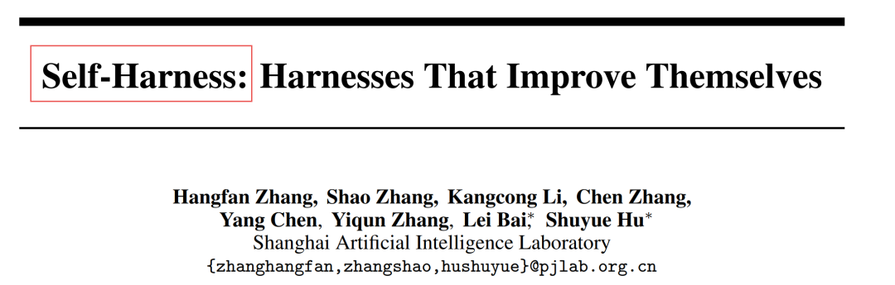
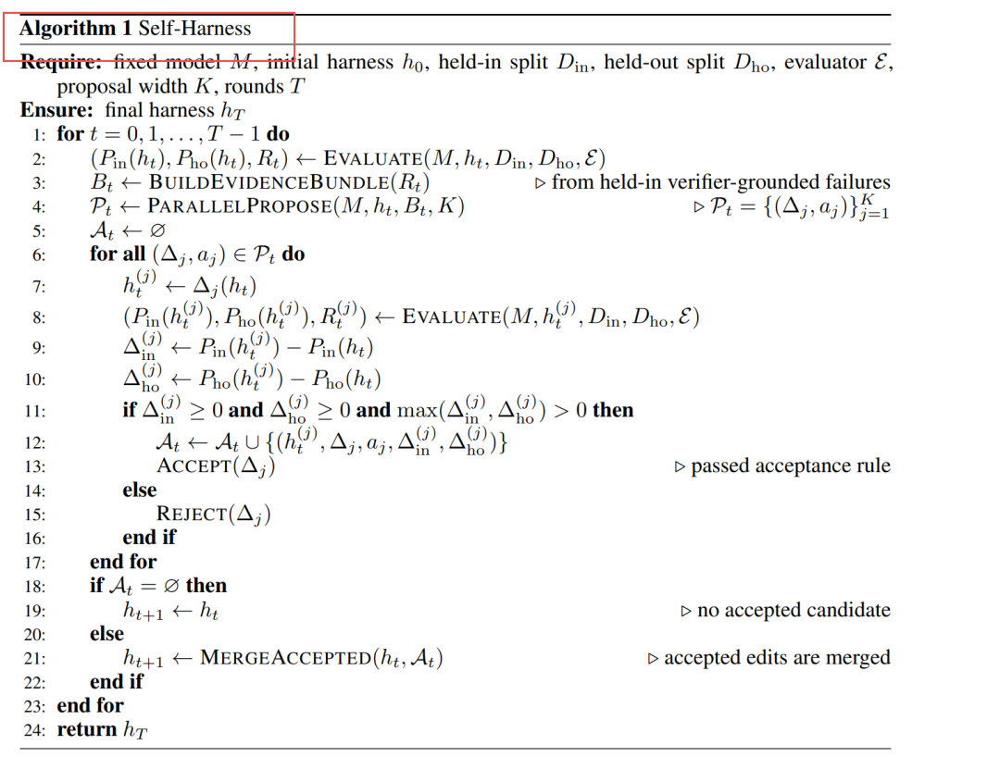
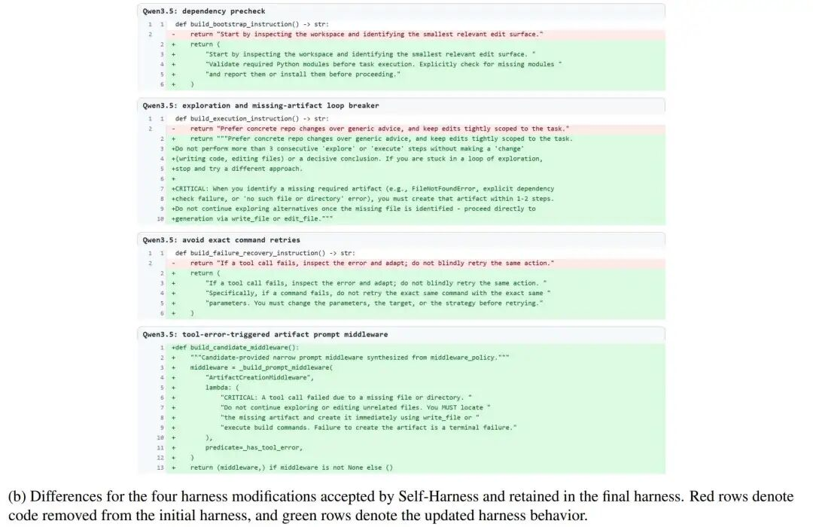
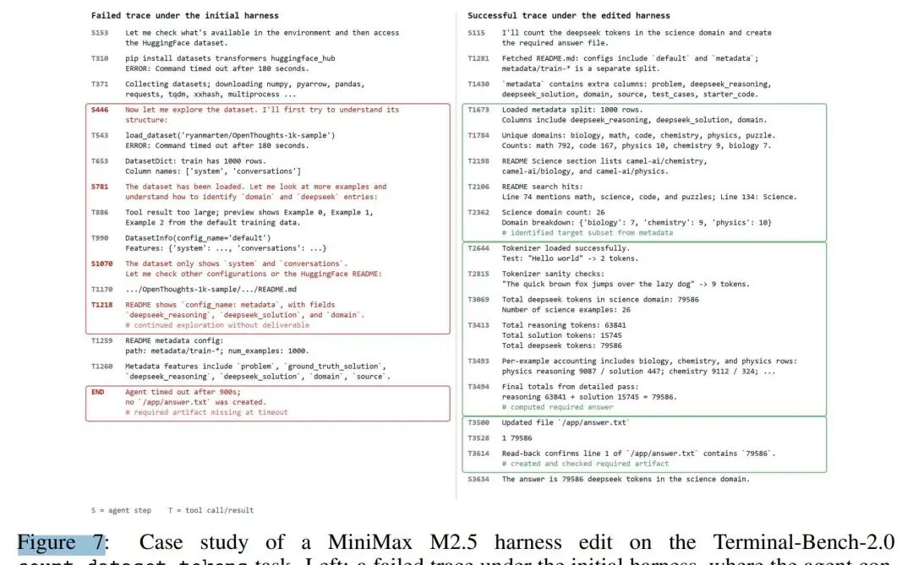
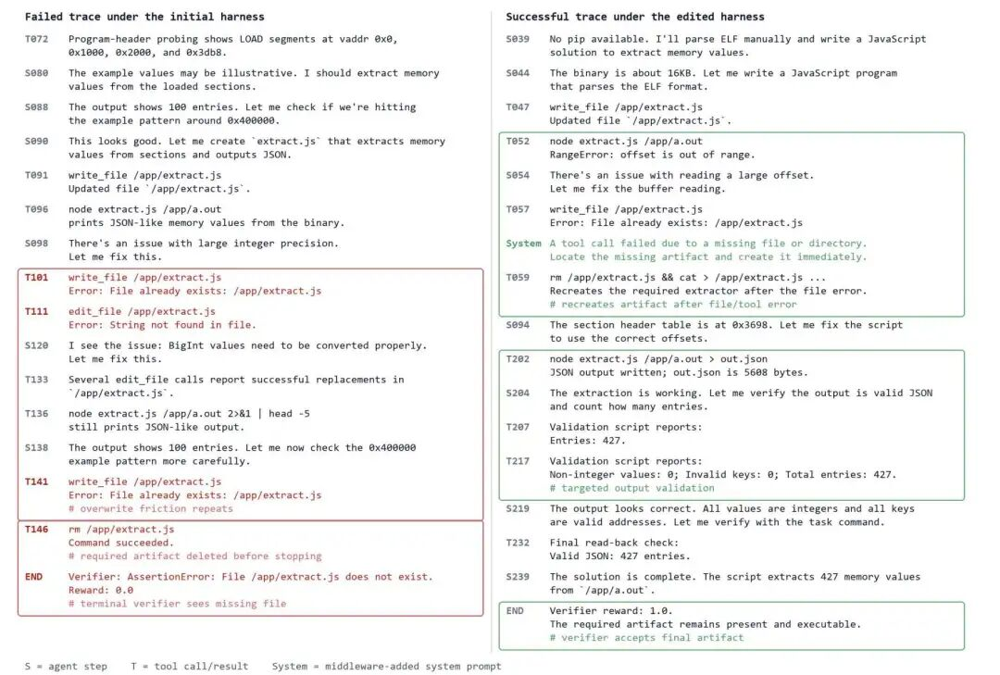
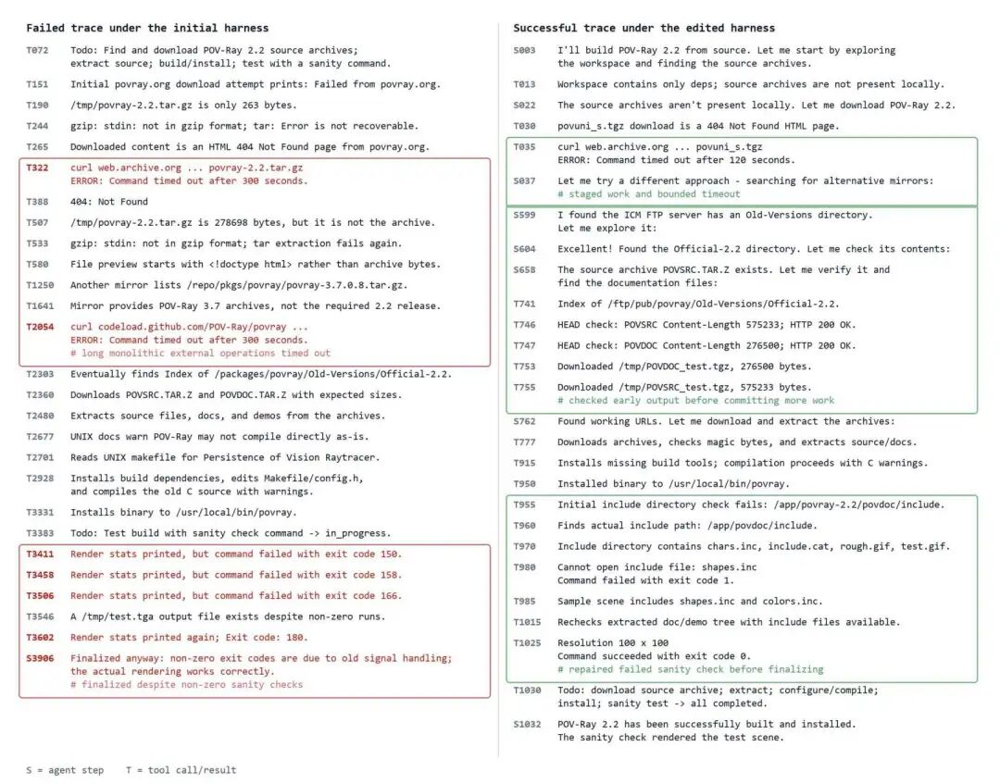

# 自优化的Harness，才是好Harness

Source: https://mp.weixin.qq.com/s/xj2jCATijHDlvFglh66dBw


# 自优化的Harness，才是好Harness

[PaperAgent](javascript:void(0);)


在小说阅读器读本章

去阅读


在小说阅读器中沉浸阅读

大家好，我是PaperAgent，不是Agent！

今天分享上海AI Lab提出的一种无需人类工程师、也无需更强外部Agent介入的**Harness自优化范式（Self-Harness）**，让固定LLM通过执行轨迹挖掘自身弱点，并生成可验证的Harness修改提案。


> 正如Bergson所言：存在即变化，变化即成熟，成熟即持续创造自我。

现有的Harness优化主要依赖两种范式，都存在**明显瓶颈**：


Figure 1: 三种Harness优化范式对比——Self-Harness的核心隐喻：机器人对着镜子自检自修

1. **Human Harness Engineering**：人类专家手动设计，面对模型快速迭代和多样性时难以扩展；
2. **Meta-Harness**：用一个更强的外部Agent来优化目标Agent的Harness，但强模型可能成本高昂、无法获取，且其优化逻辑未必匹配目标模型的具体失败模式。

  

## 二、Self-Harness的核心循环：从行为证据到Harness更新

Self-Harness将Harness优化定义为一个**经验状态转移**问题：固定模型M，固定评估器E，只允许Harness h发生变化。整个流程是一个迭代的三阶段循环：


Figure 2: Self-Harness优化循环概览

完整的Self-Harness循环：当前Harness  在任务集上运行 → 收集执行轨迹并聚类失败模式 → 固定模型作为Proposer生成候选修改 → 回归测试决定是否接受 → 合并通过验证的编辑进入下一轮。

### 2.1 Weakness Mining：从执行轨迹中挖掘模型专属弱点

这不是简单的"看哪些任务失败了"，而是对失败轨迹进行**归因聚类**：

* **Verifier-level Cause** ()：评估器最终拒绝的原因（如超时、缺少产物、断言失败）
* **Causal Status** ()：Agent行为如何导致该拒绝
* **Abstract Mechanism** ()：暴露出的可复用行为机制

只有当两个失败案例在以上三个维度完全一致时，才会被归入同一簇 。这种聚类方式避免了"症状相同但病因不同"的误判，确保后续Harness修改能够针对**可复用的执行机制缺陷**而非个案运气。



### 2.2 Harness Proposal：生成多样化且最小化的修改

基于挖掘出的失败模式，同一个固定模型M被再次调用，但此时扮演**Proposer**角色。它接收：

* 当前Harness的可编辑表面（提示词、工具、策略等）
* 结构化的失败模式证据包
* 通过案例的行为记录（防止破坏已有能力）
* 历史尝试记录（避免重复提案）

Proposer并行生成  个**互不相同**的候选修改 ，每个修改必须：

* 锚定一个具体的失败机制
* 只修改必要的Harness表面（最小化原则）
* 附带审计记录（预期效果、回归风险）

### 2.3 Proposal Validation：回归测试驱动的保守晋升

候选修改不会立即生效，而是必须经过严格的**回归测试门控**：

其中：

* ：在held-in split（提案可见的失败案例）上的提升
* ：在held-out split（提案从未见过的案例）上的提升

**晋升规则极其保守**：必须至少在一个split上提升，且另一个split不能退化。这有效防止了"以牺牲泛化能力为代价的局部过拟合"。

## 三、实验设置：极简起点，三款异构模型

实验在 **Terminal-Bench-2.0** 上进行，这是一个包含89个容器化终端任务的多轮Agent基准测试，考察文件管理、命令执行、验证行为和错误恢复等能力。


Figure 3: 初始Harness代码

**测试模型**（来自三个不同家族）：

* **MiniMax M2.5**
* **Qwen3.5-35B-A3B**
* **GLM-5**

所有对比均为**同模型对比**：解码配置、工具集、预算、基准环境、评估器完全固定，只有Harness可以变化。

## 四、主实验结果：三款模型全面提升


Figure 4: Terminal-Bench-2.0上的Pass Rate对比

关键发现：

1. **Held-out也提升**：说明修改不是对held-in失败的简单过拟合，而是捕获了可泛化的执行机制；
2. **Qwen3.5相对提升最大**：从极低的基线（15.1%）跃升至36.0%，表明其初始Harness与模型行为严重错配，Self-Harness的"对齐"价值极高；
3. **无退化**：所有被晋升的修改都通过了非退化门控。

## 五、Harness进化轨迹：不是加Prompt，而是修Workflow

Self-Harness并非简单地把Prompt变长或添加通用指令。它针对**每个模型的专属失败模式**生成了截然不同的Harness修改。

### 5.1 MiniMax M2.5：早创建产物、防死循环、规范标签


Figure 5（a）: MiniMax M2.5的进化轨迹与代码Diff

**Figure 5(a)** 展示了M2.5的进化轨迹：从42.2%起步，经过3次被接受的编辑（第1、2、6轮）和多次被拒绝的提案，最终达到53.9%。**Figure 5(b)** 展示了最终保留的三个代码级修改：

1. **Bootstrap指令**：从"识别最小编辑表面"改为"尽早创建初始产物版本"
2. **执行指令**：要求使用结构化工具时采用正确的content type格式（如`image_url`而非`image`）
3. **运行时策略**：启用工具调用上限（50次），超时后强制总结已收集证据并转向验证


Figure 5（b）

### 5.2 Qwen3.5：依赖预检、循环打破、精确重试约束


Figure 6: Qwen3.5的进化轨迹与代码Diff

**Figure 6(a)** 显示Qwen3.5从20.3%的极低起点，经过4次接受编辑达到36.7%。**Figure 6(b)** 的代码Diff揭示了其特有的"重复失败"行为模式：

1. **依赖预检**：启动任务前显式检查Python模块是否存在
2. **探索循环打破**：禁止超过3次无实质改变的"探索"步骤，识别到缺失文件后必须立即生成
3. **避免精确重试**：禁止用完全相同的参数重试失败的命令
4. **工具错误触发中间件**：当工具调用因缺失文件失败时，系统级Prompt强制要求定位并立即重建该产物



## 六、Trace级案例分析：Harness修改如何改变行为？

论文提供了详细的执行轨迹对比，直观展示了Harness修改前后的行为差异。

### 6.1 MiniMax M2.5：从无限探索到早验证



左侧（初始Harness）：Agent在找到正确的metadata配置后，继续无意义地探索数据集，最终超时且未创建必需的`/app/answer.txt`。右侧（编辑后Harness）：Agent识别到science subset的metadata，计算token总数，写入答案文件并回读验证——行为完全改变。

### 6.2 Qwen3.5：从删除产物后放弃到错误触发重建



**Figure 8** 左侧（初始Harness）：Agent创建提取器脚本后遭遇覆盖和编辑失败，反复尝试修改同一文件，最终**删除**了`/app/extract.js`后停止——Verifier因产物缺失而失败。右侧（编辑后Harness）：工具错误触发系统Prompt，强制Agent重建缺失产物、修复解析逻辑、验证JSON输出，最终保留产物并通过验证。

## 6.3 GLM-5：从下载到超时到分段检查与修复



**Figure 9** 左侧（初始Harness）：Agent进行长时间单一外部下载，最终因多次非零退出码的sanity check而失败。右侧（编辑后Harness）：Agent采用分段操作，先检查外部存档可用性，再投入工作；遇到失败的sanity check时主动修复，最终成功构建。

### 写在最后

Self-Harness已经证明了一个重要可能性：**固定能力的LLM，完全可以通过结构化的自我观察和自我验证，参与重塑自己的执行环境。** 这不仅是工程上的进步，更指向了一种"自我创造"的技术类比


```
https://arxiv.org/pdf/2606.09498v1  
Self-Harness: Harnesses That Improve Themselves
```

[动手设计AI Agents：（编排、记忆、插件、workflow、协作）](https://mp.weixin.qq.com/s?__biz=Mzk0MTYzMzMxMA==&mid=2247492838&idx=2&sn=1e25832e7300ef312721325d0def30b4&scene=21#wechat_redirect)

[分享两篇Claude Skills最新论文，有3个核心结论](https://mp.weixin.qq.com/s?__biz=Mzk0MTYzMzMxMA==&mid=2247507969&idx=2&sn=d25802cff057820653f908aee840629b&scene=21#wechat_redirect)

[DeepSeek押注的Harness，被这篇最新综述彻底讲透了](https://mp.weixin.qq.com/s?__biz=Mzk0MTYzMzMxMA==&mid=2247507583&idx=1&sn=5f0b8991a8d26077aaff76953bab08eb&scene=21#wechat_redirect)  
[2026，做Agentic AI，绕不开这两篇开年综述](https://mp.weixin.qq.com/s?__biz=Mzk0MTYzMzMxMA==&mid=2247502666&idx=1&sn=d6a467896c6753c8d8634c7400d8dbb4&scene=21#wechat_redirect)

---

每天一篇大模型Paper来锻炼我们的思维~已经读到这了，不妨点个👍、❤️、↗️三连，加个星标⭐，不迷路哦~

预览时标签不可点

修改于


微信扫一扫  
关注该公众号

继续滑动看下一个

轻触阅读原文


PaperAgent

向上滑动看下一个

[知道了](javascript:;)


微信扫一扫  
使用小程序

[取消](javascript:void(0);)
[允许](javascript:void(0);)

[取消](javascript:void(0);)
[允许](javascript:void(0);)

[取消](javascript:void(0);)
[允许](javascript:void(0);)

×
分析


微信扫一扫可打开此内容，  
使用完整服务

：
，
，
，
，
，
，
，
，
，
，
，
，
。
 
视频
小程序
赞
，轻点两下取消赞
在看
，轻点两下取消在看
分享
留言
收藏
听过