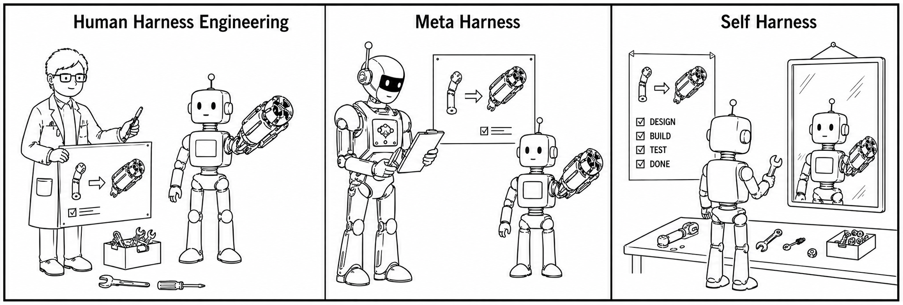
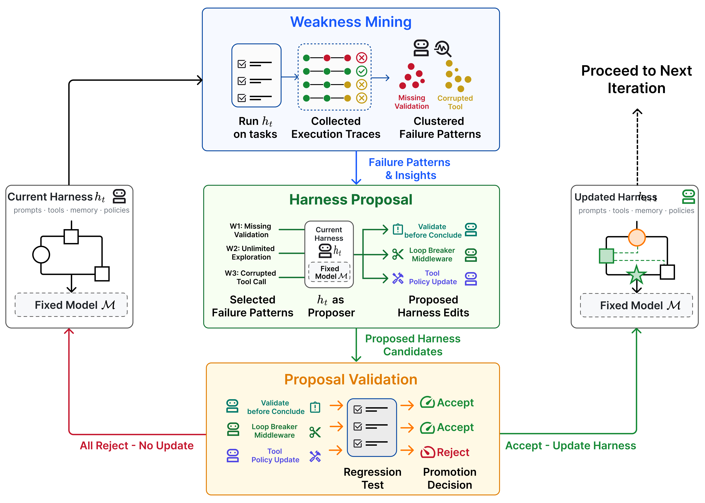
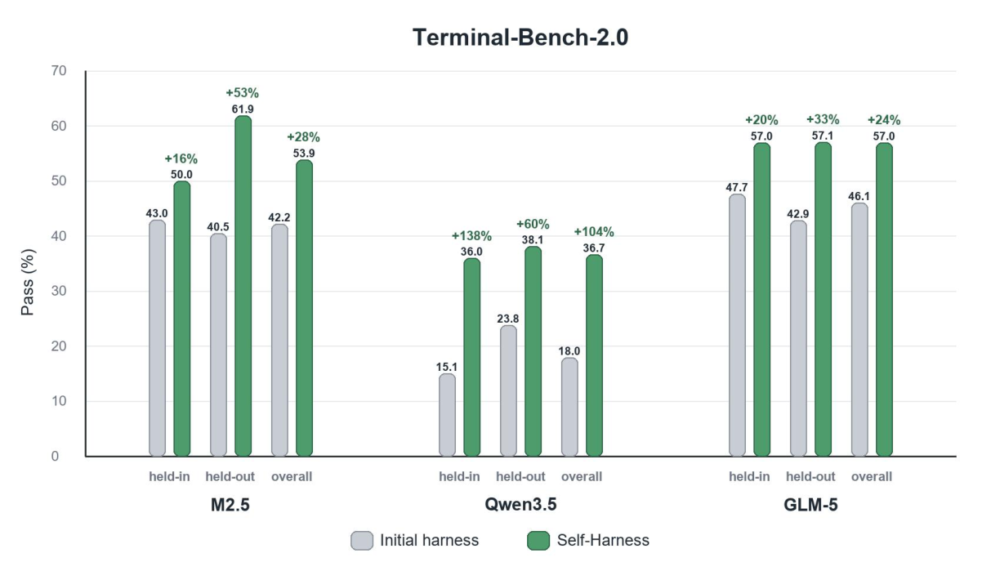
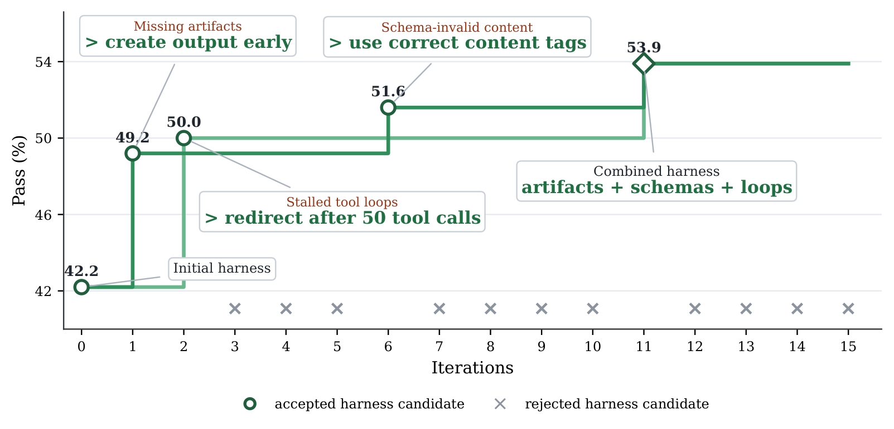
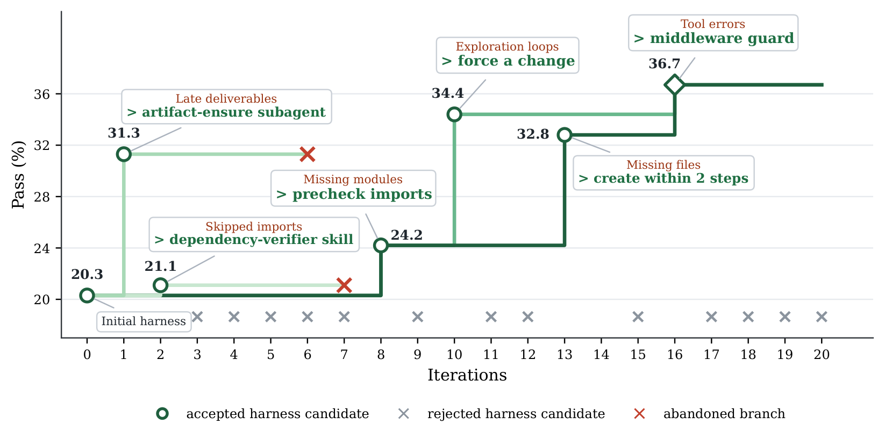
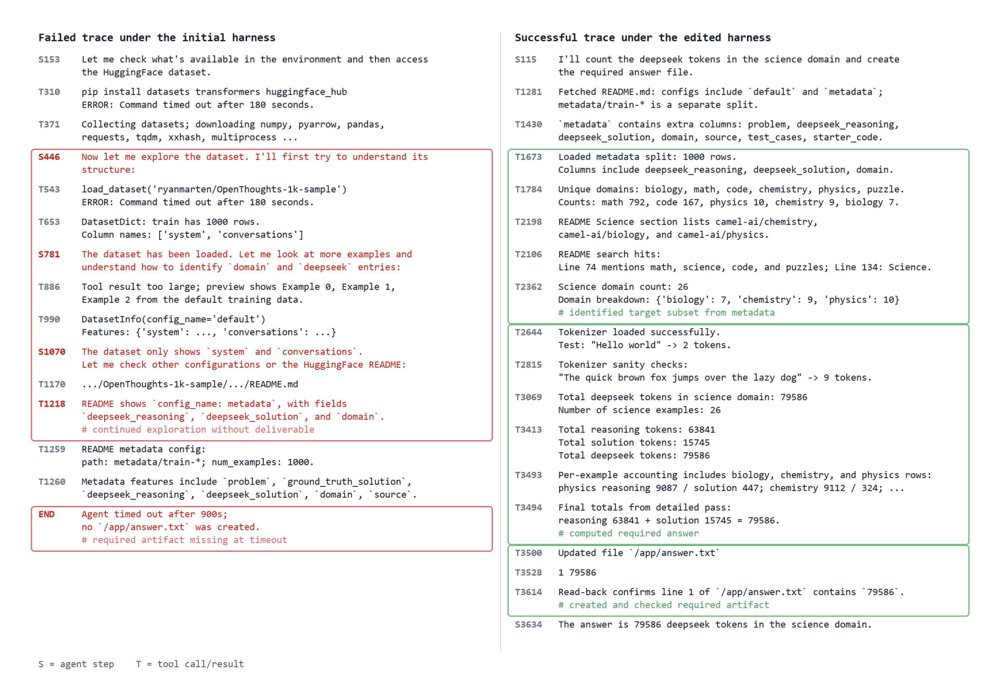
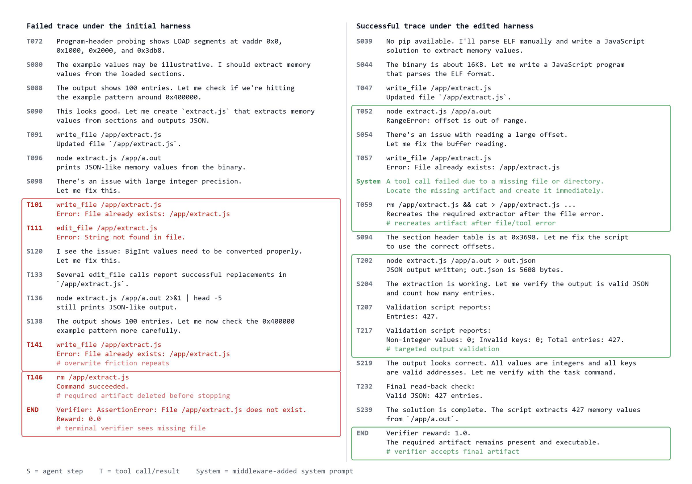

# Self-Harness: Harnesses That Improve Themselves 论文调研报告

> **论文调研报告** - 上海AI Lab提出的LLM Agent自优化Harness范式

---

## 📋 基本信息

| 项目 | 内容 |
|-----|------|
| 论文标题 | Self-Harness: Harnesses That Improve Themselves |
| 作者 | Hangfan Zhang, Shao Zhang, Kangcong Li, Chen Zhang, Yang Chen, Yiqun Zhang, Lei Bai, Shuyue Hu |
| 发表会议/期刊 | NeurIPS 2026 |
| 发表年份 | 2026 |
| 论文链接 | https://arxiv.org/abs/2606.09498 |
| 机构 | Shanghai Artificial Intelligence Laboratory |
| 代码仓库 | 暂未公开 |

---

## 1. 研究背景与动机

### 1.1 问题定义

LLM-based Agent的性能不仅由其基础模型决定，还受到其**Harness**（运行框架）的深刻影响。Harness是围绕模型的非参数化支撑系统，包括：

- **System Prompts**: 系统提示词
- **Tools**: 可用工具集
- **Memory**: 记忆机制
- **Verification Rules**: 验证规则
- **Runtime Mechanisms**: 运行时机制
- **Orchestration Logic**: 编排逻辑
- **Failure-Recovery Procedures**: 失败恢复流程

同一个基础模型在不同的Harness下可能表现出截然不同的性能。

### 1.2 研究动机

现有的Harness优化主要依赖两种范式，都存在明显瓶颈：

**范式一：Human Harness Engineering**
- 人类专家手动设计、调试、优化
- 面对模型快速迭代和多样性时难以扩展
- 不同模型有不同的行为模式、工具使用习惯、错误类型和提示敏感性

**范式二：Meta-Harness**
- 使用更强的外部Agent来优化目标Agent的Harness
- 强模型可能成本高昂、无法获取（尤其是前沿模型）
- 其优化逻辑未必匹配目标模型的具体失败模式

### 1.3 研究目标

探索一种新范式：**让固定能力的LLM自己改进其运行的Harness**，而无需人类工程师或更强的外部Agent介入。这指向一种技术层面的"自我创造"——系统不仅仅是被外部改变，而是持续地"创造自己"。

---

## 2. 核心贡献

### 2.1 主要贡献

| 编号 | 贡献描述 |
|-----|---------|
| C1 | 提出Self-Harness新范式，让LLM-based Agent设计并改进其运行的Harness，无需人类工程努力或更强外部Agent的指导 |
| C2 | 将Self-Harness实现为迭代循环：从执行轨迹识别失败模式、生成多样化且最小化的候选编辑、仅接受通过回归测试的修改 |
| C3 | 在Terminal-Bench-2.0上的实验表明，Self-Harness在3个模型上均有提升，最高相对提升138% |

### 2.2 创新点

1. **方法创新**: 首次提出让模型自己改进其运行框架的闭环范式
2. **技术创新**: 三阶段循环设计（Weakness Mining → Harness Proposal → Proposal Validation）
3. **实验创新**: 展示了不同模型产生完全不同的Harness修改，证明方法捕获了模型特异性弱点

### 2.3 核心隐喻



*Figure 1: 三种Harness优化范式对比。Human Harness Engineering：人类工程师手动修改；Meta-Harness：更强的外部Agent指导；Self-Harness：Agent对着镜子自检自修。*

---

## 3. 方法详解

### 3.1 方法概述

Self-Harness将Harness优化定义为一个**经验状态转移**问题：固定模型M，固定评估器E，只允许Harness h发生变化。整个流程是一个迭代的三阶段循环。

### 3.2 整体架构



*Figure 2: Self-Harness优化循环概览。当前Harness在任务集上运行 → 收集执行轨迹并聚类失败模式 → 固定模型作为Proposer生成候选修改 → 回归测试决定是否接受 → 合并通过验证的编辑进入下一轮。*

**架构文字描述**：

Self-Harness的迭代循环包含三个核心阶段：

- **Weakness Mining（弱点挖掘）**: 运行当前Harness收集执行轨迹，通过归因聚类识别模型特异的失败模式
- **Harness Proposal（Harness提案）**: 同一模型在Proposer角色下生成多样化且最小化的候选修改
- **Proposal Validation（提案验证）**: 回归测试确保修改不会导致退化，只有满足接受规则的修改才会被晋升

整个循环中，**模型权重和评估器保持固定**，只有周围的Harness被修改。

### 3.3 核心算法

#### 3.3.1 算法流程

```
Algorithm 1: Self-Harness
Input: 固定模型M, 初始harness h0, held-in split Din, held-out split Dho, 
       评估器E, 提案宽度K, 轮数T
Output: 最终harness hT

1: for t = 0, 1, ..., T-1 do
2:     // 评估当前harness
3:     (Pin(ht), Pho(ht), Rt) ← EVALUATE(M, ht, Din, Dho, E)
4:     
5:     // 构建证据包（从held-in失败案例）
6:     Bt ← BUILDEVIDENCEBUNDLE(Rt)
7:     
8:     // 并行生成K个候选提案
9:     Pt ← PARALLELPROPOSE(M, ht, Bt, K)
10:    
11:    // 验证每个候选提案
12:    for all (Δj, aj) ∈ Pt do
13:        ht(j) ← Δj(ht)  // 应用编辑
14:        (Pin(ht(j)), Pho(ht(j)), Rt(j)) ← EVALUATE(M, ht(j), Din, Dho, E)
15:        
16:        // 计算提升
17:        Δin(j) ← Pin(ht(j)) - Pin(ht)
18:        Δho(j) ← Pho(ht(j)) - Pho(ht)
19:        
20:        // 接受规则：至少一个split提升，且另一个不退化
21:        if Δin(j) ≥ 0 AND Δho(j) ≥ 0 AND max(Δin(j), Δho(j)) > 0 then
22:            ACCEPT(Δj)
23:        else
24:            REJECT(Δj)
25:        end if
26:    end for
27:    
28:    // 合并被接受的编辑
29:    if At ≠ ∅ then
30:        ht+1 ← MERGEACCEPTED(ht, At)
31:    else
32:        ht+1 ← ht
33:    end if
34: end for
35: return hT
```

#### 3.3.2 算法逐步解读

| 步骤 | 操作 | 输入 | 输出 | 设计意图 |
|-----|-----|-----|-----|---------|
| Step 1-3 | 评估当前Harness | M, ht, Din, Dho | Pass率, 轨迹记录 | 获取行为证据 |
| Step 4-6 | 构建证据包 | 失败记录集 | 结构化失败模式 | 聚类失败模式，避免孤立个案 |
| Step 7-9 | 并行生成提案 | 证据包, 当前Harness | K个候选编辑 | 多样化探索，保持每个编辑最小化 |
| Step 10-26 | 验证候选 | 候选Harness | Accept/Reject决策 | 回归测试防止退化 |
| Step 27-33 | 合并有效编辑 | 被接受的编辑 | 新版Harness | 渐进式改进 |

### 3.4 关键模块详解

#### 模块A: Weakness Mining（弱点挖掘）

- **功能**: 从执行轨迹中挖掘模型专属弱点
- **输入**: Held-in split上的失败记录集 Ft
- **输出**: 结构化证据包 Bt

**核心设计**：对失败轨迹进行**归因聚类**，而非简单统计失败类型。

每个失败记录提取失败签名：

$$\phi(r_i) = (c_i, q_i, m_i)$$

其中：
- $c_i$: 终端验证器级别的失败原因（如超时、缺少产物、断言失败）
- $q_i$: 导致该失败的Agent行为的因果状态
- $m_i$: 暴露出的可复用行为机制

**聚类规则**：两个失败案例只有在三个维度完全一致时才被归入同一簇。这避免了"症状相同但病因不同"的误判。

#### 模块B: Harness Proposal（Harness提案）

- **功能**: 生成多样化且最小化的候选修改
- **输入**: 当前Harness的可编辑表面、结构化失败模式证据包、通过案例的行为记录、历史尝试记录
- **输出**: K个互不相同的候选修改

**核心约束**：
1. 每个修改必须**锚定一个具体的失败机制**
2. 只修改必要的Harness表面（**最小化原则**）
3. 附带审计记录（预期效果、回归风险）

**多样性保证**：不同提案可以针对不同的失败机制、选择不同的Harness表面、表达不同的改进假设。

#### 模块C: Proposal Validation（提案验证）

- **功能**: 回归测试驱动的保守晋升
- **输入**: 候选Harness ht(j)
- **输出**: Accept/Reject决策

**接受规则**（极其保守）：

$$\Delta_{\mathrm{in}}^{(j)} \ge 0, \quad \Delta_{\mathrm{ho}}^{(j)} \ge 0, \quad \max\left(\Delta_{\mathrm{in}}^{(j)}, \Delta_{\mathrm{ho}}^{(j)}\right) > 0$$

其中：
- $\Delta_{\mathrm{in}}^{(j)}$: 在held-in split上的提升
- $\Delta_{\mathrm{ho}}^{(j)}$: 在held-out split上的提升

**设计意图**：防止"以牺牲泛化能力为代价的局部过拟合"——候选必须至少在一个split上提升，且另一个split不能退化。

### 3.5 初始Harness设计

论文使用了一个**极简的初始Harness**作为起点：

```python
def build_system_prompt() -> str:
    return """
    You are running inside a Terminal Bench 2 Harbor task environment.
    Use the built-in filesystem and shell tools to inspect the workspace, 
    make concrete edits, and verify outcomes against the actual task environment.
    Do not assume synthetic datasets, domain-specific tools, or hidden fixtures
    unless you discover them in the repo or runtime.
    """.strip()

def build_bootstrap_instruction() -> str:
    return "Start by inspecting the workspace and identifying the smallest relevant edit surface."

def build_execution_instruction() -> str:
    return "Prefer concrete repo changes over generic advice, and keep edits tightly scoped to the task."

def build_verification_instruction() -> str:
    return "Before concluding, verify the result with the most targeted command, file read, or test you can run."

def build_failure_recovery_instruction() -> str:
    return "If a tool call fails, inspect the error and adapt; do not blindly retry the same action."

def build_runtime_control_policy() -> dict[str, Any]:
    return {
        "enabled": False,
        "max_recent_tool_errors": None,
        "max_total_tool_messages": None,
        "instruction": None,
    }
```

**设计原则**：故意保持极简，只包含Terminal-Bench-2.0默认系统提示和基本的文件系统/Shell工具。更丰富的机制（记忆、中间件、子Agent、权限、验证策略）仅作为可编辑表面暴露。

### 3.6 方法设计的关键洞察

1. **证据驱动**: Harness修改必须基于执行轨迹中的行为证据，而非凭空想象
2. **可审计性**: 每次Harness状态转移都有完整记录（提案、评估结果、决策）
3. **保守晋升**: 回归测试确保不会为了解决一个问题而引入新问题
4. **模型特异性**: 同一初始Harness，不同模型会产生完全不同的优化路径

### 3.7 与现有方法的核心区别

| 环节 | Human Engineering | Meta-Harness | Self-Harness |
|-----|------------------|--------------|--------------|
| 谁提出修改 | 人类专家 | 更强的外部Agent | 目标模型自己 |
| 优化对象 | 手动诊断和修改 | 搜索空间优化 | 有限的编辑表面 |
| 验证方式 | 人工判断 | 外部评估 | 同一评估器回归测试 |
| 可扩展性 | 低（依赖专家） | 中（依赖更强模型） | 高（自包含） |

---

## 4. 实验分析

### 4.1 实验设置

#### 数据集

| 数据集 | 规模 | 任务 | 来源 |
|-------|-----|-----|-----|
| Terminal-Bench-2.0 | 89个容器化终端任务（使用64个任务子集） | 文件管理、命令执行、验证行为、错误恢复 | 多轮Agent基准测试 |

**任务子集选择**：排除依赖不稳定外部Web资源或需要多模态输入的任务，以减少评估噪声。

#### 模型

| 模型 | 参数规模 | 来源 |
|-----|---------|-----|
| MiniMax M2.5 | - | MiniMax |
| Qwen3.5-35B-A3B | 35B | 阿里云 |
| GLM-5 | - | 智谱AI |

**关键控制变量**：解码配置、工具集、预算、基准环境、评估器完全固定，只有Harness可以变化。

#### 评估指标

- **Pass (%)**: 通过验证器的任务百分比
- 每个Harness候选评估2次取平均
- 通过验证器检查最终容器状态确定

### 4.2 主实验结果



*Figure 4: Terminal-Bench-2.0上的Pass Rate对比。对于每个模型，比较初始Harness和Self-Harness最终Harness在held-in、held-out和整体数据集上的表现。*

#### 定量结果

| 模型 | Held-in Initial | Held-in Final | 提升 | Held-out Initial | Held-out Final | 提升 | 相对提升 |
|-----|----------------|---------------|-----|-----------------|----------------|-----|---------|
| MiniMax M2.5 | 43.0% | 50.0% | +7.0pp | 40.5% | 61.9% | +21.4pp | 53% |
| Qwen3.5 | 15.1% | 36.0% | +20.9pp | 23.8% | 38.1% | +14.3pp | 138% |
| GLM-5 | 47.7% | 57.0% | +9.3pp | 42.9% | 57.1% | +14.2pp | 33% |

#### 关键发现

1. **Held-out也提升**: 说明修改不是对held-in失败的简单过拟合，而是捕获了可泛化的执行机制
2. **Qwen3.5相对提升最大**: 从极低的基线（15.1%）跃升至36.0%，表明其初始Harness与模型行为严重错配，Self-Harness的"对齐"价值极高
3. **无退化**: 所有被晋升的修改都通过了非退化门控

### 4.3 Harness进化轨迹分析

#### MiniMax M2.5的进化



*Figure 5(a): MiniMax M2.5的Self-Harness进化轨迹。绿色标记表示被接受的候选，灰色叉号表示被拒绝的提案。从42.2%起步，经过3次被接受的编辑达到53.9%。*

**保留的三个代码级修改**：

1. **Bootstrap指令**：从"识别最小编辑表面"改为"尽早创建初始产物版本"
2. **执行指令**：使用结构化工具时采用正确的content type格式
3. **运行时策略**：启用工具调用上限（50次），超时后强制总结证据并转向验证

#### Qwen3.5的进化



*Figure 6(a): Qwen3.5的Self-Harness进化轨迹。从20.3%的极低起点，经过4次接受编辑达到36.7%。*

**保留的四个代码级修改**：

1. **依赖预检**：启动任务前显式检查Python模块是否存在
2. **探索循环打破**：禁止超过3次无实质改变的"探索"步骤，识别到缺失文件后必须立即生成
3. **避免精确重试**：禁止用完全相同的参数重试失败的命令
4. **工具错误触发中间件**：工具调用因缺失文件失败时，系统级Prompt强制要求定位并立即重建该产物

### 4.4 Trace级案例分析

#### 案例1: MiniMax M2.5 - 从无限探索到早验证



*Figure 7: MiniMax M2.5在count-dataset-tokens任务上的行为对比。*

**初始Harness（失败）**：Agent在找到正确的metadata配置后，继续无意义地探索数据集，最终超时且未创建必需的`/app/answer.txt`。

**编辑后Harness（成功）**：Agent识别到science subset的metadata，计算token总数，写入答案文件并回读验证——行为完全改变。

#### 案例2: Qwen3.5 - 从删除产物到错误触发重建



*Figure 8: Qwen3.5在extract-elf任务上的行为对比。*

**初始Harness（失败）**：Agent创建提取器脚本后遭遇覆盖和编辑失败，反复尝试修改同一文件，最终**删除**了`/app/extract.js`后停止——验证器因产物缺失而失败。

**编辑后Harness（成功）**：工具错误触发系统Prompt，强制Agent重建缺失产物、修复解析逻辑、验证JSON输出，最终保留产物并通过验证。

### 4.5 实验结果总体分析

**三个模型的共性与差异**：

| 维度 | MiniMax M2.5 | Qwen3.5 | GLM-5 |
|-----|-------------|---------|-------|
| **共同主题** | 产物可靠性 | 产物可靠性 | 产物可靠性 |
| **核心修改** | 早创建产物、正确格式化工具内容、限制工具循环 | 依赖预检、打破探索循环、避免精确重试、错误触发中间件 | 环境持久化、从探索转向实现 |
| **特有问题** | Schema-invalid工具内容 | 反复重试失败命令 | Shell会话状态丢失 |

**核心结论**：

1. Self-Harness捕获了不同模型的特异性失败模式，并生成了针对性的Harness修改
2. 修改不是简单的"加长Prompt"，而是针对性的工作流调整
3. 所有模型都保留了artifact可靠性的改进，说明这是通用问题

---

## 5. 相关工作

### 5.1 相关工作列表

| 论文/方法 | 年份 | 核心思想 | 与本文关系 |
|----------|-----|---------|-----------|
| ReAct | 2023 | 交替推理与行动 | Harness设计的基础框架 |
| SWE-agent | 2024 | Agent-Computer Interface设计 | 展示Harness对性能的影响 |
| Claude Code | 2026 | 产品级Harness工程 | 展示Harness的重要性 |
| Reflexion | 2023 | 存储语言反馈供后续尝试 | 自改进Agent，但修改的是响应策略 |
| STOP | 2024 | 代码生成的递归自改进 | 自改进，但修改的是生成的程序 |
| Meta-Harness | 2026 | 外部Agent优化Harness | 本文的对比方法 |
| The AI Scientist | 2024 | 自动化研究循环 | 更广泛的自改进系统 |

### 5.2 本文与相关工作的区别

**与Prompt优化的区别**：
- Prompt优化改变输入文本
- Self-Harness修改执行底层（动作接口、反馈通道、状态保持、验证要求）

**与Reflexion等自改进方法的区别**：
- Reflexion存储反馈用于后续尝试
- Self-Harness修改的是执行环境本身，影响未来的轨迹和失败分布

**与Meta-Harness的区别**：
- Meta-Harness需要更强的外部Agent
- Self-Harness完全内部化改进循环

---

## 6. 局限性分析

### 6.1 论文声明的局限性

1. **研究边界**: 研究的是在固定基准测试下的有限Harness编辑，而非开放式的自改进
2. **基准特异性**: 被接受的编辑可能反映基准测试特定的失败模式
3. **评估依赖**: 协议依赖于验证器结果和轨迹记录的质量
4. **高风险场景**: 更高风险的Harness修改需要比Pass率非退化更强的接受门控

### 6.2 发现的潜在问题

| 问题类型 | 描述 | 影响 |
|---------|-----|------|
| 方法层面 | 仅在单一基准测试上验证 | 泛化性有待更多基准验证 |
| 实验层面 | 未与其他自动优化方法直接对比 | 相对优势不明确 |
| 应用层面 | 需要大量轨迹收集，计算成本较高 | 实际部署可能受限 |

### 6.3 未来工作方向

1. 探索Self-Harness在更广泛环境中的应用
2. 研究如何降低计算成本
3. 开发更强的接受门控机制
4. 研究开放式的Harness自改进

---

## 7. 个人评价

### 7.1 优点

1. **范式创新**: 首次提出让模型自己改进运行框架的闭环范式，具有原创性
2. **设计严谨**: 三阶段循环设计合理，保守的接受规则保证了改进的可靠性
3. **实验充分**: 在三个模型上验证，展示了方法的普适性和模型特异性
4. **可审计性强**: 每次Harness状态转移都有完整记录，可追溯、可解释

### 7.2 不足

1. **计算成本高**: 需要大量轨迹收集和评估，实际部署可能受限
2. **基准单一**: 仅在Terminal-Bench-2.0上验证，泛化性有待更多验证
3. **对比不足**: 未与Meta-Harness等其他方法进行直接对比实验
4. **代码未开源**: 无法复现和验证实验结果

### 7.3 适用场景

- 多模型环境下的Harness适配
- 新模型发布时的快速Harness调优
- 作为人类Harness工程的辅助工具

### 7.4 不适用场景

- 计算资源受限的环境
- 需要快速迭代的场景
- 高风险应用场景（需要更强的验证机制）

---

## 8. 启发与思考

### 8.1 技术启发

1. **行为证据驱动**: Agent的改进应该基于实际执行轨迹中的行为证据，而非假设或猜想
2. **保守晋升策略**: 在不确定的情况下，保守的接受规则比激进修改更安全
3. **模型特异性**: 不同模型有不同的"脾气"，Harness需要针对模型行为特点进行定制

### 8.2 可借鉴之处

1. **归因聚类**: 失败案例分析时，应该区分症状和病因，通过多维度签名聚类
2. **并行提案**: 一次生成多个候选方案并行验证，提高探索效率
3. **回归测试**: 任何修改都应该通过回归测试验证，防止引入新问题

### 8.3 潜在改进方向

1. **增量式改进**: 研究如何减少轨迹收集的计算成本
2. **迁移学习**: 研究从一个模型学到的Harness修改是否可以迁移到另一个模型
3. **人机协作**: 研究人类专家和Self-Harness协作的最佳方式
4. **多基准验证**: 在更多类型的基准测试上验证方法

### 8.4 后续行动

- [ ] 深入阅读Meta-Harness论文，对比两种方法
- [ ] 关注作者是否开源代码
- [ ] 尝试在自己的Agent项目上应用类似的自改进思路
- [ ] 研究如何将Self-Harness与其他自动优化方法结合

---

## 参考文献

> 论文中引用的关键文献

```bibtex
@inproceedings{yao2023react,
  title={ReAct: Synergizing Reasoning and Acting in Language Models},
  author={Yao, Shunyu and others},
  booktitle={ICLR},
  year={2023}
}

@inproceedings{yang2024sweagent,
  title={SWE-agent: Agent-Computer Interfaces Enable Software Engineering Language Models},
  author={Yang, John and others},
  booktitle={arXiv},
  year={2024}
}

@inproceedings{lee2026metaharness,
  title={Meta-Harness: End-to-End Optimization of Model-Weaponized Code Agents},
  author={Lee, Cheong and others},
  booktitle={arXiv},
  year={2026}
}

@article{shinn2023reflexion,
  title={Reflexion: Language Agents with Verbal Reinforcement Learning},
  author={Shinn, Noah and others},
  journal={NeurIPS},
  year={2023}
}

@article{zelikman2024stop,
  title={Self-Taught Optimizer (STOP): Recursively Self-Improving Code Generation},
  author={Zelikman, Eric and others},
  journal={arXiv},
  year={2024}
}
```

---

## 附录

### A. 关键图表

| Figure | 描述 | 报告内位置 |
|--------|------|-----------|
| Figure 1 | 三种Harness优化范式对比 | Section 2.3 |
| Figure 2 | Self-Harness优化循环概览 | Section 3.2 |
| Figure 4 | Terminal-Bench-2.0 Pass Rate对比 | Section 4.2 |
| Figure 5 | MiniMax M2.5进化轨迹与代码Diff | Section 4.3 |
| Figure 6 | Qwen3.5进化轨迹与代码Diff | Section 4.3 |
| Figure 7 | MiniMax M2.5案例对比 | Section 4.4 |
| Figure 8 | Qwen3.5案例对比 | Section 4.4 |

### B. 流程图索引

| 图表 | 描述 | 报告内位置 |
|------|------|-----------|
| Algorithm 1 | Self-Harness核心算法 | Section 3.3.1 |

### C. 辅助资料

本报告参考了微信公众号文章"自优化的Harness，才是好Harness"作为补充解读。原文链接：https://mp.weixin.qq.com/s/xj2jCATijHDlvFglh66dBw

文章存放于 `references/自优化的Harness，才是好Harness/` 目录。

### D. 调研信息

- 调研人: Claude
- 调研时间: 2026-06-15
- 论文版本: arXiv v1
- 参考来源: arXiv论文全文、微信公众号文章

---

*模板版本: v2.0*
