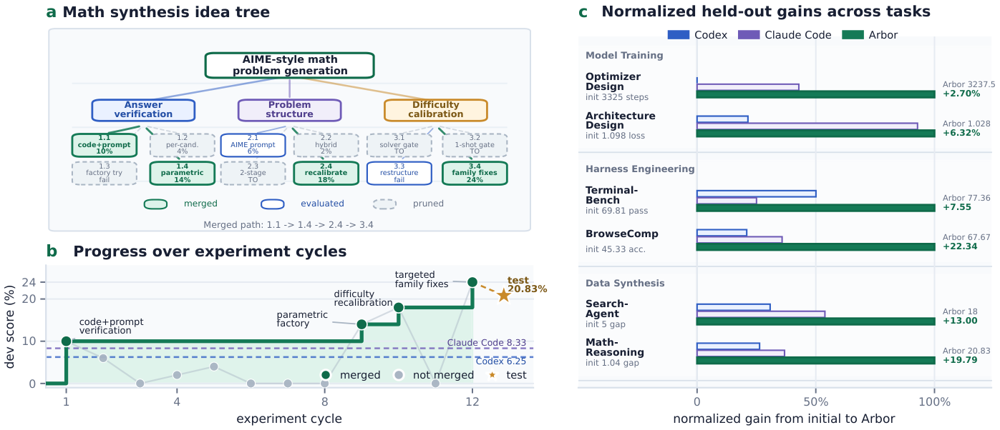
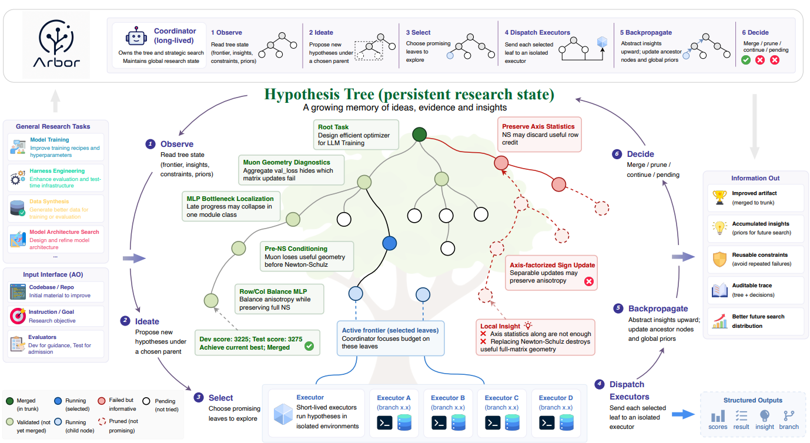
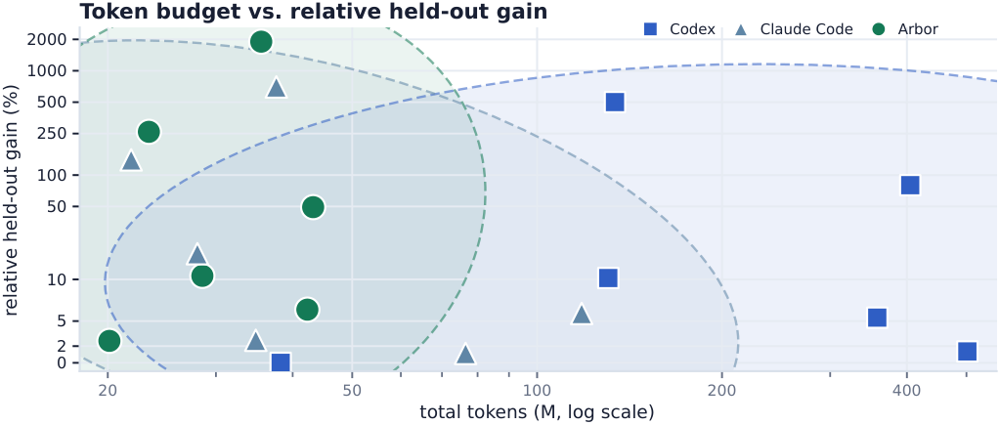
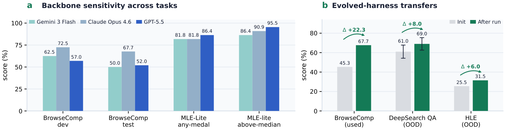
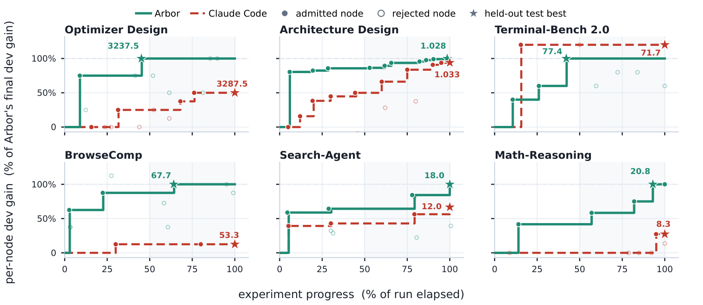
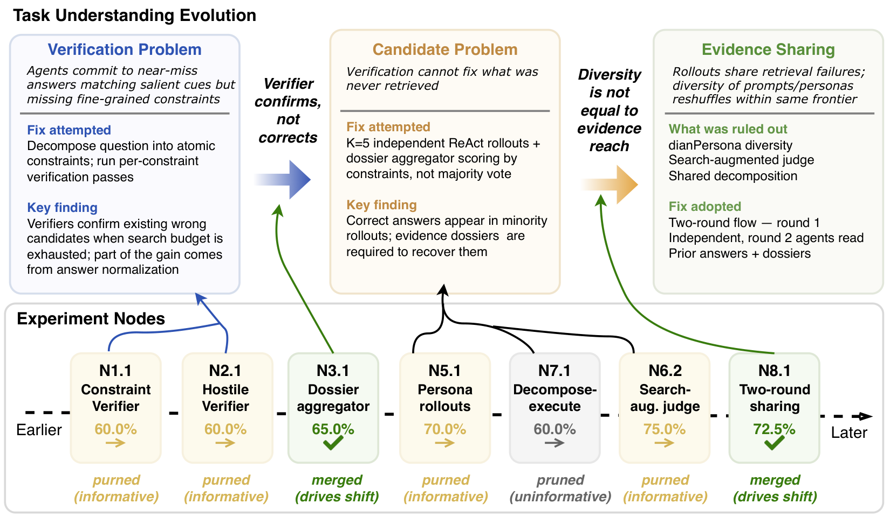

# Arbor 论文综合调研报告

> 基于 arXiv:2606.11926 论文与 GitHub 开源代码的综合分析

---

## 📋 基本信息

| 项目 | 内容 |
|-----|------|
| 论文标题 | Toward Generalist Autonomous Research via Hypothesis-Tree Refinement |
| 作者 | Jiajie Jin, Yuyang Hu, Kai Qiu, Qi Dai, Chong Luo, Guanting Dong, Xiaoxi Li, Tong Zhao, Xiaolong Ma, Gongrui Zhang, Zhirong Wu, Bei Liu, Zhengyuan Yang, Linjie Li, Lijuan Wang, Hongjin Qian, Yutao Zhu, Zhicheng Dou |
| 所属机构 | 中国人民大学高瓴人工智能学院、微软研究院 |
| 发表年份 | 2026 |
| 论文链接 | https://arxiv.org/abs/2606.11926 |
| 项目主页 | https://ruc-nlpir.github.io/Arbor/ |
| 代码仓库 | https://github.com/RUC-NLPIR/Arbor |
| 文档 | https://ruc-nlpir.github.io/Arbor/docs/ |
| 许可证 | Apache 2.0 |
| Star 数 | 96+ (截至 2026-06-12) |

---

## 📖 项目简介

**Arbor** 是中国人民大学（RUC-NLPIR）和微软研究院联合推出的**通用自主研究框架**，旨在让 AI Agent 能够像人类研究员一样进行长期、累积的科学研究。

### 核心定位

Arbor 将自主研究从"一系列局部尝试"转变为**累积过程**——策略、执行和证据跨越时间传递，形成可审计的研究记录。

### 核心特点

| 特点 | 描述 |
|------|------|
| **假设树驱动** | 用持久树结构组织研究，每个节点绑定假设、工件版本、实验证据和提炼见解 |
| **协调器-执行器分离** | 长期协调器维护全局研究状态，短期执行器在隔离环境测试单个假设 |
| **开发/测试分离** | 使用开发信号引导搜索，仅当改进转移到保留测试时才提升工件 |
| **Git Worktree 隔离** | 每个实验在独立分支运行，main 分支不受影响直到合并 |
| **见解回传** | 实验结果被抽象为可重用教训，沿树向上传播，约束后续探索 |
| **多模型支持** | 支持 Anthropic Claude、OpenAI GPT、LiteLLM（DeepSeek/Gemini/Qwen/vLLM/Ollama） |

### 应用场景

- **模型训练优化**：优化器设计、架构搜索、超参数调优
- **工具工程**：Agent harness 优化、评估基础设施改进
- **数据合成**：训练数据生成、评估数据构建、难度校准

### 关键成果

- 在六项真实研究任务上，Arbor 获得最佳保留结果，**超过 Codex 和 Claude Code 平均增益的 2.5 倍**
- 在 MLE-Bench Lite 上使用 GPT-5.5 达到 **86.36% Any Medal**（最强结果）
- 开源完整的 CLI 工具和 Agent 技能套件，可直接安装使用

### 一句话总结

> **Arbor 通过假设树细化（HTR）将自主研究转变为累积的证据驱动过程，而非重复的试错循环。**

---



*图 1：Arbor 概览。(a) 假设树示例和 (b) 数学推理数据合成任务的开发分数进展。(c) 所有任务的标准化保留增益对比，Arbor 显著优于 Codex 和 Claude Code*

---

## 1. 研究背景与动机

### 1.1 问题定义

科学研究依赖于探索、实验和抽象的重复循环。研究人员测试候选方向，解释证据，并将所得经验教训带入后续尝试。这篇论文研究的核心问题是：**AI Agent 如何在长期运行中自主执行这一循环？**

论文将这一问题形式化为**自主优化（Autonomous Optimization, AO）**任务：

- 给定初始可变工件 $M_0$（如代码库 + 数据）
- 给定目标 $O$（什么意味着"改进"）
- 给定开发评估器 $E_{dev}$（用于引导搜索）
- 给定测试评估器 $E_{test}$（用于验证泛化）

Agent 必须生成候选工件，仅使用 $E_{dev}$ 进行搜索，但返回在 $E_{test}$ 上得分最高的工件——类似于机器学习中的开发/测试分离，防止过拟合。

### 1.2 研究动机

**现有方法的局限性**：

1. **通用编码 Agent**（如 Codex、Claude Code）：可以编辑代码、调用工具、运行实验长达数小时，但其自主性主要表现为持久任务执行，而非研究过程的累积

2. **科学 Agent 系统**（如 AI Scientist、AIDE）：更接近研究自动化，但仍遵循预定义工作流或逐行修订单一工作线，缺乏人类研究的核心机制——维护竞争方向、通过实验测试、解释成功与失败、让经验教训重塑后续探索

3. **证据保留薄弱**：许多系统依赖上下文窗口、单一修订轨迹或预定义工作流，无法有效累积和重用研究证据

### 1.3 研究目标

论文的目标是构建一个**通用的自主研究框架**，能够：

1. 从开放目标出发，形成研究方向
2. 通过具体的工件变更测试它们
3. 将实验证据转化为塑造后续探索的记忆
4. 进度不依赖于人类反复选择下一次尝试或解释先前试验的含义

---

## 2. 核心贡献

### 2.1 主要贡献

| 编号 | 贡献描述 |
|-----|---------|
| C1 | **AO 形式化**：将一类长期研究任务形式化为自主优化（AO），其中 Agent 必须在固定目标和评估器下迭代改进工件，无需人工逐步监督 |
| C2 | **Arbor 框架与 HTR**：提出通用 AO 框架，通过假设树细化（HTR）组织研究，将持久协调器与隔离执行器配对，使假设、工件版本、实验证据和提炼见解累积成可审计的研究状态 |
| C3 | **六项 AO 任务与评估**：构建来自真实研究环境的六项 AO 任务，证明 Arbor 提供最强的保留增益，持久假设管理和见解传播是其性能的关键驱动因素 |

### 2.2 创新点

1. **方法创新**：提出假设树（Hypothesis Tree）作为持久研究状态，同时充当搜索前沿、长期记忆和可审计研究记录

2. **架构创新**：分离长期协调器（Coordinator）与短期执行器（Executor），实现全局策略与局部执行的解耦

3. **实验创新**：构建六项真实 AO 任务覆盖模型训练、工具工程、数据合成三大领域，并引入开发/测试分离防止过拟合

---

## 3. 方法详解

### 3.1 方法概述

Arbor 的核心思想是将自主研究从一系列局部尝试转变为一个**累积过程**，其中策略、执行和证据跨越时间传递。这通过三个关键组件实现：

1. **持久协调器（Coordinator）**：维护全局研究状态，决定搜索前沿如何演进
2. **短期执行器（Executor）**：在隔离的工作树中测试单个假设
3. **假设树细化（HTR）**：持久树结构，连接假设、工件、证据和提炼见解

### 3.2 整体架构



*图 2：Arbor 实现级架构图。展示运行时配置、任务契约、插件策略、LLM 提供者和事件总线的协作关系。持久协调器维护假设树作为研究状态，迭代探索想法、派遣执行器实现它们，并使用评估反馈细化树和更新当前最佳工件*

**架构文字描述**：

Arbor 的架构分为三个层次：

1. **输入接口层（Input Interface）**：接收 AO 任务的四个要素——代码库/仓库、指令/目标、开发评估器、测试评估器。支持通用研究任务，包括模型训练、工具工程、数据合成等。

2. **协调器-执行器层（Coordinator-Executor）**：
   - **协调器**：长期存在，拥有假设树，执行六步循环（Observe → Ideate → Select → Dispatch → Backpropagate → Decide）
   - **执行器**：短期存在，在隔离的 git worktree 中实现假设，运行实验，返回证据

3. **假设树层（Hypothesis Tree）**：持久研究状态，每个节点绑定：
   - 假设 $h_n$：关于如何改进工件的可验证声明
   - 见解 $\iota_n$：证据的可重用解释
   - 元数据 $\mu_n$：状态、分数、结果、实现引用

**数据流向**：
1. 协调器从树中读取当前前沿、见解、约束
2. 提出新假设并选择待执行节点
3. 派遣执行器到隔离环境实现假设
4. 执行器返回分数、结果、见解、分支引用
5. 协调器回传见解到祖先节点，更新树状态
6. 通过保留验证门决定是否合并工件

### 3.3 核心算法

#### 3.3.1 算法流程

```
Algorithm 1: Hypothesis Tree Refinement (HTR)
Input: P = (M_0, O, E_dev, E_test), budget B, branching k
Output: best artifact M* and hypothesis tree Tree

1. init Tree = ({n_0}, ∅), b_{n_0} ← M_0, M_best ← M_0
2. while B left ∧ pending leaves exist do
3.     V ← Observe(Tree, M_best)           // 观察：形状、根见解、修剪/验证的教训
4.     p ← choose parent under V; 
       attach k pending children {n^(i) : h^(i)} ← Ideate(p, V)  // 构思
5.     L ← pending leaves under Select(V)  // 选择：前沿控制
6.     {(s_n, r_n, ι_n, b_n)}_{n∈L} ← parallel Executor(h_n, ι_{anc(n)}, M_best)  // 派遣
7.     foreach n ∈ L, a ∈ path(n_0 → n) do
8.         write back (s_n, r_n, ι_n, b_n);
           ι_a ← Abstract({ι_c}_{c∈ch(a)})  // 回传
9.     end foreach
10.    n† ← arg max_{n∈L} s_n              // 决定：保留合并门，然后修剪
11.    if O(E_test(b_{n†})) > O(E_test(M_best)) then M_best ← merge(b_{n†})
12.    prune subtrees falsified by {ι_n}_{n∈L}; persist Tree
13. end while
14. return M* ← M_best, Tree

Procedure Executor(h_n, ι_{anc(n)}, M_best):
15.    fresh worktree W_n ← M_best
16.    repeat
17.        Δ ← Implement(h_n, ι_{anc(n)}, W_n);
          (s_n, r_n) ← E_dev(apply(Δ, W_n))  // 仅修复 Δ；h_n 固定
18.    until run ok ∧ h_n-path exercised, or cap reached
19.    return (s_n, r_n, Distill(h_n, Δ, r_n), commit(W_n))
```

#### 3.3.2 算法逐步解读

| 步骤 | 操作 | 输入 | 输出 | 设计意图 |
|-----|-----|-----|-----|---------|
| Observe | 读取树状态 | 假设树、当前最佳工件 | 投影视图（前沿、见解、约束） | 重新定位研究状态，避免依赖丢失的对话历史 |
| Ideate | 提出新假设 | 父节点、投影视图 | k 个待处理子节点 | 基于累积证据生成细化、纠正或扩展 |
| Select | 选择执行节点 | 投影视图 | 待执行叶子集合 | 平衡探索与利用，控制前沿 |
| Dispatch | 派遣执行器 | 选定假设、祖先见解、最佳工件 | 分数、结果、见解、分支引用 | 并行测试假设，保持隔离 |
| Backpropagate | 回传见解 | 执行器报告 | 更新的树节点 | 将局部发现抽象为可重用教训 |
| Decide | 决定合并/修剪 | 更新后的树 | 合并/修剪决策 | 保留验证门防止过拟合 |

### 3.4 关键模块详解

#### 模块 A: 假设树（Hypothesis Tree）

- **功能**：作为 Arbor 的持久研究状态，同时充当搜索前沿、长期记忆和可审计记录
- **输入/输出**：每个节点 $n = \langle h_n, \iota_n, \mu_n \rangle$
- **核心设计**：

```
ROOT (baseline: 20%)
+-- 1: Retrieval optimization        [insight: "retrieval quality is the bottleneck"]
|   +-- 1.1: Constraint decomposition + verification   [40%, merged]
|   +-- 1.2: Periodic re-read injection                [40%, pruned -- no net gain]
|   +-- 1.3: Answer-extraction tuning                  [35%, pruned]
+-- 2: Multi-perspective search      [insight: "search scaffolding hurts here"]
|   +-- 2.1: Breadth-first search                      [25%, pruned]
+-- 3: Code-level intervention       [insight: "code-level > prompt-level"]
    +-- 3.1: Continuation injection                    [70%, merged]
    +-- 3.2: ANSWER-tag extraction                     [45%, done]
```

- **三大功能**：
  1. **搜索前沿**：记录哪些方向是活动的、已验证的或已修剪的
  2. **长期记忆**：存储来自成功和失败的可重用证据
  3. **可审计记录**：将每个工件更改链接到其动机假设和证据

#### 模块 B: 协调器（Coordinator）

- **功能**：长期存在的研究主管，维护假设树，驱动搜索
- **六步循环详解**：

1. **Observe（观察）**：通过读取树的结构化投影重新定位当前研究状态——活动前沿节点、近期返回的证据、祖先见解、当前最佳工件

2. **Ideate（构思）**：在选定父节点下提出候选假设。每个子节点代表对父假设的细化、替代或纠正。构思以累积树证据为条件：验证的见解提供构建假设，修剪的节点提供负面约束

3. **Select（选择）**：选择待执行节点。选择平衡假设的期望效用与祖先和兄弟节点已累积的证据。一个方向可能被选中是因为它有强的先验证据，或因为其兄弟姐妹暴露了未解决的歧义

4. **Dispatch（派遣）**：将选定假设派遣到独立执行器。每个执行器在新鲜 worktree 中实现假设，评估修改后的工件，返回紧凑报告

5. **Backpropagate（回传）**：将执行器报告写入对应叶节点，沿路径更新祖先见解。传播的信号不仅是标量分数，还包括因果归因、适用条件和可重用教训

6. **Decide（决定）**：通过保留合并门决定是否合并候选分支。候选仅在 $E_{test}$ 上改进时才合并到 $M_{best}$

#### 模块 C: 执行器（Executor）

- **功能**：短期存在的研究工程师，实现单个假设
- **工作流程**：
  1. 从 $M_{best}$ 创建新鲜 git worktree
  2. 接收假设 $h_n$ 和祖先见解 $\iota_{anc(n)}$
  3. 实现代码更改，在 $E_{dev}$ 上运行实验
  4. 修复实现错误（但假设固定不变）
  5. 返回：(分数, 结果, 提炼见解, 提交引用)

- **关键约束**：执行器假设绑定（hypothesis-bound），不能更改假设本身。这确保返回的分数是关于所分配节点的证据，祖先级见解保持可解释。

### 3.5 关键技术

| 技术点 | 描述 | 作用 | 论文对应位置 |
|-------|-----|-----|------------|
| 假设树持久化 | 树结构存储为 JSON 和 Markdown，作为真实来源 | 防止上下文压缩导致的状态丢失 | Section 4.2 |
| Git Worktree 隔离 | 每个实验在独立分支和 worktree 中运行 | 并行安全、可逆执行 | Section 4.3 |
| 保留验证门 | 仅当候选在 $E_{test}$ 上改进时才合并 | 防止开发过拟合 | Section 4.3 |
| 见解回传抽象 | 叶节点教训沿路径向上抽象到祖先 | 累积语义记忆 | Section 4.2 |
| 分支连贯性 | 多个竞争性假设共存但保持组织性 | 结构化探索 | Section 4.1 |

### 3.6 方法设计的关键洞察

1. **洞察 1：研究状态需要外部化**
   
   长期研究中，上下文窗口会丢失早期证据。假设树将研究状态外部化为持久结构，使 Agent 能够跨长时间重新定位研究进展。

2. **洞察 2：全局策略与局部执行应分离**
   
   战略决策依赖跨运行累积的证据，而实现是短视的代码编辑和调试。分离两者使执行痕迹不会模糊全局研究状态。

3. **洞察 3：开发反馈 ≠ 已验证进步**
   
   Agent 可能通过利用开发评估器特性而非发现真正的改进来"成功"。保留验证门将探索性成功与工件级进步分离。

### 3.7 与现有方法的核心区别

| 环节 | 现有方法做法 | Arbor 做法 | 改变原因 |
|-----|------------|---------|---------|
| 研究状态存储 | 上下文窗口、单一修订轨迹 | 持久假设树 | 防止状态丢失，支持可审计性 |
| 实验组织 | 扁平尝试序列 | 层次化树结构 | 保持方向连贯性，支持比较 |
| 证据重用 | 隐式（或不重用） | 显式见解回传 | 将失败转化为约束，避免重复错误 |
| 进度判定 | 开发分数改进 | 保留测试改进 | 防止过拟合开发集 |
| 执行隔离 | 共享工作目录 | 独立 git worktree | 并行安全，可回滚 |

---

## 4. 实验分析

### 4.1 实验设置

#### 数据集

| 任务类型 | 任务名称 | 初始工件 | 指标 | 开发/测试划分 |
|---------|---------|---------|-----|--------------|
| 模型训练 | Optimizer Design | NanoGPT-Bench；调优的 Muon 基线 | 达到目标损失的步数（越低越好） | 测试平均 2 个种子 |
| 模型训练 | Architecture Design | autoresearch LLM 训练代码库 | 最终损失（越低越好） | 测试平均 2 个种子 |
| 工具工程 | Terminal-Bench 2.0 | 官方终端 agent 代码库 | 通过率（越高越好） | 36 开发 / 53 测试任务 |
| 工具工程 | BrowseComp | 最小 ReAct 风格搜索工具 | 准确率（越高越好） | 50 开发 / 300 测试问题 |
| 数据合成 | Search-Agent Data Synthesis | 手工设计的搜索数据流水线 | pass@4 - pass@1 差距 | 50 开发 / 100 测试种子 |
| 数据合成 | Math-Reasoning Data Synthesis | 手工设计的 AIME 风格问题生成器 | pass@4 - pass@1 差距 | 10 开发 / 12 测试种子 |

#### 评估指标

- **主指标**：任务原生指标（步数、损失、通过率、准确率、差距）
- **跨任务对比**：标准化保留改进 $\Delta_{test}(M^*) = \frac{\tilde{S}_{test}(M^*) - \tilde{S}_{test}(M_0)}{|\tilde{S}_{test}(M_0)| + \epsilon}$

#### 实现细节

- **硬件环境**：NVIDIA A100 GPU（MLE-Bench Lite）
- **骨干模型**：Claude Opus 4.6（主要）、GPT-5.5、Gemini-3-Flash
- **时间限制**：48 小时墙钟时间
- **预算**：20 个协调器周期，最大树深度 2

### 4.2 主实验结果

**核心发现**：

1. **Arbor 在所有六项任务上获得最佳保留结果**

| 任务 | 初始 | Codex | Claude Code | Arbor | Arbor 增益 |
|------|------|-------|-------------|-------|-----------|
| Optimizer Design (steps ↓) | 3325 | 3325 | 3287.5 | **3237.5** | +2.63% |
| Architecture Design (loss ↓) | 1.098 | 1.083 | 1.033 | **1.028** | +6.38% |
| Terminal-Bench 2.0 (pass ↑) | 69.81 | 73.59 | 71.70 | **77.36** | +7.55 |
| BrowseComp (acc. ↑) | 45.33 | 50.00 | 53.33 | **67.67** | +22.34 |
| Search-Agent (gap ↑) | 5.00 | 9.00 | 12.00 | **18.00** | +13.00 |
| Math-Reasoning (gap ↑) | 1.04 | 6.25 | 8.33 | **20.83** | +19.79 |

2. **超过 Codex 和 Claude Code 平均相对保留增益的 2.5 倍**

3. **MLE-Bench Lite 结果**：使用 GPT-5.5 达到 **86.36% Any Medal**（最强结果）

### 4.3 消融实验

**消融结果（MLE-Bench Lite, Claude Opus 4.6 骨干）**：

| 变体 | Valid Sub. | Above Median | Any Medal |
|------|------------|--------------|-----------|
| Full Arbor | 100.00% | 90.91% | **81.82%** |
| w/o tree | 100.00% | 72.72% | 63.64% |
| w/o insight feedback | 100.00% | 77.27% | 54.54% |

**关键发现**：

1. **HTR 改进细化而非可执行性**：所有变体都获得 100% 有效提交，差距出现在结果质量中

2. **树仅当证据能在其上累积时才有用**：移除见解反馈同时保留树导致比完全移除树更大的下降

3. **树结构和见解反馈互补**：两者都需要完整性能

#### Token 消耗与搜索成本



*图 4：Token 预算与相对保留增益的关系。Token 总数包括输入和输出 token；对于 Arbor，总数还包括协调器和执行器的使用量。Y 轴报告相对于每个任务初始保留分数的百分比改进*

Arbor 在六项任务中使用 20.12M-43.19M token，与单轨迹基线相当。在此预算内，Arbor 在大多数任务上获得更大的保留增益。这表明改进不是简单地通过花费更多 token，而是通过预算的组织方式：token 用于维护竞争性假设、运行隔离执行、比较证据和更新搜索树。

许多节点改进了开发分数，但只有较小的子集被合并。这种差距是预期的：改进开发的节点可能仍然比当前最佳工件差，或者可能过拟合开发评估器而无法转移到保留测试。合并门因此防止将局部开发增益误认为工件级进步。

### 4.4 分析与讨论

#### 开发/测试分离暴露过拟合

在 Terminal-Bench 上：
- Claude Code 开发分数最高（75.00），但保留分数下降到 71.70
- Arbor 开发分数较低（72.22），但获得最佳保留分数（77.36）

这验证了保留合并门的必要性：使用 $E_{dev}$ 引导假设搜索，但仅当改进转移到 $E_{test}$ 时才提升工件。

#### 骨干模型通用性



*图 3：骨干通用性与跨任务迁移。(a) Arbor 使用不同骨干模型重新运行，保持控制器、评估器预算和任务适配器固定。(b) BrowseComp 优化的搜索工具被冻结并在未见过的搜索 agent 任务上评估，无需进一步任务特定优化*

Arbor 的改进不依赖于特定骨干模型：
- 即使使用 Gemini-3-Flash（比 Claude/GPT 更轻的骨干），相同控制器仍然改进任务
- 骨干效应与任务相关：Claude 在 BrowseComp（推理密集）表现最好，GPT-5.5 在 MLE-Bench Lite（ML 工程知识密集）表现最好

#### 跨任务想法迁移

在 BrowseComp 上优化的搜索工具被冻结并在两个未见过的搜索 agent 任务上评估：
- BrowseComp: 45.33% → 67.67% (+22.34)
- HLE: 25.50% → 31.50% (+6.0)
- DeepSearchQA: 61.00% → 69.00% (+8.0)

这表明 Arbor 发现的工具级更改能在任务分布变化后仍然有效。

### 4.5 实验结果总体分析

从全局视角综合解读所有实验：

**验证层次**：

1. **现象验证**（主实验）：Arbor 在六项任务上均获得最佳保留结果，证明方法的有效性和通用性

2. **机制验证**（消融实验）：假设树和见解反馈是关键驱动因素，两者互补

3. **泛化验证**（骨干实验）：方法不依赖特定模型，具有较强的通用性

4. **迁移验证**（跨任务实验）：优化的工件能够迁移到未见过的任务

**核心结论**：
- 瓶颈不是局部代码编辑，而是组织多次尝试为连贯探索过程
- 持久假设管理和见解传播是性能的关键驱动因素
- 开发/测试分离防止自主搜索中的过拟合

---

## 4.6 讨论：研究过程分析

我们分析 Arbor 的内部研究痕迹，理解自主研究如何在 Agent 开始运行实验后进展。我们关注三个问题：假设如何随时间变化、何时出现有用的改进、假设树产生什么样的想法。

### 假设细化分析



*图 5：六项 AO 任务上的探索效率（每任务一个面板）。曲线显示运行过程中的最佳开发增益，Arbor（实线）终点为 100%，Claude Code 基线（虚线）达到其相对上限。星号标记每种方法的保留测试最大值*

我们分析 BrowseComp 假设树，报告主要的假设转变、驱动它们的实验节点以及合并门选择的最终设计。我们发现：

1. **早期节点测试宽泛机制是否成立**：运行从粗粒度假设开始，使用前几个实验确认或拒绝它。在 BrowseComp 中，初始假设是搜索 Agent 通过匹配显著线索而错过细粒度约束来产生近似正确答案；约束分解验证和对抗性矛盾检查都提高了开发准确率，确认细粒度答案检查是有效的增益来源。

2. **后期节点通过探测机制边界来定位瓶颈**：一旦机制被确认，树测试它在哪里停止工作而不是进一步推进它。在 BrowseComp 中，验证器节点可以判断搜索过程产生的候选答案，但很少恢复从未被提出的候选答案，部分对抗性验证器的增益来自答案归一化而不是可靠的证据发现。这将主要设计目标从更严格的验证转向更广泛的证据覆盖。

3. **祖先见解将这些结果压缩为塑造最终设计的约束**：累积的正向和负向发现定义了成功设计必须满足的条件。在 BrowseComp 中，证据档案聚合器跨独立轮次保留候选和支持证据，恢复仅在少数轨迹中出现的正确答案；后续节点排除了人物角色多样化轮次（仅在相同检索前沿内重新排序）、搜索增强判断器（过拟合开发问题）和共享分解（减少轨迹独立性）。Arbor 因此了解到 BrowseComp 从共享证据中受益，同时保持搜索轨迹独立。

### 任务理解演化



*图 6：BrowseComp 运行过程中任务理解的演化。每个上层框陈述当前问题框架、尝试的修复和驱动下一次转变的机制发现。下层显示每次转变背后的实验节点*

假设细化在 HTR 中是任务理解的加深：早期节点测试宽泛机制，后期节点识别其限制，祖先见解将这些结果总结为下一轮提议的约束。这种约束累积是相比扁平试错的核心过程级收益。

### 想法质量分析

我们分析跨模型训练、工具工程和数据合成任务生成的代表性想法，按粒度、实现目标和与先前证据的关系分类每个想法。我们发现：

1. **大多数有用的想法是局部且可执行的**：在模型训练中，想法通常修改特定的优化器组件、训练配方或架构选择。在工具工程中，它们更改 Agent 循环的具体部分，如检索、聚合、验证或上下文管理。在数据合成中，它们细化生成、过滤、难度校准或验证模块。这种局部性使每个想法易于实现、评估和归因到树节点。

2. **有用的想法通常是证据条件的**：许多成功的提议直接响应先前的观察：BrowseComp 证据档案设计源于仅验证方法的失败模式，类似的模式出现在数据合成中，后续节点修复难度校准或答案验证的特定弱点。HTR 因此帮助将局部失败转化为新的设计约束，并确保"半正确"的结果成为更精确假设的起点，而不是放弃方向的理由。

3. **高层问题框架仍然重要**：当目标可以通过一系列具体细化来改进时，Arbor 最强；当进步需要与现有树弱连接的新的高层框架时，不太可靠。架构设计任务最终承认单旋钮调优已达到收益递减，需要更大的算法步骤，但识别该步骤仍依赖于先验判断而不是树可以自动生成的任何内容。

---

## 5. 代码实现分析

### 5.1 项目结构

```
Arbor/
├── src/                    # 核心 Python 包
│   ├── core/               # 共享基础设施
│   │   ├── agent.py        # 基础 ReAct Agent 循环 (32KB)
│   │   ├── llm/            # LLM 提供者实现
│   │   └── tools/          # 核心工具（Bash、文件操作等）
│   ├── coordinator/        # 协调器 Agent
│   │   ├── orchestrator.py # 主编排器——六步循环 (49KB, 核心大脑)
│   │   ├── idea_tree.py    # 假设树数据结构 (21KB)
│   │   ├── prompts.py      # 协调器提示模板 (35KB)
│   │   └── tools/          # 协调器工具
│   ├── executor/           # 执行器 Agent
│   │   ├── main.py         # 执行器 CLI 入口
│   │   └── prompts.py      # 执行器提示模板 (21KB)
│   ├── cli/                # CLI 层
│   │   ├── app.py          # 主 `arbor` CLI 应用
│   │   ├── run_dashboard.py# 实时终端仪表板 (117KB, 最大文件)
│   │   └── intake/         # 研究契约对话
│   ├── events/             # 类型化事件总线
│   ├── plugins/            # 领域插件
│   └── webui/              # 只读 Web 监控 UI
├── skills/                 # Agent 技能套件（Codex/Claude Code）
└── docs/                   # MkDocs 文档站点
```

### 5.2 论文-代码对应关系

| 论文概念 | 代码位置 | 对应程度 |
|---------|---------|---------|
| 假设树（Hypothesis Tree） | `src/coordinator/idea_tree.py` | ✅ 完整对应 |
| 六步循环（HTR Algorithm） | `src/coordinator/orchestrator.py` | ✅ 完整对应 |
| 协调器（Coordinator） | `src/coordinator/` | ✅ 完整对应 |
| 执行器（Executor） | `src/executor/` | ✅ 完整对应 |
| Git Worktree 隔离 | `src/coordinator/tools/git_ops.py` | ✅ 完整对应 |
| 见解回传 | `src/coordinator/tools/tree_ops.py` | ✅ 完整对应 |
| 保留验证门 | `src/coordinator/tools/executor_run.py` | ✅ 完整对应 |

### 5.3 核心实现细节

#### 协调器编排器（orchestrator.py）

49KB 的核心文件实现了完整的六步循环：

```python
# 六步循环伪代码
while budget_left and pending_leaves_exist:
    # 1. Observe - 读取树状态
    view = observe_tree(tree, best_artifact)
    
    # 2. Ideate - 提出新假设
    new_nodes = ideate(parent, view)
    
    # 3. Select - 选择执行节点
    selected = select_pending_leaves(view)
    
    # 4. Dispatch - 派遣执行器
    results = parallel_executors(selected)
    
    # 5. Backpropagate - 回传见解
    for node, result in results:
        update_node(node, result)
        propagate_insight_to_ancestors(node)
    
    # 6. Decide - 合并/修剪决策
    if held_out_improvement(best_candidate):
        merge_to_trunk(best_candidate)
    prune_falsified_subtrees()
```

#### 假设树数据结构（idea_tree.py）

```python
class Node:
    hypothesis: str      # 假设描述
    insight: str         # 提炼的见解
    metadata: NodeMeta   # 状态、分数、分支引用
    
class NodeMeta:
    status: NodeStatus   # pending/running/done/merged/pruned
    dev_score: float     # 开发分数
    branch: str          # Git 分支引用
    result: str          # 实验结果记录
```

### 5.4 代码质量评估

| 维度 | 评估 | 说明 |
|-----|------|-----|
| 代码风格 | ⭐⭐⭐⭐ | 遵循 PEP8 规范，类型注解完整 |
| 命名规范 | ⭐⭐⭐⭐ | 变量命名清晰，与论文术语一致 |
| 注释质量 | ⭐⭐⭐ | 关键函数有文档字符串 |
| 文档完整度 | ⭐⭐⭐⭐⭐ | 完整的文档站点和 README |

### 5.5 可复现性评估

| 复现要素 | 支持情况 | 说明 |
|---------|---------|-----|
| 环境配置 | ✅ 有 pyproject.toml | pip install -e . 即可安装 |
| 随机种子固定 | ✅ 支持 | 配置文件可指定 |
| 预训练模型 | N/A | 使用外部 LLM API |
| 详细运行说明 | ✅ 完整 | README + 文档站点 |

**综合可复现性评分**：⭐⭐⭐⭐ (4/5)

---

## 6. 相关工作

### 6.1 相关工作列表

| 论文/方法 | 年份 | 核心思想 | 与本文关系 |
|----------|-----|---------|-----------|
| AI Scientist | 2024 | 端到端自动化研究流水线 | 本文对比方法，缺乏持久状态 |
| AIDE | 2025 | ML 工程作为迭代代码搜索 | 本文对比方法，单轨迹修订 |
| AI Scientist-v2 | 2025 | Agent 树搜索研究计划 | 同期工作，树结构不同 |
| FunSearch | 2024 | LLM 作为程序变异算子 | 搜索机制不同 |
| AlphaEvolve | 2025 | 进化算法发现程序 | 搜索机制不同 |
| MARS | 2026 | 模块化自动 AI 研究 | 同期工作，组织方式不同 |
| AutoHarness | 2026 | 搜索 Agent 代码线束 | 同期工作，目标不同 |
| Reflexion | 2023 | 跨试验反思 | 记忆机制先驱 |
| Generative Agents | 2023 | 自然语言记忆 | 长期 Agent 先驱 |

### 6.2 本文与相关工作的区别

| 维度 | 现有方法 | Arbor |
|------|---------|-------|
| 研究状态 | 上下文窗口/单一轨迹 | 持久假设树 |
| 实验组织 | 扁平/预定义工作流 | 层次化树结构 |
| 证据保留 | 弱/无 | 显式见解回传 |
| 开发/测试分离 | 不一致 | 强制执行 |
| 可审计性 | 低 | 高（树 + 决策记录） |

---

## 7. 局限性分析

### 7.1 论文声明的局限性

1. **评估范围有限**：当前 AO 任务套件覆盖模型训练、工具工程、数据合成，但未涵盖全部研究问题类型

2. **目标设计简化**：主要优化固定标量目标，未考虑多目标权衡或开放目标发现

3. **想法生成能力受限**：Agent 能提出有用的局部细化，但难以识别真正的新机制或从第一性原理推理

4. **成本和基础设施**：长时间自主研究受限于系统工程设计（提示缓存、评估器调度、并行执行等）

5. **模型能力依赖**：Arbor 继承底层 LLM 的优缺点，当前模型在深层领域知识和创造性问题重构方面仍有局限

### 7.2 发现的潜在问题

| 问题类型 | 描述 | 影响 |
|---------|-----|------|
| 方法层面 | 当需要新高层问题重构时，树结构难以自动生成 | 可能错过重大突破 |
| 实验层面 | 六项任务样本量有限，统计显著性需更多验证 | 结论普适性需谨慎 |
| 应用层面 | Token 成本仍然显著（20-43M per task） | 大规模应用成本高 |

### 7.3 未来工作方向

1. **更广泛的评估**：扩展到内核优化、预训练数据混合设计、生物学、数学等领域

2. **更丰富的目标设计**：支持多目标优化、开放目标发现

3. **更强的想法生成**：不确定性追踪、显式重用负面证据、第一性原理推理

4. **成本优化**：成本感知树策略、自适应评估器分配

---

## 8. 个人评价

### 8.1 优点

1. **概念清晰**：假设树作为研究状态的核心抽象简洁有力，同时解决搜索、记忆、可审计三个问题

2. **设计优雅**：协调器-执行器分离使全局策略与局部执行解耦，层次化组织自然映射研究过程

3. **工程扎实**：完整的开源实现（CLI + 技能套件），Git Worktree 隔离、保留验证门等工程实践到位

4. **实验充分**：六项真实任务覆盖三大领域，消融实验深入，跨任务迁移验证方法泛化性

### 8.2 不足

1. **任务复杂度有限**：当前 AO 任务相对局部，未涉及需要重大创新的研究问题

2. **成本分析不足**：虽声称与基线相当，但绝对 Token 消耗仍然很高，缺乏成本效益深度分析

3. **想法质量评估主观**：依赖人工分析代表性想法，缺乏定量评估框架

### 8.3 适用场景

**推荐使用场景**：
- 有明确优化目标和可执行评估器的迭代改进任务
- 需要长期探索和证据累积的研究问题
- 希望生成可审计研究记录的场景

**不推荐使用场景**：
- 需要全新概念突破的研究问题
- 目标模糊或难以量化评估的任务
- 计算资源极其受限的场景

---

## 9. 启发与思考

### 9.1 技术启发

1. **状态外部化**：将 Agent 状态从上下文窗口外部化为持久数据结构，是解决长期任务的关键模式

2. **层次化组织**：树结构自然支持从宽泛方向到具体干预的细化过程，比扁平尝试更符合研究直觉

3. **见解抽象**：将局部实验结果抽象为可重用教训，是实现累积进步的核心机制

### 9.2 可借鉴之处

1. **假设树模式**：可推广到其他需要长期探索的任务（如软件架构演进、算法设计）

2. **开发/测试分离**：任何迭代优化场景都应考虑防止过拟合的机制

3. **Git Worktree 隔离**：并行实验的标准工程实践，值得借鉴

### 9.3 潜在改进方向

1. **结合检索增强**：将假设树与外部知识库结合，支持跨项目经验重用

2. **引入形式化验证**：对关键假设进行形式化表达，提高见解的精确性和可传播性

3. **多粒度树结构**：支持不同深度和粒度的假设，适应不同复杂度的研究问题

### 9.4 后续行动

- [ ] 深入阅读 AI Scientist-v2 论文，对比树搜索机制差异
- [ ] 尝试在本地复现 BrowseComp 实验
- [ ] 探索将假设树模式应用于代码重构任务

---

## 参考文献

```bibtex
@article{jin2026arbor,
  title={Toward Generalist Autonomous Research via Hypothesis-Tree Refinement},
  author={Jin, Jiajie and Hu, Yuyang and Qiu, Kai and Dai, Qi and Luo, Chong and Dong, Guanting and Li, Xiaoxi and Zhao, Tong and Ma, Xiaolong and Zhang, Gongrui and others},
  journal={arXiv preprint arXiv:2606.11926},
  year={2026}
}
```

---

## 附录

### A. 关键图表

| Figure | 描述 | 报告内位置 |
|--------|------|-----------|
| Figure 1 | Arbor at a glance（概览） | 基本信息后 |
| Figure 2 | Arbor 整体框架（详细架构图） | Section 3.2 |
| Figure 3 | Backbone generality and cross-task transfer | Section 4.4 |
| Figure 4 | Token budget and relative held-out gain | Section 4.3 |
| Figure 5 | Exploration efficiency on the six AO tasks | Section 4.6 |
| Figure 6 | Evolution of task understanding | Section 4.6 |

### B. 流程图索引

| 图表 | 描述 | 报告内位置 |
|------|------|-----------|
| HTR 算法流程 | 六步循环详细流程 | Section 3.3 |
| 协调器-执行器交互 | 双 Agent 协作模式 | Section 3.4 |
| 假设树结构示例 | 树节点与状态 | Section 3.4 |

### C. 调研信息

- 调研人: Claude (AI Assistant)
- 调研时间: 2026-06-12
- 论文版本: arXiv:2606.11926v1
- 参考来源: arXiv 论文全文、GitHub 仓库、项目文档、HuggingFace Daily

---

*报告版本: v1.0*
*模板: 单篇论文调研报告模板 v2.0*
