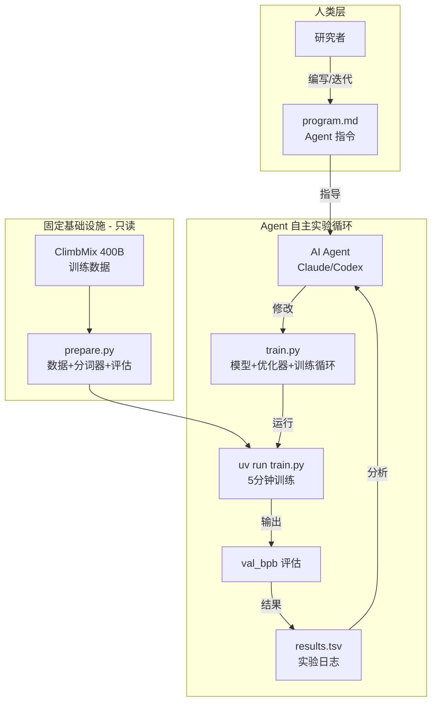
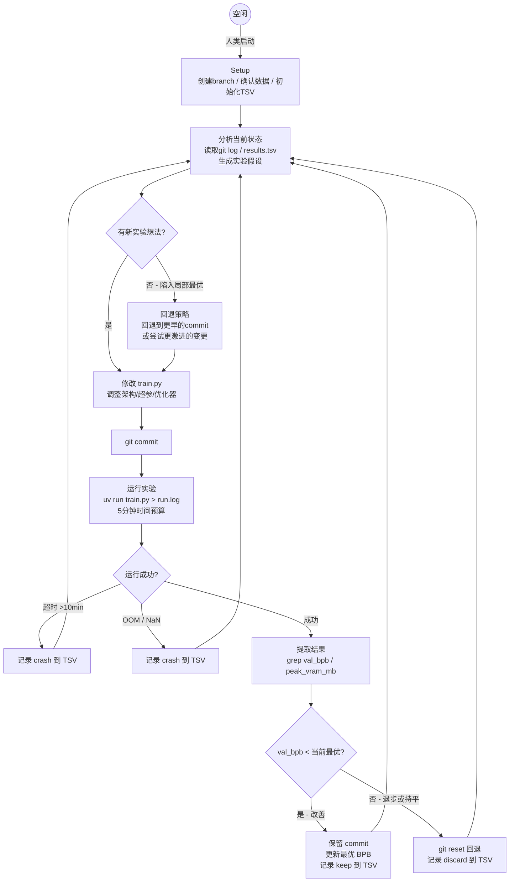
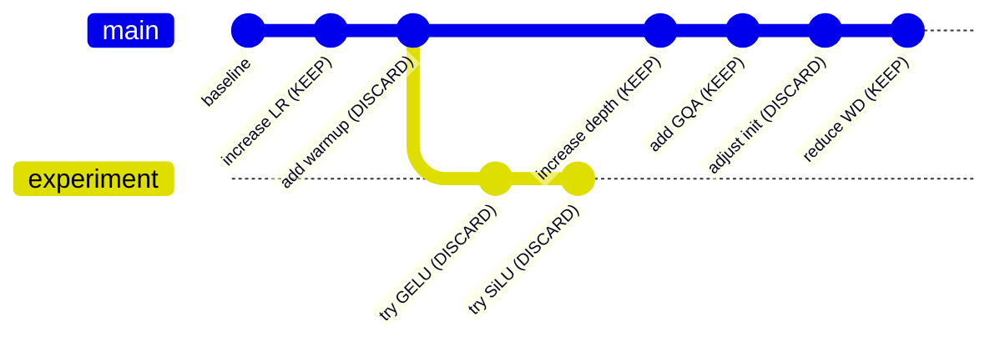
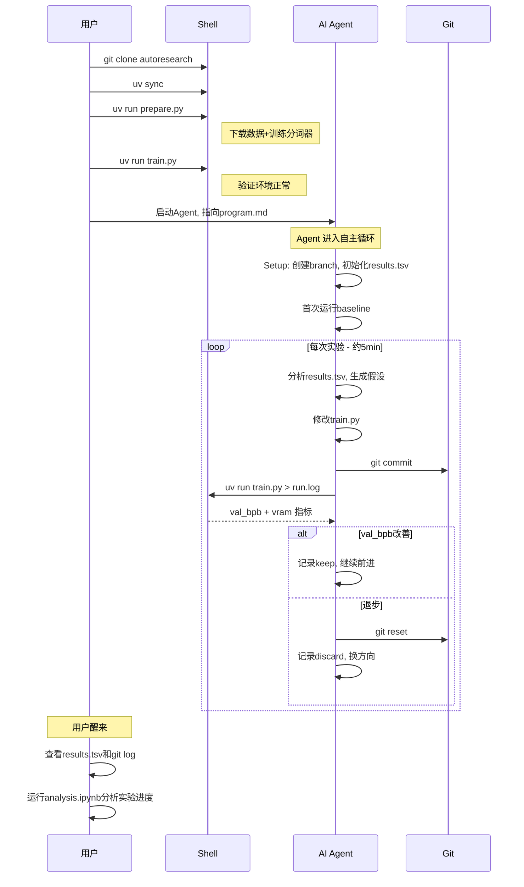
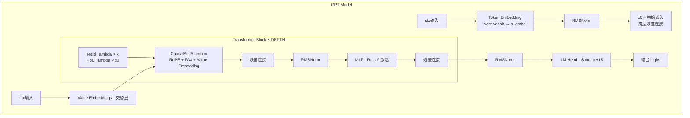
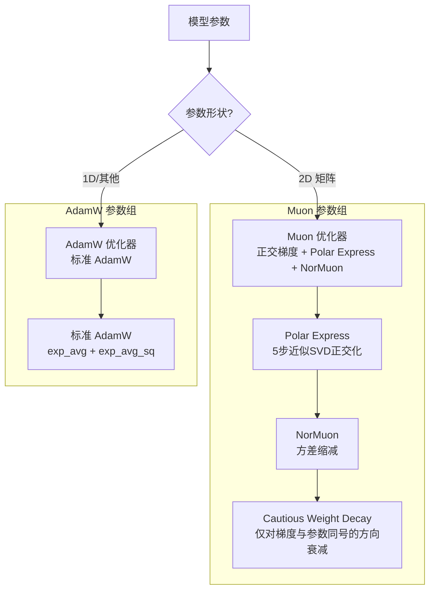
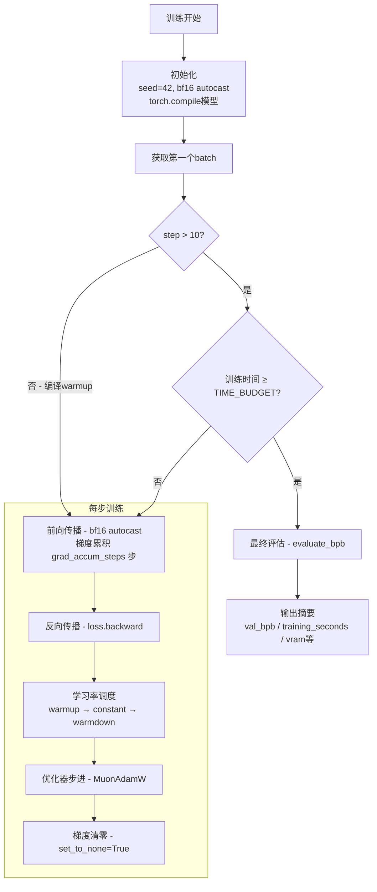
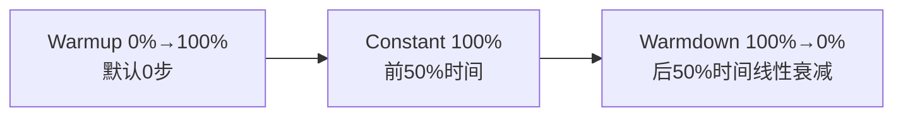
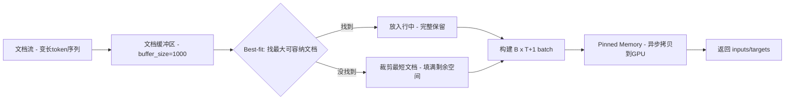

# autoresearch 开源项目技术调研报告

> 调研人：henryhu | 调研时间：2026-06-08 | 项目版本：0.1.0 (无正式 release)
> 项目地址：https://github.com/karpathy/autoresearch
> 许可证：MIT

---

## 一、概述与背景

### 1. 项目概述

#### 1.1 项目定位与核心价值

| 属性 | 值 |
|------|-----|
| 项目名称 | autoresearch |
| 作者 | Andrej Karpathy |
| GitHub | https://github.com/karpathy/autoresearch |
| 一句话定位 | AI Agent 自主进行 LLM 预训练实验的研究框架 |
| 核心价值 | 让 AI Agent 在无人值守情况下自主迭代优化模型，人类醒来即可查看实验结果 |

autoresearch 的核心理念：**把 LLM 训练研究本身交给 AI Agent 来做**。人类编写 Agent 指令（`program.md`），Agent 在指令约束下自主修改训练代码（`train.py`），通过实验循环迭代优化——每次实验5分钟，过夜可跑100+次，醒来查看结果。

#### 1.2 项目背景与起源

autoresearch 由 Andrej Karpathy 于 2026 年 3 月创建并开源。Karpathy 曾是 OpenAI 联合创始成员、Tesla AI 总监，在深度学习社区极具影响力。

项目的科幻式开场白写道：

> *"One day, frontier AI research used to be done by meat computers in between eating, sleeping... That era is long gone. Research is now entirely the domain of autonomous swarms of AI agents running across compute cluster megastructures in the skies."*

项目基于 Karpathy 此前的 [nanochat](https://github.com/karpathy/nanochat) 项目简化而来——nanochat 是一个极简的 LLM 训练实现，autoresearch 在此基础上增加了 Agent 自主实验循环的设计。

#### 1.3 解决的核心问题

**痛点**：LLM 预训练的模型架构、超参数、优化器选择需要大量实验迭代，人类研究者受限于时间和精力，一天最多做十几次实验。

**解决方案核心思路**：
- 将实验迭代交给 AI Agent 自主执行
- 固定时间预算（5分钟/实验），使实验结果可直接对比
- Agent 自主修改代码、运行训练、评估结果、决定保留或丢弃
- 人类只需定义 `program.md`（Agent 指令）和初始 `train.py`，然后睡觉

#### 1.4 目标用户与使用场景

| 用户群体 | 使用场景 |
|---------|---------|
| AI 研究者 | 过夜跑 100+ 实验，醒来查看最优配置 |
| 深度学习爱好者 | 在单 GPU 上学习 LLM 训练全流程 |
| Agent 开发者 | 研究 AI Agent 自主实验循环的设计模式 |
| 教育场景 | 理解 GPT 训练、优化器、评估指标的完整实现 |

#### 1.5 项目成熟度评估

| 指标 | 值 |
|------|-----|
| Star 数 | **85,583** (截至 2026-06-08) |
| Fork 数 | 12,396 |
| 贡献者 | 9 人（Karpathy 本人 28 次提交，其余各 1 次） |
| 开源时间 | 2026-03-06 |
| 最后推送 | 2026-03-26 |
| 正式 Release | 无 |
| Open Issues | 184 |
| License | MIT |

项目热度极高（3 个月内 85K+ Star），但核心代码几乎完全由 Karpathy 一人维护。社区贡献以 bug 修复和平台适配 Fork 为主。项目处于早期实验阶段，无语义化版本号和正式 release。

### 2. 设计动机与目标

#### 2.1 设计动机

Karpathy 的核心洞察：**当前 AI 研究流程中，人类是瓶颈**。研究者需要手动设计实验、等待训练、分析结果、调整策略、重复。每个实验周期约 5 分钟，人类一天最多做 ~100 次实验，且需要持续关注。而 AI Agent 不需要休息，可以不间断执行实验循环。

#### 2.2 与竞品的差异化定位

| 竞品 | 定位 | 与 autoresearch 的区别 |
|------|------|----------------------|
| AI Scientist (Sakana) | 自动化科学研究全流程（含论文撰写） | 聚焦科学发现，非 LLM 训练优化 |
| OpenHands | 通用 AI 软件开发 Agent | 通用编码，无实验循环设计 |
| AutoML 框架 (Optuna等) | 超参数搜索 | 传统搜索策略，非 LLM Agent 驱动 |
| Aider/Cursor | AI 辅助编码 | 人机协作，非自主实验循环 |

autoresearch 的独特之处：**用 LLM Agent 驱动 LLM 自身的训练优化**——一种递归式的自我改进范式。

#### 2.3 核心设计目标与技术约束

按优先级排序的设计目标：

1. **自主性**：Agent 无需人类干预，持续自主实验
2. **可比较性**：固定时间预算使所有实验结果可横向对比
3. **简洁性**：极简代码库（3 个核心文件），降低 Agent 理解成本
4. **可审查性**：Git 追踪每次实验变更，`results.tsv` 记录所有结果

技术约束与取舍：

| 约束 | 取舍理由 |
|------|---------|
| 单 GPU only | 避免分布式训练复杂度，保持代码极简 |
| 固定 5 分钟时间预算 | 实验结果可直接对比，但不同平台结果不可比 |
| 禁止修改 `prepare.py` | 保护评估指标和数据管线的完整性 |
| 禁止添加依赖 | 防止 Agent 安装不安全/不兼容的包 |
| 仅修改 `train.py` | 单文件变更，diff 可审查 |

---

## 二、核心架构：Agent 自主实验循环

> 本章聚焦 autoresearch **框架本身**——即"AI Agent 如何自主做研究"这一核心机制。训练实现细节在第三章展开。

### 3. 整体架构

autoresearch 采用**指令驱动式自主实验框架**架构。整个系统只有三个核心文件，职责分明：



**核心设计原则**：

1. **最小可修改面**：Agent 只需修改 `train.py` 一个文件，减少出错可能
2. **评估不可篡改**：`prepare.py` 中 `evaluate_bpb` 是 ground truth，Agent 无法作弊
3. **时间归一化**：固定 5 分钟预算，消除模型大小/复杂度对实验时间的影响
4. **渐进式 Git 历史**：每次成功的实验都有独立 commit，可随时回退
5. **Simplicity Criterion**：等价效果下更简单的方案优先，复杂度增加需要显著收益才值得

**项目目录结构**：

```
autoresearch/
├── prepare.py        # 固定基础设施（常量+数据+分词+评估）- 不可修改
├── train.py          # Agent 可修改的训练代码（模型+优化器+循环）
├── program.md        # Agent 指令文档 - 仅人类修改
├── pyproject.toml    # 依赖声明 - 不可修改
├── uv.lock           # 锁文件
├── analysis.ipynb    # 实验结果分析 notebook
└── README.md         # 项目说明
```

`prepare.py` 对 `train.py` 暴露的关键接口：

| 接口 | 类型 | 说明 |
|------|------|------|
| `MAX_SEQ_LEN = 2048` | 常量 | 上下文长度 |
| `TIME_BUDGET = 300` | 常量 | 训练时间预算（秒） |
| `EVAL_TOKENS = 40 * 524288` | 常量 | 验证集评估 token 数 |
| `Tokenizer` | 类 | BPE 分词器封装 |
| `make_dataloader(tokenizer, B, T, split)` | 函数 | BOS 对齐 + Best-fit 打包数据加载器 |
| `evaluate_bpb(model, tokenizer, batch_size)` | 函数 | Bits-per-byte 评估（ground truth 指标） |

### 4. program.md：Agent 编程范式

`program.md` 是 autoresearch 最核心的设计创新——它是一种**面向 AI Agent 的声明式程序**。与传统编程的对比：

| 传统编程 | autoresearch |
|---------|-------------|
| 程序员编写代码 | 人类编写 program.md |
| 编译器执行代码 | AI Agent 解读 program.md |
| 代码定义算法 | program.md 定义行为约束和目标 |
| 输出是计算结果 | 输出是实验结果和代码变更 |

#### 4.1 program.md 的五大设计要素

**1. 可做/不可做边界**（约束声明）

- **可做**：修改 `train.py` 中的一切（架构、优化器、超参、batch size、模型大小）
- **不可做**：修改 `prepare.py`、添加依赖、篡改评估
- 效果：将无限搜索空间约束到安全范围内

**2. 目标函数**（奖励定义）

- 唯一目标：最低 `val_bpb`
- 效果：明确优化方向，避免 Agent 偏离

**3. 简洁性准则**（偏好注入）

- 等效时简单优先
- 0.001 BPB 改善 + 20行复杂代码 → 不值得
- 0.001 BPB 改善 + 删代码 → 值得保留
- 效果：防止 Agent 产生过度复杂的代码

**4. 永不停止**（执行策略）

- NEVER STOP, NEVER ASK
- 效果：确保 Agent 持续实验，不等待人类

**5. 结果格式**（输出协议）

- TSV 格式、git commit hash
- 效果：结构化记录，便于后续分析

#### 4.2 program.md 的迭代演化

默认版本是 bare-bones baseline。用户可以像迭代代码一样迭代 program.md 本身——添加实验策略指导、引用论文方法、定义多 Agent 协作规则等。Karpathy 称之为寻找最优的"research org code"。

### 5. 实验循环

autoresearch 的核心是一个 **Agent-Driven Evolutionary Search**（Agent 驱动的进化搜索）。可以形式化为三元组 `(S, A, R)`：

| 符号 | 含义 | autoresearch 映射 |
|------|------|------------------|
| **S** (State) | 当前搜索状态 | `train.py` 的代码内容 + Git commit hash |
| **A** (Action) | Agent 可采取的操作 | 修改 `train.py` 中的架构/超参/优化器等 |
| **R** (Reward) | 状态评估信号 | `val_bpb`（越低越好） |

搜索过程：Agent 在状态 `S_t` 下执行动作 `A_t`，产生新状态 `S_{t+1}`，获得奖励 `R_{t+1} = val_bpb(S_{t+1})`。若 `R_{t+1} < R_t`（BPB 降低），保留 `S_{t+1}`；否则回退到 `S_t`。

#### 5.1 实验循环状态机



#### 5.2 搜索空间

autoresearch 的搜索空间由 `train.py` 中所有可调参数构成：

| 维度 | 搜索范围 | 示例变更 |
|------|---------|---------|
| **模型架构** | GPTConfig 全部字段 | 增减层数/头数/维度/窗口模式 |
| **激活函数** | 任意 PyTorch 激活 | ReLU² → GELU → SiLU → SwiGLU |
| **注意力机制** | FA3 参数 + 窗口模式 | SSSL → SLL → 全 L；加 GQA |
| **优化器** | MuonAdamW 全部参数 | LR / momentum / weight_decay / beta |
| **训练循环** | batch_size / 梯度累积 / LR调度 | 增大batch / 添加warmup / 修改warmdown |
| **初始化策略** | 所有权重初始化 | 调整 std / 改用不同初始化分布 |
| **正则化** | 新增正则化手段 | Dropout / Label Smoothing / 修改 Softcap |
| **模型创新** | 架构级别变更 | 添加新模块 / 修改残差连接方式 |

仅超参数维度就有 ~20+ 个连续/离散变量，加上架构变更则接近无限。传统 AutoML 难以有效搜索，但 LLM Agent 可以利用其训练数据中的研究经验来启发式导航。

#### 5.3 Agent 决策策略

program.md 未规定具体实验策略，但从实验循环中可归纳四种模式：

**1. 渐进式优化（最常见）**
```
baseline → 调高LR → 增加warmup → 增大模型 → 调整WD → ...
```
每次只改一个变量，观察效果后决定保留或回退。

**2. 组合探索**
```
变更A (keep) → 在A基础上变更B (keep) → A+B组合效果叠加
```
利用 git 的累积特性，成功的变更叠加在一起。

**3. 回退后激进探索**
连续多个实验被 discard 后，Agent 可能回退到更早的 commit、尝试更激进的架构变更、或完全更换组件。

**4. 简化优先**
删除代码并保持效果 → 优先保留；0.001 BPB 改善 + 20行复杂代码 → 不值得。

### 6. Git 状态管理与结果记录

#### 6.1 Git 分支策略

autoresearch 利用 Git 作为实验状态管理器：



- 每次实验前 `git commit`，无论结果如何都有记录
- 改善则保留 commit（分支继续前进），退步则 `git reset` 回退
- 实验运行在专属分支 `autoresearch/<tag>` 上
- 多 GPU 时可加后缀（如 `autoresearch/mar5-gpu0`）

#### 6.2 results.tsv 记录机制

| 字段 | 说明 |
|------|------|
| `commit` | 7 位 git commit hash |
| `val_bpb` | 验证 BPB 值（崩溃时填 0.000000） |
| `memory_gb` | 峰值显存 GB（崩溃时填 0.0） |
| `status` | `keep`（保留）/ `discard`（丢弃）/ `crash`（崩溃） |
| `description` | 实验描述（纯文本，不能用逗号） |

示例：
```
commit	val_bpb	memory_gb	status	description
a1b2c3d	0.997900	44.0	keep	baseline
b2c3d4e	0.993200	44.2	keep	increase LR to 0.04
c3d4e5f	1.005000	44.0	discard	switch to GeLU activation
```

`results.tsv` 不纳入 Git 追踪，保证分支历史干净。

### 7. 端到端工作流

用户从零开始使用 autoresearch 的完整流程：



**实验循环的时间经济学**：

| 指标 | 值 |
|------|-----|
| 单次实验时长 | ~5 分钟（训练）+ ~25 秒（启动+编译+评估） |
| 每小时实验数 | ~12 次 |
| 8 小时（过夜）实验数 | ~100 次 |

以 100 次实验为例，假设 keep rate 约 30%，则约 30 次有效改进。若每次改进降低 0.001-0.005 BPB，总改善约 0.03-0.15 BPB。

---

## 三、训练实现：模型、优化器与数据

> 本章聚焦 autoresearch 的训练技术实现——GPT 模型架构、MuonAdamW 优化器、训练循环和数据管线。这些是 Agent 可以修改和迭代的内容。

### 8. GPT 模型架构

#### 8.1 模型整体结构

autoresearch 实现了一个现代 GPT 模型，包含多项近年的架构改进：



#### 8.2 关键架构特性

**1. RMSNorm（替代 LayerNorm）**

```python
def norm(x):
    return F.rms_norm(x, (x.size(-1),))
```
无需可学习 bias/weight 参数，计算更高效。应用于注意力和 MLP 前（Pre-Norm 架构）。

**2. Rotary Position Embedding (RoPE)**

预计算 cos/sin 缓冲区（序列长度 ×10 余量），应用于 Q 和 K 旋转编码相对位置信息，V 不应用 RoPE。

**3. Flash Attention 3 (FA3)**

自动选择内核：H100 用 `varunneal/flash-attention-3`，其他 GPU 用 `kernels-community/flash-attn3`。支持滑动窗口注意力（window_size 参数）。

**4. Value Embedding (ResFormer)**

```python
def has_ve(layer_idx, n_layer):
    return layer_idx % 2 == (n_layer - 1) % 2  # 交替层，最后一层必定包含
```
每个有 VE 的层有一个独立的 `nn.Embedding(vocab_size, kv_dim)`，通过 input-dependent gate 混入 Value：`v = v + gate * ve`。Gate 初始化为零（sigmoid(0)×2 = 1.0 = 中性）。

**5. 跨层残差连接 (x0_lambdas)**

```python
x = resid_lambdas[i] * x + x0_lambdas[i] * x0
```
`x0` 是初始 token embedding（经 RMSNorm 后）。`resid_lambdas` 初始化为 1.0，`x0_lambdas` 初始化为 0.1。提供从输入到每一层的快捷路径，类似 DenseNet 的跨层连接。

**6. 滑动窗口注意力 (Window Pattern)**

```python
WINDOW_PATTERN = "SSSL"  # S=半窗, L=全窗
```
S = `sequence_len // 2`，L = `sequence_len`。最后一层强制为 L（全上下文），在节省计算与保留长程依赖之间取得平衡。

**7. Logit Softcap**

```python
softcap = 15
logits = softcap * torch.tanh(logits / softcap)
```
将 logits 范围限制在 [-15, 15]，防止极端 logits 导致训练不稳定（参考 Gemma）。

**8. ReLU² 激活**

```python
x = F.relu(x).square()  # ReLU² = ReLU(x)²
```
比 GELU/SwiGLU 更简单，无需门控机制，减少参数量。

#### 8.3 模型默认配置

| 参数 | 默认值 | 计算方式 |
|------|--------|---------|
| DEPTH | 8 | 手动设定 |
| ASPECT_RATIO | 64 | model_dim = depth × 64 |
| HEAD_DIM | 128 | 目标注意力头维度 |
| WINDOW_PATTERN | "SSSL" | S=半窗 L=全窗 |
| n_embd | 512 | 8 × 64 = 512, 对齐到 HEAD_DIM |
| n_head | 4 | 512 / 128 = 4 |
| n_kv_head | 4 | 同 n_head（无 GQA） |
| vocab_size | 8192 | BPE 分词器决定 |
| sequence_len | 2048 | MAX_SEQ_LEN |

#### 8.4 初始化策略

| 参数 | 初始化方式 |
|------|-----------|
| wte (Token Embedding) | Normal(0, 1.0)，然后转 bf16 |
| lm_head (LM Head) | Normal(0, 0.001) |
| Q/K/V 权重 | Uniform(-s, s), s = √3 × d_model^(-0.5) |
| Attention 输出投影 | Zeros |
| MLP 上投影 | Uniform(-s, s) |
| MLP 下投影 | Zeros |
| resid_lambdas | 1.0 |
| x0_lambdas | 0.1 |
| ve_gate | Zeros → sigmoid(0)×2 = 1.0（中性门控） |
| Value Embedding | Uniform(-s, s)，然后转 bf16 |

### 9. MuonAdamW 混合优化器

这是 autoresearch 最复杂的技术实现，结合了 Muon 正交优化器和 AdamW 优化器。

#### 9.1 整体设计



#### 9.2 Muon 优化器核心算法

Muon (Momentum + Orthogonal) 核心思想是对 2D 权重矩阵的梯度进行正交化处理，使更新方向更加均匀。

**Step 1: Nesterov Momentum**

```python
momentum_buffer.lerp_(stacked_grads, 1 - momentum)
g = stacked_grads.lerp_(momentum_buffer, momentum)  # Nesterov 风格
```

**Step 2: Polar Express 正交化**

快速近似 SVD 的方法，用多项式迭代逼近正交矩阵：

```python
polar_express_coeffs = [
    (8.157, -22.483, 15.879),
    (4.043, -2.809, 0.500),
    (3.892, -2.772, 0.506),
    (3.286, -2.368, 0.464),
    (2.347, -1.710, 0.423),
]
X = g / (g.norm() * 1.02 + 1e-6)  # 归一化
# 5步极坐标迭代 (近似 UV^T of SVD)
if rows > cols:  # 高瘦矩阵
    for a, b, c in coeffs[:5]:
        A = X.T @ X; B = b * A + c * (A @ A); X = a * X + X @ B
else:  # 矮胖矩阵
    for a, b, c in coeffs[:5]:
        A = X @ X.T; B = b * A + c * (A @ A); X = a * X + B @ X
```

**Step 3: NorMuon 方差缩减**

```python
v_mean = g.square().mean(dim=red_dim, keepdim=True)
second_momentum_buffer.lerp_(v_mean, 1 - beta2)
step_size = rsqrt(second_momentum_buffer.clamp_min(1e-10))
final_scale = step_size * (v_norm / v_norm_new)
g = g * final_scale
```

**Step 4: Cautious Weight Decay + 参数更新**

```python
mask = (g * stacked_params) >= 0  # 只对梯度与参数同号的方向施加 weight decay
stacked_params.sub_(lr * g + lr * wd * stacked_params * mask)
```

#### 9.3 优化器参数分组

| 参数组 | 优化器 | 学习率 | 初始化 LR |
|--------|--------|--------|----------|
| lm_head | AdamW | 0.004 × d_scale | unembedding_lr |
| wte (Token Embedding) | AdamW | 0.6 × d_scale | embedding_lr |
| Value Embeddings | AdamW | 0.6 × d_scale | embedding_lr |
| resid_lambdas | AdamW | 0.005 | scalar_lr × 0.01 |
| x0_lambdas | AdamW | 0.5 | scalar_lr |
| 2D 矩阵参数 (Q/K/V/MLP) | Muon | 0.04 × shape_factor | matrix_lr |

学习率缩放：`d_scale = (model_dim / 768)^(-0.5)`，模型维度偏离 768 时自动缩放。

#### 9.4 Muon 特殊机制

**动量调度**：`momentum` 从 0.85 线性增长到 0.95（300步内）
**Weight Decay 调度**：`WD × (1 - progress)`，随训练线性衰减
**形状自适应 LR**：`lr × max(1.0, rows/cols)^0.5`，非方阵补偿

### 10. 训练循环

#### 10.1 训练流程



#### 10.2 超参数默认值

| 超参数 | 默认值 | 说明 |
|--------|--------|------|
| TOTAL_BATCH_SIZE | 2^19 ≈ 524K | 每优化器步的总 token 数 |
| DEVICE_BATCH_SIZE | 128 | 每设备 micro-batch 大小 |
| EMBEDDING_LR | 0.6 | Embedding 学习率 |
| UNEMBEDDING_LR | 0.004 | LM Head 学习率 |
| MATRIX_LR | 0.04 | 矩阵参数学习率 (Muon) |
| SCALAR_LR | 0.5 | 标量参数学习率 |
| WEIGHT_DECAY | 0.2 | Cautious WD |
| ADAM_BETAS | (0.8, 0.95) | Adam beta1, beta2 |
| WARMUP_RATIO | 0.0 | 无 warmup |
| WARMDOWN_RATIO | 0.5 | 后 50% 时间线性衰减 |
| FINAL_LR_FRAC | 0.0 | 最终 LR 为 0 |

#### 10.3 学习率调度



#### 10.4 关键工程优化

**1. torch.compile 全图编译**：`fullgraph=True` 编译优化器步进函数，避免动态形状重编译

**2. 梯度累积**：`grad_accum_steps = 2^19 // (128 × 2048) = 2`，等效 batch size 524K tokens

**3. GC 管理**：训练开始时 `gc.freeze()` + `gc.disable()`，每 5000 步手动 `gc.collect()`（Python GC 会导致 ~500ms 停顿）

**4. NaN/爆炸检测**：`loss > 100` 或 NaN 时 `exit(1)` 快速失败

**5. 显存优化**：`PYTORCH_ALLOC_CONF=expandable_segments:True` 减少碎片

**6. CUDA Pinned Memory**：`pin_memory=True` + `non_blocking=True` 异步 CPU→GPU 拷贝

### 11. 数据管线与评估

#### 11.1 ClimbMix 数据集

| 属性 | 值 |
|------|-----|
| 数据集 | ClimbMix-400B-Shuffle |
| 来源 | HuggingFace (`karpathy/climbmix-400b-shuffle`) |
| 格式 | Parquet（6543 个分片） |
| 验证集 | 固定使用最后一个分片 `shard_06542.parquet` |
| 下载方式 | 多进程并行下载，支持断点续传 |

#### 11.2 BPE 分词器

| 属性 | 值 |
|------|-----|
| 训练算法 | rustbpe (Rust 实现 BPE) |
| 推理引擎 | tiktoken (OpenAI 分词库) |
| 词表大小 | 8192 (含 4 个 special tokens) |
| 分词模式 | GPT-4 风格正则（数字 1-2 位） |
| BOS Token | `<\|reserved_0\|>` |

#### 11.3 Best-fit Packing 数据加载

`make_dataloader` 实现了一种高效的数据打包策略：

1. **BOS 对齐**：每个文档前插入 BOS token
2. **Best-fit 打包**：在固定长度 (T+1) 的行中，贪心放入最大可容纳的文档
3. **裁剪兜底**：无文档可完整放入时，裁剪最短文档填满剩余空间
4. **100% 利用率**：无 padding，所有 token 位置都有意义



#### 11.4 Bits-per-Byte (BPB) 评估

BPB 是 autoresearch 的核心评估指标，vocab-size-independent：

```python
BPB = Σ(cross_entropy_nats) / (ln(2) × Σ(target_byte_lengths))
```

- 对每个 token 计算交叉熵（nats）
- 乘以该 token 对应的字节数作为权重
- 排除 special tokens（字节数为 0）
- 最终转换为 bits/byte

选择 BPB 而非 perplexity 的理由：当 Agent 修改 vocab_size 时，perplexity 不可直接比较，而 BPB 归一化到字节级别，消除了词表大小的影响。

---

## 四、扩展与生态

### 12. 扩展机制

#### 12.1 program.md 自定义

`program.md` 是人类可迭代修改的"研究组织程序"。默认版本是 bare bones baseline，但用户可以：
- 添加更多上下文和约束
- 定义多 Agent 协作策略
- 添加外部论文/方法引用
- 修改实验策略（如指定尝试某些优化方向）

#### 12.2 多 Agent 编排

README 提到但未实现的扩展方向：
- 多 Agent 并行实验（不同 GPU 上跑不同实验）
- Agent 间共享结果和策略
- "Research org code" 概念：通过迭代 program.md 本身来优化研究效率

#### 12.3 平台适配 Forks

| Fork | 平台 | 地址 |
|------|------|------|
| autoresearch-macos | macOS | github.com/miolini/autoresearch-macos |
| autoresearch-mlx | macOS (MLX) | github.com/trevin-creator/autoresearch-mlx |
| autoresearch-win-rtx | Windows RTX | github.com/jsegov/autoresearch-win-rtx |
| andyluo7/autoresearch | AMD ROCm | github.com/andyluo7/autoresearch |

README 还提供了小平台适配指南：降低 vocab_size、MAX_SEQ_LEN、DEPTH、EVAL_TOKENS，使用 TinyStories 数据集等。

### 13. 社区与生态

#### 13.1 社区活跃度

| 指标 | 值 |
|------|-----|
| Star 增速 | 85K+ / 3个月 ≈ 28K/月 |
| Open Issues | 184 |
| Forks | 12,396 |
| 贡献者多样性 | 低（核心 1 人） |
| 最近活跃度 | 最后推送 2026-03-26，之后无新 commit |

#### 13.2 讨论热点（Open Issues 示例）

- RTX 3060 等小平台实验结果分享
- Agent 能否在不真正改善模型的情况下降低 val_bpb（作弊问题）
- 跨平台支持请求
- PyTorch 版本升级建议

---

## 五、质量与评估

### 14. 代码质量

| 指标 | 值 |
|------|-----|
| 核心代码文件 | 2 (prepare.py + train.py) |
| prepare.py | ~390 行 |
| train.py | ~630 行 |
| 总代码行数 | ~1020 行 |
| 编程语言 | 100% Python |
| 外部依赖 | 8 个 (torch, tiktoken, rustbpe, pyarrow等) |

**代码风格**：
- 极简风格：无类型注解，最少注释
- 内联超参数：所有超参直接定义在 `train.py` 顶部
- torch.compile 友好：`@torch.compile(fullgraph=True)` 装饰优化器步进
- 0-D CPU 张量技巧：避免 torch.compile 重编译

**测试**：项目无测试代码。验证方式为 tokenizer roundtrip sanity check、NaN 检测和事后 analysis.ipynb 分析。

### 15. 技术评估

#### 15.1 技术优势

| 优势 | 说明 |
|------|------|
| **极简设计** | 3 个核心文件 ~1000 行代码，Agent 可完整理解项目 |
| **评估公平性** | BPB 指标 + 固定时间预算 + 不可修改评估代码 |
| **自主实验循环** | 真正的无人值守实验，人类只需定义 program.md |
| **现代训练技术栈** | Muon + FA3 + bf16 + torch.compile + 最佳实践初始化 |
| **Git 可追溯** | 每次 keep 的实验都有 commit，可随时回退审查 |
| **跨词表可比** | BPB 指标使不同 vocab_size 的实验可公平对比 |

#### 15.2 技术劣势与风险

| 劣势/风险 | 说明 |
|-----------|------|
| **单 GPU 限制** | 不支持分布式训练，大模型探索受限 |
| **平台绑定** | 默认仅支持 NVIDIA GPU (H100)，其他平台需 Fork |
| **Agent 可能作弊** | Agent 可能找到降低 BPB 但不改善模型的技巧 |
| **无正式 Release** | 无版本号，API 不稳定 |
| **结果不可跨平台对比** | 固定时间预算意味着不同硬件的结果无法对比 |
| **实验循环不可靠** | Agent 可能在简单 bug 上反复失败，浪费计算 |
| **安全风险** | README 建议"disable all permissions"运行 Agent |

#### 15.3 适用场景建议

**推荐使用**：
- 有 H100/A100 等 NVIDIA GPU 的研究者，希望过夜自动优化预训练配置
- 学习现代 LLM 训练技术的教育场景
- 研究 AI Agent 自主实验设计模式的开发者

**不推荐使用**：
- 无 NVIDIA GPU 的环境（需使用 Fork 版本）
- 需要分布式训练的大规模预训练场景
- 对结果可复现性有严格要求的学术研究

**使用注意事项**：
- 首次运行务必先手动执行 `uv run train.py` 确认环境
- 注意 Agent 可能产生大量 Git commit
- `results.tsv` 不纳入 Git，注意备份
- 监控 GPU 显存使用，防止 OOM

#### 15.4 选型决策建议

| 评估维度 | 评分 | 说明 |
|---------|------|------|
| 创新性 | ⭐⭐⭐⭐⭐ | AI Agent 自主实验研究，开创性范式 |
| 代码质量 | ⭐⭐⭐⭐ | 极简但实现精良，工程实践佳 |
| 可用性 | ⭐⭐⭐ | 对 H100 用户友好，其他平台需适配 |
| 可扩展性 | ⭐⭐⭐ | program.md 可扩展，但架构上支持有限 |
| 成熟度 | ⭐⭐ | 早期实验阶段，无正式 release |
| 社区生态 | ⭐⭐⭐⭐ | Star 数极高，Fork 活跃，但核心开发集中 |

---

## 附录

### A. 参考资源

- [GitHub 仓库](https://github.com/karpathy/autoresearch)
- [Karpathy 推文 (项目发布)](https://x.com/karpathy/status/2029701092347630069)
- [Karpathy 推文 (后续更新)](https://x.com/karpathy/status/2031135152349524125)
- [DataCamp 教程](https://www.datacamp.com/tutorial/guide-to-autoresearch)
- [Dummy's Guide to Neural Networks](https://x.com/hooeem/status/2030720614752039185)
- [nanochat (上游项目)](https://github.com/karpathy/nanochat)
- [ClimbMix 数据集](https://huggingface.co/datasets/karpathy/climbmix-400b-shuffle)

### B. 术语表

| 术语 | 全称 | 说明 |
|------|------|------|
| BPB | Bits Per Byte | 字节级别的压缩度量，vocab-size-independent |
| FA3 | Flash Attention 3 | Hopper GPU 上的高效注意力实现 |
| RoPE | Rotary Position Embedding | 旋转位置编码 |
| VE | Value Embedding | ResFormer 风格的值嵌入 |
| MFU | Model FLOPs Utilization | 模型计算效率指标 |
| Muon | Momentum + Orthogonal | 基于正交化的矩阵优化器 |
| GQA | Grouped Query Attention | 分组查询注意力（本项目未使用） |

### C. 调研信息

| 项目 | 值 |
|------|-----|
| 调研人 | henryhu |
| 调研时间 | 2026-06-08 |
| 调研版本 | 0.1.0 (commit: 228791f) |
| 调研深度 | 详细 |
| 重点关注 | Agent自主研究机制、训练技术实现 |

---

*报告版本: v2.0 | 生成工具: Claude Code Research Skill*
