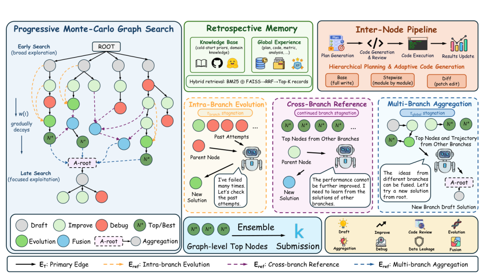

# ai 自进化别再让它从零试错：给Agent装上记忆+图搜索

Source: https://mp.weixin.qq.com/s/ovBCHjcn-DEvVS9nkTjYlg

# ai 自进化别再让它从零试错：给Agent装上记忆+图搜索

原创

Tensorlong看天下
Tensorlong看天下

[沈公子今天读什么](javascript:void(0);)

在小说阅读器读本章

去阅读

在小说阅读器中沉浸阅读

> 一句话摘要：上海 AI Lab 和华东师大提出自进化框架 MLEvolve，核心三件套：跨分支的渐进式图搜索、冷启动+动态积累的回顾式记忆、规划与编码解耦的自适应代码生成。它不仅在 MLE-Bench 用减半预算刷到 65.3% 夺牌率，还把能力迁移到数学算法发现，超过 AlphaEvolve。（原论文题目见文末，点击阅读原文可直接跳转至原文链接，Published on arxiv on 04 Jun 2026, by Shanghai AI Laboratory）

各位小伙伴好，我创建了学术交流群，涵盖大模型Agent/CV/深度学习/多模态AI流行趋势等各个方向，欢迎进群交流，一起进步！

### 第一阶段：识别核心概念

#### 论文的motivation分析

在复杂的机器学习工程（Machine Learning Engineering，MLE）中，算法的设计与优化是一个长周期的持续迭代过程。传统的自动化机器学习（AutoML）方法往往只能解决数据预处理或模型选择等单一环节的离散优化，无法实现覆盖端到端全流程的自主演进。随着大语言模型（LLM）智能体的发展，虽然出现了许多尝试端到端编写机器学习代码的系统，但这系列系统仍旧受制于三个核心瓶颈：

• 第一，分支探索的信息孤立（Branch Isolation）。传统的树状或线性搜索空间使得不同的尝试路线相互隔离，各分支在运行中产生的独特灵感和有用代码片段无法实现组间共享。

• 第二，无记忆搜索（Memoryless Search）。智能体在每一步规划时，往往只依赖单一的标量分数反馈，缺乏对历史成败经验（包括代码报错、失效策略等）的主动总结和精细复用，导致在长周期搜索中重复犯错。

• 第三，缺乏层次化的生成控制（Lack of Hierarchical Control）。绝大多数系统将宏观算法规划和微调代码实现混为一谈，采用一步到位的全文件重写模式。这导致微小的策略调整也需要全盘重构，迭代极其不稳定且极易引入新的语法错误。

#### 论文主要贡献点分析

• **主要创新点**

◦ 提出了名为 MLEvolve 的全新自我演进多智能体算法发现框架。

◦ 提出了渐进式蒙特卡洛图搜索（Progressive Monte Carlo Graph Search，MCGS），通过引入引用边，将经典的树形搜索结构升格为图状结构，打破了分支孤立，并设计了熵启发的渐进式搜索策略。

◦ 引入了回顾式记忆机制（Retrospective Memory），将冷启动的领域先验知识库与运行期自动积累、双路检索的任务特定动态记忆有机融合。

◦ 设计了规划与编码解耦的层次化管线，配合全文重写、分模块生成和局部差分修改三种自适应编码粒度，保障了代码生成的稳定性。

• **支撑这些创新的关键技术或方法**

◦ 引用边（Reference Edges，ref）：图搜索中专门用于跨分支流动信息和合并代码的非回传型边结构。

◦ 渐进式软切换机制：利用随进度衰减的控制权重，在前期采用 UCT 广度探索，在后期直接进入高价值精英节点的深度微调。

◦ RRF（Reciprocal Rank Fusion）记忆融合检索：结合关键词匹配与语义检索，实现高精度历史策略与 Bug 修复经验的提取。

◦ 差分补丁生成（Diff Edit Mode）：只对代码中需要改动的部分生成差异补丁，避免全盘重写带来的不稳定副作用。

• **显著性成果**

◦ 在含有 75 个真实 Kaggle 竞赛任务的权威基准 MLE-Bench 上，MLEvolve 仅给定标准时间一半的 12 小时预算，就达成了 65.3% 的平均奖牌率、34.7% 的全满分金牌率，以及 100% 的有效提交率，性能显著超越了使用 24 小时完整预算的所有主流闭源与开源 baseline 智能体。同时，其在纯数学算法发现上表现出了极强的跨领域泛化能力。

#### 理解难点识别

• **关键概念与方法**

◦ 理解 Progressive MCGS 如何通过多级停滞检测（Multi-Level Stagnation Detection）在不同层级触发不同的图扩展算子。

◦ 探索在引入引用边（Reference Edges）打破分支孤立的同时，如何设计反向传播机制才能不稀释各个分支原本独立的价值评估。

• **挑战性部分与核心概念**

◦ 掌握回顾式记忆在规划阶段与调试阶段的“阶段感知检索（Stage-aware Retrieval）”机制。

◦ 学习 Planner 与 Coder 的解耦设计如何精准将宏观修改规范转化为局部的 Diff 差异补丁代码。

#### 概念依赖关系

• **核心概念关系与切入点**

◦ 整个系统的基础是 Progressive MCGS 所定义的图状搜索空间，它规定了代码节点如何诞生和连接。在搜索迭代中，节点和分支的停滞会触发向 Retrospective Memory 的检索。检索出的成败经验流向层次化规划管线，由 Planner 解析为高层 specification，最后由 Coder 通过自适应编码模式实现并插入回搜索图中。因此，理解系统的最佳切入点是 Progressive MCGS 的图状空间与停滞算子。

---

### 第二阶段：深入解释核心概念

#### 设计生活化比喻

整个 MLEvolve 框架可以被比作**一个高效协作的 Kaggle 算法攻关团队**。
团队为了在一场黑客松比赛中拿到好名次，派出了多个子小组（对应图中的不同搜索分支）。每个小组都有自己的算法尝试路线，大家最开始手里只有一份共享的“新手开发指南”（静态知识库）。在攻关过程中，所有人的进展、报错和心得都要写在团队的“实时共享 Wiki”（动态全局记忆库）中。
平时，各小组顺着自己的思路迭代（主干树边）。然而，当某个小组连续几天分数毫无提升时（分支停滞），他们就会去 Wiki 上看看隔壁组是怎么做特征选择的，并把这些优秀的模块借用到自己的方案里（跨分支引用）；当大家都陷入瓶颈时（全局停滞），团队会召开大会，将 A 组的高效骨干网、B 组的损失函数以及 C 组的交叉验证策略拼接融合在一起，从头开辟一条极具潜力的全新集大成方案路线（多分支聚合）。
队长（探索调度器）掌握着比赛的倒计时。在比赛前半段，队长鼓励大家天马行空地尝试新模型（UCT 广度探索）；而在比赛快结束时，为了保住名次，队长会严厉命令大家放弃一切新构想，全员集中微调目前分数最高的那两三个版本（精英引导开发）。
每个组内都分工明确：架构师（Planner）只负责指点江山，决定“为了防止过拟合，我们应当在这个全连接层前加一个 Dropout”；程序员（Coder）根据这份批示来编写代码。为了不破坏跑通的整体程序，程序员绝不会重写几百行的代码，而是通过定位工具（Diff 编辑模式），仅仅在对应行下面插上一句 `nn.Dropout(0.5)`。

#### 建立比喻与实际技术的对应关系

| 比喻中的关键元素 | 实际技术概念 | 合理性解释 |
| --- | --- | --- |
| 子小组的方案迭代路径 | 主干树与主干边（） | 主干边记录了代码方案最本质的、自顶向下的父子生成关系，用于基础性能追踪。 |
| 各小组共同维护的开发 Wiki | 回顾式记忆（Retrospective Memory） | Wiki 中详尽记录了每一步的思路、代码和成败日志，允许其他分支在规划和排错时调取经验。 |
| 组间借鉴或多组大合并方案 | 引用边（ref）与图算子 | 引用边允许节点指向非直接父节点，形成了跨分支的数据流通渠道，对应了方案的融合与借鉴。 |
| 队长对比赛倒计时的策略把控 | 渐进式探索调度（Progressive Scheduling） | 控制权重  随时间流逝而衰减，驱动算法从无约束发散检索切换到定向对高分方案进行深度榨取。 |
| 架构师指点江山，程序员动手改单行 | 规划-编码解耦（Planner-Coder Decoupling） | 分离“做什么”与“怎么做”，保证大模型在编写代码时拥有局部聚焦能力，大幅提升一次性运行成功率。 |

#### 深入技术细节

##### 1. 蒙特卡洛图搜索选择阶段（UCT 准则）

在渐进式 MCGS 中，选择阶段自顶向下沿着主干树  遍历。在每次分叉时，子节点  的选择得分由 UCT 准则计算：

UCT

• **符号替换版本**：
子节点  的综合评估值 = 子节点  的平均历史奖励分数 + 时间相关的探索常数  根号下（双亲节点被访问的总次数加 1 的自然对数 / 子节点  被访问的次数加平滑常数）

##### 2. 探索与开发渐进式软切换

算法引入随搜索时间 （在总时间  中）递减的控制函数 （由 1.0 减小至最小限度 min），在每一代迭代决策时，自适应地按如下概率选择搜索策略：

UCTElite

• **符号替换版本**：
选择基于 UCT 的树状遍历探索策略的概率 = 随时间递减的权重系数 , 选择基于全局最优的精英引导开发策略的概率 = 1 - 随时间递减的权重系数

##### 3. 精英引导开发模式下的抽样概率

当切换到精英引导开发模式时，算法不进行层级遍历，而是直接从包含当前全图最佳方案的前  个精英节点集合中，根据下式概率抽取目标扩展节点：

elite setrankrank

• **符号替换版本**：
在精英集合中选中候选节点  的概率 = （1 / 候选节点  在所有运行成功节点中排序的名次） / （所有前  个精英节点排序名次倒数的总和）

##### 4. 回顾式动态记忆库的双路 RRF 检索

为了让 Planner 在规划时能吸取相关经验，动态全局记忆检索采用关键词匹配与 FAISS 语义检索混合排序，其检索排名融合（RRF）得分定义为：

scorelexvec

• **符号替换版本**：
候选记忆条目  的融合检索得分 = 平衡系数  （1 / （平滑常数 + 该条目在关键词词法检索结果中的排名）） + （1 - 平衡系数）  （1 / （平滑常数 + 该条目在向量语义检索结果中的排名））

##### 5. 代码执行即时奖励计算

每次代码在仿真沙箱运行结束后，系统依据其运行状态计算即时奖励  用于回传：

if execution fails or no valid metric is obtainedif execution succeeds but does not improve the branch bestif execution succeeds and refreshes the branch best metric

• **符号替换版本**：
新生成节点  的即时奖励反馈 = 当运行失败或未获得有效指标时，得分为 -1；当运行成功但未刷新该分支的历史最佳指标时，得分为 1；当运行成功且刷新了该分支的历史最佳指标时，得分为 2

##### 6. 搜索图定义

最终搜索空间组织为向后引用图 ：

ref

• **符号替换版本**：
搜索图 = （顶点集合, 边集合）, 边集合 = 主干生成树边集合  跨分支引用边集合

#### 将技术细节与比喻相互映射

• **队长控制的倒计时**：探索常数  的平滑衰减，以及  权重的降低，精确对应了比喻中队长手里拿着的黑客松倒计时器。在比赛前期， 很大，系统更倾向于在树的分歧处计算 UCT 得分，支持多组并行尝试；后期时间所剩无几， 变小，系统跳过繁琐的树深度探索，直接用公式 5 对前几名（名次倒数）的精英方案进行定点轰炸式的高效微调。

• **借鉴别人方案但不分润其奖金**：当分支发生停滞时触发的“跨分支引用”会创造引用边 ref。在回传阶段（公式 8, 9），奖励  仅仅沿着主边  回传，这就好比 A 组借鉴了 B 组的代码写出了好成绩，A 组最终的优异成果价值只会回传给 A 组自己的方案线，绝对不会把 B 组本来的评估分数稀释。

• **比喻的局限性**：在真实的 Kaggle 团队协作中，人们往往是实时、自发、模糊地交流和融合代码方案。而在算法系统中，跨分支融合是通过分支停滞计数器 branch 和全局停滞计数器 global 精确触发的，是一种基于严格规则和分阶段逻辑控制的硬切换。

#### 总结

通过“协同黑客松攻关团队”这一比喻，可以非常直观地理解 MLEvolve 是如何在漫长且充满不确定性的算法探索长周期中保持条理的。其核心在于，利用图边架构解决了分支各自为战的“孤岛”问题，利用共享 Wiki 解决了智能体“健忘”的毛病，利用决策机制解耦解决了代码“越改越烂”的顽疾，而这一系列机制的齿轮，正是通过 UCT 渐进衰减和双路记忆检索公式咬合在一起的。

---

### 第三阶段：详细说明流程步骤

#### 具体处理流程

2. **任务接入与冷启动初始化**：输入待解决的机器学习工程（MLE）任务。提取任务文本描述，对静态领域知识库进行检索，获得骨干网络推荐和基准开发准则。**Draft Agent** 生成包含完整数据流的代码草案，作为根节点（ROOT）插入搜索图中。
3. **节点选择决策**：读取当前搜索进度。按照公式 4 的软切换概率选择本轮的搜索入口。如果选中 UCT 模式，则从根节点沿主干树遍历，依靠公式 3 选出最具演进潜力的候选节点 ；如果选中精英开发模式，则直接用公式 5 从全局前 3 名的精英代码节点中随机抽取 。
4. **多级停滞判定与扩展模式选择**：检查  的局部与全局停滞情况。若分支连续 3 轮未涨点，触发**跨分支引用**并召回其他分支最优解；若全局连续 6 轮未涨点，触发**多分支聚合**并融汇多条路线的成功片段；若运行正常则触发**常规局部演化**。以此选定参考代码集 。
5. **回顾式检索规划**：**Planner Agent** 撰写初始修改设想，并作为检索词对动态全局记忆库进行双路 RRF 混合检索（公式 11）。结合检索出的历史 Bug 修复经验和涨点策略，将设想精细化为一份包含“WHAT & WHY”的模块级修改规范。
6. **自适应代码生成与多重静态校验**：**Coder Agent** 解析修改规范，若为微调微改，则直接切换为 **Diff 差异编辑模式**，仅输出 SEARCH/REPLACE 差异补丁以实现精准修改。新生成的候选代码 new 会通过 **Code Review Agent** 进行 import/语法静态检查，并由 **Data Leakage Agent** 进行严苛的数据泄露审查。
7. **沙箱仿真运行与指标解析**：将校验通过的新代码 new 送入沙箱容器中执行。**Result Parse Agent** 实时捕捉 stdout 文本，解析出分类或回归任务的具体指标，并使用公式 7 计算出当前尝试的即时奖励反馈 。
8. **图拓扑更新、反向传播与记忆写入**：将新代码节点 new 接入图中。将即时奖励  沿着主干边  链条单向回传，更新沿线节点的平均估值。最后将本轮的修改方案、报错信息、运行指标和最终代码封装成结构化条目，写入动态全局记忆库中。

#### 流程输入输出衔接说明

• **步骤 1 的输出**：任务冷启动基线代码（ROOT 节点），作为**步骤 2** 检索和树遍历的最初始数据源。

• **步骤 2 的输出**：选出的最值得扩展的目标节点 ，作为**步骤 3** 判定停滞指标、确定演化策略的输入。

• **步骤 3 的输出**：目标节点  及其对应的参考节点集 ，作为**步骤 4** Planner 产生初始设想和检索记忆库的输入。

• **步骤 4 的输出**：高度结构化的修改规范（Specification），作为**步骤 5** Coder 决定自适应编码粒度并编写代码差异补丁的直接输入。

• **步骤 5 的输出**：通过静态检查和防数据泄露审查的完备执行代码 new，作为**步骤 6** 沙箱仿真、跑出真实性能指标的输入。

• **步骤 6 的输出**：即时奖励反馈  及精确性能指标，作为**步骤 7** 进行 MCGS 反向传播更新、图拓扑生长以及全局动态记忆更新的直接输入。

#### 具体流程伪代码

• 声明并初始化搜索图 （包含主干树 、引用边 ref 两个集合）及动态全局记忆数据库 。

• 调取领域知识库，由 `Draft_Agent` 生成基线代码，作为 `ROOT` 节点插入 。

• 启动最大 500 步的探索循环。在每一步中：

◦ 获取当前运行时间占总时间 12 小时的比例，计算控制衰减概率 。

◦ 掷一枚概率为  的硬币。若为正，调用主干遍历函数，顺着  分叉路计算公式 3 的 UCT 值，一步步向下走，最终锁定待扩展节点 ；若为反，直接调取当前成功运行且指标前 3 名的精英集合，利用公式 5 按权重抽取节点 。

◦ 计算  分支的停滞步数。若大等于 3，则调取全局其他分支前  个优秀方案，作为参考集  并设置引用边算子；若全局停滞大等于 6，调取多路典型方案作为  并设置多分支聚合算子；否则  为空。

◦ Planner 撰写草案，计算草案与  中所有历史记录的 RRF 相似度（公式 11），取出最高的前几个记录，结合这些记录生成详细的模块修改规范（Specification）。

◦ Coder 根据当前代码成熟度，若存在历史跑通版本，直接生成 Diff 差异修补补丁并应用。调用 `Code_Review` 检验 import 和基本语法，调用 `Leakage_Check` 确保训练集与验证集没有发生交叉泄露。

◦ 在虚拟机中执行新代码文件，读取最终打印的分数与日志。若代码崩溃或无分数，返回 ；跑通但未超本分支历史最好，返回 ；跑通且打破历史纪录，返回 。

◦ 将新节点 new 插入 ，主边 new 插入 。如果有参考集 ，将其与 new 的连接插入 ref。

◦ 沿着  到根节点的主干单向链路，依次更新沿线节点的 `Visit_Count`、`Total_Reward` 以及通过除法计算的 `Q_Value`。

◦ 将 `{Plan, Specification, Code, Result_Score, Execution_Log}` 的结构化数据序列化，追加写入到记忆数据库  中，进入下一轮迭代。

---

### 第四阶段：实验设计与验证分析

#### 主实验设计解读

• **数据集选择**：在 **MLE-Bench** 上进行评测，这是一个由 OpenAI 推出、专门用于测试长生命周期自主机器学习智能体能力的标准权威基准。该基准涵盖了 75 个真实、未被污染的 Kaggle 竞赛任务，按难度分为 Low（低）、Medium（中）、High（高）三个维度。涵盖了信号处理、CV、NLP、表格等多样化的非结构化数据和问题类型，保证了评测的公平性。

• **评价指标**：采用“平均奖牌率（Medal Rate %）”作为核心评估指标（对标 Kaggle 竞赛中的金银铜牌标准），辅以“金牌率（Gold Medal Rate %）”、“有效提交率（Valid %）”和“超越中位数率（Med+ %，击败半数人类竞争者的比例）”。

• **基线方法选择**：对比了目前顶尖的闭源基线（如 MARS、AIBuildAI、FM-Agent 等）和开源 SOTA 基线（如 ML-Master 2.0、AIDE、AIRA-Dojo、Leeroo 等），代表了当前该领域的最高水平。

• **主实验结果与核心论点验证**：在 MLE-Bench 完整版评测中（对应原文 Table 1），**MLEvolve 在仅给予 12 小时限时预算的情况下（主流 baseline 均使用 24 小时满额预算），达成了 65.3% 的全场最高平均奖牌率、34.7% 的全场最高金牌率，以及 100% 的有效提交率**。同时，其在 Medium 难度任务上的奖牌率达 64.0%，High 难度上达 46.7%，均列第一。这强有力地支撑了其自适应自我演进和图搜索能显著提升长期搜索效率及解质量的核心论点。

#### 消融实验分析

作者在包含 22 个任务的 **MLE-Bench Lite** 子集上进行了严密拆解的消融测试（对应原文 Table 3），充分自证了各个核心组件对最终涨点表现的必要性：

• **移除 Progressive MCGS**：奖牌率从 81.82% 暴跌至 68.18%，Beat Ratio 降低了 8.48%。这表明，不采用引用边和多级停滞判定去促进分支间互相“抄作业”，退回到传统的单分支独立 MCTS，会导致搜索路径在遭遇瓶颈时彻底卡死在局部最优。

• **移除 Retrospective Memory（回顾式记忆）**：奖牌率骤减 13.64%，降至 68.18%。这证实了当抹去智能体对历史失败日志和成功路径的积累及检索召回时，智能体频繁重复犯下同一代码逻辑错误。

• **移除 Adaptive Code Generation（自适应代码生成）**：奖牌率由 81.82% 跌落至 72.73%。这极好地论证了解耦合架构以及“差分编辑（Diff Edit）”的优越性，避免了每次微调超参也要重写全文的粗暴逻辑。

#### 深度与创新性实验剖析

##### 1. 搜索熵动力学分析（Progressive Search Entropy Dynamics）

• **实验目的**：用客观数据验证，在渐进式探索调度策略下，系统搜索 effort 确实经历了从前期自由探索到后期高效聚焦的“软过渡”。

• **实验设计**：在搜索时间线  的推进中，测量当前处于活跃迭代状态的分支的概率分布熵，通过计算熵的指数  来客观代表“搜索路径的有效活动宽度”。

• **实验结论**（对应原文 Figure 3）：MLEvolve 的有效活跃分支数随时间推进，从最初 the 4.8 精确平滑地衰减收敛至 2.8。而传统 MCTS 的活跃分支数始终机械地横盘在 4.3 左右。这说明渐进式控制极大减少了后期在低价值路线上的算力浪费。

##### 2. 跨领域数学算法优化测试

• **实验目的**：探索该系统的自主演进机制在离开机器学习工程这一垂直领域后，能否在纯算法发掘问题上依然生效。

• **实验设计**：在包含 15 个数学优化任务（几何堆叠、和差问题、自相关不等式等）的 AlphaEvolve 数学 benchmark 上，直接在不修改核心控制逻辑的前提下部署 MLEvolve。

• **实验结论**（对应原文 Table 2）：MLEvolve 在 15 个纯数学寻优任务中的 11 个上，成功击败了 AlphaEvolve、AlphaEvolve-v2、SimpleTES、TTT-Discover 等**专门针对数学算法逻辑发掘特制的专用 Agent**。这证明了其以图搜索为骨架、以成败记忆为驱动的这套自演进方法论，具有极其通用的第一性原理科学普适性。

##### 3. 大模型底座鲁棒性评估

• **实验目的**：探究 MLEvolve 的成功是不是因为深度绑定了某种极为强悍的大模型。

• **实验设计**：分别将 Gemini-3.1-Pro-preview、GPT-5.5、DeepSeek-v4-Pro 和 Kimi-K2.6 四大模型作为骨干网络注入系统，在 Image, NLP, Audio 等多个机器学习子任务中开展测试。

• **实验结论**（对应原文 Figure 4 和 Table 6）：虽然各个底座展现出明显的领域专长差异（如 GPT-5.5 在 NLP 上跑出了 96.2% 的高胜率，Kimi-K2.6 在 Audio 任务上跑出 99.2% 的表现），但所有底座在 MLEvolve 框架的支持下，均达成了全面跑通的高质量表现。这自证了：MLEvolve 不是某种特定大模型的定制外壳，而是一个鲁棒的、能够自适应包容和放大各基座模型潜能的通用架构。

##### 4. 真实演化案例研究（Case Study）

• **实验目的**：提供直观的工作原理剖析，观察在具体遭遇停滞时，图搜索算子是如何自愈的。

• **实验设计**：提取了系统在两个真实数据集（Aptos 2019 Blindness 任务、MLSP Birds 任务）上的完整执行链路（对应原文 Appendix G 与 Figures 6, 7, 8）。

• **实验结论**：

◦ **分支内演化**（Figure 6）：在 Aptos 任务中连续 6 次微调特征失败后，系统判定为架构偏置问题，由 Evolution Agent 精确定位，建议融合 DINOv3 与 ResNet50 骨架，实现破局涨点。

◦ **跨分支引用**（Figure 7）：在 MLSP Birds imbalanced 多分类任务中，某分支由于卡在 Symmetric Focal Loss 导致分数停滞。系统监测并触发 Fusion Agent，直接跨分支借鉴了优秀的 Asymmetric Loss 实现并局部 Diff 差异打补丁，分数立刻突破。

◦ **多分支聚合**（Figure 8）：当遭遇全局停滞，Aggregation Agent 直接合并了各家之长：分支 3 的 GeM Pooling、分支 6 的 Fmin/Fmax 带通滤波、多标签 Focal 损失以及 5-Fold 交叉验证，组合成全新独立根节点开始搜索，成功在测试集刷新记录。

---

本文题目：MLEvolve: A Self-Evolving Framework for Automated Machine Learning Algorithm Discovery

**欢迎Deep Learning同好与我交流、讨论、合作！**

预览时标签不可点

[阅读原文](javascript:;)

微信扫一扫  
关注该公众号

继续滑动看下一个

轻触阅读原文

沈公子今天读什么

向上滑动看下一个

[知道了](javascript:;)

微信扫一扫  
使用小程序

[取消](javascript:void(0);)
[允许](javascript:void(0);)

[取消](javascript:void(0);)
[允许](javascript:void(0);)

[取消](javascript:void(0);)
[允许](javascript:void(0);)

×
分析

微信扫一扫可打开此内容，  
使用完整服务

：
，
，
，
，
，
，
，
，
，
，
，
，
。
 
视频
小程序
赞
，轻点两下取消赞
在看
，轻点两下取消在看
分享
留言
收藏
听过