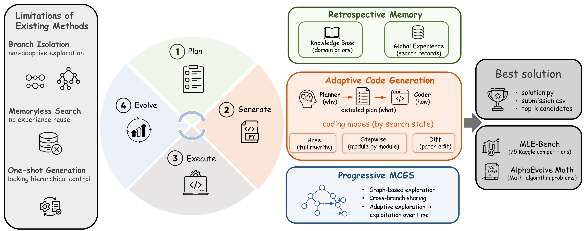
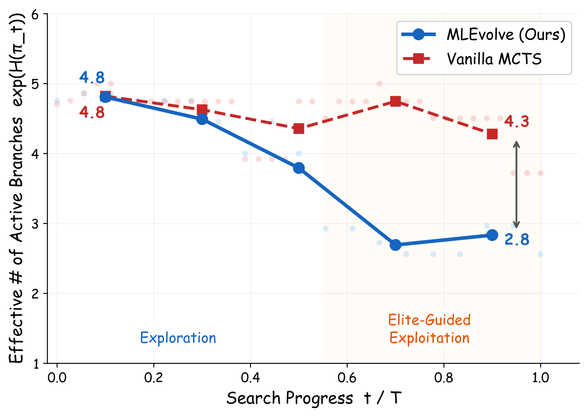
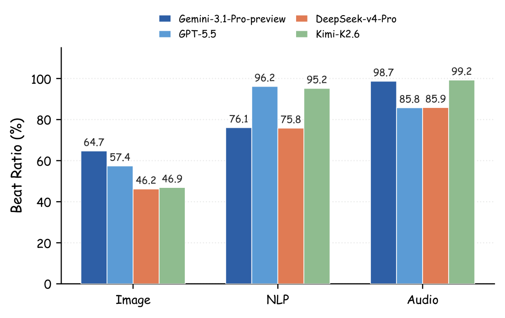
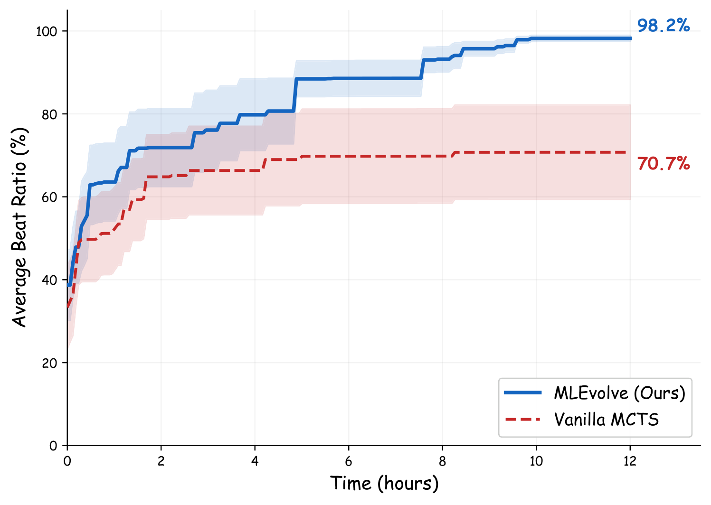
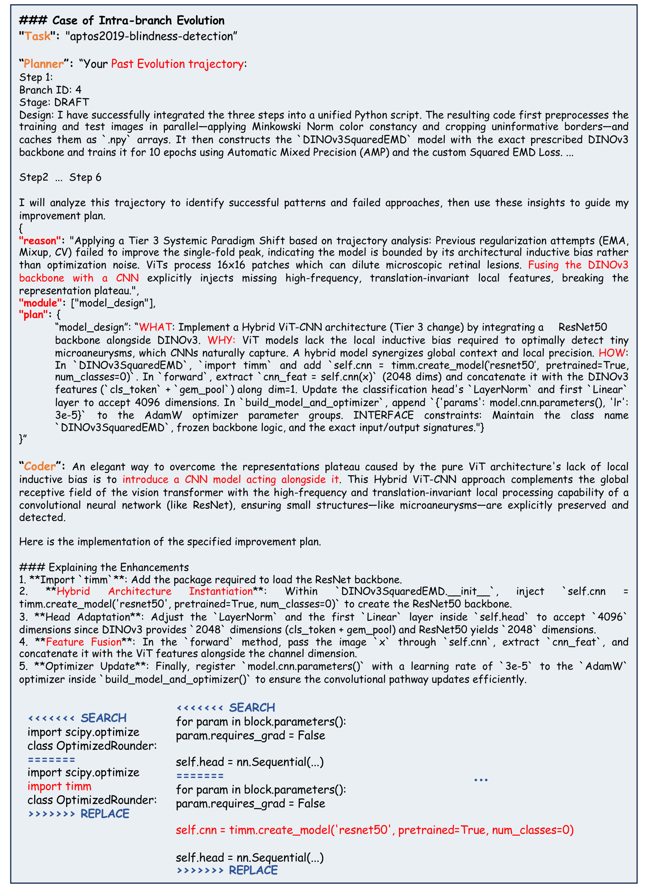
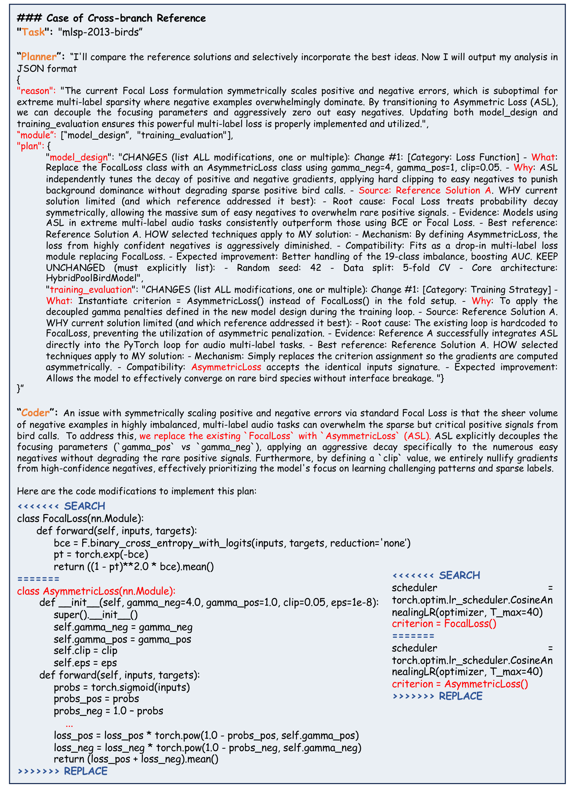
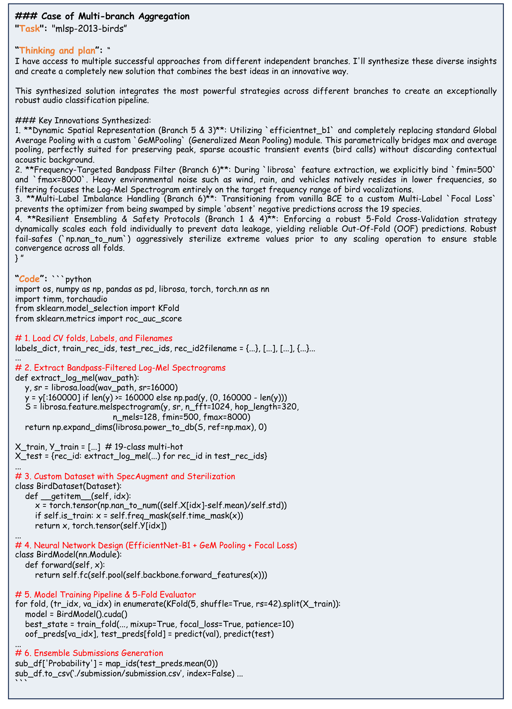

# MLEvolve 论文调研报告

> 一句话摘要：上海AI Lab和华东师大提出自进化框架MLEvolve，通过渐进式图搜索、回顾式记忆和层次化代码生成三大创新，在MLE-Bench上以12小时预算达到65.3%奖牌率，并在数学算法发现任务上超越AlphaEvolve。

---

## 📋 基本信息

| 项目 | 内容 |
|-----|------|
| 论文标题 | MLEvolve: A Self-Evolving Framework for Automated Machine Learning Algorithm Discovery |
| 作者 | Shangheng Du, Xiangchao Yan, Jinxin Shi, Zongsheng Cao, Shiyang Feng, Zichen Liang, Boyuan Sun, Tianshuo Peng, Yifan Zhou, Xin Li, Jie Zhou, Liang He, Bo Zhang, Lei Bai |
| 所属机构 | Shanghai Artificial Intelligence Laboratory, East China Normal University |
| 发表时间 | 2026年6月4日 |
| 论文链接 | https://arxiv.org/abs/2606.06473 |
| 项目主页 | https://internscience.github.io/MLEvolve/ |
| 代码仓库 | https://github.com/InternScience/MLEvolve |
| 研究领域 | cs.AI (主), cs.CL (次) |

---

## 1. 研究背景与动机

### 1.1 问题定义

机器学习工程（Machine Learning Engineering，MLE）是一个长周期的持续迭代过程，涉及数据预处理、特征工程、模型训练、超参调优等端到端全流程。传统的自动化机器学习（AutoML）方法往往只能解决单一环节的离散优化，无法实现覆盖全流程的自主演进。

随着大语言模型（LLM）智能体的发展，出现了许多尝试端到端编写机器学习代码的系统。然而，这些系统在长周期自主任务中面临着自演化能力不足的核心挑战。

### 1.2 研究动机

论文指出，现有的MLE智能体受制于三个关键瓶颈：

**第一，分支探索的信息孤立（Branch Isolation）**。传统的树状或线性搜索空间使得不同的尝试路线相互隔离，各分支在运行中产生的独特灵感和有用代码片段无法实现组间共享。

**第二，无记忆搜索（Memoryless Search）**。智能体在每一步规划时，往往只依赖单一的标量分数反馈，缺乏对历史成败经验的主动总结和精细复用，导致在长周期搜索中重复犯错。

**第三，缺乏层次化的生成控制（Lack of Hierarchical Control）**。绝大多数系统将宏观算法规划和微调代码实现混为一谈，采用一步到位的全文件重写模式，导致微小的策略调整也需要全盘重构，迭代极其不稳定。

### 1.3 研究目标

论文的核心目标是构建一个具备**自演化能力**的MLE智能体框架，能够：
1. 打破分支信息孤立，实现跨分支知识流动
2. 积累并复用历史经验，避免重复犯错
3. 分离规划与执行，实现稳定的迭代优化

---

## 2. 核心贡献

### 2.1 主要贡献

| 编号 | 贡献描述 |
|-----|---------|
| C1 | 提出MLEvolve自演化多智能体框架，统一了渐进式图搜索、回顾式记忆和层次化自适应代码生成三大组件 |
| C2 | 设计Progressive MCGS（蒙特卡洛图搜索），通过引用边打破分支孤立，通过熵启发的渐进式调度实现探索-利用平滑过渡 |
| C3 | 引入Retrospective Memory（回顾式记忆），融合静态领域知识库与动态全局记忆，支持阶段感知的经验检索与复用 |

### 2.2 创新点

1. **方法创新**：将传统MCTS树搜索扩展为图搜索，引入引用边（Reference Edges）支持跨分支信息流动，同时保持主干树的回传机制不变
2. **技术创新**：设计多级停滞检测机制（分支级/全局级），触发不同的图扩展算子（演化/引用/聚合）
3. **架构创新**：规划-编码解耦设计，配合三种自适应编码粒度（全文重写/分模块生成/差异修补）

### 2.3 显著性成果

- **MLE-Bench**：12小时预算（标准时间减半）下，65.3%平均奖牌率、34.7%金牌率、100%有效提交率，超越所有24小时预算的基线方法
- **跨领域泛化**：在15个AlphaEvolve数学优化任务上，11/15任务超越专门设计的AlphaEvolve方法

---

## 3. 方法详解

### 3.1 方法概述

MLEvolve是一个基于LLM的自演化多智能体框架，其核心思想是将MLE任务建模为图搜索问题，通过三个相互配合的组件实现长周期的自主演进：

1. **Progressive MCGS**：将搜索空间组织为图结构，支持跨分支信息流动
2. **Retrospective Memory**：积累并检索历史经验，指导后续决策
3. **Hierarchical Planning**：分离"做什么"与"怎么做"，实现稳定的代码迭代

### 3.2 整体架构



*Figure 1: MLEvolve整体架构图。展示了三大核心组件如何协同工作：Progressive MCGS实现图搜索与渐进式探索，Retrospective Memory提供知识库与动态记忆，Hierarchical Planning分离规划与编码。*

**架构文字描述**：

MLEvolve的整体架构围绕一个中心循环展开：**Plan → Generate → Execute → Evolve**。

- **Progressive MCGS（左侧）**：这是搜索的核心引擎。它将搜索空间组织为有向图 $G=(V, E)$，其中边分为两类：
  - **主边 $E_T$**：记录父子生成关系，用于选择和回传
  - **引用边 $E_{ref}$**：记录跨分支信息流动，不参与回传
  
  搜索过程包含四个阶段：Selection（选择）、Expansion（扩展）、Simulation（仿真）、Backpropagation（回传），与停滞检测机制联动。

- **Retrospective Memory（中间）**：提供两类知识来源：
  - **Knowledge Base**：静态领域知识库，包含任务类型与推荐模型的映射
  - **Global Experience**：动态全局记忆，记录每个节点的计划、代码、指标和分析
  
  检索采用BM25 + FAISS的混合检索，通过RRF（Reciprocal Rank Fusion）融合排序。

- **Hierarchical Planning（右侧）**：分离规划与执行：
  - **Planner**：基于执行反馈、分支轨迹和检索记忆，决定"做什么"
  - **Coder**：根据搜索状态选择编码模式，实现"怎么做"
  
  三种编码模式：Base（全文重写）、Stepwise（分模块生成）、Diff（差异修补）


*Figure 2: MLEvolve框架详细图。展示了Progressive MCGS的四种扩展算子、Retrospective Memory的检索流程、以及多模式规划与代码生成。*

**框架关键设计**：

图中详细展示了四种图扩展算子的触发条件和执行方式：

| 扩展类型 | 触发条件 | 参考集 $R$ | 作用 |
|---------|---------|-----------|------|
| Primary Expansion | 常规迭代 | $R=\emptyset$ | 基础扩展，仅从父节点生成 |
| Intra-branch Evolution | 分支停滞 | $R=R_{hist}(v_t, k)$ | 回顾分支历史，吸取经验 |
| Cross-branch Reference | 分支停滞 | $R=R_{cross}(N)$ | 借鉴其他分支的优秀方案 |
| Multi-branch Aggregation | 全局停滞 | $R=R_{agg}$ | 融合多分支，开辟新路线 |

### 3.3 核心算法/模型

#### 3.3.1 Progressive MCGS算法流程

```
Algorithm 1: Progressive MCGS
Input: Task T, Time Budget B, Max Steps S
Output: Best Solution s*

1. Initialize graph G = (V, E) with root node v_0
2. For t = 1 to S:
   3. Selection: Compute w(t), choose strategy:
      - If rand() < w(t): UCT-based tree traversal
      - Else: Elite-guided exploitation
   4. Get target node v_t for expansion
   5. Stagnation Detection:
      - If branch_stagnation: Set R = R_hist or R_cross
      - If global_stagnation: Set R = R_agg
      - Else: R = empty
   6. Expansion: Generate v_new = g_o(v_t, R)
   7. Simulation: Execute code, get reward R(v)
   8. Backpropagation: Update Q values along E_T
   9. Memory Write: Store experience to Global Memory
10. Return best solution
```

#### 3.3.2 关键公式解读

**UCT选择准则**：

$$UCT(i) = Q_i + c(t) \sqrt{\frac{\ln(N_v + 1)}{N_i + \varepsilon}}$$

其中 $Q_i$ 是子节点 $i$ 的平均奖励，$N_i$ 是访问次数，$c(t)$ 是随时间衰减的探索常数。

**渐进式软切换机制**：

$$P(S_t = UCT) = w(t), \quad P(S_t = Elite) = 1 - w(t)$$

权重 $w(t)$ 从1.0逐渐降至 $w_{min}$，实现从UCT探索到精英开发的平滑过渡。

**精英引导采样**：

$$P(v_i \mid elite\_set) = \frac{1/rank(v_i)}{\sum_{j=1}^{K} 1/rank(v_j)}$$

按排名的倒数加权采样，优先选择表现更好的方案。

**即时奖励设计**：

$$R(v) = \begin{cases} -1 & \text{if execution fails} \\ 1 & \text{if succeeds but no improvement} \\ 2 & \text{if succeeds and improves best} \end{cases}$$

三分设计区分失败、可行但无改进、真正改进三种情况。

### 3.4 关键模块详解

#### 模块A: Progressive MCGS

- **功能**：组织搜索空间，支持跨分支信息流动和渐进式探索-利用切换
- **输入/输出**：输入当前搜索状态，输出待扩展节点和新节点
- **核心设计**：
  - 主边保持父子生成关系，用于回传
  - 引用边实现跨分支信息共享，不参与回传
  - 停滞检测触发不同的扩展算子
- **与论文其他部分的关系**：为Retrospective Memory提供触发时机，为Hierarchical Planning提供搜索上下文

#### 模块B: Retrospective Memory

- **功能**：积累历史经验，支持阶段感知检索
- **输入/输出**：输入查询（计划草案或错误信息），输出相关经验记录
- **核心设计**：
  - Knowledge Base：静态领域先验，冷启动支持
  - Global Memory：动态积累，双路检索（BM25 + FAISS）
  - RRF融合：$\text{score}(d) = \alpha \cdot \frac{1}{k+r_{lex}(d)} + (1-\alpha) \cdot \frac{1}{k+r_{vec}(d)}$
- **与论文其他部分的关系**：为Planner提供经验指导，避免重复犯错

#### 模块C: Hierarchical Planning & Adaptive Code Generation

- **功能**：分离规划与编码，实现稳定的迭代优化
- **输入/输出**：输入执行反馈和检索记忆，输出修改后的代码
- **核心设计**：
  - Planner：模块级规划，决定"做什么"
  - Coder：代码级实现，决定"怎么做"
  - 三种编码模式自适应切换：
    - Base模式：初始草稿，全文生成
    - Stepwise模式：复杂任务，分模块生成
    - Diff模式：已有方案，差异修补
- **与论文其他部分的关系**：执行MCGS决策，生成新节点

### 3.5 关键技术

| 技术点 | 描述 | 作用 | 论文对应位置 |
|-------|-----|-----|------------|
| 引用边 $E_{ref}$ | 跨分支信息流动的边结构 | 打破分支孤立 | Section 3.2.1 |
| 多级停滞检测 | 分支级和全局级停滞判定 | 触发扩展算子 | Section 3.2.2 |
| 渐进式软切换 | $w(t)$ 权重衰减 | 探索-利用平滑过渡 | Section 3.2.2 |
| RRF混合检索 | BM25 + FAISS融合排序 | 高精度经验检索 | Section 3.3.2 |
| Diff编辑模式 | SEARCH/REPLACE差异补丁 | 稳定的局部修改 | Section 3.4.2 |

### 3.6 方法设计的关键洞察

1. **为什么用图而非树**：树结构的分支天然隔离，无法共享信息。图结构通过引用边允许节点"看到"其他分支的优秀方案，实现知识的跨分支流动。

2. **为什么分离规划和编码**：一步到位的全文件重写导致：(1) 迭代不稳定，每次都是"推倒重来"；(2) 无法精细控制修改范围。分离后，Planner聚焦"修改策略"，Coder聚焦"实现细节"，通过Diff模式实现稳定的局部优化。

3. **为什么需要停滞检测**：不同层级的停滞需要不同的应对策略。分支停滞时，借鉴同分支历史或跨分支方案；全局停滞时，需要融合多条路线开启新探索。这模仿了人类团队的协作模式。

### 3.7 与现有方法的核心区别

| 环节 | 现有方法做法 | 本文做法 | 改变原因 |
|-----|------------|---------|---------|
| 搜索空间 | 树结构，分支隔离 | 图结构，引用边 | 实现跨分支知识流动 |
| 探索策略 | 固定UCT常数 | 渐进式软切换 | 早期探索，后期聚焦 |
| 经验复用 | 无记忆或静态知识 | 动态积累+检索 | 避免重复犯错 |
| 代码生成 | 全文件重写 | 规划-编码解耦+三种模式 | 稳定的迭代优化 |

---

## 4. 代码实现分析

### 4.1 代码仓库概述

| 项目 | 内容 |
|-----|------|
| 仓库地址 | https://github.com/InternScience/MLEvolve |
| 主要语言 | Python (62个文件) |
| 代码行数 | ~489,000行 |
| 开源时间 | 2026年2月14日 |
| 依赖管理 | requirements_base.txt, requirements_ml.txt, requirements_domain.txt |

### 4.2 目录结构

```
MLEvolve/
├── agents/                 # 智能体模块
│   ├── draft_agent.py      # 初始草稿生成
│   ├── improve_agent.py    # 方案改进
│   ├── debug_agent.py      # 调试修复
│   ├── evolution_agent.py  # 分支内演化
│   ├── fusion_agent.py     # 跨分支引用
│   ├── aggregation_agent.py # 多分支聚合
│   ├── code_review_agent.py # 代码审查
│   ├── data_leakage_agent.py # 数据泄露检测
│   ├── planner/            # 规划器
│   ├── coder/              # 代码生成器
│   │   ├── base_coder.py   # 全文生成
│   │   ├── stepwise_coder.py # 分模块生成
│   │   └── diff_coder/     # 差异修补
│   └── memory/             # 记忆模块
│       ├── global_memory.py # 全局记忆层
│       ├── retriever.py    # 混合检索器
│       └── embedding_models.py # 嵌入模型
├── engine/                 # 搜索引擎
│   ├── agent_search.py     # 主搜索循环
│   ├── search_node.py      # 搜索节点
│   ├── node_selection.py   # 节点选择（UCT/Top-K）
│   ├── conditions.py       # 停滞检测条件
│   ├── execution.py        # 代码执行
│   ├── evaluation.py       # 结果评估
│   └── coldstart/          # 冷启动知识库
├── llm/                    # LLM接口
├── config/                 # 配置文件
│   └── config.yaml         # 主配置
├── run.py                  # 入口脚本
└── run_single_task.sh      # 单任务启动脚本
```

### 4.3 核心模块分析

#### 4.3.1 SearchNode（搜索节点）

`SearchNode`是搜索图的核心数据结构，定义在`engine/search_node.py`中：

```python
@dataclass
class SearchNode:
    # 代码与计划
    code: str
    plan: str
    
    # 搜索状态
    stage: Literal["root", "improve", "debug", "draft", "fusion_draft", "evolution", "fusion"]
    visits: int
    total_reward: float
    
    # 执行结果
    metric: MetricValue
    is_buggy: bool
    is_valid: bool
    
    # 图结构
    parent: Optional["SearchNode"]
    children: set["SearchNode"]
    branch_id: Optional[int]
```

**关键方法**：

| 方法 | 功能 | 论文对应 |
|-----|------|---------|
| `uct_value()` | 计算UCT值 | 公式(3) |
| `update()` | 更新访问次数和奖励 | 公式(8-9) |
| `get_root_to_current_trajectory()` | 获取从根到当前节点的轨迹 | Intra-branch Evolution |
| `fetch_child_memory()` | 构建子节点记忆 | 经验复用 |

#### 4.3.2 Node Selection（节点选择）

`node_selection.py`实现了Progressive MCGS的选择策略：

```python
def select_with_soft_switch(agent) -> SearchNode:
    """软切换：UCT探索 vs Top-K精英开发"""
    exploration_weight = get_exploration_weight(
        time_elapsed, total_time,
        switch_start=0.5,  # 50%时间开始切换
        switch_end=0.7,    # 70%时间切换完成
        min_weight=0.2,    # 最低20%探索权重
    )
    
    if random.random() < exploration_weight:
        return select(agent, agent.virtual_root)  # UCT探索
    else:
        return select_from_top_k_weighted(...)    # Top-K开发
```

**配置参数**（`config.yaml`）：

| 参数 | 默认值 | 说明 |
|-----|-------|------|
| `explore_switch_start` | 0.5 | 开始切换的时间比例 |
| `explore_switch_end` | 0.7 | 切换完成的时间比例 |
| `min_exploration_weight` | 0.2 | 最低探索权重 |
| `topk_early_k` | 5 | 早中期Top-K数量 |
| `topk_late_k` | 3 | 后期Top-K数量 |

#### 4.3.3 Global Memory（全局记忆）

`agents/memory/global_memory.py`实现了Retrospective Memory：

```python
class GlobalMemoryLayer:
    def __init__(self, memory_dir, embedding_model_path, ...):
        self.embedding_model = EmbeddingModel(model_name=embedding_model_path)
        self.retriever = HybridRetriever(self.embedding_model)  # BM25 + FAISS
        self.records: List[MemRecord] = []
    
    def save_node(self, node, parent_node) -> bool:
        """保存节点经验"""
        label = self._determine_label(node, parent_node)  # 1:成功, -1:失败, 0:无变化
        record = MemRecord(
            record_id=f"node_{node.id}",
            description=node.plan,
            method=code_summary,
            label=label,
        )
        self.records.append(record)
        self._update_index(record)  # 更新FAISS索引
    
    def retrieve_similar_records(self, query_text, top_k=2, alpha=0.5, ...):
        """RRF混合检索"""
        return self.retriever.search(query_text, top_k, alpha)
```

**检索策略**：

| 阶段 | 检索方式 | 查询内容 |
|-----|---------|---------|
| Planning阶段 | 成功经验 + 失败经验 | 初始计划草案 |
| Debug阶段 | 错误修复经验 | 错误信息 |

#### 4.3.4 Evolution Agent（分支内演化）

`agents/evolution_agent.py`实现了Intra-branch Evolution：

```python
def run(agent, parent_node: SearchNode) -> SearchNode:
    # 1. 获取分支历史轨迹
    branch_trajectory = _get_branch_trajectory_for_evolution(parent_node)
    
    # 2. 检测是否进入平台期
    success_patience, total_patience, branch_best_score = get_patience_counter(agent, parent_node)
    use_magnitude_prompt = (success_patience >= 2) or (total_patience >= 5)
    
    if use_magnitude_prompt:
        # 3. 触发层级化改进策略
        prompt["Instructions"] |= {
            "🔥 Evolution Strategy: Magnitude-Based Reasoning": [
                "Tier 1: Optimization - 仅调整训练细节",
                "Tier 2: Representation & Components - 替换模块",
                "Tier 3: Systemic Paradigm Shift - 架构变革",
            ]
        }
```

**停滞检测条件**：

| 条件 | 阈值 | 说明 |
|-----|------|------|
| `success_patience >= 2` | 连续2次无改进 | 触发层级化策略 |
| `total_patience >= 5` | 总计5次失败 | 触发层级化策略 |
| `branch_stagnation_threshold` | 3 | 分支停滞检测 |
| `topk_stagnation_threshold` | 6 | 全局停滞检测 |

### 4.4 配置参数详解

#### 4.4.1 搜索参数

```yaml
agent:
  steps: 500                    # 最大搜索步数
  time_limit: 43200             # 12小时时间限制
  initial_drafts: 3             # 初始草稿数
  
  search:
    parallel_search_num: 3      # 并行分支数
    num_drafts: 5               # 每节点最大草稿数
    num_improves: 3             # 每节点最大改进数
    
    # 停滞检测
    branch_stagnation_threshold: 3
    topk_stagnation_threshold: 6
    
    # 探索-利用切换
    explore_switch_start: 0.5
    explore_switch_end: 0.7
    min_exploration_weight: 0.2
```

#### 4.4.2 记忆参数

```yaml
agent:
  use_global_memory: True
  memory_similarity_threshold: 0.7
  memory_embedding_device: cuda
  memory_embedding_model_path: "BAAI/bge-base-en-v1.5"  # BGE嵌入模型
```

#### 4.4.3 触发器开关

```yaml
agent:
  use_evolution: True           # 分支内演化
  use_fusion: True              # 跨分支引用
  use_aggregation: True         # 多分支聚合
  use_diff_mode: True           # Diff编辑模式
  use_stepwise_generation: True # 分模块生成
```

### 4.5 论文-代码对应关系

| 论文概念 | 代码实现 | 文件位置 |
|---------|---------|---------|
| Progressive MCGS | `select_with_soft_switch()` | `engine/node_selection.py` |
| UCT Selection | `select()`, `uct_value()` | `engine/node_selection.py`, `engine/search_node.py` |
| Exploration Decay | `_piecewise_decay()` | `engine/node_selection.py` |
| Stagnation Detection | `should_trigger_branch_fusion()` | `engine/conditions.py` |
| Intra-branch Evolution | `evolution_agent.run()` | `agents/evolution_agent.py` |
| Cross-branch Reference | `fusion_agent.run()` | `agents/fusion_agent.py` |
| Multi-branch Aggregation | `aggregation_agent.run()` | `agents/aggregation_agent.py` |
| Retrospective Memory | `GlobalMemoryLayer` | `agents/memory/global_memory.py` |
| Hybrid Retrieval | `HybridRetriever` | `agents/memory/retriever.py` |
| Knowledge Base | `coldstart/knowledge.py` | `engine/coldstart/` |
| Planner-Coder Decoupling | `planner/`, `coder/` | `agents/planner/`, `agents/coder/` |
| Diff Mode | `diff_coder/` | `agents/coder/diff_coder/` |

### 4.6 代码质量评估

| 维度 | 评分 | 说明 |
|-----|------|------|
| **模块化** | ⭐⭐⭐⭐⭐ | 清晰的模块划分，智能体、引擎、记忆分离 |
| **可配置性** | ⭐⭐⭐⭐⭐ | 完善的YAML配置，支持消融实验开关 |
| **可扩展性** | ⭐⭐⭐⭐ | 支持多种LLM API，易于添加新智能体 |
| **文档** | ⭐⭐⭐⭐ | README详细，代码注释充足 |
| **测试** | ⭐⭐⭐ | 缺少单元测试，主要依赖集成测试 |

### 4.7 复现指南

#### 环境准备

```bash
# 1. 安装依赖
pip install --no-deps -r requirements_base.txt
pip install --no-deps -r requirements_ml.txt
pip install --no-deps -r requirements_domain.txt

# 2. 配置API
# 编辑 config/config.yaml
```

#### 运行实验

```bash
# 单任务运行
bash run_single_task.sh <EXP_ID> <DATASET_DIR> [SERVER_ID]

# 示例
bash run_single_task.sh denoising-dirty-documents /mle-bench/data 1
```

#### 输出结果

结果保存在 `./runs/<timestamp>_<exp_id>/`：
- 搜索树日志
- 最佳方案代码
- Top-K候选提交

---

## 5. 实验分析

### 4.1 实验设置

#### 数据集

| 数据集 | 规模 | 任务 | 来源 |
|-------|-----|-----|-----|
| MLE-Bench | 75个Kaggle任务 | 端到端机器学习工程 | OpenAI |
| MLE-Bench Lite | 22个任务 | 消融实验子集 | OpenAI |
| AlphaEvolve Math | 15个数学优化任务 | 跨领域泛化测试 | DeepMind |

MLE-Bench任务按复杂度分为：Low（22个，<2小时）、Medium（38个，2-10小时）、High（15个，>10小时），覆盖NLP、CV、音频、表格等多种数据类型。

#### 评估指标

| 指标 | 定义 | 计算方式 |
|-----|-----|---------|
| Medal Rate (%) | 获得奖牌的任务比例 | 金/银/铜牌均计入 |
| Gold Medal Rate (%) | 获得金牌的任务比例 | 仅金牌 |
| Valid Submission Rate (%) | 有效提交比例 | 通过格式和正确性检查 |
| Above Median Rate (%) | 超越中位数的任务比例 | 击败半数人类竞争者 |
| Beat Ratio (%) | 平均击败人类比例 | 所有任务的平均排名百分位 |

#### 实现细节

- **硬件环境**：21 vCPUs, 234 GB RAM, 1x NVIDIA H200 GPU
- **LLM骨干**：Gemini-3.1-Pro-preview（主实验）
- **训练时间**：每任务12小时（标准时间减半）
- **最大步数**：500步扩展
- **温度**：1.0

### 4.2 主实验结果

**MLE-Bench完整集结果（Table 1）**：

| Agent | LLM | 时间 | Medal Rate | Gold Rate | Valid Rate |
|-------|-----|------|------------|-----------|------------|
| AIBuildAI | Claude-Opus-4.6 | 24h | 63.1% | 25.8% | 100% |
| MARS+ | Gemini-3-Pro-preview | 24h | 62.7% | 33.8% | 100% |
| ML-Master 2.0 | DeepSeek-V3.2-Speciale | 24h | 56.4% | 19.6% | 95.6% |
| **MLEvolve** | **Gemini-3.1-Pro-preview** | **12h** | **65.3%** | **34.7%** | **100%** |

**关键发现**：
- MLEvolve以**减半的预算**超越了所有24小时预算的基线方法
- 在Medium和High难度任务上分别达到64.0%和46.7%的奖牌率，均为最高
- 100%有效提交率，意味着所有任务都产出了可评估的方案

**AlphaEvolve数学优化任务结果（Table 2）**：

| 任务类型 | AlphaEvolve | MLEvolve |
|---------|-------------|----------|
| 几何堆叠（5任务） | 5项最佳 | 5项最佳 |
| 加性组合（3任务） | 2项最佳 | 1项最佳 |
| 自相关不等式（5任务） | 2项最佳 | 4项最佳 |
| 比例优化（2任务） | 1项最佳 | 1项最佳 |
| **总计** | **11/15最佳** | **11/15最佳** |

MLEvolve在15个任务中的11个上匹配或超越了专门为数学算法发现设计的AlphaEvolve，展示了跨领域的泛化能力。

### 4.3 消融实验

**组件级消融（Table 3, MLE-Bench Lite, 22任务）**：

| Configuration | Medal (%) | Gold (%) | Beat Ratio (%) |
|--------------|-----------|----------|----------------|
| MLEvolve | **81.82** | **54.55** | **88.39** |
| w/o Progressive MCGS | 68.18 | 40.91 | 79.91 |
| w/o Retrospective Memory | 68.18 | 50.00 | 81.90 |
| w/o Adaptive Code Generation | 72.73 | 40.91 | 84.14 |

**发现**：
- 移除Progressive MCGS导致最大降幅（13.64% Medal Rate），表明跨分支信息流动至关重要
- 移除Retrospective Memory同样导致13.64%的Medal Rate下降，验证了经验复用的重要性
- 移除Adaptive Code Generation的影响相对较小，但仍然显著

**详细组件分析（Table 5, 9任务）**：

| Configuration | Medal (%) | Beat Ratio (%) |
|--------------|-----------|----------------|
| MLEvolve | 66.67 | 82.43 |
| w/o Intra-branch Evolution | **33.33** | 74.95 |
| w/o Cross-branch Reference | 55.56 | 75.93 |
| w/o Elite-Guided Exploitation | 55.56 | 71.39 |
| w/o Knowledge Base | 44.44 | 76.07 |
| w/o Global Memory | 44.44 | 73.58 |

**发现**：
- Intra-branch Evolution是最关键的组件（移除后Medal Rate腰斩）
- Global Memory比Knowledge Base影响更大，说明动态积累的经验更重要

### 4.4 分析与讨论

#### 搜索熵动力学分析



*Figure 3: 有效活跃分支数随搜索进度的变化。MLEvolve从4.8平滑衰减至2.8，而Vanilla MCTS维持在4.3左右。*

论文通过测量有效活跃分支数 $\exp(H(\pi_t))$ 来量化搜索的聚焦程度。MLEvolve的活跃分支数从早期的4.8平滑衰减至后期的2.8，验证了渐进式软切换机制的有效性。相比之下，传统MCTS的活跃分支数始终维持在4.3左右，说明它在后期仍在分散资源。

#### 不同LLM骨干的性能



*Figure 4: 四种LLM骨干在Image、NLP、Audio任务上的表现。不同模型各有优势领域。*

实验测试了Gemini-3.1-Pro-preview、GPT-5.5、DeepSeek-v4-Pro和Kimi-K2.6四种骨干。结果显示：
- GPT-5.5在NLP任务上达到最高96.2%的Beat Ratio
- Kimi-K2.6在Audio任务上领先（99.2%）
- 所有骨干都在MLEvolve框架下取得了竞争性表现

这表明MLEvolve不依赖于特定LLM，是一个鲁棒的通用框架。

#### 性能随时间演化



*Figure 5: Beat Ratio随搜索时间的变化。MLEvolve持续改进至98.2%，而Vanilla MCTS在~70%处停滞。*

MLEvolve在搜索过程中持续改进，最终达到98.2%的Beat Ratio。而Vanilla MCTS在早期就达到~70%的平台期，难以进一步优化。这验证了自演化设计在长周期搜索中的有效性。

### 4.5 实验结果总体分析

从实验结果可以归纳出以下核心结论：

1. **组件贡献验证**：消融实验明确验证了三大组件的必要性，其中Progressive MCGS和Retrospective Memory贡献最大。

2. **机制分析**：详细组件分析揭示了Intra-branch Evolution是最关键的单一机制，Global Memory比静态知识库更重要。

3. **跨领域泛化**：在AlphaEvolve数学任务上的成功表明，MLEvolve的自演化方法论具有普适性，不局限于MLE领域。

4. **框架鲁棒性**：多种LLM骨干的竞争性表现证明了框架的通用性，不依赖特定模型。

5. **时间效率**：12小时预算超越24小时基线，说明渐进式搜索策略显著提升了资源利用效率。

---

## 6. 相关工作

### 5.1 相关工作列表

| 论文/方法 | 年份 | 核心思想 | 与本文关系 |
|----------|-----|---------|-----------|
| AIDE | 2025 | 贪婪搜索MLE代码 | 对比方法，树搜索基线 |
| ML-Master | 2025 | MCTS + 推理 | 对比方法，引入MCTS |
| MARS | 2026 | 反思搜索 | 对比方法，对比反思机制 |
| AIBuildAI | 2026 | 层次多智能体 | 对比方法，层次协调 |
| AutoMind | 2025 | 领域知识库 | 相关工作，静态知识 |
| ROME | 2026 | 动量记忆 | 相关工作，经验复用 |
| AlphaEvolve | 2025 | 数学算法发现 | 跨领域对比方法 |

### 5.2 本文与相关工作的区别

**与AIDE/ML-Master等搜索方法的区别**：
- 这些方法使用树结构，分支天然隔离
- MLEvolve引入图结构和引用边，支持跨分支信息流动
- 渐进式软切换vs固定探索策略

**与MARS等反思方法的区别**：
- MARS需要额外LLM调用进行反思
- MLEvolve的记忆检索是自动的，无需额外推理
- MLEvolve同时支持成功和失败经验的检索

**与AutoMind等知识库方法的区别**：
- AutoMind只提供静态领域知识
- MLEvolve结合静态知识与动态经验积累
- RRF混合检索提供更精准的检索结果

---

## 7. 局限性分析

### 6.1 论文声明的局限性

论文在Conclusion中提到未来将扩展到更广泛的AI for Science场景，暗示当前框架主要针对MLE和数学优化领域。

### 6.2 发现的潜在问题

| 问题类型 | 描述 | 影响 |
|---------|-----|------|
| 方法层面 | 停滞阈值（$\tau_{branch}$=3, $\tau_{global}$=6）为固定值，可能需要针对不同任务类型调参 | 通用性受限 |
| 实验层面 | 主要在Gemini-3.1-Pro-preview上测试，其他模型的详细表现只在少量任务上报告 | 模型普适性待验证 |
| 应用层面 | 12小时预算对某些任务可能仍不足，高难度任务仅46.7%奖牌率 | 实际部署成本高 |

### 6.3 未来工作方向

1. 扩展到更广泛的AI for Science场景
2. 自适应停滞阈值学习
3. 更高效的搜索策略（如元学习引导）
4. 多任务迁移学习

---

## 8. 个人评价

### 7.1 优点

1. **系统性强**：三大组件相互配合，形成了完整的自演化闭环
2. **理论扎实**：图搜索、熵启发调度、RRF检索等都有明确的理论基础
3. **实验充分**：主实验、消融实验、跨领域实验、多模型实验覆盖全面
4. **效果显著**：减半预算超越所有基线，具有较强的实用价值
5. **开源完整**：代码、配置、文档齐全，便于复现和扩展

### 7.2 不足

1. **计算成本**：虽然时间减半，但12小时预算仍然较高，多分支并行需要大量资源
2. **超参依赖**：停滞阈值、探索常数、检索阈值等多个超参数需要调优
3. **可解释性**：图搜索的决策过程较复杂，难以直观理解为何选择某条路径
4. **领域局限**：主要在MLE和数学优化上验证，其他领域（如机器人、科学实验）待探索

### 7.3 适用场景

- Kaggle竞赛自动化参与
- ML管道自动设计与优化
- 算法原型快速开发
- 科学计算优化问题

### 7.4 不适用场景

- 实时性要求高的场景（搜索周期长）
- 计算资源受限的环境
- 需要完全确定性输出的场景
- 代码安全性要求极高的场景（LLM生成的代码可能存在风险）

---

## 9. 启发与思考

### 8.1 技术启发

1. **图vs树**：将树搜索扩展为图搜索是一个普适的思路，可以应用到其他需要跨分支信息共享的场景

2. **渐进式策略**：熵启发的渐进式探索-利用切换可以推广到其他优化问题

3. **分离规划与执行**：Planner-Coder解耦的思想可以应用到其他代码生成场景

4. **混合检索**：BM25 + FAISS + RRF的组合提供了高精度的检索效果

### 8.2 可借鉴之处

1. **停滞检测机制**：多级停滞检测+差异化响应是一个很好的设计模式

2. **记忆设计**：静态知识+动态经验的组合可以应用到其他长周期智能体

3. **编码模式选择**：根据搜索状态自适应选择编码粒度的思路值得借鉴

4. **实验设计**：详细的组件分析（Table 5）清晰地揭示了各机制的重要性

### 8.3 潜在改进方向

1. **自适应阈值学习**：用元学习自动学习最优的停滞阈值，减少超参数依赖

2. **多任务迁移**：在不同MLE任务间迁移搜索策略和经验

3. **人机协作**：引入人类专家反馈，指导搜索方向

4. **安全约束**：增加代码安全性检查，避免生成危险代码

5. **增量学习**：将动态记忆持久化，支持跨任务知识积累

### 8.4 后续行动

- [ ] 阅读MARS、ROME等相关工作的详细对比
- [ ] 尝试在自定义MLE任务上复现实验
- [ ] 探索将Progressive MCGS应用到其他优化问题
- [ ] 分析代码实现，理解细节设计

---

## 参考文献

```bibtex
@article{du2026mlevolve,
  title={MLEvolve: A Self-Evolving Framework for Automated Machine Learning Algorithm Discovery},
  author={Du, Shangheng and Yan, Xiangchao and Shi, Jinxin and Cao, Zongsheng and Feng, Shiyang and Liang, Zichen and Sun, Boyuan and Peng, Tianshuo and Zhou, Yifan and Li, Xin and Zhou, Jie and He, Liang and Zhang, Bo and Bai, Lei},
  journal={arXiv preprint arXiv:2606.06473},
  year={2026}
}

@article{chen2026mars,
  title={MARS: Modular Agent with Reflective Search for Automated AI Research},
  author={Chen, Jiefeng and others},
  journal={arXiv preprint arXiv:2602.02660},
  year={2026}
}

@article{novikov2025alphaevolve,
  title={AlphaEvolve: A Coding Agent for Scientific and Algorithmic Discovery},
  author={Novikov, Alexander and others},
  journal={arXiv preprint arXiv:2506.13131},
  year={2025}
}

@inproceedings{chan2025mlebench,
  title={MLE-bench: Evaluating Machine Learning Agents on Machine Learning Engineering},
  author={Chan, Jun Shern and others},
  booktitle={ICLR},
  year={2025}
}
```

---

## 附录

### A. 关键图表

| Figure | 描述 | 报告内位置 |
|--------|------|-----------|
| Figure 1 | MLEvolve整体架构图 | Section 3.2 |
| Figure 2 | 框架详细图，展示四种扩展算子 | Section 3.2 |
| Figure 3 | 搜索熵动力学分析 | Section 4.4 |
| Figure 4 | 不同LLM骨干性能对比 | Section 4.4 |
| Figure 5 | 性能随时间演化 | Section 4.4 |
| Figure 6 | 分支内演化案例（Aptos眼底检测） | Appendix A |
| Figure 7 | 跨分支引用案例（MLSP鸟类识别） | Appendix A |
| Figure 8 | 多分支聚合案例（MLSP鸟类识别） | Appendix A |

**Case Study图片（来自论文Appendix G）**：



*Figure 6: 分支内演化案例。在Aptos眼底疾病检测任务中，连续6次微调失败后，Evolution Agent识别瓶颈为架构问题，建议融合DINOv3与ResNet50。*



*Figure 7: 跨分支引用案例。在MLSP鸟类识别任务中，某分支因Focal Loss停滞，Fusion Agent从其他分支借鉴Asymmetric Loss实现突破。*



*Figure 8: 多分支聚合案例。全局停滞时，Aggregation Agent融合多条分支的成功组件（GeM Pooling、带通滤波、Focal Loss、5-Fold CV），创建全新起点。*

### B. 流程图索引

| 图表 | 描述 | 报告内位置 |
|------|------|-----------|
| Progressive MCGS算法流程 | 搜索循环伪代码 | Section 3.3.1 |

### C. 补充材料

**GitHub仓库信息**（截至2026-06-15）：
- Stars: 344
- Forks: 48
- 主要语言: Python (489,411行)
- 依赖安装: `pip install -r requirements_base.txt && pip install -r requirements_ml.txt`

**快速开始**：
```bash
bash run_single_task.sh <EXP_ID> <DATASET_DIR> [SERVER_ID]
```

### D. 调研信息

- 调研人: Claude
- 调研时间: 2026-06-15
- 论文版本: arXiv:2606.06473 (2026-06-04)
- 参考来源: 
  - arXiv论文原文
  - 微信公众号"Tensorlong看天下"解读文章

---

*报告版本: v1.0*
