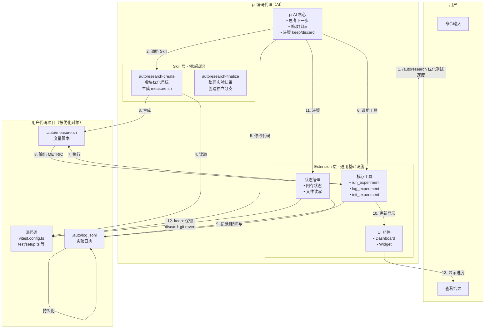
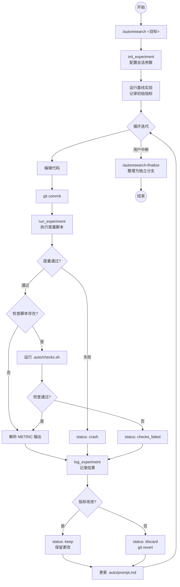
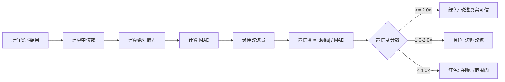
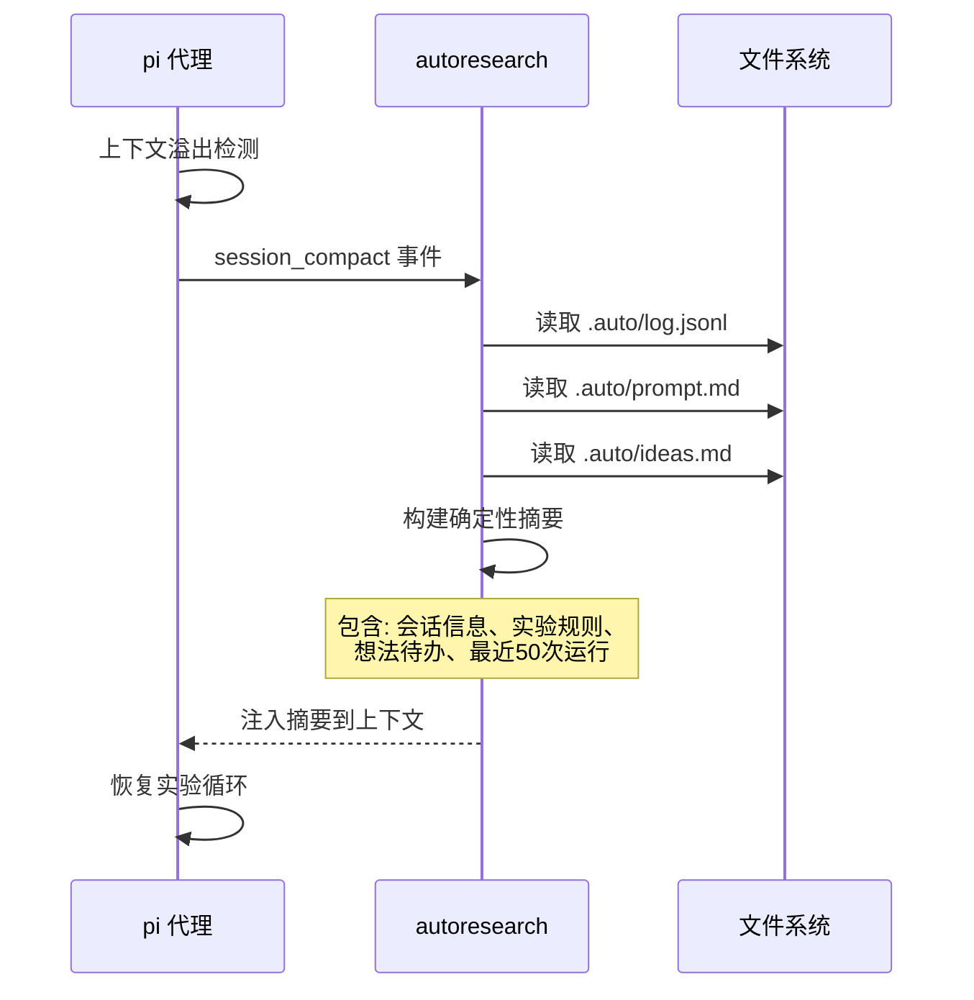
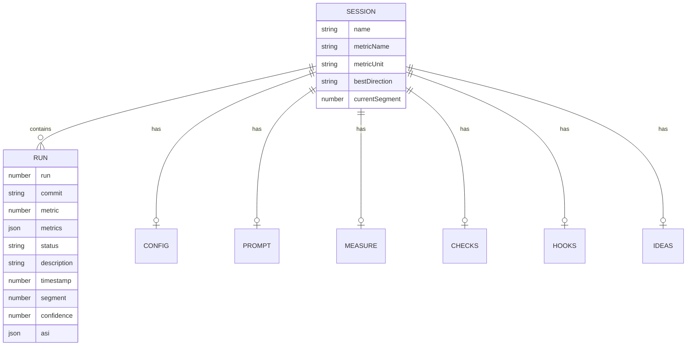

# pi-autoresearch 开源项目技术调研报告

> 调研时间: 2026-06-09
> 调研版本: v1.6.0
> GitHub: https://github.com/davebcn87/pi-autoresearch

---

## 零、核心概念解释（必读）

> 本章节解答最核心的问题：pi-autoresearch 到底在优化什么？Extension 和 Skill 分别扮演什么角色？

### 0.1 pi 是什么？

**pi** 是一个运行在终端的 AI 编码代理（类似于 Cursor、Copilot，但运行在命令行）。它可以：
- 读取和编辑代码文件
- 执行 Shell 命令
- 调用 LLM 进行推理
- 通过工具（Tool）与外部系统交互

### 0.2 pi-autoresearch 优化的是什么？

**关键澄清**：pi-autoresearch **不是优化 extension 本身**，而是让 pi 能够**自主优化用户的代码项目**。

```
┌─────────────────────────────────────────────────────────────────────┐
│                        用户视角                                      │
├─────────────────────────────────────────────────────────────────────┤
│                                                                      │
│   用户的目标：优化我的项目（测试速度、打包体积、训练损失等）           │
│                                                                      │
│   ┌──────────────────┐         ┌──────────────────────────────────┐ │
│   │  用户的代码项目   │ ◄─────  │    pi + pi-autoresearch          │ │
│   │                  │  优化    │                                  │ │
│   │  - src/          │         │  AI 代理自主循环：                │ │
│   │  - tests/        │         │  修改代码 → 测量 → 保留/回退      │ │
│   │  - package.json  │         │                                  │ │
│   └──────────────────┘         └──────────────────────────────────┘ │
│                                                                      │
│   Extension 和 Skill 是"工具"，不是被优化的对象                       │
│                                                                      │
└─────────────────────────────────────────────────────────────────────┘
```

### 0.3 Extension 和 Skill 的角色

| 组件 | 角色 | 类比 | 具体作用 |
|------|------|------|---------|
| **Extension** | 基础设施 | 实验室的"测量仪器" | 提供 `run_experiment`、`log_experiment` 工具，负责执行命令、记录结果、显示 UI |
| **Skill** | 领域知识 | 实验室的"研究员" | 告诉 pi：优化什么指标、怎么测量、改哪些文件 |
| **用户的代码** | 被优化的对象 | 实验的"样品" | pi 修改这些代码，尝试改进度量指标 |

**类比理解**：
- Extension = 天平、计时器、记录本（通用工具，不关心称什么）
- Skill = 化学实验指导书（告诉你：要测量 pH 值，用这个试剂，记录这个数据）
- 用户的代码 = 待测试的化学反应（被测量的对象）

### 0.4 完整工作流程示例

假设用户想要**优化测试速度**：

```
第 0 步：用户发起请求
─────────────────────────────────────────────
用户在 pi 中输入：
> /autoresearch 优化单元测试运行时间

第 1 步：Skill 收集信息
─────────────────────────────────────────────
autoresearch-create Skill 询问：
- 目标：优化测试速度
- 度量命令：pnpm test
- 优化方向：时间越短越好（lower is better）
- 可修改文件：vitest.config.ts, test/setup.ts

Skill 生成：
- .auto/prompt.md  ← 会话目标文档
- .auto/measure.sh ← 度量脚本

第 2 步：建立基线
─────────────────────────────────────────────
pi 调用 Extension 的工具：
> run_experiment(command=".auto/measure.sh")

输出：
> METRIC total_ms=42000
> METRIC test_count=150

pi 调用：
> log_experiment(metric=42000, status="keep", description="基线")

第 3 步：开始自主循环
─────────────────────────────────────────────
循环迭代 #1：
  pi 思考："也许并行运行测试可以加速"
  pi 编辑 vitest.config.ts，添加 pool: 'forks'
  pi 提交代码
  pi 调用 run_experiment()
  结果：METRIC total_ms=38000 ✓ 改进 9.5%
  pi 调用 log_experiment(status="keep")
  → 保留更改

循环迭代 #2：
  pi 思考："也许减少 worker 数量更好"
  pi 编辑 vitest.config.ts，修改 workers: 4
  pi 提交代码
  pi 调用 run_experiment()
  结果：METRIC total_ms=45000 ✗ 变慢 7.1%
  pi 调用 log_experiment(status="discard")
  → git revert，回退更改

循环迭代 #3：
  pi 思考："试试调整超时时间"
  ...

第 N 步：用户中断，整理结果
─────────────────────────────────────────────
用户按 Escape 中断
用户调用：/autoresearch-finalize
pi 读取 .auto/log.jsonl，将保留的改进分组
创建独立分支供代码审查
```

### 0.5 关键要点总结

1. **优化的是用户的代码**，不是 extension
2. **Extension 提供"循环能力"**：执行命令、记录结果、显示 UI
3. **Skill 提供"领域知识"**：告诉 pi 测什么、怎么测、改什么
4. **pi 是执行者**：自主思考、修改代码、做出 keep/discard 决策

---

## 一、概述与背景

### 1. 项目概述

#### 1.1 项目定位与核心价值

- **项目名称**: pi-autoresearch
- **GitHub 地址**: https://github.com/davebcn87/pi-autoresearch
- **一句话描述**: 为 pi AI 编码代理提供自主实验循环优化的扩展框架
- **核心价值主张**: "Try an idea, measure it, keep what works, discard what doesn't, repeat forever." — 让 AI 代理能够自主运行实验循环：尝试想法、测量指标、保留有效改进、回退无效更改，持续迭代优化

#### 1.2 项目背景与起源

- **项目起源**: 灵感来自 Andrej Karpathy 的 [autoresearch](https://github.com/karpathy/autoresearch) 概念
- **所属领域**: AI 编码代理工具链、自动化实验优化
- **开源时间**: 2026年3月
- **许可证**: MIT License

#### 1.3 解决的核心问题

**目标痛点**:
- AI 编码代理缺乏自主优化能力，每次改进需要人工介入验证
- 优化目标多样化（测试速度、构建大小、训练损失等），缺乏通用框架
- 实验结果需要持久化记录，以便跨会话、跨上下文重置后继续

**解决方案核心思路**:
- 提供领域无关的实验循环基础设施（Extension）
- 通过 Skill 注入领域知识（度量脚本、优化目标）
- 使用持久化文件（`.auto/` 目录）保存会话状态，支持断点恢复

#### 1.4 目标用户与使用场景

**目标用户群体**:
- 使用 pi 编码代理的开发者
- 需要自动化性能优化的团队
- 进行机器学习实验调优的研究人员

**典型使用场景**:
| 场景 | 度量指标 | 命令示例 |
|------|---------|---------|
| 测试速度优化 | 秒数 ↓ | `pnpm test` |
| 打包体积优化 | KB ↓ | `pnpm build && du -sb dist` |
| ML 训练优化 | val_bpb ↓ | `uv run train.py` |
| 构建速度优化 | 秒数 ↓ | `pnpm build` |
| Lighthouse 评分 | perf score ↑ | `lighthouse http://localhost:3000` |

#### 1.5 项目成熟度评估

| 指标 | 数值 |
|------|------|
| Star 数 | 6,967 |
| Fork 数 | 411 |
| Contributors | 1 (主要开发者) |
| 当前版本 | v1.6.0 |
| 最后更新 | 2026-06-09 |
| 开源时间 | 2026-03-11 |
| 版本节奏 | 活跃开发中，平均每周1-2个版本 |

### 2. 设计动机与目标

#### 2.1 设计动机

- **为什么开发**: 现有 AI 编码代理只能单次执行任务，缺乏持续的自主优化能力
- **市场空白**: 需要"循环"能力 — 让代理像人类研究员一样持续假设、实验、迭代

#### 2.2 与竞品的差异化定位

| 竞品 | 差异化优势 |
|------|-----------|
| karpathy/autoresearch | 提供完整的工具链和 UI，集成到 pi 代理生态 |
| 传统 CI/CD | 专注于自动化测试，而非自主实验优化 |
| Hyperparameter tuning 工具 | 领域无关设计，适用于任何可测量的优化目标 |

#### 2.3 核心设计目标与技术约束

**设计目标**（优先级排序）:
1. **持久化优先** — 所有状态写入磁盘，支持跨会话恢复
2. **领域无关** — Extension 提供通用基础设施，Skill 注入领域知识
3. **自主运行** — 循环永不停止，除非被用户中断
4. **置信度评估** — 自动计算改进的统计显著性

**技术约束**:
- 必须与 pi 编码代理生态系统兼容
- 不能依赖外部数据库，所有状态使用文件存储
- 工具调用必须在 pi 的权限模型内运行

---

## 二、核心架构

### 3. 整体架构

#### 3.1 架构概览

pi-autoresearch 采用 **Extension + Skill 双层架构**：



**关键数据流说明**：

| 步骤 | 动作 | 执行者 | 说明 |
|------|------|--------|------|
| 1 | 用户发起请求 | 用户 | `/autoresearch 优化测试速度` |
| 2 | 调用 Skill | pi AI | 选择 `autoresearch-create` 技能 |
| 3 | 生成度量脚本 | Skill | 创建 `.auto/measure.sh` |
| 4 | 读取代码 | Skill | 理解项目结构 |
| 5 | 修改代码 | pi AI | 自主决定修改哪些文件 |
| 6 | 调用工具 | pi AI | `run_experiment` |
| 7 | 执行度量 | Extension | 运行 `.auto/measure.sh` |
| 8 | 输出指标 | 脚本 | `METRIC total_ms=38000` |
| 9 | 记录结果 | Extension | 写入 `.auto/log.jsonl` |
| 10 | 更新显示 | Extension | Dashboard 刷新 |
| 11 | 决策 | pi AI | 判断 keep 还是 discard |
| 12 | 执行决策 | pi AI | 保留更改或 git revert |

**架构设计原则**:
1. **关注点分离** — Extension 处理通用循环逻辑，Skill 处理领域特定配置
2. **状态外置** — 所有运行时状态写入 `.auto/` 目录，而非内存
3. **工具门控** — 工具仅在 autoresearch 模式激活时对代理可见
4. **AI 主导决策** — Extension 只提供工具，keep/discard 决策由 pi AI 做出

#### 3.2 项目类型分层视角

**职责分工表**（关键！）：

| 职责 | 执行者 | 具体动作 |
|------|--------|---------|
| **思考下一步** | pi AI | 分析历史实验，生成新假设 |
| **修改代码** | pi AI | 编辑 vitest.config.ts、test/setup.ts 等 |
| **决策 keep/discard** | pi AI | 比较指标，决定保留或回退 |
| **收集优化目标** | Skill | 询问用户：优化什么、怎么测、改什么 |
| **生成度量脚本** | Skill | 创建 `.auto/measure.sh` |
| **生成会话文档** | Skill | 创建 `.auto/prompt.md` |
| **整理实验结果** | Skill | 分析日志，分组创建分支 |
| **执行度量脚本** | Extension | `run_experiment` 工具 |
| **记录实验结果** | Extension | `log_experiment` 工具，写入 JSONL |
| **显示 UI** | Extension | Dashboard、Widget |
| **状态持久化** | Extension | 读写 `.auto/` 目录 |

**关键洞察**：
- **pi AI 是大脑**：负责思考、决策、修改代码
- **Extension 是手脚**：负责执行命令、记录数据、显示界面
- **Skill 是教练**：负责设定目标、提供指导、整理结果

**框架层（Extension）**:
- 核心循环机制：`run_experiment` → `log_experiment` → keep/discard
- 扩展点定义：Skill 文件、Hook 脚本、Check 脚本
- 用户配置入口：`.auto/config.json`、命令行参数

**实现层（Skill）**:
- 领域知识编码：度量脚本生成、优化目标定义
- 会话文件生成：`.auto/prompt.md`、`.auto/measure.sh`
- 结果处理：分支整理、实验分组

**两层交互方式**:
- Extension 注册工具到 pi，工具在 autoresearch 模式下可见
- **pi AI 调用 Skill** 来获取领域指导
- **pi AI 调用 Extension 工具** 来执行度量和记录
- Hook 脚本在迭代边界处触发，输出作为 steer 消息传递给代理

#### 3.3 项目目录结构

```
pi-autoresearch/
├── extensions/
│   └── pi-autoresearch/       # 核心扩展
│       ├── index.ts           # 主入口 (~110KB)
│       ├── compaction.ts      # 上下文压缩摘要
│       ├── hooks.ts           # Hook 执行器
│       ├── jsonl.ts           # JSONL 解析与状态重建
│       ├── paths.ts           # 文件路径解析
│       └── shortcuts.ts       # 快捷键配置
├── skills/
│   ├── autoresearch-create/   # 会话创建技能
│   ├── autoresearch-finalize/ # 结果整理技能
│   └── autoresearch-hooks/    # Hook 脚本示例
├── tests/                     # 测试文件
├── assets/                    # 静态资源
├── package.json
├── CHANGELOG.md
└── README.md
```

#### 3.4 关键接口概览

**核心工具接口**:

| 工具 | 参数 | 功能 |
|------|------|------|
| `init_experiment` | name, metric_name, metric_unit, direction | 初始化会话配置 |
| `run_experiment` | command, timeout_seconds, checks_timeout_seconds | 执行度量脚本 |
| `log_experiment` | commit, metric, status, description, metrics, asi | 记录实验结果 |

**会话文件结构**:

| 文件 | 用途 |
|------|------|
| `.auto/prompt.md` | 会话文档：目标、度量、范围、已尝试的方法 |
| `.auto/measure.sh` | 度量脚本：运行工作负载，输出 METRIC 行 |
| `.auto/log.jsonl` | 追加式日志：每次运行的完整记录 |
| `.auto/checks.sh` | 正确性检查（可选） |
| `.auto/hooks/` | 生命周期钩子（可选） |
| `.auto/config.json` | 会话配置（可选） |

### 4. 核心流程

#### 4.0 为什么需要 Skill？（设计理念）

**问题**：为什么不把所有逻辑都放在 Extension 里？

**回答**：因为优化目标千差万别，Extension 无法预知所有领域。

| 优化目标 | 度量命令 | 可修改文件 | 约束条件 |
|---------|---------|-----------|---------|
| 测试速度 | `pnpm test` | vitest.config.ts | 测试必须通过 |
| 打包体积 | `pnpm build && du -sb dist` | webpack.config.js | 功能不变 |
| ML 训练损失 | `uv run train.py` | model.py, hyperparams.yaml | 训练稳定 |
| Lighthouse 评分 | `lighthouse ...` | next.config.js | 无运行时错误 |

Extension 提供的是**通用的循环能力**：
- 执行任意命令
- 解析 METRIC 输出
- 记录结果到 JSONL
- 显示 Dashboard

Skill 提供的是**领域特定的知识**：
- 要优化什么指标？
- 用什么命令测量？
- 哪些文件可以修改？
- 有什么约束条件？

**类比**：
- Extension = 科学实验仪器（天平、温度计、记录仪）—— 通用，不关心测什么
- Skill = 实验指导书（化学反应步骤、生物学实验方案）—— 特定领域，告诉你怎么做

#### 4.1 核心用例

1. **创建优化会话** — 使用 `/autoresearch-create` 设置目标、度量脚本
2. **运行实验循环** — 代理自主迭代：编辑 → 提交 → 测量 → 记录 → 保留/回退
3. **整理实验结果** — 使用 `/autoresearch-finalize` 将保留的改进分组到独立分支
4. **监控进度** — 通过 Widget、Dashboard、Export 查看实时状态

#### 4.2 端到端示例：优化 Vitest 测试速度

以下是一个完整的实际使用场景，展示从开始到结束的每一步：

**场景背景**：
- 项目：一个前端项目，使用 Vitest 运行 150 个测试
- 问题：测试运行需要 42 秒，太慢
- 目标：将测试时间缩短到 30 秒以下

---

**第 1 步：用户发起请求**

```
用户在 pi 终端输入：
─────────────────────────────────────────────────────────────────
> /autoresearch 优化 vitest 单元测试运行时间，目标 30 秒以下

pi 响应：
─────────────────────────────────────────────────────────────────
激活 autoresearch 模式...
调用 autoresearch-create 技能...
```

---

**第 2 步：Skill 收集信息**

```
autoresearch-create Skill 与用户对话：
─────────────────────────────────────────────────────────────────
Skill: 我来帮你设置测试速度优化会话。几个问题：

1. 度量命令是什么？
   用户: pnpm test

2. 优化方向？
   用户: 时间越短越好（lower is better）

3. 哪些文件可以修改？
   用户: vitest.config.ts, test/setup.ts, package.json

4. 有什么约束？
   用户: 所有测试必须通过，不能跳过测试

Skill: 好的，我将创建优化会话...
```

---

**第 3 步：Skill 生成会话文件**

```bash
# Skill 执行的操作
git checkout -b autoresearch/optimize-test-speed-2026-06-09
mkdir -p .auto
```

**生成的 `.auto/prompt.md`**：

```markdown
# Autoresearch: 优化 Vitest 测试速度

## Objective
将 Vitest 测试运行时间从当前的 ~42 秒缩短到 30 秒以下。

## Metrics
- **Primary**: total_ms (ms, lower is better) — 测试总耗时
- **Secondary**: test_count — 测试数量（监控是否有测试被跳过）

## How to Run
`./.auto/measure.sh` — 输出 METRIC 行

## Files in Scope
- `vitest.config.ts` — Vitest 配置文件
- `test/setup.ts` — 测试 setup 文件
- `package.json` — 依赖和脚本配置

## Off Limits
- 不要修改任何测试文件
- 不要跳过任何测试
- 不要更改测试断言

## Constraints
- 所有 150 个测试必须通过
- 不能引入新的依赖

## What's Been Tried
（将在迭代过程中更新）
```

**生成的 `.auto/measure.sh`**：

```bash
#!/bin/bash
set -euo pipefail

# 运行测试并计时
output=$(pnpm test 2>&1)
exit_code=$?

# 提取测试数量
test_count=$(echo "$output" | grep -oP '\d+(?= tests?)' | tail -1 || echo "150")

# 计算总耗时（毫秒）
duration_ms=$(echo "$output" | grep -oP '\d+\.?\d*(?=ms)' | tail -1 || echo "0")

# 输出 METRIC 行（供 run_experiment 解析）
echo "METRIC total_ms=$duration_ms"
echo "METRIC test_count=$test_count"

exit $exit_code
```

---

**第 4 步：建立基线**

```
pi 自主执行：
─────────────────────────────────────────────────────────────────
调用工具：init_experiment
参数：{
  name: "优化 Vitest 测试速度",
  metric_name: "total_ms",
  metric_unit: "ms",
  direction: "lower"
}

调用工具：run_experiment
参数：{ command: ".auto/measure.sh" }

输出：
─────────────────────────────────────────────────────────────────
METRIC total_ms=42150
METRIC test_count=150
Exit code: 0
Duration: 42.15s

调用工具：log_experiment
参数：{
  commit: "a1b2c3d",
  metric: 42150,
  status: "keep",
  description: "基线运行"
}
```

**Dashboard 显示**：

```
┌─────────────────────────────────────────────────────────────────┐
│ Runs: 1  1 kept  (conf: —)                                      │
│ Baseline: ★ total_ms: 42,150ms #1                               │
│                                                                  │
│ #   commit  ★ total_ms  status    description                  │
│ ─────────────────────────────────────────────────────────────── │
│ 1   a1b2c3d 42,150ms   keep      基线运行                       │
└─────────────────────────────────────────────────────────────────┘
```

---

**第 5 步：自主循环迭代**

```
═══════════════════════════════════════════════════════════════════
迭代 #2：尝试并行池
═══════════════════════════════════════════════════════════════════

pi 思考：
─────────────────────────────────────────────────────────────────
"基线是 42 秒。Vitest 默认使用 threads 池，但 forks 池在某些情况下更快。
让我试试切换到 forks 池。"

pi 编辑 vitest.config.ts：
─────────────────────────────────────────────────────────────────
// 之前
export default defineConfig({
  test: {
    // 无池配置
  }
})

// 之后
export default defineConfig({
  test: {
    pool: 'forks',
    poolOptions: {
      forks: {
        singleFork: false
      }
    }
  }
})

pi 提交代码：
─────────────────────────────────────────────────────────────────
git commit -m "尝试使用 forks 池"

pi 调用工具：run_experiment
输出：METRIC total_ms=38200, METRIC test_count=150

pi 决策：
─────────────────────────────────────────────────────────────────
"38.2 秒比基线 42.15 秒快了 9.3%！这是一个有效的改进。
置信度分数还需要更多数据。保留这个更改。"

pi 调用工具：log_experiment
参数：{ status: "keep", metric: 38200, description: "切换到 forks 池" }
```

**Dashboard 更新**：

```
┌─────────────────────────────────────────────────────────────────┐
│ Runs: 2  2 kept  (conf: —)                                      │
│ Baseline: ★ total_ms: 42,150ms #1                               │
│ Progress: ★ total_ms: 38,200ms #2 (-9.3%)                       │
│                                                                  │
│ #   commit  ★ total_ms  status    description                  │
│ ─────────────────────────────────────────────────────────────── │
│ 1   a1b2c3d 42,150ms   keep      基线运行                       │
│ 2   b2c3d4e 38,200ms   keep      切换到 forks 池                │
└─────────────────────────────────────────────────────────────────┘
```

---

```
═══════════════════════════════════════════════════════════════════
迭代 #3：尝试增加 worker 数量
═══════════════════════════════════════════════════════════════════

pi 思考：
─────────────────────────────────────────────────────────────────
"38 秒还是比目标 30 秒慢。让我试试增加 worker 数量。"

pi 编辑 vitest.config.ts：
─────────────────────────────────────────────────────────────────
poolOptions: {
  forks: {
    singleFork: false,
    minForks: 4,
    maxForks: 8  // 增加到 8
  }
}

pi 提交并运行测试...
输出：METRIC total_ms=45800, METRIC test_count=150

pi 决策：
─────────────────────────────────────────────────────────────────
"45.8 秒比之前的 38.2 秒慢了 20%！这个更改是倒退。
放弃这个更改，回退代码。"

pi 调用工具：log_experiment
参数：{ status: "discard", metric: 45800, description: "增加 worker 数量反而变慢" }

pi 执行：git revert
```

---

```
═══════════════════════════════════════════════════════════════════
迭代 #4-N：继续尝试其他优化...
═══════════════════════════════════════════════════════════════════

pi 可能尝试的其他想法：
• 调整 test.setup.ts 中的全局 setup
• 启用 Vitest 的 isolate: false
• 使用 --shard 分片运行
• 优化 mock 和 stub 的使用方式

每次尝试都会：
1. 编辑代码 → commit
2. run_experiment → 获取指标
3. log_experiment → 记录结果
4. keep 或 discard → 保留或回退
```

---

**第 6 步：用户中断，整理结果**

```
用户按 Escape 中断循环：

用户输入：/autoresearch-finalize
─────────────────────────────────────────────────────────────────

pi 分析 .auto/log.jsonl：
─────────────────────────────────────────────────────────────────
读取到 15 次运行：
- 10 次 keep（有效改进）
- 5 次 discard（无效尝试）

最佳结果：28,500ms（比基线快 32.4%）

pi 提出分组方案：
─────────────────────────────────────────────────────────────────
提议创建 3 个独立分支：

1. **切换到 forks 池** (commits: b2c3d4e, c3d4e5f)
   Files: vitest.config.ts
   Metric: 42,150ms → 38,200ms (-9.3%)

2. **禁用 isolate 模式** (commits: d4e5f6a, e5f6a7b)
   Files: vitest.config.ts
   Metric: 38,200ms → 33,100ms (-13.4%)

3. **优化 setup 文件** (commits: f6a7b8c, a7b8c9d, b8c9d0e)
   Files: test/setup.ts
   Metric: 33,100ms → 28,500ms (-13.9%)

用户确认后，pi 创建 3 个独立分支供代码审查。
```

---

**最终结果**：

| 指标 | 基线 | 最佳 | 改进 |
|------|------|------|------|
| total_ms | 42,150ms | 28,500ms | -32.4% |
| test_count | 150 | 150 | 不变 |

**用户获得**：
- 3 个独立的 PR，每个都可以单独审查和合并
- 完整的实验日志 `.auto/log.jsonl`
- 达成目标：测试时间从 42 秒降到 28.5 秒

#### 4.2 核心流程图



#### 4.3 置信度评分机制

项目使用 **MAD（Median Absolute Deviation）** 计算置信度分数：



#### 4.4 上下文压缩恢复

当 pi 的自动压缩触发时，autoresearch 会绕过 LLM 摘要，生成确定性摘要：



---

## 三、核心技术实现

### 5. 核心算法与模型

#### 5.1 JSONL 状态重建算法

`.auto/log.jsonl` 是追加式日志，需要重建完整状态：

```
算法: reconstructJsonlState(jsonlContent)
输入: JSONL 文件内容
输出: 完整会话状态

1. 初始化状态对象 state
2. segment ← 0
3. for each line in jsonlContent:
   a. entry ← parseJsonlEntry(line)
   b. if entry.type == "config":
      - 更新 state 配置字段
      - segment ← segment + 1
      - state.currentSegment ← segment
   c. else if entry.type == "run":
      - run ← 从 entry 构建运行记录
      - state.results.append(run)
      - 注册新的次要度量
4. return state
```

**设计要点**:
- 支持多段会话（每次 `init_experiment` 开启新段）
- 次要度量动态发现（从首次出现的 METRIC 行推断）
- 历史兼容：支持遗留的扁平文件命名

#### 5.2 置信度计算

使用 MAD 作为鲁棒的噪声估计器：

```
算法: computeConfidence(results, segment, direction)
输入: 所有结果、当前段、优化方向
输出: 置信度分数（或 null）

1. cur ← 当前段的所有运行（metric > 0）
2. if len(cur) < 3: return null
3. values ← [r.metric for r in cur]
4. median ← sortedMedian(values)
5. deviations ← [|v - median| for v in values]
6. mad ← sortedMedian(deviations)
7. if mad == 0: return null
8. baseline ← 第一条运行的 metric
9. bestKept ← 当前段最佳保留运行的 metric
10. delta ← |bestKept - baseline|
11. return delta / mad
```

**为何选择 MAD 而非标准差**:
- 对异常值更鲁棒（实验中可能出现极端值）
- 更适合小型样本集

### 6. 关键模块实现

#### 6.1 核心模块实现原理

**run_experiment 工具**（index.ts 核心逻辑）:

```typescript
// 简化的伪代码
async function runExperiment(command: string, timeout: number) {
  // 1. 验证命令安全性
  if (!isAutoresearchShCommand(command)) {
    return { error: "命令必须是 .auto/measure.sh" };
  }
  
  // 2. 创建临时日志文件
  const logFile = createTempFile();
  
  // 3. 启动子进程（进程组模式）
  const proc = spawn(command, { 
    detached: true,
    timeout: timeout * 1000 
  });
  
  // 4. 捕获输出
  proc.stdout.pipe(logFile);
  
  // 5. 超时处理
  if (timeout) {
    setTimeout(() => killTree(-proc.pid), timeout * 1000);
  }
  
  // 6. 解析 METRIC 输出
  const metrics = parseMetricLines(output);
  
  return { exitCode, duration, output: tail, metrics };
}
```

**度量脚本安全检查**（关键安全机制）:

```typescript
function isAutoresearchShCommand(command: string): boolean {
  // 1. 剥离环境变量前缀: FOO=bar ...
  // 2. 剥离无害包装器: env, time, nice, nohup
  // 3. 核心命令必须是 .auto/measure.sh 或 autoresearch.sh
  // 4. 拒绝命令链: "evil.py; measure.sh"
  return /^(?:bash|sh|source)?\.auto\/measure\.sh/.test(cmd);
}
```

#### 6.2 关键数据结构

**ExperimentResult** — 单次运行记录：

```typescript
interface ExperimentResult {
  commit: string;           // Git 提交哈希（7字符）
  metric: number;           // 主度量值
  metrics: Record<string, number>;  // 次要度量
  status: "keep" | "discard" | "crash" | "checks_failed";
  description: string;      // 实验描述
  timestamp: number;        // Unix 时间戳
  segment: number;          // 段索引
  confidence: number | null;  // 会话置信度
  asi?: ASI;                // 可操作附加信息
}
```

**ExperimentState** — 会话状态：

```typescript
interface ExperimentState {
  results: ExperimentResult[];     // 所有运行记录
  bestMetric: number | null;       // 最佳度量值
  bestDirection: "lower" | "higher";  // 优化方向
  metricName: string;              // 主度量名称
  metricUnit: string;              // 度量单位
  secondaryMetrics: MetricDef[];   // 次要度量定义
  name: string | null;             // 会话名称
  currentSegment: number;          // 当前段索引
  maxExperiments: number | null;   // 最大迭代次数
  confidence: number | null;       // 当前置信度
}
```

#### 6.3 核心代码路径分析

**初始化路径**：
1. 用户执行 `/autoresearch <目标>`
2. pi 加载 autoresearch 扩展
3. 扩展注册工具（仅在 autoresearch 模式可见）
4. Skill 收集用户输入，生成 `.auto/prompt.md` 和 `.auto/measure.sh`
5. 调用 `init_experiment` 设置会话参数
6. 运行基线实验，记录初始指标

**迭代路径**：
1. 代理修改代码
2. 执行 `git commit`
3. 调用 `run_experiment` 执行度量脚本
4. 解析 METRIC 输出行
5. 如果存在 `.auto/checks.sh`，运行正确性检查
6. 调用 `log_experiment` 记录结果
7. 根据 status 执行 keep 或 revert
8. 更新 Widget 显示
9. 如果有 Hook 脚本，执行并发送 steer 消息

#### 6.4 创新点与亮点

1. **确定性上下文压缩** — 绕过 LLM 摘要，从持久化文件重建无损摘要
2. **工具门控机制** — 工具仅在特定模式下可见，防止代理滥用
3. **命令安全检查** — 只允许执行预定义的度量脚本
4. **置信度自动评估** — 使用 MAD 算法判断改进的统计显著性
5. **Hook 透明注入** — Hook 输出作为 steer 消息传递，代理无需感知

### 7. 数据模型与存储

#### 7.1 核心数据实体与关系



#### 7.2 存储方案

**文件存储策略**:
- 所有状态存储在 `.auto/` 目录下
- 使用 JSONL 格式追加日志（支持流式读取）
- 支持遗留扁平文件命名向后兼容
- 整个 `.auto/` 目录在 git revert 时保留

**为什么不用数据库**:
- 无外部依赖，易于部署
- 与 Git 工作流集成
- 人类可读，便于调试
- 支持版本控制

---

## 四、扩展与生态

### 8. 扩展机制

#### 8.1 插件/扩展系统

**扩展点定义**:

| 扩展点 | 类型 | 用途 |
|--------|------|------|
| Skill | 目录 | 注入领域知识，配置会话 |
| Hook | Shell 脚本 | 迭代边界执行自定义逻辑 |
| Checks | Shell 脚本 | 正确性验证 |
| Config | JSON 文件 | 会话配置 |

**加载机制**:
- Skill 通过 pi 的技能系统加载
- Hook 在运行时检测并执行
- 所有扩展点文件放在 `.auto/` 目录下

#### 8.2 API 与集成

**命令行接口**:

```
/autoresearch <text>   # 进入 autoresearch 模式
/autoresearch off      # 退出模式
/autoresearch clear    # 清除状态
/autoresearch export   # 打开浏览器 Dashboard
```

**快捷键**:

| 快捷键 | 功能 |
|--------|------|
| Ctrl+Shift+F | 全屏 Dashboard 叠加层 |
| Escape | 中断当前实验 |

#### 8.3 配置与自定义

**`.auto/config.json` 配置项**:

```json
{
  "workingDir": "/path/to/project",  // 覆盖工作目录
  "maxIterations": 50                // 最大迭代次数
}
```

**快捷键自定义**（`<agent-dir>/extensions/pi-autoresearch.json`）:

```json
{
  "shortcuts": {
    "fullscreenDashboard": "ctrl+shift+y"
  }
}
```

### 9. 社区与生态

#### 9.1 社区活跃度

- **贡献者结构**: 单一主要开发者，活跃维护
- **文档完善程度**: README 详细，包含完整使用指南和示例
- **发布节奏**: 活跃开发，频繁更新

#### 9.2 第三方生态

- **Hook 示例**: 提供 10+ 参考 Hook 脚本（外部搜索、通知、防抖动等）
- **npm 发布**: 通过 npm registry 分发，支持 `pi install npm:pi-autoresearch`

### 10. 部署与运维

**部署方式**:
```bash
pi install npm:pi-autoresearch
```

**环境要求**:
- Node.js >= 22
- pi 编码代理
- LLM API 密钥

---

## 五、质量与评估

### 11. 代码质量

**代码规模**:
- 主扩展 index.ts: ~110KB（单文件架构）
- 总代码量: ~130KB TypeScript

**代码风格与规范**:
- TypeScript strict 模式
- ESM 模块系统
- 函数式风格为主

**测试体系**:
- 使用 Node.js 内置测试框架
- 覆盖核心逻辑（快捷键解析、JSONL 状态重建、压缩摘要）

### 12. 技术评估

#### 12.1 技术优势

| 类别 | 优势 |
|------|------|
| 架构 | Extension+Skill 分离，领域无关设计 |
| 持久化 | 所有状态文件化，支持跨会话恢复 |
| 安全 | 命令白名单检查，防止任意命令执行 |
| 可观测 | 实时 Widget、Dashboard、置信度评分 |
| 扩展性 | Hook 机制支持自定义迭代逻辑 |

#### 12.2 技术劣势与风险

| 类别 | 劣势/风险 |
|------|----------|
| 架构 | 单文件巨大（index.ts 110KB），维护困难 |
| 生态 | 单一开发者，社区贡献有限 |
| 安全 | Hook 脚本具有完全执行权限 |
| 性能 | 大量文件 I/O，可能成为瓶颈 |
| 兼容性 | 强依赖 pi 生态，无法独立使用 |

#### 12.3 适用场景建议

**推荐使用场景**:
- 有明确可度量优化目标的开发任务
- 需要长时间自主运行的实验循环
- 团队已有 pi 编码代理基础设施

**不推荐使用场景**:
- 无法自动验证的优化目标（如 UI 美观度）
- 没有清晰度量指标的任务
- 不使用 pi 生态的团队

**使用注意事项**:
- 设置 `maxIterations` 控制成本
- 编写健壮的 `.auto/measure.sh` 脚本
- 使用 `.auto/checks.sh` 防止正确性回退

#### 12.4 选型决策建议

**何时选择 pi-autoresearch**:
- 已使用 pi 编码代理
- 有可自动化测量的优化目标
- 需要跨会话持久化实验状态

**何时考虑替代方案**:
- 使用其他 AI 编码工具（如 Cursor、Copilot）
- 优化目标难以自动化测量
- 需要更活跃的社区支持

---

## 附录

### A. 参考资源

- [GitHub 仓库](https://github.com/davebcn87/pi-autoresearch)
- [pi 官网](https://pi.dev/)
- [karpathy/autoresearch 灵感来源](https://github.com/karpathy/autoresearch)
- [npm 包](https://www.npmjs.com/package/pi-autoresearch)

### B. 术语表

| 术语 | 解释 |
|------|------|
| **pi** | 一个运行在终端的 AI 编码代理（类似 Cursor、Copilot）。可以读取/编辑代码、执行命令、调用 LLM 推理。 |
| **Extension** | pi 的扩展机制，提供工具（Tool）和 UI。pi-autoresearch 的 Extension 提供 `run_experiment`、`log_experiment` 等工具。 |
| **Skill** | pi 的技能机制，注入领域知识。pi-autoresearch 的 Skill 告诉 pi 如何设置优化目标、生成度量脚本。 |
| **优化目标** | 用户想要改进的指标（如测试时间、打包体积）。这是 pi-autoresearch 优化的对象，不是 extension 本身。 |
| **度量脚本** | `.auto/measure.sh`，运行后输出 `METRIC name=value` 行。由 Skill 生成，由 Extension 执行。 |
| **实验循环** | pi AI 自主执行的迭代：修改代码 → 运行度量 → 记录结果 → keep/discard → 重复。 |
| **ASI** | Actionable Side Information，可操作附加信息。pi AI 在每次实验中记录的结构化诊断数据。 |
| **MAD** | Median Absolute Deviation，中位绝对偏差。用于计算置信度分数，判断改进是否真实。 |
| **JSONL** | JSON Lines 格式，每行一个 JSON 对象。`.auto/log.jsonl` 使用此格式存储实验记录。 |
| **Steer 消息** | 注入到代理上下文的引导信息。Hook 脚本的输出会作为 steer 消息传递给 pi AI。 |
| **Hook** | 在迭代边界执行的脚本（`.auto/hooks/before.sh`、`.auto/hooks/after.sh`），用于注入自定义逻辑。 |

### C. 调研信息

- 调研人: Claude
- 调研时间: 2026-06-09
- 调研版本: v1.6.0
- 数据来源: GitHub API、源码分析、README 文档

---

*报告生成时间: 2026-06-09*
