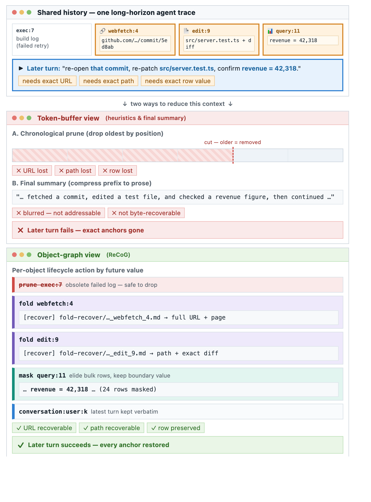
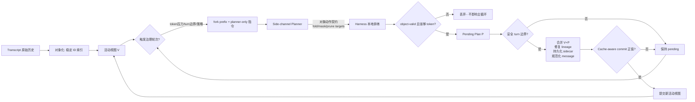
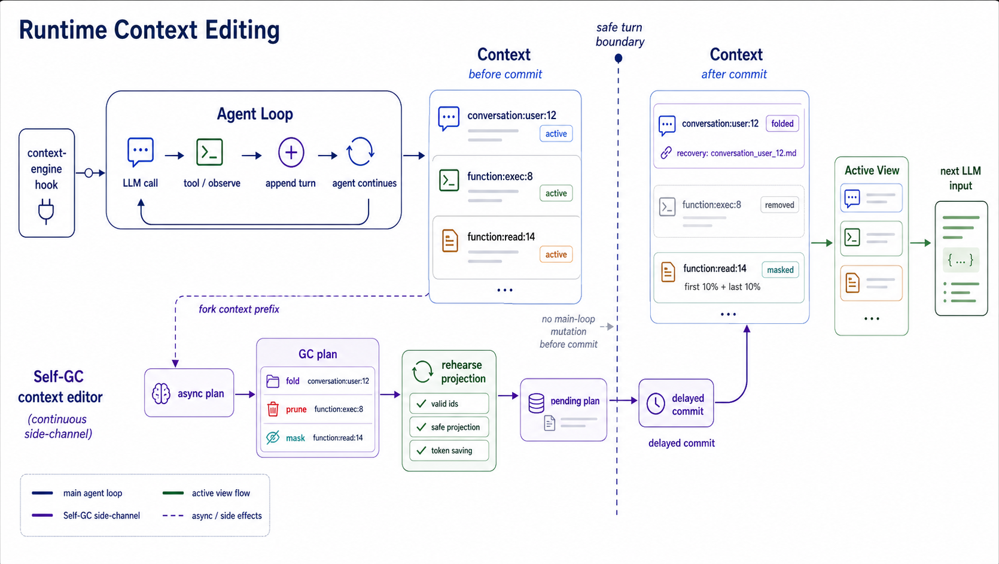
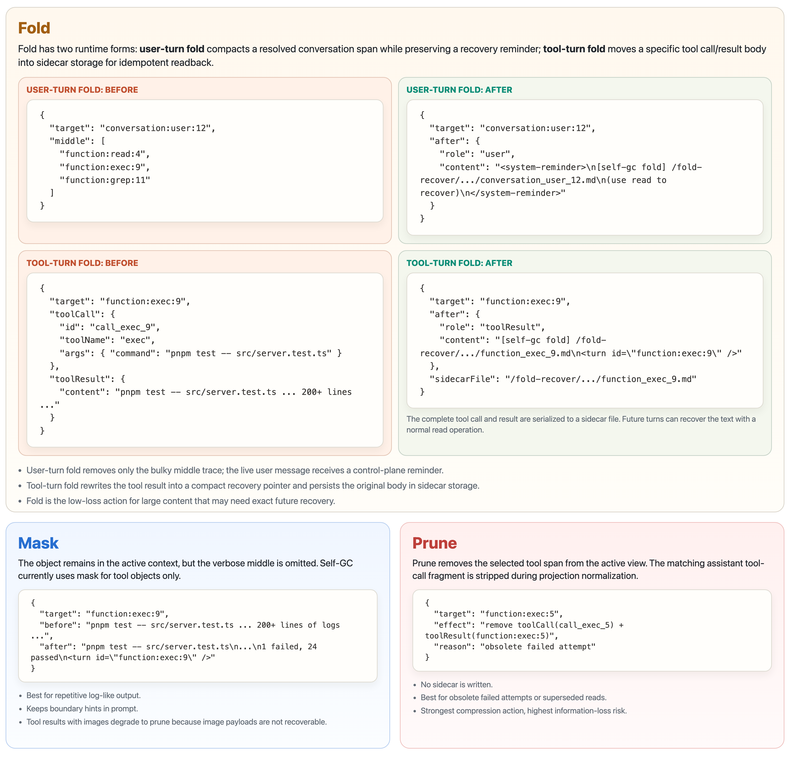
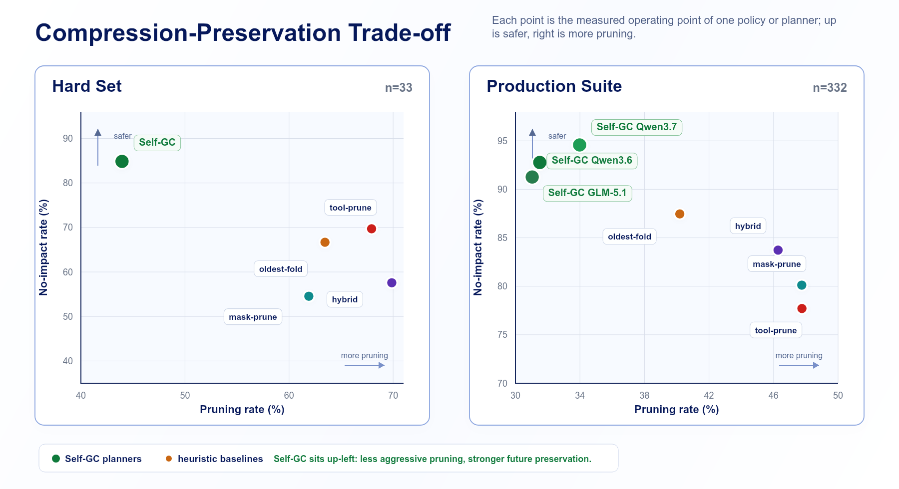
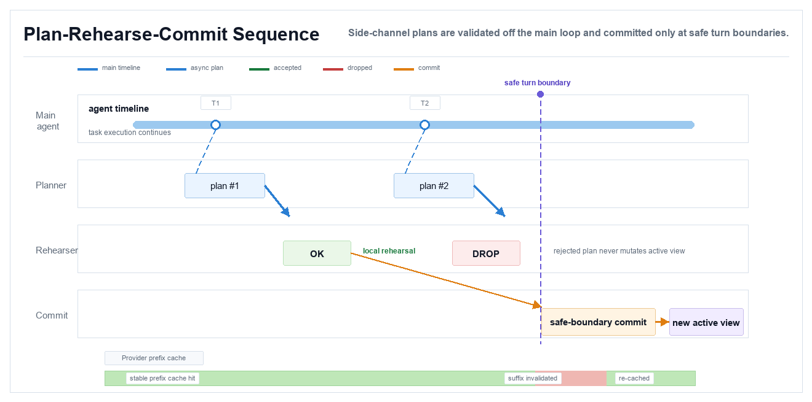
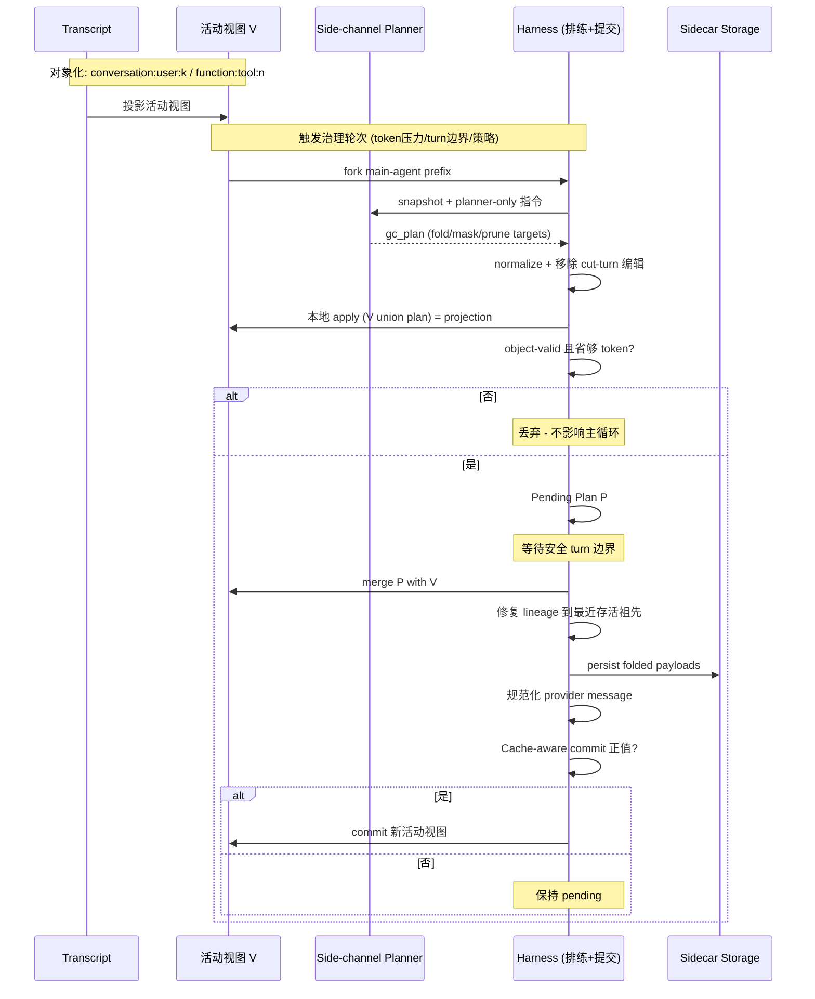
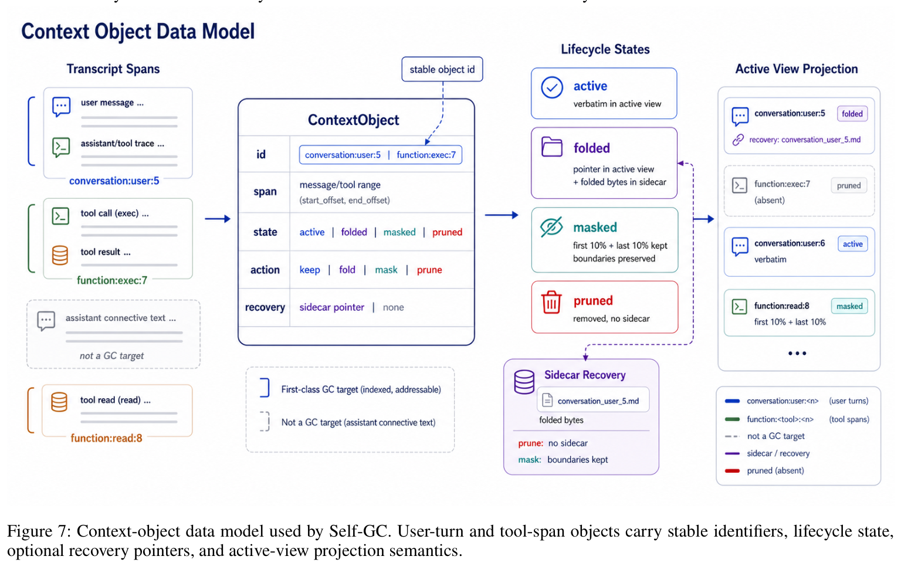
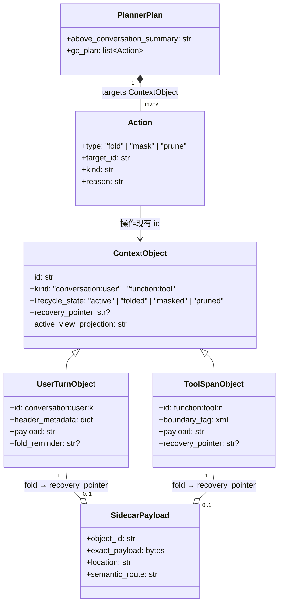

# Self-GC: Self-Governing Context for Long-Horizon LLM Agents 论文调研报告

> 模式C1（单篇论文调研，无开源代码） · 2026-07-06

---

## 📋 基本信息

<p align="center"><b>表1：论文基本信息</b></p>

| 项目 | 内容 |
|-----|------|
| 论文标题 | Self-GC: Self-Governing Context for Long-Horizon LLM Agents |
| 作者 | Xubin Hao, Hongjin Meng, Xin Yin, Jiawei Zhu, Chenpeng Cao |
| 作者单位 | 小红书（Xiaohongshu） |
| 发表会议/期刊 | arXiv 预印本（源文件使用 `aaai2027.sty`，疑似投稿 AAAI 2027） |
| 发表年份 | 2026（2026-07-01 提交，v1） |
| 论文链接 | https://arxiv.org/abs/2607.00692 |
| 项目主页 | 无 |
| 代码仓库 | **无（暂未开源）**。论文 Reproducibility Checklist 明确声明：「All source code required for conducting and analyzing the experiments will be made publicly available upon publication... **(no; a sanitized artifact package is not yet released.)**」 |
| 引用数 | 暂无（2026-07-01 刚发布） |

> **代码与数据可用性说明**：本调研通过 arXiv 页面、GitHub 搜索、WebSearch 多个渠道查找开源代码，均未发现 Self-GC 的公开代码仓库。论文的离线评估数据集（332-session Production Suite 与 33-session Hard Set）来自生产环境脱敏轨迹，raw traces 含私有用户数据无法直接公开，作者仅承诺未来发布 sanitized reproduction package（脱敏 fixture、planner 输出、token 估算、prompt 模板、judge 输出与重算脚本）。因此本报告为纯论文调研（模式 C1），不含代码实现分析章节，但完整收录了论文附录中的 planner/judge prompt 契约、输出 schema、规划-排练-提交伪代码与失败分类法，可作为后续复现的蓝图。

---

## 1. 研究背景与动机

### 1.1 问题定义

长程 LLM agent（浏览网页、调用工具、编辑文件、协调多步工作流的交互式 agent）在运行过程中会累积大量结构化执行轨迹——用户请求、shell 输出、浏览器证据、中间产物、skill state、本地计划。随着交互 horizon 增长，这部分**活动上下文（active context）** 成为直接影响成本、延迟与下游任务质量的核心运行时资源。

论文要解决的核心问题是：**如何治理长程 agent 的活动上下文，在压缩 token 占用的同时不破坏未来步骤所依赖的关键锚点（exact evidence、locators、editable artifacts）**。

论文将一个 agent 会话建模为带生命周期的可索引运行时对象集合。设原始上下文为 $C$（活动视图），经 Self-GC 治理后的活动视图为 $C'$，目标是在**剪枝率（Pruning Rate）** 与 **无影响率（No-impact Rate）** 之间取得更优的帕累托权衡：

$$\text{Prune} = 1 - \frac{\lvert C' \rvert}{\lvert C \rvert}$$

其中无影响率衡量「保留的上下文是否仍能支撑真实的未来延续」——即未来 turn 所需的 exact URL、path、row value、task id、editable body、source-backed evidence 在剪枝后是否仍可见或可恢复。不同于单纯最大化 $\text{Prune}$，Self-GC 的目标是**在保留 future-dependency 的前提下移除低价值上下文**，把上下文管理重新定义为「对可索引、可恢复对象的生命周期控制」而非「事后文本清理」。

### 1.2 研究动机

现有部署系统大多仍把 agent 历史当作**线性 token buffer**，主流方法分两族，二者各有硬伤：

- **位置启发式剪枝（chronological pruning / tool-output masking）**：基于 message age、length、type 的简单规则在运行中裁剪 span。便宜，但**对 future dependency 视而不见**——它无法判断一个旧 tool output 是否还藏着后面步骤唯一需要的 URL、表格值、文件路径或可编辑正文。
- **临近上限的 final self-summary**：等到上下文逼近硬上限再让模型摘要先前交互。保留了叙事状态，但**把精确证据压缩成无法再寻址、审计或恢复的散文**。

这两族方法暴露一个尖锐权衡：位置启发式不能识别 future-critical anchor；摘要保留 narrative 却丢失 exact evidence。论文的关键观察是——**长程 agent 上下文不应被理解为被动的 token buffer，而应被理解为具有不同生命周期需求的运行时对象集合**：有些已废弃可删；有些重复但应保留结构提示；有些庞大却必须**逐字节可恢复**。一个编辑是否安全，不取决于时间位置，而取决于该对象**是否将作为 future dependency**。



*Figure 1: 对象级上下文管理在共享 agent 轨迹上的对比。Token-buffer 方法（上方）按时间顺序丢弃 span，会删掉未来步骤仍然需要的 anchor（如 URL、表格行、文件路径、回调句柄）；Self-GC（下方）通过 fold、mask、prune 三种动作配合 sidecar 恢复，把这些 future-critical anchor 保留下来。这张图是全文的核心动机——现有系统的失败模式不是单纯的「上下文过长」，而是 token-buffer 操作与对象级 future dependency 之间的错配。*

正如 Figure 1 所示，当前系统的失败模式不是简单的「上下文过长」，更深层的问题是 **token-buffer 操作与对象级 future dependency 之间的错配**。

### 1.3 研究目标

设计一个 **harness-portable（可移植到不同 agent harness）** 的自治理上下文框架 Self-GC，**同时**：

1. 把 user turn、tool span、skill state 映射为**带稳定标识符的可索引对象**；
2. 用一个 **side-channel planner** 反思这些对象的未来价值，提议 fold/mask/prune 动作；
3. 让 **harness** 强制执行可恢复 sidecar、安全提交边界与 cache-aware commit，保证 recoverability、protocol validity、lineage 完整性与 cache locality。

核心分工：**模型提供关于未来价值的语义判断，harness 保留 recoverability、protocol validity 等 runtime invariant**。

---

## 2. 核心贡献

### 2.1 主要贡献

<p align="center"><b>表2：论文主要贡献</b></p>

| 编号 | 贡献描述 |
|-----|---------|
| C1 | **问题重构**：把长程 agent 上下文管理从「线性 message 剪枝」重构为「对带索引的运行时对象的生命周期控制」，指出 token-buffer 操作与对象级 future dependency 的错配是现有方法的根本失败模式 |
| C2 | **框架设计**：提出 Self-GC——一个「reflective plan, rehearse, and commit」框架，包含 fold/mask/prune 三种生命周期动作、sidecar 恢复机制与 cache-aware commit 策略；通过 harness 与 side-channel planner 的分工，把语义判断与 runtime 不变量解耦 |
| C3 | **实证验证**：在 production-derived 轨迹上离线 + 在线评估。Hard Set 上 43.95% 剪枝下达到 84.85% 无影响率（最强启发式基线仅 69.70%）；332-session Production Suite 上三个 planner backbone 达到 91.27%–94.58% 无影响率；在线账户级分流下白天平均 input token 降低 10%–15%，峰值近 20% |

### 2.2 创新点

1. **方法创新**：首次把「garbage collection」隐喻从内存管理迁移到 agent 上下文——不是回收未用 token，而是治理上下文对象的**生命周期**；fold/mask/prune 三种动作分别对应「精确可恢复」「保留边界去重」「直接删除」三种生命周期语义，区别于一刀切的摘要或剪枝。
2. **技术创新**：side-channel planner 只读 forked prefix 并发出对象动作契约（而非改写对话）；harness 在本地排练（rehearse）候选计划、强制安全 turn 边界、修复 lineage、规范化 provider message，并用 cache-aware commit 公式决定是否提交——把「模型语义判断」与「runtime 安全性」分离成两条独立路径。
3. **实验创新**：提出 **diff-grounded counterfactual 评估协议**——judge 收到保留 prefix、结构化计划、impacted-turn 的 `context_prune_diff` 块与真实未来 turn，判断未来依赖是否仍可见/可恢复；并辅以 A/B judge 校准与在线账户级分流的生产证据，形成离线反事实 + 在线部署的双层证据链。

---

## 3. 方法详解

### 3.1 方法概述

Self-GC 是位于 **agent harness 与 model input 构造之间** 的治理层（governance layer）。它假设 harness 能识别上下文边界、维护对象索引、并在每次 model call 前投影出活动视图；完整 transcript 始终保留在活动视图之外供审计与恢复。

整体思路分四步：

1. **对象化（Indexed Context Objects）**：把 transcript 映射为带稳定 ID 的可寻址对象（`conversation:user:k`、`function:tool:n`），而非直接编辑原始 message 文本。
2. **反思规划（Reflective Planning）**：当 token 压力、turn 边界或策略触发治理轮次时，fork 当前 context prefix，附加 planner-only 指令，让 side-channel planner 看到索引对象并发出结构化计划（fold/mask/prune targets）。
3. **本地排练（Rehearsal）**：harness 在本地解析目标、丢弃无效或跨 turn 的编辑、规范化重叠动作、物化投影活动视图、估算 token 节省；被接受的计划保持 pending。
4. **安全提交（Safe Commit）**：仅在安全 turn 边界，harness 把 pending 计划与当前视图合并、修复 parent lineage、持久化 folded sidecar、规范化 provider message、并在 cache-aware 公式判定为正值时提交。



*Self-GC 治理循环总览。Transcript 经对象化后形成活动视图 V；触发治理时 fork 出 prefix 让 side-channel planner 发出对象动作契约；harness 本地排练通过 object-valid 校验后存为 pending plan P；仅在安全 turn 边界且 cache-aware commit 公式为正值时才合并提交。整个循环的关键设计是「模型语义判断」与「runtime 安全强制」的两路分离——planner 只提议，harness 才落盘。*

### 3.2 整体架构



*Figure 2: Self-GC 运行时框架总览。context-engine hook 把索引化的上下文对象暴露给 side-channel planner；planner 在 fork 出的 prefix 上反思，发出 fold/mask/prune 动作；harness 在本地排练候选编辑，仅在安全 turn 边界提交。完整 transcript 始终保留在活动视图之外，用于审计与恢复。*

**架构文字描述**：

Self-GC 架构包含以下主要组件，各司其职：

- **Transcript（完整历史）**：始终保留在活动视图之外，是审计与恢复的最终来源。活动视图只是它的一个投影。
- **Context-engine hook（harness 接口）**：移植 Self-GC 只需要一个 context-engine 钩子，而非 provider-specific 的 agent 重写。harness 必须暴露：turn 与 tool-span 边界、稳定对象 ID、让 side-channel planner 读取 forked prefix、把候选编辑 replay 进本地投影、把 folded payload 持久化到 sidecar、仅在安全 turn 边界提交。provider-specific 的 message 规范化留在 harness 内部，planner 只在已有 ID 上发对象动作。
- **Indexed Context Objects（索引对象层）**：把 transcript 映射为 `conversation:user:k`（用户请求及其后续执行 span）与 `function:tool:n`（可独立编辑的 tool-level span）。assistant turn 不是一等 GC 目标（常含连接文本与 tool-call 信封），当相邻对象变化时由 harness 保留或规范化。
- **Side-channel planner（旁路规划器）**：在 forked prefix 上反思对象未来价值，发出结构化计划（`above_conversation_summary` + `gc_plan` 含 fold/mask/prune targets）。它**不重写对话、不产出最终活动视图**——只是个保守的对象过滤器。
- **Rehearsal & Commit（排练与提交路径）**：harness 解析目标、丢弃无效/跨 turn 编辑、规范化重叠动作、物化投影、估算节省；被接受计划保持 pending 直到安全 turn 边界，再合并、修复 lineage、持久化 sidecar、规范化 message、按 cache-aware 公式提交。
- **Sidecar storage（侧车存储）**：fold 动作把精确 payload 移到 sidecar 并留下紧凑恢复指针；活动视图因此可以很小，却不丢失回到大产物/证据 span 的路径。

**关键设计决策**：

- **模型与 harness 分工**：模型供应关于未来价值的**语义判断**，harness 强制 protocol validity、recoverability、commit 纪律等 **runtime invariant**。这种分离是核心安全机制——被拒计划永不进入主 agent 循环。
- **稳定 ID 而非模糊文本匹配**：对象 ID 由 session-local 单调分配器发放，是 control metadata 而非 assistant prose，使 planner 能精确定位对象、harness 能 replay/validate/recover 而无需模糊文本匹配。
- **索引的三重作用**：给 planner 稳定目标、让 harness 追踪生命周期状态、把恢复路径与摘要散文分离——这是与 final summary 的核心区别：Self-GC 缩小 prompt 表面却保留对象身份。

### 3.3 核心算法/模型

#### 3.3.1 算法流程

论文附录 Listing 5 给出的「Planning, rehearsal, and commit」伪代码：

```
Algorithm 1: Self-GC Planning, Rehearsal, and Commit
State: active view V, pending plan P

On trigger:
  1. snapshot <- fork main-agent prefix
  2. plan <- side-channel planner(snapshot)
  3. plan <- normalize targets and remove cut-turn edits
  4. projection <- apply (V union plan) locally
  5. if projection saves enough tokens and is object-valid:
  6.     P <- plan

On safe turn boundary:
  7. if P is not empty:
  8.     merge P with current V
  9.     repair object lineage to nearest surviving ancestors
  10.    persist folded payloads to sidecar storage
  11.    commit the new active view
```

#### 3.3.2 算法逐步解读

<p align="center"><b>表3：算法步骤解读</b></p>

| 步骤 | 操作 | 输入 | 输出 | 设计意图 |
|-----|-----|-----|-----|---------|
| 1 | fork main-agent prefix | 当前活动视图 V | 快照 snapshot | 让 planner 在隔离副本上反思，不污染主循环；planner 只读 |
| 2 | side-channel planner(snapshot) | snapshot + planner-only 指令 | 结构化 plan（fold/mask/prune targets） | 把语义判断外包给模型，但约束为对象动作契约而非自由摘要 |
| 3 | normalize + 移除 cut-turn 编辑 | 原始 plan | 规范化 plan | 强制 mandatory last-turn retention，丢弃针对最新可见 turn 的编辑 |
| 4 | 本地 apply (V ∪ plan) | V + plan | projection（候选活动视图） | 排练：在落盘前物化候选视图，验证可否安全提交 |
| 5-6 | object-valid & 省够 token? | projection + token 估算 | pending plan P 或丢弃 | 双重校验：对象有效性（不破坏 lineage/protocol）+ 经济性（达到压缩阈值） |
| 7-11 | 安全 turn 边界提交 | pending P + 当前 V | 新活动视图 | 仅在 turn 边界合并，修复 lineage、持久化 sidecar、保证可恢复性 |

### 3.4 关键模块详解

#### 模块A: Indexed Context Objects（索引上下文对象）

- **功能**：把 transcript span 映射为带稳定标识符的可寻址对象，使 planner 能精确定位、harness 能 replay/validate/recover。
- **输入/输出**：输入原始 transcript；输出带 ID 的对象集合（`conversation:user:k`、`function:tool:n`）。
- **标识符分配**：session-local 单调分配器。每个可见用户输入在其 header metadata 中获得稳定 `conversation:user:k` id；每个 tool result 以轻量 XML 边界标签获得稳定 `function:<tool>:n` id。
- **核心数据形态**（Listing 1）：

```xml
[User]
Header metadata:
{
  "label": "webchat",
  "turn_id": "conversation:user:1"
}
What does this file do?

[Tool result: read(src/main.py)]
def main():
    print("Self-GC System Running...")
<turn id="function:read:1" />
```

- **设计要点**：assistant turn 不是一等 GC 目标（常含连接文本与 tool-call 信封），当相邻对象变化时由 harness 保留或规范化；ID 是 control metadata 而非 assistant prose，所以 planner 能定位精确对象而 harness 能无需模糊文本匹配地 replay/validate/recover。
- **与论文其他部分的关系**：索引是整个框架的地基——planner 的稳定目标、harness 的生命周期追踪、恢复路径与摘要散文的分离都依赖它。

#### 模块B: Actions — Fold, Mask, Prune（三种生命周期动作）

- **功能**：每个对象接收一种生命周期动作，对应不同的可恢复性语义。
- **输入/输出**：输入对象 ID + planner 判断；输出该对象的命运（移入 sidecar / 保留边界去重 / 直接删除）。



*Figure 3: 索引对象上的生命周期动作。Fold 把精确 payload 移到 sidecar 并留下紧凑恢复指针；mask 保留对象边界的同时省略低信号的中间内容；prune 从活动视图移除废弃 span 且不保证恢复。三种动作对应 agent 轨迹中三种典型场景：失败的命令日志可 prune、重复的浏览器快照可 mask、生成的报告正文需要 fold 以便未来 turn 精确引用或修订。*

<p align="center"><b>表4：三种生命周期动作对比</b></p>

| 动作 | 语义 | 可恢复性 | 典型场景 | 适用对象 |
|-----|-----|---------|---------|---------|
| **Fold** | 精确 payload 移入 sidecar，留紧凑恢复指针 | 逐字节可恢复 | 生成的报告正文、大稳定产物，未来 turn 可能逐字引用或修订 | 大型稳定 body、可能需要幂等恢复的对象 |
| **Mask** | 保留结构边界提示，省略重复/低信号中间内容 | 不可逐字恢复（但留结构） | 重复浏览器快照、冗长日志中段 | 重复 log-like 中段内容 |
| **Prune** | 从活动视图移除废弃内容 | 无恢复保证 | 失败命令日志、已清除依赖的废弃搜索/失败尝试 | 已废弃的低信号 trace |

#### 模块C: Reflective Planning, Rehearsal, and Commit（反思-排练-提交）

- **功能**：在 forked prefix 上让 planner 反思未来价值、harness 本地排练、安全边界提交。
- **planner prompt 契约**：写成**对象-动作契约**而非摘要 prompt。要求模型按顺序决定 exclusion、future dependencies、granularity、action semantics，并用围绕 exact anchors、editable artifacts、live handles、source-backed evidence 校准的 few-shot 例子。这让 planner 在 harness 应用确定性校验前表现得像个保守的对象过滤器。
- **planner 输出 schema**（Listing 2，XML）：

```xml
<above_conversation_summary>
  One short sentence describing the session type,
  likely future dependencies, and a light compression bias.
</above_conversation_summary>

<gc_plan>
  <fold kind="conversation" reason="resolved_turn">user:5</fold>
  <fold kind="function" reason="stable_artifact">read:12</fold>
  <prune kind="function" reason="obsolete_trace">exec:9</prune>
</gc_plan>
```

- **planner 四条安全规则**：
  1. 排除最新可见 turn、活动指令文件、live handles、可编辑产物正文、未来 turn 可能逐字需要的精确证据；
  2. 当 tool-level 动作比 whole-turn folding 更精确地保留相同 future support 时优先用 tool-level；
  3. prune 只用于废弃低信号 trace，mask 用于重复 log-like 中段，fold 用于可能需要幂等恢复的大 body；
  4. 只在已有对象 ID 上发 XML，含简短对话摘要 + 分组 fold/mask/prune targets。

- **与论文其他部分的关系**：这是「模型语义判断」与「runtime 安全」分离的核心执行路径——planner 提议，harness 落盘。

#### 模块D: Recoverability and Cache-Aware Commit（可恢复性与缓存感知提交）

- **功能**：保证 folded 内容可恢复，且提交只在缓存收益为正时发生。
- **fold metadata 注入**：作为 control-plane reminder 附着到相关 user message，而非 assistant 撰写的 prose。这让恢复指针对模型可见，同时降低后续 assistant turn 模仿内部 fold 标签的风险。
- **核心公式 — Cache-Aware Commit 判定**：

$$\text{CommitBenefit} \approx N_{\text{future}}(C - C') - L_{\text{cache\_break}} - L_{\text{GC}}$$

其中 $C$ 与 $C'$ 是提交前后的平均 input 成本，$N_{\text{future}}$ 是预期复用次数，$L_{\text{cache\_break}}$ 与 $L_{\text{GC}}$ 估算 cache 断裂损失与 GC 开销（含 side-channel planner 调用）。

- **运营阈值**：在观测触发点上的部署回归表明，当预期活动视图剪枝超过 **0.3**（30%）时立即提交为正值；低于此值，Self-GC 保持计划 pending 直到 cache 过期或下一个任务边界。**这个阈值是运营策略而非普适常数**。
- **设计意图**：因为提交 GC 计划会改变活动视图、可能使部分 provider prefix cache 失效，Self-GC 增量提交且仅当预期未来节省盖过 cache 断裂时才提交——把 prompt-cache 经济学（Lumer et al. 2026）纳入治理决策。

### 3.5 关键技术

<p align="center"><b>表5：关键技术点</b></p>

| 技术点 | 描述 | 作用 | 论文对应位置 |
|-------|-----|-----|------------|
| 对象索引化 | `conversation:user:k` / `function:tool:n` 稳定 ID | 给 planner 稳定目标、harness 追踪生命周期、分离恢复路径与摘要 | Section "Indexed Context Objects" |
| 三态生命周期动作 | fold/mask/prune 三种可恢复性语义 | 区分「精确可恢复」「留边界去重」「直接删除」，取代一刀切摘要/剪枝 | Section "Actions: Fold, Mask, and Prune" |
| Side-channel planner | fork prefix + 对象动作契约 | 把语义判断外包给模型，但约束为对象动作而非自由摘要 | Section "Reflective Planning..." |
| 本地排练（Rehearsal） | harness replay 候选计划到本地投影 | 落盘前验证 object-valid + 估算节省，被拒计划不进主循环 | Section "Reflective Planning..." |
| Sidecar 恢复 | fold payload 移入 sidecar + 恢复指针 | 活动视图很小却保留回到大产物的路径，区别于 final summary | Section "Recoverability..." |
| Cache-aware commit | CommitBenefit 公式 + 0.3 阈值 | 仅当预期节省盖过 cache 断裂时提交，纳入 prompt-cache 经济学 | Section "Recoverability..." |
| 安全 turn 边界提交 | pending 计划仅在 turn 边界合并 | 避免在 turn 中途破坏 protocol validity，配合 lineage 修复 | Section "Reflective Planning..." |
| diff-grounded 反事实评估 | judge 收 retained prefix + diff + 真实未来 turn | 离线衡量「保留上下文是否仍支撑真实未来延续」 | Section "Metrics" + Appendix |

### 3.6 方法设计的关键洞察

1. **洞察1：上下文是对象集合，不是 token buffer**。长程 agent 上下文的不同部分有不同生命周期需求——有些废弃可删、有些重复但留结构提示、有些庞大却必须逐字节可恢复。是否安全编辑不由时间位置决定，而由「是否将作为 future dependency」决定。这是对 token-buffer 视图本身的挑战。
2. **洞察2：模型判断与 harness 强制应分离**。模型擅长语义判断（这个 tool output 未来还用不用），但不擅长保证 protocol validity、lineage 完整、cache locality 等 runtime invariant。把两者解耦到 side-channel planner 与 harness 两条独立路径，既获得语义灵活性又保留确定性安全。
3. **洞察3：压缩应保留对象身份，而非叙事**。final summary 保留 narrative state 却丢失 exact evidence；Self-GC 缩小 prompt 表面但通过 sidecar 保留对象身份与逐字节可恢复性——「压缩」与「可恢复」不再对立。
4. **洞察4：cache 经济学必须纳入治理决策**。文本压缩省的 token 可能被 prefix cache 断裂的 pre-fill 惩罚抵消（呼应 TokenPilot/Lumer 等工作的缓存对齐动机）。Self-GC 用 CommitBenefit 公式只在净收益为正时提交，把 cache-aware 从「事后考虑」升级为「提交门控」。

### 3.7 与现有方法的核心区别

<p align="center"><b>表6：与现有方法的对比</b></p>

| 环节 | 现有方法做法 | 本文做法 | 改变原因 |
|-----|------------|---------|---------|
| 上下文表示 | 线性 token buffer / message list | 索引化运行时对象（稳定 ID） | 让 planner 精确定位、harness 可 replay/recover，无需模糊文本匹配 |
| 编辑语义 | 一刀切摘要或按类型剪枝 | fold/mask/prune 三态生命周期 | 不同对象有不同可恢复性需求，不能用同一种动作处理 |
| 决策者 | 启发式规则或 final summary 模型 | side-channel planner 发对象动作契约 + harness 排练 | 模型供应语义判断，harness 强制 runtime invariant，二者解耦 |
| 安全机制 | 无（直接改写对话） | 本地排练 + 安全 turn 边界提交 + lineage 修复 | 被拒计划不进主循环，保证 protocol validity 与可恢复性 |
| 恢复性 | 摘要后不可逐字恢复 | sidecar 存 fold payload + 恢复指针 | 活动视图小却保留回到大产物的路径 |
| 缓存考量 | 无或事后考虑 | CommitBenefit 公式门控提交 | 文本压缩节省可能被 cache 断裂惩罚抵消，需净收益为正才提交 |

---

## 4. 实验分析

> 论文暂未开源代码，本章节基于论文正文与附录的实验描述、表格数据与图片分析。

### 5.1 实验设置

#### 数据集

论文使用**生产环境脱敏轨迹**（production-derived long-horizon agent traces），分三部分：

<p align="center"><b>表7：实验数据集</b></p>

| 数据集 | 规模 | 任务 | 来源 |
|-------|-----|-----|-----|
| Raw trace rows | 15,141 行 | 长程 agent 原始轨迹 | 小红书生产环境 |
| Compaction-triggered traces | 9,075 | 触发过压缩的轨迹子集 | 上一步过滤 |
| Production Suite | 332 sessions | 办公/浏览器/shell/web-fetch 混合工作流 | 高工具压力 case 过滤 |
| Hard Set | 33 sessions | 浏览器/shell/web-fetch 为主，强调 exact URL/path/命令输出/提取值成为 future dependency | 从最高持续工具压力 case 蒸馏 |
| Online Split | 账户级分流 | context-gc（交互聊天清理）+ skill-gc（长生命周期 skill-state 剪枝） | 生产流量，邮箱首字母 ≥ 'o' 为 Self-GC 组，< 'o' 为对照组 |

<p align="center"><b>表8：离线数据集构造流水线</b></p>

| 过滤阶段 | 数量 |
|---------|------|
| Raw trace rows | 15,141 |
| Compaction-triggered traces | 9,075 |
| Production Suite sessions | 332 |
| Hard Set sessions | 33 |

> **数据集说明**：Hard Set 故意偏向浏览器/shell/web-fetch 工作流而非镜像完整生产组合，强调 exact URL、path、命令输出、提取值常成为 future dependency 的场景。代表性行政化的用户请求包括：「收集某 vendor 最新公开信息并做成对比表」「在不改现有表头和公式的前提下修复这份报告表格」「排查定时任务为何失败、重跑、把最终链接发我」。Online Split 是生产监控证据而非完全随机化质量实验——离线 replay 才提供受控的 future-dependency 对比。

#### 评估指标

<p align="center"><b>表9：评估指标</b></p>

| 指标 | 定义 | 计算方式 |
|-----|-----|---------|
| Pruning Rate (Prune) | 活动视图移除的 prefix token 平均占比 | $\text{Prune} = 1 - \frac{\lvert C' \rvert}{\lvert C \rvert}$，$C$/$C'$ 为 GC 前后活动上下文 |
| No-impact Rate | 保留上下文是否仍支撑真实未来延续 | GPT-5.5 judge 检查 exact URL/path/row value/task id/editable body/source-backed evidence 是否仍可见或可恢复；报告 Wilson 95% 置信区间 |
| Online Input Tokens | 覆盖生产流量的主 agent 平均 input token | 账户级分流下白天窗口平均；planner 开销由 commit 策略控制但不替代匹配的 billed-cost 审计 |

> **No-impact judge 的关键设计**：judge 收到保留 prefix、候选计划、compact 前后 patch、ground-truth 未来 turn，判断未来依赖是否仍可见/可恢复。**narrative coherence 不够**——exact identifier、source-backed explanation、row-level value、editable body 才是主导。被测 agent 视图只含保留上下文；移除内容的 diff 仅作 judge-only 反事实证据。

#### 实现细节

- **planner backbone**：默认 Qwen3.6-Plus；另测 Qwen3.7-Max 与 GLM-5.1 验证框架是否依赖单一 planner。GPT-5.5 **仅作离线 judge**，不作被测 planner。
- **核心运行时设置**：30% 压缩阈值、mandatory last-turn retention。
- **离线评估协议**：所有方法用相同 cut points、相同 token 记账、相同 mandatory last-turn retention、相同 GPT-5.5 no-impact judge。evaluator 是 diff-grounded——收到保留 prefix、结构化计划、impacted-turn `context_prune_diff` 块、真实未来 turn。
- **A/B 校准**：在 20 个分歧 case 上用 A/B judge 比较 oldest-turn-fold 与 Self-GC Qwen3.6-Plus。

### 5.2 主实验结果

#### Hard Set 结果（表3）

<p align="center"><b>表10：Hard Set 上 Self-GC 与基线的 No-impact 与 Pruning Rate</b></p>

| 方法 | Prune (%) | No-impact (%) | 95% CI |
|-----|-----------|---------------|--------|
| Oldest-turn | 63.45 | 66.67 | [49.61, 80.25] |
| Tool-prune | 67.93 | 69.70 | [52.66, 82.62] |
| Tool-mask+prune | 61.90 | 54.55 | [37.99, 70.16] |
| Hybrid | 69.87 | 57.58 | [40.81, 72.76] |
| **Self-GC** | **43.95** | **84.85** | [69.08, 93.35] |

**解读**：Self-GC 选择了一个**保守但显著更安全**的操作点。启发式基线移除 61.90%–69.87% 的 token，但 no-impact 率只有 54.55%–69.70%；Self-GC 只剪枝 43.95%，却把 no-impacts 提升到 84.85%——比最强完成启发式（Tool-prune 69.70%）高出至少 15.15 个百分点。这印证了论文核心论点：**激进剪枝不等于好的上下文管理，目标是移除低价值上下文同时保留 future anchor**。

#### Production Suite 结果（表4）

<p align="center"><b>表11：Production Suite 上 Self-GC 与基线的 No-impact 与 Pruning Rate</b></p>

| 方法 | Prune (%) | No-impact (%) | 95% CI |
|-----|-----------|---------------|--------|
| Oldest-turn | 40.19 | 87.46 | [83.46, 90.60] |
| Tool-prune | 47.76 | 77.71 | [72.93, 81.86] |
| Tool-mask+prune | 47.75 | 80.12 | [75.49, 84.06] |
| Hybrid | 46.28 | 83.73 | [79.38, 87.31] |
| Self-GC Qwen3.6 | 31.51 | 92.77 | [89.47, 95.09] |
| Self-GC Qwen3.7 | 33.98 | 94.58 | [91.59, 96.54] |
| Self-GC GLM-5.1 | 31.04 | 91.27 | [87.74, 93.85] |

**解读**：大规模下模式一致。完成启发式基线剪枝 40.19%–47.76% 但 no-impact 低于 90%；Self-GC 三个 planner backbone 达到 91.27%–94.58% no-impact，同时只剪枝 31.04%–33.98%。Qwen3.7-Max 表现最佳（94.58%），但三个 backbone 差异温和，支持部署中使用中端 planner（只要 harness 强制确定性安全校验）。

#### A/B judge 校准

单 prompt 判断给 oldest-turn-fold 与 Self-GC Qwen3.6-Plus 的原始 no-impact 为 89.76% 与 92.47%。在 20 个分歧 case 上，A/B judge 在 11 个偏好 Self-GC、7 个平局、2 个偏好基线，得到校准估计 **92.77% vs 87.46%**。这控制了 judge 自身偏差后，Self-GC 的优势依然成立。

#### 压缩-保留权衡（Figure 4）



*Figure 4: Hard Set 与 Production Suite 上的压缩-保留权衡。每个点是一个方法的平均剪枝率与 no-impact 率；Self-GC 一致地移向「更低的剪枝率但更高的 future-dependency 保留」。基线们聚在右上角（高剪枝低保留），Self-GC 占据左上角（低剪枝高保留），形成更优的帕累托前沿。*

**解读**：Figure 4 强化主表结论——**激进剪枝对 agent 上下文管理并不充分**，相关目标是移除低价值上下文同时保留 future anchor。Self-GC 一致地位于更优的帕累托前沿上。

#### 在线生产影响（Figure 5）


*Figure 5: 5 月 25–30 日 08:00–22:00 白天生产流量下 Self-GC 组与对照组的平均 input token。曲线聚合覆盖流量，显示 Self-GC 平均降低 10%–15%，峰值近 20%；最后一个窗口含波动较大的月末批量 API 流量。*

**解读**：在观测的白天窗口内，Self-GC 组一致使用更少的主 agent 平均 input token。这一在线结果**本身不证明用户质量保留或净 billed-cost 下降**，但确认 Self-GC 部署后产生了可测的生产 input-token 降低。

### 5.3 消融实验

论文未做传统意义的模块消融，但通过以下维度提供了等价证据：

- **planner backbone 替换**（表4）：Qwen3.6-Plus / Qwen3.7-Max / GLM-5.1 三个 backbone 在 Production Suite 上均超 90% no-impact，差异温和——证明框架不依赖单一 planner 模型。
- **mandatory last-turn retention 的必要性审计**：审计 planner 是否会在生产安全过滤器移除前压缩最新可见用户 turn。Qwen3.6-Plus 在 25/330 个解析计划中触及 cut turn，Qwen3.7-Max 15/330，GLM-5.1 12/328。**prompt 通常有效，但残余风险证明 mandatory last-turn 保护是必要的**——这是对「planner 可信度」的消融，证伪了「可省略 harness 安全层」的假设。
- **A/B judge 校准**（前述）：控制 judge 偏差后优势仍存，等价于「评估器消融」。

### 5.4 分析与讨论

#### 固定启发式的失败模式

最强启发式以不同方式失败：
- **oldest-turn-fold**：保留高层 narrative 但隐藏具体 grounding（文档 id、端口、行值、失败原因）。
- **tool-prune-greedy**：保留对话 narrative 但删除后续成为 live handle 或 exact evidence 的 tool artifact。

这解释了结果中的**工作流反转**：tool pruning 在 BI 密集的 Hard Set session 上有竞争力（很多 dump 可重新查询），而 chronological turn folding 在 DOC/CODE 密集的 Production Suite session 上更强（短 tool output 常含唯一产物 id 或行级值）。这种不对称既是统计的也是实践的——编码任务常有 Git history、build log、test、可重跑命令作为外部记忆；办公式工作流常缺 agent 可访问的版本底座，所以一个短 tool output 可能含唯一可恢复的业务证据。

#### 失败分类法（附录 Table 7）

论文给出以 dependency 为中心的失败分类法——每类问「什么未来动作变得 unsupported」，而非「删了什么 message 类型」：

<p align="center"><b>表12：future-dependency 丢失的失败分类法</b></p>

| 类别 | 缺失依赖 | 典型症状 | Self-GC 缓解 |
|-----|---------|---------|------------|
| Evidence-detail loss | 精确行/表值/指标定义/SQL 过滤/chart selector/栈帧/稀疏中段证据 | 未来 turn 能续故事但无法复现、审计或修订具体结果 | 保留或 fold 证据承载 tool span；稀疏表/栈帧/diff hunk 不用 mask |
| Locator/handle loss | 文件路径/文档 id/任务 id/会话 id/等待句柄/回调 URL/恢复路径/最终交接链接 | agent 知道产物存在但无法重开、重跑、等待或交付 | required-retention anchor + sidecar 指针；最新 live handle 排除出 GC |
| Behavioral-contract loss | 用户纠正/schema 规则/指令文件/策略约束/任务约定/工作流设置 | 后续编辑偏离请求规则，尽管高层任务仍可见 | 指令文件排除、契约保留、优先 tool-level 动作而非 whole-turn fold |
| Verbatim-source loss | 原始措辞/转录 span/引用/字段标签/生成正文/源文本 | 摘要语义 plausible 但无法回答恢复、引用或精确复制请求 | 保留精确源 span 或可恢复地 fold，不用散文替换 |
| Live-state loss | 当前 blocker/纠正的重跑结果/活动失败状态/最新成功交接/完成状态 | 保留 prefix 看着完整或 stale，但真实任务阻塞/重跑中/刚被纠正 | 计划级 sanity check 保留当前有效路径、纠正状态、活动完成证据 |
| Recovery-routing loss | folded 内容在 sidecar 但活动视图缺足够语义路由信息 | 恢复技术上可能但后续 turn 实际不可发现 | fold reminder 附着到相关 user turn，含紧凑语义路由 + sidecar 位置 |

#### Self-GC 如何在 prompt 契约层应对

planner prompt 不要求自由摘要，而是要求在 ordered exclusion、dependency、granularity、action、sanity-check 规则下的对象动作。few-shot 例子明确：
- 当 turn 含 editable body、source-backed evidence 或 use-site bridge 时，**优先 tool-level fold 而非 whole-turn fold**；
- 只在 dependency 清除后**才 prune 废弃搜索或失败尝试**；
- 对可能需要幂等恢复的大稳定 body**要求 fold 而非 mask**。

这解释了表 3/4 的保守操作点：Self-GC 放弃了一些剪枝，因为 prompt 通过例子与硬规则学到——exact anchor、可恢复产物、当前状态是 load-bearing 对象而非可压缩散文。

#### 与工业/方法基线的关系

DeepSeek-V3.2 报告了 Search Agent 的上下文管理策略（Summary、Discard-75%、Discard-all，在 rollout token 超过上下文窗口大 fraction 时触发）。论文把这些作为**工业策略参考**而非直接实验基线（需要匹配的 agent harness 与 rollout policy）。AgentDiet、AgentFold、LongCodeZip 同样激励未来公开对比，但其原生设置与本文生产脱敏的办公/浏览器/shell/web-fetch 轨迹不同。因此论文完成的对比聚焦于**可复现的启发式策略 + 共享 cut-point replay 协议**。

#### 案例研究

- **修复循环安全**：一个文档修复 session 中，用户反复警告 agent 不要在之前 tool call 搞坏布局后整体替换表头。chronological turn-fold 基线把显式警告藏到摘要后；Self-GC 剪枝了废弃失败 tool output 但保留了可见的 warning bridge，保住了后续局部编辑所需的行为契约。
- **工作流契约 seeding**：一个多记录数据录入 pipeline 中，早期 turn 创建了任务特定契约文件与参考数据库。最强 chronological 基线因 seeding 阶段太老而 fold 了它；Self-GC 只 fold 了带结构化恢复指针的庞大文件正文，保持契约 locator 可见，降低了后续记录的格式漂移风险。

### 5.5 实验结果总体分析

从全局视角综合解读所有实验，Self-GC 的证据链呈现清晰的**三层验证**结构：

**第一层：反事实验证（离线 future-dependency）**
- Hard Set（33 session，高工具压力）：Self-GC 以 43.95% 剪枝达到 84.85% no-impact，最强启发式 69.70%（高剪枝却低保留）。这验证了核心论点——**对象级生命周期控制改善了剪枝与 future-dependency 保留的权衡**。
- Production Suite（332 session，更大规模更混合）：三个 planner backbone 达 91.27%–94.58% no-impact，基线 77.71%–87.46%。大规模下优势保持，且**框架不依赖单一 planner**（三 backbone 差异温和）。
- A/B 校准（20 个分歧 case）：控制 judge 偏差后 92.77% vs 87.46%，优势在更严格评估下依然成立。

**第二层：机制验证（失败分类法 + 案例研究）**
- 失败分类法（表 12）把基线失败定位到 6 类具体 missing dependency（evidence-detail、locator/handle、behavioral-contract、verbatim-source、live-state、recovery-routing），而非泛泛「坏摘要」。
- 两个案例研究（修复循环、工作流契约 seeding）展示 Self-GC 如何在具体场景保住基线丢失的契约/locator。
- planner 触及 cut turn 的审计（25/330、15/330、12/328）证明 mandatory last-turn retention 的必要性——**残余风险证伪了「可省略 harness 安全层」**。

**第三层：部署验证（在线生产分流）**
- 5 月 25–30 日白天窗口，账户级分流下 Self-GC 组平均 input token 降低 10%–15%，峰值近 20%。这是部署后的可测生产影响，但**本身不证明质量保留或净 billed-cost 下降**（未做匹配的 billed-cost 审计含全部 planner 开销）。

**各层之间的逻辑关系**：离线反事实是受控的核心证据（回答「保留上下文是否仍支撑真实未来延续」）；机制验证解释了**为什么**基线失败而 Self-GC 成功（把统计差异落到具体 dependency 类别）；在线部署提供「真实世界可部署」的初步证据但承认质量未直接测。三层共同收敛到结论：**上下文管理应被理解为对可索引、可恢复对象的运行时生命周期控制，而非事后文本清理**。

**核心结论与边界**：
- **成立**：在办公/浏览器/shell/web-fetch 长程 agent 轨迹上，对象级 fold/mask/prune + side-channel planner + harness 强制的排练-提交，能在保留 future anchor 的前提下显著压缩活动上下文。
- **边界**：(1) 评估是 production-derived 但非完全开放（raw trace 含私有数据）；(2) 主离线指标是 judge-based no-impact 而非完整在线 replay 成功，A/B 校准集小；(3) 在线日志显示 aggregate input-token 降低但非完全随机化质量实验或匹配的 billed-cost 审计；(4) sanitized artifact package 尚未发布，复现性受限。

---

## 6. 相关工作

### 6.1 相关工作列表

<p align="center"><b>表13：相关工作列表</b></p>

| 论文/方法 | 年份 | 核心思想 | 与本文关系 |
|----------|-----|---------|-----------|
| RAG (Lewis et al.) | 2020 | 检索增强生成，向 prompt 加选中的证据 | 本文的基础（外部记忆/检索范式） |
| MemGPT (Packer et al.) | 2024 | 把 LLM 当操作系统，分层记忆 | 同属记忆管理，本文与之互补 |
| LongMem (Wang et al.) | 2023 | 长期记忆增强 | 记忆存储方法，本文互补 |
| Mem0 (Chhikara et al.) | 2025 | 生产就绪的可扩展长期记忆 | 记忆存储方法，本文互补 |
| A-MEM (Xu et al.) | 2025 | agent 式记忆 | 记忆存储方法，本文互补 |
| HippoRAG (Gutiérrez et al.) | 2024 | 神经生物学启发的长期记忆 | 图结构记忆，本文互补 |
| REMem (Shu et al.) | 2026 | episodic 记忆推理 | 记忆存储方法，本文互补 |
| TiMem (Li et al.) | 2026 | 时间分层记忆固化 | 时间记忆固化，本文互补 |
| SWE-Pruner (Wang et al.) | 2026 | 编码 agent 自适应上下文剪枝 | 任务感知压缩方法，本文的对比/基线动机 |
| ContextBudget (Wu et al.) | 2026 | 搜索 agent 预算感知上下文管理 | 任务感知压缩方法，本文的对比/基线动机 |
| ACON (Kang et al.) | 2025 | 压缩指南优化 | 任务感知压缩方法，本文的对比/基线动机 |
| Chroma Context-1 (Chroma) | 2026 | 检索 chunk 上的 agent 剪枝 | 任务感知压缩方法，本文的对比/基线动机 |
| AgentDiet (Xiao et al.) | 2025 | 通过轨迹压缩降 LLM agent 成本 | 近邻方法，缩短历史但无 harness 强制的对象可恢复性 |
| AgentFold (Ye et al.) | 2026 | 长程 web agent 主动上下文折叠 | 近邻方法（ICLR 2026），无 harness 强制的对象可恢复性 |
| LongCodeZip (Shi et al.) | 2025 | 压缩长代码上下文 | 近邻方法，无 harness 强制的对象可恢复性 |
| AutoTool (Jia and Li) | 2026 | 减少重复 tool-selection 开销 | 不改任务语义的推理成本降低，正交 |
| H2O (Zhang et al.) | 2023 | heavy-hitter 选择压缩 KV cache | 模型内部长上下文系统，本文在其之上操作 |
| Attention Sinks (Xiao et al.) | 2023 | attention sink 流式推理 | 模型内部长上下文系统，本文在其之上操作 |
| SnapKV (Li et al.) | 2024 | query 前压缩 KV cache | 模型内部长上下文系统，本文在其之上操作 |
| PyramidKV (Cai et al.) | 2024 | 金字塔信息漏斗 KV 压缩 | 模型内部长上下文系统，本文在其之上操作 |
| SparK (Liao et al.) | 2026 | 可恢复 KV cache 通道剪枝 | 模型内部长上下文系统，本文在其之上操作 |
| Don't Break the Cache (Lumer et al.) | 2026 | prompt cache 经济学评估 | 本文 cache-aware commit 的理论依据 |
| DeepSeek-V3.2 (DeepSeek-AI) | 2025 | Search Agent 的 Summary/Discard 策略 | 工业策略参考（非直接基线） |
| AgentBench/WebArena/MCP-AgentBench | 2023-2026 | 工具 agent 评估 benchmark | 评估范式参考，本文 judge 协议受其启发 |
| G-Eval/JudgeLM (Liu et al. / Zhu et al.) | 2023 | LLM-as-judge 协议 | 本文采用其可审计 rubric 评估 |
| Cursor Training Composer (Cassano and Rush) | 2026 | 训练 native self-summary 平台能力 | final self-summary 方法参考 |
| OpenAI Responses API + Computer Env (Xu et al.) | 2026 | 平台原生 self-summary | final self-summary 方法参考 |

### 6.2 本文与相关工作的区别

Self-GC 与相关工作在三个维度上区别清晰：

1. **与记忆存储方法（MemGPT/LongMem/Mem0/A-MEM/HippoRAG/REMem/TiMem）互补**：这些方法组织交互历史进显式记忆单元、用户画像、episodic 记录或图结构记忆，关注**持久存储**。Self-GC 不与之竞争，而是治理**活动 prompt 视图**——runtime context compression 是相关但不同的问题。未来工作明确提到「combining runtime GC with hierarchical memory or retrieval stores so durable knowledge migrates out of the active prompt」。

2. **与运行时压缩方法（SWE-Pruner/ContextBudget/ACON/Chroma Context-1/AgentDiet/AgentFold/LongCodeZip）有别**：这些方法让压缩更语义化或缩短历史，但**无 harness 强制的对象可恢复性**。Self-GC 的区别在于：把活动上下文治理为带 fold/mask/prune 显式生命周期的索引运行时对象，配合 sidecar 恢复与 cache-aware commit。

3. **与模型内部长上下文方法（H2O/Attention Sinks/SnapKV/PyramidKV/SparK）正交**：这些在 KV 层压缩或驱逐。Self-GC 在 KV 层**之上**操作——编辑语义活动视图，且仅当预期节省盖过 prefix-cache 断裂时才提交。

---

## 7. 局限性分析

### 7.1 论文声明的局限性

作者在 Limitations 与 Reproducibility Checklist 中明确承认：

1. **数据非完全开放**：raw trace 含私有用户数据；复现需要 sanitized fixtures、prompt 模板、per-sample judge 输出与重算脚本，但尚未发布。
2. **离线指标非完整在线 replay**：主离线指标是 judge-based no-impact 而非完整在线 replay 成功；A/B 校准集小（仅 20 个分歧 case）。
3. **在线证据非完全随机化**：在线日志显示 aggregate input-token 降低（运营账户分流），但非完全随机化质量实验或匹配的 billed-cost 审计（含全部 planner 开销）。
4. **超参数开发扫描未报告**：论文报告最终运行时设置（30% 阈值、planner backbone）但未报告开发期间的完整参数扫描与选择准则。
5. **复现性受限**：无代码附录、无 preprocessing 代码、无 seed 描述、未指定计算基础设施（GPU/CPU/内存/OS/库版本）、未报告每个结果的算法运行次数、无形式化显著性检验（如 Wilcoxon signed-rank）。

### 7.2 发现的潜在问题

<p align="center"><b>表14：潜在问题分析</b></p>

| 问题类型 | 描述 | 影响 |
|---------|-----|------|
| 方法层面 | side-channel planner 调用本身有成本与延迟，CommitBenefit 公式中的 $L_{\text{GC}}$ 难以精确估计 | 高频触发下 planner 开销可能侵蚀收益；论文承认不替代 billed-cost 审计 |
| 方法层面 | 0.3 阈值是「运营策略而非普适常数」，依赖部署回归 | 跨 provider/跨场景迁移需重新校准，泛化性存疑 |
| 方法层面 | planner 仍会在 25/330 等情况下触及 cut turn，依赖 harness 安全层兜底 | 若 harness 实现不完整，mandatory last-turn retention 可能失效 |
| 实验层面 | No-impact judge 用 GPT-5.5，与被测 planner（Qwen/GLM）不同源，但仍是 LLM judge | judge 自身偏差仅用 20 个 A/B case 校准，样本小；未做 judge-sensitivity 分析 |
| 实验层面 | Hard Set 仅 33 session，置信区间宽（Self-GC [69.08, 93.35]） | 小样本下点估计不稳，需更大 Hard Set 收敛 |
| 实验层面 | 评估数据全部来自小红书生产环境（办公/浏览器/shell/web-fetch） | 在编码（SWE-bench）、科研、多 agent 等其他工作负载上的效果未验证 |
| 应用层面 | 仅验证 input token 降低，未直接验证用户感知质量或端到端任务成功率 | input token ≠ 净成本 ≠ 用户体验，需更丰富在线质量指标 |
| 应用层面 | Online Split 按邮箱首字母分流（≥ 'o' vs < 'o'），非随机 | 可能存在账户特征混淆（不同邮箱前缀的用户群体行为差异） |

### 7.3 未来工作方向

论文提出的未来工作：

1. **移植到更多 agent harness**：把 Self-GC 的 context-engine hook 适配到更多 agent 框架。
2. **用更轻的任务条件化策略替换部分 planner 调用**：降低 side-channel planner 的开销与延迟。
3. **与分层记忆/检索存储结合**：让持久知识从活动 prompt 迁移出去（runtime GC 与 memory store 协同）。
4. **更丰富的复现包与评估**：sanitized artifact、recovery-success 测量、vision 与 binary-payload 可恢复性测试、judge-sensitivity 分析、更丰富的在线质量指标。

---

## 8. 个人评价

### 8.1 优点

1. **问题重构有洞察力**：把 agent 上下文从「token buffer」重构为「带生命周期的可索引对象集合」是全文最有价值的洞察。这个视角把「压缩 vs 保留」的权衡从「剪多少」升级为「这个对象未来还用不用」，直接解释了为什么位置启发式与 final summary 都会失败。
2. **模型与 harness 分工的设计干净**：side-channel planner 只提议、harness 才落盘的两路分离，既保留了 LLM 语义判断的灵活性，又用确定性排练-提交保证了 protocol validity、recoverability、cache locality。这种「把语义判断与 runtime invariant 解耦」的工程哲学对长程 agent 系统设计有普遍参考价值。
3. **fold/mask/prune 三态动作设计精准**：三种动作分别对应「精确可恢复」「留边界去重」「直接删除」，恰好覆盖 agent 轨迹的三种典型场景（大产物/重复快照/废弃 trace），比一刀切的摘要或剪枝更贴近实际生命周期需求。
4. **评估协议严谨**：diff-grounded counterfactual judge（不只看 narrative coherence，而检查 exact anchor 是否可见/可恢复）+ Wilson 95% CI + A/B judge 校准 + 在线账户级分流，形成了离线反事实 + 机制解释 + 部署证据的三层证据链，方法学上比单纯报告 token 节省更可信。
5. **失败分类法有实践价值**：附录 Table 7 的 6 类 future-dependency 丢失分类法（evidence-detail/locator-handle/behavioral-contract/verbatim-source/live-state/recovery-routing）可直接作为任何上下文压缩系统的设计与审计 checklist。

### 8.2 不足

1. **复现性严重不足**：无代码、无私有数据、无超参数扫描、无计算基础设施描述、无 seed、无显著性检验。虽然作者承诺未来发布 sanitized artifact，但当前状态下第三方无法复现任何数字。这对一篇声称「production-derived」证据的论文是重大缺陷。
2. **评估局限于单一生产环境**：所有数据来自小红书的办公/浏览器/shell/web-fetch 轨迹。在 SWE-bench 类编码、科研 agent、多 agent 协同等其他重要工作负载上完全未验证，泛化性 claims 偏弱。
3. **Online Split 非随机且未控制混淆**：按邮箱首字母分流（≥ 'o' vs < 'o'）是操作性分流而非随机化实验；不同邮箱前缀的用户群体可能在任务类型、使用强度上系统性差异。论文承认这不替代随机化质量实验，但仍作为「生产证据」呈现，说服力有限。
4. **planner 开销未充分量化**：CommitBenefit 公式提到 $L_{\text{GC}}$ 含 side-channel planner 调用，但论文未报告 planner 调用频率、延迟、token 开销的实际分布，也未做匹配的 billed-cost 审计。「10%-15% input token 降低」可能被 planner 开销部分抵消，净收益不明。
5. **小样本下置信区间宽**：Hard Set 仅 33 session，Self-GC 的 95% CI 为 [69.08, 93.35]，区间宽达 24 个百分点；基线区间更宽。在这种样本量下「15.15 个百分点提升」的点估计不够稳。
6. **0.3 阈值缺乏理论依据**：cache-aware commit 的 0.3 阈值被称为「运营策略而非普适常数」，仅基于「部署回归」，未给出跨 provider/cache 实现的泛化方法。

### 8.3 适用场景

- **长程办公/企业 agent**：处理文档编辑、表格修复、定时任务排查、信息收集与对比等多步工作流，其中短 tool output 常含唯一可恢复业务证据的场景——这正是论文的评估场景，Self-GC 直接对症。
- **带 prefix cache 的生产部署**：当部署依赖 provider prefix cache 且文本压缩可能击碎缓存时，cache-aware commit 能避免「省 token 却赔 pre-fill」的陷阱。
- **需要可审计/可恢复上下文的场景**：当后续 turn 可能需要逐字引用或修订先前产物（报告正文、生成的代码、SQL body）时，fold + sidecar 比摘要更安全。
- **harness 可改造的 agent 框架**：只要 harness 能暴露 turn/tool-span 边界、维护对象索引、fork prefix、持久化 sidecar、在安全边界提交，就能移植 Self-GC。

### 8.4 不适用场景

- **无 prefix cache 的一次性推理**：cache-aware commit 的价值消失，Self-GC 退化为带排练-提交的对象级剪枝，相对启发式的优势减弱。
- **短程单轮任务**：上下文不膨胀，治理开销不划算。
- **完全开放/可复现的学术 benchmark 评估**：当前无代码无私有数据，难以在 SWE-bench、WebArena 等公开 benchmark 上复现或对比。
- **planner 开销敏感的边缘部署**：side-channel planner 调用有成本与延迟，在极低延迟或极低成本容忍的边缘场景可能不划算。
- **工作负载以外部记忆为主**：当任务的主要依赖在可检索的外部存储（Git history、数据库、知识库）而非活动 prompt 时，runtime GC 的边际价值降低——论文自己也指出编码任务常有外部记忆兜底。

---

## 9. 启发与思考

### 9.1 技术启发

1. **「对象化」是上下文治理的杠杆**：把 span 升级为带稳定 ID 的对象，使 planner 精确定位、harness 可 replay/recover、恢复路径与摘要分离。这个思路可迁移到任何「需要精确编辑历史」的 agent 系统。
2. **模型判断与 runtime 强制应分层**：让 LLM 做语义判断（未来价值），让确定性代码做 invariant 强制（protocol/lineage/cache），是长程 agent 系统的稳健设计模式。不要让模型直接改写对话历史。
3. **cache 经济学应成为提交门控**：文本压缩的收益必须减去 prefix cache 断裂损失才知净收益。CommitBenefit 公式 $\text{CommitBenefit} \approx N_{\text{future}}(C - C') - L_{\text{cache\_break}} - L_{\text{GC}}$ 是个简洁可复用的决策框架。
4. **三态生命周期比二态剪枝更贴近现实**：fold（可恢复）/mask（留边界去重）/prune（直接删）的区分，对应了 agent 轨迹中「大产物/重复快照/废弃 trace」三种真实场景，避免了一刀切的过度压缩或过度保留。

### 9.2 可借鉴之处

1. **diff-grounded counterfactual 评估协议**：judge 收保留 prefix + 移除内容 diff + 真实未来 turn，判断未来依赖是否仍可见/可恢复。这个协议可直接用于评估任何上下文压缩方法——比单纯测 token 节省或任务成功率更能定位「压缩是否伤及未来」。
2. **failure taxonomy 作为设计 checklist**：附录 Table 7 的 6 类失败（evidence-detail/locator-handle/behavioral-contract/verbatim-source/live-state/recovery-routing）可作为设计任何上下文压缩系统时的「不要丢失什么」清单。
3. **mandatory last-turn retention + planner 审计**：即使 prompt 通常有效，仍用 harness 强制保留最新 turn，并审计 planner 触及 cut turn 的频率——这种「信任但验证」的安全设计值得复用。
4. **prompt 契约写法**：把 planner prompt 写成对象-动作契约（ordered exclusion/dependency/granularity/action/sanity-check 规则 + 校准 few-shot），而非自由摘要指令，是让 LLM 行为可控的实用技巧。

### 9.3 潜在改进方向

1. **补全复现包**：发布 sanitized fixtures、planner 输出、token 估算、prompt 模板、judge 输出与重算脚本，并在 SWE-bench/WebArena 等公开 benchmark 上验证，是最高优先级改进。
2. **planner 开销量化与 billed-cost 审计**：报告 planner 调用频率/延迟/token 分布，做匹配的 billed-cost 审计，证明净收益而非仅 input token 降低。
3. **用更轻的任务条件化策略替换部分 planner 调用**：对低风险 cut point 用规则或小模型预筛，仅对不确定 case 调用重 planner，降低 $L_{\text{GC}}$。
4. **随机化在线实验**：把 Online Split 从邮箱首字母分流改为随机化分流，并增加端到端任务成功率与用户满意度指标。
5. **与 memory store 协同**：实现论文未来工作提到的「runtime GC + hierarchical memory/retrieval」，让持久知识迁移出活动 prompt，验证协同收益。
6. **跨 provider 的 0.3 阈值泛化**：研究 cache-aware commit 阈值如何随 provider cache 实现（prefix cache 命中策略、对齐粒度）自适应，而非固定常数。
7. **vision/binary payload 可恢复性**：扩展 fold 机制到多模态与二进制产物，测试 sidecar 恢复在非文本 payload 上的正确性。

### 9.4 后续行动

- [ ] 需要深入阅读的参考文献：AgentFold（ICLR 2026，近邻的主动上下文折叠方法）、Don't Break the Cache（Lumer et al. 2026，cache 经济学）、ContextBudget（Wu et al. 2026，预算感知）——对比 Self-GC 与它们的 fold 语义差异
- [ ] 需要复现的实验：等 sanitized artifact 发布后，复现 Hard Set 的 no-impacts 与 A/B 校准
- [ ] 可以尝试的改进方向：在自研 agent harness 上实现 context-engine hook + fold/mask/prune + sidecar 的最小可用原型，验证对象化与排练-提交路径的工程可行性
- [ ] 跨论文对比：与同目录下 TokenPilot（缓存对齐动机）报告对照——两者都关注 prompt cache 经济学，但 TokenPilot 在 ingestion/eviction 层做缓存对齐，Self-GC 在对象生命周期层做 cache-aware commit，可探索两层协同

---

## 参考文献

> 论文中引用的关键文献（按论文引用顺序节选）

```bibtex
@inproceedings{lewis2020rag,
  title={Retrieval-Augmented Generation for Knowledge-Intensive NLP Tasks},
  author={Lewis, Patrick and Perez, Ethan and Piktus, Aleksandra and others},
  booktitle={NeurIPS},
  year={2020}
}

@inproceedings{packer2024memgpt,
  title={MemGPT: Towards LLMs as Operating Systems},
  author={Packer, Charles and Wooders, Sarah and Lin, Kevin and others},
  booktitle={COLM},
  year={2024}
}

@inproceedings{chhikara2025mem0,
  title={Mem0: Building Production-Ready AI Agents with Scalable Long-Term Memory},
  author={Chhikara, Prateek and Khant, Daksh and Aryan, Saket and others},
  year={2025}
}

@inproceedings{gutierrez2024hipporag,
  title={HippoRAG: Neurobiologically Inspired Long-Term Memory for Large Language Models},
  author={Guti{\'e}rrez, Bernal Jim{\'e}nez and Shu, Yifan and Gu, Yu and others},
  year={2024}
}

@article{wang2026swepruner,
  title={SWE-Pruner: Self-Adaptive Context Pruning for Coding Agents},
  author={Wang, Y. and Shi, Y. and Yang, M. and others},
  year={2026}
}

@article{wu2026contextbudget,
  title={ContextBudget: Budget-Aware Context Management for Long-Horizon Search Agents},
  author={Wu, Y. and Zheng, Y. and Xu, T. and others},
  year={2026}
}

@article{kang2025acon,
  title={ACON: Optimizing Context Compression for Long-horizon LLM Agents},
  author={Kang, M. and Chen, W.-N. and Han, D. and others},
  year={2025}
}

@inproceedings{xiao2025agentdiet,
  title={Reducing Cost of LLM Agents with Trajectory Reduction},
  author={Xiao, Y.-A. and Gao, P. and Peng, C. and Xiong, Y.},
  booktitle={FSE 2026},
  year={2025}
}

@inproceedings{ye2026agentfold,
  title={AgentFold: Long-Horizon Web Agents with Proactive Context Folding},
  author={Ye, R. and Zhang, Z. and Li, K. and others},
  booktitle={ICLR 2026 Poster},
  year={2026}
}

@inproceedings{shi2025longcodezip,
  title={LongCodeZip: Compress Long Context for Code Language Models},
  author={Shi, Y. and Qian, Y. and Zhang, H. and others},
  booktitle={ASE 2025},
  year={2025}
}

@article{zhang2023h2o,
  title={H2O: Heavy-Hitter Oracle for Efficient Generative Inference of Large Language Models},
  author={Zhang, Zhenyu and Sheng, Ying and Zhou, Tianyi and others},
  year={2023}
}

@article{xiao2023attentionsinks,
  title={Efficient Streaming Language Models with Attention Sinks},
  author={Xiao, Guangxuan and Tian, Yuandong and Chen, Beidi and Han, Song and Lewis, Mike},
  year={2023}
}

@article{li2024snapkv,
  title={SnapKV: LLM Knows What You are Looking for Before Generation},
  author={Li, Yuhong and Huang, Ying and Yang, Boyi and others},
  year={2024}
}

@article{lumer2026dontbreakcache,
  title={Don't Break the Cache: An Evaluation of Prompt Caching for Long-Horizon Agentic Tasks},
  author={Lumer, E. and Nizar, F. and Jangiti, A. and others},
  year={2026}
}

@article{deepseek2025v32,
  title={DeepSeek-V3.2: Pushing the Frontier of Open Large Language Models},
  author={{DeepSeek-AI}},
  year={2025}
}

@inproceedings{liu2023agentbench,
  title={AgentBench: Evaluating LLMs as Agents},
  author={Liu, Xiao and Yu, Hainan and Zhang, Haojie and others},
  year={2023a}
}

@inproceedings{zhou2024webarena,
  title={WebArena: A Realistic Web Environment for Building Autonomous Agents},
  author={Zhou, Shuyi and Xu, Frank F. and Zhu, Huan and others},
  year={2024}
}

@inproceedings{liu2023geval,
  title={G-Eval: NLG Evaluation using GPT-4 with Better Human Alignment},
  author={Liu, Yang and Iter, Daniel and Xu, Yichong and others},
  year={2023b}
}
```

---

## 附录

### A. 关键图表索引

<p align="center"><b>表15：关键图表索引</b></p>

| Figure | 描述 | 报告内位置 |
|--------|------|-----------|
| Figure 1 | 对象级上下文管理动机图（Token-buffer 丢失 anchor vs Self-GC 保留） | Section 1.2（研究动机） |
| Figure 2 | Self-GC 运行时框架总览（context-engine hook + side-channel planner + harness 排练-提交） | Section 3.2（整体架构） |
| Figure 3 | fold/mask/prune 三种生命周期动作 | Section 3.4 模块B（生命周期动作） |
| Figure 4 | Hard Set 与 Production Suite 上的压缩-保留权衡 Pareto 图 | Section 5.2（压缩-保留权衡） |
| Figure 5 | 在线账户级分流平均 input token（5月25-30日白天） | Section 5.2（在线生产影响） |
| Figure 6 | 规划-排练-提交时序图（见下文 Mermaid 复刻） | Section 3.4 模块C + 附录 B |
| Figure 7 | context-object 数据模型 | Section 3.4 模块A + 附录 B |

> **完整性自检**：论文 Figure 1–7 共 7 张，全部已提取到 `assets/` 并以 `` 图片语法嵌入 report.md（动机图 fig1→研究动机、框架图 fig2→整体架构、生命周期图 fig3→模块B、Pareto图 fig4→主实验、在线图 fig5→主实验、时序图 fig6→附录B、数据模型图 fig7→附录B）。Figure 6/7 原图位于论文第 13 页（附录区），嵌入附录 B 的对应位置，并配 Mermaid 复刻其结构以便读者就近理解语义；正文模块 C 与模块 A 处引用其语义。无遗漏、无"只列文件名不嵌入"的情况。

### B. 流程图与数据模型索引（原图 + Mermaid 复刻）

论文 Figure 6（规划-排练-提交时序）与 Figure 7（context-object 数据模型）原文图片如下，并用 Mermaid 复刻其结构，便于读者在正文就近理解。

#### Figure 6 原图：规划-排练-提交时序





*Figure 6 复刻：规划-排练-提交时序。Planning 在 side channel 运行（fork prefix + planner-only 指令）；被接受的计划在本地排练通过 object-valid 校验后存为 pending；仅在安全 turn 边界，harness 合并计划、修复 lineage、持久化 sidecar、规范化 message，并在 cache-aware commit 公式为正值时才提交新活动视图。rejected 计划永不进入主 agent 循环。*

#### Figure 7 原图：context-object 数据模型





*Figure 7 复刻：context-object 数据模型。User-turn 与 tool-span 对象继承自 ContextObject 基类，携带稳定 id、lifecycle_state、可选 recovery_pointer 与 active-view 投影语义；fold 动作把精确 payload 移入 SidecarPayload 并留下恢复指针；PlannerPlan 由 above_conversation_summary 与多个 Action 组成，每个 Action 在已有对象 id 上操作。这个模型的核心是：压缩活动视图的同时保留对象身份与逐字节可恢复性——区别于 final summary 的「压缩即丢失身份」。*

<p align="center"><b>表16：Mermaid 流程图索引</b></p>

| 图表 | 描述 | 报告内位置 |
|------|------|-----------|
| Self-GC 治理循环总览（flowchart） | 对象化→触发→fork→planner→排练→pending→安全提交的完整循环 | Section 3.1（方法概述） |
| 规划-排练-提交时序（sequenceDiagram，复刻 Figure 6） | side-channel planning + harness rehearsal + safe-boundary commit 的时序 | 附录 B |
| context-object 数据模型（classDiagram，复刻 Figure 7） | UserTurn/ToolSpan 对象 + SidecarPayload + PlannerPlan/Action 的关系 | 附录 B |

### C. 补充材料

#### C.1 Planner 输出 schema（XML，Listing 2 原文）

```xml
<above_conversation_summary>
  One short sentence describing the session type,
  likely future dependencies, and a light compression bias.
</above_conversation_summary>

<gc_plan>
  <fold kind="conversation" reason="resolved_turn">user:5</fold>
  <fold kind="function" reason="stable_artifact">read:12</fold>
  <prune kind="function" reason="obsolete_trace">exec:9</prune>
</gc_plan>
```

#### C.2 Judge 输出 schema（JSON，Listing 3 原文）

```json
{
  "valid": boolean,
  "uncertain": boolean,
  "overall_score": number,
  "summary": string,
  "dimension_scores": {
    "goal_retention": {"score": "0-5", "verdict": "pass|warn|fail"},
    "evidence_retention": {"score": "0-5", "verdict": "pass|warn|fail"},
    "continuation_readiness": {"score": "0-5", "verdict": "pass|warn|fail"},
    "compression_safety": {"score": "0-5", "verdict": "pass|warn|fail"}
  },
  "failure_culprit": {"target_id": "string"} | null
}
```

#### C.3 A/B Judge 输出 schema（JSON，Listing 4 原文）

```json
{
  "verdict": "A_better" | "B_better" | "tie",
  "summary": "string",
  "rationale": "string",
  "stronger_aspects": ["string"],
  "risks": ["string"],
  "confidence": "number"
}
```

#### C.4 Prompt 安全映射（附录 Table 5 原文）

<p align="center"><b>表17：prompt 级安全机制（降低常见 future-dependency 失败）</b></p>

| 风险 | Prompt 规则 | Few-shot 校准 | 基线脆弱性 |
|-----|------------|--------------|-----------|
| Exact evidence loss | 保留 exact id/path/URL/row value/query field/artifact body/source-backed evidence，每当后续 turn 可能检查/引用/修订/重跑 | 大 SQL/脚本 body 后续可能编辑时优先 tool-level fold，不单靠 assistant 摘要 | chronological fold 藏中段证据；tool pruning 删唯一观测值 |
| Locator/handle loss | 最新 live handle/job id/queue id/callback URL/file path/交接 locator 视为 required-retention anchor | whole-turn fold 会遮蔽时保留具体 use-site 或交接 bridge | type-based pruning 删短 tool output（看着便宜）却含活动 handle |
| Behavioral-contract loss | 永不 GC 仍约束后续行为的 instruction/policy/schema/task-contract；保留约束未来编辑的用户纠正 | turn 混合废弃 trace 与仍活动契约/验证 span 时用 function-level 动作 | age-based fold 把旧 setup 与警告当已解决 narrative |
| Verbatim-source loss | 未来延续可能需要原始措辞时保留精确句/引用/转录 span/措辞片段/字段标签 | 只 fold 已解决 turn 的庞大中段 trace；保留文本丢失源 body 时不 fold 该 turn | summary 基线保留 topic 但不保可恢复措辞 |
| Live-state loss | 保留活动 blocker/纠正结果/最新成功交接/重跑状态/足够 bridge 证据解释变化 | 只在 dependency 清除后 prune 废弃搜索/失败尝试；保留纠正的重跑结果而非仅纠正 note | greedy deletion 删失败/成功状态却不知哪个是 current |

#### C.5 核心运行时设置（附录 Table 6 原文）

<p align="center"><b>表18：planner backbone、judge 模型与核心运行时设置</b></p>

| 角色 | 模型/设置 |
|-----|----------|
| Default planner | Qwen3.6-Plus |
| Alternate planners | Qwen3.7-Max, GLM-5.1 |
| Offline judge | GPT-5.5 |
| Compression threshold | 30% |
| Last-turn retention | Mandatory |

#### C.6 失败分类法（附录 Table 7 原文）

见正文 Section 5.4 表 12（完整收录 6 类：evidence-detail loss / locator-handle loss / behavioral-contract loss / verbatim-source loss / live-state loss / recovery-routing loss，含 missing dependency / 典型症状 / Self-GC 缓解三列）。

### D. 调研信息

- 调研人：Claude（GLM-5.2）
- 调研时间：2026-07-06
- 论文版本：arXiv:2607.00692v1（2026-07-01 提交）
- 参考来源：arXiv 论文 PDF 全文（15 页）+ arXiv e-print 源文件（6 张原始 Figure PNG）+ PDF 渲染裁剪（Figure 7）
- 代码状态：暂无开源代码（论文 Reproducibility Checklist 声明 sanitized artifact package 未发布）
- 清理说明：调研完成后已删除中间文件（paper.pdf、paper_text.txt、source/ 源文件目录、source*.tar.gz 下载包、page13_full.png 渲染中间件），仅保留 report.md、assets/ 下 7 张论文图片与 references/（本调研无外部辅助参考资料，references/ 目录为空已清理）

---

*模板版本: v2.2 · 调研模式: C1（单篇论文调研，无开源代码）*
