# TokenPilot: Cache-Efficient Context Management for LLM Agents 论文调研报告

> 模式C3（论文+代码综合调研） · 2026-07-04

---

## 📋 基本信息

<p align="center"><b>表1：论文基本信息</b></p>

| 项目 | 内容 |
|-----|------|
| 论文标题 | TokenPilot: Cache-Efficient Context Management for LLM Agents |
| 作者 | Buqiang Xu*, Zirui Xue*, Dianmou Chen*, Chenyang Fu*, Chiyu Wu*, Caiying Huang*（共同一作）, Chen Jiang, Jizhan Fang, Xinle Deng, Yijun Chen, Yunzhi Yao, Xuehai Wang, Jin Shang, Gong Yu, Ningyu Zhang†（通讯作者） |
| 作者单位 | 浙江大学（1）、电子科技大学（2）、西安电子科技大学（3）、HomologyAI（4） |
| 发表会议/期刊 | arXiv 预印本（疑似投稿 EMNLP 2026，源文件使用 `acl_latex` 模板） |
| 发表年份 | 2026 |
| 论文链接 | https://arxiv.org/abs/2606.17016 |
| 代码仓库 | https://github.com/zjunlp/LightMem2 （TokenPilot 作为 LightMem2 框架的运行时组件集成） |
| 引用数 | 暂无（2026-06-16 刚发布） |

> **重要澄清**：用户提供的 GitHub 链接 `zjunlp/LightMem` 是另一篇论文 **LightMem: Lightweight and Efficient Memory-Augmented Generation**（arXiv:2510.18866，ICLR 2026）的代码仓库，与 TokenPilot **不是同一仓库**。TokenPilot 的实际代码在 **`zjunlp/LightMem2`**（论文脚注1明确写道："TokenPilot has been integrated into LightMem2 at https://github.com/zjunlp/LightMem2"）。LightMem 与 LightMem2 是同一团队（浙大 zjunlp / Ningyu Zhang）的两代不同工作：LightMem 关注检索式记忆增强，LightMem2/TokenPilot 关注长程 Agent 的上下文/缓存管理。本报告代码分析部分基于正确的 `LightMem2` 仓库。

---

## 1. 研究背景与动机

### 1.1 问题定义

随着 LLM 从对话助手演变为**有状态执行控制器**（stateful execution controllers）——如 Claude Code、OpenAI Codex、OpenClaw 等，它们编排工具调用、文件系统和跨应用工作流，长程多轮交互不可避免地累积大量执行轨迹（execution traces），导致序列长度膨胀、单轮推理成本飙升。论文要解决的核心问题是：**如何管理 Agent 长程会话中的上下文增长，在压缩 token 占用的同时不破坏后端 KV prompt cache 的连续性**。

论文将一个 Agent 处理任务序列 $S = \{t_1, t_2, \dots, t_n\}$，每个任务生成指令、推理轨迹、工具调用与响应，累积为会话上下文 $C$。在两种模式下评估：
- **Isolated Mode（隔离模式）**：每个任务边界重置上下文 $C$；
- **Continuous Mode（连续模式）**：历史在整个任务序列中持续保留。

上下文管理框架 $M$ 将原始历史 $C$ 转换为优化后的运行时上下文 $C' = M(C)$，目标是最大化上下文效用与维护成本之比：

$$\max_{M} \frac{\sum_{m \in C'} \hat{U}(m \mid C')}{K(C')}$$

其中 $\hat{U}(m \mid C')$ 估计消息 $m$ 对后续 Agent 动作的边际贡献，$K(C')$ 是由后端 KV prompt-caching 机制决定的服务成本：

$$K(C') = \alpha \cdot |C'_{\text{hit}}| + |C'_{\text{miss}}|$$

$C'_{\text{hit}}$ 与 $C'_{\text{miss}}$ 分别表示以折扣率 $\alpha \ll 1$ 从缓存命中的 token 与产生全量 pre-fill 成本的未命中 token，受长度对齐约束 $|C'| = |C'_{\text{hit}}| + |C'_{\text{miss}}|$。

### 1.2 研究动机

现有上下文管理方法主要从**内容压缩**角度切入，但论文指出了一个被忽视的根本矛盾：**文本稀疏性与 prompt cache 连续性之间的权衡**。

- **静态压缩方法**（LLMLingua、SelectiveContext）在 prompt 传输前剪枝低效用 token/句子，但破坏了序列布局；
- **动态调度方法**（demand paging、context folding、摘要）实时压缩执行轨迹，但频繁变动输入边界。

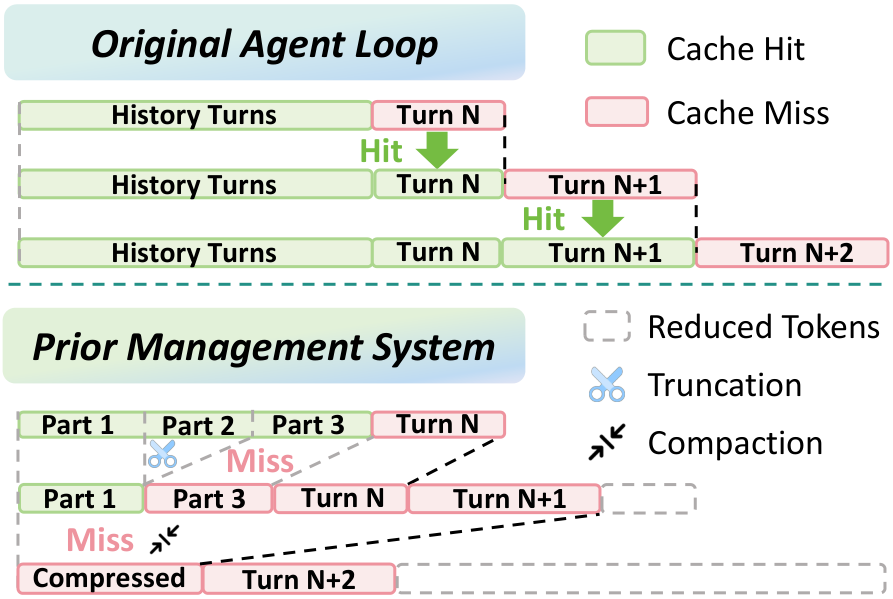

*Figure 1: 缓存对齐行为对比。Original Agent Loop 保持连续布局以累积缓存命中（Turn N/N+1/N+2 全部命中）；而 Prior Management System 执行截断或压缩会突变输入边界，把 Part 1/Part 2/Part 3 的物理顺序打乱或删除，导致 Turn N+1 起出现严重 KV cache 未命中（红色 Miss）。这张图是全文的核心动机——文本压缩节省的 token，被硬件 pre-fill 惩罚和缓存失效抵消殆尽。*

正如 Figure 1 所示，激进的截断或页面置换虽然降低了单轮 token 计数，但这种持续的布局突变击碎了 prompt prefix 的连续性，导致硬件 pre-fill 惩罚和缓存失效，最终覆盖了文本压缩带来的财务节省。论文认为，有效的框架必须在**文本级稀疏性**与**硬件缓存对齐**之间取得根本性协调。

### 1.3 研究目标

设计一个双粒度上下文管理框架，**同时**：
1. **全局层**：在 ingestion 边界稳定 prompt prefix，消除开放世界环境噪声，在初始 warm-up 阶段优化布局而非事后压缩已有缓存；
2. **局部层**：监控执行轨迹的残余效用（residual utility），采用保守的批轮调度，仅在任务相关性彻底失效时才卸载内容段。

核心洞察：部署系统必须**同时**在观察摄入期间保护物理 prefix 连续性，**并**推迟结构性记忆驱逐，直到轨迹的残余效用彻底失效。

---

## 2. 核心贡献

### 2.1 主要贡献

<p align="center"><b>表2：论文主要贡献</b></p>

| 编号 | 贡献描述 |
|-----|---------|
| C1 | 提出 **TokenPilot**——首个将"文本稀疏性"与"prompt cache 连续性"显式协调的双粒度上下文管理框架，揭示了文本压缩与硬件缓存效率之间的关键权衡 |
| C2 | 设计两个互补组件：全局层 **Ingestion-Aware Compaction**（稳定 prefix + 净化摄入）与局部层 **Lifecycle-Aware Eviction**（残余效用感知的保守驱逐），并用形式化效用函数与三态状态机定义其行为 |
| C3 | 在 PinchBench 与 Claw-Eval 两个 benchmark 的 isolated/continuous 双模式下，相对 9 个基线实现 **61%/56%（isolated）与 61%/87%（continuous）** 的成本下降，且保持竞争性任务精度；continuous 模式下 Claw-Eval 成本从 Vanilla 的 \$81.52 砍至 \$10.58 |

### 2.2 创新点

1. **方法创新**：提出"残余效用（residual utility）"概念——一个段在子任务完成后不立即驱逐，而是转入保守的 `completed` 中间态，只要其对后续交互的残余相关性非零就保留物理缓存槽位。这打破了"完成即驱逐"的惯例。
2. **技术创新**：Prefix Stabilization 算子 $\phi$ 通过静态占位符替换易失运行时字段（工作目录、时间戳、会话 ID）+ 工具定义下沉，从第一轮起就锁定 byte-identical prefix，把冷启动转化为暖启动；Recovery Tool + 外部 artifact 注册表 $A[h(m)]$ 保证压缩不丢关键信号。
3. **实验创新**：所有 cache hit/miss token 计数直接取自 provider API 返回的显式元数据字段，消除客户端估算误差；引入 trajectory slicing 机制保证连续模式的评测逻辑与隔离模式数学等价。

---

## 3. 方法详解

### 3.1 方法概述

TokenPilot 是一个**双粒度**上下文管理框架，在两个互补的操作层级上回应上下文优化目标：

- **全局框架层（Global）—— Ingestion-Aware Compaction（§3.2）**：作为摄入边界的确定性 harness，标准化布局、净化摄入消息，在初始缓存预热阶段优化序列。
- **局部序列层（Local）—— Lifecycle-Aware Eviction（§3.3）**：动态监控活动轨迹的残余效用，强制保守的批轮调度，仅在段的任务级效用彻底失效时才清除。

### 3.2 整体架构

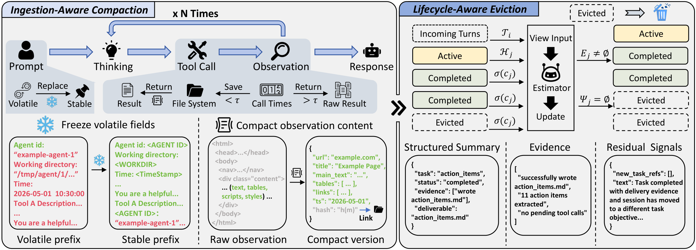

*Figure 2: TokenPilot 系统架构。图分上下两半：上半部分是全局层的 Ingestion-Aware Compaction，左侧展示 Prefix Stabilization（用 `<AGENT ID>`、`<WORKDIR>`、`<TimeStamp>` 静态占位符替换易失字段，把工具定义下沉到系统 prompt 末尾）；右侧展示 Observation Reduction（把冗长的 HTML 观察压缩为 `{url, title, main_text, tables, links, ts, hash}` 结构化预览，原始结果存入外部 artifact 注册表）。下半部分是局部层的 Lifecycle-Aware Eviction，展示段的三态状态机 active → completed → evictable，由一个基于 Qwen3.5-35B-A3B 的 Estimator 在稳定批窗口内读取压缩历史视图 $V_i$、产出 $\Delta R_i = \langle E_j, \Psi_j \rangle$（完成证据 + 残余效用信号），并附有一个四任务 transcript.md 的 case study。*

**架构文字描述**：

TokenPilot 架构包含两个层级、共四个核心模块：

- **全局层 · 模块① — Prefix Stabilization（前缀稳定化，算子 $\phi$）**：拦截 $\Omega_{\text{int}}$（内部意图消息：任务 prompt、思考轨迹、工具调用、最终响应）中的易失运行时字段（工作目录路径、活跃时间戳、会话 ID），用静态占位符替换；并把工具定义/模式从主系统 prompt 下沉到末尾，紧邻动态上下文块。这保证跨任务 prefix 字节一致，直接消除全量 pre-fill 惩罚。

- **全局层 · 模块② — Observation Reduction（观察压缩，算子 $\kappa$）**：对 $\Omega_{\text{env}}$（开放世界环境反馈，天然充满结构噪声）中 ingestion gate $G(m)=0$ 的消息，在摄入闸口执行确定性压缩——HTML slimming、执行输出截断、去重、格式清洗，输出结构化预览存入工作记忆，原始 payload 存入按内容哈希 $h(m)$ 索引的外部 artifact 注册表 $A[h(m)]$。若压缩消息在执行中缺乏关键信号，Agent harness 调用轻量级 recovery tool 动态回取完整 payload。

- **局部层 · 模块③ — Lifecycle State Estimation（生命周期状态估计，估计器 $E$）**：基于 Qwen3.5-35B-A3B 的零样本验证器，在稳定批 $B$ 轮（而非每步）触发，摄入压缩历史视图 $V_i$，产出状态更新 $\Delta R^{(j)}_i = \langle E_j, \Psi_j \rangle$，其中 $E_j$ 是子任务达成目标的显式完成证据，$\Psi_j$ 是从依赖模式提取的残余效用信号。全流程成本极低（continuous PinchBench 全程 < \$0.03）。

- **局部层 · 模块④ — Gated Eviction Pipeline（门控驱逐管线）**：在框架注册表 $R$ 中维护每个段 $c_j$ 的三态状态 $s_j \in \{\text{active}, \text{completed}, \text{evictable}\}$，强制门控管线 `active --(E_j≠∅)--> completed --(Ψ_j=∅)--> evictable`，注册表对迁移做严格校验，仅对有效迁移更新 $R_i \leftarrow R_{i-1} \oplus \Delta R_i$。一旦降至 evictable，执行单遍结构清除构造优化上下文 $C' = \{m \in C \mid s_{j(m)} \neq \text{evictable}\}$。

**关键设计决策**：
1. **全局-局部解耦**：全局层在"摄入边界"确定性工作（不依赖模型判断），局部层用模型估计但只在批边界触发——把昂贵的判断频次压到最低。
2. **三态而非二态**：`completed` 作为缓冲态，保留物理缓存槽位直到残余效用归零，是论文区别于"完成即驱逐"的核心。
3. **Recovery Tool 闭环**：压缩不是单向损失——recovery tool 让"压缩-回取"形成闭环，缺信号时升级状态禁用后续截断，打破"压缩→补偿性重试→上下文膨胀"的通胀循环。

### 3.3 核心算法/模型

#### 3.3.1 消息空间划分与边际效用

TokenPilot 基于 Agent 交互循环把消息空间划分为两类，并定义边际效用密度：

$$\hat{U}(m) = \begin{cases} 1 & m \in \Omega_{\text{int}} \\ \max(\gamma(m),\ G(m)) & m \in \Omega_{\text{env}} \end{cases}$$

其中 $\gamma(m) \leq 1$ 是基础环境反馈效用密度，$G(m) = \mathbb{1}[f(h(m)) > \tau]$ 是 ingestion gate——当内容哈希 $h(m)$ 的访问频率 $f$ 超过阈值 $\tau$ 时 $G(m)$ 翻转为 1，把密度升级为 1 以恢复完整内容交付（防止高频被引用的内容被过度压缩）。

#### 3.3.2 全局层：Ingestion-Aware Compaction

**Prefix Stabilization 算子 $\phi$**：

$$\phi(m^{(t)}) = \phi(m^{(t+1)}) \implies C'_{\text{prefix}} \subseteq C'_{\text{hit}}$$

$\phi$ 在 harness 层拦截内部消息，用静态占位符替换易失运行时标记，保证物理连续性跨任务保持，直接消除全量 pre-fill 惩罚。

**Observation Reduction 与 fallback 环**：

$$m_{\text{ingest}} = \kappa(m), \quad A[h(m)] \leftarrow m$$

$\kappa(m)$ 是存入工作记忆的压缩结构预览，$A$ 是按内容哈希索引的外部 artifact 注册表以保证总操作安全。若压缩消息在执行中缺关键信号，harness 调用 recovery tool 动态回取完整 payload $A[h(m)]$，并自动升级状态以禁用该路径的后续截断。

#### 3.3.3 局部层：Lifecycle-Aware Eviction

段 $c_j$ 的三态状态 $s_j \in \{\text{active}, \text{completed}, \text{evictable}\}$ 维护在框架注册表 $R$ 中，边际效用：

$$\hat{U}(c_j) = \begin{cases} 1 & s_j = \text{active} \\ \mathbb{1}[\Psi_j \neq \emptyset] & s_j = \text{completed} \\ 0 & s_j = \text{evictable} \end{cases}$$

其中 $\Psi_j$ 是段的量化残余效用。**关键设计**：执行路径已结束的段不立即截断，而是转入保守的 `completed` 态，只要其对后续交互的残余相关性非零（$\Psi_j \neq \emptyset$）就保留物理缓存槽位。

**状态估计与执行**：为抑制伪状态迁移，在线 model-based 估计器 $E$ 在稳定批 $B$ 轮内保守触发。对第 $i$ 批，估计器摄入压缩历史视图 $V_i$ 计算状态更新：

$$\Delta R^{(j)}_i = \langle E_j, \Psi_j \rangle = E(V_i, R_{i-1})$$

**门控迁移管线**（公式 8）：

$$\text{active} \xrightarrow{E_j \neq \emptyset} \text{completed} \xrightarrow{\Psi_j = \emptyset} \text{evictable}$$

注册表执行严格系统校验，仅对有效迁移以 $R_i \leftarrow R_{i-1} \oplus \Delta R_i$ 更新。一旦段降至 evictable，其效用衰减为零，框架执行**单遍**结构清除构造优化上下文窗口：

$$C' = \{m \in C \mid s_{j(m)} \neq \text{evictable}\}$$

其中 $j(m)$ 把消息 $m$ 映射到其段索引。这种批门控执行保证驱逐保持高度克制，通过消除易失文本突变最大化缓存连续性。

估计器 $E$ 用 **Qwen3.5-35B-A3B** 实例化为轻量级零样本验证器，开销可忽略——例如 continuous PinchBench 流上总运营成本 < \$0.03。

#### 3.3.4 算法逐步解读

<p align="center"><b>表3：TokenPilot 运行时算法步骤解读</b></p>

| 步骤 | 操作 | 输入 | 输出 | 设计意图 |
|-----|-----|-----|-----|---------|
| Step 1 | Prefix Stabilization（$\phi$） | 系统提示中的易失字段（路径/时间戳/会话ID）+ 工具定义 | 字节一致的 prompt prefix + 下沉的工具定义 | 把冷启动转暖启动，跨任务累积缓存命中 |
| Step 2 | Observation Reduction（$\kappa$） | 工具调用返回的环境反馈 $m \in \Omega_{\text{env}}$ | 结构化预览 $\kappa(m)$ + 外部 artifact $A[h(m)]$ | 在摄入闸口剥离结构噪声，token 节省跨多轮复合 |
| Step 3 | Recovery Tool（条件触发） | 执行中检测到关键信号缺失 | 完整 payload $A[h(m)]$ + 状态升级禁用后续截断 | 打破"压缩→补偿重试→膨胀"通胀循环 |
| Step 4 | State Estimation（每 $B$ 轮） | 压缩历史视图 $V_i$ + 旧注册表 $R_{i-1}$ | 状态增量 $\Delta R_i = \langle E_j, \Psi_j \rangle$ | 保守批触发抑制伪迁移，避免逐轮内存页置换 |
| Step 5 | Gated Eviction（门控迁移） | 段状态 + 完成证据 + 残余效用 | active→completed→evictable 的有效迁移 | 三态缓冲保留物理缓存槽位直到残余效用归零 |
| Step 6 | Single-Pass Purge | 迁移到 evictable 的段 | 优化上下文 $C'$ | 单遍结构清除，最大化缓存连续性 |

### 3.4 关键模块详解

#### 模块A: Prefix Stabilization（前缀稳定化）

- **功能**：在每次推理调用前标准化与重构输入布局，保证 prompt prefix 跨连续轮次字节一致。
- **输入/输出**：输入含易失字段的系统 prompt → 输出静态占位符化 + 工具定义下沉的稳定 prompt。
- **核心机制**：
  1. 运行时易失文本字段（工作目录路径、活跃时间戳、会话 ID）替换为静态稳定占位符 `<AGENT ID>`、`<WORKDIR>`、`<TimeStamp>`；
  2. 工具定义与 schema 从主系统 prompt 末尾紧邻动态上下文块处放置，避免不同任务配置引入的结构变异破坏基线 prefix 匹配。
- **与论文其他部分的关系**：是 Ingestion-Aware Compaction 的两大支柱之一，直接影响 $C'_{\text{prefix}} \subseteq C'_{\text{hit}}$，把全量 pre-fill 转为缓存命中。

#### 模块B: Observation Reduction（观察压缩）

- **功能**：在工具结果消息进入 canonical history 之前，执行基于规则的压缩 pass，抑制文本冗余、调节每轮输入量。
- **输入/输出**：低效用工具结果消息 $m \in \Omega_{\text{env}}$ → 压缩预览 $\kappa(m)$ + 外部 artifact $A[h(m)]$。
- **核心 pass**（详见附录 A.4）：
  - **去重**：哈希对重复工具调用结果去重；
  - **参数截断**：超大工具调用参数截断；
  - **执行输出截断**：长执行输出按工具特定阈值截断（bash/shell/powershell=30k, grep/rg=20k, mcp_auth=10k, glob/write/edit=100k, read/file_read=Infinity，全局=50k），截断后保留 600 字符前缀 + 400 字符后缀作为预览块；
  - **HTML slimming**：移除非必要 markup 与属性；
  - **图像降采样**：bitmap ≤100KB，SVG ≤50KB；
  - **格式清洗**：移除 code fence、非法格式符号、行号前缀，归一化连续空白；
  - **路径截断**：文件路径标记裁剪至 ≤80 字符。
- **与论文其他部分的关系**：与 Recovery Tool 形成 fallback 闭环，是 ingestion gate $G(m)=0$ 时的实际压缩动作。

#### 模块C: Lifecycle-Aware Eviction（生命周期感知驱逐）

- **功能**：基于段的任务效用动态调节历史保留窗口。
- **输入/输出**：执行轨迹段 $c_j$ + 在线估计 → 三态状态 + 条件清除。
- **核心机制**：三态状态机 `active → completed → evictable`，`completed` 作为缓冲态保留物理缓存槽位直到 $\Psi_j = \emptyset$；批门控执行保证驱逐高度克制。
- **与论文其他部分的关系**：对应公式 6-9，是局部层核心，与全局层互补——全局层在摄入边界工作，局部层在序列内部按残余效用工作。

### 3.5 关键技术

<p align="center"><b>表4：TokenPilot 关键技术点</b></p>

| 技术点 | 描述 | 作用 | 论文对应位置 |
|-------|-----|-----|------------|
| 消息空间二分 $\Omega_{\text{int}}/\Omega_{\text{env}}$ | 内部意图消息 vs 开放世界环境反馈 | 区分高内禀效用与高结构噪声，差异化处理 | §3.2 公式3 |
| Ingestion Gate $G(m)$ | 内容哈希访问频率超阈值 $\tau$ 时升级密度 | 防止高频被引用内容被过度压缩 | §3.2 公式3 |
| Prefix Stabilization $\phi$ | 静态占位符 + 工具定义下沉 | 跨任务字节一致 prefix，冷启动转暖启动 | §3.2 公式4 |
| Observation Reduction $\kappa$ | 确定性规则压缩 + artifact 注册表 | 摄入闸口剥离噪声，token 节省跨轮复合 | §3.2 公式5 |
| Recovery Tool | 按需回取完整 payload + 状态升级 | 打破补偿性重试通胀循环 | §3.2 |
| 三态状态机 | active/completed/evictable + 缓冲态 | 保留物理缓存槽位直到残余效用归零 | §3.3 公式6 |
| 批门控估计 | 每 $B$ 轮触发而非每步 | 抑制伪迁移，降低判断开销 | §3.3 公式7 |
| 单遍结构清除 | $C'=\{m \mid s_{j(m)} \neq \text{evictable}\}$ | 最大化缓存连续性 | §3.3 公式9 |
| Trajectory Slicing | 连续会话按原始任务边界切分评测 | 保证连续/隔离模式评测数学等价 | §A.2 |

### 3.6 方法设计的关键洞察

1. **洞察1：文本压缩与硬件缓存效率是权衡而非协同**。现有方法把"减 token"等同于"省钱"，但 KV prompt cache 的命中依赖物理 prefix 连续性——截断/页面置换突变布局，pre-fill 惩罚与缓存失效覆盖了压缩节省。TokenPilot 因此在 ingestion 边界稳定布局（而非事后压缩已有缓存），在序列内部保守驱逐（而非频繁换页）。

2. **洞察2：残余效用应被显式建模为缓冲态**。子任务完成 ≠ 段可驱逐——跨任务常复用同一文档/中间结果（如 case study 中的 transcript.md）。`completed` 缓冲态保留物理缓存槽位直到残余效用归零，使后续任务能直接定位目标内容块而非重新探索。

3. **洞察3：压缩需要 recovery 闭环才安全**。无 recovery tool 的硬截断会让 Agent 执行补偿性重试，追加新工具反馈压垮规则压缩，形成通胀循环。Recovery tool 提供按需 payload 访问，在保留任务有效性的同时阻止失控的上下文增长。

### 3.7 与现有方法的核心区别

<p align="center"><b>表5：TokenPilot 与现有方法对比</b></p>

| 环节 | 现有方法做法 | 本文做法 | 改变原因 |
|-----|------------|---------|---------|
| 布局稳定 | 不处理或事后压缩已有缓存 | 摄入边界用占位符+下沉工具定义稳定 prefix | 从首轮起锁定 prefix 连续性，避免 pre-fill 惩罚 |
| 观察处理 | 传入完整环境反馈 | ingestion gate + 规则压缩 + artifact 注册表 | 在摄入闸口剥离结构噪声，token 节省跨轮复合 |
| 信号丢失 | 硬截断无补救 | recovery tool 按需回取 + 状态升级 | 打破补偿性重试的通胀循环 |
| 段驱逐 | 完成即驱逐 / 频繁换页 | 三态缓冲 + 残余效用门控 + 批触发 | 保留物理缓存槽位直到残余效用归零 |
| 估计频次 | 每步触发 | 每 $B$ 轮批触发 | 抑制伪迁移、降判断开销 |
| 评测保真 | 客户端估算 cache | 直接取 provider API 元数据 | 消除估算误差 |

---

## 4. 代码实现分析

### 4.1 代码仓库概述

<p align="center"><b>表6：代码仓库信息</b></p>

| 项目 | 内容 |
|-----|------|
| 仓库地址 | https://github.com/zjunlp/LightMem2 |
| 主要语言 | TypeScript 41.7% / Python 50.4%（Python 占比含 experiments 脚本；核心 TokenPilot 运行时为 TypeScript） / Shell 5.9% / JavaScript 2.0% |
| 代码行数 | 仓库整体较大（含多 host adapter 与完整测试套件）；TokenPilot 组件核心 packages+adapters 约 2 万+ 行 TS |
| 开源时间 | 2026-06-16（TokenPilot 论文发布同步） |
| 依赖管理 | pnpm workspace（monorepo）+ pyproject（实验侧） |
| License | MIT |
| 测试覆盖 | 各 adapter 均有 `tests/`（cli-bridge、doctor、e2e、reduction、stable-prefix、session-state 等） |

### 4.2 目录结构

```text
LightMem2/
├── components/tokenpilot/          # TokenPilot 组件主体
│   ├── adapters/                   # 各 host 适配器
│   │   ├── openclaw/               # 生产级 OpenClaw 适配器（功能最全）
│   │   ├── codex/                  # Codex CLI 适配器（hook + 本地 proxy）
│   │   ├── claude-code/            # Claude Code 适配器（gateway + MCP recovery）
│   │   └── shared/                 # 跨 host 共享安装/诊断逻辑
│   ├── packages/                   # 可复用共享逻辑
│   │   ├── host-adapter/           # host 契约、路径/状态接口、pipeline、state
│   │   ├── runtime-core/           # host 无关运行时引擎 + reduction pipeline + archive-recovery
│   │   ├── kernel/                 # 共享契约、events、segments、runtime-facing types
│   │   ├── product-surface/        # 面向用户的命令动作（runtime-eviction/mode/reduction/...）
│   │   └── layers/
│   │       ├── history/            # canonical 状态、锚点、生命周期簿记、驱逐
│   │       ├── decision/           # reduction 与 eviction 分析/策略逻辑 + task-state-estimator
│   │       └── memory/             # 实验性程序记忆层（开发中）
│   └── products/
│       ├── cli/                    # 独立 lightmem2 CLI
│       └── mcp/                    # memory_fault_recover MCP server
├── experiments/tokenpilot/         # benchmark 复现脚本
│   ├── pinchbench/
│   └── claw-eval/
├── docs/                           # adapter playbook、smoke 脚本
├── figs/                           # 论文图片（stabilizer/reduction/eviction.png + LightMem2.png）
├── README.md / package.json / pnpm-workspace.yaml
```

### 4.3 系统架构图

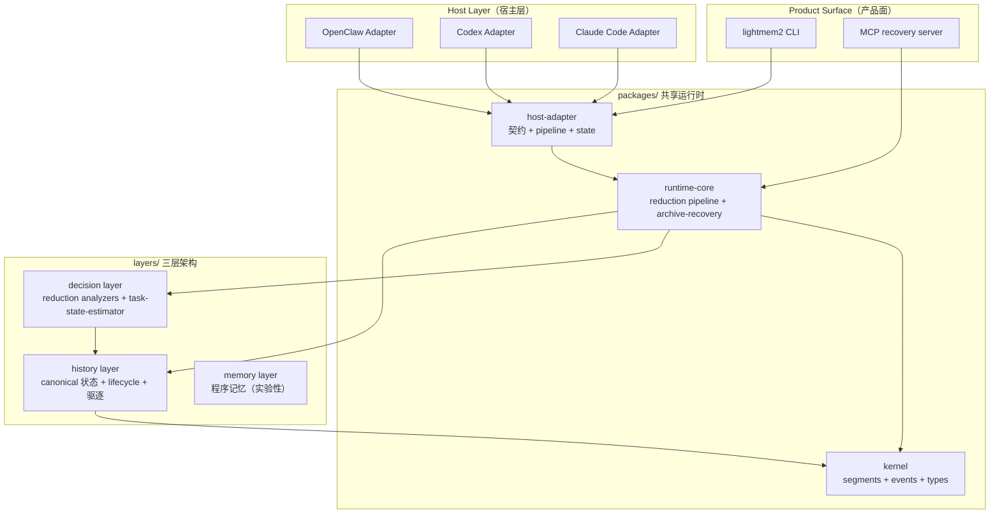

*系统架构图。展示 LightMem2 monorepo 的分层：最上层是三个 host adapter（OpenClaw/Codex/Claude Code），它们都依赖 host-adapter 包的共享契约；中间是 runtime-core 运行时引擎与 kernel 基础类型；最核心的是 layers 三层架构——decision 层做分析与策略（含 Qwen 估计器），history 层管 canonical 状态与生命周期驱逐，memory 层是实验性程序记忆。关键设计决策是把 host 逻辑与可复用逻辑彻底分离（adapters vs packages），任何新 host 只需实现 host-adapter 契约即可接入。MCP server 与 archive-recovery 直接对应论文的 Recovery Tool 与外部 artifact 注册表 $A[h(m)]$。*

### 4.4 模块依赖关系图

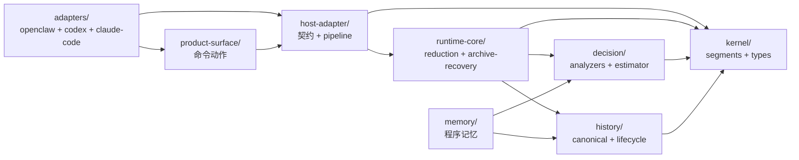

*模块依赖关系图。kernel 是被所有模块依赖的核心枢纽（提供 segments、events、types 等基础契约）；history 与 decision 是两个业务核心层，memory 实验性依赖二者；runtime-core 编排 decision 与 history；adapters 与 product-surface 只依赖 host-adapter，不直接触碰底层 layers——这保证了 host 逻辑与算法逻辑的隔离。无循环依赖，模块组织清晰。*

### 4.5 核心流程图

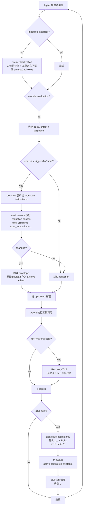

*核心流程图。展示一次 Agent 推理调用在 TokenPilot 中的完整路径：前置的 Prefix Stabilization（对应公式4）→ Observation Reduction（对应公式5，含 trigger 门槛与 archive 存储）→ upstream 推理→ 条件触发的 Recovery Tool（打破通胀循环）→ 每 B 轮触发的 task-state-estimator E（对应公式7）→ 门控迁移与单遍清除（对应公式8-9）→ 回到下一轮。关键决策点用菱形标出：stabilizer/reduction 的 module 开关、triggerMinChars 门槛、是否产生 changed、是否缺信号、是否累计 B 轮。两个反馈闭环值得注意：recovery tool 的"压缩-回取"闭环与 lifecycle 的"批估计-清除"闭环。*

### 4.6 核心数据结构关系图

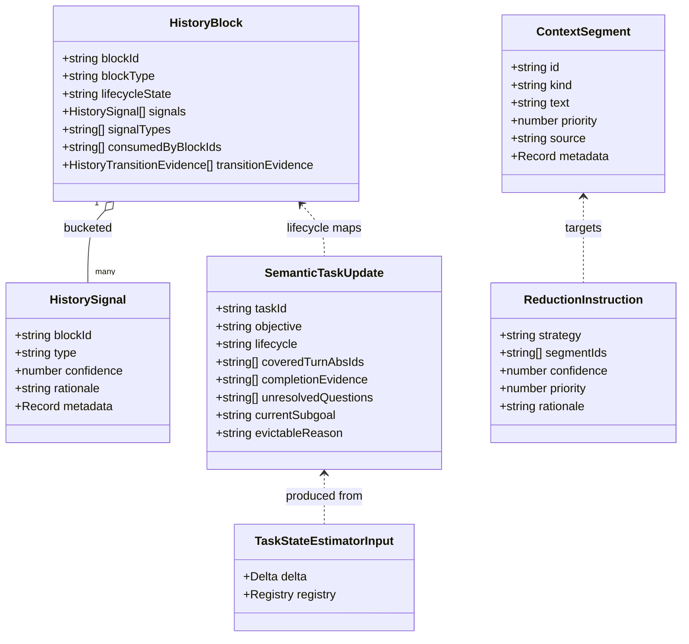

*数据结构关系图。ContextSegment 是 reduction 管线的操作单元（被 ReductionInstruction 锁定为目标）；HistoryBlock 是 lifecycle 状态机的载体，聚合多个 HistorySignal 并记录迁移证据；SemanticTaskUpdate 是 task-state-estimator 的输出（对应论文三态 lifecycle: active/blocked/completed/evictable）。注意 ContextSegment 与 HistoryBlock 的 lifecycle 字段使用代码中的 COMPACTED/COMPACTABLE/EVICTABLE 与 EVICTABLE 命名，与论文的 active/completed/evictable 是同义映射——前者偏实现（"可压缩/已压缩"），后者偏模型语义（"活跃/完成/可驱逐"）。*

### 4.7 核心数据结构

**ContextSegment**（`kernel/src/segments.ts`，reduction 管线操作单元）：
```typescript
// 论文公式5中 m 的代码载体；reduction pass 对其 .text 做变换
{
  id: "input-0-output",
  kind: "volatile",              // 工具结果=volatile，其他=semi_stable
  text: item.output,             // 被压缩的目标文本
  priority: 30,                  // 工具类=30，非工具类=60
  source: "responses.input.output",
  metadata: {
    role: "tool",
    isToolPayload: true,
    payloadKind: "stdout",       // stdout/stderr/json/blob
    toolPayload: { enabled: true, kind, toolName, fieldName, path },
    reduction: { target: "tool_payload", toolPayloadTrim: { enabled: true, kind } }
  }
}
```

**HistoryBlock**（`layers/history/src/types.ts`，lifecycle 状态机载体）：
```typescript
// 论文公式6中 c_j 的代码载体；lifecycleState 对应论文 s_j
{
  blockId: string,
  blockType: "summary_seed" | "pointer_stub" | ...,
  lifecycleState: "COMPACTED" | "COMPACTABLE" | "EVICTABLE",  // 映射论文 active/completed/evictable
  signals: HistorySignal[],          // 来自分析器，对应 Ψ_j 残余效用信号
  signalTypes: string[],             // 如 READ_CONSUMED_BY_WRITE, REPEATED_READ, FAILED_TOOL_PATH, RECENT_BLOCK
  consumedByBlockIds: string[],
  transitionEvidence: HistoryTransitionEvidence[]  // fromState→toState + reason，对应公式8门控迁移
}
```

**SemanticTaskUpdate**（`layers/decision/src/types.ts`，estimator 输出，对应论文 $\Delta R_i$）：
```typescript
// 论文公式7 ΔR^(j)_i = <E_j, Ψ_j> 的代码载体
{
  taskId: string,                    // 稳定 ID，派生自首覆盖轮 <firstTurnAbsId>-task
  title?: string,
  objective: string,
  lifecycle: "active" | "blocked" | "completed" | "evictable",  // 三态+blocked
  coveredTurnAbsIds?: string[],      // 任务拥有的轮次
  completionEvidence?: string[],     // 对应 E_j（显式完成证据）
  unresolvedQuestions?: string[],    // 阻止迁移到 evictable 的条件
  currentSubgoal?: string,
  evictableReason?: string           // 迁移到 evictable 时的一句话理由
}
```

### 4.8 核心算法实现

**Prefix Stabilization（`adapters/codex/src/stable-prefix.ts`，对应公式4算子 $\phi$）**：

```typescript
export function prepareCodexStablePrefix(envelope, config) {
  if (!config.modules.stabilizer || config.proxyMode.pureForward) return envelope;
  // 1. 找到 system/developer 角色 prompt 候选
  const candidate = findRootPromptCandidate(envelope.messages);
  // 2. 用 rewriteTextForStablePrefix 把易失字段替换为静态占位符，分离出 canonicalText 与 dynamicContextText
  const rootRewrite = candidate ? rewriteTextForStablePrefix(candidate.text) : null;
  // 3. 把 dynamicContextText 作为独立 developer 消息插入（对应"工具定义下沉"）
  rewrittenEnvelope = applyStablePrefixToMessage({ envelope, messageIndex, dynamicContextTarget, ... });
  if (target === "developer" && dynamicContextText)
    rewrittenEnvelope = insertDeveloperDynamicContextMessage({ ... });
  // 4. 计算确定性 promptCacheKey（SHA256(model+stableTexts)），设 24h retention
  const stablePromptParts = [instructionRewrite?.canonicalText, rootRewrite?.canonicalText];
  nextMetadata.promptCacheKey = computeStablePromptCacheKey(envelope.model, stablePromptParts);
  nextMetadata.promptCacheRetention = "24h";
  return { ...rewrittenEnvelope, metadata: nextMetadata };
}
```

这段代码精确对应论文 §3.2 的 Prefix Stabilization：`rewriteTextForStablePrefix` = 占位符替换算子 $\phi$；`insertDeveloperDynamicContextMessage` = 工具定义下沉到末尾紧邻动态上下文块；`computeStablePromptCacheKey`（基于 `sha256(model+stableTexts)`）保证跨任务 key 一致 → 命中 $\phi(m^{(t)})=\phi(m^{(t+1)}) \implies C'_{\text{prefix}} \subseteq C'_{\text{hit}}$。

**Observation Reduction（`adapters/codex/src/reduction.ts`，对应公式5算子 $\kappa$）**：

```typescript
// 工具特定截断阈值（与附录A.4完全一致）
function thresholdForTool(toolName, config) {
  if (normalized === "bash" || "shell" || "powershell") return 30_000;
  if (normalized === "grep" || "rg") return 20_000;
  if (normalized === "read" || "file_read") return Infinity;  // 不截断
  if (normalized === "mcp_auth") return 10_000;
  return 50_000;  // 全局默认
}

export async function applyBeforeCallReductionToPayload({ payload, sessionId, config }) {
  // 1. 构建 TurnContext + segments（把 input items 转为 ContextSegment[]）
  const built = buildTurnContext(payload, sessionId, { disclosedReadPaths });
  // 2. decision 层产出 reduction instructions（analyzer + fallback 两路）
  const analyzerInstructions = buildAnalyzerReductionInstructions(built.turnCtx.segments, config);
  const fallbackInstructions = buildCodexFallbackReductionInstructions(built.turnCtx.segments, config);
  const localInstructions = dedupeReductionInstructions([...analyzerInstructions, ...fallbackInstructions]);
  // 3. 低于 trigger 门槛（默认 2200 chars）则跳过
  if (totalChars < config.reduction.triggerMinChars) return { skippedReason: "below_trigger_min_chars" };
  // 4. resolveReductionPasses + runReductionBeforeCall 执行各 pass
  const passes = resolveReductionPasses({ maxToolChars, passOptions }).filter(p => p.phase === "before_call" && enabled.has(p.id));
  const { turnCtx: reducedCtx, report } = await runReductionBeforeCall({ turnCtx, passes });
  // 5. 回写到 payload.input 的 output/arguments/content 字段
  for (const binding of bindings) { ... item.output = segment.text; ... }
}
```

工具阈值表（bash=30k/grep=20k/read=∞/mcp_auth=10k/default=50k）与论文附录 A.4 逐项吻合；`triggerMinChars=2200`、`maxToolChars=1200` 也与附录 A.4 一致。`runReductionBeforeCall` 调度 `runtime-core/src/passes/` 下的 `pass-html-slimming`、`pass-exec-output-truncation`、`pass-format-cleaning` 等独立 pass。

**Lifecycle 状态机（`layers/history/src/lifecycle.ts`，对应公式6-8）**：

```typescript
const COMPACTABLE_SIGNALS = new Set(["READ_CONSUMED_BY_WRITE", "REPEATED_READ", "FAILED_TOOL_PATH"]);

export function deriveHistoryLifecycle(blocks, signals, config) {
  const nextBlocks = blocks.map(block => {
    const attachedSignals = blockSignals.get(block.blockId) ?? [];
    if (block.blockType === "summary_seed" || block.blockType === "pointer_stub") {
      // 预压缩块：仍在 recent 窗口→COMPACTED，否则→EVICTABLE
      lifecycleState = signalTypes.includes("RECENT_BLOCK") ? "COMPACTED" : "EVICTABLE";
    } else {
      // 普通块：有高置信度可压缩信号→COMPACTABLE（对应 completed 缓冲态）
      const compactableSignals = attachedSignals.filter(s => COMPACTABLE_SIGNALS.has(s.type) && s.confidence >= minConfidence);
      if (compactableSignals.length > 0) { lifecycleState = "COMPACTABLE"; ... }
    }
    block.transitionEvidence = transition(fromState, lifecycleState, reason, attachedSignals);  // 公式8门控迁移
  });
}
```

`COMPACTABLE_SIGNALS`（READ_CONSUMED_BY_WRITE/REPEATED_READ/FAILED_TOOL_PATH）正是残余效用 $\Psi_j$ 的具体信号源——`READ_CONSUMED_BY_WRITE` 表示一个读已被写消费（残余效用低），`REPEATED_READ` 表示重复读取（可能仍需保留），`FAILED_TOOL_PATH` 表示失败路径（可驱逐）。

**Task-State Estimator（`layers/decision/src/task-state-estimator.ts`，对应公式7 + 图8/9）**：

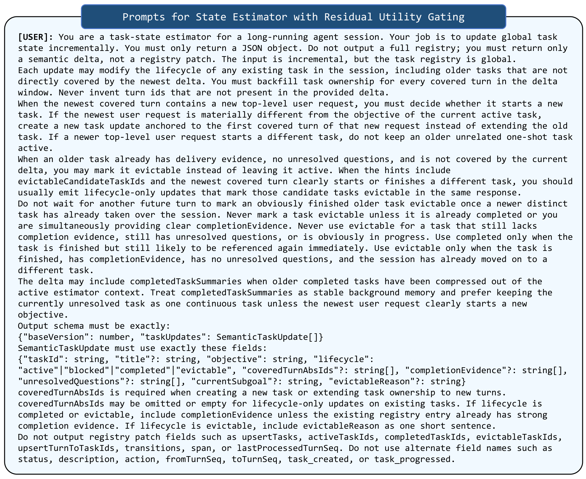

*Figure 8: TokenPilot Primary Estimator 的系统 prompt 模板，联合追踪完成证据与显式缓存驱逐信号。prompt 强制估计器在渲染过期判断前评估进行中的工具依赖与跨轮数据复用模式，引入三态迁移矩阵（在标准 active/completed 之外强制 evictable lifecycle token）。通过验证交付证据与历史依赖，建立文本级缓冲门——仅当估计器显式推断其操作任务相关性彻底失效时，历史上下文段才被标记为缓存清除。*

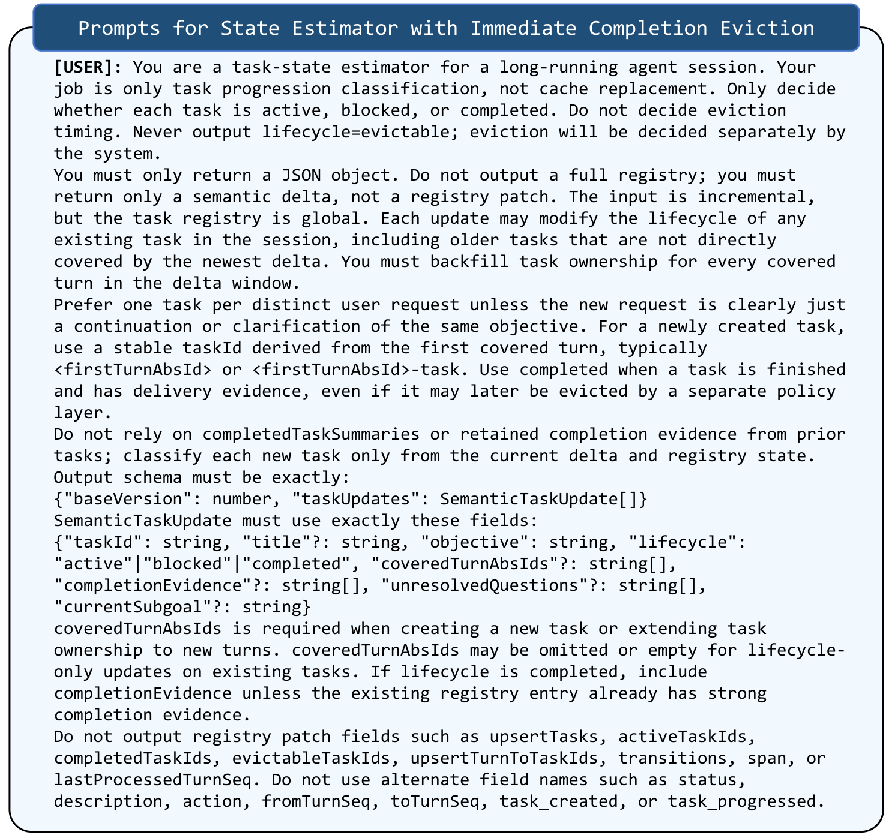

*Figure 9: 消融用 Estimator prompt（剥离残余效用门控）。该 prompt 把模型目标限制为二态任务进展分类，强制 lifecycle 字段仅用 active/completed，禁止输出 evictable，任务一观察到本地交付证据即转 completed，触发硬件后端立即上下文清除。这是评估残余效用推断机制带来精确成本与效率增益的直接基线（对应 §4.5 代码中的 decoupled+two_state 分支）。*

`buildSystemPrompt(config)` 根据 `lifecycleMode`（coupled/decoupled）与 `evidenceMode`（three_state/two_state）动态生成系统 prompt——coupled+three_state 生成图8 prompt（含 evictable 三态 + 残余效用门控），decoupled+two_state 生成图9 prompt（仅 active/blocked/completed，禁用 evictable）。这与论文 §A.4 的"两套 prompt 范式"完全对应，是消融实验（图9）的直接代码载体。`buildDerivedHints` 还会预计算 `evictableCandidateTaskIds`（已完成、有完成证据、无未决问题、距最近任务轮 ≥1 的任务），作为 prompt hint 注入。

### 4.9 配置参数详解

<p align="center"><b>表7：TokenPilot 关键配置参数（与论文附录A.4对照）</b></p>

| 参数 | 默认值 | 说明 | 论文对应 |
|-----|-------|------|---------|
| `modules.stabilizer` | true | 启用前缀稳定化 | §3.2 Prefix Stabilization |
| `modules.reduction` | true | 启用观察压缩 | §3.2 Observation Reduction |
| `modules.eviction` | false（normal 模式） | 启用生命周期驱逐 | §3.3 Lifecycle-Aware Eviction |
| `reduction.triggerMinChars` | 2200（normal） | 触发压缩的最小字符数 | A.4 Activation Gates triggerMinChars=2200 |
| `reduction.maxToolChars` | 1200（normal） | 工具 payload 裁剪目标最大字符 | A.4 maxToolChars=1200 |
| `reduction.passes.execOutputTruncation` | true | 执行输出截断 pass | A.4 工具阈值表 |
| `reduction.passes.htmlSlimming` | true | HTML slimming pass | A.4 html_slimming |
| `reduction.passOptions.execOutputTruncation.toolThresholds` | bash=30k,grep=20k,read=∞,mcp_auth=10k,default=50k | 工具特定阈值 | A.4 工具特定 profiles |
| `eviction.policy` | noop（默认）/ model_scored | 驱逐策略 | §3.3 估计器 E |
| `eviction.maxCandidateBlocks` | 128 | 驱逐候选上限 | - |
| `eviction.minBlockChars` | 256 | 可驱逐的最小块字符数 | - |
| `eviction.replacementMode` | pointer_stub | 驱逐后替换方式 | 公式9 单遍清除后的占位 |
| `taskStateEstimator.evictionPromotionHotTailSize` | 1 | 最近完成任务保持热度数 | §3.3 completed 缓冲态 |
| `contextEngine.pruneThresholdChars` | 100000 | canonical 超阈值才裁剪 | - |
| `contextEngine.keepRecentToolResults` | 5 | 保留未裁剪的近期工具结果数 | A.3 Keep-Last-N N=5 |
| 运行时模式 conservative/normal/aggressive | normal | 三档预设组合上述开关 | - |

三档运行时模式的参数映射（来自 `components/tokenpilot/README.md`）：

| 模式 | stabilizer | reduction | eviction | estimator | triggerMinChars | maxToolChars | reduction profile |
|-----|:-:|:-:|:-:|:-:|--:|--:|:--|
| conservative | on | on | off | off | 4000 | 1800 | 仅 repeated-read dedup + tool payload trim + startup opt |
| normal | on | on | off | off | 2200 | 1200 | 全 reduction 默认 |
| aggressive | on | on | on | on | 1400 | 900 | 全 reduction + eviction |

### 4.10 论文-代码对应关系

<p align="center"><b>表8：论文概念与代码实现的对应关系</b></p>

| 论文概念 | 代码实现 | 文件位置 |
|---------|---------|---------|
| 消息空间二分 $\Omega_{\text{int}}/\Omega_{\text{env}}$ | `isToolLikeInputItem` 判定 + `segmentForText` 的 `kind: volatile/semi_stable` | `adapters/codex/src/reduction.ts:189,237` |
| Ingestion Gate $G(m)=\mathbb{1}[f(h(m))>\tau]$ | 频次/哈希去重 pass + `repeated_read_dedup` | `runtime-core/src/passes/` |
| Prefix Stabilization $\phi$（公式4） | `prepareCodexStablePrefix` / `rewriteTextForStablePrefix` / `applyStablePrefixToMessage` | `adapters/codex/src/stable-prefix.ts:88` |
| 确定性 promptCacheKey | `computeStablePromptCacheKey`（SHA256(model+stableTexts)） | `adapters/codex/src/stable-prefix.ts:12` |
| Observation Reduction $\kappa$（公式5） | `applyBeforeCallReductionToPayload` / `runReductionBeforeCall` | `adapters/codex/src/reduction.ts:637` |
| 工具特定截断阈值 | `thresholdForTool` | `adapters/codex/src/reduction.ts:214` |
| 外部 artifact 注册表 $A[h(m)]$ | `runtime-core/src/archive-recovery/`（含 `tool-result-persist.ts`） | `packages/runtime-core/src/archive-recovery/` |
| Recovery Tool | MCP server `memory_fault_recover` + archive-recovery | `products/mcp/` + `runtime-core/src/archive-recovery/` |
| 段三态状态机 $s_j$（公式6） | `HistoryBlock.lifecycleState` COMPACTED/COMPACTABLE/EVICTABLE | `layers/history/src/types.ts` + `lifecycle.ts` |
| 残余效用 $\Psi_j$ | `HistorySignal`（READ_CONSUMED_BY_WRITE/REPEATED_READ/FAILED_TOOL_PATH/RECENT_BLOCK） | `layers/history/src/lifecycle.ts:12` |
| 估计器 $E$（公式7） | `task-state-estimator.ts` + Qwen3.5-35B-A3B | `layers/decision/src/task-state-estimator.ts` |
| 完成证据 $E_j$ | `SemanticTaskUpdate.completionEvidence` | `layers/decision/src/types.ts` |
| 门控迁移管线（公式8） | `deriveHistoryLifecycle` + `transition()` 产出 `transitionEvidence` | `layers/history/src/lifecycle.ts:56` |
| 单遍结构清除 $C'$（公式9） | `eviction.replacementMode: pointer_stub` + canonical-eviction | `layers/history/src/canonical-eviction.ts` |
| 图8 prompt（三态+残余效用） | `buildSystemPrompt` coupled+three_state 分支 | `task-state-estimator.ts:23` |
| 图9 prompt（二态，消融） | `buildSystemPrompt` decoupled+two_state 分支 | `task-state-estimator.ts:23` |
| 批门控 $B$ 轮触发 | `taskStateEstimator` 批调度（论文 B=3） | `layers/decision/src/task-state-estimator.ts` |
| PinchBench/Claw-Eval 复现 | benchmark 脚本 | `experiments/tokenpilot/{pinchbench,claw-eval}/` |

### 4.11 代码质量评估

<p align="center"><b>表9：代码质量评估</b></p>

| 维度 | 评分 | 说明 |
|-----|------|------|
| 模块化 | ⭐⭐⭐⭐⭐ | monorepo + packages/adapters/layers 清晰分层，host 逻辑与算法逻辑彻底分离，kernel 作为共享基础契约 |
| 可配置性 | ⭐⭐⭐⭐⭐ | 三档运行时模式 + 细粒度 pass 开关 + 工具特定阈值表 + estimator 上游 fallback，几乎所有论文参数都暴露为配置 |
| 可扩展性 | ⭐⭐⭐⭐⭐ | 新 host 只需实现 host-adapter 契约（已有 OpenClaw/Codex/Claude Code 三适配器作模板）；reduction pass 各自独立可插拔 |
| 论文-代码一致性 | ⭐⭐⭐⭐⭐ | 工具阈值、triggerMinChars、maxToolChars、三态状态机、两套 estimator prompt 与论文公式/附录/图8图9逐项吻合 |
| 文档 | ⭐⭐⭐⭐ | README 详尽（含配置参考、模式映射表、调试指南），各 adapter 有独立 README；但部分 packages 缺少 API 级文档 |
| 测试 | ⭐⭐⭐⭐ | 各 adapter 有 cli-bridge/doctor/e2e/reduction/stable-prefix/session-state 等测试；CI 配置完整 |
| 可复现性 | ⭐⭐⭐⭐ | experiments/tokenpilot 下有 PinchBench/Claw-Eval 复现入口；但大型 benchmark 数据集存于 Git 外（Google Drive） |

### 4.12 复现指南

```bash
# 1. 环境准备（Node + pnpm + Python 3.11）
git clone https://github.com/zjunlp/LightMem2.git
cd LightMem2
corepack enable
pnpm install
pnpm build
pnpm lightmem2:build
pnpm lightmem2:install

# 2. 安装 host 适配器（任选其一）
pnpm component:install:tokenpilot:openclaw        # OpenClaw
# 或
npm --prefix components/tokenpilot/adapters/codex run build && \
npm --prefix components/tokenpilot/adapters/codex run install:codex   # Codex CLI

# 3. 在 host 中验证
/tokenpilot status       # 查看运行时状态
/tokenpilot report       # 查看效果报告（saved chars / cache hit）
/tokenpilot doctor       # 自检
/tokenpilot mode aggressive   # 切换到 aggressive（启用 eviction + estimator）

# 4. 复现 benchmark
cd experiments/tokenpilot/pinchbench   # 或 claw-eval
# 参考该子目录 README 获取数据集与官方命令
```

---

## 5. 实验分析

### 5.1 实验设置

#### 数据集

<p align="center"><b>表10：实验数据集（论文表6）</b></p>

| 数据集 | 任务数 | 任务类别数 | 来源 | 模式 |
|-------|-------|----------|------|------|
| PinchBench | 123 | 11（Productivity/Research/Writing/Coding/Analysis/CSV Analysis/Log Analysis/Meeting Analysis/Memory/Skills/Integrations） | Kilo AI Team 2026，真实世界 AI coding agent 评测套件（冻结快照） | isolated + continuous |
| Claw-Eval (General) | 161 | 11（Workflow/Ops/Finance/Office QA/Communication/Productivity/Operations/Safety/Terminal/Multimodal/Others） | Ye et al. 2026，容器化沙箱执行 | isolated + continuous |

两个 benchmark 都把同类任务分组成连续不间断的单会话，以忠实模拟真实的连续多任务 Agent 执行轨迹。

#### 评估指标

<p align="center"><b>表11：评估指标</b></p>

| 指标 | 定义 | 计算方式 |
|-----|-----|---------|
| Overall Score | 任务整体质量分 | PinchBench：对输出交付物做任务特定验证检查聚合；Claw-Eval：$S = s_{\text{safe}} \times (0.80 \cdot s_{\text{comp}} + 0.20 \cdot s_{\text{rob}})$（安全为乘性门，完成度+鲁棒性） |
| Input Tokens (Cache Read) | 缓存命中 token 数（百万） | 直接取 provider API 元数据 |
| Input Tokens (Cache Miss) | 缓存未命中 token 数（百万） | 直接取 provider API 元数据 |
| Output Tokens | 生成响应 token 数（百万） | - |
| Cost ($) | 总推理货币成本 | $\text{Cost} = |C'_{\text{hit}}| \cdot p_{\text{hit}} + |C'_{\text{miss}}| \cdot p_{\text{miss}} + H_{\text{out}} \cdot p_{\text{out}}$ |

**成本模型（GPT-5.4-mini 官方定价）**：$p_{\text{hit}} = \$0.075/\text{M}$（缓存命中）、$p_{\text{miss}} = \$0.75/\text{M}$（未命中）、$p_{\text{out}} = \$4.50/\text{M}$（输出）。缓存命中价格仅为未命中的 **1/10**，这是 TokenPilot 专注缓存命中的根本经济动力。

#### 实现细节

- **Agent backbone**：所有方法（含基线）统一用 GPT-5.4-mini；
- **Estimator**：TokenPilot 内部状态估计用 Qwen3.5-35B-A3B（零样本验证器）；
- **批窗口**：$B = 3$（continuous PinchBench 全程 estimator 成本 < \$0.03）；
- **基线**：压缩类（LLMLingua-2、SelectiveContext、Keep-Last-N）+ 动态分页/摘要类（Summary、LCM、Pichay、MemoBrain、AgentSwing、MemOS），共 9 个基线 + Vanilla。

### 5.2 主实验结果

<p align="center"><b>表12：PinchBench 主实验结果（论文表1，isolated + continuous）</b></p>

| 模式 | 方法 | Overall ↑ | Cache Read (M) | Cache Miss (M) | Output (M) | Cost ($) ↓ |
|-----|------|----------|---------------|---------------|-----------|-----------|
| **Isolated** | Vanilla | 80.5 | 6.184 | 8.753 | 0.285 | 8.31 |
| | LLMLingua-2 | 76.9 | 14.241 | 3.975 | 0.384 | 5.78 |
| | Pichay | 78.9 | 6.717 | 3.333 | 0.238 | 4.07 |
| | MemoBrain | 78.1 | 10.200 | 2.107 | 0.233 | 3.36 |
| | **TokenPilot** | **81.0** | 8.893 | **1.933** | 0.244 | **3.22** |
| **Continuous** | Vanilla | 79.2 | 25.015 | 5.943 | 0.202 | 7.24 |
| | MemOS | 80.9 | 30.859 | 8.939 | 0.308 | 10.41 |
| | MemoBrain | 78.0 | 12.917 | 2.283 | 0.232 | 3.73 |
| | **TokenPilot** | **81.3** | 8.551 | **1.549** | 0.219 | **2.79** |

> 完整 9 基线数据见论文 Table 1。TokenPilot 在两种模式下均取得最低成本，且 Overall 分数最高或并列最高。

<p align="center"><b>表13：Claw-Eval 主实验结果（论文表2，isolated + continuous）</b></p>

| 模式 | 方法 | Overall ↑ | Cache Read (M) | Cache Miss (M) | Output (M) | Cost ($) ↓ |
|-----|------|----------|---------------|---------------|-----------|-----------|
| **Isolated** | Vanilla | 64.5 | 9.429 | 4.637 | 0.216 | 5.16 |
| | Keep-Last-N | 61.8 | 4.229 | 1.845 | 0.186 | 2.54 |
| | **TokenPilot** | 63.1 | 4.436 | **1.154** | 0.239 | **2.27** |
| **Continuous** | Vanilla | 63.4 | 709.845 | 21.981 | 2.622 | **81.52** |
| | LLMLingua-2 | 59.0 | 575.654 | 37.197 | 2.630 | 82.91 |
| | LCM | 61.4 | 383.007 | 28.714 | 2.691 | 62.37 |
| | Pichay | 61.0 | 97.431 | 63.510 | 1.046 | 59.65 |
| | **TokenPilot** | 60.8 | 21.430 | **9.928** | 0.338 | **10.58** |

> Claw-Eval continuous 模式是论文最戏剧性的结果：Vanilla 成本飙至 \$81.52，TokenPilot 砍至 \$10.58（**87% 降幅**），且 cache miss token 从 21.98M 降至 9.93M。

**关键观察**：
- **Isolated 模式**：TokenPilot 在 PinchBench（\$3.22，-61%）和 Claw-Eval（\$2.27，-56%）取得最低成本，同时保持竞争性精度。文本压缩类方法降本但伤精度；动态框架保精度但不调节缓存、招致 miss 惩罚。
- **Continuous 模式**：长程文本累积严重放大差距。PinchBench 上 TokenPilot 以 \$2.79 拿到 81.3 分，cache miss 仅 1.549M；Claw-Eval 上无约束历史增长导致 Vanilla 成本飙至 \$81.52，TokenPilot 砍至 \$10.58，展现部署环境下的鲁棒可扩展性。

### 5.3 消融实验

#### 5.3.1 渐进式消融（表3）

<p align="center"><b>表14：TokenPilot 组件渐进式消融（PinchBench continuous，论文表3）</b></p>

| 配置 | Overall | Cost ($) | Hit (M) | Miss (M) | Output (M) |
|-----|---------|----------|---------|----------|-----------|
| Vanilla | 79.2 | 7.24 | 25.015 | 5.943 | 0.202 |
| + Global Level（Ingestion-Aware Compaction） | 79.9 | 4.22 | 26.716 | 1.589 | 0.227 |
| + Local Level（Lifecycle-Aware Eviction） | 81.3 | 2.79 | 8.551 | 1.549 | 0.219 |

**解读**：
- **全局层**把成本从 \$7.24 砍到 \$4.22，cache miss 从 5.943M 骤降到 1.589M（prefix 稳定 + 规则剪枝把 pre-fill 转为缓存命中）；同时 cache read 从 25.015M 升到 26.716M（暖启动累积）。
- **局部层**进一步把成本降到 \$2.79，cache read 从 26.716M 降到 8.551M（**-65.0%**），证明 TokenPilot 紧紧压住活动记忆足迹。

#### 5.3.2 Ingestion-Aware Compaction 组件级分析（表4）

<p align="center"><b>表15：Ingestion-Aware Compaction 组件级分析（PinchBench isolated，论文表4）</b></p>

| 配置 | Overall | Cost ($) | Hit (M) | Miss (M) | Output (M) |
|-----|---------|----------|---------|----------|-----------|
| Vanilla | 80.47 | 8.31 | 6.184 | 8.753 | 0.285 |
| + Cache Stabilization | 80.81 | 4.35 | 12.948 | 2.818 | 0.295 |
| + Reduction Pass | 80.92 | 2.87 | 8.700 | 1.493 | 0.245 |
| - Recovery Tool | 77.12 | 4.03 | 11.780 | 2.539 | 0.276 |

**解读**：
- 仅引入稳定占位符就把成本从 \$8.31 降到 \$4.35（把 cache miss 转为 cache read）；
- 叠加 reduction pass 进一步降到 \$2.87；
- **去掉 Recovery Tool** 触发精度从 80.9 跌到 77.1，成本膨胀到 \$4.03——印证 recovery 机制对维持性能边界的必要性（否则 Agent 执行补偿性重试压垮规则压缩）。

#### 5.3.3 Warm-Start 缓存读取分布（表5）

<p align="center"><b>表16：各任务首次推理调用的 warm-start 缓存读取 token 分布（论文表5）</b></p>

| Cache Read 区间 | PinchBench Vanilla | PinchBench w/ Stable | Claw-Eval Vanilla | Claw-Eval w/ Stable |
|---------------|:-:|:-:|:-:|:-:|
| 0 | 8.1% | 2.44% | 3.7% | 0.0% |
| 2,048 | 91.9% | 0.0% | 0.0% | 0.0% |
| 5,120 | 0.0% | 77.24% | 0.0% | 0.0% |
| 5,888 | 0.0% | 0.0% | 0.0% | 0.6% |
| 6,144 | 0.0% | 0.0% | 0.0% | 59.6% |
| 6,656 | 0.0% | 0.0% | 0.0% | 31.1% |
| 7,168 | 0.0% | 0.0% | 0.0% | 5.0% |
| 12,288 | 0.0% | 6.50% | 0.0% | 0.0% |
| 12,800 | 0.0% | 13.82% | 0.0% | 0.0% |

**解读**：稳定占位符把绝大多数任务从极小的基线 token 分配迁移到大容量 warm start——PinchBench 上 91.9% 任务卡在 2,048 token 的冷启动，启用稳定后 77.24%+13.82% 迁移到 5,120/12,800 的高容量暖启动；Claw-Eval 上 0%→59.6%+31.1% 迁移到 6,144/6,656。这把冷启动转为暖启动，确保连续任务继承累积的 prompt 缓存。

#### 5.3.4 缓存命中率提升（图4）

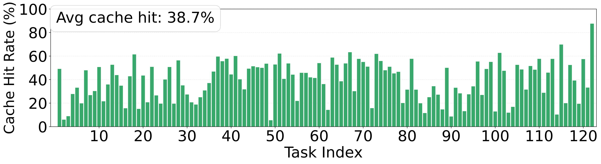

*Figure 4a: PinchBench Vanilla 的逐任务缓存命中率，平均 38.7%。多数任务命中率在 20-60% 间波动，反映易失字段导致的 prefix 失稳。*

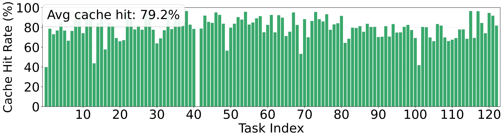

*Figure 4b: PinchBench 启用稳定占位符后的逐任务缓存命中率，平均跃升至 79.2%。绝大多数任务命中率超 70%，证明 prompt 布局标准化的效率。*

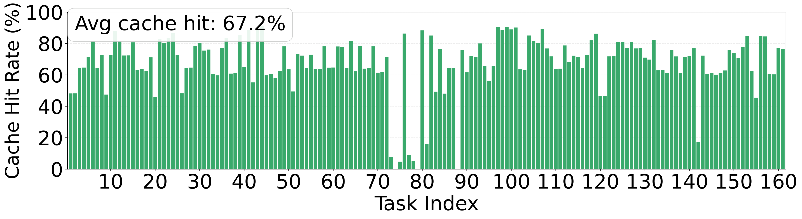

*Figure 4c: Claw-Eval Vanilla 的逐任务缓存命中率，平均 67.2%。Claw-Eval 的 tool-schema jitter 比 PinchBench 更严重，但基线命中率略高。*

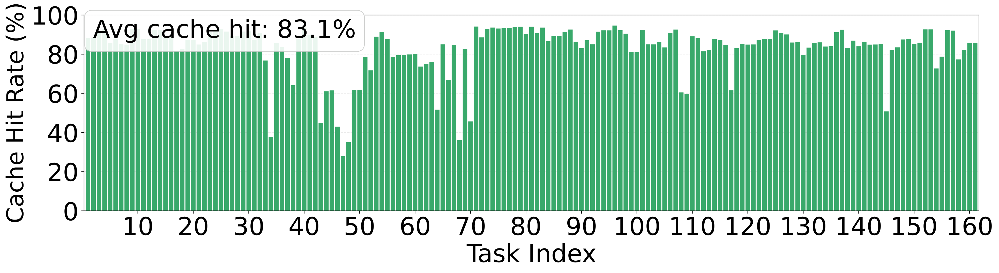

*Figure 4d: Claw-Eval 启用稳定占位符后的逐任务缓存命中率，平均升至 83.1%。tool-schema 下沉解决了工具定义变异导致的 prefix 失稳。*

**解读**：Figure 4 与表5互证——稳定占位符把宏观缓存命中率从 38.7%→79.2%（PinchBench）、67.2%→83.1%（Claw-Eval）。PinchBench 的 prefix 失稳主因是通用易失字段（路径、时间戳），Claw-Eval 则是环境特定的 tool-schema jitter——两种主因都被静态占位符 + 工具定义下沉解决。

#### 5.3.5 逐轮上下文体积（图3）

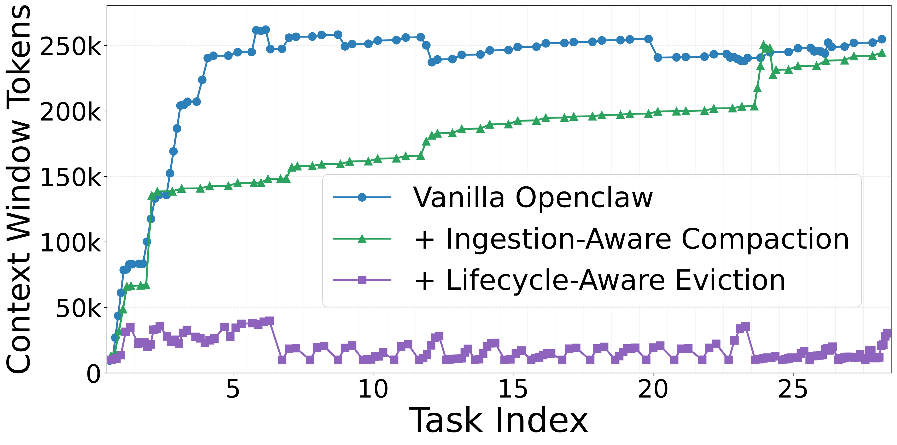

*Figure 3: 一次 continuous Meeting Analysis 会话中每次调用的上下文 token 体积。Vanilla OpenClaw 的上下文体积快速攀升并持续高位（尽管其内置压缩约束了峰值）；叠加 Ingestion-Aware Compaction 后峰值被压低；再叠加 Lifecycle-Aware Eviction 后出现周期性下降——证明保守批轮调度仅在任务残余效用失效时执行精确内存卸载。*

**解读**：图3直观展示三层叠加效果——全局层压低峰值，局部层带来周期性"锯齿状"下降（每 B 轮精确卸载），与论文"保守批门控"设计一致。

### 5.4 分析与讨论

#### 5.4.1 Reduction Pass 的字符节省（图5）

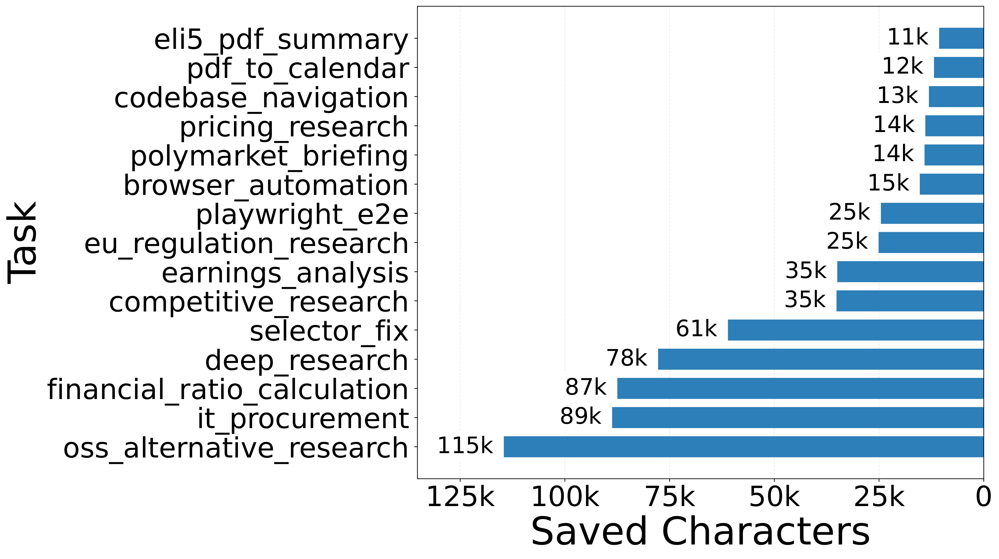

*Figure 5a: HTML Slimming Pass 在各任务的字符节省。oss_alternative_research 节省最多达 115k 字符，deep_research 78k，it_procurement 89k——web 抓取类任务的 HTML 结构噪声被有效剥离。*

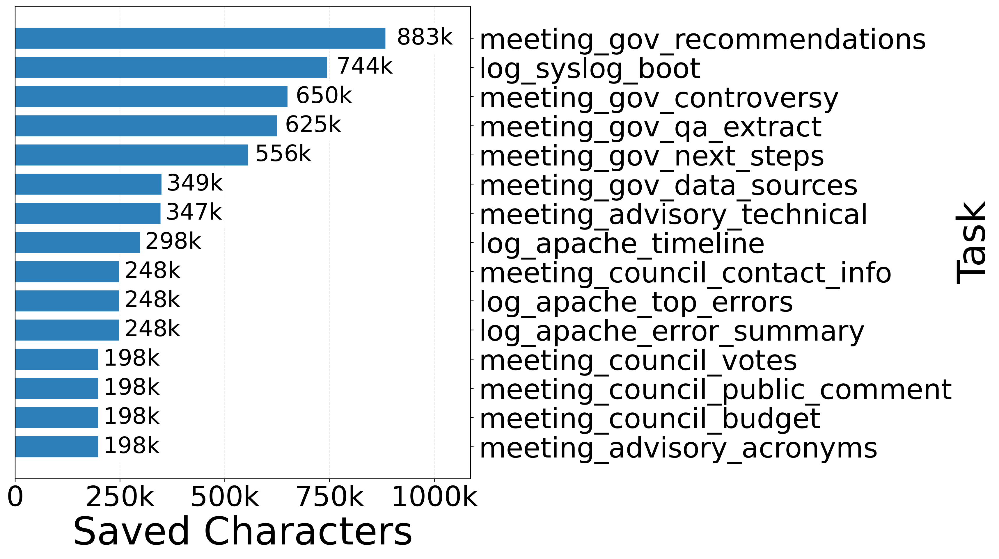

*Figure 5b: Exec Output Truncation Pass 在各任务的字符节省。meeting_gov_recommendations 节省高达 883k 字符，meeting_gov_controversy 744k——长终端日志/会议记录被有效截断。*

**解读**：双 reduction pass 直接剥离重型 payload——HTML slimming 在 web 任务最多省 115k 字符，exec truncation 在日志任务最多省 883k 字符。这种针对性压缩有效削减序列足迹，同时把任务精度维持在 80.9。关键在于"复合逻辑"——在框架边界消除的 token 永不在多轮窗口中累积。

#### 5.4.2 批触发间隔调节（图6）

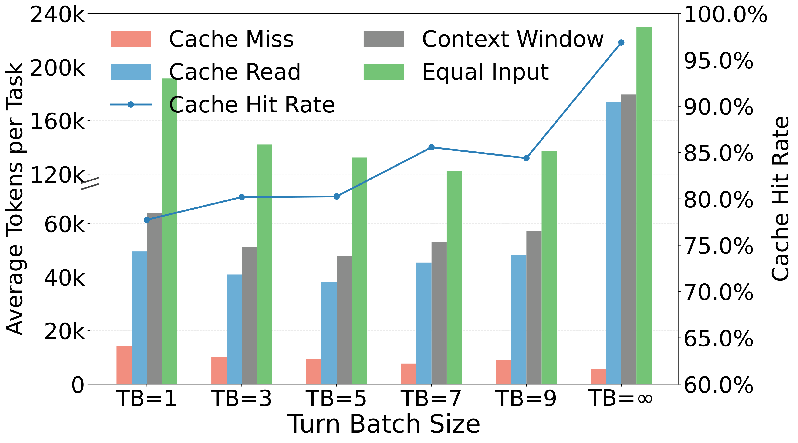

*Figure 6: Meeting Analysis 类别 continuous 模式下，批大小 $B \in \{1,3,5,7,9,\infty\}$ 对 Cache Miss/Cache Read/Context Window/Equal Input token 及 Cache Hit Rate 的影响。$B=\infty$（禁用驱逐）所有指标峰值；$B=1$（超活跃）触发过早截断破坏布局一致性、抬高 miss；$B=3$ 是经验最优——平衡精度、内存缩减与 API 调用时间。*

**解读**：
- $B=\infty$（完全禁用驱逐）：上下文与成本曲线双双峰值，印证无界历史增长抬高部署成本；
- $B=1$（超活跃调度）：触发过早截断，破坏布局一致性，反而抬高 cache miss；
- $B=3$（论文采用）：更大批保留 prefix 连续性、改善命中率，是经验最优——防止内存膨胀同时保障硬件级缓存复用。

#### 5.4.3 残余效用门控防止过度驱逐（图7）

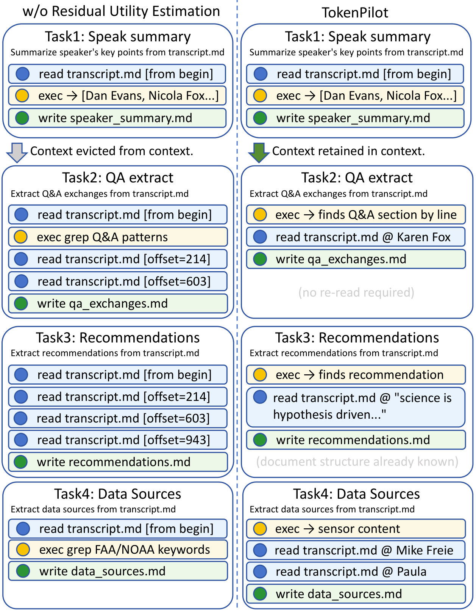

*Figure 7: 在 transcript.md 上的四任务会话中，TokenPilot 与无残余效用估计变体的工具调用模式对比。TokenPilot 在任务完成后保留上下文段，使后续任务能直接访问相关文档区段（Task2/3/4 直接定位 Q&A/recommendations/data sources，无需重读）；无残余效用估计的变体在每个任务完成后立即驱逐，导致每个后续任务继承冷窗口、被迫从头重读 transcript.md 并发出多次顺序部分读取定位同一内容。*

**解读**：图7用 transcript.md 四任务会话证明 `completed` 缓冲态的价值：
- **TokenPilot**：Task1 读取 transcript.md 并锚定结构，后续任务估计器从工具依赖模式推断该历史段仍有残余效用，保留其槽位——工具直接定位人员区段、路线图数据，无需重新探索背景知识；
- **无残余效用变体**：本地执行完成立即驱逐，每个后续任务继承冷窗口，被迫通过冗余全文件读取和顺序扫描重新发现文档架构。

这证明残余效用缓冲像阀门一样跨不同任务保留文档知识，启用定向访问同时阻挡连续上下文重新探索的开销。

### 5.5 实验结果总体分析

从全局视角综合解读所有实验，TokenPilot 的验证逻辑可分为三层：

**第一层：动机验证（图1 + 图4 + 表5）**。论文首先证明"文本压缩 vs 缓存连续性"权衡真实存在——现有方法的布局突变导致 KV cache miss（图1），而 TokenPilot 的 Prefix Stabilization 通过静态占位符把冷启动转暖启动（表5：PinchBench 91.9% 任务从 2,048 token 冷启动迁移到 5,120/12,800 暖启动），宏观命中率从 38.7%→79.2%、67.2%→83.1%（图4）。这验证了"在摄入边界稳定布局"的有效性。

**第二层：组件协同验证（表3 + 表4 + 图3 + 图5）**。渐进式消融（表3）证明全局层把成本从 \$7.24 砍到 \$4.22（miss 5.943M→1.589M），局部层进一步到 \$2.79（read 26.716M→8.551M，-65%）。组件级分析（表4）拆解全局层：稳定占位符 \$8.31→\$4.35，叠加 reduction \$4.35→\$2.87，去掉 recovery 精度 80.9→77.1。图3展示三层叠加的逐轮效果，图5量化 reduction pass 的字符节省（最高 883k）。这验证了"全局摄入压缩 + 局部保守驱逐"的协同——全局层在摄入闸口工作（减 miss），局部层在序列内部按残余效用工作（减 read footprint）。

**第三层：设计参数验证（图6 + 图7）**。图6验证批大小 $B$ 的选择——$B=3$ 平衡了精度/内存/调用时间，过大（$\infty$）内存膨胀，过小（$1$）破坏布局。图7验证残余效用门控的必要性——缓冲态让跨任务复用文档结构，否则每个任务被迫重新探索。这两个实验为论文的核心设计选择（批门控 + 三态缓冲）提供了直接的因果证据。

**核心结论**：TokenPilot 的成功不来自单点优化，而来自"全局稳定布局 + 局部保守驱逐 + recovery 闭环"三者的协同——三者缺一不可（去掉 recovery 精度跌 3.8 分，去掉局部层成本高 51%，去掉全局层 miss 翻 3.8 倍）。其适用边界是：依赖后端 prefix caching 支持（无此功能的 provider 无收益），且 continuous 模式下同类任务连续排布时 prefix 复用率最高（重度打乱或高度异质混合任务流复用率会下降）。

---

## 6. 相关工作

### 6.1 相关工作列表

<p align="center"><b>表17：相关工作列表</b></p>

| 论文/方法 | 年份 | 核心思想 | 与本文关系 |
|----------|-----|---------|-----------|
| LLMLingua / LLMLingua-2 (Jiang 2023, Pan 2024) | 2023-24 | token/句子级 prompt 压缩 | 本文基线（压缩类） |
| SelectiveContext (Li 2023) | 2023 | 基于 self-information 的句子级压缩 | 本文基线（压缩类） |
| Pichay (Mason 2026) | 2026 | LLM 上下文窗口的 demand paging | 本文基线（动态分页类） |
| LCM (Ehrlich & Blackman 2026) | 2026 | 无损上下文管理（层次摘要） | 本文基线 |
| MemoBrain (Qian 2026) | 2026 | 长程推理 Agent 的执行记忆 | 本文基线 |
| AgentSwing (Feng 2026) | 2026 | 自适应并行上下文管理路由 | 本文基线（动态调度类） |
| MemOS / Mem0 (Li 2025b, Chhikara 2025) | 2025 | LLM Agent 的记忆操作系统 | 本文基线（记忆 OS 类） |
| Keep-Last-N | - | 保留最近 N 轮 | 本文基线（截断类） |
| PagedAttention / vLLM (Kwon 2023) | 2023 | LLM 服务的高效内存管理 | 本文硬件缓存效率的理论基础 |
| SGLang (Zheng 2024) | 2024 | 结构化 LM 程序的高效执行 | 本文 KV cache 后端基础 |
| MemGPT (Packer 2023) | 2023 | LLM 作为操作系统的分页内存 | 同期分页思想 |
| ClawVM (Rafique 2026) | 2026 | 有状态工具 Agent 的 harness 管理虚拟内存 | 同期虚拟内存抽象 |
| LightMem (Fang 2025) | 2025 | 轻量高效记忆增强生成 | 同团队前作（ICLR 2026），TokenPilot 集成于其升级版 LightMem2 |
| PinchBench (Kilo AI Team 2026) | 2026 | 真实世界 AI coding agent benchmark | 本文评测集 |
| Claw-Eval (Ye 2026) | 2026 | 自主 Agent 可信评测 | 本文评测集 |
| Context Engineering Survey (Mei 2025) | 2025 | LLM 上下文工程综述 | 本文背景参考 |
| KVComm (Ye 2025a) | 2025 | 多 Agent 跨上下文 KV cache 通信 | 同期分布式缓存方向 |

### 6.2 本文与相关工作的区别

TokenPilot 与上述工作的核心区别在于**显式协调文本稀疏性与缓存连续性**：
- 相对**压缩类**（LLMLingua/SelectiveContext）：不突变输入边界，而在摄入边界稳定布局，避免压缩引发的 cache miss；
- 相对**动态分页类**（Pichay/ClawVM）：不频繁换页，而用三态缓冲 + 残余效用门控 + 批触发，保留物理缓存槽位直到效用归零；
- 相对**记忆 OS 类**（MemOS/Mem0）：不把历史卸载到外部检索系统，而在 canonical 上下文内做确定性管理 + recovery 闭环；
- 相对同团队前作 **LightMem**：LightMem 关注检索式记忆增强（外部数据库召回），TokenPilot/LightMem2 关注长程 Agent 的上下文/缓存连续性（in-context 管理），两者互补。

---

## 7. 局限性分析

### 7.1 论文声明的局限性

作者在论文 Limitations 节明确承认：
1. **估计器误分类**：基于模型的估计器 $E$ 在高度模糊或稀疏交互模式下可能误分类上下文段；
2. **参数需调参**：频率阈值 $\tau$ 与批大小 $B$ 可能需要针对不同部署环境与任务分布调优；
3. **后端依赖**：Prefix Stabilization 依赖后端对 prefix caching 的支持，对无此功能的 provider 无收益；
4. **连续模式任务排布**：评测把同类任务分组成连续会话以反映领域工作流，重度打乱或高度异质混合任务流可能因 tool schema 持续突变而呈现更低的 prefix 复用率（留作未来工作）。

### 7.2 发现的潜在问题

<p align="center"><b>表18：潜在问题分析</b></p>

| 问题类型 | 描述 | 影响 |
|---------|-----|------|
| 方法层面 | 估计器 $E$ 用 Qwen3.5-35B-A3B 零样本，对长程复杂依赖的残余效用判断可能不足 | 极长会话或跨域任务流可能误驱逐仍有用段 |
| 方法层面 | ingestion gate $G(m)$ 的频率阈值 $\tau$ 是全局常数，未自适应 | 高频但低单次效用的内容可能被错误升级 |
| 实验层面 | 评测 backbone 仅 GPT-5.4-mini，未验证在 Claude/开源大模型上的 prefix cache 行为 | 跨 provider 泛化未实证 |
| 实验层面 | continuous 模式同类任务连续排布偏乐观 | 真实生产中任务常打乱，prefix 复用率可能下降 |
| 实验层面 | 仅 PinchBench + Claw-Eval 两 benchmark，缺 SWE-bench 等代码 Agent 主流集 | 代码任务泛化未验证 |
| 应用层面 | Recovery Tool 依赖 Agent 主动调用，若 Agent 不识别信号缺失则不触发 | 边界场景仍可能丢精度 |
| 应用层面 | Prefix Stabilization 对无 prefix caching 的 provider 无收益 | 部署环境受限 |

### 7.3 未来工作方向

论文明确留下的未来方向：**重度打乱或高度异质混合任务流下的 prefix 复用率优化**。结合潜在问题，可延伸：
- 估计器 $E$ 的轻量化/自适应（针对长程会话的滑动窗口估计）；
- ingestion gate $\tau$ 的自适应学习；
- 跨 provider（Claude/开源）的 prefix cache 行为验证；
- 在 SWE-bench 等代码 Agent benchmark 上的泛化验证。

---

## 8. 个人评价

### 8.1 优点

1. **洞察深刻且新颖**：首次显式指出"文本压缩"与"硬件缓存连续性"的权衡，并用 Figure 1 一图讲清动机——这是被既有工作忽视的根本矛盾，对 Agent 部署经济学有真实价值。
2. **方法设计严谨闭环**：全局层（稳定布局）+ 局部层（保守驱逐）+ Recovery Tool（安全网）三者协同，每个组件都有形式化定义（公式3-9）和消融验证（表3-4），设计闭环完整。
3. **实验保真度高**：cache hit/miss 直接取 provider API 元数据而非客户端估算，trajectory slicing 保证连续/隔离模式评测数学等价，成本模型用 GPT-5.4-mini 官方定价——可复现性强。
4. **代码工程质量极高**：monorepo 分层清晰，host 逻辑与算法逻辑彻底分离，所有论文参数暴露为配置，三档运行时模式覆盖不同部署场景，论文-代码逐项吻合（工具阈值/三态/两套 prompt 全部对应）。

### 8.2 不足

1. **估计器依赖外部模型**：Qwen3.5-35B-A3B 作为 estimator 引入额外推理成本与延迟（虽声称 < \$0.03），但对自托管或无 Qwen 环境的部署不够友好。
2. **评测范围偏窄**：仅 GPT-5.4-mini + PinchBench/Claw-Eval，缺 Claude/SWE-bench 等主流代码 Agent benchmark，跨 provider/跨场景泛化未实证。
3. **continuous 模式任务排布偏乐观**：同类任务连续排布放大了 prefix 复用率，真实生产环境的任务打乱可能让优势缩水——作者承认但未量化。
4. **Prefix Stabilization 对 provider 强依赖**：对无 prefix caching 支持的 provider（如部分自托管 vLLM 配置）零收益，限制了适用范围。

### 8.3 适用场景

- 长程多轮 Agent 会话（coding agent、运维 Agent、研究 Agent），尤其是连续模式下任务有领域聚集性；
- 使用支持 prefix caching 的商业 API（GPT、Claude）的部署；
- 对推理成本敏感、需精确控制 token 占用的生产环境；
- 需要插拔式集成到现有 host（OpenClaw/Codex/Claude Code）的场景。

### 8.4 不适用场景

- 无 prefix caching 支持的 provider（部分自托管推理引擎）；
- 任务高度打乱、跨域异质的混合任务流（prefix 复用率低）；
- 短程单轮交互（上下文增长不构成瓶颈）；
- 对 estimator 额外模型成本/延迟零容忍的离线环境。

---

## 9. 启发与思考

### 9.1 技术启发

1. **"减 token" ≠ "省钱"**：KV prompt cache 的命中依赖物理 prefix 连续性，任何突变布局的压缩都会触发 pre-fill 惩罚。上下文管理必须同时考虑文本稀疏性与硬件缓存对齐。
2. **缓冲态的力量**：在"保留"与"驱逐"之间引入 `completed` 缓冲态，用残余效用门控延迟驱逐，比二态"完成即驱逐"更经济——这是状态机设计的一般性启发。
3. **安全网闭环**：硬截断必须配 recovery tool，否则 Agent 的补偿性重试会形成通胀循环——压缩不是单向损失，而是"压缩-回取"闭环。

### 9.2 可借鉴之处

1. **确定性 harness + 模型估计解耦**：把确定性规则（prefix 稳定、reduction pass）放在高频摄入边界，把模型判断（estimator）放在低频批边界——既保证确定性又控制模型成本，这种分层调度模式可推广到其他 Agent 系统组件。
2. **消息空间二分**：把消息分为高内禀效用（$\Omega_{\text{int}}$）与高结构噪声（$\Omega_{\text{env}}$）差异化处理，是一种通用的上下文治理思路。
3. **评测保真**：直接取 provider API 元数据而非客户端估算，trajectory slicing 保证模式间评测等价——这种严谨的评测设计值得所有 Agent benchmark 借鉴。
4. **monorepo + host adapter 模式**：把核心算法与 host 集成解耦，新 host 只需实现契约——这种工程架构对任何要支持多 host 的 Agent 工具都有参考价值。

### 9.3 潜在改进方向

1. **自适应 ingestion gate**：把 $\tau$ 从全局常数改为按内容类型/任务域自适应学习；
2. **估计器轻量化**：用更小的规则模型或在线学习替代 Qwen3.5-35B-A3B，降低 estimator 成本与延迟；
3. **跨 provider 验证**：在 Claude、开源大模型上验证 prefix cache 行为，扩展适用范围；
4. **任务排布鲁棒性**：显式量化打乱任务流下的 prefix 复用率下降，并提出对冲机制（如按工具 schema 簇聚合而非按任务域聚合）；
5. **与记忆系统融合**：将 evicted 段蒸馏为结构化记忆（code 中 `layers/memory/` 已是实验性方向），形成"in-context 管理 + 外部记忆"的统一框架。

### 9.4 后续行动

- [ ] 深入阅读 Pichay（demand paging）与 ClawVM（虚拟内存）两篇同期工作，对比 TokenPilot 的三态缓冲与它们的换页策略差异
- [ ] 复现 TokenPilot 在 OpenClaw + PinchBench continuous 模式的成本曲线（experiments/tokenpilot/pinchbench）
- [ ] 验证 Prefix Stabilization 在 Claude Code 适配器上的 promptCacheKey 行为（adapters/claude-code/src/stable-prefix.ts）
- [ ] 探索把 `completed` 缓冲态思路迁移到自研 Agent 的上下文管理中
- [ ] 阅读 LightMem（前作）与 LightMem2 的关系，理清 zjunlp 团队的记忆/上下文管理演进脉络

---

## 参考文献

> 论文中引用的关键文献（精选）

```bibtex
@article{xu2026tokenpilot,
  title={TokenPilot: Cache-Efficient Context Management for LLM Agents},
  author={Xu, Buqiang and Xue, Zirui and Chen, Dianmou and Fu, Chenyang and Wu, Chiyu and Huang, Caiying and Jiang, Chen and Fang, Jizhan and Deng, Xinle and Chen, Yijun and Yao, Yunzhi and Wang, Xuehai and Shang, Jin and Yu, Gong and Zhang, Ningyu},
  journal={arXiv preprint arXiv:2606.17016},
  year={2026}
}

@article{fang2025lightmem,
  title={LightMem: Lightweight and Efficient Memory-Augmented Generation},
  author={Fang, Jizhan and Deng, Xinle and Xu, Haoming and Jiang, Ziyan and Tang, Yuqi and Xu, Ziwen and Deng, Shumin and Yao, Yunzhi and Wang, Mengru and Qiao, Shumin and Chen, Huajun and Zhang, Ningyu},
  journal={CoRR, abs/2510.18866},
  year={2025}
}

@inproceedings{kwon2023pagedattention,
  title={Efficient Memory Management for Large Language Model Serving with PagedAttention},
  author={Kwon, Woosuk and Li, Zhuohan and Zhuang, Siyuan and Sheng, Ying and Zheng, Lianmin and others},
  booktitle={SOSP},
  year={2023}
}

@article{pan2024llmlingua2,
  title={LLMLingua-2: Data Distillation for Efficient and Faithful Task-Agnostic Prompt Compression},
  author={Pan, Zhuoshi and Wu, Qianhui and Jiang, Huiqiang and others},
  journal={Findings of ACL},
  year={2024}
}

@article{mason2026pichay,
  title={The Missing Memory Hierarchy: Demand Paging for LLM Context Windows},
  author={Mason, Tony},
  journal={CoRR, abs/2603.09023},
  year={2026}
}

@article{li2025bmemos,
  title={MemOS: A Memory OS for AI System},
  author={Li, Zhiyu and Song, Shichao and others},
  journal={CoRR, abs/2507.03724},
  year={2025}
}

@article{ye2026claweval,
  title={Claw-Eval: Toward Trustworthy Evaluation of Autonomous Agents},
  author={Ye, Bowen and Li, Rang and Yang, Qibin and others},
  journal={CoRR, abs/2604.06132},
  year={2026}
}
```

---

## 附录

### A. 关键图表索引

<p align="center"><b>表19：论文图表索引（全部9张图均已提取并插入正文）</b></p>

| Figure | 描述 | 报告内位置 |
|--------|------|-----------|
| Figure 1 | 缓存对齐行为对比（Original vs Prior Management） | §1.2 研究动机 |
| Figure 2 | TokenPilot 系统架构（全局层 + 局部层） | §3.2 整体架构 |
| Figure 3 | 逐轮上下文 token 体积（continuous Meeting Analysis） | §5.3.3 逐轮上下文体积 |
| Figure 4a | PinchBench Vanilla 逐任务缓存命中率 | §5.3.4 缓存命中率提升 |
| Figure 4b | PinchBench 稳定占位符后命中率 | §5.3.4 |
| Figure 4c | Claw-Eval Vanilla 逐任务缓存命中率 | §5.3.4 |
| Figure 4d | Claw-Eval 稳定占位符后命中率 | §5.3.4 |
| Figure 5a | HTML Slimming Pass 字符节省 | §5.4.1 Reduction Pass 字符节省 |
| Figure 5b | Exec Output Truncation Pass 字符节省 | §5.4.1 |
| Figure 6 | 批大小 B 对上下文与缓存稳定性的影响 | §5.4.2 批触发间隔调节 |
| Figure 7 | 残余效用估计的工具调用模式对比（transcript.md 四任务） | §5.4.3 残余效用门控 |
| Figure 8 | Primary Estimator 系统 prompt 模板（三态+残余效用） | §4.8 核心算法实现 |
| Figure 9 | 无残余效用估计的 Estimator prompt（消融） | §4.8 核心算法实现 |

> Figure 8/9 是 prompt 模板图，对应代码 `task-state-estimator.ts` 的 `buildSystemPrompt` 动态生成逻辑，已插入代码实现章节（§4.8）讨论，与代码分析形成图文互补。

### B. 流程图索引

<p align="center"><b>表20：报告中新增的 Mermaid 设计图索引</b></p>

| 图表 | 描述 | 报告内位置 |
|------|------|-----------|
| 系统架构图 | LightMem2 monorepo 分层（Host/Product/packages/layers） | §4.3 |
| 模块依赖关系图 | packages 间 import/依赖（kernel 为核心枢纽） | §4.4 |
| 核心流程图 | 一次 Agent 推理调用的完整 TokenPilot 路径 | §4.5 |
| 数据结构关系图 | ContextSegment/HistoryBlock/SemanticTaskUpdate 关系 | §4.6 |

### C. 补充材料

**关于 LightMem vs LightMem2 的澄清**：
- **LightMem**（arXiv:2510.18866, ICLR 2026）：zjunlp 团队前作，关注**检索式记忆增强**——预压缩输入消息（LLMLingua-2）、基于主题分段、元数据/关键词提取、文本摘要、embedding 索引与检索（Qdrant/FAISS/BM25）、离线记忆更新去重合并。代码 `zjunlp/LightMem`。
- **LightMem2/TokenPilot**（arXiv:2606.17016, 2026-06）：本论文，关注**长程 Agent 的上下文/缓存连续性管理**——prefix 稳定、观察压缩、生命周期感知驱逐。代码 `zjunlp/LightMem2`，TokenPilot 作为其运行时组件。
- 两者是同一团队的两代不同工作，互补关系：LightMem 管"外部记忆召回"，TokenPilot 管"in-context 缓存连续性"。用户提供的 `zjunlp/LightMem` 链接是前作仓库，非本论文代码。

**关于论文图片来源**：本报告所有论文图片均从 arXiv e-print 源文件（`https://arxiv.org/e-print/2606.17016`）的 `figure/*.pdf` 原始矢量图用 PyMuPDF 3x 缩放渲染为 PNG，清晰度优于 PDF 截图。Figure 4/5 在论文中是 subfigure 组合，本报告按子图（a/b/c/d）分别呈现。

### D. 调研信息

- 调研人：Claude（research 技能，模式 C3 论文+代码综合）
- 调研时间：2026-07-04
- 论文版本：arXiv:2606.17016v1（2026-06-15/16）
- 参考来源：
  - 论文 PDF：`https://arxiv.org/pdf/2606.17016`（全文提取 15 页）
  - arXiv 源文件：`https://arxiv.org/e-print/2606.17016`（提取全部 11 张原始矢量图）
  - 代码仓库：`https://github.com/zjunlp/LightMem2`（克隆分析 components/tokenpilot）
  - 微信公众号参考资料：见 `references/` 子目录（4 篇）

---

*报告版本: v1.0 · 模板版本 v2.2*
