# EvoMAS: Evolutionary Generation of Multi-Agent Systems

## 调研报告

> 调研日期：2026-06-24
> 论文来源：arXiv:2602.06511 | ICML 2026 | Amazon Science
> 代码仓库：https://github.com/amazon-science/EvoMAS

---

## 一、论文基本信息

| 项目 | 内容 |
|------|------|
| **标题** | EvoMAS: Evolutionary Generation of Multi-Agent Systems |
| **作者** | Yuntong Hu, Yuting Zhang, Matthew Trager, Yi Zhang, Shuo Yang, Wei Xia, Stefano Soatto |
| **机构** | Amazon Web Services (AWS) |
| **会议** | ICML 2026 |
| **arXiv** | 2602.06511 (v1: 2026-02-06, v4: 2026-05-27) |
| **代码** | https://github.com/amazon-science/EvoMAS (CC BY-NC 4.0) |
| **论文** | CC BY 4.0 |

---

## 二、研究背景与动机

### 2.1 核心问题

LLM-based 多智能体系统（MAS）在复杂推理、规划和工具增强任务上展现了强大潜力，但**设计有效的 MAS 架构**仍然是一个关键瓶颈：

- **人工设计 MAS**：耗时、脆弱、难以泛化到不同任务域
- **自动生成 MAS**：现有方法面临两大困境的张力

### 2.2 现有方法的困境

| 方法类型 | 代表工作 | 优势 | 劣势 |
|----------|---------|------|------|
| **代码生成** | ADAS, MAS-GPT | 表达力强，探索空间广 | **可执行性灾难**——MAS-GPT 在 SWE-Bench-Lite 上执行率仅 1.2%，语法错误、运行时异常频繁 |
| **模板约束** | AutoAgents, EvoAgent, MetaAgent | 执行可靠性高 | 表达力受限、架构模板僵化、缺乏适应性 |

**核心矛盾**：代码生成方法灵活但不稳定，模板方法稳定但不灵活。

### 2.3 EvoMAS 的解决思路

EvoMAS 通过**配置空间生成**（而非代码空间）来化解这一张力：

- 每个 MAS 定义为**声明式的结构化配置**（YAML），而非可执行代码
- 由轻量级**运行时解释器**执行配置
- **消除了语法错误和运行时异常**，同时保持架构探索的灵活性

---

## 三、方法论

### 3.1 问题形式化

**定义（MAS 配置）**：配置 C = (G, {A_i}, V_in, V_out)

- **G = (V, E)**：无环通信图，节点为智能体，边为消息流向
- **A_i = (b_i, p_i, Γ_i)**：每个智能体的 backbone 模型、系统提示模板、工具集
- **V_in, V_out**：输入和输出智能体子集

**目标**：给定任务 q ∈ Q，找到配置 C* 最大化奖励 R(q, C)

### 3.2 框架架构

EvoMAS 使用 **LLM 元模型**（默认 Claude-4-Sonnet）作为进化操作器，框架包含四个核心操作：

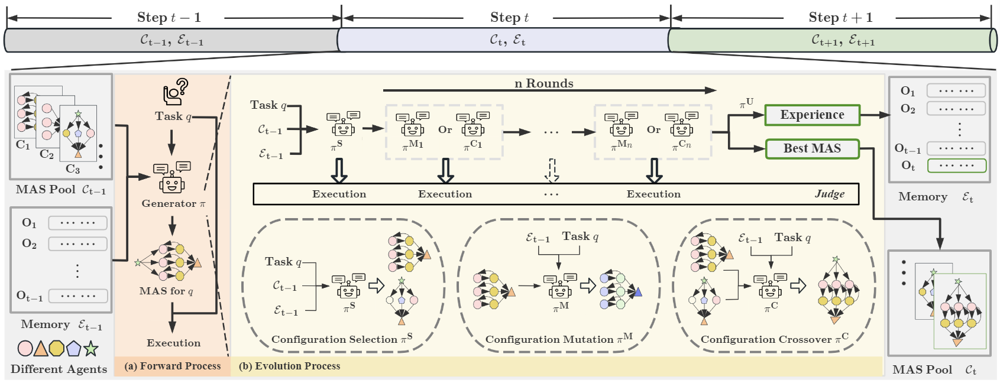

*Figure 1: EvoMAS 整体架构概览图。展示了配置空间进化的核心流程：从配置池（Pool）中 Select 父配置 → 经 Mutate 或 Crossover 生成后代 → Execute 执行并收集轨迹 → LLM-as-Judge 评估奖励 → 更新池和经验记忆。左侧标注了四种进化操作（π^S 选择、π^M 变异、π^C 交叉、π^U 记忆整合），右侧展示了配置到执行的映射关系。*

#### （1）Select — 选择操作

从配置池中检索初始配置，基于任务相关性（任务注释、领域标签、历史性能），元模型选择覆盖互补能力的多样化父配置。

```python
# 实现要点（源码 src/meta_model/metamodel.py）
def select(self, task_query, pool_dir, k=2, mas_index=None):
    # 加载池元数据，调用 LLM 选择 k 个父配置
    # 失败时回退到程序化选择
```

#### （2）Mutate — 变异操作

基于执行反馈对单个配置进行局部改进：

- **每次变异仅修改一种组件类型**（提示、模型、工具或拓扑）
- 条件化于执行轨迹（而非随机扰动）
- 实现系统化探索与隔离效应追踪

```python
# 实现要点
def mutate(self, mas_config, execution_logs, observations, model_list=None):
    # 加载 meta_mutate 提示模板
    # 注入执行日志、观察、经验记忆上下文
    # 元模型生成变异后的 YAML 配置
    # 验证新配置的有效性（name, backend, agents 必须字段）
```

#### （3）Crossover — 交叉操作

重组两个父配置生成后代：

- 后代**继承一个父配置的完整通信拓扑**（保持结构连贯性）
- 元模型从两个父配置中**选择或重组智能体级属性**（提示、模型、工具）

```python
# 实现要点
def crossover(self, mas_config_1, mas_config_2, logs_1, logs_2, model_list=None):
    # 分析两个父配置的性能差异
    # 加载 meta_crossover 提示模板
    # 元模型生成后代配置（拓扑从一父继承，属性从两父重组）
```

#### （4）Consolidate — 经验记忆更新

将进化轨迹总结为紧凑表示存入记忆，提炼有效模式（如"输出格式化的提示改进提升了8%准确率"）。

```python
# 实现要点
def update_memory(self, action_type, query, old_config, new_config, old_accuracy, new_accuracy):
    # 比较新旧配置变化
    # 元模型分析操作结果并提炼经验
    # 存入 MemoryStore，持久化到 JSON 文件
```

### 3.3 进化流程

对每个任务查询 q，EvoMAS 执行以下流程：

1. **Select**：从池中选择 k 个初始候选配置
2. **Execute & Evaluate**：执行并评估候选配置
3. **Iterate**：迭代 n 步进化，每步应用 Mutate 或 Crossover（条件化于执行反馈）
4. **Reward**：使用奖励函数 R(q,C) = Metrics(q,C) - β·Cost(C) 评估后代
   - Metrics：LLM-as-judge 评分（正确性、完整性、推理质量）
   - Cost：T + α·L（token 使用量 + 延迟；α=1000）
5. **Return**：返回最高得分配置进行最终执行
6. **Update Pool**：将最佳配置加入池
7. **Update Memory**：整合进化轨迹摘要

### 3.4 奖励函数设计

**LLM-as-judge 代理奖励**：无需真实标签访问

- 替换 Claude-4-Sonnet 为 Qwen3-235B，与真实标签达成 90.4% 一致率，准确率仅下降 1.8pp
- Oracle 奖励仅带来温和增益（+3.4pp on BBEH-Mini, +1.5pp on WorkBench, +3.1pp on SWE-Bench）

### 3.5 配置池初始化

初始池由人工设计的协作 MAS 配置种子填充：

- **推理/工具任务**：Peer Review, Croto, SMoA, Multi-Agent Debate, Majority Vote
- **SWE-Bench 编码任务**：MetaGPT, ChatDev

### 3.6 MAS 配置结构

每个 MAS 配置以 YAML 格式定义，核心字段：

```yaml
name: peer_review_bbeh
description: "DAG-unrolled peer review for BBEH tasks"
backend: smolagents  # 执行后端

agents:
  creator1:
    id: creator1
    role: creator          # 智能体角色
    agent_type: CodeAgent  # 智能体类型
    model_id: bedrock:us.anthropic.claude-3-5-sonnet-...  # backbone 模型
    prompt: reviewer_create  # 提示模板名
    tools: []               # 工具集
    max_tokens: 4096
    temperature: 0.7

  reviewer1:
    role: reviewer
    prompt: reviewer_review
    ...

topology:
  reports_to:
    creator1: [reviewer1]
    creator2: [reviewer1]
    reviewer1: [aggregator]

execution:
  parallel_workers: true
  peer_review_stages: 3
  timeout: 600
```

### 3.7 运行时引擎

`MasRuntime`（源码 `src/mas/runtime.py`）实现了**DAG 编译器**——拓扑驱动的执行引擎：

- 按拓扑 DAG 的层级顺序执行智能体
- 同一层级的智能体可并行执行（ThreadPoolExecutor）
- 支持 5 种 MAS 范式的专用执行路径：
  - **Peer Review**：Create → Review → Revise 三阶段
  - **Debate**：多轮辩论迭代
  - **SMoA**：稀疏混合智能体（多层处理器 + Judge + Moderator）
  - **CROTO**：跨团队编排（多团队并行 + 层级聚合）
  - **通用 DAG**：拓扑驱动的通用执行

---

## 四、代码实现分析

### 4.1 代码仓库概述

| 项目 | 内容 |
|------|------|
| 仓库地址 | https://github.com/amazon-science/EvoMAS |
| 主要语言 | Python |
| 代码规模 | main.py 46KB + src/ 下约 80 个源文件 |
| 开源时间 | 2026-02（随论文提交） |
| 许可 | CC BY-NC 4.0 |
| 依赖管理 | requirements.txt（conda + pip） |

### 4.2 项目结构

```
EvoMAS/
├── main.py                    # 主入口，进化管道（46KB，约900行）
├── mas_pools/                 # 配置池 YAML 文件
│   ├── bbeh/                  # BBEH 基准池
│   │   ├── peer_review.yaml   # Peer Review 配置
│   │   ├── debate.yaml        # Debate 配置
│   │   ├── majority_vote.yaml # Majority Vote 配置
│   │   ├── croto.yaml         # CROTO（跨团队编排）配置
│   │   ├── smoA.yaml          # SMoA（稀疏混合智能体）配置
│   │   ├── single_codeagent.yaml  # 单智能体配置
│   │   └── mas_index.json     # 池元数据索引
│   ├── swebench/              # SWE-Bench 基准池
│   │   ├── metagpt.yaml, chatdev.yaml, ...
│   │   └── mas_index.json
│   └── workbench/             # WorkBench 基准池（按子域组织）
│       ├── analytics/, calendar/, email/, ...
├── scripts/                   # 运行脚本
│   ├── run_bbeh.sh, run_workbench.sh, run_swebench.sh
│   ├── prepare_datasets.sh    # 数据下载脚本（幂等）
│   └── common.sh              # 默认参数配置（所有 env vars）
├── src/
│   ├── mas/                   # MAS 核心模块（配置规范+运行时+解释器）
│   ├── meta_model/            # 进化元模型（5个核心操作器）
│   ├── agents/                # 智能体模块（规范+3种执行器）
│   ├── topology/              # 拓扑模块（路由+上下文+合并）
│   ├── prompts/               # 提示模板系统（30+模板文件）
│   ├── tools/                 # 工具模块（WorkBench 6域工具）
│   ├── dataset/               # 数据集处理（3种评估器+LLM-as-judge）
│   ├── models/                # LLM 模型接口（5种提供商统一封装）
│   └── utils/                 # 工具函数（MasRunner, 验证器等）
├── requirements.txt
└── .env.example                # API key 模板
```

### 4.3 系统架构图

EvoMAS 的整体架构分为三层：进化层（Meta-Model）、配置层（MAS Spec）和执行层（MAS Runtime）。进化层驱动配置空间的搜索，配置层定义 MAS 的声明式规范，执行层将规范转化为实际的智能体协作执行。

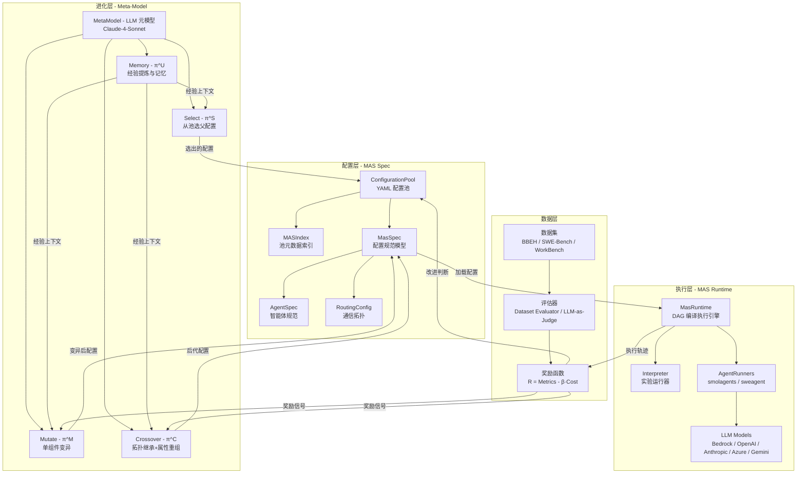
```mermaid
graph TB
    subgraph "进化层 - Meta-Model"
        MM["MetaModel - LLM 元模型<br/>Claude-4-Sonnet"]
        SEL["Select - π^S<br/>从池选父配置"]
        MUT["Mutate - π^M<br/>单组件变异"]
        CRO["Crossover - π^C<br/>拓扑继承+属性重组"]
        MEM["Memory - π^U<br/>经验提炼与记忆"]
        MM --> SEL
        MM --> MUT
        MM --> CRO
        MM --> MEM
    end

    subgraph "配置层 - MAS Spec"
        POOL["ConfigurationPool<br/>YAML 配置池"]
        INDEX["MASIndex<br/>池元数据索引"]
        SPEC["MasSpec<br/>配置规范模型"]
        AGENT["AgentSpec<br/>智能体规范"]
        ROUTE["RoutingConfig<br/>通信拓扑"]
        POOL --> INDEX
        POOL --> SPEC
        SPEC --> AGENT
        SPEC --> ROUTE
    end

    subgraph "执行层 - MAS Runtime"
        RT["MasRuntime<br/>DAG 编译执行引擎"]
        INTERP["Interpreter<br/>实验运行器"]
        RUNNER["AgentRunners<br/>smolagents / sweagent"]
        LLM["LLM Models<br/>Bedrock / OpenAI / Anthropic / Azure / Gemini"]
        RT --> INTERP
        RT --> RUNNER
        RUNNER --> LLM
    end

    subgraph "数据层"
        DS["数据集<br/>BBEH / SWE-Bench / WorkBench"]
        EVAL["评估器<br/>Dataset Evaluator / LLM-as-Judge"]
        REWARD["奖励函数<br/>R = Metrics - β·Cost"]
        DS --> EVAL
        EVAL --> REWARD
    end

    SEL -->|"选出的配置"| POOL
    MUT -->|"变异后配置"| SPEC
    CRO -->|"后代配置"| SPEC
    MEM -->|"经验上下文"| SEL
    MEM -->|"经验上下文"| MUT
    MEM -->|"经验上下文"| CRO
    SPEC -->|"加载配置"| RT
    REWARD -->|"奖励信号"| MUT
    REWARD -->|"奖励信号"| CRO
    RT -->|"执行轨迹"| REWARD
    REWARD -->|"改进判断"| POOL

```

*Figure 4-1: EvoMAS 系统架构图。展示了进化层、配置层、执行层和数据层四个层次的组成及其交互关系。进化层（蓝色）是核心驱动力，LLM 元模型作为进化操作器，从配置池中选取父配置，经变异/交叉产生后代，经验记忆为进化提供跨任务知识。配置层（绿色）管理声明式的 YAML 配置规范和元数据索引。执行层（紫色）将配置转化为实际的智能体协作执行，支持多种后端。数据层（橙色）提供任务数据、评估和奖励信号。*

#### 架构分析

**三层解耦设计**是 EvoMAS 代码架构最突出的特点：

1. **进化层与配置层解耦**：MetaModel 只操作 YAML 文本，不关心运行时实现。变异/交叉产出的是声明式配置而非可执行代码，这是"配置空间进化"的核心体现——进化层可以自由探索架构空间，而无需理解代码细节。

2. **配置层与执行层解耦**：MasSpec 是纯粹的声明式规范，MasRuntime 是解释执行的引擎。同一份配置可以被不同后端（smolagents/sweagent/minisweagent）执行，后端切换不影响配置本身。这保证了近 100% 的执行率——只要 YAML 格式正确，运行时总能执行。

3. **执行层与数据层解耦**：Interpreter → DatasetEvaluator 是独立管道。执行层产出原始输出，数据层独立评估，支持 Dataset Evaluator 和 LLM-as-Judge 两种评估路径。

**关键数据流**：
- **进化流**（蓝色箭头）：MetaModel → Pool → Select → Mutate/Crossover → Spec → Runtime → Reward → Pool Update
- **执行流**（紫色箭头）：Spec → MasRuntime → AgentRunners → LLM API → Context → Trace
- **反馈流**（橙色箭头）：Runtime Trace → Reward → Memory → 下次进化操作的条件输入

### 4.4 模块依赖关系图

展示了 src/ 下各模块之间的调用依赖关系，帮助理解代码的组织逻辑。

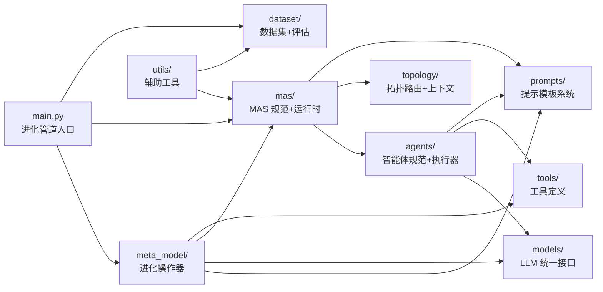
```mermaid
graph LR
    MAIN["main.py<br/>进化管道入口"]
    MM["meta_model/<br/>进化操作器"]
    MAS["mas/<br/>MAS 规范+运行时"]
    AGT["agents/<br/>智能体规范+执行器"]
    TOP["topology/<br/>拓扑路由+上下文"]
    PRM["prompts/<br/>提示模板系统"]
    MOD["models/<br/>LLM 统一接口"]
    TL["tools/<br/>工具定义"]
    DS["dataset/<br/>数据集+评估"]
    UT["utils/<br/>辅助工具"]

    MAIN --> MM
    MAIN --> MAS
    MAIN --> DS
    MM --> PRM
    MM --> MOD
    MM --> MAS
    MM --> TL
    MAS --> AGT
    MAS --> TOP
    MAS --> PRM
    AGT --> MOD
    AGT --> TL
    AGT --> PRM
    UT --> MAS
    UT --> DS

```

*Figure 4-2: 模块依赖关系图。main.py 是顶层协调者，串联 meta_model（进化）和 mas（执行）。meta_model 依赖 prompts 和 models（LLM 调用）以及 mas（配置解析）。mas 是核心枢纽，依赖 agents（执行器）、topology（拓扑）和 prompts（模板）。agents 依赖 models（LLM 接口）和 tools（工具）及 prompts（角色提示）。*

#### 依赖分析

- **main.py 是唯一的顶层入口**：所有功能通过 main.py 的 `run_evolution_pipeline()` 串联，不存在循环依赖
- **meta_model 是进化的独立子系统**：只依赖 prompts（模板渲染）和 models（LLM 调用），以及 mas（配置加载/验证），不依赖 agents/runtime（执行细节）
- **mas 是中间枢纽**：承接配置规范，向下分发到 agents/topology/prompts，是"配置 → 执行"的桥梁
- **prompts 是共享资源**：同时被 meta_model（进化操作模板）和 agents（角色提示）使用，是两个子系统唯一的间接耦合点
- **models 是底层基础设施**：被 meta_model 和 agents 同时依赖，但不依赖任何上层模块

### 4.5 进化操作流程图

展示了论文中 EvoMAS 算法的完整运行流程，即 per-query 进化循环。

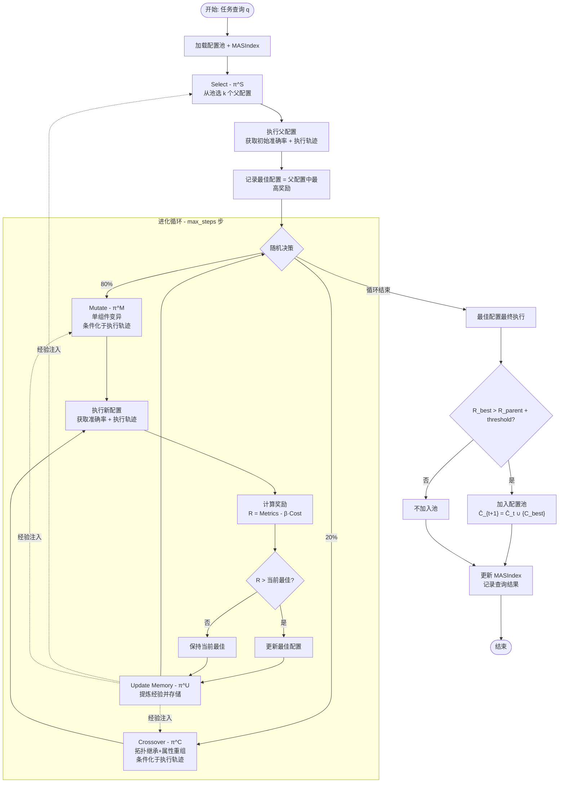
```mermaid
flowchart TB
    START(["开始: 任务查询 q"])
    LOAD["加载配置池 + MASIndex"]
    SELECT["Select - π^S<br/>从池选 k 个父配置"]
    EXEC_PARENT["执行父配置<br/>获取初始准确率 + 执行轨迹"]
    INIT_BEST["记录最佳配置 = 父配置中最高奖励"]

    START --> LOAD --> SELECT --> EXEC_PARENT --> INIT_BEST

    subgraph "进化循环 - max_steps 步"
        DECIDE{"随机决策"}
        MUTATE["Mutate - π^M<br/>单组件变异<br/>条件化于执行轨迹"]
        CROSSOVER["Crossover - π^C<br/>拓扑继承+属性重组<br/>条件化于执行轨迹"]
        EXEC_NEW["执行新配置<br/>获取准确率 + 执行轨迹"]
        REWARD["计算奖励<br/>R = Metrics - β·Cost"]
        COMPARE{"R > 当前最佳?"}
        UPDATE_BEST["更新最佳配置"]
        KEEP["保持当前最佳"]
        MEMORY["Update Memory - π^U<br/>提炼经验并存储"]

        DECIDE -->|"80%"| MUTATE
        DECIDE -->|"20%"| CROSSOVER
        MUTATE --> EXEC_NEW
        CROSSOVER --> EXEC_NEW
        EXEC_NEW --> REWARD
        REWARD --> COMPARE
        COMPARE -->|"是"| UPDATE_BEST
        COMPARE -->|"否"| KEEP
        UPDATE_BEST --> MEMORY
        KEEP --> MEMORY
    end

    INIT_BEST --> DECIDE
    MEMORY --> DECIDE

    FINAL["最佳配置最终执行"]
    POOL_CHECK{"R_best > R_parent + threshold?"}
    ADD_POOL["加入配置池<br/>C̄_{t+1} = C̄_t ∪ {C_best}"]
    SKIP_POOL["不加入池"]
    UPDATE_INDEX["更新 MASIndex<br/>记录查询结果"]

    DECIDE -->|"循环结束"| FINAL
    FINAL --> POOL_CHECK
    POOL_CHECK -->|"是"| ADD_POOL
    POOL_CHECK -->|"否"| SKIP_POOL
    ADD_POOL --> UPDATE_INDEX
    SKIP_POOL --> UPDATE_INDEX
    UPDATE_INDEX --> END(["结束"])

    MEMORY -.->|"经验注入"| SELECT
    MEMORY -.->|"经验注入"| MUTATE
    MEMORY -.->|"经验注入"| CROSSOVER

```

*Figure 4-3: EvoMAS 进化操作流程图。每个任务查询 q 触发一次完整的进化循环：先从池中 Select k 个父配置，执行获取初始性能，然后迭代 max_steps 步进化。每步以 80%/20% 概率选择变异或交叉，操作均条件化于执行轨迹反馈，经验记忆注入所有进化操作。循环结束后，最佳配置做最终执行，若奖励超过父配置+阈值则加入池，并更新 MASIndex。*

#### 流程分析

**反馈闭环的关键设计**：

1. **执行轨迹 → 进化条件**：每次变异/交叉都注入前一配置的执行轨迹（accuracy, errors, token usage），LLM 元模型据此定位问题（如"输出格式混乱"→选择变异 prompts）而非随机扰动。

2. **经验记忆 → 跨任务迁移**：MemoryStore 的最近 5 条经验被注入 Select/Mutate/Crossover 的提示模板，使得在任务 A 上学到"为输出格式化增加 prompt 指令可提升 8%"后，在任务 B 上也会倾向于类似改进。

3. **池更新 → 逐查询积累**：每次成功进化后，改进的配置加入池，使得池逐步从种子配置（Peer Review, Debate 等）扩展到任务特化的高效配置。

4. **80/20 变异/交叉比例**：变异是局部精调（改提示、模型、工具或拓扑），交叉是架构重组（继承一父拓扑，混合两父属性）。高变异比例确保多数进化步是稳扎稳打的局部改进，少量交叉步尝试更大胆的架构创新。

### 4.6 MAS Runtime 执行引擎流程图

展示了 MasRuntime 的 DAG 编译执行引擎如何根据配置拓扑执行智能体协作。

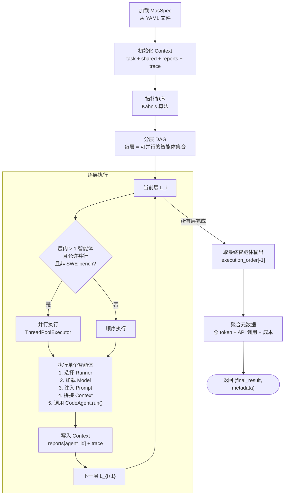
```mermaid
flowchart TB
    LOAD_SPEC["加载 MasSpec<br/>从 YAML 文件"]
    BUILD_CTX["初始化 Context<br/>task + shared + reports + trace"]
    TOPO_SORT["拓扑排序<br/>Kahn's 算法"]
    GET_LEVELS["分层 DAG<br/>每层 = 可并行的智能体集合"]

    LOAD_SPEC --> BUILD_CTX --> TOPO_SORT --> GET_LEVELS

    subgraph "逐层执行"
        LEVEL["当前层 L_i"]
        PARALLEL_CHECK{"层内 > 1 智能体<br/>且允许并行<br/>且非 SWE-bench?"}
        PAR_EXEC["并行执行<br/>ThreadPoolExecutor"]
        SEQ_EXEC["顺序执行"]
        RUN_AGENT["执行单个智能体<br/>1. 选择 Runner<br/>2. 加载 Model<br/>3. 注入 Prompt<br/>4. 拼接 Context<br/>5. 调用 CodeAgent.run()"]
        WRITE_CTX["写入 Context<br/>reports[agent_id] + trace"]
        NEXT_LEVEL["下一层 L_{i+1}"]

        LEVEL --> PARALLEL_CHECK
        PARALLEL_CHECK -->|"是"| PAR_EXEC
        PARALLEL_CHECK -->|"否"| SEQ_EXEC
        PAR_EXEC --> RUN_AGENT
        SEQ_EXEC --> RUN_AGENT
        RUN_AGENT --> WRITE_CTX
        WRITE_CTX --> NEXT_LEVEL
    end

    GET_LEVELS --> LEVEL
    NEXT_LEVEL --> LEVEL

    FINAL["取最终智能体输出<br/>execution_order[-1]"]
    META["聚合元数据<br/>总 token + API 调用 + 成本"]
    RESULT(["返回 (final_result, metadata)"])

    LEVEL -->|"所有层完成"| FINAL --> META --> RESULT

```

*Figure 4-4: MAS Runtime 执行引擎流程图。MasRuntime 采用 DAG 编译器模式：先从 MasSpec 的拓扑配置中通过 Kahn's 算法计算分层 DAG，然后逐层执行。同一层中多个智能体可并行执行（ThreadPoolExecutor），但 SWE-bench 任务强制顺序（避免文件系统冲突）。每个智能体执行后将其输出写入共享 Context，下游智能体从 Context 中获取上游输出作为输入。*

#### 执行引擎分析

**DAG 编译器的核心价值**：

1. **通用性**：不需要为每种 MAS 范式写不同的执行引擎。无论是 Peer Review 的创建→审查→修订链、Debate 的多轮迭代、还是通用拓扑的任意 DAG，同一个编译器按层级顺序执行即可。5 种范式的专用路径（`_execute_peer_review`, `_execute_debate`, `_execute_smoa`, `_execute_croto`）是语义层面的特殊逻辑，而非执行层面的不同调度。

2. **并行安全**：分层 DAG 天然保证了并行安全——同层智能体之间没有数据依赖，可以安全并行；跨层智能体通过 Context 传递数据，保证因果一致性。

3. **Context 传递机制**：上游智能体的输出通过 `context.add_report()` 写入 reports 字典，下游智能体在构建 prompt 时通过 `context['reports']` 获取。这是唯一的跨智能体通信机制，简洁但有效。

### 4.7 五种 MAS 范式拓扑结构图

展示了配置池中 5 种种子 MAS 配置的通信拓扑结构。


```mermaid
graph TB
    subgraph "Peer Review - 创建→审查→修订→聚合"
        direction TB
        PR_C1["creator1"]
        PR_C2["creator2"]
        PR_C3["creator3"]
        PR_R1["reviewer1"]
        PR_R2["reviewer2"]
        PR_R3["reviewer3"]
        PR_A["aggregator"]
        PR_C1 --> PR_R1
        PR_C2 --> PR_R1
        PR_C3 --> PR_R2
        PR_C1 --> PR_R3
        PR_C2 --> PR_R3
        PR_C3 --> PR_R1
        PR_R1 --> PR_A
        PR_R2 --> PR_A
        PR_R3 --> PR_A
    end

    subgraph "Debate - 多轮辩论"
        direction TB
        DB_D1["debater1"]
        DB_D2["debater2"]
        DB_D3["debater3"]
        DB_A["aggregator"]
        DB_D1 --> DB_A
        DB_D2 --> DB_A
        DB_D3 --> DB_A
    end

    subgraph "Majority Vote - 并行投票"
        direction TB
        MV_W1["worker1"]
        MV_W2["worker2"]
        MV_W3["worker3"]
        MV_W4["worker4"]
        MV_W5["worker5"]
        MV_W6["worker6"]
        MV_A["aggregator"]
        MV_W1 --> MV_A
        MV_W2 --> MV_A
        MV_W3 --> MV_A
        MV_W4 --> MV_A
        MV_W5 --> MV_A
        MV_W6 --> MV_A
    end

    subgraph "SMoA - 稀疏混合智能体"
        direction TB
        SM_P1["processor L1-1"]
        SM_P2["processor L1-2"]
        SM_P3["processor L1-3"]
        SM_J["judge"]
        SM_M["moderator"]
        SM_AG["aggregator"]
        SM_P1 --> SM_J
        SM_P2 --> SM_J
        SM_P3 --> SM_J
        SM_J --> SM_M
        SM_M --> SM_AG
    end

    subgraph "CROTO - 跨团队编排"
        direction TB
        CT_T1["team_worker 1<br/>Team A"]
        CT_T2["team_worker 2<br/>Team A"]
        CT_T3["team_worker 3<br/>Team B"]
        CT_T4["team_worker 4<br/>Team B"]
        CT_A["aggregator"]
        CT_T1 --> CT_A
        CT_T2 --> CT_A
        CT_T3 --> CT_A
        CT_T4 --> CT_A
    end
```

*Figure 4-5: 五种 MAS 范式拓扑结构图。Peer Review（左上）是三阶段流水线，创建者并行产出方案→审查者交叉评审→修订者整合反馈→聚合者最终输出。Debate（右上）是多轮辩论，辩论者独立/迭代回应后聚合。Majority Vote（左下）是并行投票，多 worker 独立解答后聚合者取多数。SMoA（右下中）是稀疏混合，多层处理器并行→Judge 选 top-k→Moderator 早停。CROTO（右下）是跨团队编排，多团队并行→层级聚合。*

#### 拓扑分析

**拓扑多样性是进化搜索的基础**：

- **链式拓扑**（Peer Review）：信息单向流动，每阶段聚焦特定功能，适合需要严格质量控制的任务
- **并行拓扑**（Majority Vote）：所有 worker 独立处理同一任务，聚合者汇总，适合答案空间较大的任务
- **迭代拓扑**（Debate）：多轮交互修正观点，适合需要深度推理的任务
- **过滤拓扑**（SMoA）：Judge 在大量候选中筛选最有价值的，Moderator 判断是否足够好可以早停，适合需要高效利用 compute 的任务
- **分组拓扑**（CROTO）：团队内并行、团队间聚合，适合需要多视角探索的任务

进化过程中元模型可以从这些种子拓扑出发，通过变异 topology 或交叉继承拓扑，探索初始池中不存在的新拓扑结构（论文发现进化后智能体数量缩减约 70%，说明进化倾向于简化拓扑）。

### 4.8 变异与交叉操作详细流程图

展示了论文中两种核心进化操作的具体执行逻辑。

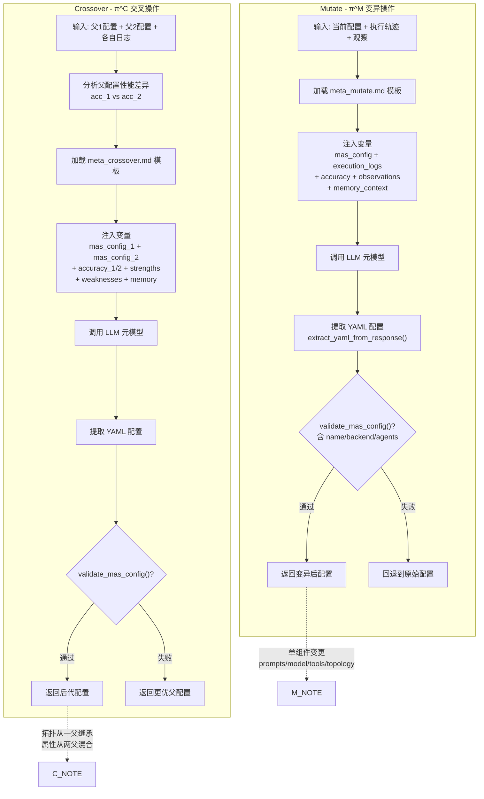
```mermaid
flowchart TB
    subgraph "Mutate - π^M 变异操作"
        direction TB
        M_INPUT["输入: 当前配置 + 执行轨迹 + 观察"]
        M_LOAD["加载 meta_mutate.md 模板"]
        M_INJECT["注入变量<br/>mas_config + execution_logs<br/>+ accuracy + observations<br/>+ memory_context"]
        M_CALL["调用 LLM 元模型"]
        M_EXTRACT["提取 YAML 配置<br/>extract_yaml_from_response()"]
        M_VALIDATE{"validate_mas_config()?<br/>含 name/backend/agents"}
        M_RETURN["返回变异后配置"]
        M_FALLBACK["回退到原始配置"]

        M_INPUT --> M_LOAD --> M_INJECT --> M_CALL --> M_EXTRACT --> M_VALIDATE
        M_VALIDATE -->|"通过"| M_RETURN
        M_VALIDATE -->|"失败"| M_FALLBACK
    end

    subgraph "Crossover - π^C 交叉操作"
        direction TB
        C_INPUT["输入: 父1配置 + 父2配置 + 各自日志"]
        C_ANALYZE["分析父配置性能差异<br/>acc_1 vs acc_2"]
        C_LOAD2["加载 meta_crossover.md 模板"]
        C_INJECT2["注入变量<br/>mas_config_1 + mas_config_2<br/>+ accuracy_1/2 + strengths<br/>+ weaknesses + memory"]
        C_CALL2["调用 LLM 元模型"]
        C_EXTRACT2["提取 YAML 配置"]
        C_VALIDATE2{"validate_mas_config()?"}
        C_RETURN["返回后代配置"]
        C_BETTER["返回更优父配置"]

        C_INPUT --> C_ANALYZE --> C_LOAD2 --> C_INJECT2 --> C_CALL2 --> C_EXTRACT2 --> C_VALIDATE2
        C_VALIDATE2 -->|"通过"| C_RETURN
        C_VALIDATE2 -->|"失败"| C_BETTER
    end

    M_RETURN -.->|"单组件变更<br/>prompts/model/tools/topology"| M_NOTE
    C_RETURN -.->|"拓扑从一父继承<br/>属性从两父混合"| C_NOTE

```

*Figure 4-6: 变异与交叉操作详细流程图。变异操作（左侧）的核心约束是"每次仅修改一种组件类型"（四选一：prompts/model_id/tools/topology），保证变更可追踪、效果可隔离。交叉操作（右侧）的核心约束是"拓扑必须从单一父配置完整继承"，然后对每个智能体位置选择父1/父2或混合属性，保持结构连贯性。两者都有 YAML 提取→验证→回退的容错链。*

#### 操作设计分析

**变异的"单组件约束"**是 EvoMAS 最重要的设计决策之一：

- **为什么不是多组件同时变更？** 如果同时改 prompts + model_id + topology，就无法判断哪个变更导致了性能变化——因果性断裂。单组件约束使得每个进化步是一个可控的实验：变更 X → 观察效果 Y，建立清晰的因果链。
- **但单组件变更可以跨多个智能体**：如果选择变异"prompts"，可以同时精调 worker 和 aggregator 的提示，实现系统级的连贯改进，而不是孤立的局部修改。
- **meta_mutate.md 模板要求输出根因分析**：LLM 必先分析"主要问题是什么"，再决定变异哪种组件，再描述具体变更，再预测改进效果。这种结构化推理链条比直接生成新配置更可靠。

**交叉的"拓扑继承约束"**同样关键：

- **为什么不能从两父各取部分拓扑？** 拓扑是 MAS 的骨架——如果把父1的 creator→reviewer 链和父2的 worker→aggregator 星形拼接，可能产生不连贯的架构（有的节点无输入、有的无输出）。完整继承一父拓扑保证后代的骨架是完整的。
- **属性混合的自由度**：拓扑确定后，每个智能体位置的 model_id、prompt、tools 可以自由从父1/父2/混合选择，这是"骨架保守、血肉自由"的平衡策略。

### 4.9 核心数据结构

#### 4.9.1 MasSpec — MAS 配置规范

整个 MAS 的定义入口，基于 Pydantic 实现类型验证：

```python
class MasSpec(BaseModel):
    name: str                     # MAS 名称
    description: Optional[str]    # 人类可读描述
    backend: str = "smolagents"   # 执行后端（smolagents/sweagent/minisweagent）
    agents: Dict[str, AgentSpec]  # 智能体规范字典（按 agent_id 索引）
    topology: RoutingConfig       # 通信拓扑（reports_to 映射）
    execution: ExecutionConfig    # 执行配置（并行、超时、范式参数）
```

关键方法：
- `get_execution_order()` → 拓扑排序后的执行顺序
- `get_execution_levels()` → DAG 分层（同层可并行）
- `get_worker_agents()`, `get_aggregator_agents()` 等 → 按角色筛选智能体

**ExecutionConfig** 承载范式参数（`debate_rounds`, `smoa_layers`, `peer_review_stages`, `croto_teams` 等），让同一数据结构适配 5 种 MAS 范式。

#### 4.9.2 AgentSpec — 智能体规范

```python
class AgentSpec(BaseModel):
    id: str                       # 唯一标识
    role: str                     # 角色（worker/aggregator/debater/reviewer/judge/...）
    agent_type: str = "CodeAgent" # 类型（CodeAgent/ToolCallingAgent/DefaultAgent/SWEAgent）
    model_id: str                 # backbone 模型（如 bedrock:us.anthropic.claude-3-5-sonnet-...）
    prompt: Optional[str]         # 提示模板名（如 reviewer_create）
    tools: List[str] = []         # 工具名列表（如 workbench_email）
    max_tokens: int = 4096        # 最大输出 token
    temperature: float = 0.7      # 采样温度
    backend: Optional[str]        # 智能体级后端覆盖
```

`AGENT_TYPE_TO_BACKEND` 映射表实现了 agent_type → backend 的自动推断（CodeAgent → smolagents, DefaultAgent → minisweagent, SWEAgent → sweagent），优先级：agent-level backend > agent_type 推断 > MAS-level backend。

#### 4.9.3 RoutingConfig — 通信拓扑

```python
class RoutingConfig(BaseModel):
    reports_to: Dict[str, List[str]]  # agent_id → [下游 agent_ids]
    edges: Optional[List[Dict]]       # 替代边表示（from → to）
```

核心算法：
- `get_execution_order()` → **Kahn's 拓扑排序**（BFS + 排序确保确定性）
- `get_execution_levels()` → **分层 Kahn's 算法**，每波零入度节点为一个并行层
- `get_dependencies(agent_id)` → 反查依赖（谁报告给此智能体）

#### 4.9.4 Context — 执行上下文

```python
class Context(BaseModel):
    task: str                     # 原始任务/查询
    shared: Dict[str, Any]        # 全局共享状态（跨智能体）
    reports: Dict[str, str]       # 各智能体输出（按 agent_id）
    artifacts: Dict[str, Any]     # 产物（文件、代码等）
    trace: List[Dict[str, Any]]   # 执行轨迹（调试+元模型反馈）
```

`add_report()` 同时写入 reports 和 trace（含 metadata），为元模型提供完整的执行反馈。

#### 4.9.5 ActionExperience + MemoryStore — 经验记忆

```python
@dataclass
class ActionExperience:
    query: str           # 任务描述
    action: str          # 操作类型（generate/mutate/crossover）
    config_changes: str  # 变更描述
    old_accuracy: float  # 操作前准确率
    new_accuracy: float  # 操作后准确率
    success: bool        # 是否改进
    analysis: str        # LLM 分析（为什么成功/失败）

class MemoryStore:
    experiences: List[ActionExperience]
    # 按操作类型筛选：get_by_action("mutate")
    # 按结果筛选：get_successful() / get_failed()
    # 格式化为提示上下文：to_context_string(max_experiences=5)
    # 持久化：save/load（JSON 文件）
```

`to_context_string()` 格式化最近 5 条经验为自然语言摘要，注入进化操作的提示模板。

#### 4.9.6 EvolutionTrace — 进化轨迹

```python
@dataclass
class EvolutionTrace:
    query: str                      # 当前任务
    operations: List[Dict]          # 操作序列（mutation/crossover）
    initial_accuracy: float         # 初始准确率
    final_accuracy: float           # 最终准确率
    best_config: str                # 最佳配置（YAML）
    improvement: float              # 准确率变化量
```

`consolidate_evolution_trace()` 函数将轨迹总结为精炼文本：统计 mutation/crossover 次数、识别最有效操作、提炼关键洞察。

### 4.10 核心模块分析

#### 4.10.1 MetaModel — 进化元模型（src/meta_model/metamodel.py）

这是 EvoMAS 的大脑，实现论文中的 π^S, π^M, π^C, π^U 四个进化操作器：

**初始化**：
```python
MetaModel(model_id, temperature=0.7, max_tokens=8192,
          memory_path=None, memory_evolution=True)
```
- 加载 LLM 模型（默认 Claude-4-Sonnet via Bedrock）
- 加载提示模板注册表（`PromptRegistry`，扫描 `templates/*.md`）
- 加载/初始化经验记忆（`MemoryStore`）

**Select 操作** (`select()`):
1. 加载池元数据（优先使用 `MASIndex` 丰富元数据，否则从 YAML 文件提取）
2. 渲染 `meta_select` 模板：注入任务查询、池描述、经验记忆
3. 调用 LLM，解析 JSON 输出提取选中的配置名
4. 验证选中名是否存在于池中
5. 失败回退到程序化选择（`selection_operator()`）

**Mutate 操作** (`mutate()`):
1. 渲染 `meta_mutate` 模板：注入当前配置、执行日志、观察、经验记忆
2. 调用 LLM，从响应中提取 YAML 配置（`extract_yaml_from_response()`）
3. 验证新配置（`validate_mas_config()`：必须含 name/backend/agents）
4. 验证失败则回退到原始配置

**关键约束**（来自 meta_mutate.md 模板）：
- **每次变异仅修改一种组件类型**：prompts / model_id / tools / topology
- 不增删智能体，不变 name/backend
- 需输出根因分析、组件选择、变更详情

**Crossover 操作** (`crossover()`):
1. 渲染 `meta_crossover` 模板：注入两个父配置、各自性能、日志
2. 调用 LLM，提取后代 YAML 配置
3. 验证失败则返回表现更好的父配置

**关键约束**（来自 meta_crossover.md 模板）：
- **必须从单一父配置继承完整拓扑**
- 对每个智能体位置，可从父1/父2/混合选择
- 不创建全新拓扑，不增删智能体位置
- 需输出交叉策略、拓扑选择理由、逐智能体选择说明

**Update Memory 操作** (`update_memory()`):
1. 比较新旧配置（`_compare_configs()`：检测增删智能体、模型变更、prompt 变更等）
2. 渲染 `meta_update_memory` 模板
3. 调用 LLM 分析操作结果
4. 创建 `ActionExperience`，存入 `MemoryStore`
5. 持久化到 JSON 文件

**YAML 提取** (`extract_yaml_from_response()`):
- 优先匹配 ````yaml ... ```` 代码块
- 其次匹配 "Updated Configuration:" / "Offspring Configuration:" 标记后的 YAML
- 最后尝试解析整个响应为 YAML

**配置验证** (`validate_mas_config()`):
- YAML 解析成功
- 必含 `name`, `backend`, `agents` 字段
- `agents` 必须是非空字典

#### 4.10.2 ConfigurationPool — 配置池管理（src/meta_model/pool.py）

```python
class ConfigurationPool:
    pool_dir: Path  # YAML 配置文件目录

    add_configuration(config_yaml, name, description, successful_tasks, metadata)
    update_configuration(config_path, successful_tasks, metadata)
    get_configurations()  # 返回所有 YAML 文件路径
    remove_configuration(config_path)
    backup_pool(backup_dir)
```

**池更新逻辑** (`should_update_pool()` + `add_to_pool_if_better()`):
- 新配置加入条件：`R(C_new) > max(R(C_parents)) + threshold`（threshold=0.01）
- 计算奖励 `compute_reward(new_metrics, beta=1e-6)`
- 加入时保存 YAML、记录成功任务、存储元数据（reward, accuracy, evolution_source）

池目录结构示例（BBEH）：
```
mas_pools/bbeh/
├── peer_review.yaml      # 种子配置
├── debate.yaml           # 种子配置
├── majority_vote.yaml    # 种子配置
├── croto.yaml            # 种子配置
├── smoA.yaml             # 种子配置
├── single_codeagent.yaml # 种子配置
├── evolved_20260423_*.yaml  # 进化产生的配置
├── mas_index.json        # 元数据索引
```

#### 4.10.3 MASIndex — 池元数据索引（src/meta_model/mas_index.py）

```python
class MASIndex:
    pool_dir: Path
    index_path: Path  # mas_index.json
    index: Dict[str, Dict]  # name → 元数据字典
```

每个索引条目包含：
```json
{
  "path": "mas_pools/bbeh/peer_review.yaml",
  "name": "peer_review_bbeh",
  "description": "DAG-unrolled peer review for BBEH tasks",
  "num_agents": 10,
  "agent_roles": ["creator1(creator)", "reviewer1(reviewer)", ...],
  "agent_models": ["bedrock:us.anthropic.claude-3-5-sonnet-..."],
  "topology_edges": ["creator1→reviewer1", "reviewer1→aggregator"],
  "structure_summary": "10 agents [6×creator, 3×reviewer, aggregator], chain/tree",
  "solved_tasks": [...],    // 最近 20 个成功任务
  "total_queries": 15,
  "total_wins": 8,
  "avg_accuracy": 0.384,
  "avg_tokens": 25000,
  "avg_time_seconds": 12.5,
  "source": "seed"
}
```

核心方法：
- `record_query_result()` — 记录查询结果，更新运行平均，最多保留 20 条成功任务
- `get_selection_context()` — 格式化为 Select 操作的提示上下文（按胜率+准确率排序，最多 20 个）
- `_make_structure_summary()` — 自动生成结构摘要（角色计数 + 拓扑分类）

#### 4.10.4 Reward — 奖励函数（src/meta_model/reward.py）

论文公式 $R(C, q) = \text{Metrics}(C, q) - \beta \cdot \text{Cost}(C)$ 的实现：

```python
def compute_reward(metrics, beta=1e-6, cost_weight="both"):
    accuracy = metrics.get('accuracy', 0.0)
    # Cost = total_tokens + 1000 * total_time (when cost_weight="both")
    cost = total_tokens + 1000 * total_time
    reward = accuracy - beta * cost
```

辅助函数：
- `compare_configurations()` — 比较两个配置的奖励（返回 1/-1/0）
- `should_add_to_pool()` — 判断是否应加入池（reward 差 > threshold）
- `select_best_configuration()` — 从列表中选择最高奖励配置
- `compute_reward_with_details()` — 返回奖励分解（accuracy, cost, penalty, breakdown）

$\beta = 10^{-6}$ 的选择：Metrics 范围 [0, 100]，Cost 范围 [100K–32M]，$\beta \cdot 10^6 \approx 0.1\text{–}32$，使得成本惩罚占 accuracy 的 0.1%–32%，保持性能优先但惩罚极端高成本方案。

#### 4.10.5 Selection — 选择操作器（src/meta_model/selection.py）

两种选择策略：

**程序化选择** (`selection_operator()`):
- 计算 Jaccard 相似度（任务查询 vs 配置成功任务的 token overlap）
- 按相似度排序，取 top-k

**多样性选择** (`select_with_diversity()`):
- 先取最相似配置
- 后续选择平衡相似度 + 拓扑多样性（智能体数量差异）
- `diversity_weight=0.3`（70% 相似度 + 30% 多样性）

**LLM 选择**（MetaModel.select()）:
- 注入 MASIndex 的丰富元数据到 meta_select 模板
- LLM 分析任务需求，考虑任务相似度、智能体能力、多样性、历史表现
- 输出 JSON 格式的选中配置名
- 失败回退到程序化选择

#### 4.10.6 MasRuntime — DAG 执行引擎（src/mas/runtime.py）

这是 EvoMAS 最复杂的模块，实现了**拓扑驱动的通用执行引擎**：

```python
class MasRuntime:
    mas_spec: MasSpec
    _runners: Dict[str, BaseAgentRunner]  # 按 backend+config 缓存执行器

    def run(task) → (final_result, metadata):
        # 1. 初始化 Context
        # 2. 获取执行顺序（拓扑排序）
        # 3. DAG 编译执行
        # 4. 返回最终结果 + 聚合元数据
```

**DAG 编译器** (`_execute_dag()`):
1. 拓扑分层（`get_execution_levels()`）
2. 逐层执行：
   - 多智能体层 → 并行（ThreadPoolExecutor）
   - 单智能体层 → 顺序
   - SWE-bench 任务 → 强制顺序（避免文件系统冲突）
3. 每个智能体执行后写入 Context（reports + trace）

**5 种 MAS 范式的专用执行路径**：

| 范式 | 方法 | 流程 |
|------|------|------|
| Peer Review | `_execute_peer_review()` | Create → Review → Revise 三阶段 |
| Debate | `_execute_debate()` | 多轮辩论（初始响应 → 基于他人响应迭代修订） |
| SMoA | `_execute_smoa()` | 多层 Processor 并行 → Judge 选 top-k → Moderator 早停检查 |
| CROTO | `_execute_croto()` | 多团队并行 → 层级聚合（partition_size 分组 → Aggregator 归并） |
| 通用 DAG | `_execute_dag()` | 拓扑层级顺序 + 层内并行 |

**Peer Review 执行细节**：
- Stage 1 (Create)：所有 reviewer 并行生成初始方案
- Stage 2 (Review)：每个 reviewer 交叉审查所有其他 reviewer 的方案
- Stage 3 (Revise)：所有 reviewer 并行修订（整合收到的评审意见）

**SMoA 执行细节**：
- 每层：所有 Processor 并行处理（带上一层的 selected_responses）
- Judge 评估所有 Processor 输出，选 top-k
- Moderator 检查是否达到共识（可早停）

**CROTO 执行细节**：
- 每阶段：所有 team_worker 并行工作（带前一阶段的聚合方案）
- 层级聚合：按 partition_size 分组 → Aggregator 归并 → 循环直到只剩一个方案

#### 4.10.7 Model 统一接口（src/models/model.py）

支持 5 种 LLM 提供商的统一封装，所有模型都实现 `__call__(prompt) → str` + `generate(messages) → ChatMessage` + `get_cumulative_token_usage()` 接口：

| 提供商 | 类 | API 格式 | 特殊处理 |
|--------|-----|---------|---------|
| AWS Bedrock | `BedrockSmolagentsModel` | Anthropic: Messages API; 其他: Converse API | Claude 4.x 不允许同时设 temperature+top_p；Qwen 不支持 stopSequences |
| OpenAI | `OpenAIModel` | Chat Completions API | 支持 reasoning_tokens（o1 系列）；max_retries=10 |
| Anthropic 直连 | `AnthropicAPIModel` | Messages API | 支持 streaming（`messages.stream()`） |
| Azure OpenAI | `AzureOpenAIModel` | Claude: Anthropic REST path; OpenAI: Azure SDK | 自动按模型名选择 endpoint/key；gpt-5/o1/o3 使用 max_completion_tokens |
| Google Gemini | `GoogleGeminiModel` | Google Genai SDK | system_instruction 作为 GenerateContentConfig 参数 |

**BedrocksmolagentsModelWrapper**（关键设计）：
- 用 boto3 直接调用 Bedrock API，**绕过 smolagents 库的 tool_calls bug**
- Anthropic 模型用 `invoke_model`（Messages API）
- 非 Anthropic 模型用 `converse`（Converse API）
- 累计 token 追踪：`_cumulative_input_tokens` / `_cumulative_output_tokens`

**MockSmolagentsModel**（兼容层）：
- 所有非 Bedrock 模型都创建 MockSmolagentsModel 包装
- 实现 smolagents 的 `generate(messages)` 接口
- 通过 `parent` 引用回到实际模型类调用 API

#### 4.10.8 SmolagentsRunner — 智能体执行器（src/agents/runners/smolagents.py）

核心逻辑 `run(spec, task, context)`:
1. **任务类型检测**：SWE-bench（含 "Repository:" + "diff --git"）→ 特殊处理
2. **SWE-bench 工具注入**：动态创建 `read_file`, `list_files`, `search_in_files` 三种工具
3. **WorkBench 工具注入**：按 spec.tools 中的工具名加载域专用工具集
4. **WorkBench 系统提示**：自动加载 `system_prompt.txt` 前置到任务
5. **上下文拼接**：将其他智能体的 reports 附加到任务末尾
6. **调用 CodeAgent.run()**：smolagents 的 CodeAgent 执行代码生成+验证循环
7. **Token 追踪**：从 model.parent 获取累计 token 使用量
8. **SWE-bench 清理**：执行前后 `git reset --hard` + `git clean -fd`

#### 4.10.9 提示模板系统（src/prompts/）

**PromptRegistry**：扫描 `templates/*.md` 目录，以文件名为模板名自动加载所有模板。

**render_prompt()**：简单 `{{variable}}` 替换语法，不支持条件/循环（保持简洁）。

**30+ 模板文件分类**：

| 类别 | 模板名 | 用途 |
|------|--------|------|
| **进化操作** | meta_select, meta_mutate, meta_crossover, meta_generate, meta_update_memory | 元模型的 5 种操作提示 |
| **通用角色** | worker, judge, moderator, aggregator, processor, team_worker | 通用 MAS 角色提示 |
| **Peer Review** | reviewer_create, reviewer_review, reviewer_revise | 三阶段提示 |
| **Debate** | debater_initial, debater_round | 两阶段提示 |
| **SMoA** | smoa_aggregator | 稀疏混合聚合 |
| **MetaGPT** | metagpt_product_manager, metagpt_architect, metagpt_project_manager, metagpt_qa_engineer | 4 种角色 |
| **ChatDev** | chatdev_ceo, chatdev_cto, chatdev_reviewer, chatdev_tester | 4 种角色 |
| **WorkBench** | workbench/system_prompt.txt | 前置系统指令 |

**meta_mutate.md 关键约束**（论文核心设计的代码体现）：
- "Select EXACTLY ONE component type to mutate"
- 四选一：prompts / model_id / tools / topology
- "DO NOT modify multiple component types simultaneously"
- 输出格式要求：根因分析 → 组件选择 → 变更详情 → 新配置 → 预期改进

**meta_crossover.md 关键约束**：
- "You MUST inherit the ENTIRE topology from EXACTLY ONE parent"
- 逐智能体选择：Parent 1 / Parent 2 / Hybrid
- 输出格式要求：交叉策略 → 拓扑选择 → 逐智能体选择说明 → 后代配置 → 理由

### 4.11 进化管道主流程（main.py）

`run_evolution_pipeline()` 是完整的 EvoMAS 算法实现：

```
┌──────────────────────────────────────────────────┐
│ run_evolution_pipeline()                          │
│                                                   │
│  输入: dataset_name, pool_dir, max_steps, ...    │
│                                                   │
│  1. 参数验证 + 内存路径自动解析                   │
│  2. 批次划分（task_ids → chunks of batch_size）   │
│  3. 并行/串行执行各批次                           │
│     └── _run_single_batch()                       │
│         ├── 初始化 MetaModel + Pool + MASIndex    │
│         ├── 加载数据集                             │
│         ├── 对每个任务:                            │
│         │   ├── Select: 从池选 k 个父配置         │
│         │   ├── 执行父配置，获取初始准确率         │
│         │   ├── 进化循环（max_steps 步）:          │
│         │   │   ├── 随机选 mutation(80%) 或       │
│         │   │   │   crossover(20%)                │
│         │   │   ├── 执行新配置                     │
│         │   │   ├── 计算奖励 R = acc - β*cost     │
│         │   │   ├── 若奖励 > 最佳 → 更新最佳      │
│         │   │   └── Update Memory                 │
│         │   ├── 最佳配置最终执行                   │
│         │   ├── 若奖励 > 父配置 + threshold       │
│         │   │   → 加入池                           │
│         │   └── 更新 MASIndex                     │
│         └── 返回结果字典                           │
│  4. 聚合批次结果（加权平均）                       │
│  5. 返回总体结果                                  │
└──────────────────────────────────────────────────┘
```

**核心参数**：
- `MUTATION_PROB = 0.8` — 80% 概率变异，20% 概率交叉
- `BETA = 1e-6` — 成本惩罚系数
- `IMPROVEMENT_THRESHOLD = 0.05` — 池更新门槛（5% 奖励改进）
- `batch_size = 1` — 默认 per-query 优化（论文核心设定）
- `workers = 16` — 并行批次数

**内存路径自动解析**：按数据集类型自动选择目录（BBEH → `dataset/bbeh/benchmark_tasks/<subset>/`, WorkBench → `dataset/workbench/<domain>/`），每次运行生成带时间戳的内存文件。

### 4.12 论文-代码对应关系

| 论文概念 | 代码实现 | 文件位置 |
|---------|---------|---------|
| MAS 配置 C = (G, {A_i}, V_in, V_out) | `MasSpec` (agents + topology + execution) | `src/mas/spec.py:31` |
| 通信图 G = (V, E) | `RoutingConfig` (reports_to 映射) | `src/topology/routing.py:9` |
| 智能体 A_i = (b_i, p_i, Γ_i) | `AgentSpec` (model_id + prompt + tools) | `src/agents/spec.py:34` |
| 选择操作 π^S | `MetaModel.select()` + `selection_operator()` | `src/meta_model/metamodel.py:161` / `selection.py:88` |
| 变异操作 π^M | `MetaModel.mutate()` + `meta_mutate.md` | `src/meta_model/metamodel.py:420` |
| 交叉操作 π^C | `MetaModel.crossover()` + `meta_crossover.md` | `src/meta_model/metamodel.py:507` |
| 记忆整合 π^U | `MetaModel.update_memory()` + `consolidate_evolution_trace()` | `src/meta_model/metamodel.py:610` / `experience.py:161` |
| 奖励函数 R(C,q) | `compute_reward()` | `src/meta_model/reward.py:15` |
| 配置池 C̄_t | `ConfigurationPool` + `MASIndex` | `src/meta_model/pool.py:20` / `mas_index.py:19` |
| MAS 执行 | `MasRuntime.run()` → DAG 编译器 | `src/mas/runtime.py:112` |
| LLM-as-judge | `llm_as_judge.py` + JUDGE_MODEL 参数 | `src/dataset/llm_as_judge.py` |
| 异构模型选择 | `model_list` 参数 + YAML 中的 model_id 字段 | `main.py:52-56` |
| 进化管道 | `run_evolution_pipeline()` + `_run_single_batch()` | `main.py:154` / `main.py:370` |

### 4.13 代码质量评估

**优点**：

1. **模块化清晰**：6 个独立模块（mas, meta_model, agents, topology, prompts, models），每个模块职责明确
2. **Pydantic 类型系统**：MasSpec/AgentSpec/RoutingConfig/Context 全部使用 Pydantic BaseModel，提供自动验证和序列化
3. **提示模板分离**：所有提示以 Markdown 文件独立存储，修改提示不影响代码逻辑
4. **多提供商兼容**：5 种 LLM 提供商统一接口，支持 Bedrock/OpenAI/Anthropic/Azure/Gemini
5. **容错设计**：LLM 选择失败回退程序化选择；变异/交叉失败回退父配置；配置验证拒绝无效 YAML
6. **多范式支持**：一个 MasRuntime 支持 5 种 MAS 范式（Peer Review/Debate/SMoA/CROTO/通用 DAG）

**不足**：

1. **main.py 过大**：46KB 约 900 行，进化管道逻辑与参数定义混在同一文件，可拆分为 config + pipeline + cli
2. **缺少类型注解一致性**：部分函数返回 `Dict[str, Any]` 过于宽泛，缺少结构化返回类型
3. **测试缺失**：仓库中没有单元测试目录，核心逻辑（拓扑排序、奖励计算、YAML 提取）缺少自动化验证
4. **token 追踪复杂**：BedrocksmolagentsModelWrapper vs MockSmolagentsModel vs 直接模型的 token 追踪逻辑分散
5. **异步兼容 hack**：多处 `asyncio.get_event_loop()` + `run_until_complete()` 的同步/异步桥接，容易在不同 Python 版本出错
6. **WorkBench 工具名硬编码**：工具名到工具集的映射在 SmolagentsRunner 中硬编码（workbench_email → get_all_email_tools()），应使用工具注册表

### 4.14 复现指南

**环境准备**：
```bash
conda create -n mas python=3.11 -y
conda activate mas
pip install -r requirements.txt
cp .env.example .env  # 配置 API keys
```

**数据下载**：
```bash
scripts/prepare_datasets.sh          # 全量下载（含 SWE-bench 源码仓库）
scripts/prepare_datasets.sh --bbeh-only  # 仅 BBEH
scripts/prepare_datasets.sh --skip-repos # 跳过大型仓库克隆
```

**运行示例**：
```bash
# 最小测试（1 个任务，1 步进化，1 worker）
NUM_EVAL_TASKS=1 MAX_STEPS=1 WORKERS=1 scripts/run_bbeh.sh mini

# 标准运行（BBEH mini，默认参数）
scripts/run_bbeh.sh mini

# WorkBench email 子域
scripts/run_swebench.sh verified

# 自定义模型
AGENT_MODELS="bedrock:us.anthropic.claude-3-5-sonnet-..." scripts/run_bbeh.sh mini
```

**输出结构**：
```
output_paper/{dataset}_main/
├── {config_name}_{model_id}/  # 每个配置的输出目录
│   ├── task_{id}.txt          # 各任务输出
│   └── summary.json           # 汇总统计
```

---

## 五、实验结果

### 5.1 基准与设置

| 基准 | 描述 | 任务数 |
|------|------|--------|
| **BBEH** | Google DeepMind, 23 子集, 多步推理+工具 | bbeh_mini: 460 任务 |
| **SWE-Bench** | 真实软件工程任务 | Lite: 300 / Verified: 500 |
| **WorkBench** | 真实职场任务（邮件、日程、分析等） | 6 子域 |
| **AIME 2024-2025** | 数学推理 | 附录报告 |

**骨干模型**：Claude-3.5-Sonnet, Qwen3-235B, Qwen3-Coder-480B；+ 自动 LLM 选择
**元模型**：Claude-4-Sonnet（默认）；测试 Claude-4.5-Sonnet, Qwen3-235B

### 5.2 主要结果

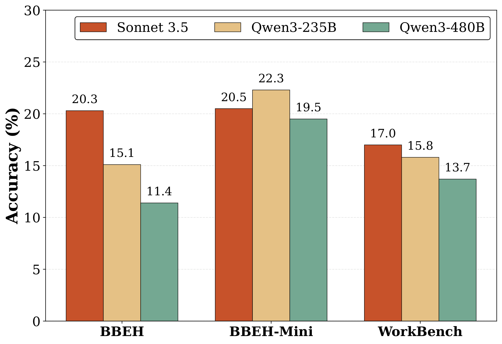

*Figure 2: Direct LLM 调用与各方法的性能对比。展示了不同 backbone 模型（Claude-3.5-Sonnet、Qwen3-235B、Qwen3-Coder-480B）下各方法的准确率，EvoMAS (LLM-Selection) 在所有基准上都显著超越其他方法。*

| 方法 | BBEH (C-3.5S/Q-235B/Q-480B) | WorkBench (同) | SWE-Verified (同) |
|------|------|------|------|
| Direct LLM | 20.3/15.1/11.4 | 17.0/15.8/13.7 | — |
| Single Agent | 33.2/37.8/27.4 | 40.1/35.6/30.1 | 33.6/50.2/56.4 |
| Peer Review | 38.4/46.2/36.0 | 32.3/30.8/28.5 | 35.6/39.4/41.2 |
| MetaGPT | — | — | 40.9/44.3/43.8 |
| MAS-GPT | 18.9/12.1/18.2 | 14.4/18.1/20.6 | 3.1/7.6/9.4 |
| ADAS | 22.7/32.4/28.6 | 39.2/33.1/31.2 | 29.9/34.6/39.1 |
| EvoAgent | 48.2/43.5/36.7 | 41.8/36.2/33.4 | 36.1/51.8/53.3 |
| **EvoMAS (per-LLM)** | 44.5/52.8/43.0 | 44.5/39.7/35.0 | 42.7/54.2/60.4 |
| **EvoMAS (LLM-Selection)** | **58.7** | **48.9** | **63.8** |

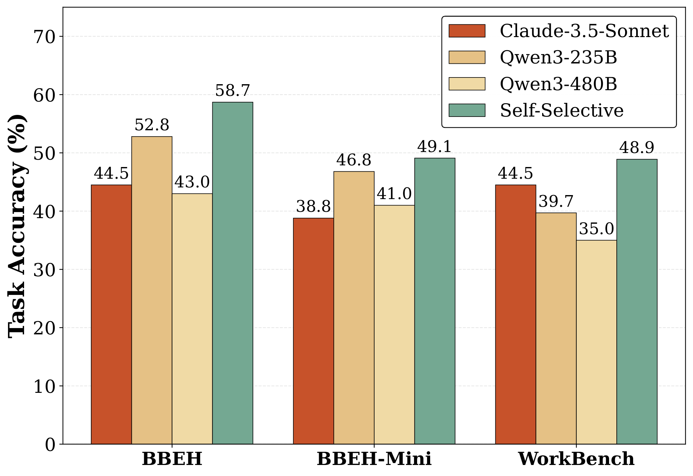

*Figure 3: 不同 backbone 模型下 EvoMAS 与各基线方法的性能对比。每个子图对应一个基准（BBEH、WorkBench、SWE-Bench-Verified），展示了 EvoMAS 在三种模型下都持续超越所有基线，且性能差距不随模型容量提升而缩小。*

**Claude-4.5-Sonnet 下**：EvoMAS 在 SWE-Bench-Verified 达到 **79.1%**，匹配当时排行榜榜首。

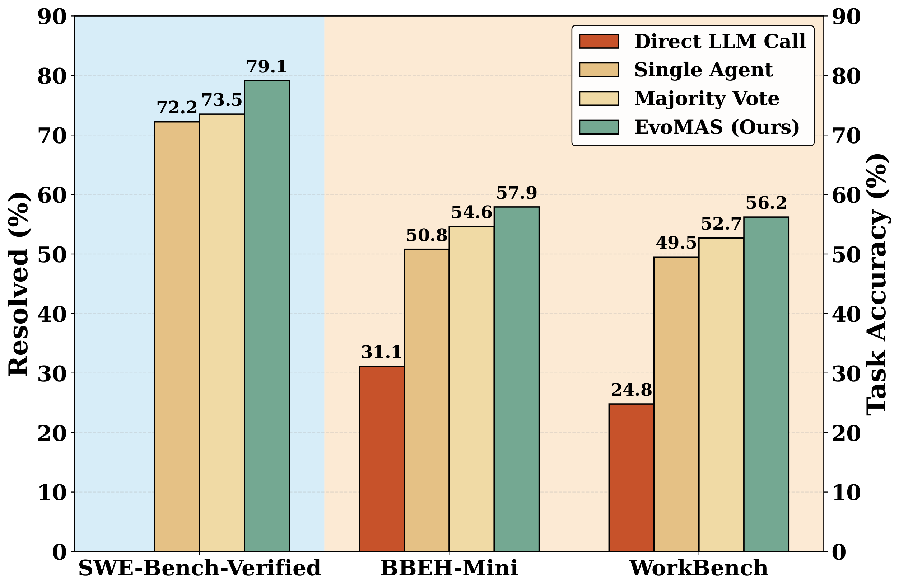

*Figure 3b: 使用 Claude-4.5-Sonnet 作为 backbone 模型的结果。EvoMAS 在 SWE-Bench-Verified 达到 79.1%，匹配当时排行榜榜首，超越所有人工设计和自动生成方法。*

### 5.3 执行可靠性

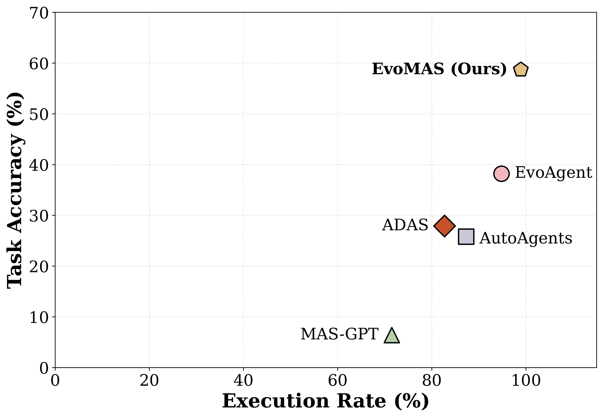

*Figure 4a: EvoMAS 与各基线方法在 BBEH 上的执行率对比。EvoMAS 达到 98.9% 的执行率，而 MAS-GPT 仅 71.5%，代码生成方法在可靠性上存在灾难性差距。*

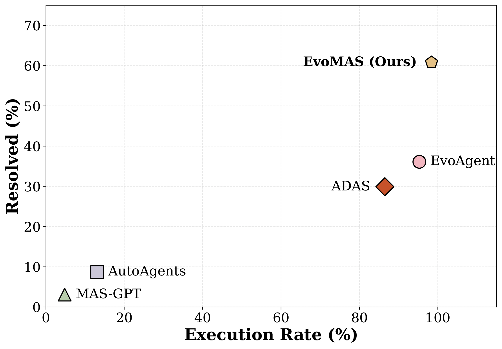

*Figure 4b: EvoMAS 在 SWE-Bench 上的执行率同样达到 98.4%，而 MAS-GPT 在 SWE-Bench-Lite 上仅有 1.2%——代码生成方法生成的系统几乎无法运行。*

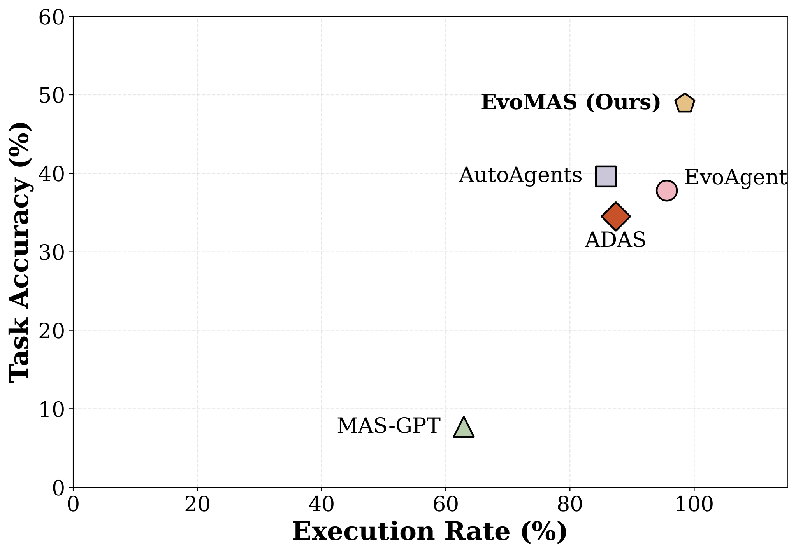

*Figure 4c: EvoMAS 在 WorkBench 上的执行率达到 98.5%，配置空间进化保证了近乎完美的执行可靠性。*

| 方法 | BBEH | WorkBench | SWE-Bench-Verified |
|------|------|-----------|-------------------|
| **EvoMAS** | **98.9%** | **98.5%** | **98.4%** |
| MAS-GPT | 71.5% | — | 1.2% (Lite) |
| ADAS | — | — | 较低 |

| 方法 | BBEH | WorkBench | SWE-Bench-Verified |
|------|------|-----------|-------------------|
| **EvoMAS** | **98.9%** | **98.5%** | **98.4%** |
| MAS-GPT | 71.5% | — | 1.2% (Lite) |
| ADAS | — | — | 较低 |

### 5.4 关键分析发现

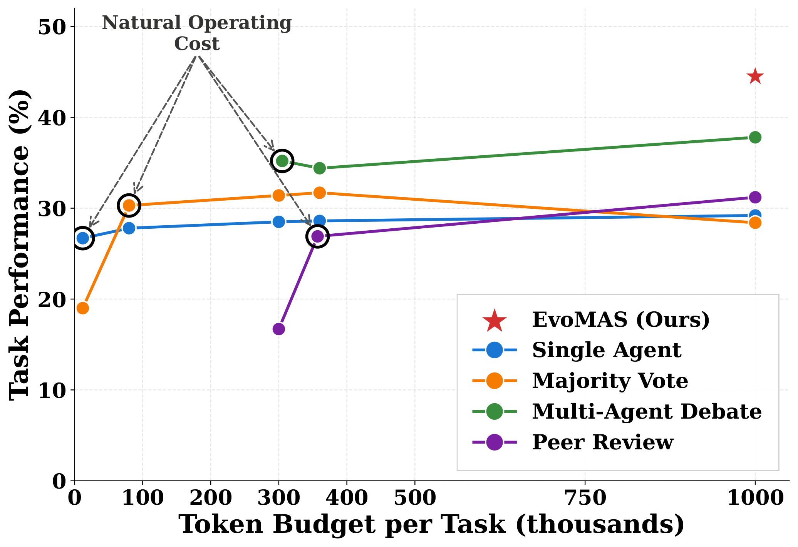

*Figure 5: EvoMAS 的 Test-time Compute Scaling 能力。随着进化步数增加，EvoMAS 的准确率持续上升，而 Single Agent 在约 1M token 后停滞在 ~29%。Best-of-N 即使使用 40M token 也仅达到 37.8%，而 EvoMAS 在 29M token 时已达 42.7%——进化式搜索的增益是结构性的，无法通过简单重复或 ensembling 实现。*

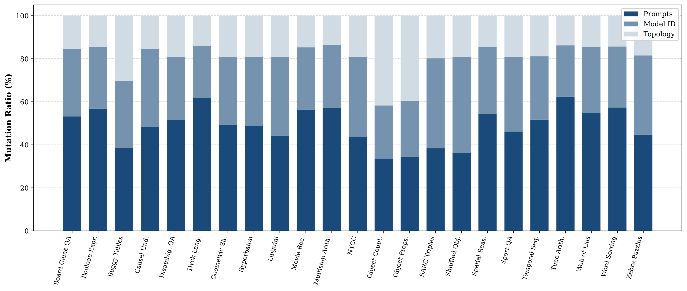

*Figure 6: 进化过程中不同变异类型的频率和效果分布。展示了每种变异类型（prompts、model_id、tools、topology）在进化轨迹中的占比和对应的效果大小，帮助理解哪种组件变更对性能影响最大。*

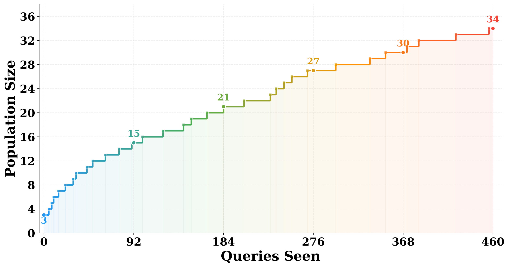

*Figure 7a: EvoMAS 在 BBEH 上进化过程中配置池的增长曲线。随着更多任务被处理，池从初始种子配置逐步扩展，积累了任务特化的高效配置，使得后续任务能够从更丰富的池中选择更合适的父配置。*

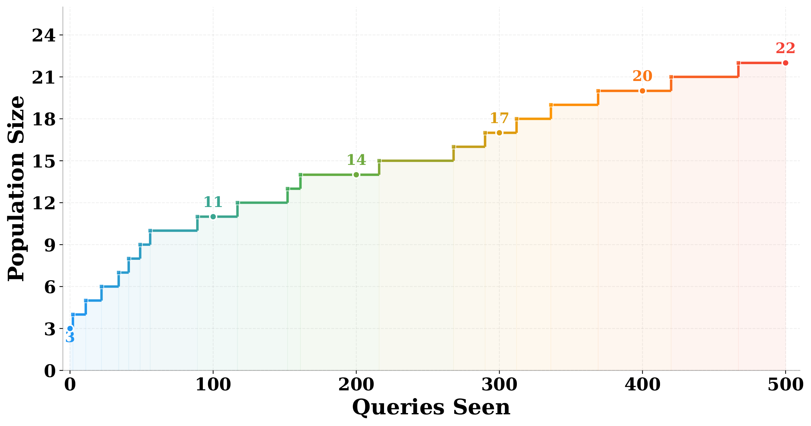

*Figure 7b: EvoMAS 在 SWE-Bench 上进化过程中配置池的增长曲线。与 BBEH 类似，池不断积累有效的配置，实现跨任务的知识迁移。*

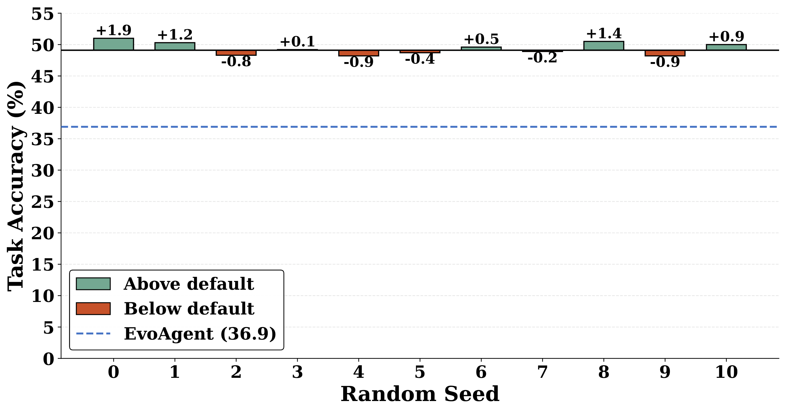

*Figure 8: EvoMAS 对不同种子配置的鲁棒性分析。展示了不同初始池配置下 EvoMAS 的最终性能，证明无论池的初始质量如何，进化都能持续改进。但高质量种子（默认池）提供了 15.6pp 的额外增益。*

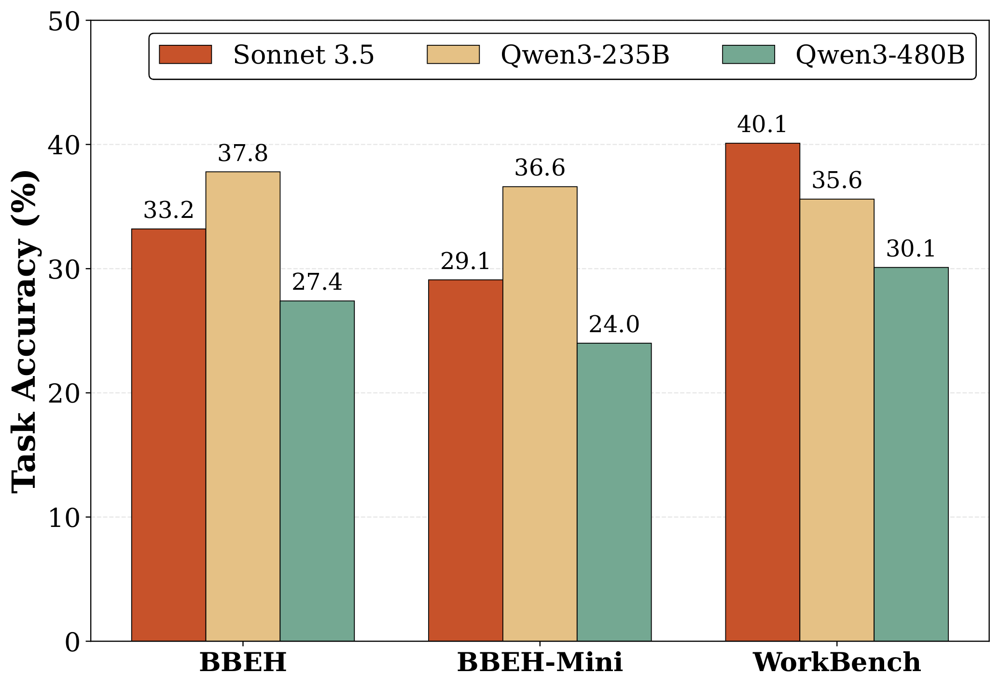

*Figure 9: EvoMAS 与 Single Agent 的性能对比（不含 SWE-Bench）。在 BBEH 和 WorkBench 上，EvoMAS 的 LLM-Selection 模式分别超越 Single Agent +25.5pp 和 +8.8pp，证明 MAS 架构优化的价值不仅来自模型能力提升，更来自系统层面的协同效应。*

1. **超越人工设计**：EvoMAS 58.7% > 最佳预定义 MAS Peer Review 46.2%（+12.5pp on BBEH）
2. **超越 EvoAgent**：+10.5pp on BBEH, +7.1pp on WorkBench
3. **执行可靠性**：近 100% 执行率 vs 代码生成方法的灾难性失败
4. **Test-time Compute Scaling**：进化式 MAS 生成提供原则性的 test-time compute scaling 机制
5. **涌现行为**：
   - 模型-角色亲和（更强推理模型被分配到验证角色）
   - 功能角色专业化（专用验证器和分解器涌现）
   - 新拓扑（初始池中不存在的新架构，智能体数量缩减约 70%）
6. **池的重要性**：高质量种子关键（+15.6pp vs 空池）
7. **元模型鲁棒性**：即使最弱元模型（Qwen3-235B: 58.2%）也大幅超越所有基线
8. **迁移能力**：单子任务优化后迁移到全基准，保留 90% 直接优化准确率
9. **查询顺序鲁棒**：±1.9%（std=1.1%，11 次随机 shuffle）

---

## 六、与相关方法的对比

### 6.1 与 EvoAgent 的关键差异

| 维度 | EvoAgent | EvoMAS |
|------|---------|--------|
| **进化单元** | 单个智能体（提示/角色） | **整个 MAS 配置** |
| **搜索空间** | 智能体级属性 | **架构级配置**（拓扑+智能体+工具） |
| **执行可靠性** | 受模板约束 | 近 100%（配置空间） |
| **记忆机制** | 无 | **经验记忆**（跨任务迁移） |
| **模型选择** | 固定 | **异构动态分配** |

### 6.2 与 ADAS/MAS-GPT 的关键差异

| 维度 | ADAS/MAS-GPT | EvoMAS |
|------|-------------|--------|
| **表示** | 可执行代码 | **结构化 YAML 配置** |
| **可执行性** | 低（1.2%-71.5%） | **近 100%** |
| **搜索范围** | 开放代码搜索 | **配置空间约束搜索** |
| **反馈条件化** | 有限 | **执行轨迹引导** |

### 6.3 范式定位

```
表达力 ←──────────────────────→ 约束力
  ADAS          EvoMAS         AutoAgents
  MAS-GPT                      EvoAgent
  (代码生成)    (配置进化)      (模板约束)
       ↑            ↑               ↑
   高表达力     表达力+可靠性     高可靠性
   低可靠性     双优             低表达力
```

EvoMAS 位于中间地带但**同时实现高表达力和高可靠性**——这是配置空间进化的核心贡献。

---

## 七、核心贡献与创新点

1. **配置空间范式**：首次将 MAS 生成形式化为结构化配置生成而非代码生成，消除可执行性失败
2. **反馈条件化进化操作**：变异和交叉由执行轨迹引导，而非随机扰动
3. **池-记忆双系统**：配置池 + 经验记忆实现跨任务知识迁移
4. **异构模型动态分配**：元模型在进化中为不同角色动态选择不同 backbone 模型
5. **Test-time Compute Scaling**：进化式搜索将 compute 分布到 MAS 系统层面而非单个智能体内
6. **SWE-Bench-Verified 79.1%**：匹配排行榜榜首的实践影响力

---

## 八、局限性与讨论

1. **初始池依赖**：高质量种子对性能至关重要（+15.6pp gain），空池表现显著下降
2. **进化开销**：每次查询需多步进化迭代，计算成本显著
3. **LLM-as-judge 偏差**：代理奖励虽鲁棒但仍存在偏差空间（Oracle 奖励仍有 +3pp 增益）
4. **单查询优化**：默认 batch_size=1（per-query），批量优化模式探索有限
5. **Amazon 内部模型**：实验主要基于 AWS Bedrock 模型，独立验证不足
6. **社区质疑**：79.1% SWE-Bench 结果引发排行榜游戏化讨论（任何 leaderboard entry 的常见关切）

---

## 九、可运行参数

| 参数 | 默认值 | 说明 |
|------|--------|------|
| MAX_STEPS | 2 | 每批次进化迭代次数 |
| NUM_PARENTS | 2 | 每批次选择的父配置数 |
| BATCH_SIZE | 1 | 每进化批次任务数（1=per-query） |
| WORKERS | 16 | 并行批次数 |
| META_MODEL | Claude-4.5-Sonnet | 进化操作器 LLM |
| JUDGE_MODEL | 同 META_MODEL | LLM-as-judge |
| AGENT_MODELS | C-3.5S, Q3-235B, Q3-Coder-480B | worker 模型空间 |
| MEMORY_EVOLUTION | true | 持久化记忆更新 |
| SEED | 42 | 随机种子 |

---

## 十、对我们研究的启示

### 10.1 与 Auto-Harness / Meta-Harness 的关系

EvoMAS 的"配置空间进化"思想与 Harness 系列工作有深刻联系：

- **Auto-Harness** 关注自动生成测试 harness，EvoMAS 关注自动生成 MAS 架构
- 两者都面对"代码生成不稳定"的问题，EvoMAS 用配置空间解决，Harness 用模板约束解决
- EvoMAS 的"进化操作"可类比 Harness 的"自适应调整"

### 10.2 可借鉴的设计

1. **配置优先**：在设计自动生成框架时，优先考虑配置/规范空间而非代码空间
2. **反馈条件化**：将执行轨迹/结果作为进化/调整的条件输入
3. **池-记忆机制**：维护候选池和经验记忆实现跨实例知识迁移
4. **异构模型分配**：不同子任务使用不同模型，而非全局单一模型
5. **DAG 编译器**：通用执行引擎按拓扑 DAG 执行，支持多种范式

### 10.3 未来方向

- 配置空间进化 + 程序化搜索的混合方法
- 经验记忆的更高效压缩与检索
- 多基准联合优化（而非 per-query 单基准）
- 配置空间的形式化验证与约束推理
- 更低成本元模型（小模型是否也能有效进化？）

---

## 参考链接

- [arXiv 论文](https://arxiv.org/abs/2602.06511)
- [GitHub 代码](https://github.com/amazon-science/EvoMAS)
- [微信博客](https://mp.weixin.qq.com/s/PD0VU2evqPzHHPRoVZAOow)

---

*代码引用已克隆至 `code-reference/` 子目录*
