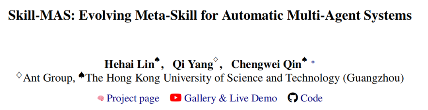
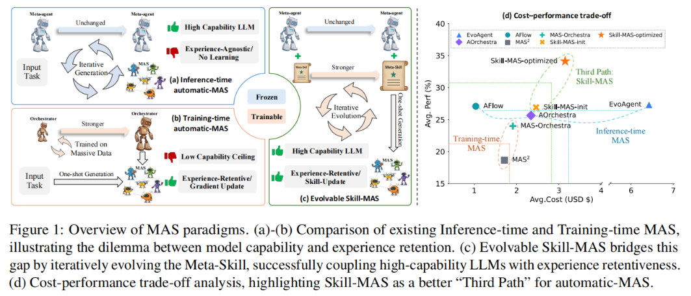
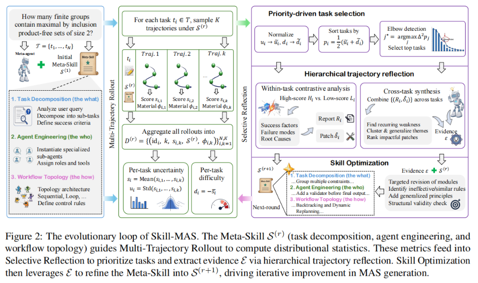
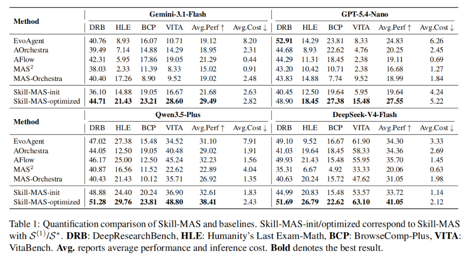
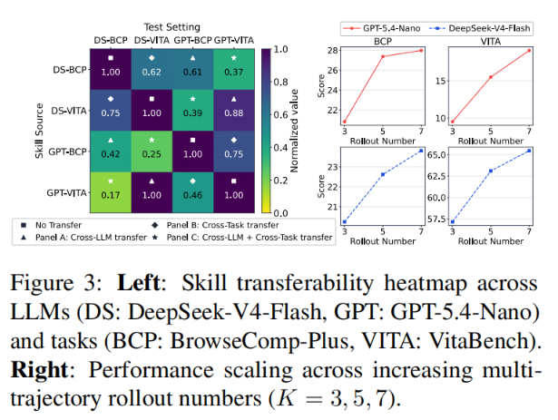
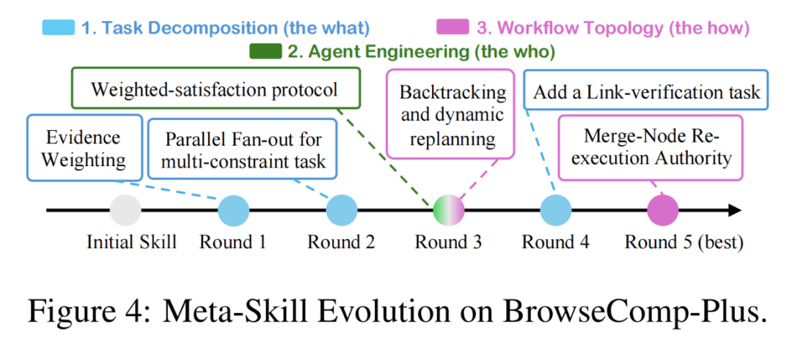
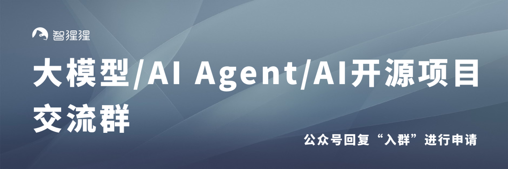

# DeepSeek-V4-Flash实测有效！蚂蚁参与提出Skill-MAS，将多智能编排经验沉淀为可进化元技能

Source: https://mp.weixin.qq.com/s/0zuj7y-N-VkhYv5jNp4AUg

# DeepSeek-V4-Flash实测有效！蚂蚁参与提出Skill-MAS，将多智能编排经验沉淀为可进化元技能

原创

关注AI智能体
关注AI智能体

[智猩猩AI](javascript:void(0);)

在小说阅读器读本章

去阅读

在小说阅读器中沉浸阅读

智猩猩AI整理

编辑：Felix

大模型正在把智能体从“单点问答”推向“多角色协作”。

面对深度研究、专家级数学推理、多跳问答、真实工具调用等复杂任务，一个模型往往很难独立完成全部环节。理想的方式是让多个智能体分工协作：有人负责拆解任务，有人负责检索，有人负责验证，有人负责整合答案。

但真正的问题是：多智能体系统到底该怎么自动设计？现有 automatic-MAS 大致分为两条路线。

（i）推理时编排，用冻结的前沿大模型反复搜索和优化多智能体架构。这类方法能力强，但每次都像从零开始，缺少经验累积机制。

（ii）训练时编排，通过微调较小模型，让模型学会生成多智能体系统。这类方法能把经验写进参数里，但受限于小模型能力上限，也很难迁移到更强的闭源前沿大模型上。

研究团队将这一矛盾概括为“模型能力”与“经验留存”之间的两难。

针对这一问题，蚂蚁集团与香港科技大学（广州）提出 Skill-MAS。它不更新大模型参数，而是把多智能体编排能力抽象成一种可进化的文本“元技能”（Meta-Skill），让冻结前沿 LLM 也能通过多轮执行、反思和修正，持续积累系统设计经验。

实验结果显示，Skill-MAS 在深度研究、专家级数学、多跳问答和真实工具调用四类复杂基准上取得显著提升，并在性能与成本之间实现更优平衡。

* 论文标题：

  Skill-MAS: Evolving Meta-Skill for Automatic Multi-Agent Systems
* 论文链接：

  https://arxiv.org/abs/2606.18837

***01***

**方法**

Skill-MAS核心思路：解耦编排经验 + 多轨迹演练 + 选择性反思。

一、 元技能的形式化构建（Meta-Skill Formulation）

Skill-MAS 不是让模型重新训练，也不是每个任务都重新搜索架构，而是把“如何设计多智能体系统”这件事，沉淀为一份可持续更新的 Meta-Skill。可以理解为 Meta-agent 手中的“多智能体设计手册”。它主要包含三个模块。

* 任务拆解，即分析用户问题，明确目标范围，把复杂任务拆成多个逻辑清晰的子任务，并设定可评估的成功标准。
* 智能体工程，即决定需要哪些子智能体，每个智能体负责什么角色，需要哪些上下文和工具支持。
* 工作流编排，即选择顺序、层级、循环等协作结构，定义智能体之间的输入输出关系，最终生成可执行的多智能体系统。

有了这套三模块脚手架，Skill-MAS 就能在优化时精准定位问题：到底是任务拆错了，角色分配不合理，还是工作流拓扑设计不佳。

二、 多轨迹演练（Multi-Trajectory Rollout）

在每一轮进化中，系统会先进行 Multi-Trajectory Rollout。同一个任务不只跑一次，而是在当前 Meta-Skill 指导下独立运行多次，记录每次生成的 MAS 架构、中间过程和最终得分。

系统不再只看单次成败，而是观察同一任务的表现分布。若多次运行波动大，说明当前技能不稳定；若平均得分低，说明任务确实暴露了系统短板。研究团队用“不确定性”和“难度”两个指标，把偶然执行噪声和结构性编排缺陷区分开来。

**三、 选择性反思与技能优化（Selective Reflection & Skill Optimization）**

为了避免盲目优化和高昂的Token成本，Skill-MAS引入了精妙的“过滤+反思”机制：

* **优先驱动的任务选择**：融合不确定性和难度算出统一得分，利用离散导数的“肘部检测”（Elbow Detection）自适应地截取出优先级最高、信息量最大的任务子集，拒绝为简单任务浪费Token。
* **分层轨迹反思**：在“任务内”，对比高分和低分轨迹的执行快照，找出系统分化的关键决策点，提取成败根源并产出补丁建议；在“跨任务”层面，综合所有报告，识别超越单一任务的系统性弱点，凝聚成一份结构化的“修复证据包”。
* **技能优化**：优化器对比现有技能和证据包，移除或重写无效规则，在严格保持三模块脚手架的前提下，将反思证据抽象为泛化性的多智能体编排原则，输出下一轮进化后的新元技能。

***02***

**实验结果与分析**

研究团队在四类复杂任务上验证 Skill-MAS，包括 DeepResearchBench 深度研究任务、Humanity’s Last Exam-Math 专家级数学推理、BrowseComp-Plus 复杂多跳动态问答，以及 VitaBench 真实多工具调用场景。实验同时报告平均性能和平均推理成本。

对比方法覆盖两类主流 automatic-MAS：推理时方法包括 EvoAgent、AOrchestra、AFlow；训练时方法包括 MAS2 和 MAS-Orchestra。测试模型则包括 Gemini-3.1-Flash、GPT-5.4-Nano、Qwen3.5-Plus 和 DeepSeek-V4-Flash。

结果显示，即使是初始版本 Skill-MAS-init，也已经具备较强竞争力；经过多轮进化后的 Skill-MAS-optimized，在绝大多数设置下超过基线方法，并在四个模型上取得最高平均性能。唯一例外是 GPT-5.4-Nano 在 DeepResearchBench 上，EvoAgent 仍保持更高表现。

推理时搜索方法虽然能提升效果，但每个样本都要重新搜索，成本较高；训练时方法成本较低，但性能相对有限。Skill-MAS 的优势在于，Meta-Skill 演化完成后，测试阶段可以一次性生成 MAS，不需要每个任务反复搜索，在中等成本下取得更好的性能—成本平衡。

研究团队验证了 Meta-Skill 的迁移能力。结果表明，优化后的元技能不仅能在同模型同任务上提升表现，也能在跨模型、跨任务场景中保持一定收益。Skill-MAS 学到的不是某个数据集上的小技巧，而是更通用的多智能体编排原则。

消融实验进一步说明，多轨迹数量增加会带来性能提升，但也存在边际收益递减；去掉自适应优先选择后性能会下降，但仍能超过多数基线。选择性反思是性能提升的重要来源，而 Meta-Skill 演化本身具备一定稳健性。

***03***

**总结**

从自动多智能体系统的发展来看，核心问题已经不只是“能不能调用多个 Agent”，而是“能不能自动设计出合适的协作结构”。

Skill-MAS 给出了第三条路线：不依赖每次任务的昂贵搜索，也不强行微调小模型，而是把多智能体编排经验沉淀为可进化的文本元技能，让冻结前沿 LLM 在不改参数的情况下，持续优化系统设计能力。

这一路线对 Agent Harness、企业级工作流自动化、多工具协同和复杂研究任务都有启发意义。未来如果进一步降低对高质量标签的依赖，引入更可靠的自监督反馈机制，Skill-MAS 这类“系统级技能进化”方法，有望成为自动多智能体系统走向生产级应用的重要基础。

**END**

✦

✦

**入群申请**

✦

**关注+星标，获取AI前沿进展与优质开源项目**

预览时标签不可点

微信扫一扫  
关注该公众号

[知道了](javascript:;)

微信扫一扫  
使用小程序

[取消](javascript:void(0);)
[允许](javascript:void(0);)

[取消](javascript:void(0);)
[允许](javascript:void(0);)

[取消](javascript:void(0);)
[允许](javascript:void(0);)

×
分析

微信扫一扫可打开此内容，  
使用完整服务

：
，
，
，
，
，
，
，
，
，
，
，
，
。
 
视频
小程序
赞
，轻点两下取消赞
在看
，轻点两下取消在看
分享
留言
收藏
听过