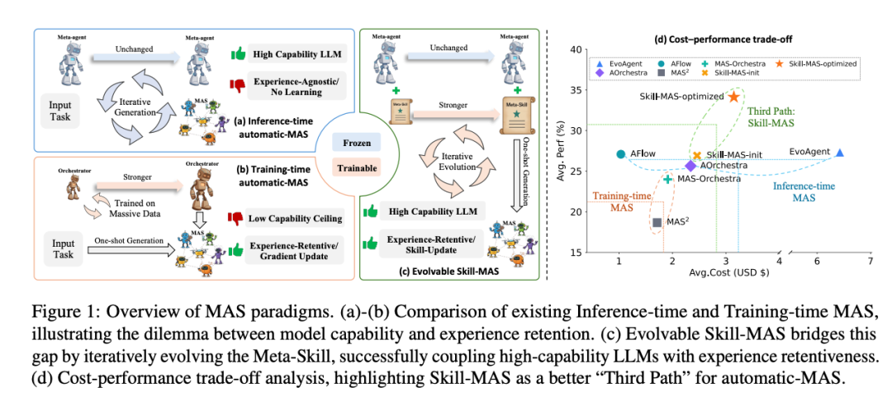
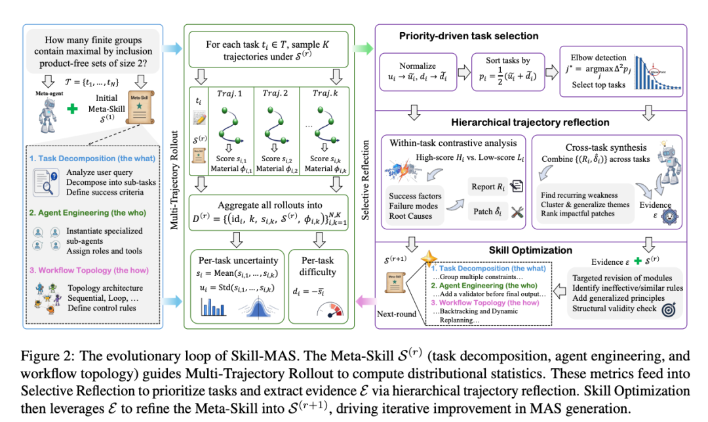
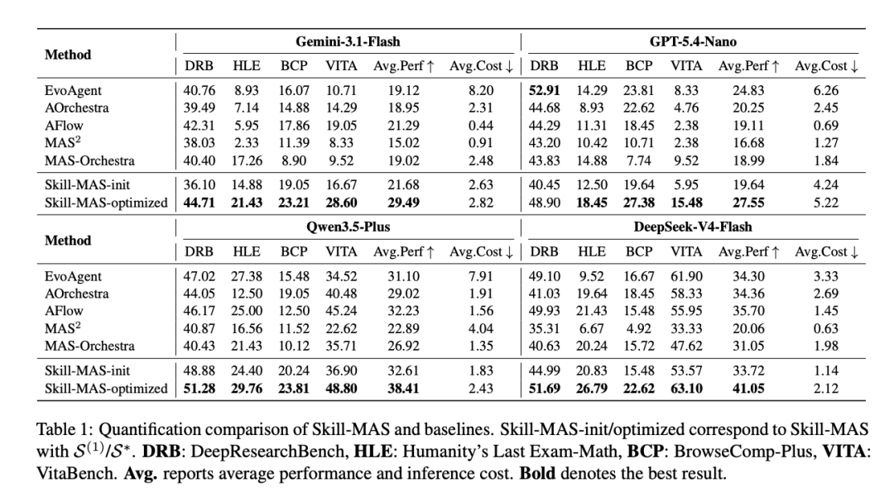
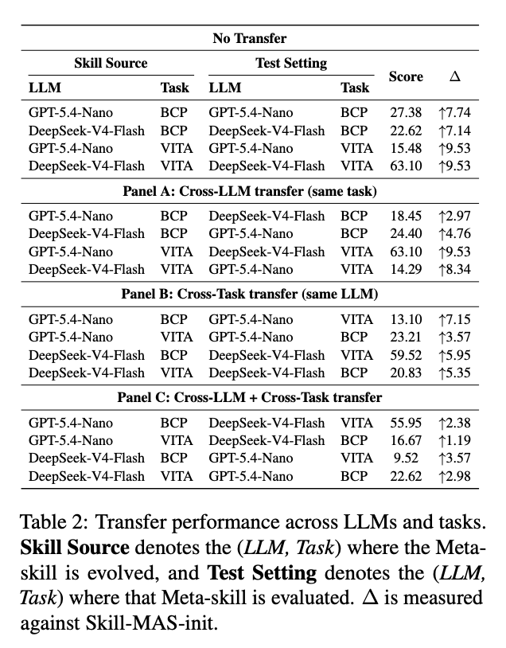
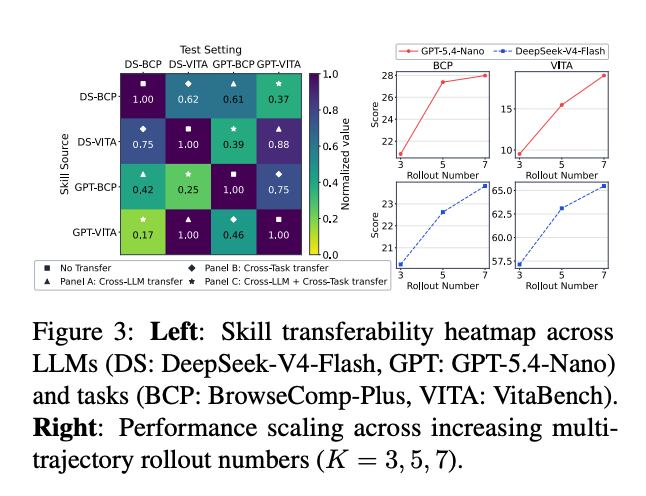
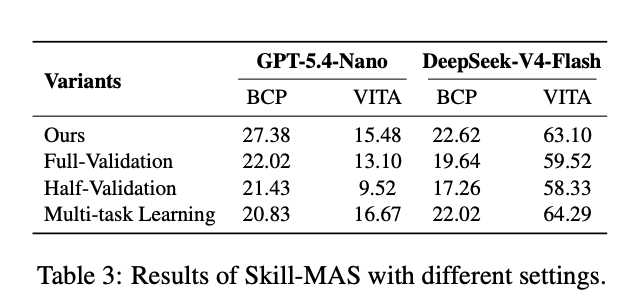
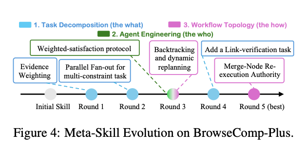

# Skill-MAS不微调大模型，把多agent编排经验写进可进化Meta-Skill

Source: https://mp.weixin.qq.com/s/aunJ3_g3kXW6faWdCXnBGw

# Skill-MAS不微调大模型，把多agent编排经验写进可进化Meta-Skill

原创

无影寺
无影寺

[AI帝国](javascript:void(0);)

在小说阅读器读本章

去阅读

在小说阅读器中沉浸阅读

自动生成多 agent 系统有一个现实矛盾：如果用冻结的前沿大模型做 Meta-agent，它推理能力强，但每次任务都像从零开始搜索，失败经验很难留下；如果微调一个编排模型，它能把经验内化进参数，却通常受限于较小模型的能力上限，也很难扩展到百亿参数以上的闭源前沿模型。

论文提出的第三条路，是把“如何拆任务、如何设计 agent、如何组织工作流”写成一份可进化的自然语言文档，也就是 Meta-Skill。模型参数不动，但编排经验可以在多轮验证、反思和改写中持续更新。

> **[图1：MAS范式概览]** 图中比较推理时 automatic-MAS 与训练时 automatic-MAS 的能力和经验保留矛盾，并展示可进化 Skill-MAS 如何通过迭代进化 Meta-Skill，把高能力 LLM 与经验保留结合起来；右侧给出成本-性能权衡。

## 第三条路解决的是经验怎么留下

论文把现有 automatic-MAS 分成两类。推理时方法让冻结的强模型不断搜索和生成多 agent 架构，优点是能用强模型，缺点是经验无关：一次失败里学到的诊断经验，不会自动变成下次生成系统的规则。

训练时方法则把编排能力参数化，通常在 curated orchestration datasets 上微调较小 LLM。它能通过梯度更新保留经验，但论文强调这类模型常见规模约为 7B，能力上限和训练数据成本都会成为问题。

> **[图2：Skill-MAS的进化闭环]** Meta-Skill 由任务分解、agent engineering 和 workflow topology 组成，指导多轨迹 rollout 计算分布统计量；这些指标进入选择性反思，再把证据用于优化 Meta-Skill，驱动下一轮 MAS 生成。

Skill-MAS 的定位更像一份外置、可迭代的“编排手册”。它不把经验塞进参数，而是让 Meta-agent 在推理时读取这份 Meta-Skill，并在验证集上根据失败证据改写它。

## Meta-Skill不是任务答案，而是编排原则

Meta-Skill 被组织成三个模块。第一是任务分解，规定 Meta-agent 如何分析用户请求、拆出子任务、定义成功标准。第二是 agent engineering，规定如何实例化专用子 agent、给出角色和必要上下文。第三是 workflow topology，规定顺序、层级或循环等工作流结构，以及 agent 之间的输入输出映射。

这个结构的关键不是“给某个任务写答案”，而是把可迁移的编排原则沉淀下来。比如失败归因时，可以明确判断问题出在任务拆解、agent 角色设计，还是工作流连接方式，而不是把整套 MAS 当成黑箱。

## 多轨迹rollout让失败变成可用证据

每一轮进化先做 Multi-Trajectory Rollout。对验证集里的每个任务，系统在当前 Meta-Skill 指导下独立采样 K 条轨迹，记录每条轨迹的得分、架构和中间材料。这样，一个任务不再只有单次成败，而会形成一个行为分布。

论文用两个统计量挑出最值得反思的任务：不确定性来自同一任务多条轨迹得分的波动，难度来自平均得分的相反数。波动大说明规则可能不够稳定，平均低说明任务本身难或系统性失败更多。Selective Reflection 会优先分析这些高优先级样本，而不是把诊断预算平均摊给所有任务。

反思分两层。任务内层面比较高分轨迹和低分轨迹，找出成功因素、失败模式和根因；跨任务层面再合并多个任务的诊断报告，提炼重复出现的弱点和应保留的鲁棒策略。最后，Skill Optimization 根据这些证据改写 Meta-Skill，但要求每次修改都抽象成通用编排原则，而不是针对某个任务打补丁。

## 效果要看四模型四基准的平均分

论文在四个复杂基准上评估：DeepResearchBench、Humanity’s Last Exam-Math、BrowseComp-Plus 和 VitaBench，对应深度研究、专家级数学、多跳问答和真实交互场景。Meta-agent 覆盖 Gemini-3.1-Flash、GPT-5.4-Nano、Qwen3.5-Plus 和 DeepSeek-V4-Flash 四种 LLM。

> **[表1：Skill-MAS与基线的量化比较]** Skill-MAS-init 和 Skill-MAS-optimized 分别对应初始 Meta-Skill 与优化后的 Meta-Skill；DRB 为 DeepResearchBench，HLE 为 Humanity’s Last Exam-Math，BCP 为 BrowseComp-Plus，VITA 为 VitaBench，Avg. 报告平均性能和推理成本。

表1里最有用的是平均性能。Gemini-3.1-Flash 作为 Meta-agent 时，Skill-MAS-optimized 平均性能为 **29.49**，高于 AFlow 的 **21.29**，平均推理成本为 **2.82 美元**；GPT-5.4-Nano 上，Skill-MAS-optimized 平均性能为 **27.55**，但 DRB 单项仍低于 EvoAgent，论文也明确指出这是唯一例外。Qwen3.5-Plus 上，Skill-MAS-optimized 平均性能达到 **38.41**；DeepSeek-V4-Flash 上达到 **41.05**。

这些数字比“效果很好”更重要：它们说明 Skill-MAS 不是只在某个模型上偶然有效，而是在四种 Meta-agent 上都把优化后的 Meta-Skill 推到了较高平均表现。不过成本也不能忽略。论文主表里的成本只统计测试阶段推理开销，不包含验证集上演化 Meta-Skill 的成本；这点在实际部署时要单独算。

## 迁移性证明它学到的不是单题补丁

论文还测试了 Meta-Skill 的迁移。最强的情况当然是 source 和 test 都相同；同一任务跨 LLM 迁移也相对自然。更有价值的是跨任务迁移：论文认为，进化过程要求 Meta-agent 避免领域特定 tricks，转而提炼 general patterns，因此优化后的 Meta-Skill 在 unseen datasets 上仍能维持一定效果。

> **[表2：跨LLM和任务的迁移性能]** Skill Source 表示 Meta-Skill 进化时使用的 LLM 与任务组合，Test Setting 表示评估时使用的组合；Δ 相对于 Skill-MAS-init 计算。

表2把“迁移”拆成同任务跨 LLM、同 LLM 跨任务，以及 LLM 和任务都变化的组合。论文的判断也更克制：同任务跨 LLM 最容易迁移，跨任务也能保持竞争力，但同时跨 LLM 和跨任务是最难的设置。

> **[图3：左图为跨LLM和任务的Skill迁移热力图；右图为多轨迹rollout数量增加时的性能扩展]** 左图比较 DeepSeek-V4-Flash、GPT-5.4-Nano 与 BCP、VITA 的迁移组合；右图展示 K=3、5、7 时的性能变化。

图3右侧还给出一个实际取舍：多轨迹 rollout 数越多，整体性能越好，但收益递减，且演化阶段成本会增加。论文默认 K=5，并指出从 3 到 5 的收益大于从 5 到 7 的收益。这意味着 Skill-MAS 的“经验积累”不是免费的，它把一部分训练成本转移成了验证集上的多轮采样、诊断和文档更新成本。

## 更稳的读法

这篇论文最值得关注的点，不是“让大模型拥有记忆”这种拟人化说法，而是把 MAS 编排经验从参数里解耦出来：强模型保持冻结，经验以 Meta-Skill 文档形式进化，并在推理时作为上下文注入。

> **[表3：Skill-MAS在不同设置下的结果]** 表格比较不同设置对 Skill-MAS 的影响，包括多任务学习、label-free 选择和不同 rollout 数量等配置。

它的边界也清楚。Skill-MAS 需要验证集、需要可评分轨迹，也依赖 LLM judge 和 ground-truth labels 来计算优先级。论文在进一步分析中也提到，去掉自适应优先选择的 label-free 变体会掉分，说明弱监督或无监督环境下还需要额外机制。

> **[图4：Meta-Skill在BrowseComp-Plus上的进化过程]** 图中展示 DeepSeek-V4-Flash 与 BrowseComp-Plus 设置下，Meta-Skill 从初始版本到最优轮次的演化轨迹。

因此，这篇更适合被理解为 automatic-MAS 的一种工程化新范式：不微调大模型，也不每次从零搜索，而是让编排规则本身成为可以被证据驱动更新的 artifact。

📄 原文标题

Skill-MAS: Evolving Meta-Skill for Automatic Multi-Agent Systems

🔗 原文链接

https://arxiv.org/abs/2606.18837

预览时标签不可点

微信扫一扫  
关注该公众号

[知道了](javascript:;)

微信扫一扫  
使用小程序

[取消](javascript:void(0);)
[允许](javascript:void(0);)

[取消](javascript:void(0);)
[允许](javascript:void(0);)

[取消](javascript:void(0);)
[允许](javascript:void(0);)

×
分析

微信扫一扫可打开此内容，  
使用完整服务

：
，
，
，
，
，
，
，
，
，
，
，
，
。
 
视频
小程序
赞
，轻点两下取消赞
在看
，轻点两下取消在看
分享
留言
收藏
听过