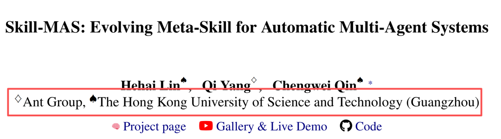
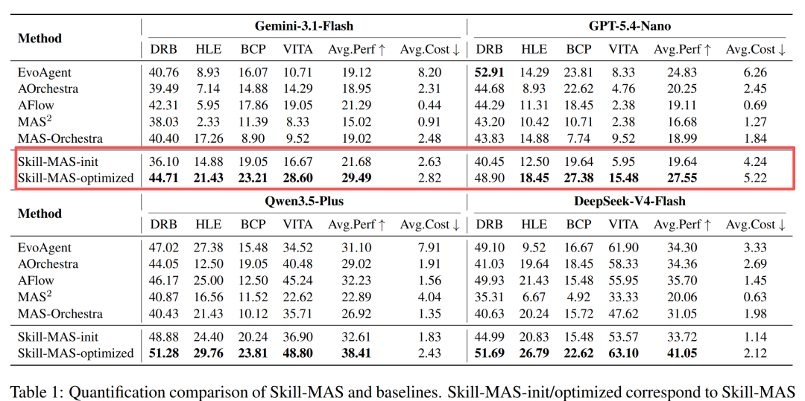
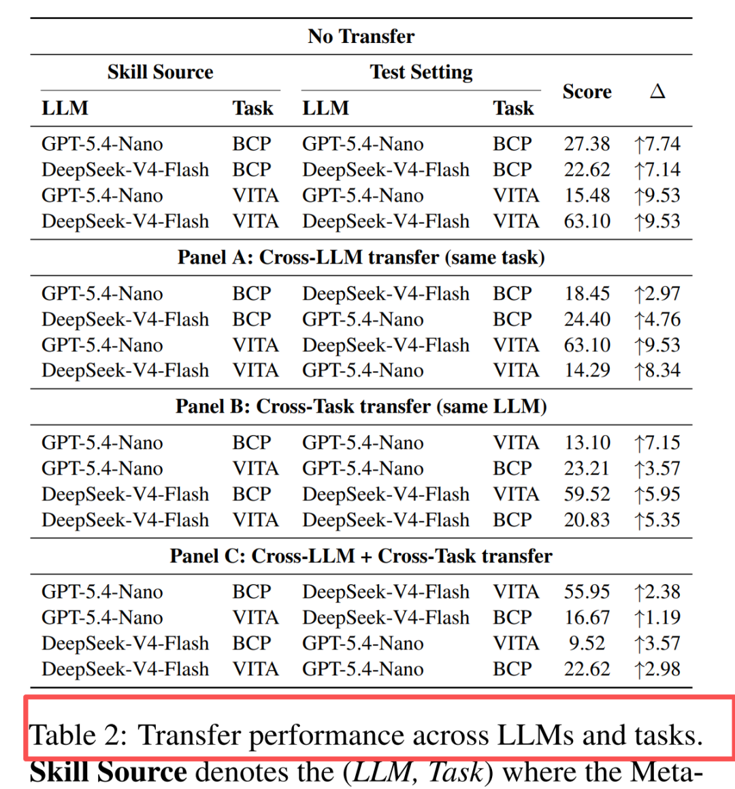

# 会进化的Meta-Skill，蚂蚁Skill-MAS杀疯了

Source: https://mp.weixin.qq.com/s/HNUUAE3QNX3OxBBeQxN6Wg


# 会进化的Meta-Skill，蚂蚁Skill-MAS杀疯了

原创

PaperRAG
PaperRAG

[PaperToday](javascript:void(0);)


在小说阅读器读本章

去阅读


在小说阅读器中沉浸阅读

大家好，我是学姐阿玲。

当你让一群 **AI Agent** 一起做研究、解题或浏览网页时，真正困难的往往不是多叫几个模型。更麻烦的是：谁先拆任务，谁去查证据，谁来交叉验证，谁负责汇总，失败时又该怎么重试。

这套流程，过去经常每次都要重新摸索。



**蚂蚁（Ant Group）** 这篇论文把 Agent 编排从一次性的搜索过程，变成了一份可以复用、反思、迁移的 **Meta-Skill**。

**Skill-MAS 说明，多 Agent 的能力提升，可能不只来自更强模型或更多推理预算，也可以来自一份会进化的编排说明书。**

## 多 Agent 不是多叫几个模型

论文把现有 automatic MAS 方法大致分成两类。

第一类是 inference-time orchestration。它会在推理阶段为当前任务搜索一套 agent 角色、流程和拓扑，代表方法包括 EvoAgent、AOrchestra、AFlow 等。好处是可以直接调用强模型；坏处是每来一个新任务，系统往往又要重新搜索一遍，经验很难沉淀。

第二类是 training-time orchestration。它试图训练一个 orchestrator，让系统把编排经验学进模型参数里。问题是，这通常绑定较小的编排模型，训练和数据成本也不低。

**Skill-MAS 的第三条路是**：不把经验藏进参数，也不每次从头搜，而是把“怎么组织一群 Agent 做事”外化成一份可改写的 **Meta-Skill**。


MAS 范式对比

这也是它的核心：**真正被优化的不是某个子 Agent，而是组织 Agent 的那套工作流能力。**

## 新方法：把编排能力拆成三种技能

Skill-MAS 把 Meta-agent 的编排能力拆成三个模块：

1. **Task Decomposition**：怎么理解任务，怎么拆任务，成功标准是什么。
2. **Agent Engineering**：设计哪些子代理，每个代理拿到什么上下文，输出什么格式，边界在哪里。
3. **Workflow Orchestration**：这些子代理是串行、并行、层级协作，还是循环反思，输入输出怎么传递。


Skill-MAS 演化闭环

这听起来像提示词工程，但论文的关键不是写一份静态 prompt，而是让这份 Meta-Skill 在执行中不断进化。

具体做法有两步。

第一步是 **Multi-Trajectory Rollout**。对同一个 validation task，系统不只跑一次，而是默认跑 **K=5** 条轨迹。这样它能看到：某个任务到底是稳定做不好，还是偶尔失败；是任务本身难，还是编排方式不稳定。

第二步是 **Selective Reflection**。系统用两个统计量挑出最值得反思的任务：一个是 uncertainty，也就是多次得分的波动；另一个是 difficulty，也就是平均表现有多差。论文把优先级写成 `p_i = 0.5 * (u_i + d_i)`，再选择高优先级任务进入反思。

反思也不是泛泛地让模型“总结一下”。它会把同一任务的高分轨迹和低分轨迹分组，做对比诊断；再把多个任务的诊断汇总，提炼系统性弱点和稳定优势。最后只根据 evidence package 改写相关模块，避免变成只适配某个任务的补丁。

换句话说，Skill-MAS 想做的是把多 Agent 系统里的“组织经验”沉淀下来。

## 性能涨了，成本没有失控

论文在四个复杂基准上测试：DeepResearchBench、Humanity’s Last Exam-Math、BrowseComp-Plus 和 VitaBench，覆盖深度研究、数学推理、多跳浏览问答、真实工具使用等场景。

最关键的结果来自 Table 1。Skill-MAS optimized 在四类 LLM 上的平均表现和成本如下：



这组数字最有意思的地方，不只是平均性能更高，而是它站在两类旧路线之间：training-time MAS 推理便宜但表现弱；inference-time MAS 往往表现更强但推理阶段反复搜索，成本高。Skill-MAS 通过复用 evolved **Meta-Skill**，试图取得中等成本和更高表现之间的折中。

当然，结果也不是没有例外。论文明确提到，在 GPT-5.4-Nano 的 DeepResearchBench 上，EvoAgent 的 **52.91** 高于 Skill-MAS 的 **48.90**。这说明 Skill-MAS 不是每个组合都压倒性胜出，但整体平均趋势仍然明显。

## 更值得注意的是迁移性

如果一份 Meta-Skill 只能在一个模型、一个任务上有效，那它更像调参结果，而不是可复用资产。



论文的迁移实验显示，同 LLM 同任务的 evolved skill 增益最大，约 **+7.14 到 +9.53**；同任务换 LLM 仍有正迁移，约 **+2.97 到 +9.53**；同 LLM 换任务也有正增益，约 **+3.57 到 +7.15**；最难的跨 LLM 且跨任务，仍报告 **+1.19 到 +3.57** 的提升。

这意味着它学到的并不只是某个 benchmark 的局部技巧，而可能包含一些更通用的 orchestration principles。

但边界也要说清楚：**Skill-MAS 目前主要依赖 supervised validation feedback 和 ground-truth labels。** 如果没有可靠评分信号，它的 selective reflection 和 skill optimization 可能会退化。论文也把 weakly-supervised / unsupervised 场景列为未来方向，包括用 self-supervised evaluation 或 LLM-as-a-judge 替代外部标签。


BrowseComp-Plus 上的 Meta-Skill 演化示例

```
Skill-MAS: Evolving Meta-Skill for Automatic Multi-Agent Systems  
https://arxiv.org/html/2606.18837v1  
https://github.com/linhh29/Skill_MAS
```

预览时标签不可点


微信扫一扫  
关注该公众号

[知道了](javascript:;)


微信扫一扫  
使用小程序

[取消](javascript:void(0);)
[允许](javascript:void(0);)

[取消](javascript:void(0);)
[允许](javascript:void(0);)

[取消](javascript:void(0);)
[允许](javascript:void(0);)

×
分析


微信扫一扫可打开此内容，  
使用完整服务

：
，
，
，
，
，
，
，
，
，
，
，
，
。
 
视频
小程序
赞
，轻点两下取消赞
在看
，轻点两下取消在看
分享
留言
收藏
听过