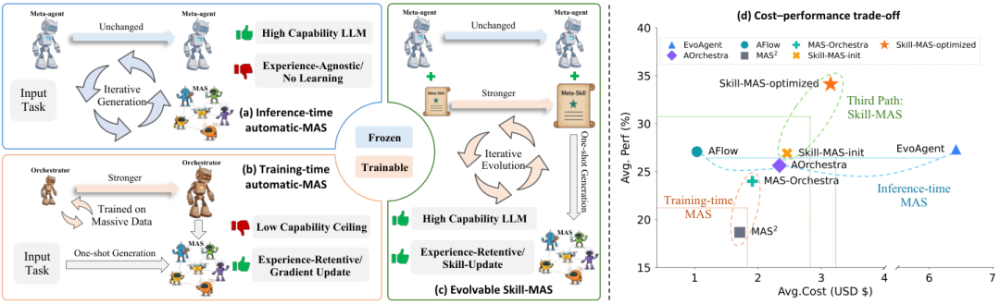
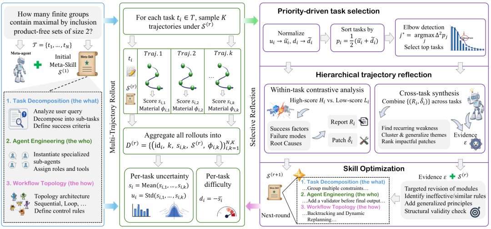
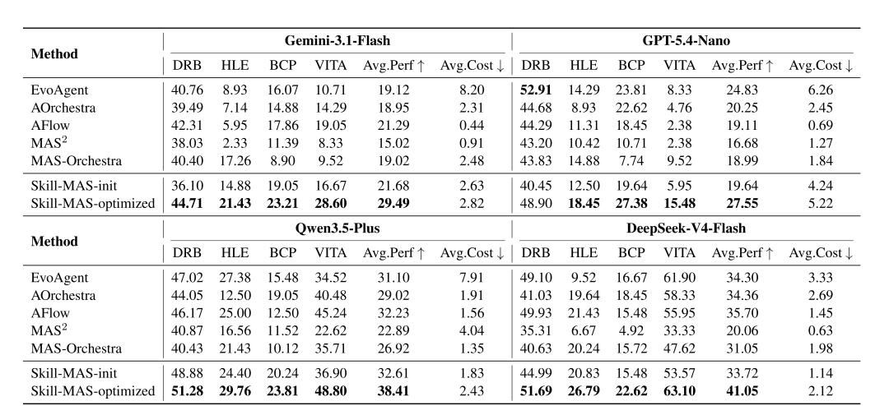

# 蚂蚁×港科大：Skill-MAS 让多智能体编排像 SKILL一样越用越聪明

Source: https://mp.weixin.qq.com/s/fwGc69JvscDgal_rg98igw

# 蚂蚁×港科大：Skill-MAS 让多智能体编排像 SKILL一样越用越聪明

原创

Hyman的杂货铺
Hyman的杂货铺

[Hyman的杂货铺](javascript:void(0);)

在小说阅读器读本章

去阅读

在小说阅读器中沉浸阅读

**一句话讲清楚👉🏻** 蚂蚁集团与港科大提出 Skill-MAS ：把 Meta-agent 的编排策略写成可迭代的 Meta-Skill 文档，在验证集上通过多轨迹采样和选择性反思闭环进化——冻结前沿 LLM 、不做微调，四个复杂基准上平均性能全面超过 AFlow 、 MAS-Orchestra 等 SOTA ，推理成本却远低于纯推理时搜索方案。

* 论文标题：Skill-MAS: Evolving Meta-Skill for Automatic Multi-Agent Systems
* 论文链接：https://arxiv.org/abs/2606.18837
* Github 链接：https://github.com/linhh29/Skill-MAS
* 项目链接：https://linhh29.github.io/blog/Skill-MAS/index.html
* Demo 链接：https://skill-mas-demo.hehailin.life/

## 28.60% vs 19.05%：差的不只是 prompt

BrowseComp-Plus 是一类很折磨人的 benchmark ：问题要多跳检索、中间状态会变， Agent 稍一偷懒就会「搜到一半就交卷」。论文里， Gemini-3.1-Flash 当 Meta-agent 时， AFlow 在这项任务上只有 19.05% 准确率； Skill-MAS 进化完 Meta-Skill 后拉到 **28.60%**，平均性能也从 21.29% 提到 **29.49%**。

数字背后是一个更根本的问题：**自动多智能体（ automatic MAS ）到底该怎么「积累经验」**？

手工搭 MAS 的人都有体会：角色划分、通信拓扑、失败回退，改一处可能全盘崩溃。社区于是让 Meta-agent 自动生成子 Agent 和工作流——但现有两条主路都有明显短板。

**推理时方案**（ AFlow 、 AOrchestra 、 MAS-Zero ）用冻结的前沿大模型当 Meta-agent ，配合 MCTS 或反思循环搜 workflow 。模型强，却**几乎不记历史**：同类任务反复踩坑，每个 query 还可能重跑完整搜索，推理账单很容易爆。

**训练时方案**（ MAS2 、 MAS-Orchestra ）用小模型在编排轨迹上微调或做 RL ，经验写进权重。能学习，但**能力被 7B 量级模型卡住**；要把同一套逻辑扩到 100B+ 前沿模型，训练和数据的成本都难以接受。

Figure 1 把这条两难画得很直白：强模型但不学习，能学习但模型弱。 Skill-MAS 想走中间那条路——**经验外置到 Skill 文档，模型权重保持冻结**。

推理时 MAS 、训练时 MAS 与 Skill-MAS 的能力—经验权衡； Skill-MAS 在成本—性能平面上占据更优区域。

## 为什么偏偏是 Meta-Skill ？

近半年 Agent 圈流行把能力拆成 `SKILL.md` 一类结构化文档，再靠轨迹反思迭代——MemSkill 管记忆、 Trace2Skill 蒸馏推理 routine 、 SkillRL 把技能发现和强化学习绑在一起。但这些工作大多停在**单 Agent 的执行层**，或者最多进化**子 Agent 的角色定义**（ CoEvoSkills 、 EvoSkill ）。

Skill-MAS 换了一个层级：**Meta-agent 怎么拆任务、怎么造 Agent 、怎么连拓扑，本身就是一份 Skill**。 它管的是架构级 know-how ，不是「这一步怎么调搜索 API 」。

好处很直接：编排知识从参数里抽出来，变成可读、可 diff 、可回滚的文档。 GPT 、 Gemini 、 DeepSeek 当 Meta-agent 时，不必动权重也能「越用越会搭系统」。

## 三模块 Meta-Skill ：失败时能定位到「哪一块写错了」

论文把 Meta-Skill  固定成三个模块，推理和诊断都围绕它们展开：

1.**任务分解**：读 query 、拆子任务、写可验证的成功标准。

2.**Agent 工程**：实例化子 Agent ，分配角色、工具、输入上下文。

3.**工作流编排**：选顺序/层级/循环等拓扑，定义 Agent 间数据流，输出可执行 MAS 。

初始版本  来自 Anthropic 多 Agent 构建指南的 LLM 摘要（附录有全文）。之后在验证集跑 **10 轮** 进化，每任务每轮采样 **5 条** 轨迹，取验证集最优的  上测试集。

这种三模块切分的工程价值在于**失败可定位**：是分解太粗、角色边界模糊，还是 workflow 不该用线性链——反思阶段能指到具体模块，优化时不会把整份 prompt 搅成一团。

## 进化闭环：先采样分布，再挑「又难又不稳」的任务反思

Skill-MAS 每轮两阶段， Figure 2 是总览。

Multi-Trajectory Rollout 产出分布统计 → Selective Reflection 提炼证据 → Skill Optimization 改写 Meta-Skill 。

### 第一步：同一任务连跑 5 遍，看波动而不是看运气

对每个验证任务 ，在当前 Skill  下独立采样  条 rollout ，记录：

 是归一化得分， 存架构快照和中间结果。

**直觉**： 单次 0.8 分可能是运气；若 5 次得分是 `[0.2, 0.8, 0.3, 0.7, 0.2]`，说明 Skill 对「并行分支怎么合并」写得含糊——这才是该改的规则。

由此算出两个 per-task 指标：

■**不确定性**： 次得分的标准差。 大 = 同一 Skill 编排同一题时表现不稳定。

■**难度**：均分越低，任务越难。

### 第二步：优先反思「波动大 + 系统性难」的题

先把 、 各自 min-max 归一化，再合成优先级 ，按  降序排列后用**肘部检测** 截断——只反思曲线拐点前的 top 任务，避免把预算摊薄到 100 道题上。

对入选任务， reflector 把  条轨迹按中位数切成高分组  和低分组 ，对比架构快照 ，找成功因素和失败模式；再跨任务综合，把候选补丁排序成证据包 。

优化器对照  改 ：**只动被点名的模块，每条改动必须抽象成通用编排原则**，改完做结构检查，得到 。

### 走查一例： BrowseComp-Plus 上 Skill 怎么「长出来」

Figure 4 跟踪了 DeepSeek-V4-Flash 在 BrowseComp-Plus 上 5 轮进化：

Meta-Skill 逐轮变化：证据框架 → 带权评估 → 回退重规划 → 链接校验与合并节点重执行。

■第 1–2 轮（任务分解）：多约束检索从平铺子任务，变成 parallel fan-out + 结构化搜索计划。

■第 2–3 轮（ Agent 工程）：评估从二值判断变成带权约束满足。

■第 3–4 轮（工作流）：加入 backtracking 和 dynamic replanning 。

■第 4–5 轮（最佳）：补 link-verification 、 merge-node 重执行权限，集成阶段能主动回收证据。

这些 patch 写进 Skill 文档后，变成**可执行编排合约**——附录里 DeepResearchBench 、 HLE-Math 的进化 Skill 甚至长到像一份内部设计规范（ bounded parallelism 、强制消歧寄存器 MIR 、小  校准等）。

## 四个够难的 benchmark ，四种 Meta-agent

| 基准 | 场景 | 核心指标 |
| --- | --- | --- |
| DeepResearchBench | 深度研究报告 | 全面性、洞察等四维 |
| HLE-Math | 专家级数学 | 准确率 |
| BrowseComp-Plus | 多跳动态问答 | 准确率 |
| VitaBench | 真实交互 + 多工具 | 成功率 |

Meta-agent 分别用 Gemini-3.1-Flash 、 GPT-5.4-Nano 、 Qwen3.5-Plus 、 DeepSeek-V4-Flash 。基线覆盖推理派（ EvoAgent 、 AOrchestra 、 AFlow ）和训练派（ MAS2 、 MAS-Orchestra ）。 Skill-MAS 报 **init**（仅初始 Skill ）和 **optimized**（进化后 ）两个版本。

## 主结果： optimized 版几乎全线登顶

论文 Table 1 在四个 benchmark 、四种 Meta-agent 上对比了五条 SOTA 基线与 Skill-MAS 的 init / optimized 两版。 DRB 、 HLE 、 BCP 、 VITA 分别对应 DeepResearchBench 、 HLE-Math 、 BrowseComp-Plus 、 VitaBench ； Avg.Perf 为四任务均值， Avg.Cost 为测试集推理开销（美元）。

Table 1 ： Skill-MAS 与基线在各 benchmark 及 Meta-agent 上的量化对比；加粗为最优。 Skill-MAS-init / optimized 对应初始 Skill 与进化后 。

读这张表，三个结论比较稳：

**第一，进化有效**。 同一 backbone 下， optimized 行的 Avg.Perf 几乎总是高于 init——Meta-Skill 闭环靠验证集上的迭代改写，不是靠改 prompt 碰运气。

**第二， optimized 在绝大多数设置里拿第一**。 四个 Meta-agent 里， Skill-MAS-optimized 的 Avg.Perf 均高于所有基线；唯一例外是 GPT-5.4-Nano 在 DeepResearchBench 上略输 EvoAgent ，长报告类任务还有优化空间。

**第三，成本—性能位置合理**。 对比 Table 1 最右列：训练派（ MAS-Orchestra 等） Avg.Cost 低但 Avg.Perf 也低；推理派（ EvoAgent 、 AFlow ）分高一些但账单明显更贵； Skill-MAS-optimized 落在「高分 + 中等成本」区间——测试阶段一次生成 MAS ，不必像 AFlow 那样 per-sample 反复搜索。进化阶段的验证集开销见附录 Table 6 ，与 Table 1 的测试推理成本分开统计。

## 迁移实验：换模型、换任务， Skill 仍有用

Table 2 / Figure 3 左测了 Meta-Skill 的泛化：

左：跨 LLM / 跨任务迁移热力图；右：采样数  与性能关系。

■**同 LLM 同任务**（对角线）：增益最大。

■**跨 LLM 、同任务**：例如 BCP 上仍有 +7.74 个百分点——编排原则写在自然语言里，不绑 hidden state 。

■**同 LLM 、跨任务**： BrowseComp-Plus 进化出的 Skill 用到 VitaBench 仍有效，说明学到的是任务无关策略。

■**跨 LLM + 跨任务**：最难，但多数仍为正。

 从 3 增到 7 性能单调涨， 5→7 的边际收益小于 3→5 ，默认  是性价比折中。

## 消融与局限

**去掉优先级筛选（ Table 3 ）**： 全量反思或随机抽 50% 样本， BrowseComp-Plus 从 27.38% 降到 22.02% / 21.43%，仍高于多数基线——闭环进化本身有效，**挑哪些题反思** 决定上限。

**多任务混合进化**： 四数据集一起进化， VitaBench 略涨、 BrowseComp-Plus 反降，说明跨域噪声需要专门机制。

**三条硬局限**：

1.默认依赖 ground-truth 给轨迹打分；缺标签时要靠 LLM Judge 或自置信分数，论文明确列为 future work 。

2.进化阶段 token 消耗不可忽视（ 10 轮 × 任务数 × 5 轨迹）。

3.DeepResearchBench + GPT-5.4-Nano 的个别落后，说明长报告拓扑约束和 judge 目标还可以再对齐。

## 和相近工作怎么区分

| 方向 | 代表 | Skill-MAS 差异 |
| --- | --- | --- |
| 单 Agent 执行技能 | MemSkill, Trace2Skill | 进化 Meta 层编排，不是子任务 routine |
| 子 Agent 角色技能 | CoEvoSkills, EvoSkill | 管「谁执行」， Skill-MAS 管「怎么搭系统」 |
| 推理时 workflow 搜索 | AFlow, MAS-Zero | 有搜索、无累积 Skill 文档 |
| 训练时编排器 | MAS-Orchestra, MAS2 | 经验在权重里，难迁移到 frontier LLM |

注意： Pan 等人 2026 也有名叫 SkillMAS 的工作，进化的是子 Agent 协作技能；本文 Meta-Skill 层次更高，别混了。

## 落地建议

1.**Meta-agent prompt 版本化**。 按三模块拆成 Meta-Skill 仓库，线上失败样本进验证集，离线跑闭环，别手工改一坨 system prompt 。

2.**用  做 triage**。 方差大、均分低的任务优先进反思集。

3.**先在便宜 backbone 上进化，再迁移验证**。 Table 2 支持跨模型迁移，但新模型上仍建议小规模 A/B 。

4.**够用**。 再往上边际收益递减，进化账单线性涨。

5.**缺标签时先用 LLM Judge 打分轨迹**。 在 label-free 方案成熟前，这是最省事的近似。

## 结语

Skill-MAS 把 automatic MAS 从「每题重新搜索」或「训一个小编排器」，转成**可版本管理的策略文档进化**——有点像 Infrastructure as Code ：编排知识外置、 diff 可读、能回滚到 。

它没有脱离 LLM 读轨迹、写 patch 的本质，稳定性取决于 reflector 质量和验证集覆盖。但对已经用上 frontier Meta-agent 、又被 AFlow 式 per-query 搜索账单折磨的团队，这条路**值得试**：冻结模型、保留推理能力，用 Meta-Skill 承接跨任务经验。

如果 label-free 反思和在线增量进化补全， Meta-Skill 有机会成为 Agent 平台的编排层标准件——就像今天 Repo 里的 `SKILL.md`，明天可能是 `META_SKILL.md` 加一份进化日志。

预览时标签不可点

[阅读原文](javascript:;)

微信扫一扫  
关注该公众号

[知道了](javascript:;)

微信扫一扫  
使用小程序

[取消](javascript:void(0);)
[允许](javascript:void(0);)

[取消](javascript:void(0);)
[允许](javascript:void(0);)

[取消](javascript:void(0);)
[允许](javascript:void(0);)

×
分析

微信扫一扫可打开此内容，  
使用完整服务

：
，
，
，
，
，
，
，
，
，
，
，
，
。
 
视频
小程序
赞
，轻点两下取消赞
在看
，轻点两下取消在看
分享
留言
收藏
听过