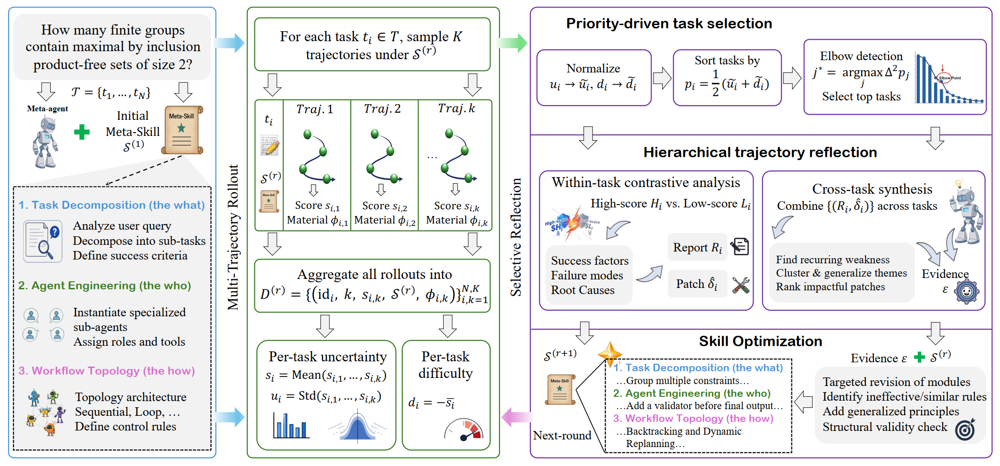
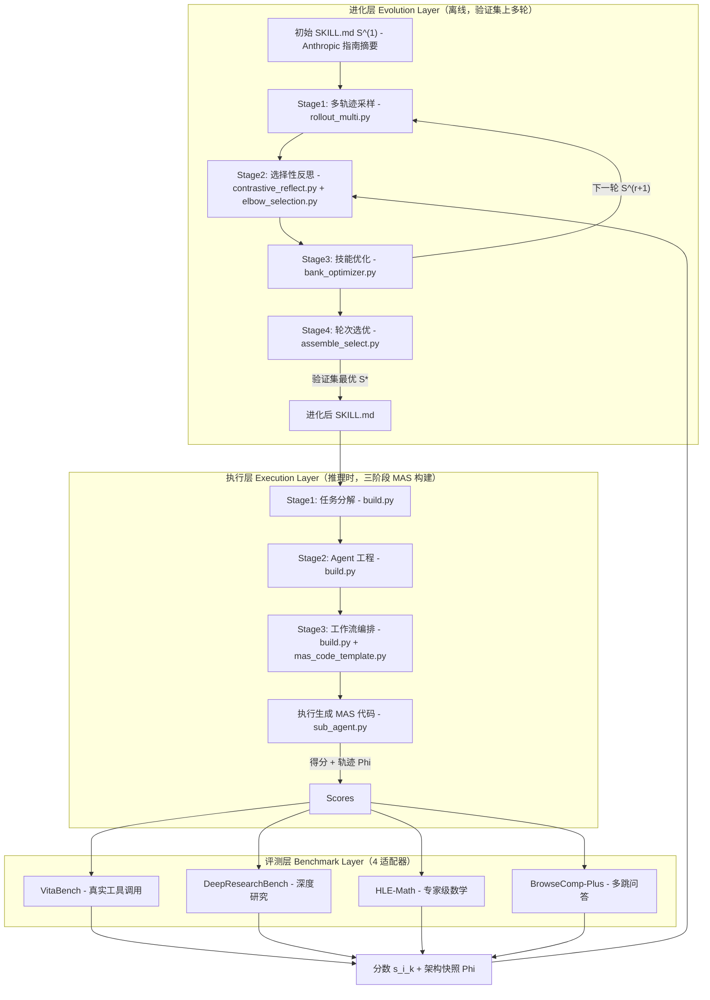
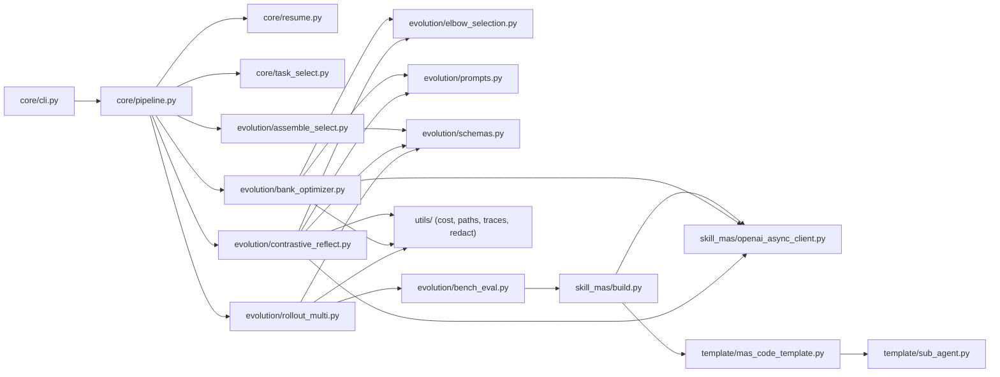
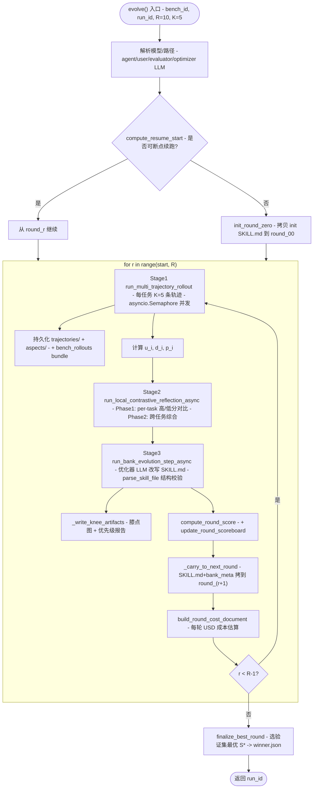
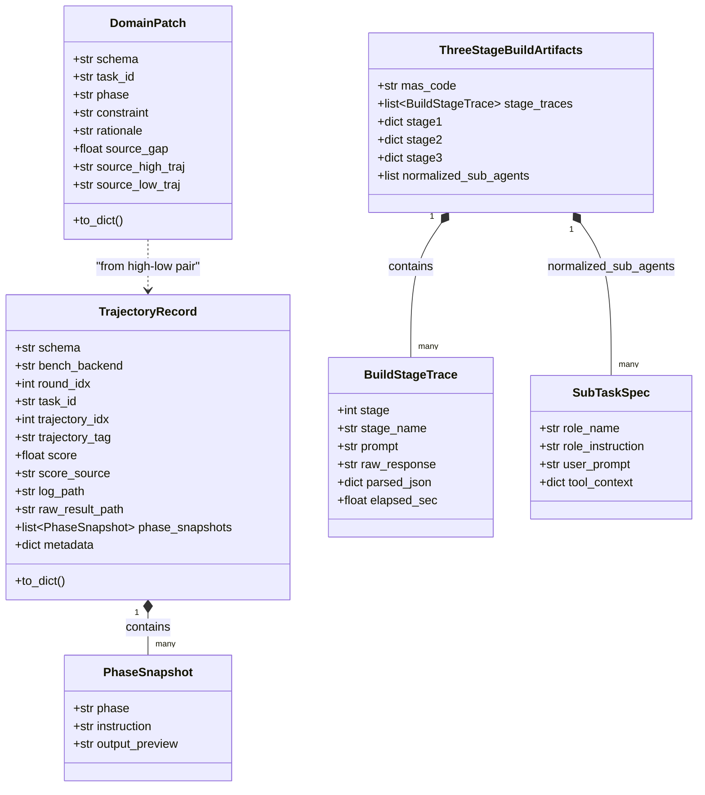
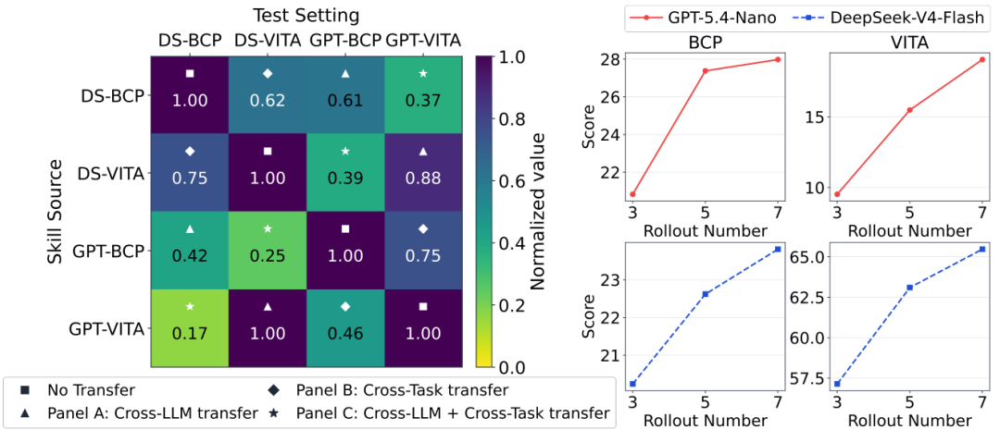
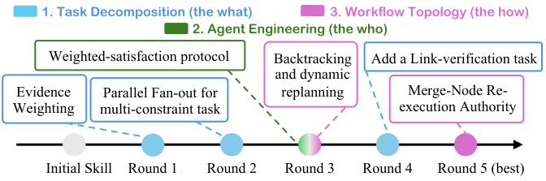

# Skill-MAS: Evolving Meta-Skill for Automatic Multi-Agent Systems

## 调研报告

> 调研日期：2026-07-04
> 论文来源：arXiv:2606.18837（v1: 2026-06-17，v2: 2026-06-24）
> 代码仓库：https://github.com/linhh29/Skill-MAS（Apache-2.0）
> 项目主页：https://linhh29.github.io/blog/Skill-MAS/index.html
> 在线 Demo：https://skill-mas-demo.hehailin.life/

---

## 一、论文基本信息

| 项目 | 内容 |
|------|------|
| **标题** | Skill-MAS: Evolving Meta-Skill for Automatic Multi-Agent Systems |
| **作者** | Hehai Lin（林和海）、Qi Yang（杨琪）、Chengwei Qin（秦诚伟，通讯作者） |
| **机构** | 香港科技大学（广州）HKUST(GZ) / 蚂蚁集团 Ant Group |
| **arXiv** | 2606.18837 [cs.MA, cs.AI, cs.LG] |
| **代码** | https://github.com/linhh29/Skill-MAS（Apache-2.0） |
| **资助** | 蚂蚁集团 CCF-蚂蚁科研基金（CCF-AFSG RF20250502） |
| **核心定位** | 自动多智能体系统（Automatic-MAS）的「第三条路」——把 Meta-agent 的编排能力建模为可进化的 Meta-Skill，冻结前沿 LLM、不做参数更新 |

> **同名辨析（重要）**：arXiv:2605.09341（上海交大/中南大学/OPPO）也取名 SkillMAS，但它进化的是**子 Agent 协作技能**与 MAS 重组（Utility Learning + 证据门控），层次低于本文的 **Meta 层编排**。两者方法、机构、arXiv 号均不同，调研与引用时切勿混淆（参见 references/blog4）。本文统称 **Skill-MAS**。

---

## 二、研究背景与动机

### 2.1 核心问题：能力—经验两难

LLM-based 多智能体系统（MAS）在深度研究、专家级数学、多跳问答、真实工具调用等复杂任务上展现了强大潜力，但**自动设计有效的 MAS 架构**——谁来拆任务、谁去检索、谁做交叉验证、失败如何回退——仍是关键瓶颈。现有 Automatic-MAS 方法面临一个根本性张力：

<p align="center"><b>表1：现有 Automatic-MAS 两条路线的对比</b></p>

| 路线 | 代表方法 | 优势 | 劣势 |
|------|---------|------|------|
| **推理时编排（Inference-time）** | EvoAgent、AOrchestra、AFlow、MAS-Zero | 用冻结前沿 LLM 当 Meta-agent，推理能力强 | **经验无关**——每来一个新任务都像从零搜索，同类任务反复踩坑，per-query 搜索账单高昂 |
| **训练时编排（Training-time）** | MAS²、MAS-Orchestra、ScoreFlow | 通过微调/RL 把编排经验写进参数，可累积经验 | **能力上限受限**——通常绑定 7B 量级小模型，难扩展到 100B+ 前沿闭源模型，训练与数据成本高 |

这就是 Figure 1(a–c) 所刻画的「能力—经验两难」：**强模型但不学习，能学习但模型弱**。Skill-MAS 想走中间那条路——**经验外置到 Skill 文档，模型权重保持冻结**。


*Figure 1: MAS 范式对比与成本-性能权衡。左半部分对比推理时 MAS（强模型、无累积记忆）、训练时 MAS（小模型、经验写进参数）与 Skill-MAS（冻结前沿 LLM + 外置可进化 Meta-Skill）三种范式，揭示「能力—经验」两难；右半部分为成本—性能权衡平面，训练派成本最低但性能也最低，推理派性能较高但成本最贵，Skill-MAS 落在「高分 + 中等成本」的最优区域——测试阶段一次生成 MAS，不必像 AFlow 那样 per-sample 反复搜索。*

### 2.2 为什么是「Meta-Skill」？

近半年 Agent 社区流行把能力抽象为 `SKILL.md` 一类结构化自然语言文档，再靠轨迹反思迭代进化——如 MemSkill（记忆管理）、Trace2Skill（推理 routine 蒸馏）、Skill0/D2Skill/SKILLRL（技能发现 + 策略优化）。但这些工作大多停留在**单 Agent 的执行层技能**，或最多进化**MAS 内子 Agent 的角色定义**（CoEvoSkills、EvoSkill）。

Skill-MAS 换了一个层级：**Meta-agent 怎么拆任务、怎么造 Agent、怎么连拓扑，本身就是一份 Skill**。它管的是**架构级 know-how**，不是「这一步怎么调搜索 API」。好处很直接——编排知识从参数里抽出来，变成可读、可 diff、可回滚的文档，GPT / Gemini / DeepSeek 当 Meta-agent 时不必动权重也能「越用越会搭系统」。

### 2.3 Skill-MAS 的解决思路

- 把 Meta-agent 的编排行为建模为一份结构化的 **Meta-Skill**（`SKILL.md`），固定为三模块脚手架；
- 通过**闭环优化**在验证集上迭代改写这份 Meta-Skill：多轨迹采样分布 → 选择性反思 → 技能优化；
- **冻结前沿 LLM**，不做任何梯度更新，经验以文档形式承载，可迁移到未见任务与其他 LLM。

---

## 三、方法论

### 3.1 Meta-Skill 形式化

Meta-Skill $\mathcal{S}$ 是一份结构化自然语言文档，组织为三个模块，覆盖 MAS 生成的完整流水线：

1. **任务分解（Task Decomposition，the "what"）**：分析用户 query，识别宏观目标与边界，拆解为离散、可管理的子任务，标注子任务间的逻辑依赖（前置/并行/迭代），并定义**可验证的成功标准**。
2. **Agent 工程（Agent Engineering，the "who"）**：为每个子任务实例化专用子 Agent，分配角色画像、系统提示/指令、输入上下文、工具与行为边界。
3. **工作流编排（Workflow Orchestration，the "how"）**：选择架构拓扑（顺序 / 层级 / 循环 / 路由 / 黑板），定义 Agent 间精确的 I/O 映射与全局状态管理，输出**可执行 MAS**。

三模块脚手架有双重工程价值：**推理时**提供有原则的 MAS 生成流程；**优化时**支持精确的失败归因——能判断问题出在分解太粗、角色边界模糊，还是工作流拓扑选错，而不是把整套 MAS 当黑箱。初始技能 $\mathcal{S}^{(1)}$ 由 LLM 从 Anthropic 多智能体构建指南摘要而来（附录 E 给出全文）。

### 3.2 进化闭环总览

设验证集 $T=\{t_1,\dots,t_N\}$，第 $r$ 轮的 Meta-Skill 为 $\mathcal{S}^{(r)}$，$r\in\{1,\dots,R\}$。每轮包含两大阶段：**多轨迹采样（Multi-Trajectory Rollout）** 采样行为分布，**选择性反思（Selective Reflection）** 诊断失败并改写技能。$R$ 轮后选验证集最优的技能 $\mathcal{S}^*$ 上测试集。整体闭环见 Figure 2。



*Figure 2: Skill-MAS 进化闭环总览。Meta-Skill（三模块）指导 Multi-Trajectory Rollout——对每个验证任务独立采样 K 条轨迹并记录架构快照与中间结果；由此计算每任务的不确定性（分数标准差）与难度（负均分）两个分布统计量；进入 Selective Reflection 后，优先级驱动选出「又难又不稳」的任务子集，做任务内 + 跨任务两层对比反思，提炼结构化证据包 $\mathcal{E}$；最后 Skill Optimization 对照证据改写 Meta-Skill（保持三模块脚手架），产出下一轮 $\mathcal{S}^{(r+1)}$。该闭环把单次成败转化为可累积、可迁移的编排原则。*

### 3.3 Stage 1：多轨迹采样（Multi-Trajectory Rollout）

对第 $r$ 轮的每个任务 $t_i$，在当前 $\mathcal{S}^{(r)}$ 下**独立**采样 $K$ 条轨迹（默认 $K=5$）。每条轨迹记录为：

$$\tau_{i,k} = (\text{id}_i,\ k,\ s_{i,k},\ \mathcal{S}^{(r)},\ \Phi_{i,k})$$

其中 $s_{i,k}\in[0,1]$ 是归一化得分，$\Phi_{i,k}$ 存储 MAS 架构与中间结果。第 $r$ 轮语料为 $\mathcal{D}^{(r)}=\{\tau_{i,k}\}_{i=1,k=1}^{N,K}$。

**直觉**：单次 0.8 分可能是运气；若 5 次得分是 $[0.2, 0.8, 0.3, 0.7, 0.2]$，说明 Skill 对「并行分支怎么合并」写得含糊——这才是该改的规则。由此把单次 pass/fail 转化为**行为分布**，并派生两个 per-task 统计量：

- **不确定性（Uncertainty）**——$K$ 条轨迹得分的总体标准差：

$$u_i = \sqrt{\frac{1}{K}\sum_{k=1}^{K}(s_{i,k}-\bar{s}_i)^2}, \quad \bar{s}_i=\frac{1}{K}\sum_{k=1}^{K}s_{i,k}$$

  $u_i$ 大 = 同一 Skill 编排同一题时表现不稳定，规则可能含糊或欠定义。

- **难度（Difficulty）**——负均分：

$$d_i = -\bar{s}_i$$

  $d_i$ 大 = 任务本身难或系统性失败多。

这两个统计量把「偶然执行噪声」与「结构性编排缺陷」区分开来，是后续优先级选择与反思诊断的基础。

### 3.4 Stage 2：选择性反思（Selective Reflection）

本阶段含三个子组件。

#### 3.4.1 优先级驱动的任务选择

为让反思预算集中到「最值得学」的任务，先把 $u_i$、$d_i$ 在本任务集上做 min-max 归一化：

$$\tilde{v}_i = \frac{v_i - \min_j v_j}{\max_j v_j - \min_j v_j}, \quad v\in\{u, d\}$$

再合成统一优先级（等权融合）：

$$p_i = \frac{1}{2}(\tilde{u}_i + \tilde{d}_i)$$

按 $p_i$ 降序排列得优先级曲线 $p_{(1)}\geq\dots\geq p_{(N)}$，用**二阶差分肘部检测**自适应截断，选出信息量最大的任务子集：

$$j^* = \mathop{\arg\max}_{j\in\{1,\dots,N-2\}} \lvert \delta_j - \delta_{j+1} \rvert + 1, \quad \delta_j = p_{(j)} - p_{(j+1)}$$

$$T_{\text{sel}} = \{t_{(1)}, \dots, t_{(j^*)}\}$$

肘部检测只反思曲线拐点前的 top 任务，避免把预算摊薄到全部 $N$ 道题。这一步是 Skill-MAS 控制反思成本的关键——拒绝为简单任务浪费 token。

#### 3.4.2 分层轨迹反思（Hierarchical Trajectory Reflection）

反思分两层（两阶段 LLM 调用）：

- **Phase 1——任务内对比分析（Within-task）**：对每个 $t_i\in T_{\text{sel}}$，把其 $K$ 条轨迹按中位数切为高分集 $H_i$（$s_{i,k}\geq$ median）与低分集 $L_i$。LLM reflector 跨两组检视架构快照 $\Phi_{i,k}$，完成：①**分歧点定位**——高分/低分轨迹从哪一步/决策开始分叉；②**成功因素提取**——高分轨迹做对了什么；③**失败模式编目**——低分轨迹错在哪、是否可恢复；④**根因归因**——能力缺失、约束违反还是搜索低效。产出 per-task 报告 $\mathcal{R}_i$ 与候选补丁 $\hat{\delta}_i$。

- **Phase 2——跨任务综合（Cross-task）**：联合分析 $\{\mathcal{R}_i\}$，识别跨任务反复出现的系统性弱点与应保留的鲁棒策略，按「严重度 × 频次」排序，产出**结构化证据包** $\mathcal{E}$——一份按预期影响与可行性排序的修复清单。

#### 3.4.3 技能优化（Skill Optimization）

优化器对照当前 $\mathcal{S}^{(r)}$ 与证据 $\mathcal{E}$，在**严格保持三模块脚手架**的前提下改写 Meta-Skill：

- 先做**剪枝**——移除/重写被证据证明无效或误导的规则（每轮每模块最多删一条，避免过度删改）；
- 再做**增量升级**——每模块每轮最多引入**一条**实质性概念改进，把反思证据**抽象为通用编排原则**而非任务特定补丁；
- 改写后过**结构有效性检查**，通过则接受为 $\mathcal{S}^{(r+1)}$。

$R$ 轮后，取验证集表现最高的技能为 $\mathcal{S}^*$ 用于测试。

### 3.5 与相关工作的区分

<p align="center"><b>表2：Skill-MAS 与相关工作的层次区分</b></p>

| 方向 | 代表工作 | 层次 | Skill-MAS 差异 |
|------|---------|------|---------------|
| 单 Agent 执行技能 | MemSkill, Trace2Skill, Skill0, D2Skill, SKILLRL | 单 Agent 执行层 routine | Skill-MAS 进化 **Meta 层编排**，非子任务 routine |
| 子 Agent 角色技能 | CoEvoSkills, EvoSkill | MAS 内子 Agent 角色 | 管「谁执行」，Skill-MAS 管「**怎么搭系统**」 |
| 推理时 workflow 搜索 | AFlow, MAS-Zero, EvoAgent, AOrchestra | per-query 搜索 | 有搜索、**无累积 Skill 文档**，每题重跑 |
| 训练时编排器 | MAS-Orchestra, MAS², ScoreFlow | 小模型微调/RL | 经验在权重里，**难迁移到 frontier LLM** |
| 同名 SkillMAS（arXiv:2605.09341） | SJTU/CSU/OPPO | 子 Agent 协作技能 + MAS 重组 | 本文 Meta-Skill 层次更高，机构与方法均不同 |

---

## 四、代码实现分析

> 代码仓库 https://github.com/linhh29/Skill-MAS（Apache-2.0），Python 3.11，核心依赖 `openai` / `pydantic` / `loguru` + 各 benchmark 依赖。本节基于对克隆仓库源码的逐文件分析。

### 4.1 仓库概述与目录结构

```
Skill_MAS/
├── core/                 # CLI 入口、进化 pipeline、断点续跑、任务选择
│   ├── cli.py            # 命令行入口（evolve / list-val / snapshot-baseline）
│   ├── pipeline.py       # 进化主循环（rollout → reflect → optimize → select）
│   ├── resume.py         # 断点续跑计算
│   ├── task_select.py    # 各 benchmark 验证集 task_id 加载
│   └── dataset_split.py  # 数据集划分
├── evolution/            # 进化核心算法
│   ├── rollout_multi.py       # Stage1: 多轨迹采样（1255 行，最核心）
│   ├── contrastive_reflect.py # Stage2: 两阶段对比反思
│   ├── bank_optimizer.py      # Stage3: SKILL.md 改写 + 膝点图
│   ├── elbow_selection.py     # 优先级 + 二阶差分肘部检测
│   ├── assemble_select.py     # Stage4: 轮次选最优 S*
│   ├── bench_eval.py          # 4 个 benchmark 评测适配
│   ├── prompts.py             # 反思/优化所有 prompt 模板
│   ├── schemas.py             # 数据类（TrajectoryRecord, DomainPatch...）
│   └── agent_patch.py         # VitaBench 运行时补丁
├── skill_mas/            # 三阶段 MAS 构建器（推理时执行）
│   ├── build.py              # 三阶段 build + 执行引擎（2402 行）
│   ├── openai_async_client.py# 异步 LLM 客户端
│   ├── model_config.json     # 模型定价/端点/温度配置
│   └── process_trace_layout.py
├── template/             # 生成 MAS 代码的模板框架
│   ├── mas_code_template.py  # 顺序/并行/循环拓扑模板
│   └── sub_agent.py          # SubAgent 运行时
├── utils/                # 路径、成本追踪、日志、密钥脱敏
├── init_skill/           # 初始 SKILL.md（进化前）
├── optimized_skill/      # 预进化好的 4 个 benchmark 技能（bcp/drb/hlemath/vitabench.md）
├── dataset/              # 内置 4 个 benchmark 代码 + 数据
└── run_{vita,drb,hlemath,bcp}.sh  # 各 benchmark 进化启动脚本
```

### 4.2 系统架构图



*系统架构图：Skill-MAS 分为进化层、执行层、评测层三层。进化层（离线）以初始 SKILL.md 起步，循环执行「多轨迹采样 → 选择性反思 → 技能优化」，每轮产出下一轮技能，最终由轮次选优模块选出验证集最优 $\mathcal{S}^*$。执行层（推理时）读入 SKILL.md，跑三阶段构建（任务分解→Agent 工程→工作流编排）生成可执行 MAS 代码并在 benchmark 上执行。评测层是 4 个 benchmark 适配器，把分数与架构快照回传给反思阶段形成闭环。注意执行层在进化阶段和测试阶段都会被调用——进化时在验证集上跑、收集轨迹；测试时用 $\mathcal{S}^*$ 一次性生成 MAS。*

### 4.3 模块依赖关系图



*模块依赖关系图：`core/pipeline.py` 是核心枢纽，被 `cli.py` 调用并编排进化四阶段。`evolution/elbow_selection.py` 是另一个被反思与优化共依赖的小枢纽（优先级 + 肘部检测是两阶段的共享算法）。执行层 `skill_mas/build.py` 被 `evolution/bench_eval.py` 间接依赖——benchmark 评测时调用三阶段构建生成 MAS。`utils/`（成本追踪、路径、轨迹、密钥脱敏）被多个进化模块共享，是横切关注点。整体依赖呈「进化层 → 执行层」单向流动，无循环依赖，代码组织清晰。*

### 4.4 核心流程图：进化主循环



*核心流程图：`evolve()` 是进化主入口，支持断点续跑（`compute_resume_start` 判断已完成的轮次）。每轮的核心数据流是「采样分布 → 反思 → 改写」：Stage1 用 `asyncio.Semaphore` 控制并发跑 K 条轨迹并落盘轨迹/快照/bundle；Stage2 的两阶段反思在同一次 `asyncio.run` 内完成，Phase1 每个选中任务一次 LLM 调用（并行），Phase2 单次调用做跨任务综合；Stage3 优化器读当前 SKILL.md + 反思证据，输出新 SKILL.md 并用 `parse_skill_file` 做结构校验（保证三模块脚手架不被破坏）。每轮还生成膝点图、轮次计分、成本估算。轮间通过 `_carry_to_next_round` 把 SKILL.md 和 bank_meta.json 拷到下一轮目录。全部 R 轮后 `finalize_best_round` 按「分数优先 → 复杂度次优 → 稳定性」三级排序选出 $\mathcal{S}^*$。*

### 4.5 核心数据结构关系图



*数据结构关系图：核心数据类分两组。进化侧 `TrajectoryRecord` 是 Stage1 采样的基本单元，内含 `phase_snapshots`（三阶段构建的每阶段快照），是反思的输入；`DomainPatch` 是 Stage2 Phase1 从高/低分轨迹对中提炼的候选补丁，引用产生它的轨迹对。执行侧 `ThreeStageBuildArtifacts` 封装三阶段构建的全部产物——`mas_code`（生成的可执行 Python）、三阶段 `stage_traces`、以及 `normalized_sub_agents`（`SubTaskSpec` 列表，描述子 Agent 角色名/指令/用户 prompt/工具上下文）。两组数据通过 `PhaseSnapshot` ↔ `BuildStageTrace` 在概念上对接——采样的快照即构建阶段 trace 的持久化形式。*

### 4.6 论文—代码对应关系

<p align="center"><b>表3：论文概念与代码实现的映射</b></p>

| 论文概念 | 代码实现 | 文件位置 |
|---------|---------|---------|
| Meta-Skill $\mathcal{S}$（三模块） | `SKILL.md`（YAML frontmatter + `## 1/## 2/## 3`） | `init_skill/SKILL.md`, `optimized_skill/*.md` |
| 初始技能 $\mathcal{S}^{(1)}$ | Anthropic 指南摘要的初始 SKILL.md | `init_skill/SKILL.md` |
| 多轨迹采样（Stage 1） | `run_multi_trajectory_rollout()`，每任务 K 轨迹，`asyncio.Semaphore` 并发 | `evolution/rollout_multi.py` |
| 轨迹 $\tau_{i,k}=(\text{id},k,s,\mathcal{S},\Phi)$ | `TrajectoryRecord` dataclass（含 `phase_snapshots`） | `evolution/schemas.py` |
| 不确定性 $u_i$ / 难度 $d_i$ | `_population_std()` / `-mean`，`_priority_vectors()` | `evolution/elbow_selection.py` |
| 优先级 $p_i=\frac12(\tilde u_i+\tilde d_i)$ | `compute_priority_scores()` | `evolution/elbow_selection.py` |
| 二阶差分肘部 $j^*$ | `adaptive_elbow_count()` / `second_diff_elbow_detail()` | `evolution/elbow_selection.py` |
| 优先级任务选择 $T_{\text{sel}}$ | `compute_reflection_task_selection()` | `evolution/elbow_selection.py` |
| Phase1 任务内对比反思 | `_phase1_one()` + `SYS_CONTRASTIVE_PHASE1` | `evolution/contrastive_reflect.py`, `prompts.py` |
| Phase2 跨任务综合 | Phase2 单次调用 + `SYS_CONTRASTIVE_PHASE2` | `evolution/contrastive_reflect.py` |
| 候选补丁 $\hat\delta_i$ | `DomainPatch` dataclass | `evolution/schemas.py` |
| 证据包 $\mathcal{E}$ | `cross_sample_synthesis` + `prioritized_fixes` JSON | `evolution/prompts.py`（输出 schema） |
| 技能优化（Stage 3） | `run_bank_evolution_step_async()` + `SYS_SKILL_WRITER` | `evolution/bank_optimizer.py` |
| 三模块脚手架约束 | `parse_skill_file()` 结构校验 + prompt「每模块每轮最多 1 改 1 删」 | `bank_optimizer.py`, `prompts.py` |
| 轮次选优 $\mathcal{S}^*$ | `finalize_best_round()`（分数→复杂度→稳定性三级排序） | `evolution/assemble_select.py` |
| 三阶段 MAS 构建（推理时） | `build.py` 的 `run_mas_pipeline_with_retries()` | `skill_mas/build.py` |
| 可执行 MAS 模板 | `MASCodeTemplate_Sequential` 等 | `template/mas_code_template.py` |
| 子 Agent 运行时 | `SubAgentRequest` / `execute_async()` | `template/sub_agent.py` |
| 成本估算（USD） | `build_round_cost_document()`，定价来自 `model_config.json` | `utils/llm_cost.py` |

### 4.7 关键算法实现要点

**肘部检测（`elbow_selection.py`）** 是论文方法最数学化的部分，代码用纯 Python（无 numpy）实现，保证与论文公式逐行对齐：

```python
# adaptive_elbow_count: 二阶差分找拐点（elbow_selection.py:173-203）
diffs = [scores[i] - scores[i+1] for i in range(n-1)]          # 一阶差分 δ_j
second_diffs = [diffs[i] - diffs[i+1] for i in range(len(diffs)-1)]  # 二阶差分
argmax_i = max(range(len(second_diffs)), key=lambda i: abs(second_diffs[i]))
elbow_idx = argmax_i + 1                                         # 论文 j*
count = int(elbow_idx * float(sensitivity))                      # sensitivity=1.0
```

**两阶段反思（`contrastive_reflect.py`）** 的关键设计是 Phase1/Phase2 在**同一次 `asyncio.run`** 内完成（见 `pipeline.py` 的 `_run_optimizer_phases_async`），Phase2 复用 Phase1 的完整 JSON 输出而非原始轨迹 dump——既省 token 又让跨任务综合能拿到结构化字段。Phase1 用 `json_object` response format（DeepSeek/DashScope 兼容），prompt 强制出现 "json" 关键词。

**技能优化（`bank_optimizer.py`）** 的 prompt 有一道「**抽象防火墙（Abstraction Firewall）**」：明确禁止领域特定示例（不提 delivery/bookings/数学公式/特定 API）、禁止编码/语法细节（不提 Python/AST/snake_case/await）、禁止硬编码启发式（不说 "if text contains 'and'"）。这保证进化出的 Meta-Skill 是任务无关的编排原则，是迁移性的根源。同时 prompt 硬约束「每模块每轮最多 1 条新增 + 1 条删除」，强制增量式进化。

### 4.8 配置参数与超参

<p align="center"><b>表4：Skill-MAS 关键配置参数</b></p>

| 参数 | 默认值 | 来源 | 说明 |
|------|--------|------|------|
| `ROUNDS` $R$ | 10 | `run_*.sh` | 进化轮数 |
| `K_TRAJ` $K$ | 5 | `EVOLVE_K_TRAJECTORIES` | 每任务每轮采样轨迹数 |
| `MAX_STEPS` | 300 (VitaBench) | `run_vita.sh` | 单轨迹最大步数 |
| `MAX_CONCURRENCY` | 命令行传入 | `run_*.sh $2` | 全局并发上限，按轨迹数均分 |
| `temperature` | 1.0 | `model_config.json` | 采样温度，保证轨迹多样性 |
| `max_tokens` | 32768 | `model_config.json` | 单次生成最大 token |
| `EVOLVE_MAX_REFLECTION_CASES_PER_ROUND` | 16 | `utils/config.py` | 每轮反思任务数硬上限 |
| `EVOLVE_K_TRAJECTORIES` | 5 | `utils/config.py` | 默认 K |
| `DEFAULT_EVALUATOR_LLM` | `deepseek-v4-flash` | `run_vita.sh` | VitaBench 评测器 |
| `bcp_retrieval_topk` | 5 | CLI flag | BCP 检索 top-k |
| `bcp_max_retrieval_rounds` | 10 | CLI flag | BCP 最大检索轮数 |

模型定价（`skill_mas/model_config.json`，per 1M tokens）覆盖 Qwen3.5-Plus（$0.114/$0.686）、GPT-5.4-Nano（$0.20/$1.25）、DeepSeek-V4-Flash（$0.143/$0.286）、Gemini-3.1-Flash-Lite（$0.25/$1.50）等，是成本估算的依据。

### 4.9 复现指南

```bash
# 1. 环境
conda create -n skill_mas python=3.11 -y && conda activate skill_mas
pip install openai pydantic loguru
# 各 benchmark 额外依赖见 dataset/*/requirements.txt

# 2. 配置模型：编辑 skill_mas/model_config.json 填 base_url、OPENAI_API_KEY

# 3. 单题 Demo（无需进化，直接用预进化 skill）
bash Skill_MAS/demo_inference.sh qwen3.5-plus \
  Skill_MAS/optimized_skill/hlemath.md "What is 17 + 28?"

# 4. 跑进化（某 benchmark）
bash Skill_MAS/run_vita.sh <model_id> <max_concurrency>   # ROUNDS=10 K_TRAJ=5
# 或直接 CLI：
python -m Skill_MAS evolve --bench-backend vitabench --bench-id skill_mas_agent \
  --run-id exp1 --rounds 10 --k-trajectories 5 \
  --agent-llm <model_id> --max-concurrency 16 --jsonl <path>

# 5. 评测固定 skill（不进化）
bash Skill_MAS/dataset/hlemath/run_skill_mas.sh init_skill/SKILL.md <model_id> <conc>
```

断点续跑：相同 `--run-id` 重跑即可（`compute_resume_start` 自动跳过已完成轮次）；全新跑加 `--fresh`。结果落在 `Skill_MAS/results/{backend}_{model_tag}/`，含每轮 skill 快照、轮次指标、轨迹、反思报告、膝点图、成本 JSON。

### 4.10 代码质量评估

- **模块化**：分层清晰（core / evolution / skill_mas / template / utils），职责单一，进化算法与执行引擎解耦。✓
- **可配置性**：模型、轮数、K、并发、benchmark 全可 CLI 配置；`model_config.json` 集中管理定价与端点。✓
- **可扩展性**：新增 benchmark 只需实现 `bench_eval.py` 中的 `run_xxx_evaluation_round` 并在 `rollout_multi.py` 加分支；MAS 拓扑可在 `mas_code_template.py` 加模板。✓
- **工程健壮性**：断点续跑、bundle 缓存复用、密钥脱敏（`secrets_redact.py`）、成本追踪、结构校验门控等工程化细节充分。✓
- **文档**：README 详尽（含 News/TOC/Setup/Demo/Evolution/Tips/BibTeX），但源码内注释偏少，关键算法靠 docstring 解释与论文对应。△
- **测试**：仓库未见专门的单测目录，正确性主要靠 benchmark 评测与结构校验保证。△
- **预置产物**：`optimized_skill/` 直接提供 4 个 benchmark 进化好的 SKILL.md，开箱即用，降低复现门槛。✓

---

## 五、实验设置

### 5.1 Benchmark 与评测指标

<p align="center"><b>表5：四个复杂 benchmark 概览</b></p>

| Benchmark | 领域 | 任务规模 | 评测指标 |
|-----------|------|---------|---------|
| **DeepResearchBench (DRB)** | 跨 22 领域的博士级研究报告写作 | 验证 16 / 测试 84 | 全面性、洞察力、指令遵循、可读性四维 |
| **HLE-Math (HLE)** | 专家级数学推理（Humanity's Last Exam） | 验证 32 / 测试 168 | 准确率（`\boxed{}` 严格格式） |
| **BrowseComp-Plus (BCP)** | 复杂多跳动态问答 + 检索语料 | 验证 32 / 测试 168 | 准确率 |
| **VitaBench (VITA)** | 真实交互场景（外卖、出行等）+ 66 工具 | 验证 16 / 测试 84 | rubric 成功率（基于已验证工具调用与仿真器状态） |

所有指标归一化到 [0, 100%]。报告测试集平均性能与平均推理成本（USD）。VitaBench 用跨场景任务。

### 5.2 Baseline 与测试模型

- **推理时 MAS**：EvoAgent、AOrchestra、AFlow
- **训练时 MAS**：MAS²、MAS-Orchestra
- **Meta-agent LLM（4 种）**：Gemini-3.1-Flash（low reasoning effort）、GPT-5.4-Nano（low）、Qwen3.5-Plus（standard）、DeepSeek-V4-Flash（standard）。同一 Automatic-MAS 内所有组件用同一 LLM。
- **LLM-judge**：默认 Gemini-3.1-Flash
- **Skill-MAS 报两版**：`init`（仅初始 $\mathcal{S}^{(1)}$）与 `optimized`（进化后 $\mathcal{S}^*$）

### 5.3 关键超参

$R=10$ 轮，$K=5$ 轨迹，temperature $=1.0$，max_tokens $=32768$。AFlow 最大搜索迭代设为 10，验证集每迭代评 3 次。

---

## 六、实验结果与分析

### 6.1 主结果（Table 1）

四个 LLM × 四个 benchmark 的完整对比（Avg.Perf 为四任务均值，Avg.Cost 为测试集推理 USD）：

<p align="center"><b>表6：Gemini-3.1-Flash 主结果</b></p>

| 方法 | DRB | HLE | BCP | VITA | Avg.Perf | Avg.Cost |
|------|-----|-----|-----|------|----------|----------|
| EvoAgent | 40.76 | 8.93 | 16.07 | 10.71 | 19.12 | 8.20 |
| AOrchestra | 39.49 | 7.14 | 14.88 | 14.29 | 18.95 | 2.31 |
| AFlow | 42.31 | 5.95 | 17.86 | 19.05 | 21.29 | 0.44 |
| MAS² | 38.03 | 2.33 | 11.39 | 8.33 | 15.02 | 0.91 |
| MAS-Orchestra | 40.40 | 17.26 | 8.90 | 9.52 | 19.02 | 2.48 |
| Skill-MAS-init | 36.10 | 14.88 | 19.05 | 16.67 | 21.68 | 2.63 |
| **Skill-MAS-optimized** | **44.71** | **21.43** | **23.21** | **28.60** | **29.49** | 2.82 |

<p align="center"><b>表7：GPT-5.4-Nano 主结果</b></p>

| 方法 | DRB | HLE | BCP | VITA | Avg.Perf | Avg.Cost |
|------|-----|-----|-----|------|----------|----------|
| EvoAgent | 52.91 | 14.29 | 23.81 | 8.33 | 24.83 | 6.26 |
| AOrchestra | 44.68 | 8.93 | 22.62 | 4.76 | 20.25 | 2.45 |
| AFlow | 44.29 | 11.31 | 18.45 | 2.38 | 19.11 | 0.69 |
| MAS² | 43.20 | 10.42 | 10.71 | 2.38 | 16.68 | 1.27 |
| MAS-Orchestra | 43.83 | 14.88 | 7.74 | 9.52 | 18.99 | 1.84 |
| Skill-MAS-init | 40.45 | 12.50 | 19.64 | 5.95 | 19.64 | 4.24 |
| **Skill-MAS-optimized** | 48.90 | **18.45** | **27.38** | **15.48** | **27.55** | 5.22 |

> 注：GPT-5.4-Nano 的 DRB 上 EvoAgent（52.91）高于 Skill-MAS-optimized（48.90），是全表**唯一**基线胜过 Skill-MAS-optimized 的格子——长报告类任务仍有优化空间。

<p align="center"><b>表8：Qwen3.5-Plus 主结果</b></p>

| 方法 | DRB | HLE | BCP | VITA | Avg.Perf | Avg.Cost |
|------|-----|-----|-----|------|----------|----------|
| EvoAgent | 47.02 | 27.38 | 15.48 | 34.52 | 31.10 | 7.91 |
| AOrchestra | 44.05 | 12.50 | 19.05 | 40.48 | 29.02 | 1.91 |
| AFlow | 46.17 | 25.00 | 12.50 | 45.24 | 32.23 | 1.56 |
| MAS² | 40.87 | 16.56 | 11.52 | 22.62 | 22.89 | 4.04 |
| MAS-Orchestra | 40.43 | 21.43 | 10.12 | 35.71 | 26.92 | 1.35 |
| Skill-MAS-init | 48.88 | 24.40 | 20.24 | 36.90 | 32.61 | 1.83 |
| **Skill-MAS-optimized** | **51.28** | **29.76** | **23.81** | **48.80** | **38.41** | 2.43 |

<p align="center"><b>表9：DeepSeek-V4-Flash 主结果</b></p>

| 方法 | DRB | HLE | BCP | VITA | Avg.Perf | Avg.Cost |
|------|-----|-----|-----|------|----------|----------|
| EvoAgent | 49.10 | 9.52 | 16.67 | 61.90 | 34.30 | 3.33 |
| AOrchestra | 41.03 | 19.64 | 18.45 | 58.33 | 34.36 | 2.69 |
| AFlow | 49.93 | 21.43 | 15.48 | 55.95 | 35.70 | 1.45 |
| MAS² | 35.31 | 6.67 | 4.92 | 33.33 | 20.06 | 0.63 |
| MAS-Orchestra | 40.63 | 20.24 | 15.72 | 47.62 | 31.05 | 1.98 |
| Skill-MAS-init | 44.99 | 20.83 | 15.48 | 53.57 | 33.72 | 1.14 |
| **Skill-MAS-optimized** | **51.69** | **26.79** | **22.62** | **63.10** | **41.05** | 2.12 |

### 6.2 进化阶段成本（Table 6）

进化成本（验证集上，不计入主表 Avg.Cost）：

<p align="center"><b>表10：各 LLM 的平均进化成本（USD）</b></p>

| LLM | Gemini-3.1-Flash | GPT-5.4-Nano | Qwen3.5-Plus | DeepSeek-V4-Flash |
|-----|------|------|------|------|
| Avg. Evolution Cost | 9.35 | 31.36 | 59.06 | 24.54 |

### 6.3 实验结果总体分析

从全局视角综合解读上述结果，可得四点核心结论：

**① 进化有效——闭环靠证据驱动改写，不是改 prompt 碰运气。** 同一 backbone 下，`optimized` 的 Avg.Perf 几乎总是高于 `init`：Gemini 21.68→29.49（+7.81）、Qwen 32.61→38.41（+5.80）、DeepSeek 33.72→41.05（+7.33）、GPT 19.64→27.55（+7.91）。增益稳定在 +5.8～+7.9 个百分点，说明 Multi-Trajectory Rollout + Selective Reflection 的闭环本身有效。

**② optimized 几乎全线登顶——四 LLM 的 Avg.Perf 均高于所有基线。** 唯一例外是 GPT-5.4-Nano 的 DRB 上 EvoAgent（52.91）略胜 Skill-MAS（48.90），论文明确承认长报告拓扑与 judge 目标还可对齐。其余 15 个 LLM×benchmark 格子里 Skill-MAS-optimized 几乎全部第一。

**③ 成本—性能位置合理——站在两条旧路线之间。** 训练派（MAS-Orchestra 等）Avg.Cost 低（~0.6–2.5）但性能也低；推理派（EvoAgent/AFlow）分高些但账单明显更贵（EvoAgent 在 Gemini 上 8.20、Qwen 上 7.91）。Skill-MAS-optimized 落在「高分 + 中等成本」区间（~1.1–5.2），因为测试阶段**一次生成 MAS**，不必像 AFlow 那样 per-sample 反复搜索。进化阶段成本（Table 6）是离线一次性投入，可在多任务、多模型间摊销。

**④ init 已具竞争力——初始 Skill 即可逼近最佳基线。** Gemini 上 Skill-MAS-init（21.68）甚至略超最强基线 AFlow（21.29）。这说明从 Anthropic 指南摘要出的初始三模块 Skill 本身就是扎实的编排知识底座，进化是在此基础上「锦上添花」而非「雪中送炭」。

### 6.4 迁移性（Table 2 / Figure 3 左）

迁移实验用 GPT-5.4-Nano 与 DeepSeek-V4-Flash 在 BCP、VITA 上交叉，分三档（$\Delta$ 相对 Skill-MAS-init）：



*Figure 3：左图为跨 LLM（DeepSeek-V4-Flash、GPT-5.4-Nano）与跨任务（BrowseComp-Plus、VitaBench）的 Meta-Skill 迁移热力图，对角线（同 LLM 同任务）增益最大，向远离对角线方向递减；右图为多轨迹采样数 $K=3,5,7$ 时的性能扩展，性能随 $K$ 单调上升但收益递减（3→5 增益大于 5→7），默认 $K=5$ 为性价比折中。*

- **同 LLM 同任务（对角线，No-transfer）**：增益最大，如 GPT→GPT on BCP 27.38（$\Delta+7.74$）、DS→DS on VITA 63.10（$\Delta+9.53$）。
- **跨 LLM、同任务（Panel A）**：紧随其后，如 GPT→DS on BCP 18.45（$\Delta+2.97$）、DS→GPT on VITA 14.29（$\Delta+8.34$）。因为「相同任务产出相似 Meta-Skill」。
- **同 LLM、跨任务（Panel B）**：仍有竞争力，如 GPT BCP→GPT VITA 13.10（$\Delta+7.15$）、DS BCP→DS VITA 59.52（$\Delta+5.95$）。说明学到的是**任务无关策略**。
- **跨 LLM + 跨任务（Panel C）**：最难，但多数仍为正增益（如 GPT BCP→DS VITA 55.95，$\Delta+2.38$）。

**核心洞察**：Meta-Skill 蒸馏的是**策略级原则**而非任务特定修复，因此能跨任务、跨 LLM 迁移。这源于代码中的「抽象防火墙」——优化 prompt 强制把改动抽象为通用编排原则。

### 6.5 多轨迹采样数 $K$ 消融（Figure 3 右）

测 $K=3, 5, 7$：性能随 $K$ 单调上升，但**收益递减**——3→5 的增益大于 5→7。更高 $K$ 也增加进化阶段计算成本。默认 $K=5$ 是性价比折中。

### 6.6 选择性反思消融（Table 3）

<p align="center"><b>表11：选择性反思消融（BCP / VITA）</b></p>

| 变体 | GPT BCP | GPT VITA | DS BCP | DS VITA |
|------|---------|----------|--------|---------|
| Ours（默认，带标签优先级选择） | 27.38 | 15.48 | 22.62 | 63.10 |
| Full-Validation（全量反思，无优先级） | 22.02 | 13.10 | 19.64 | 59.52 |
| Half-Validation（随机抽 50%） | 21.43 | 9.52 | 17.26 | 58.33 |

默认用 ground-truth 标签算优先级；Full-Validation 选全部样本（无优先级截断）；Half-Validation 随机选 50%。两个 label-free 变体都掉分但仍高于多数基线，**既证明自适应优先级选择的价值，也证明闭环进化本身有效**——「挑哪些题反思」决定上限。

**多任务学习**（四数据集一起进化）：VITA 略涨（GPT 15.48→16.67，DS 63.10→64.29）但 BCP 反降（GPT 27.38→20.83，DS 22.62→22.02）。混合结果说明 Skill-MAS 未显式为多任务优化，跨域噪声需专门机制。

### 6.7 Meta-Skill 进化轨迹（Figure 4）

在 BrowseComp-Plus 上用 DeepSeek-V4-Flash 跟踪 5 轮进化，技能沿连贯弧线生长：



*Figure 4：DeepSeek-V4-Flash 在 BrowseComp-Plus 上 5 轮进化的 Meta-Skill 轨迹。Module 1（任务分解）从平铺子任务进化为 parallel fan-out + 结构化搜索计划（约束优先级 + 证据加权）；Module 2（Agent 工程）从脆弱二值判断进化为带权约束满足 + 部分证据回退；Module 3（工作流编排）从被动聚合进化为主动证据回收（backtracking + merge-node 重执行权限 + cross-entity bridging）。这呈现一条从「分解设计 → Agent 级认知控制 → 系统级韧性」的渐进进化弧线，且与代码 `optimized_skill/bcp.md` 的实际条目逐条吻合。*

- **Module 1（任务分解）**：多约束检索从**平铺子任务**变成 **parallel fan-out + 结构化搜索计划**——约束优先级 + 证据加权，fan-out 拓扑 + 有界并行（≤4 路）。
- **Module 2（Agent 工程）**：评估从**脆弱的二值判断**变成**带权约束满足**——每约束按独特性赋权，候选按支持约束加权和排序，引入部分证据回退与 `UNANSWERABLE` 兜底。
- **Module 3（工作流编排）**：从被动聚合变成**主动证据回收**——加入 backtracking + dynamic replanning，并赋予 merge node **重执行权限**（可独立发起检索填补缺失证据），以及 cross-entity bridging 的 link-verification 子任务。

这与代码 `optimized_skill/bcp.md` 的实际内容逐条吻合——该文件可见「Constraint Prioritization and Evidence Weighting」「Weighted Constraint Satisfaction Protocol with Partial-Evidence Fallback」「Merge Node Re-execution Authority」「Cross-Entity Bridging」等条目，是进化轨迹的物证。DeepResearchBench、HLE-Math 的进化 Skill 甚至长得像一份内部设计规范（bounded parallelism、强制消歧寄存器、小 $K$ 校准等）。

### 6.8 生成的 MAS 结构对比（Tables 7–8）

在 BCP 上，基线产出**表层并行搜索或无约束链接的线性链**；Skill-MAS-optimized 生成**结构化流水线**——clue-specific retrievers + 最终决策前的 link-verification。VITA 上类似——optimized 把「探索→评估→下单」拆成显式分支，减少错误传播。

---

## 七、讨论与启示

### 7.1 方法定位：Infrastructure-as-Code 式的编排

Skill-MAS 把 Automatic-MAS 从「每题重新搜索」或「训一个小编排器」，转成**可版本管理的策略文档进化**——类似 Infrastructure as Code：编排知识外置、diff 可读、能回滚到 $\mathcal{S}^{(r)}$。它没有脱离「LLM 读轨迹、写 patch」的本质，稳定性取决于 reflector 质量与验证集覆盖；但对已用 frontier Meta-agent、又被 AFlow 式 per-query 搜索账单折磨的团队，这条路值得试——**冻结模型、保留推理能力，用 Meta-Skill 承接跨任务经验**。

### 7.2 工程落地建议

1. **Meta-agent prompt 版本化**：按三模块拆成 Meta-Skill 仓库，线上失败样本进验证集，离线跑闭环，别手工改一坨 system prompt。
2. **用 $u_i, d_i$ 做 triage**：方差大、均分低的任务优先进反思集。
3. **先在便宜 backbone 上进化，再迁移验证**：Table 2 支持跨模型迁移，但新模型上仍建议小规模 A/B。
4. **$K=5$ 够用**：再往上边际收益递减，进化账单线性涨。
5. **缺标签时先用 LLM Judge 打分轨迹**：在 label-free 方案成熟前，这是最省事的近似。

### 7.3 局限与未来方向

1. **依赖 ground-truth 标签**：默认靠 ground-truth 给轨迹打分；缺标签时要靠 LLM Judge 或自置信分数，论文明确列为 future work。去掉优先级选择的 label-free 变体会掉分（Table 3）。
2. **进化阶段 token 消耗不可忽视**：10 轮 × 任务数 × 5 轨迹，Qwen 上单次进化 ~59 USD（Table 6）。虽是离线一次性投入，但仍是门槛。
3. **长报告类任务仍有空间**：GPT-5.4-Nano 的 DRB 输给 EvoAgent，说明长报告拓扑约束与 judge 目标可进一步对齐。
4. **多任务混合进化未优化**：跨域噪声导致 BCP 反降，需专门的自适应跨域样本分析机制。

若 label-free 反思与在线增量进化补全，Meta-Skill 有望成为 Agent 平台的编排层标准件——就像今天 Repo 里的 `SKILL.md`，明天可能是 `META_SKILL.md` 加一份进化日志。

---

## 八、结论

Skill-MAS 把多智能体编排概念化为**可进化的 Meta-Skill**，**把经验留存与参数更新解耦**：冻结前沿 LLM 通过 Multi-Trajectory Rollout 与 Selective Reflection 迭代精炼架构策略。多轨迹采样把单次成败转化为行为分布，优先级驱动的肘部选择把反思预算集中到最值得学的任务，分层对比反思把失败模式蒸馏为通用编排原则。在四个复杂 benchmark、四种 LLM 上以更优成本—性能权衡取得领先，且进化出的 Meta-Skill 跨任务、跨 LLM 强迁移。它是 Automatic-MAS 的一种工程化新范式——不微调大模型，也不每次从零搜索，而是让编排规则本身成为可被证据驱动更新的 artifact。

---

## 附录 A：关键图表索引

| 图表 | 来源 | 报告中位置 |
|------|------|-----------|
| Figure 1：MAS 范式对比 + 成本-性能权衡 | `assets/fig1_background.png`（仓库 assert/background.png） | §2.1 |
| Figure 2：Skill-MAS 进化闭环总览 | `assets/fig2_method.png`（仓库 assert/Method.png） | §3.2 |
| Figure 3：迁移热力图（左）+ $K$ 扩展（右） | `assets/fig3_transfer.png`（参考 blog1/image_6） | §6.4 |
| Figure 4：BCP 上 Meta-Skill 进化轨迹 | `assets/fig4_evolution.png`（参考 blog1/image_4） | §6.7 |
| Tables 7–8：生成 MAS 结构对比 | 论文（文字描述） | §6.8 |

## 附录 B：辅助参考资料

本调研参考了 5 篇微信公众号解读文章，保存于 `references/`（目录名即文章原标题）：

| 目录（=文章标题） | 作者/公众号 | 来源 |
|------|------|------|
| `蚂蚁×港科大：Skill-MAS 让多智能体编排像 SKILL一样越用越聪明` | Hyman 的杂货铺 | mp.weixin.qq.com/s/fwGc69JvscDgal_rg98igw |
| `Skill-MAS不微调大模型，把多agent编排经验写进可进化Meta-Skill` | 无影寺 / AI 帝国 | mp.weixin.qq.com/s/aunJ3_g3kXW6faWdCXnBGw |
| `DeepSeek-V4-Flash实测有效！蚂蚁参与提出Skill-MAS，将多智能编排经验沉淀为可进化元技能` | 智猩猩 AI | mp.weixin.qq.com/s/0zuj7y-N-VkhYv5jNp4AUg |
| `SkillMAS：技能演化与MAS重组的协同困境` | 符智汇（**注意：arXiv:2605.09341，同名不同文**） | mp.weixin.qq.com/s/sMXtIitNsd6v-9Iv7AlZtw |
| `会进化的Meta-Skill，蚂蚁Skill-MAS杀疯了` | PaperRAG / PaperToday | mp.weixin.qq.com/s/HNUUAE3QNX3OxBBeQxN6Wg |

> `SkillMAS：技能演化与MAS重组的协同困境` 调研的是另一篇同名论文 arXiv:2605.09341（SJTU/CSU/OPPO），进化的是子 Agent 协作技能 + MAS 重组，与本文 Meta 层编排不同。保留作同名辨析参考。

## 附录 C：BibTeX

```bibtex
@article{lin2026skillmas,
  title={Skill-MAS: Evolving Meta-Skill for Automatic Multi-Agent Systems},
  author={Lin, Hehai and Yang, Qi and Qin, Chengwei},
  journal={arXiv preprint arXiv:2606.18837},
  year={2026}
}
```
