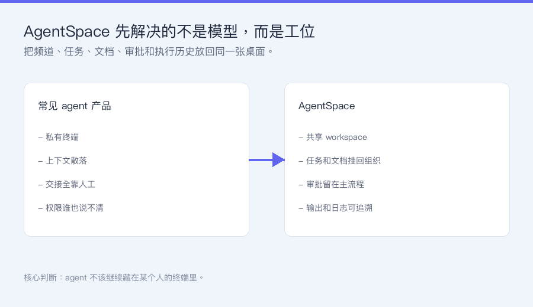
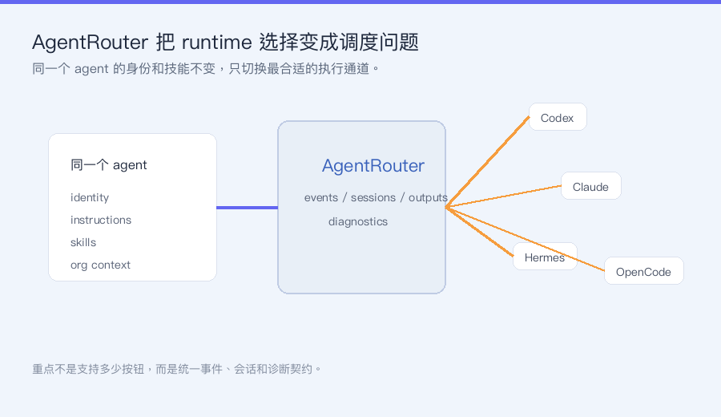
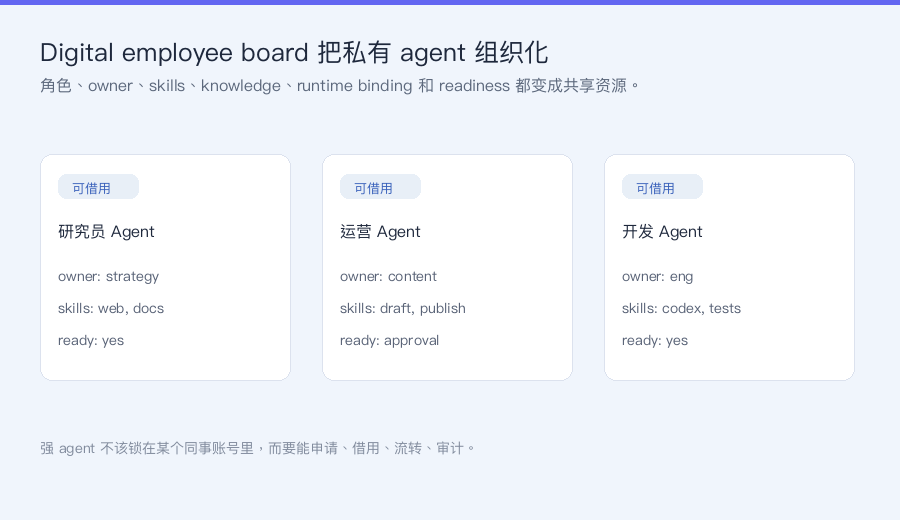
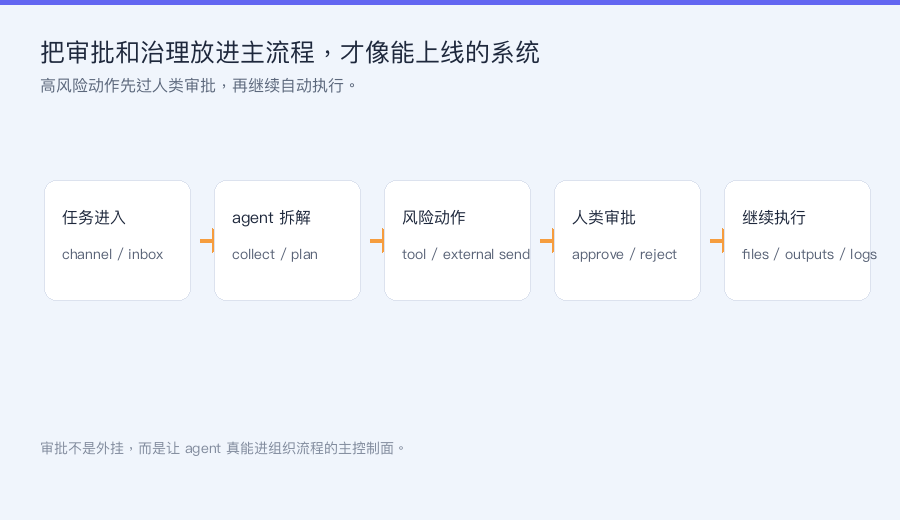
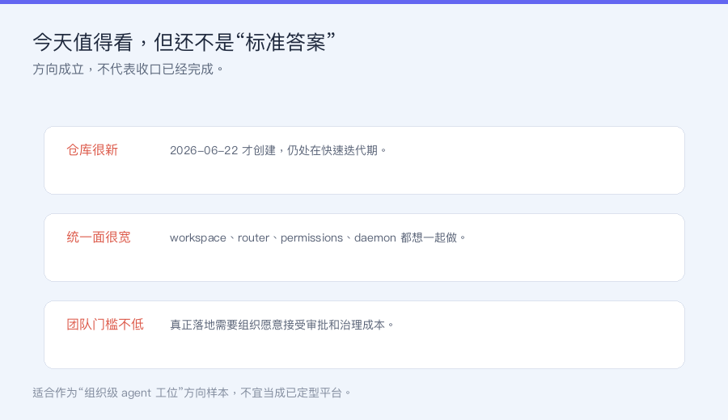

# AgentSpace：给人和 Agent 共用的工位

Source: https://mp.weixin.qq.com/s/RErTlV9flQjaGkFF-GzXuA

# AgentSpace：给人和 Agent 共用的工位

二万
二万

AI数据智囊

在小说阅读器读本章

去阅读

在小说阅读器中沉浸阅读

**今日推荐：AgentSpace**

这两个月看 agent 项目，最常见的一种错觉是：只要模型够强、工具够多，团队自然就会开始用 agent 干活。但真正把 agent 接进组织以后，问题常常不是“它会不会调用工具”，而是“谁拥有它、谁审批它、谁能接力它、出了事谁看日志”。`AgentSpace` 值得写，不是因为它又做了一个聊天壳，而是它直接把这些组织层问题摆到台面上。

截至 2026 年 6 月 30 日，我看到 GitHub 上 `HKUDS/AgentSpace` 有 561 stars，仓库创建于 2026 年 6 月 22 日，最近一次推送在 2026 年 6 月 29 日。README 给它的定位很克制：不是再造一个单人 agent 框架，而是做一个面向 human + agent teams 的 agent-native collaborative workspace。平台模式和自托管模式都提供同一套核心能力：AgentRouter 调度、共享数字员工、审批治理、审计输出和远程执行。

**它不是又一个 agent 聊天壳，而是给人和 agent 共用的工位**

`AgentSpace` 最值钱的第一步判断，是它没有把 agent 当成“某个人私有的超级终端”。README 一上来就点得很准：今天很多 agent 产品依然围绕“一个人、一个终端、一个会话”设计，所以真正进入团队后，agent 往往变成私产，能力藏在个人账号和本地上下文里，别人既借不到，也审不到，更接不住。

`AgentSpace` 想改的，就是这层默认前提。它把 workspace 当成主语：人和 agent 共用频道、任务、文档、审批和执行历史。你不需要每次从头搬上下文，也不需要让所有产物散在聊天记录、截图、临时文件夹和某个 CLI 会话里。对小团队来说，这个判断比“模型又多接了两个工具”更关键，因为真正拖慢协作的往往不是模型能力，而是交接成本。

**AgentRouter 才是它最像产品而不是概念的一层**

很多 agent 项目会告诉你“支持多个模型 / 多个 runtime”，但大部分只是多放了几个按钮。`AgentSpace` 里更有意思的是 AgentRouter 这层执行契约：同一个 agent 的身份、指令、技能和组织上下文保持稳定，真正变化的只是任务被路由到哪一个 harness 或 provider runtime 去执行。

README 明写它已经把 Claude Code、Codex、OpenCode、OpenClaw 和 Hermes 接到同一条路径里，并且统一了 events、sessions、outputs 和 diagnostics。这意味着团队不是为了换 runtime 就重建一遍流程，而是把 runtime 选择变成调度问题。谁适合写代码、谁适合重工具执行、谁适合快响应，都可以在同一套工位里切换。这层抽象如果做稳，比单纯“多模型支持”更接近真实团队会反复使用的能力。

**它把私有 agent 变成可借用的组织资产**

第二个值得写的点，是它把 digital employee board 做成了第一等对象。过去很多团队里最强的 agent 往往锁在某个同事自己的账号、自己的提示词、自己的工具权限和自己的本地知识里。离开那个人，agent 就等于不存在。

`AgentSpace` 的思路是反过来：把 agent 的角色、owner、skills、knowledge、runtime binding 和 readiness 公开成组织级资源。别人可以申请借用、请求访问、在审批后接手，管理员也能沿着资源树看权限。这个方向特别像把“好用的 agent”从个人秘方，改造成团队能继承、能流转、能治理的数字员工。对想认真把 agent 用进业务流程的团队，这比多一个 prompt 模板重要得多。

**真正难得的是把审批和治理放进主流程**

大多数 agent 产品到“审批”这一步就会突然变成外挂。要么靠 Slack / 飞书消息补一下，要么靠人工盯着 CLI，不出事时感觉一切顺滑，真出边界动作时才发现没有主控制面。

`AgentSpace` 明确把高风险动作、人类审批、权限树、文档访问、Google Workspace delegation、daemon token、runtime tool approval 都归进同一套 control plane。它甚至把“人批准一次，agent 继续往下跑”的 loop 当成主路径来设计。这件事听起来不性感，但其实决定了 agent 到底是 demo，还是能进组织内日常运转的系统。因为一旦 agent 真开始写文档、读表格、发外部消息、跑远程执行，没有治理层，越强反而越危险。

**需要冷静看的地方**

当然，这个项目现在也有边界。第一，561 stars 对今天的 agent 赛道来说说明它已经被关注，但还远没到生态稳固的阶段，很多团队会先把它当方向样本而不是现成标准件。第二，它想统一的东西很多：workspace、router、permissions、approvals、knowledge、daemon、docs，全都收进一个产品，落地难度天然比单点工具高。第三，README 里连 Feishu integration、OpenCode path、quality check 都在快速演进，说明它目前仍处在高频收口阶段。

**二万怎么看**

我会把 `AgentSpace` 看成一个很值得盯的信号：下一代 agent 产品不一定赢在“谁的模型接得更多”，而可能赢在“谁先把 agent 变成组织里真正可协作、可交接、可审批、可审计的工位成员”。如果你只想找一个个人效率助手，它会显得偏重；但如果你已经开始想“多个人怎么和多个 agent 一起干活”，这个仓库的判断很值得拆。推荐指数：★★★★☆。

**一句话总结**

`AgentSpace` 最值得看的，不是它又支持了多少个 runtime，而是它认真把“人和 agent 怎么在同一套组织语境里协作”做成了产品。

项目地址：

https://github.com/HKUDS/AgentSpace

在线入口：

https://hire-an-agent.online/

---

如果觉得有用，点个「在看」支持二万

每天分享一个好用的 AI 工具/思路

关注我，一起搞懂 AI

> 让 agent 真正进团队，先补工位和治理，再补神话。

—— 二万

预览时标签不可点

阅读原文

微信扫一扫  
关注该公众号

知道了

微信扫一扫  
使用小程序

取消
允许

取消
允许

取消
允许

×
分析

微信扫一扫可打开此内容，  
使用完整服务

：
，
，
，
，
，
，
，
，
，
，
，
，
。
 
视频
小程序
赞
，轻点两下取消赞
在看
，轻点两下取消在看
分享
留言
收藏
听过