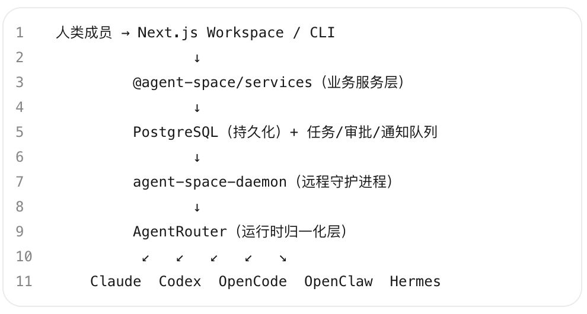

# AgentSpace：让 Agent 成为组织里的「数字员工」

Source: https://mp.weixin.qq.com/s/NjrJBIt68vbctcpzHR5tJA

# AgentSpace：让 Agent 成为组织里的「数字员工」

原创

弓长9528
弓长9528

弓长9528

在小说阅读器读本章

去阅读

在小说阅读器中沉浸阅读

> **一句话定位**：港大开源的 agent-native 协作工作空间，把 AI Agent 从个人终端工具升级为可调度、可审计、可共享的组织级数字员工。

---

# 一、它是什么？解决什么问题？

当前大多数 Agent 框架都围绕个人使用设计——一个终端、一个会话、一个账户。当真实团队试图把 Agent 纳入日常运营时，五大问题立刻暴露：Agent 困在某人终端里团队不可见；消息、文档、审批等上下文散落各处；每个 provider 的 CLI 行为和诊断方式各不相同；凭证和工具调用难以集中审查；跨天任务缺少队列和人工检查点。

AgentSpace 由香港大学数据智能实验室（HKUDS）开发，2026年6月22日开源，Apache 2.0 协议。核心思路是把 Agent 当「数字员工」而非工具——有岗位、有 owner、有权限边界、有审计轨迹，在共享工作空间里与人类协作完成真实工作。

# 二、它能做什么？

|  |  |
| --- | --- |
| 功能 | 说明 |
| Agent 招募与分配 | 创建有明确角色、owner 和职责的专用 Agent |
| AgentRouter 多运行时调度 | 同一 Agent 可路由到 Claude Code、Codex、OpenClaw、Hermes 等不同运行时执行 |
| 多 Agent 工作流 | Agent 在共享 workspace 频道、任务看板中协作推进 |
| 定时调度 | 自动安排 Agent 何时、如何执行任务 |
| 权限与审批 | 敏感操作（工具调用、文档访问、外部发送）进入人类审批节点 |
| 全链路审计 | Agent 行为、决策、输出完整可追溯 |
| Agent 共享与转移 | 数字员工可跨团队、跨部门流转和借用 |
| Google Workspace 集成 | Agent 级别的 OAuth 委托，支持 Google Sheets/Docs 读写 |

# 三、它是如何做到的？

AgentSpace 的技术核心是AgentRouter——一个 provider harness 归一化层。它不替代工作空间，也不拥有业务队列，而是负责启动不同 Agent CLI 并归一化事件、session 和诊断。

关键设计：Agent 的身份、指令、技能和上下文在任务间保持稳定，只有执行 harness 变化。复杂代码任务路由到 Claude Code，快速迭代用 OpenClaw，内部工具链用 Hermes——切换运行时不需要重建 Agent。前端用 Next.js App Router，后端 Node.js + PostgreSQL 16，monorepo 结构含 web、cli、daemon、domain、db、sandbox 六个包。支持 systemd + nginx 生产部署和 Docker Compose 本地部署。

# 四、它能用到什么场景？

创始团队执行系统是 AgentSpace 的典型场景：

1. 创始人在频道提出请求（无需工单系统）
2. 协调型 Agent 自动拆解任务并分配给专业 Agent
3. Agent 收集上下文（文档、知识页、Google Workspace 文件）
4. 高风险动作触发人类审批节点
5. 人类一键批准或拒绝
6. 结果写回任务、文档和运行时输出

其他适用场景包括：企业研发团队的代码审查与修复流程、运营团队的多 Agent 内容生产管线、跨部门 Agent 能力共享与复用。已集成飞书（2026.7.2 合并主分支），Slack 集成测试中。托管版地址 hire-an-agent.online，也可完全自托管。

# 五、为什么值得关注？

1.AgentRouter 是基础设施级创新

把多 provider 运行时归一化，企业不必绑定单一供应商，这个设计比功能本身更具战略意义。

2.治理先行而非事后补课

权限控制面覆盖工作区成员、频道、文档、运行时、daemon token 和 Google 凭证，从第一天就有审计轨迹。

3.学术背景 + 开源友好

HKUDS 实验室此前产出过 LightRAG（28k+ Stars）等明星项目，Apache 2.0 协议支持商用。

4.飞书/Slack 集成面向中国市场

已合并飞书集成，对国内企业协作场景友好。

# 六、基本信息卡

|  |  |
| --- | --- |
| 项目 | 信息 |
| 名称 | AgentSpace |
| 类型 | 开源（Apache 2.0）+ 托管版 |
| GitHub Stars | 642（截至 2026-07-10，项目仅 18 天） |
| 主要语言 | TypeScript |
| 最新版本 | v1.0（2026-06-21 发布） |
| 技术栈 | Next.js / Node.js 24 / PostgreSQL 16 / Docker Compose |
| 开发团队 | 香港大学数据智能实验室（HKUDS） |
| GitHub | github.com/HKUDS/AgentSpace |
| 托管版 | hire-an-agent.online |

# 七、竞品分析

AgentSpace 处于「Agent 协作平台」赛道，与 Octo、Multica、CrewAI 形成直接竞争。

|  |  |  |  |  |
| --- | --- | --- | --- | --- |
| 对比维度 | AgentSpace | Octo | Multica | CrewAI |
| 定位差异 | Agent 原生协作工作空间，强调治理 | 自建 IM Server + Agent 原生接入 | 多 Agent 团队管理，人机平等协作 | 多 Agent 角色扮演框架，偏开发库 |
| 技术路线 | AgentRouter 归一化多运行时 | 专用 IM（Channel/Thread/Matter） | 支持 10+ Agent 后端 | Python 库，角色 + 任务编排 |
| 部署方式 | 自托管 + 托管版，Next.js 全栈 | 自建 IM Server，需换工具 | 开源自托管 | pip 安装，无工作空间 UI |
| 治理能力 | 权限控制面 + 审计轨迹 + 审批流 | Bot 身份 + Skills | 团队管理面板 | 无（框架级） |

> **与竞品相比，AgentSpace 的核心优势是 AgentRouter 实现了多运行时归一化——同一 Agent 可跨 Claude Code/OpenClaw/Hermes 无缝切换而不丢失上下文，这是其他协作平台都没有解决的基础设施问题；主要短板是项目仅 18 天、642 Stars，生态和社区尚处极早期，生产可靠性有待验证。**

预览时标签不可点

微信扫一扫  
关注该公众号

知道了

微信扫一扫  
使用小程序

取消
允许

取消
允许

取消
允许

×
分析

微信扫一扫可打开此内容，  
使用完整服务

：
，
，
，
，
，
，
，
，
，
，
，
，
。
 
视频
小程序
赞
，轻点两下取消赞
在看
，轻点两下取消在看
分享
留言
收藏
听过