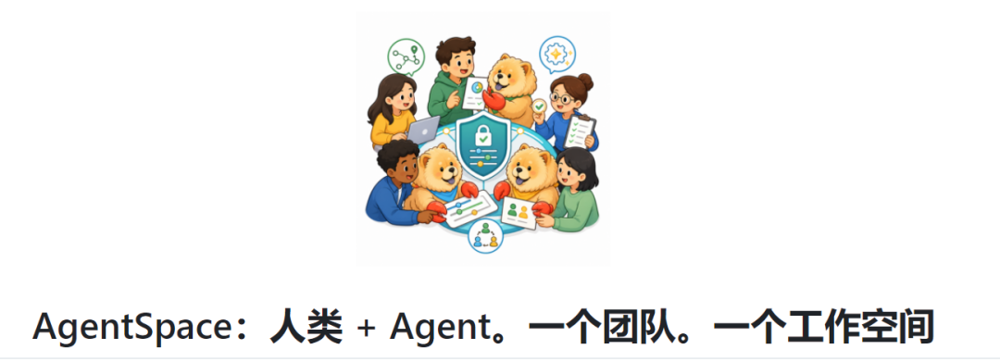
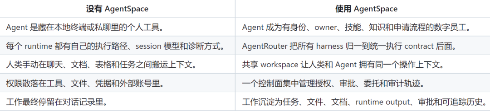
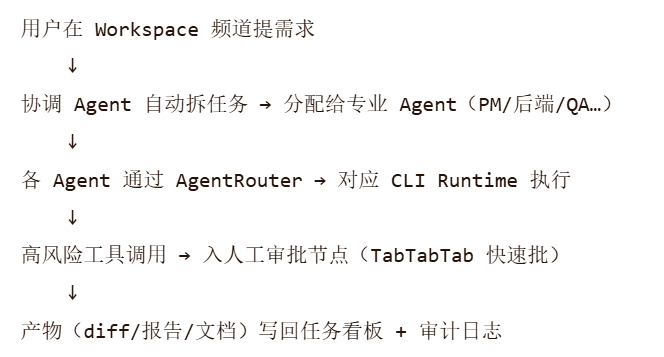
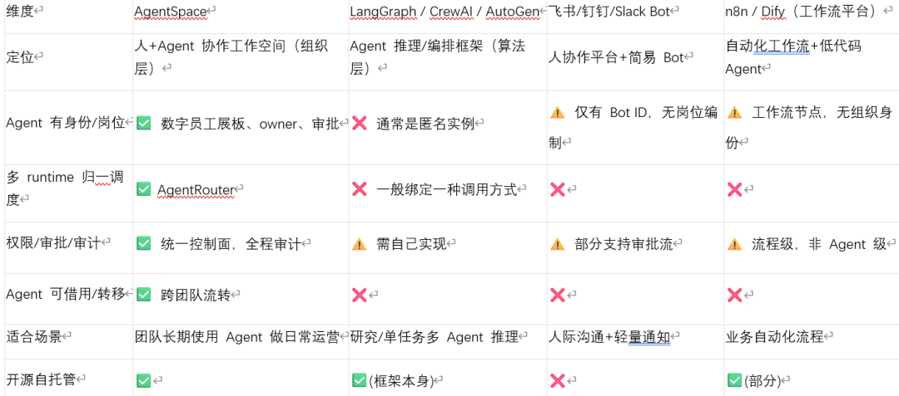

# 【开源】从个人助手到数字员工：港大开源为人协作而生 如何把 AI Agent 纳入团队组织与治理？

Source: https://mp.weixin.qq.com/s/HnUU1XCWJy0HHYLoN-ar0w


# 【开源】从个人助手到数字员工：港大开源为人协作而生 如何把 AI Agent 纳入团队组织与治理？

原创

三丰
三丰

三丰述码


在小说阅读器读本章

去阅读


在小说阅读器中沉浸阅读

前言：你的 AI Agent，有"工位"吗？

你团队里可能已经有人在用 Claude Code 写代码、用 Perplexity 查资料、用 Coze/Dify 搭工作流 Agent。

但认真问几个问题：

这个 Agent属于谁？是某个人的私有终端，还是团队资产？

它做过什么决策、动过哪些文件——有审计记录吗？

它能读内部文档、发外部邮件——谁审批过？

同事想复用你调好的 Agent，怎么交接？

大多数 Agent 框架只解决"Agent 怎么更聪明"，AgentSpace（HKUDS 开源）解决的是另一层更职场化的问题——Agent 怎么作为一个有身份、有岗位、有治理的数字员工，进入组织与人协作。

官方一句话定义：

> 飞书为人类协作而生，AgentSpace 为人类和 Agent 共同协作而生。

---



# 项目由来：Agent 不该只是个人玩具

当前主流 Agent 产品（ChatGPT、Claude Code、CrewAI、LangGraph…）基本围绕单人使用设计——一个人、一个终端、一个会话。放到真实团队立刻暴露痛点：

Agent 是私产——锁在某人工位，别人看不见也借不到

上下文散落——消息、文档、产物、截图各在一处，交接=重建

Runtime 割裂——Claude Code / Codex / OpenClaw 各搞各的 session 模型，切换要重配

治理缺失——凭据、工具调用、外发动作没法集中审计

工作不持续——跨天任务缺队列、重试、人工检查点

HKUDS（香港大学数据智能实验室）认为：真实工作发生在人、系统和责任边界之间，Agent 应该像员工一样被招募、分配、审批、审计、转移。AgentSpace 就是为这个场景设计的 agent-native 协作工作空间。



---

# 核心原理与架构

AgentSpace 不是替代 LangGraph/CrewAI，而是在它们之上（或对接各 Provider CLI）提供组织层 + 调度层 + 治理层。

## 1️⃣ 核心概念

| 概念 | 说明 |
| --- | --- |
| **Thing = Digital Employee（数字员工）** | 有名字、角色说明、owner、技能、知识库、runtime binding，身份稳定 |
| **Workspace** | 共享频道、任务看板、文档、Inbox，人 Agent 共用 |
| **AgentRouter** | 归一化 harness 层——同一 Agent 身份不变，按任务路由到 Claude Code / Codex / OpenClaw / Hermes 等运行时，统一 events/session/outputs |
| **Policy & Approval** | 敏感动作（读密文档、外发、改 DB）走人工审批，全程留审计轨迹 |
| **Daemon** | 可部署在本地或远程服务器，Agent 在真实项目目录里执行任务 |

## 2️⃣ 典型工作流



关键点：Agent 身份、指令、知识、权限全程不变，只换执行引擎；上下文、产物、审批留在 Workspace，不埋在某人的终端。

## 3️⃣ 四大支柱能力

🗓调度（Schedule）：AgentRouter 多 runtime 自动选择，一个 Agent 多个"工位工具"

🧑‍💼能力共享（Capability）：数字员工展板——组织内可见、可申请借用、owner 审批，私有 Agent → 组织资产

🤝协作（Collaboration）：多 Agent 在频道/看板协同，人类在关键节点介入

🔐治理（Governance）：统一权限树、runtime tool approval、Google Workspace 委托、全量操作审计

---

# 职场 AI 应用场景

## 💻 研发团队——虚拟研发交付组

招募 PM Agent、架构师 Agent、后端 Agent、前端 Agent、测试 Agent、Code Reviewer，加入#feature-x频道。

人在频道提需求 → PM Agent 写 PRD → 架构师出设计 → 后端/前端并行开发 → 测试跑用例 → 人工批合并 PR

代码在真实仓库执行，产物回写任务，谁动了什么一清二楚。

## 📊 市场/运营——竞品分析与内容生产流水线

选题 Agent → 爬取/摘要 Agent → 数据分析 Agent → 初稿 Agent → 校对 Agent → 人类终审发布。

Agent 可绑定企业知识库（品牌调性、禁用词），输出直接进内容日历文档。

## 🏢 企业内部 IT/HR 服务台

员工问"年假还剩几天"/"重置 VPN 密码"

Agent 识别意图 → 调 HR/IT API → 返回或执行 → 敏感操作（重置密码）需人工审批

所有交互留审计，满足合规要求。

## 🔬 科研/数据分析团队

数据采集 Agent + 清洗 Agent + 建模 Agent + 报告 Agent 串行/并行协作，中间数据集存 Workspace，实验可复现、可回溯。

---

# 赚钱 / 商业变现场景

| 模式 | 说明 |
| --- | --- |
| **企业 AI 数字化转型咨询** | 帮中小企业/律所/会计师事务所搭 AgentSpace + 定制数字员工（合同审查 Agent、财报分析 Agent），收实施费+年维保费 |
| **SaaS 包装"数字员工平台"** | 基于 AgentSpace 自托管版封装为行业 SaaS（如"律所 AI 助理工作台"），按席位/按 Agent 数订阅 |
| **Agent 模板商店** | 制作高质量角色 Prompt + 技能包 + 知识库模板（销售、客服、代码 Review、财务审计），出售或按次授权 |
| **内训与交付包** | 面向 DevOps/IT 部门提供「Agent 治理与数字员工管理」培训 + 一键部署包，收培训费 |
| **信创/私有化项目集成** | AgentSpace 可完全自托管、开源可审计，适合对数据主权敏感的政企项目，作为 AI 协作层中台投标 |

> 💡 趋势判断：未来咨询公司卖的不只是"接一个 ChatGPT"，而是**帮客户设计 Agent 岗位编制、权限边界、审批流——AgentSpace 恰好是落地的操作层**。

---

# 优点与局限

## ✅优点

首次认真把 Agent组织身份、权限、审计、交接做成产品，不止是聊天壳

AgentRouter 解决多 Provider CLI 切换痛点，身份与运行时解耦

支持本地/远程 Daemon，可在真实代码目录执行，产物留痕

开源（Apache-2.0），可自托管、可私有化，适合企业内网

与 LangGraph/CrewAI/AutoGen 不冲突——可底层用它们，上层套 AgentSpace 治理

## ⚠️局限

项目较新（2026年中首发），生态和插件仍在完善

对非技术团队有一定学习成本（需理解 runtime/daemon/workspace 概念）

目前偏重"组织管理+调度"，复杂多 Agent 推理编排仍需结合 CrewAI/LangGraph

大规模千级 Agent 并发调度待生产验证

---

# 与类似平台对比



一句话总结：LangGraph/CrewAI 让 Agent 更聪明，AgentSpace 让 Agent 成为可管理的数字员工；两者互补而非替代。

---

# 结语

> AgentSpace 做的不是让聊天框更漂亮，而是把"组织"带进人机协作——岗位、权限、审批、审计、交接，一个都不能少。

如果你的团队已经开始跑多个 Agent，却被"谁管、谁审、谁接手"卡住，不妨看看这个项目。

开源地址

```
关注公众号 回复 20260714 获得
```

[8元解锁820+优质项目！别再瞎找资料了！AI、低代码、Agent实战教程一网打尽，永久更新！](https://mp.weixin.qq.com/s?__biz=MzI3MTQyNDc5MA==&mid=2247504934&idx=1&sn=d781838f7483fbdf5292f17c22f54c50&scene=21#wechat_redirect)


预览时标签不可点


微信扫一扫  
关注该公众号

知道了


微信扫一扫  
使用小程序

取消
允许

取消
允许

取消
允许

×
分析


微信扫一扫可打开此内容，  
使用完整服务

：
，
，
，
，
，
，
，
，
，
，
，
，
。
 
视频
小程序
赞
，轻点两下取消赞
在看
，轻点两下取消在看
分享
留言
收藏
听过