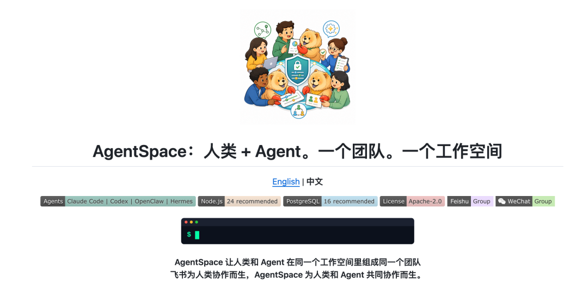
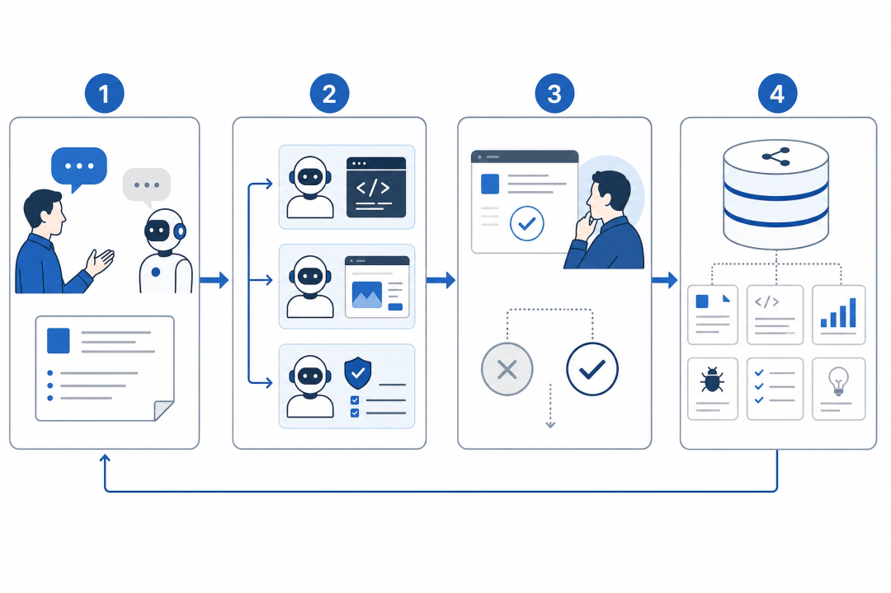

# 如何创建一支 Agent 虚拟团队？港大最新开源 AgentSpace 实例解析

Source: https://mp.weixin.qq.com/s/SuFwGOpPvpLHsXjdabmtvg


# 如何创建一支 Agent 虚拟团队？港大最新开源 AgentSpace 实例解析

原创

努力写作的大卫
努力写作的大卫

大卫数智话


在小说阅读器读本章

去阅读


在小说阅读器中沉浸阅读


前阵子我发了两篇关于 AI 原生团队的报告，大家都特别关注[多智能体协作框架与案例分析](https://mp.weixin.qq.com/s?__biz=MzkyNzMyNTkwMg==&mid=2247486065&idx=1&sn=4681df89d40048e2b4b209c426592e54&scene=21#wechat_redirect)。

我也在思考：一个超级个体或 OPC，能不能真正建一支能干活的 Agent 虚拟团队？有没有更好的工具？

6 月 21 日，香港大学 Data Intelligence Lab@HKU（GitHub：HKUDS）开源了 AgentSpace。



AgentSpace 为人类和 Agent 共同协作而生。 

https://github.com/HKUDS/AgentSpace

我对这个项目很有兴趣。下文做一个解析，重点通过实例，看怎么用 AgentSpace 创建一支多智能体虚拟团队。

## 一、AgentSpace 关注点在哪里

现有多数 Agent 产品默认「一个人、一个终端、一个聊天窗口」。个人提效够用；要让多个 Agent 像团队一样协作，四个缺口就会冒出来：

Agent 是个人工具，别人看不见、借不到；上下文没有共同的家，交接等于重建；Claude Code、Codex、OpenClaw 执行环境各搞各的；凭据、权限、外发动作，几乎没法集中审计。

AgentSpace 关注的是组织操作系统：岗位、频道、任务、审批、产物，都在同一个工作空间里。

## 二、两个概念：运行环境和数字员工

**运行环境（Runtime）** 是 Agent 干活的「工位和电脑」——在本机或远程服务器上启动 Claude Code、Codex、OpenClaw、Hermes 等命令行工具，实际跑任务、回传结果。

**数字员工** 是「岗位编制」——有名字、角色、负责人、岗位说明、技能和可出现的频道。先配好运行环境，再创建并绑定数字员工，两者合在一起，才是一个能上岗的 Agent。

## 三、实例：组一支研发交付团队

我更关注如何组建一支由 Agent 组成的研发交付团队。

不管是超级个体做最小可行产品，还是小团队交付代码仓库里的功能，组法都一样：协调员拆任务 → 产品经理写需求规格 → 各专职 Agent 执行 → 人工审批 → 成果沉淀在工作空间里。

下文用研发交付举例：如何在 3 天内，把存量代码库里的「用户权限 RBAC 重构」合进主分支。

你可以一个人当负责人管 7 个 Agent，也可以 3 人研发团队共用同一工作空间——流程相同，差别只在有几个同事参与人工确认。

### 第 1 步：启动工作空间

不想自己搭服务器，直接用托管版：https://hire-an-agent.online 。自托管可按下面命令启动：

```
git clone https://github.com/HKUDS/AgentSpace.git  
cd AgentSpace  
npm run setup  
cp .env.example .env  
docker compose -f deploy/postgres/docker-compose.yml up -d  
npm run db:pg:init  
npm run dev:web
```

浏览器打开 http://127.0.0.1:1455，注册工作空间。你是技术负责人，也是所有数字员工的负责人。

### 第 2 步：运行环境指向真实代码目录

Agent 必须在真实项目目录里读写代码，不能只在聊天里「空想」。

推荐在前端「容器」页面（/agents?mode=container）生成安装命令，复制到已克隆代码的开发机上执行。daemon 启动后会自动检测本机已安装的 provider CLI（claude、codex、openclaw 等），每种 CLI 对应一套运行环境；开发机上装齐三种 CLI，就会出现后端、前端、审查三套环境，工作目录都指向同一项目根路径。

AgentSpace 还会为每个「频道 + 数字员工」维护一块远程执行工作区，员工的身份、岗位说明和技能在任务之间保持稳定。 

自托管也可在 AgentSpace 仓库里手动打包安装（版本号随发布包变化，以下以 v0.1.3 为例）：

```
npm run daemon:pack  
npm install -g ./agent-space-daemon-0.1.3.tgz  
  
agent-space-daemon start \  
  --foreground \  
  --server-url "https://your-agentspace-domain" \  
  --daemon-token "adt_xxx" \  
  --daemon-id "daemon-prod-01" \  
  --device-name "prod-daemon-host-01" \  
  --runtime-name "Remote Agent" \  
  --task-timeout "43200000" \  
  --state-dir "$HOME/.agent-space-daemon"
```

建议在同一台开发机上装齐 Claude Code、Codex、OpenClaw，让 daemon 自动注册三套运行环境（代码目录可相同）：

| 环境名称 | 对接 provider | 代码目录 | 用途 |
| --- | --- | --- | --- |
| 后端环境 | claude（Claude Code） | `/workspace/my-app` | 后端、架构、测试 |
| 前端环境 | codex（Codex） | 同一路径 | 前端 |
| 审查环境 | openclaw（OpenClaw） | 同一路径 | 审代码改动 |

AgentRouter 的作用，是检查这些命令行工具是否可用，把不同工具的输出统一成同一套事件格式，并把「调用敏感工具」的审批请求送回工作空间。

### 第 3 步：招募数字员工

| 员工 | 怎么来 | 绑定运行环境 | 干什么 |
| --- | --- | --- | --- |
| 协调员 LeadBot | 手动创建 | 后端环境 | 拆任务、跟看板，不写代码 |
| 产品经理 PM | 内置「产品经理 Agent」模板 | 后端环境 | 写需求文档和验收标准 |
| 架构师 Arch | 手动创建 | 后端环境 | 出技术方案、标边界和风险 |
| 后端 Backend | 手动创建 | 后端环境 | 只改 `src/server/**` |
| 前端 Frontend | 手动创建 | 前端环境 | 只改 `src/web/**` |
| 测试 QA | 手动创建 | 后端环境 | 写测试、跑测试 |
| 审查 Reviewer | 手动创建 | 审查环境 | 审代码改动，不改代码 |

7 个数字员工加入频道 `#auth-refactor`。产品经理模板创建时会自动绑定系统预置技能；架构师和后端可以把仓库里的项目约定写进岗位说明，或通过 `agent-space skill import` 导入技能包。

给协调员 LeadBot 的岗位说明里，写清楚质量门禁：

> 需求规格和技术设计没写入频道文档前，后端和前端不能开工。测试没覆盖验收标准前，审查员不能审代码。推送代码、改持续集成配置等敏感操作，应配置为走审批流程。

想先小步验证，可以缩成 4 人：协调员 + 产品经理 + 全栈开发 + 审查员。跑通一轮闭环，再扩到 7 人。

### 第 4 步：在频道里发起需求

在 `#auth-refactor` 发一条消息：

> 工单 #412：用户权限从 role 字符串改成 RBAC。3 天内合进主分支。不能破坏现有接口，数据库迁移要可回滚。  
> @PM 出需求文档和验收标准。@Arch 出技术设计，标清迁移风险和回滚方案。

产品经理写 `docs/prd-auth-rbac.md`，架构师写 `docs/design-auth-rbac.md`，都存进频道文档。你回复「规格确认，可以开发」——这是第一个人工确认节点。

### 第 5 步：看板并行开发

| 任务 | 负责人 | 前置条件 |
| --- | --- | --- |
| 编写迁移和回滚脚本 | 后端 | 设计已确认 |
| 实现 RBAC 中间件 | 后端 | 迁移脚本完成 |
| 改前端权限路由和菜单 | 前端 | 接口约定已冻结 |
| 补充集成测试 | 测试 | 中间件有初版 |

后端和前端可以同时推进。在工作空间里，你能统一看到每个 Agent「开始调用工具」和「调用结束」的状态；岗位说明里限定各自只能改哪些目录，避免互相踩文件。

### 第 6 步：测试、审查、审批

测试 Agent 跑项目自带的测试命令（示例：`npm run test -- --grep rbac`），失败的用例挂回对应任务。审查 Agent 用 OpenClaw 审代码改动。

下面这条是 AgentRouter 的本地冒烟测试命令，与 README 示例一致；实际在工作空间里，任务由远程 daemon 调度：

```
agent-router run --harness openclaw --cwd /workspace/my-app --mode medium "review this diff"
```

按治理规则配置后，推送代码、创建合并请求、改流水线配置等敏感工具调用，会进入工具调用审批（官方类型名 `runtime_tool`）。审批箱里能看到工具名称和操作预览，点批准后 Agent 才继续。合并代码仍建议你在 GitHub 上亲手点最后一下。

### 第 7 步：沉淀成果、控制费用

合并完成后，工作空间里应留下：需求文档、设计文档、审查记录、知识库里的决策说明、全部完成的任务、运行产出文件，以及各 Agent 的调用费用统计。预算上限需手动设置，可以按整个工作空间、单个 Agent 或单个频道设月度限额，接近预警线时会提醒。

## 四、和 HiClaw、OpenCastle 怎么比

在此前的多智能体协作框架报告里，我介绍过 HiClaw 和 OpenCastle。AgentSpace 与之相比，有什么不同？

| 维度 | HiClaw | OpenCastle | AgentSpace |
| --- | --- | --- | --- |
| 核心定位 | 多智能体协作控制面 | AI 编码团队编排 | 人类+Agent 共用工作空间 |
| 组团队方式 | 管理者 + Worker IM 房间 | 编排器 + 专业 Agent | 数字员工展板 + 频道 + 任务看板 |
| 执行层 | 多运行环境共存 | 多编码运行时混合 | AgentRouter 统一对接 CLI |
| 治理 | 可见性 + 人工介入 | 内置质量门禁 | 权限 + 审批 + 审计 + 成本 |
| 业务范围 | 偏工程交付 | 偏代码仓库工作流 | 更广，含运营、文档、Google Workspace |

HiClaw 管「多 Agent 怎么被看见」，OpenCastle 管「编码任务怎么被拆解验证」，AgentSpace 管「人和 Agent 怎么在同一个工作空间里长期共事」。三者不是替代关系。

## 五、不足与门槛

AgentSpace v1.0 刚发布（2026 年 6 月 21 日），离真正省心还有距离。

自托管推荐 Node.js 24、PostgreSQL 16，另需 daemon 和至少一种 provider CLI（daemon 要求 Node.js ≥20.20.0），对非技术人员不算友好。个人试用可以优先走托管版 https://hire-an-agent.online 。

OpenCastle 自带质量门禁和工作树隔离，AgentSpace 的标准流程、审批规则、预算上限都要自己搭。用 AgentSpace 组一支 7 人虚拟研发团队，并不是开箱即用。

AgentRouter 对 Gemini CLI、OpenCode 等仍在旧版接入路径，沙箱隔离、存储隔离还在产品路线图中。它补的是团队协作层，合并请求和本地调试仍靠 GitHub 和各编码 CLI。

一个人写代码、做研究，继续用 Claude Code 或 OpenClaw 就好。有多 Agent 协作需求，你得愿意先花半天设计岗位和流程规范，再考虑 AgentSpace。

## 六、写在最后

AgentSpace 开始把「组虚拟团队」这件事产品化了：先定编制，绑运行环境，在频道里派活，关键节点人工拍板，成果留在工作空间里。

这类产品会加速成熟。

如果你也要搭建研发交付虚拟团队，可以从 4 个 Agent 试起（协调员 + 产品经理 + 全栈开发 + 审查员），跑通「写规格 → 开发 → 审查 → 审批推送代码」的闭环，再扩到 7 人。

虚拟团队能不能跑起来，看的是分工、交接、留痕——这些机制一旦跑通，一支 Agent 虚拟团队离真正能干活就不远了。

预览时标签不可点

阅读原文


微信扫一扫  
关注该公众号

知道了


微信扫一扫  
使用小程序

取消
允许

取消
允许

取消
允许

×
分析


微信扫一扫可打开此内容，  
使用完整服务

：
，
，
，
，
，
，
，
，
，
，
，
，
。
 
视频
小程序
赞
，轻点两下取消赞
在看
，轻点两下取消在看
分享
留言
收藏
听过