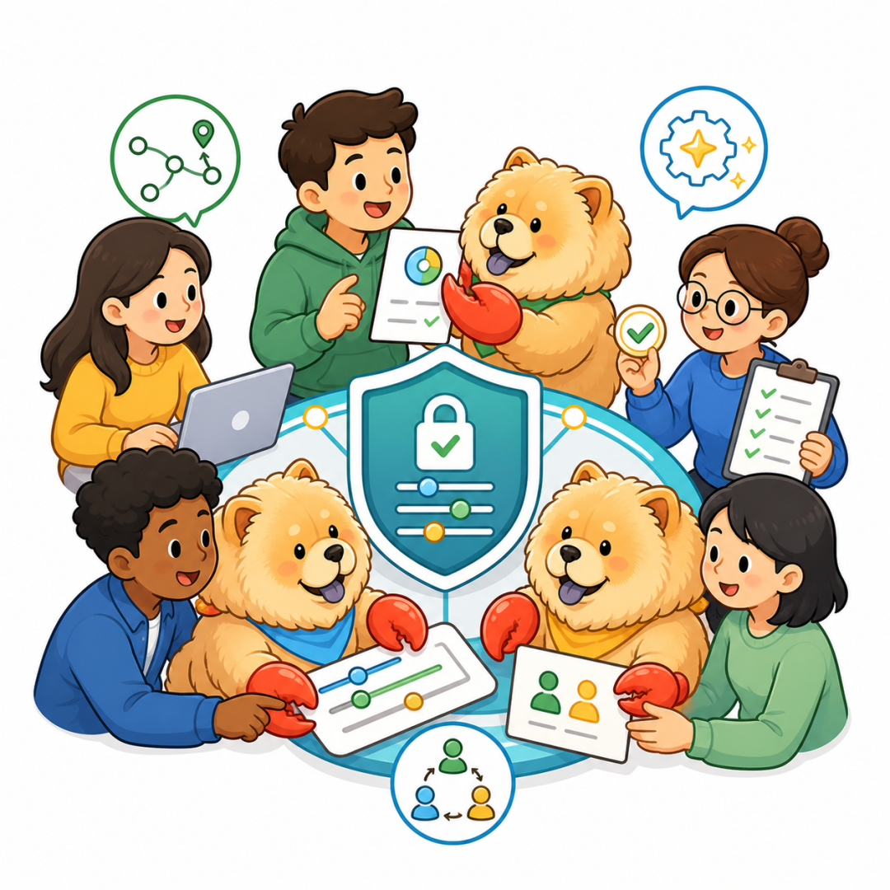

# 让Codex,Claude code,Hermes等组成一个队伍，共同完成一个任务

Source: https://mp.weixin.qq.com/s/UzLR4ocBWXnHAAA6akH0TA


# 让Codex,Claude code,Hermes等组成一个队伍，共同完成一个任务

原创

六书
六书

廖聊Ai


在小说阅读器读本章

去阅读


在小说阅读器中沉浸阅读



**来源**：GitHub Trendin（HKUDS/AgentSpace）

我最近一直在想一个事。

Hermes、Claude Code、Codex，这些 Agent 越来越强，但每次用完之后，它们的能力都锁在我自己的终端里——团队里其他人看不见、借不了、用不上。

上周我收到一个需求，需要几个 Agent 协作完成：一个查资料、一个写代码、一个审结果。我手动在不同的终端之间切来切去，每个 Agent 的上下文都不共享，每次切换等于重来一遍。

这不是工具的能力问题，是**组织方式**的问题。Agent 还是个「个人工具」，而不是「团队成员」。

让Codex,Claude code,Hermes等组成一个队伍，共同完成一个任务。

想想都兴奋。

AgentSpace 是什么

一句话：把 AI Agent 从「个人终端里的工具」变成「团队里可以共享的数字员工」。

核心做法是四个能力：

* \*\*调度\*\*：同一个 Agent，根据任务自动选合适的 runtime（Hermes、Claude Code、Codex 等），身份和上下文不变
* \*\*能力共享\*\*：你的 Agent 可以展示给团队，别人可以借用，不用从零开始
* \*\*多 Agent 协作\*\*：多个 Agent 在同一个 workspace 里配合，人只在关键节点审批
* \*\*安全治理\*\*：权限、凭据、执行记录集中管控

它来自香港大学数据科学团队（HKUDS），Apache-2.0 协议，可以自托管。

安装体验

我试了一下自托管部署，流程挺简单：

```
git clone https://github.com/HKUDS/AgentSpace.git
cd AgentSpace
npm run setup
npm run dev:web
```

前提条件：Node.js 24+ 和 PostgreSQL 16+。

npm run setup 会自动安装依赖、初始化数据库。整个过程大概两三分钟，没有复杂的配置项——开发体验符合「clone 就能跑」的预期。

不想自己搭的话，也可以用他们的托管版 hire-an-agent.online，注册就能用。

最让我感兴趣的设计

**AgentRouter**。

同一个 Agent 可以在不同 runtime 之间切换——今天用 Hermes 写代码，明天用 Claude Code 做调研，Agent 的身份、记忆、上下文都不需要重建。

以前的方案是：每个工具搭一套独立的 Agent，各自有各自的配置和上下文。切工具等于换人。AgentRouter 的逻辑是：**人不变，只是换工具**。

这个思路我觉得是对的。工具会迭代，但 Agent 和人的协作关系应该稳定。

**数字员工展示板**也很有意思。团队里谁有什么 Agent、能做什么、状态如何，一目了然。发现同事有个好 Agent，可以直接申请借用。之前藏在不同人终端里的能力，变成了团队可见的资产。

适用场景

一个人用一个 Agent 的话，AgentSpace 有点重。它的价值在团队场景里释放：

* \*\*创始团队\*\*：CEO 或 PM 提需求，几个 Agent 自动分工，人只审批关键决策
* \*\*小团队\*\*：有人擅长搭 Agent，其他人可以直接借用，不需要每个人都从零配置
* \*\*组织内共享\*\*：强大的 Agent 不再是某个人的私有工具，而是团队资产

我自己试下来觉得最值的点是：**Agent 产出的工作上下文不再丢在某个终端里**，而是留在 workspace 里，换人、换时间都能接着干。

几个注意

* 目前 AgentRouter 支持 Hermes、Claude Code、Codex、OpenClaw、nanobot，覆盖面已经不错
* 自托管需要 PostgreSQL，对纯前端用户有门槛
* 产品还在早期（v1.0 刚发布两天），功能和文档都在迭代中

**Agent 能不能成为真正的团队成员，不取决于它多聪明，取决于它能不能和团队共享一个工作空间。**

*也在想「怎么让 Agent 不只是一个人的工具」——把这篇转给跟你一起用 AI 工具的同事。*

---

这里是我做自媒体账号的始发地  
不敢说正确能用  
只是作为记录所用，无所谓流量  
能让自己保持写点东西的习惯


预览时标签不可点


微信扫一扫  
关注该公众号

知道了


微信扫一扫  
使用小程序

取消
允许

取消
允许

取消
允许

×
分析


微信扫一扫可打开此内容，  
使用完整服务

：
，
，
，
，
，
，
，
，
，
，
，
，
。
 
视频
小程序
赞
，轻点两下取消赞
在看
，轻点两下取消在看
分享
留言
收藏
听过