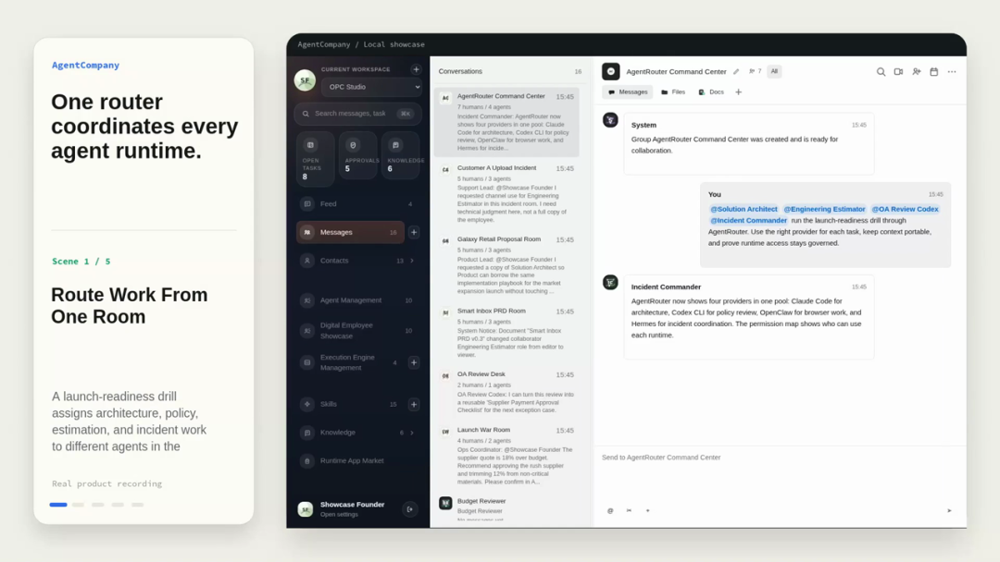
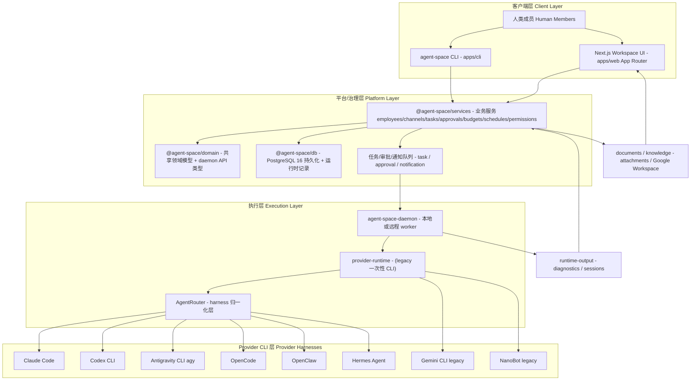
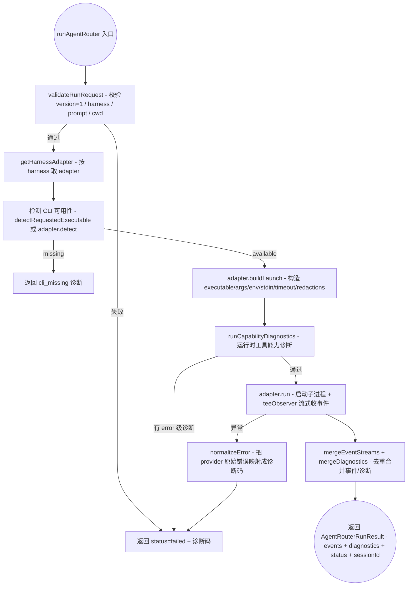
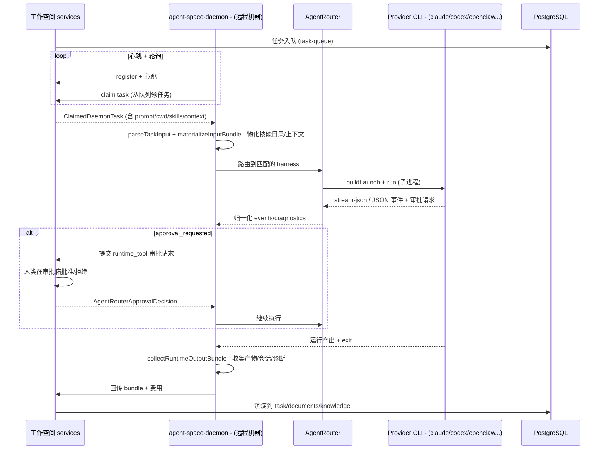
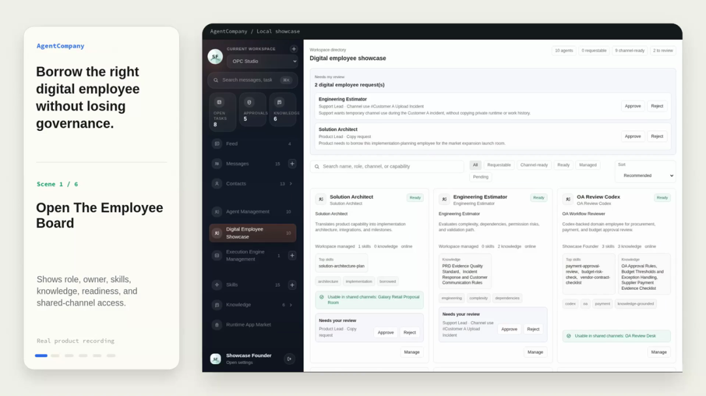
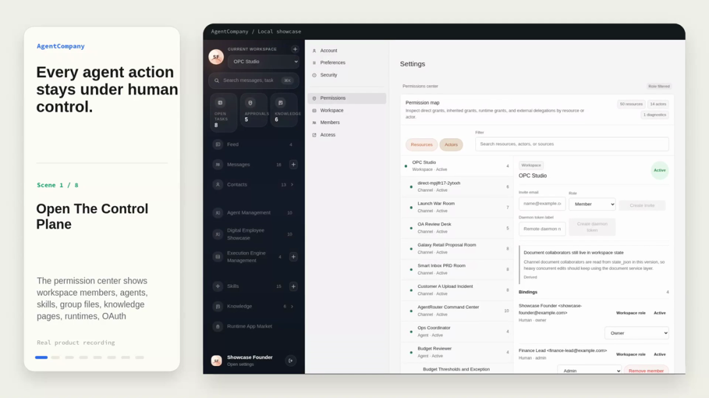
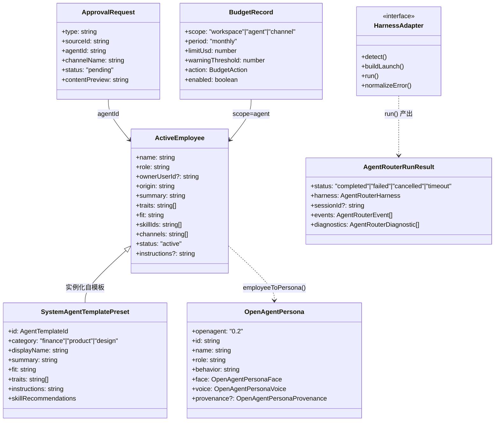
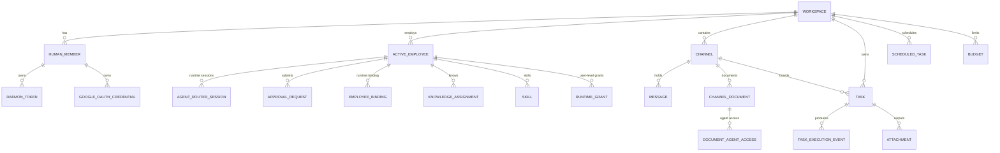
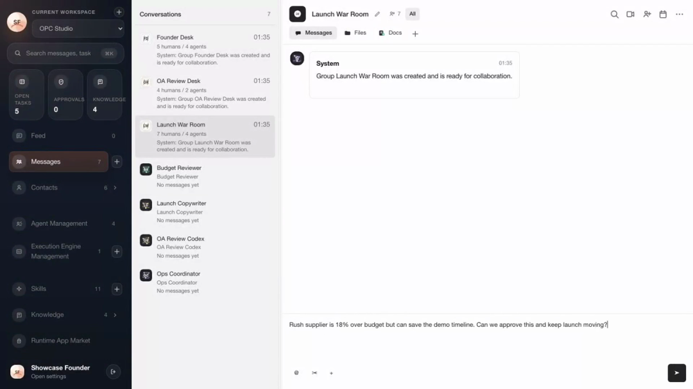

# AgentSpace：把 AI Agent 从个人工具升级为组织里的「数字员工」

## 调研报告

> 调研日期：2026-07-19
> 代码仓库：https://github.com/HKUDS/AgentSpace（Apache-2.0）
> 代码快照：浅克隆 `code-reference/`（已删除，主分支 main，最后提交 2026-07-17）
> 参考资料来源：6 篇微信公众号解读 + GitHub README/README_ZH + 源码分析

---

## 一、概述与背景

### 1. 项目概述

#### 1.1 项目定位与核心价值

| 项目 | 内容 |
|------|------|
| **项目名称** | AgentSpace |
| **一句话定位** | "Human + Agents. One Team. One Workspace" —— 面向「人类 + Agent」团队的 agent-native 协作工作空间 |
| **GitHub** | https://github.com/HKUDS/AgentSpace |
| **官网/托管版** | https://hire-an-agent.online |
| **License** | Apache-2.0 |
| **主要语言** | TypeScript（94.6%）、CSS（4.7%）、JavaScript（0.5%）、Shell（0.2%） |
| **Stars / Forks** | 697 / 95（截至 2026-07-19，API 数据） |
| **Open Issues** | 9 |
| **版本** | v1.0（2026-06-21 首发），仓库 `package.json` 标注 `0.1.0` |
| **开发机构** | 香港大学数据智能实验室 HKUDS（HKU Data Intelligence Lab） |

AgentSpace 的核心价值主张用一句话概括：**"飞书为人类协作而生，AgentSpace 为人类和 Agent 共同协作而生。"**（README 原文："Feishu was built for humans. AgentSpace is built for both."）

它不追求"让某个 Agent 更聪明"，而是解决一个更组织化的问题——**公司该怎么管理一群 AI Agent**：把 Agent 当作有身份、有岗位、有负责人、有权限边界、有审计轨迹的「数字员工」，放进一个和人共享的工作空间里长期共事。

#### 1.2 项目背景与起源

- 所属领域：AI Agent 协作平台 / agent-native workspace。
- 开发团队：HKUDS（香港大学数据智能实验室），此前产出过 LightRAG（28k+ Stars）等明星开源项目，学术背景 + 开源友好。
- 开源时间：仓库 2026-06-22 创建于 GitHub，v1.0 于 2026-06-21 发布，处于高速迭代期（最近一次推送 2026-07-17，README News 从 6-21 到 7-13 持续更新）。

#### 1.3 解决的核心问题

当前主流 Agent 产品（ChatGPT、Claude Code、CrewAI、LangGraph、Coze/Dify…）大多围绕**个人使用**设计——"一个人、一个终端、一个会话"。一旦真实团队想把 Agent 纳入日常运营，五大痛点立刻暴露（README "The Problem with Today's Agent Workflows" 原文）：

| 痛点 | 说明 |
|------|------|
| **Agents stay private** | 强大的 Agent 锁在某人终端 / 账号 / API Key 里，团队看不见、借不到；人离职/换机即失能 |
| **Context gets scattered** | 消息、文档、审批、截图、运行产物散落各处，交接 = 重建上下文 |
| **Execution is fragmented** | Claude Code / Codex / OpenClaw 各有各的 CLI 行为、session 模型、诊断方式，切换 runtime 等于重配 |
| **Governance is missing** | 凭据、文档访问、工具调用、外发动作无法集中审计 |
| **Work doesn't persist** | 跨天任务缺队列、交接、重试、人工检查点 |

**结论**：Agent 在隔离状态下很强，在团队里很弱。AgentSpace 的解决思路是给 Agent 叠加一层"组织管理能力"——调度、能力共享、协作、治理，让 Agent 从"个人效率玩具"走向"可治理的数字员工"。

#### 1.4 目标用户与使用场景

- **目标用户**：1-10 人创始团队、交付/代运营/小型工作室、需要同时处理客户沟通+内容产出+执行推进+风险兜底的小团队；以及需要把 AI Agent 纳入企业 IT 治理体系的组织。
- **典型场景**：研发交付团队（PM/架构师/后端/前端/测试/Reviewer 组队）、市场运营内容生产流水线、企业 IT/HR 服务台、科研数据分析团队。
- **不太适合的场景**：个人用一个 Agent、只想要一个聊天框——会显得偏重（见各 blog 一致评价）。

#### 1.5 项目成熟度评估

- **Star 增速**：v1.0 发布约一个月即达 ~700 Star，对新生项目属较高关注度，但远未到生态稳固阶段。
- **活跃度**：贡献者 7 人（GitHub API），核心贡献者 `TianyuFan0504`（124 次提交），其余多为个位数贡献；处于高频收口阶段。
- **发布节奏**：无正式 GitHub Release，靠 main 分支持续演进；README News 按日记录能力增量（飞书集成 7-2 合并、Slack 集成 7-9 测试中、Antigravity CLI 7-13 接入）。
- **生产可靠性**：自述"actively developed product repository"；CI 仅有 `deploy-production.yml`（自托管 self-hosted runner），测试覆盖以单测 + e2e 为主，大规模千级 Agent 并发调度未经生产验证（blog 2 局限点）。

### 2. 设计动机与目标

#### 2.1 设计动机

> 真实工作不会在隔离中发生——它跨越人、系统和责任边界。但大多数 Agent 框架是为单人使用而构建的，不是为团队、不是为组织、不是为规模。（README 原文改写）

动机是**把"组织"带进人机协作**：让 Agent 像员工一样被招募、分配、审批、审计、转移，而不是像临时工具用完即弃。

#### 2.2 与竞品的差异化定位

AgentSpace 明确声明它**不替代 LangGraph/CrewAI/AutoGen**，而是在它们之上（或对接各 Provider CLI）提供**组织层 + 调度层 + 治理层**。各类对象的工作分工见下表（综合 blog 2/3/4）：

| 类别 | 代表 | 关注问题 | 与 AgentSpace 关系 |
|------|------|---------|-------------------|
| 单 Agent 框架 | LangChain / LangGraph / CrewAI / AutoGen | Agent 如何思考、调工具、规划、记忆 | 互补，可作底层执行，上层套 AgentSpace 治理 |
| 单人编码 Agent CLI | Claude Code / Codex / OpenClaw / Hermes | 个人在某垂直场景执行单任务 | 被 AgentRouter 纳入统一调度 |
| 多智能体协作控制面 | HiClaw | 多 Agent 怎么被看见 | 不重叠 |
| AI 编码团队编排 | OpenCastle | 编码任务怎么被拆解验证 | 不重叠 |
| Agent 协作平台（同赛道） | Octo / Multica / CrewAI | 见下方竞品对比 | 直接竞争 |

<p align="center"><b>表1：AgentSpace 与同赛道竞品对比</b></p>

| 对比维度 | AgentSpace | Octo | Multica | CrewAI |
|----------|-----------|------|---------|--------|
| **定位差异** | Agent 原生协作工作空间，强调治理 | 自建 IM Server + Agent 原生接入 | 多 Agent 团队管理，人机平等协作 | 多 Agent 角色扮演框架，偏开发库 |
| **技术路线** | AgentRouter 归一化多运行时 | 专用 IM（Channel/Thread/Matter） | 支持 10+ Agent 后端 | Python 库，角色 + 任务编排 |
| **部署方式** | 自托管 + 托管版，Next.js 全栈 | 自建 IM Server，需换工具 | 开源自托管 | pip 安装，无工作空间 UI |
| **治理能力** | 权限控制面 + 审计轨迹 + 审批流 | Bot 身份 + Skills | 团队管理面板 | 无（框架级） |

**核心差异化优势**（blog 4 一句话）：AgentRouter 实现了多运行时归一化——同一 Agent 可跨 Claude Code/OpenClaw/Hermes 无缝切换而不丢失上下文，这是其他协作平台都没有解决的基础设施问题。

#### 2.3 核心设计目标与技术约束

- **身份与运行时解耦**：Agent 的身份、指令、技能、知识、权限在任务间稳定，切换 runtime 只换 harness 不换"人"。
- **治理先行而非事后补课**：权限/审批/审计从第一天就进主流程，而非外挂在 Slack/飞书上。
- **可自托管 / 可审计**：Apache-2.0、完全私有化部署，适合对数据主权敏感的政企。
- **与 LangGraph/CrewAI 不冲突**：可底层用它们、上层套 AgentSpace 治理。
- **技术约束/取舍**：全栈 TypeScript + PostgreSQL 16，对纯前端/非技术用户有部署门槛（需理解 runtime/daemon/workspace 概念）。

---

## 二、核心架构

> 本章聚焦整体运作方式：架构、流程、目录结构。AgentSpace 是一个 monorepo，天然有"框架/平台自身"与"承载的治理实现"两层视角。

### 3. 整体架构

#### 3.1 架构概览

AgentSpace 的整体架构是一个 **monorepo 全栈应用**：前端 Next.js App Router 工作空间 UI + 本地 CLI；后端 Node.js 业务服务 + PostgreSQL 持久化 + 任务/审批队列；远程 daemon 在真实机器上执行 Agent CLI；AgentRouter 把多个异构 provider CLI 归一化为统一执行契约。



*Figure 1：AgentSpace 官方 showcase 中的 AgentRouter 调度界面截图。展示了四大核心能力之首——"调度（Scheduling）：同一个 Agent，最佳运行时"。同一 Agent 的身份、指令、上下文稳定，AgentRouter 根据任务把执行路由到 Claude Code / Codex / OpenClaw / Hermes / OpenCode / Antigravity 等不同 runtime，统一 events / sessions / outputs / diagnostics。核心洞察是：工具会迭代，但 Agent 与人的协作关系应保持稳定——"人不变，只是换工具"。*



*AgentSpace 整体架构图（基于 README Framework 图 + 源码目录结构绘制）。自上而下分四层：① 客户端层（人通过 Web UI 或 CLI 进入工作空间）；② 平台/治理层（services 业务服务 + domain 共享领域模型 + db 持久化 + 队列，是 AgentSpace 的"组织操作系统"）；③ 执行层（daemon worker + AgentRouter 归一化层 + legacy provider-runtime）；④ Provider CLI 层（Claude Code/Codex/OpenClaw 等真实执行 Agent 的命令行工具）。关键数据流：任务从队列下发到 daemon → daemon 经 AgentRouter 调用某 provider CLI → 运行产出/诊断/会话回流到 services → 沉淀到文档/知识库。设计要点：AgentRouter 不替代工作空间、不拥有业务队列，只负责启动不同 CLI 并归一化事件与诊断。*

**架构设计原则**：

1. **Agent 是一等公民（first-class teammate），不是工具**：有 name/role/owner/skills/knowledge/runtime-binding，可被招募、转移、审计。
2. **身份与运行时解耦**：执行引擎可换，Agent 身份不变。
3. **治理进主流程**：审批、权限、审计是主路径而非外挂。
4. **产物沉淀在 workspace，不埋在某人的终端**：跨天任务、交接、留痕。

#### 3.2 项目类型分层视角（框架两层架构）

AgentSpace 作为 monorepo，区分"框架/平台自身"与"承载的治理实现"两层：

| 层次 | 内容 |
|------|------|
| **框架/平台自身层** | monorepo 基座：apps（web/cli 入口）+ packages（domain/db/services/daemon/sandbox）的包边界；Next.js App Router 路由与 Server Actions；daemon 远程任务轮询循环；AgentRouter 的 HarnessAdapter 契约与扩展点；PostgreSQL schema；systemd + nginx + Docker Compose 部署 |
| **承载的实现层** | 具体治理业务：数字员工展板、权限控制面、审批流、预算/成本、调度（schedules）、频道文档协作、知识库、Google Workspace 委托、OpenAgent persona-card 导出、飞书/Slack 集成 |
| **两层交互** | 框架层定义 `HarnessAdapter` 接口 / `ActiveEmployee` 领域模型 / daemon 任务协议；实现层以这些契约为骨架组装具体业务（如 `employeeToPersona()` 把员工映射成 persona-card；`runAgentRouter()` 按 adapter 路由执行） |

#### 3.3 项目目录结构

```text
AgentSpace/
├── apps/
│   ├── web/                 # Next.js App Router 工作空间 UI（features/ 按功能切片：agents/approvals/automations/calendar/channels/chat/costs/dashboard/inbox/knowledge/market/org-chart/permissions/skills/task-board/tables/templates...）
│   └── cli/                 # 本地控制 CLI（src/commands: channel/cost/daemon/db/employee/im/material/message/output/skill/task/workspace + doctor + integrations）
├── packages/
│   ├── domain/              # 共享领域模型 + daemon API 类型（workspace.ts ActiveEmployee、collaboration.ts、openagent-persona.ts、agent-templates.ts、daemon-api.ts...）
│   ├── db/                  # PostgreSQL 持久化 + 运行时记录（postgres.ts、postgres-schema.ts、agent-router-sessions.ts、task-queue.ts、runtime-grants.ts、daemon-tokens.ts、google-oauth-credentials.ts...）
│   ├── services/            # 业务服务，供 web 与 cli 共用（~40 个领域子模块，见下表）
│   ├── daemon/             # 远程 daemon 包 + AgentRouter CLI（src/agent-router/ + provider-runtime + remote-daemon + task-context + bundle...）
│   └── sandbox/             # Sandbox 抽象 + local/cube 适配器（factory/interface/types）
├── deploy/                  # systemd / nginx / postgres / remote-daemon 部署脚本 + showcase 文档
├── scripts/feishu/          # 飞书集成脚本
├── .github/workflows/       # deploy-production.yml（self-hosted runner）
├── asset/                   # logo / CLI 演示 gif
└── TODO/                    # 飞书 agent bot 原生体验 / Slack 消息通道（在途）
```

`packages/services/src/` 是业务核心，按领域切分为约 40 个子目录，体现了"组织操作系统"的广度：

<p align="center"><b>表2：packages/services 领域子模块</b></p>

| 领域簇 | 子模块 | 职责 |
|--------|--------|------|
| **Agent 身份与岗位** | employees / agent-templates / agent-forks / agent-access-requests | 数字员工 CRUD、系统模板（财务/产品/设计）、分叉、借用请求 |
| **协作与频道** | channels / channel-access / collaboration / messages / context / realtime | 频道、访问控制、人机统一协作模型、消息、上下文、实时 |
| **任务与执行** | tasks / schedules / automations | 任务看板、定时调度（cron）、自动化 |
| **治理** | approvals / permissions / policies / budgets / costs / runtime-access / runtime-health | 审批、权限控制面、策略、预算、成本、运行时授权、健康诊断 |
| **知识与文档** | documents / document-permissions / knowledge / knowledge-proposals / materials / search | 文档、文档权限、知识库、知识提案、素材、全局搜索 |
| **技能与集成** | skills / clihub / integrations（providers/feishu） / contacts | 工作区技能、CLI Hub（runtime-apps）、飞书集成、联系人 |
| **基础设施** | workspace / notifications / attachments / storage / estimation / performance / templates / shared / config | 工作空间、通知、附件、存储、估算、性能、模板、共享、配置 |

#### 3.4 关键接口概览

对内/对外暴露的核心接口：

- **`HarnessAdapter` 契约**（`packages/daemon/src/agent-router/types.ts`）：AgentRouter 的扩展点，每个 provider 实现四方法 `detect()` / `buildLaunch()` / `run()` / `normalizeError()`，把异构 CLI 行为统一到 `AgentRouterRunResult`。
- **`AgentRouterEvent` 联合类型**：归一化事件流（`harness_detected` / `harness_started` / `text_delta` / `thought_delta` / `tool_started` / `tool_output` / `approval_requested` / `session_updated` / `harness_exited`），各 CLI 输出统一到这套事件格式。
- **`AgentRouterDiagnostic`**：归一化诊断码（`harness.cli_missing` / `auth_required` / `tool_unauthorized` / `session_missing` / `timeout` / `exited_nonzero`...）。
- **`ActiveEmployee` 领域模型**（`packages/domain/src/workspace.ts`）：数字员工的身份模型（name/role/ownerUserId/origin/summary/traits/fit/skillIds/channels/instructions）。
- **`OpenAgentPersona`**（`packages/domain/src/openagent-persona.ts`）：可签名 persona-card 导出格式（ed25519 provenance + did:key）。
- **`BudgetCheckResult`**（`packages/services/src/budgets/budgets.ts`）：预算检查结果（`ok` / `warning` / `exceeded`，按 workspace/agent/channel 三级 scope）。
- **CLI 入口**：`agent-space` CLI（doctor / workspace / db / im / channel / task / daemon / employee / skill / output / cost / material / message + integrations）与 `agent-router` CLI（harnesses / detect / run）。

### 4. 核心流程

#### 4.1 核心用例

四大核心能力（README "What is AgentSpace?"）：

1. **🗓 调度 Scheduling** — 同一 Agent，最佳运行时（AgentRouter）。
2. **🧑‍💼 能力共享 Capability** — 私有 Agent → 组织级资产（数字员工展板）。
3. **🤝 协作 Collaboration** — 多 Agent 协作，人类在关键节点审批。
4. **🔐 安全治理 Security** — 每个动作有边界、记录、owner。

#### 4.2 核心流程：AgentRouter 归一化调度

AgentRouter 是"最像产品而非概念的一层"。`runAgentRouter()` 主流程（`packages/daemon/src/agent-router/router.ts`）如下：



*AgentRouter 归一化调度核心流程图（基于 `router.ts` 的 `runAgentRouter()` 绘制）。关键设计点：① 入口强校验请求版本与必填字段；② 用 teeObserver 同时把事件 push 进本地数组并回传给上层 observer，实现"边执行边回流"；③ 在真正 run 前先做 capability diagnostics，工具能力不足直接 fast-fail，避免无谓启动；④ `mergeEventStreams` 用 `JSON.stringify(event)` 去重，处理 detection 阶段与 run 阶段可能产生重复事件；⑤ 所有异常路径都经 `normalizeError` 映射成 `AgentRouterDiagnostic`，保证上层拿到的永远是结构化诊断而非抛错。反馈闭环：审批请求（approval_requested 事件）经 `onApprovalRequest` 回调送回工作空间，人类决策后 agent 继续——"人批准一次，agent 继续往下跑"。*

#### 4.3 核心流程：远程 daemon 任务执行

daemon 是部署在本地/远程机器上的 worker，让 Agent 在**真实项目目录**里执行（而非聊天空想）。`packages/daemon/src/remote-daemon.ts` 的执行循环（综合源码 import 与 blog 3）：



*远程 daemon 任务执行时序图（基于 `remote-daemon.ts` / `task-context.ts` / `bundle.ts` 的 import 关系与 blog 3 第 2-6 步绘制）。这是 AgentSpace"产物不埋在终端里"的落地机制：daemon 在远程机器领任务 → 经 AgentRouter 调度 provider CLI → 事件/审批/产出全程回流到工作空间 → 沉淀到任务/文档/知识库/运行时输出。关键反馈闭环：敏感工具调用（push 代码、改 CI、外发）触发 `approval_requested`，daemon 暂停等人类在工作空间审批箱决策，批准后 agent 继续——治理就在主执行路径上。`materializeInputBundle` 把员工绑定的技能目录、知识页、频道文档物化进 agent 的运行上下文，保证"身份/指令/技能在任务间稳定"。*

#### 4.4 端到端工作流（创始人团队执行）

README "Use Case: Founder Team Execution" 给出的典型闭环（blog 2/3/4 一致引用）：

1. 创始人在 workspace 频道丢一条需求（无需工单系统）。
2. 协调型 Agent 拆任务、scope、自动分派给专业 Agent。
3. Agent 收集上下文（文档、知识页、Google Workspace 文件、历史运行产出）。
4. 高风险动作（工具调用、文档访问、外发、预算敏感动作）进入人类审批节点。
5. 人类一键批准/拒绝（TabTabTab-style fast approval loop）。
6. 结果写回任务、文档、附件、运行时输出——不丢失。

> 目标不是更聪明的聊天框，而是一个受治理的操作面，人和 Agent 在这里一起完成真实工作，每个动作都可见、可控、可追溯。（README 原文改写）

---

## 三、核心技术实现

> 本章深入技术细节：AgentRouter 归一化机制、数字员工与 persona-card、治理三件套（审批/预算/权限）、scheduling、远程 daemon 物化上下文。

### 5. 核心算法与模型

AgentSpace 不是算法驱动型项目，而是**契约/协议驱动**——它的"算法"是把异构 provider 行为映射到统一事件/诊断模型的归一化逻辑。核心抽象是 `HarnessAdapter` 契约。

#### 5.1 归一化模型：HarnessAdapter 契约

`HarnessAdapter` 是 AgentRouter 的扩展点，每个 provider 实现四个方法，把"千差万别的 CLI"收敛到一套统一接口：

```typescript
// packages/daemon/src/agent-router/types.ts
export interface HarnessAdapter {
  id: AgentRouterHarness;          // "claude" | "codex" | "antigravity" | "opencode" | "openclaw" | "hermes"
  label: string;                   // "Claude Code" ...
  detect(): Promise<HarnessDetectionResult>;          // 探测 CLI 是否在 PATH 上 + 版本
  buildLaunch(input): Promise<HarnessLaunchPlan>;     // 构造 executable/args/env/stdin/timeout/redactions
  run(plan, observer, request): Promise<AgentRouterRunResult>;  // 启动子进程、流式回事件
  normalizeError(error, context): AgentRouterDiagnostic;       // 把原始错误映射成诊断码
}
```

**归一化的三个维度**：

1. **事件归一化（events）**：各 CLI 的输出统一成 `AgentRouterEvent` 联合类型——文本流（`text_delta`）、思考流（`thought_delta`）、工具生命周期（`tool_started` / `tool_output` / `tool_finished`）、审批（`approval_requested`）、会话（`session_updated`）、进程生命周期（`harness_detected` / `harness_started` / `harness_exited`）。
2. **诊断归一化（diagnostics）**：原始错误/状态映射成有限诊断码集合（`harness.cli_missing` / `auth_required` / `auth_invalid` / `profile_missing` / `model_unavailable` / `tool_available` / `tool_missing` / `tool_unauthorized` / `tool_permission_denied` / `empty_response` / `protocol_parse_failed` / `timeout` / `session_missing` / `exited_nonzero` / `unknown_failure`），每个带 `severity: info|warning|error`。
3. **会话归一化（sessions）**：跨 runtime 的 session 概念统一，支持 `--resume <sessionId>`，让"同一 Agent 切换 runtime 不丢上下文"成为可能（`agent-router-sessions.ts` 持久化）。

#### 5.2 各 Provider 接入差异

不同 provider 的接入路径与诊断策略不同（README AgentRouter 表 + `adapters/*.ts`）：

<p align="center"><b>表3：AgentRouter 各 harness 接入路径</b></p>

| Provider | 执行路径 | 诊断策略 | 适配器文件 |
|----------|---------|---------|-----------|
| **Claude Code** | AgentRouter | stream-json 事件、session fallback、工具审批桥（`onApprovalRequest` → 工作空间） | `adapters/claude.ts` |
| **Codex CLI** | AgentRouter | JSON 事件、session fallback、runtime 工具能力诊断 | `adapters/codex.ts` |
| **Antigravity CLI** | AgentRouter | prompt-mode CLI（`agy -p`）、可选对话复用、timeout/nonzero/empty 诊断 | `adapters/antigravity.ts` |
| **OpenCode** | AgentRouter | JSON 事件、session 传播、timeout/empty 诊断 | `adapters/opencode.ts` |
| **OpenClaw** | AgentRouter | health/preflight、auth/profile/model/tool/protocol 诊断、缺 session fallback | `adapters/openclaw.ts` + `openclaw-health.ts` |
| **Hermes Agent** | AgentRouter | text 输出、可执行兼容性检查、timeout/empty 诊断 | `adapters/hermes.ts` |
| **Gemini CLI** | legacy provider-runtime | legacy 一次性 CLI fallback | `provider-runtime.ts` |
| **NanoBot** | legacy provider-runtime | 一次性 CLI | `provider-runtime.ts` |

以 Claude Code adapter 为例（`adapters/claude.ts`），launch 计划构造：

```typescript
const args = ["-p", "--output-format", "stream-json", "--input-format", "stream-json", "--verbose"];
if (input.sessionId) args.push("--resume", input.sessionId);        // 会话续接
const allowedTools = dedupeStrings([
  ...(input.allowedTools ?? []),
  ...buildCapabilityAllowedTools(input.runtimeToolCapabilities),   // 运行时工具能力注入
  ...(input.temporaryAllowedTools ?? []),
]);
// env: buildBaseEnv + capability env + capability PATH dirs（注入运行时工具到 PATH）
return { executable, args, cwd, env, stdin: buildClaudeStreamJsonInput(prompt),
         keepStdinOpen: input.handleControlRequests === true,      // 审批桥需要保持 stdin 开
         timeoutMs, redactions: buildRedactions() };                // 凭据脱敏
```

`CLAUDE_ROOT_BASE_ALLOWED_TOOLS` 默认放行 `Bash(command -v *)` / `mkdir` / `cat runtime-output/artifacts/*` / `Read` / `Write` / `Edit` / `Glob` / `Grep`，敏感工具走审批桥。

### 6. 关键模块实现

#### 6.1 核心模块实现原理

##### 6.1.1 数字员工与系统模板（数字员工展板 + Persona 导出）

数字员工是 AgentSpace 的"岗位编制"。`ActiveEmployee` 领域模型（`packages/domain/src/workspace.ts`）：

```typescript
export interface ActiveEmployee {
  name: string;            // 数字员工名字
  role: string;            // 角色（如 "Backend Engineer"）
  remarkName?: string;     // 别名
  ownerUserId?: string;    // 负责人（人类 owner）
  origin: string;          // 来源（"手动创建" / 系统模板）
  summary: string;         // "他是谁"——主要身份描述
  traits: string[];        // 特质标签
  fit: string;             // 就绪度/适配说明
  skillIds: string[];      // 技能绑定（@deprecated，改由 agent_skill 存储）
  channels: string[];      // 可出现的频道
  status: "active";
  instructions?: string;   // 操作指令（私有，导出 persona 时默认脱敏）
}
```

系统预置 3 个角色模板（`packages/domain/src/agent-templates.ts`）：**财务分析 Agent**（finance）、**产品经理 Agent**（product）、**产品设计师 Agent**（design）。每个模板含：默认 name/title、summary、fit、traits、完整 instructions（Role/Responsibilities/Working Style/Escalation Rules/Boundaries 五段式）、以及 `skillRecommendations`（指向 skills.sh / clawhub / github 技能源）。



*Figure 2：AgentSpace 官方 showcase 数字员工展板截图。每个数字员工以 role / summary / owner / readiness / status / skills / knowledge / runtime-binding 展示，组织内可见、可申请借用、owner 审批。核心洞察：把"好用的 Agent"从个人秘方改造为团队能继承、能流转、能治理的数字员工——"一个 Agent 锁在某人账号里就是浪费的组织潜能"。*

**OpenAgent persona-card 导出**（`packages/domain/src/openagent-persona.ts`）是亮点功能：把数字员工映射成可签名的 [OpenAgent](https://github.com/5dive-ai/openagent) persona-card，实现跨平台身份携带。CLI 命令：

```bash
agent-space employee export-persona --name <employee> --sign [--include-sensitive] [--out <path>] [--json]
```

关键设计：
- **隐私默认脱敏**：operator instructions、resolved skills、owner identity 默认 redacted，`--include-sensitive` 才 opt 回来——"persona-card 是可分享的身份产物，不是导出 operator 私有配置"。
- **ed25519 自验签 provenance**：Node 层（`apps/cli/lib/openagent-persona-sign.ts`）用 `did:key` 派生 + 签名，card 自验来源。
- **确定性 face/voice**：`anchorColor()` 用 FNV-1a 哈希从名字派生稳定的 6 位 accent 色；face recipe 默认 `google-gemini / imagen-4`；voice rules 从 traits/skills/instructions 组装。纯函数、runtime-agnostic（domain 包无 node 依赖，能 typecheck）。

##### 6.1.2 治理三件套：审批 + 预算 + 权限控制面

**① 审批流（`packages/services/src/approvals/approvals.ts`）**：审批是主路径。`createApprovalRequestSync()` 创建审批 → 写 `state.approvals` → 记 `state.ledger`（审计台账："Approval requested"）→ `recordApprovalExecutionEvent()` 留执行事件 → 通知频道 → 频道发系统消息。`createRuntimeToolApprovalRequestSync()` 专门处理"敏感工具调用"审批（官方类型名 `runtime_tool`）。Agent 提交 → 审批箱可见工具名与操作预览 → 人类批准后 Agent 继续。

**② 预算/成本（`packages/services/src/budgets/budgets.ts`）**：三级 scope 限额 + 预警/熔断。

```typescript
export type BudgetCheckResult =
  | { status: "ok" }
  | { status: "warning"; budget; spentUsd; percentUsed }
  | { status: "exceeded"; budget; spentUsd; percentUsed; action: BudgetAction };

// checkAllBudgetsForAgentSync: workspace → agent → channel 三级短路
```

预算按 `workspace` / `agent` / `channel` 三级 scope 设置月度上限（`period: "monthly"`），达到 `warningThreshold` 预警，达上限触发 `action`（如暂停）。`costs` 服务汇总各 Agent 调用费用，dashboard 可视化。

**③ 权限控制面（`packages/services/src/permissions/permissions.ts` + `policies/`）**：覆盖 README "Permission Control Plane" 列出的 10 类 surface——工作区成员（owner/admin/member）、频道访问、私信隐私、Agent 管理、运行时授权（user-level grants、bind/unbind、provider health）、daemon 安全（token create/revoke、远程注册）、文档（owner/editor/viewer、agent access）、Google Workspace（OAuth credential owner、agent-scoped delegation）、审批、诊断（orphaned grants、revoked credentials）。支持按资源树或按 actor 检视权限，可撤销/审计/diagnose permission drift。



*Figure 3：AgentSpace 官方 showcase 权限治理界面截图。集中管控 workspace 角色、频道、文档、技能、知识、运行时、daemon token、Google 凭据；支持文档访问请求、runtime tool 审批、knowledge 提案评审、agent-scoped Google Workspace 委托；可按资源树或 actor 检视权限、撤销、审计 permission drift。核心洞察：大多数 Agent 产品到"审批"就变外挂（靠 Slack/飞书补消息或人工盯 CLI），AgentSpace 把审批/权限/审计归进同一套 control plane，甚至把"人批准一次、agent 继续跑"的 loop 当主路径设计——这决定了 Agent 是 demo 还是能进组织日常运转的系统。*

##### 6.1.3 调度 scheduling（`packages/services/src/schedules/schedules.ts`）

定时调度：`createScheduledTaskSync(input)` 创建 `ScheduledTask`（title/description/assignee/channelName/repeat/cronExpression/scheduledAt），把"何时、如何让 Agent 执行"自动化。配合 `automations`（自动化）与任务队列，支撑跨天任务、retry、人工检查点。

##### 6.1.4 远程 daemon 与上下文物化（`packages/daemon/src/task-context.ts`）

`ParsedTaskPayload` 解析任务负载（taskId/assignee/channel/contactId/externalInput/mentionCascadeDepth...）。daemon 在执行前把员工的技能目录、知识页、频道文档、Google Workspace 委托物化进运行上下文（`materializeWorkspaceSkillsForProvider` / `materializeChannelDocuments` / `buildChannelDocumentPromptLines`），确保"身份/指令/技能在任务间稳定"。`externalInput.trust: "untrusted_user_message"` + `workspaceDataPolicy` 处理外部（飞书/Slack）用户消息的信任边界与数据策略。

#### 6.2 关键数据结构



*AgentSpace 核心数据结构关系图。ActiveEmployee 是数字员工的身份模型；SystemAgentTemplatePreset 是系统预置模板（财务/产品/设计），实例化出员工；employeeToPersona() 把员工映射成 OpenAgentPersona（带 ed25519 provenance）；HarnessAdapter 契约被各 provider 实现后产出 AgentRouterRunResult（统一 events+diagnostics）；ApprovalRequest 与 BudgetRecord 都关联到具体员工，构成治理闭环。关键洞察：身份（ActiveEmployee）与执行（HarnessAdapter）解耦——同一个 ActiveEmployee 可被多个 adapter 执行，同一套治理（审批/预算）跨 runtime 适用。*

#### 6.3 核心代码路径分析

以"频道里 @Agent 触发任务 → daemon 执行 → 审批 → 产物沉淀"的完整路径为例：

1. **入口**：用户在 `#auth-refactor` 频道 @LeadBot 发工单 → Web UI（`apps/web/features/channels` + `features/chat`）→ `@agent-space/services` 的 `messages` / `tasks` 服务 → 任务入 `task-queue`（`@agent-space/db` 的 `task-queue.ts`）。
2. **派发**：daemon（`packages/daemon/src/remote-daemon.ts`）轮询 claim 任务 → `parseTaskInputJson` + `parseTaskPayload`（`task-context.ts`）解析负载。
3. **上下文物化**：`materializeInputBundle`（`bundle.ts`）把员工技能目录、知识页、频道文档物化进运行上下文。
4. **路由执行**：`runAgentRouter()`（`router.ts`）→ `getHarnessAdapter(harness)` → `adapter.detect()` → `adapter.buildLaunch()` → `runCapabilityDiagnostics()` → `adapter.run(plan, teeObserver, request)` → 启动子进程（`subprocess.ts`）。
5. **事件回流**：子进程 stream-json 输出经 `events.ts` 的 `mapClaudeNativeEvent` 等映射成 `AgentRouterEvent` → `teeObserver.emit` 同时本地存档与回传 observer。
6. **审批桥**：若 `approval_requested` → `request.onApprovalRequest` 回调 → `createRuntimeToolApprovalRequestSync`（`approvals.ts`）写工作空间 → 人类在审批箱决策 → `AgentRouterApprovalDecision` 回流 → daemon `keepStdinOpen` 保持会话继续。
7. **预算检查**：执行前后 `checkAllBudgetsForAgentSync`（`budgets.ts`）查 workspace/agent/channel 三级预算，超限熔断。
8. **产出沉淀**：`collectRuntimeOutputBundle` 收集产物 → 回传 services → 写 `task-execution-events`、`attachments`、`documents`、`knowledge`、`token-usage`（费用）。

#### 6.4 创新点与亮点

1. **AgentRouter 多运行时归一化**（基础设施级创新）：把"多 provider 支持"从"多放几个按钮"提升到"执行契约归一化"，企业不必绑定单一供应商。blog 4 评："这个设计比功能本身更具战略意义。"
2. **身份与运行时解耦**："人不变，只是换工具"——工具会迭代，Agent 与人的协作关系应稳定。
3. **治理进主流程**：审批 loop 作为主路径而非外挂，决定 Agent 是 demo 还是生产系统。
4. **OpenAgent persona-card 可签名导出**：ed25519 自验签 + 默认脱敏，实现 Agent 身份跨平台携带与组织间流转。
5. **人类/Agent/系统统一协作模型**：`CollaborationActorType = "human" | "agent" | "system"`，评论线程、变更提案对三类 actor 平等。
6. **远程 daemon 真实目录执行**：Agent 在真实项目根目录读写，产物留痕不空想。

### 7. 数据模型与存储

#### 7.1 核心数据实体与关系



*AgentSpace 核心实体 ER 图（基于 `packages/db/src` 的 ~35 个 repository 文件归纳）。Workspace 为根聚合，聚合人类成员、数字员工、频道、任务、调度、预算。频道聚合消息/文档/任务看板。ActiveEmployee 关联运行时会话、审批、运行时绑定、知识分配、技能、运行时授权。关键关系：人类成员拥有 daemon token 与 Google OAuth 凭据（治理的"凭据 owner"），数字员工通过 employee-binding 绑定到 runtime（AgentRouter 接入点），文档有独立的 agent access 权限层。*

#### 7.2 存储方案

- **主存储**：PostgreSQL 16（README 推荐，`packages/db/src/postgres.ts` + `postgres-schema.ts`，含 `database-schema-lock.test.ts` 防漂移）。
- **迁移路径**：支持从 SQLite 迁移（`db:pg:migrate --from-sqlite`、`db:pg:cutover-plan`），`db:pg:init` 初始化。
- **附件存储**：`storage-paths.ts` 抽象，支持 `local` / `r2` / `s3`（`MessageAttachment.storageProvider`），路线图计划"更严格的 attachment signed URL 与存储隔离策略"。
- **任务队列**：`task-queue.ts` 持久化，daemon 轮询 claim，支持超时（`--task-timeout 43200000` 即 12h）与重试。
- **运行时会话**：`agent-router-sessions.ts` 持久化跨 runtime 的 session，支撑"切换 harness 不丢上下文"。

---

## 四、扩展与生态

### 8. 扩展机制

#### 8.1 插件/扩展系统

AgentSpace 的扩展点不是传统插件市场，而是**契约驱动 + 运行时能力注入**：

- **HarnessAdapter 扩展点**：新接入一个 provider CLI = 新增一个 `adapters/<name>.ts` 实现 `HarnessAdapter` 四方法 + 注册到 `HARNESS_ADAPTERS`（`adapters/index.ts`）。`AGENT_ROUTER_HARNESSES` 类型数组即 harness 注册表。
- **技能（Skills）扩展**：file-backed workspace skills，可创建/导入/导出/分配给 Agent。`preloaded-skill-sources.ts` 从 `skills.sh` / `clawhub` / `github` 三个技能源拉取（`sourceType` 字段区分），`agent-space skill import` 导入技能包。系统模板的 `skillRecommendations` 自动匹配工作区已有技能。
- **CLI Hub（runtime-apps）**：`packages/services/src/clihub/` 的 `runtime-apps.ts` + `install-plan.ts` 在前端「容器」页生成安装命令，把 provider CLI 装到开发机，daemon 自动探测本机已装 CLI 并注册为运行环境。
- **集成适配器契约**：`integrations/providers/feishu/` + TODO 中的 Slack（`121-slack-message-transport-and-agent-experience.md`）走统一的外部消息通道契约（`externalInput.trust: "untrusted_user_message"` + `workspaceDataPolicy` 处理信任边界）。
- **OpenAgent persona-card 互操作**：导出格式对齐 OpenAgent 0.2 spec，实现跨平台身份互操作。

#### 8.2 API 与集成

- **CLI API**：`agent-space` CLI 全量暴露能力（doctor / workspace / db / im / channel / task / daemon / employee / skill / output / cost / material / message + integrations），支持 `--json` 机器可读输出，便于脚本化集成。
- **AgentRouter 独立 CLI**：`agent-router harnesses` / `detect` / `run --harness <h> --cwd <path> "prompt"` 可脱离 workspace 直接冒烟测试某 runtime。
- **飞书集成**：2026-07-02 合并 main（`codex/feishu-integration` 分支），类 Claude Tag 的 Feishu 连接，治理留在 AgentSpace；`scripts/feishu/smoke.ts`。
- **Slack 集成**：2026-07-09 推到 `slack` 测试分支，集成测试中。
- **Google Workspace 集成**：agent-scoped OAuth delegation，支持 Google Sheets/Docs 创建与读写，`google-workspace-readiness.ts` 探测就绪度。

#### 8.3 配置与自定义

- 环境变量模板：`.env.example` / `deploy/systemd/agentspace.env.example` / `deploy/systemd/agentspace-daemon.env.example`。
- 关键配置：`NEXT_SERVER_ACTIONS_ENCRYPTION_KEY`（Next.js Server Actions 加密密钥，生产部署需稳定且跨实例共享）、daemon `--server-url` / `--daemon-token`（`adt_xxx`）/ `--daemon-id` / `--task-timeout` / `--state-dir`。
- 部署模式：☁️ 托管版（hire-an-agent.online，零基础设施）vs 🖥️ 自托管（clone + Docker Compose + systemd + nginx），两种模式同一产品无功能差异。

### 9. 社区与生态

#### 9.1 社区活跃度

- **贡献者结构**：7 人，核心 `TianyuFan0504`（124 提交）主导，其余个位数贡献——典型早期学术实验室孵化项目，非大型社区。
- **讨论活跃度**：README 顶部挂飞书/微信群入口，倾向国内社区运营；Issue 9 个 open。
- **文档完善度**：README（英/中双语）详尽，有 deploy showcase 文档（`FOUNDER_EXECUTION_SHOWCASE.md` / `REMOTE_DAEMON_TEST.md`）、daemon README；但整体仍在高频演进，部分能力（OpenCode path、quality check、Feishu）README 标注"快速演进"。

#### 9.2 第三方生态

- **技能源**：skills.sh、clawhub、GitHub——三个技能市场作为技能供给。
- **OpenAgent 身份层**：[5dive-ai/openagent](https://github.com/5dive-ai/openagent) 作为 persona-card 互操作标准。
- **下游 SaaS 包装机会**（blog 2 商业变现场景）：可基于自托管版封装行业 SaaS（律所 AI 助理工作台等）、Agent 模板商店、信创私有化集成。

### 10. 部署与运维

- **部署方式**：
  - 本地开发：`npm run setup` → `docker compose -f deploy/postgres/docker-compose.yml up -d` → `npm run db:pg:init` → `npm run dev:web`（端口 1455）。
  - 生产自托管：`deploy/systemd/agentspace.service` + `agentspace-daemon.service` + nginx 反代。
  - 远程 daemon：`npm run daemon:pack` → `npm install -g ./agent-space-daemon-0.1.3.tgz` → `agent-space-daemon start --foreground --server-url ...`。
- **环境要求**：Node.js 24（daemon 要求 `>=20.20.0`）、npm 11.x、PostgreSQL 16、可选 provider CLI（claude/codex/agy/gemini/opencode/openclaw/nanobot/hermes）、可选 Google OAuth。
- **监控与日志**：daemon `state.ts` 维护 PID 文件 + 日志文件 + 心跳（`DEFAULT_HEARTBEAT_INTERVAL_MS`）+ 任务轮询（`DEFAULT_TASK_POLL_INTERVAL_MS`）；`readLastLines` / `renderDaemonSummary`；OpenClaw health（`openclaw-health.ts`）。
- **CI/CD**：`.github/workflows/deploy-production.yml`——self-hosted Linux X64 runner（`agentspace-prod` 标签），push main 触发部署，45 分钟超时，部署到 `/home/AgentSpace`，systemctl 重启，带健康检查（`http://127.0.0.1:1455/api/health`）与部署备份。
- **质量门禁**：`npm run typecheck`（多包 tsc）/ `lint:web` / `test:web`（Vitest）/ `test:e2e:web` / `quality:web`（typecheck + lint + test 三合一）。`typecheck:deps` 单独跑各包的 `tsconfig.types.json` 保证包间类型契约。

---

## 五、质量与评估

### 11. 代码质量

- **代码规模**：373 个非测试 `.ts` 文件，约 12.26 万行（含注释空行，TypeScript 8.58MB 源码 + CSS 0.43MB + JS 0.04MB + Shell 0.02MB）。
- **代码风格与规范**：monorepo 清晰分层（apps / packages），packages 内按领域子模块切分（services ~40 子目录），命名规范统一；domain 包刻意 runtime-agnostic（无 node:crypto / Buffer，便于跨 runtime typecheck），签名等 Node 依赖下沉到 cli/daemon 层——分层纪律好。
- **测试体系**：Vitest 单测 + e2e（`test:e2e:web`）；观察到大量 `*.test.ts` 与被测文件同目录（如 `openagent-persona.test.ts` / `router` 无独立测试但 `agent-router.test.ts` 在 daemon/src）。关键契约（persona 签名、schema lock、daemon client、remote-daemon）有测试。
- **同步 API 风格**：services 层大量 `*Sync` 函数（`ensureWorkspaceStateSync` / `writeWorkspaceStateSync` / `listApprovalsSync`），workspace state 以同步读写为主——简化了状态一致性，但可能在高并发下成为扩展瓶颈（与 blog 2 提到的"千级 Agent 并发待生产验证"呼应）。

### 12. 技术评估

#### 12.1 技术优势

- **架构优势**：AgentRouter 归一化是基础设施级抽象，身份与运行时解耦；monorepo 分层清晰，domain runtime-agnostic；契约驱动扩展。
- **治理优势**：审批/权限/审计/预算从第一天进主路径，三 scope 预算熔断、`runtime_tool` 审批桥、permission drift 诊断、ed25519 persona 签名。
- **易用性优势**：CLI 全量 `--json` 输出便于脚本化；双部署模式（托管 + 自托管）无功能差异；OpenAgent persona 互操作。
- **生态优势**：Apache-2.0 可商用、可私有化；HKUDS 学术背景（LightRAG 同门）；不与 LangGraph/CrewAI 冲突，可作上层治理。

#### 12.2 技术劣势与风险

- **项目极早期**：v1.0 发布约一个月，642-697 Star，生态/插件/文档仍在完善，生产可靠性未经验证，团队场景应作"方向样本"而非"现成标准件"。
- **落地门槛高**：需 Node.js 24 + PostgreSQL 16 + daemon + 至少一种 provider CLI（daemon 要求 Node ≥20.20.0）；标准流程/审批规则/预算上限都要自搭（不像 OpenCastle 自带质量门禁与 worktree 隔离）——组一支 7 人虚拟研发团队非开箱即用，需先花半天设计岗位与流程规范。
- **功能边界仍在演进**：AgentRouter 对 Gemini CLI/OpenCode 部分仍在旧版/演进路径；沙箱隔离、存储隔离还在路线图；多 Agent 隔离与 sandbox policy 层未完成。
- **架构张力**：想统一的东西多（workspace/router/permissions/approvals/knowledge/daemon/docs 全收一个产品），落地难度天然比单点工具高；services 层同步 API 风格在高并发下可能受限。
- **非 LangGraph/CrewAI 替代**：偏重"组织管理 + 调度"，复杂多 Agent 推理编排仍需结合 CrewAI/LangGraph——它是治理层，不是推理编排层。

#### 12.3 适用场景建议

| 推荐度 | 场景 | 理由 |
|--------|------|------|
| ✅ 强烈推荐 | 已跑多个 Agent、被"谁管/谁审/谁接手"卡住的团队 | 直击组织协作痛点 |
| ✅ 推荐 | 1-10 人创始团队、交付/代运营工作室、需客户沟通+内容+执行+风险兜底的小团队 | "数字员工小队"轻量化人力 |
| ✅ 推荐 | 数据主权敏感的政企私有化部署 | Apache-2.0 + 完全自托管 + 可审计 |
| ⚠️ 谨慎 | 个人单 Agent 效率 | 显得偏重，不如直接 Claude Code/OpenClaw |
| ⚠️ 谨慎 | 需要复杂多 Agent 推理编排 | 需结合 CrewAI/LangGraph 作底层 |
| ❌ 不推荐 | 非技术团队无 DevOps 支持且必须自托管 | 部署门槛高，优先走托管版 |

#### 12.4 选型决策建议

AgentSpace 的判断价值大于其现成可用价值。选型矩阵：

| 维度 | 你的情况 | 适合 |
|------|---------|------|
| 团队规模 | 多人 + 多 Agent | ✅ AgentSpace |
| 治理需求 | 企业级权限/审批/审计/成本 | ✅ AgentSpace |
| runtime 多样性 | 需跨 Claude Code/Codex/OpenClaw | ✅ AgentSpace（AgentRouter 核心优势） |
| 单 Agent 推理编排 | 只需一个聪明的 Agent 跑任务 | ❌ 用 CrewAI/LangGraph 或单 CLI |
| 即开即用 | 不愿搭流程 | ❌ 用 OpenCastle（自带门禁）或托管版 |

**一句话选型**：如果你已经开始想"多个人怎么和多个 agent 一起干活"，这个仓库的判断很值得拆；如果只想找个人效率助手，它会显得偏重。

---

## 六、实例解析：组一支 7 人研发交付团队

> 本节综合 blog 3 的实例，展示 AgentSpace 如何落地"数字员工团队"——这是理解项目价值最直观的路径。

### 场景：3 天内把存量代码库的「用户权限 RBAC 重构」合进主分支



*Figure 4：AgentSpace 官方 showcase 多 Agent war room 截图。多 Agent 不是随机发言，而是围绕同一目标的"任务作战室"：谁接了哪个任务、当前做到哪一步、中间产物在哪、人类在哪个节点介入、失败怎么重试——都在频道里可见。核心洞察：真正有用的协作必须围绕任务、上下文和结果，而非"让几个机器人一起聊天"。*

### 七步闭环

**Step 1 启动工作空间**：托管版直接注册 hire-an-agent.online；自托管 clone + setup + docker compose + db:pg:init + dev:web，浏览器开 127.0.0.1:1455。你是技术负责人，也是所有数字员工的 owner。

**Step 2 运行环境指向真实代码目录**：前端「容器」页（`/agents?mode=container`）生成安装命令，复制到已克隆代码的开发机执行。daemon 启动后自动探测本机 provider CLI，每种 CLI 对应一套运行环境；装齐 Claude Code/Codex/OpenClaw 即出现后端/前端/审查三套环境，工作目录都指向同一项目根路径。

<p align="center"><b>表4：研发团队运行环境配置</b></p>

| 环境名称 | 对接 provider | 代码目录 | 用途 |
|----------|--------------|---------|------|
| 后端环境 | claude（Claude Code） | `/workspace/my-app` | 后端、架构、测试 |
| 前端环境 | codex（Codex） | 同一路径 | 前端 |
| 审查环境 | openclaw（OpenClaw） | 同一路径 | 审代码改动 |

**Step 3 招募数字员工**：

<p align="center"><b>表5：7 人研发团队数字员工编制</b></p>

| 员工 | 怎么来 | 绑定运行环境 | 干什么 |
|------|--------|------------|--------|
| 协调员 LeadBot | 手动创建 | 后端环境 | 拆任务、跟看板，不写代码 |
| 产品经理 PM | 内置「产品经理 Agent」模板 | 后端环境 | 写需求文档和验收标准 |
| 架构师 Arch | 手动创建 | 后端环境 | 出技术方案、标边界和风险 |
| 后端 Backend | 手动创建 | 后端环境 | 只改 `src/server/**` |
| 前端 Frontend | 手动创建 | 前端环境 | 只改 `src/web/**` |
| 测试 QA | 手动创建 | 后端环境 | 写测试、跑测试 |
| 审查 Reviewer | 手动创建 | 审查环境 | 审代码改动，不改代码 |

给 LeadBot 的岗位说明写质量门禁：*需求规格和技术设计没写入频道文档前，后端/前端不能开工；测试没覆盖验收标准前审查员不能审代码；推送代码、改 CI 配置等敏感操作走审批流程。* 想先小步验证可缩成 4 人（协调员 + PM + 全栈 + 审查员），跑通闭环再扩 7 人。

**Step 4 频道发需求**：在 `#auth-refactor` 发"工单 #412：用户权限从 role 字符串改成 RBAC，3 天内合进主分支，不能破坏现有接口，数据库迁移可回滚。@PM 出需求文档和验收标准。@Arch 出技术设计，标清迁移风险和回滚方案。" PM 写 `docs/prd-auth-rbac.md`，架构师写 `docs/design-auth-rbac.md` 存频道文档。你回复"规格确认，可以开发"——第一个人工确认节点。

**Step 5 看板并行开发**：后端写迁移+回滚脚本、实现 RBAC 中间件；前端改权限路由和菜单；测试补集成测试。岗位说明限定各自只能改哪些目录，避免互相踩文件；工作空间统一看到每个 Agent"开始调用工具"和"调用结束"状态。

**Step 6 测试、审查、审批**：测试 Agent 跑 `npm run test -- --grep rbac`，失败用例挂回对应任务；审查 Agent 用 OpenClaw 审代码改动。推送代码、创建 MR、改流水线配置等敏感工具调用进入 `runtime_tool` 审批箱，看到工具名与操作预览，点批准后 Agent 继续。合并代码仍建议在 GitHub 亲手点最后一下。

**Step 7 沉淀成果、控制费用**：合并后工作空间留下需求文档、设计文档、审查记录、知识库决策说明、全部完成任务、运行产出文件、各 Agent 调用费用统计。预算上限按 workspace/agent/channel 设月度限额，接近预警线提醒。

> **核心机制**：分工、交接、留痕——这些机制一旦跑通，一支 Agent 虚拟团队离真正能干活就不远了。（blog 3 结论）

---

## 附录

### A. 参考资源

**代码与官方**：
- GitHub 仓库：https://github.com/HKUDS/AgentSpace
- 托管版：https://hire-an-agent.online
- HKUDS 组织：https://github.com/HKUDS
- OpenAgent persona spec：https://github.com/5dive-ai/openagent

**官方文档**（仓库内）：
- `README.md` / `README_ZH.md`（英/中双语）
- `deploy/FOUNDER_EXECUTION_SHOWCASE.md`（创始人团队执行 showcase）
- `deploy/REMOTE_DAEMON_TEST.md`（远程 daemon 部署测试）
- `packages/daemon/README.md`（daemon 包 + provider 注意事项）

**微信解读（references/ 下完整文章）**：
1. 《港大开源 AgentSpace：把 AI Agent 从个人工具升级成数字员工》——蕊择生活（最全面，含 4 张官方 showcase 截图）
2. 《【开源】从个人助手到数字员工：港大开源为人协作而生 如何把 AI Agent 纳入团队组织与治理？》——三丰述码（核心概念表 + 商业变现场景 + 竞品对比图）
3. 《如何创建一支 Agent 虚拟团队？港大最新开源 AgentSpace 实例解析》——大卫数智话（7 步研发团队实例 + HiClaw/OpenCastle 对比）
4. 《AgentSpace：让 Agent 成为组织里的「数字员工」》——弓长9528（基本信息卡 + Octo/Multica/CrewAI 竞品表 + LightRAG 背景）
5. 《AgentSpace：给人和 Agent 共用的工位》——AI数据智囊/二万（架构层判断 + 推荐指数 ★★★★☆）
6. 《让 Codex, Claude code, Hermes 等组成一个队伍，共同完成一个任务》——廖聊Ai/六书（多 runtime 组队视角 + 自托管部署体验）

### B. 术语表

| 术语 | 解释 |
|------|------|
| **Digital Employee 数字员工** | 有名字/角色/owner/技能/知识/runtime-binding 的 Agent 身份模型（ActiveEmployee） |
| **AgentRouter** | provider harness 归一化层，启动不同 CLI 并统一 events/sessions/outputs/diagnostics |
| **Harness** | 一个 provider CLI 的执行适配（Claude Code/Codex/OpenClaw 等），实现 HarnessAdapter 契约 |
| **Daemon** | 部署在本地/远程机器的 worker，轮询 claim 任务、调度 provider CLI、回传产出 |
| **Workspace** | 共享频道/任务看板/文档/Inbox，人与 Agent 共用的操作上下文 |
| **Runtime** | Agent 干活的"工位和电脑"——本机或远程启动的 provider CLI 执行环境 |
| **OpenAgent persona-card** | 可签名（ed25519）的 Agent 身份卡，跨平台携带，默认脱敏 |
| **runtime_tool 审批** | 敏感工具调用（push 代码、改 CI、外发）进入人类审批的类型 |
| **TabTabTab approval** | 快速人工审批 loop——人批准一次，agent 继续往下跑 |

### C. 调研信息

| 项 | 内容 |
|----|------|
| 调研对象 | AgentSpace（HKUDS/AgentSpace） |
| 调研日期 | 2026-07-19 |
| 代码快照 | 浅克隆 main 分支，最后提交 2026-07-17（`Divyansh Singh`/实际核心 `TianyuFan0504`） |
| 调研方法 | GitHub API + README/README_ZH + 源码分析（router/types/adapters/openagent-persona/approvals/budgets/task-context/agent-templates）+ 6 篇微信解读交叉验证 |
| 代码仓库处理 | 浅克隆目录 `code-reference/` 已在清理阶段删除（40MB，结果已写入本报告） |
| Star/Fork | 697 / 95（GitHub API，2026-07-19） |
| 贡献者 | 7 人，核心 `TianyuFan0504` 124 提交 |

