# 小米 Darwin Agent 团队发布 HarnessX：Agent Harness 也能「进化」，弱模型最高 +44%

Source: https://mp.weixin.qq.com/s/x9MWptTps-nGUC2f7PEPHw

# 小米 Darwin Agent 团队发布 HarnessX：Agent Harness 也能「进化」，弱模型最高 +44%

原创

Hyman的杂货铺
Hyman的杂货铺

[Hyman的杂货铺](javascript:void(0);)

在小说阅读器读本章

去阅读

在小说阅读器中沉浸阅读

**一句话讲清楚👉🏻** 小米 Darwin Agent 团队提出 HarnessX ，把 Agent 运行时 Harness （ Prompt 、工具、记忆、控制流）当作可组合、可进化的第一类对象，通过 AEGIS 引擎从执行轨迹中自动改写 Harness ，并在五个基准上平均提升 14.5%、最高 +44.0%。

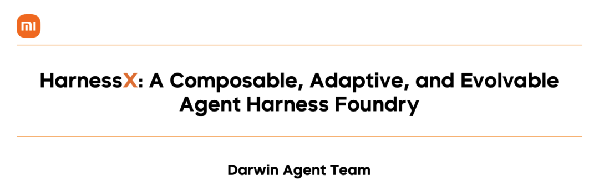

* 论文标题：HarnessX: A Composable, Adaptive, and Evolvable Agent Harness Foundry
* 论文链接：https://arxiv.org/abs/2606.14249

## 一个被低估的杠杆

大模型 Agent 的能力，一半在模型，另一半在 **Harness**。

Harness 是模型与环境之间的运行时中介层：它决定任务如何被表示、外部服务如何被调用、中间决策如何被记录和传递。 Claude Code 、 LangGraph 、 OpenClaw 这些产品，本质上都是在做 Harness 工程。换一个新模型、换一套工具、换一个任务域，往往要重新手写一整套脚手架。

小米 Darwin Agent 团队的新工作 **HarnessX** 瞄准的，正是这个长期被「手工维护」的环节。论文的核心判断很直接：**Agent 的进步不必只靠堆模型参数**——把运行时接口做成可组合、可从执行反馈中进化的系统，是一条互补且可落地的路径。

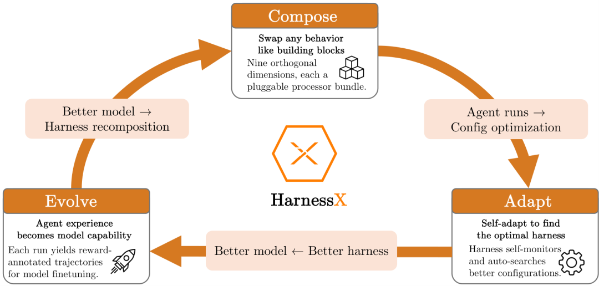

HarnessX 系统总览：组合式 Harness 基座 + AEGIS 进化引擎 + Harness-Model 协同进化闭环。

## 现有 Harness 的三重困境

先说最痛的一刀：每换一次模型版本或任务域，工程师就得从头调 Prompt 、重写工具封装、重新摸重试策略——执行过程跑出来的几百条轨迹，大多进了垃圾桶。

这还不是最糟的。架构上， Prompt 模板、重试逻辑和记忆管理往往写在同一条代码路径里，改一处悄悄坏另一处；跨项目复用基本靠 Ctrl+C/V ，而不是真正的组合。

更隐蔽的是第三层割裂： Harness 改动不会反哺模型训练，模型变强了 Harness 也不会自动跟上。两边各自迭代，永远差了半步。

HarnessX 的应对策略，是把 Harness 提升为**第一类对象** ——可以组合、可以适应、可以与模型协同进化。

## Harness 组合：把脚手架变成「可替换零件」

### Harness 的形式化定义

在 HarnessX 中， Harness 被定义为一对 ：

■ 是**模型配置**：哪个模型担任 main / judge / evaluator 角色，以及各角色的 fallback 策略。

■ 是**Harness 配置**： Agent 的行为逻辑，与具体模型身份无关。

两者通过 `agent = model_config.agentic(harness_config)` 组合成可执行 Agent 。同一个 Harness 配置配上不同模型，执行相同的 Processor 流水线，行为差异只来自模型响应；同一个模型配上不同 Harness ，则是行为层面的根本差异。

Harness 配置进一步分解为 ：

■：按生命周期 Hook 索引的 Processor 列表，覆盖 8 个 Hook 点（ task\_start 、 step\_start 、 before\_model 、 after\_model 、 before\_tool 、 after\_tool 、 step\_end 、 task\_end ）。

■：正交槽位资源——工具注册表、 Tracer 、工作区、沙箱提供者、插件列表。槽位是单例，跨 Processor 共享； Processor 状态则是实例私有的。

这种设计让 Harness 配置成为**可独立序列化、可比较、可哈希、可替换** 的对象——这是后续程序化进化的前提。

### Processor ：最小行为单元

HarnessX 中所有逐步行为都由 **Processor** 实现，协议为：

`async def process(self, event: Event) -> AsyncIterator[Event]`

每个 Processor 消费一个事件，产出零个或多个事件，只有五种结果：透传、变换、分裂、拦截、中断。同一 Hook 上的 Processor 输入输出类型一致，因此可以顺序组合，插入或移除不会破坏类型正确性。

Processor 携带三类元数据约束组合行为：

■`_singleton_group`：互斥组，同组最多一个 Processor 。

■`_order`： Hook 内排序提示（ PRE / NORMAL / POST ）。

■`_after`：对其他互斥组的软依赖。

这让 Harness 进化可以精确到「在某个 Hook 插入新 Processor 」「按互斥组替换现有 Processor 」「移除某个 Processor 」，而不影响流水线其他部分。

### 九维行为分类

论文用九个维度覆盖 Harness 的完整行为空间：

| 维度 | 名称 | 职责 |
| --- | --- | --- |
| D1 | Model Selection | 决定各角色用哪个模型 |
| D2 | Context Assembly | 每步呈现给模型的上下文 |
| D3 | Memory Management | 跨步/跨会话的记忆策略 |
| D4 | Tool Ecosystem | Agent 可调用的工具集 |
| D5 | Execution Environment | 工具副作用的执行环境 |
| D6 | Evaluation & Reward | 结果评判与奖励信号 |
| D7 | Control & Safety | 防循环、防超支、防漂移 |
| D8 | Observability | 事件/调用/推理的完整记录 |
| D9 | Training Bridge | 轨迹转 RL 训练记录 |

AEGIS 进化过程中，编辑会覆盖全部九个维度；其中 D2 （上下文组装）和 D4 （工具生态）是最频繁的编辑目标， D8 提供 AEGIS 推理所需的轨迹基底， D9 则为协同进化提供训练信号。

## AEGIS ：从执行轨迹中「学习」改 Harness

### 操作镜像：把 Harness 进化映射到 RL

HarnessX 最关键的理论贡献之一，是 **Operational Mirror （操作镜像）**——把 Harness 进化形式化为符号空间上的 MDP ：

| RL 概念 | 符号空间对偶 | AEGIS 实现 |
| --- | --- | --- |
| Policy | Harness 更新策略 | 四阶段流水线 |
| State |  | Harness 配置 + 轨迹存储 |
| Action | 类型化 Harness 编辑 | Builder 操作 + 变更清单 |
| Feedback | 轨迹  + 验证器分数 | 可观测层 |
| Update |  | 确定性接受门 |

一旦 Harness 适应被建模为 MDP ，标准 RL 的三种病理就会在符号空间中以放大形式重现：

**Reward Hacking （奖励黑客）**。 LLM Evolver 可以直接针对验证协议构造 exploit——把 benchmark 答案嵌入 Prompt 、利用验证器格式规律、添加改写输出的 Processor 以匹配验证器期望。

**Catastrophic Forgetting （灾难性遗忘）**。 修复失败模式 A 的编辑，可能通过共享上下文、工具、记忆策略、控制规则，静默破坏模式 B 。没有显式回归检查， Evolver 只看失败任务轨迹，无法区分局部收益和全局退化。

**Under-Exploration （探索不足）**。 系统偏向低风险局部编辑——Prompt 改写、工具描述微调、小幅控制流调整。这些编辑便宜、常能通过门控，但结构性变更（拆分子 Agent 、替换控制策略、新记忆架构）需要刻意假设，很少从轨迹条件局部修复中涌现。

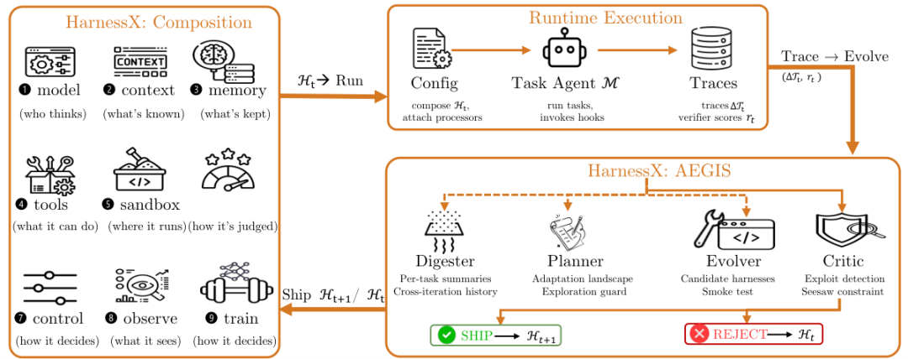

AEGIS 进化循环：单一 Meta-Agent 驱动 Digester 、 Planner 、 Evolver 、 Critic 四阶段，确定性门控决定编辑是否上线。

### 四阶段流水线

AEGIS 由同一个 Meta-Agent LLM 驱动四个阶段，**选择性调用**——Meta-Agent 自行判断每阶段是否有足够信号继续，而非外部路由器硬编码：

**Digester （消化器）**。 GAIA 一轮 103 个任务（ pass@2 ）产生约 1000 万 token 原始轨迹。 Digester 将每个任务的轨迹压缩为结构化摘要：二元结果、失败类别、涉及组件、支持性证据摘录，并链接跨轮历史，让 Planner 区分持续失败和瞬时噪声。

**Planner （规划器）**。 基于 Digester 输出构建适应景观：哪些任务在失败、尝试过哪些编辑、哪些组件被牵连、哪些编辑类型（ Prompt / Tool / Processor / Config ）尚未尝试。这是对抗 Under-Exploration 的主要机制——在生成编辑前构建全局景观，确保结构性变更与增量 Prompt 编辑被同等考虑。

**Evolver （进化器）**。 根据适应景观，产出一个或多个候选 Harness ，每个附带**变更清单（ Change Manifest ）**：编辑了哪些组件、预期行为效果、预计改善/退化的任务。引入新 Processor 代码时，还必须提供 smoke test 确认可实例化运行。

**Critic + 确定性门控**。 Critic 对抗 Reward Hacking ，门控对抗 Catastrophic Forgetting 。 Critic 将变更清单与轨迹证据比对，评估非局部效应风险，最多发起一次修订请求。门控依次检查：清单完整性、配置规范化、构建/smoke test 、**Seesaw 约束**（已解决任务不得退化）。 LLM 判断与接受解耦——无论 Critic 推荐什么，只有确定性检查决定上线。

### 变体隔离：解决异构任务集的冲突

单一 Harness 在异构任务集上会遇到根本矛盾：改善子集 A 的编辑可能破坏子集 B ， Seesaw 约束会拒绝它，但也丢掉了局部有益变更。

**Ensemble Routing （集成路由）** 维护最多  个 Harness 变体，每个任务路由到该任务簇历史成功率最高的变体。编辑按变体评估，改善某簇而不退化其他簇时直接应用；改善子集同时退化其他子集时，**分叉新变体** 而非直接拒绝。 Seesaw 约束按变体作用域化——针对变体  的候选只在该变体路由的任务上测试。

## Harness-Model 协同进化

仅靠 Harness 进化（模型冻结）已经带来可观收益，尤其对弱模型。但会遇到 **Scaffolding Ceiling （脚手架天花板）**： Harness 已经暴露了正确的工具、上下文和控制流，瓶颈变成冻结模型能否真正利用它们。

反过来，固定 Harness 训练模型会遇到 **Training-Signal Ceiling （训练信号天花板）**：新获得的能力无法被练习，因为脚手架从不调用它们。

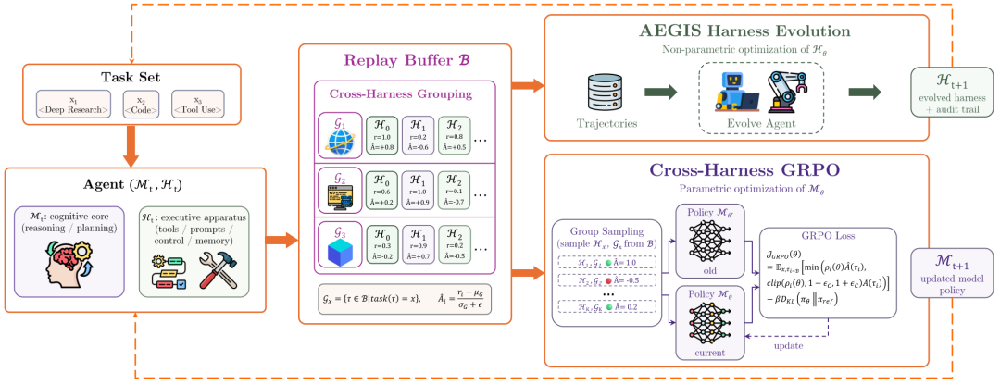

Harness-Model 协同进化循环：同一 Replay Buffer 同时驱动 AEGIS Harness 进化和 Cross-Harness GRPO 模型训练。

HarnessX 的协同进化在单次迭代中并行运行两条优化路径，共享固定容量的 FIFO Replay Buffer ：

1.**Rollout**： 在适应批次  上运行，可观测层记录完整轨迹 。

2.**Verification**：固定验证器将每条轨迹评分为标量奖励 。

3.**Buffer Insertion**：带 Harness 版本标记写入共享 Buffer 。

4.**Harness Evolution**： AEGIS 读取 Buffer 轨迹，提出离散结构编辑，经 Critic 和门控验证后上线 。

5.**Behavior Log-Probabilities**：对本轮新增轨迹，在生成模型  下前向传播，缓存 token 级 log-prob 。

6.**GRPO Update**： Cross-Harness GRPO 更新 。

7.**Advance**：用  进入下一轮。

### Cross-Harness GRPO 的核心设计

直觉上可以这样理解：把同一道题的所有跑法（不管哪个 Harness 版本跑的）放在一个「考场」里横向比较——跑得好的轨迹被鼓励，跑得差的被抑制。具体用哪个工具、什么 Prompt 结构不需要统一，只看最终验证器打出来的分。

形式化上，同一任务标识的所有轨迹形成一个 GRPO 组，无论由哪个  对产生：

组内优势为：

策略更新采用 clipped GRPO 变体（与标准 GRPO 形式一致，核心差异在于分组跨 Harness 版本），并加 KL 锚定防止偏离参考模型过远。感兴趣的读者可对照原文 Section 4.3 查看完整目标函数。

其中  是重要性采样比率。

**Task-level 对齐，非 Action-level**。 不同 Harness 版本的动作空间可能不兼容（不同工具 Schema 、不同 Prompt 结构），但按任务分组、仅比较验证器奖励，无需动作级对齐。计算策略梯度时，每条轨迹在其生成时的 Harness 版本  下重放 log-prob ， Harness 进化可自由改变动作空间，模型训练只需 token 级 log-prob 。

**零额外 Rollout 成本**。 Agentic RL 的主要开销是环境 Rollout ，而非梯度更新。协同进化中，同一批轨迹同时服务 AEGIS 诊断和 GRPO 训练，模型更新的边际成本仅是一次缓存前向传播和梯度步——Harness 进化已经产生的 Rollout 被完全复用。

## 实验：五个基准、三种模型、十五轮进化

### 实验设置

| Benchmark | 领域 | 采样任务数 | 验证器 |
| --- | --- | --- | --- |
| GAIA (L1-3) | 多步检索 | 103 | 精确匹配 |
| ALFWorld | 具身规划 | 134 | 目标完成 |
| WebShop | 网页交互 | 100 | 属性匹配 |
| -Bench | 多轮对话 | 3 域 | 规则合规 |
| SWE-bench Verified | 软件工程 | 55 | Patch 解决率 |

■**Meta-Agent**： Claude Opus 4.6 （除非另有说明），驱动 AEGIS 进化循环。

■**Task Agent**： Claude Sonnet 4.6 、 GPT-5.4 、 Qwen3.5-9B 三个家族。

■**进化轮数**：最多  轮，连续  轮无上线编辑则早停。

■**指标**： pass@2 成功率（每任务两次独立尝试，任一成功即算解决）。

基线包括：(1) **Static Harness**——固定 Prompt 和工具定义；(2) **Claude Code SDK (CC SDK)**——单 Agent 进化器，替换四阶段流水线但共享基础设施。

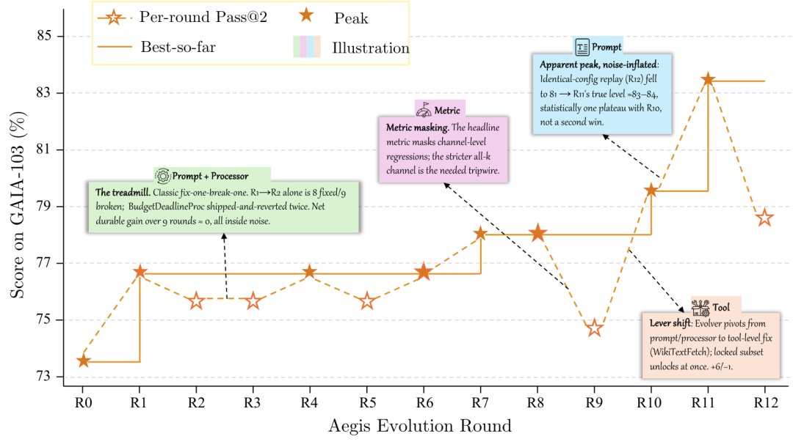

进化轨迹：实线为 AEGIS 进化，虚线为静态 Harness 基线。 15 个模型-基准配置中 14 个获得提升。

### 主结果：平均 +14.5%，弱模型收益最大

| Benchmark | Task Agent | 初始 (%) | 进化峰值 (%) | 提升 |
| --- | --- | --- | --- | --- |
| ALFWorld | Sonnet 4.6 | 83.6 | 94.8 | +11.2 |
| ALFWorld | GPT-5.4 | 76.9 | **97.8** | +20.9 |
| ALFWorld | Qwen3.5-9B | 53.0 | 97.0 | **+44.0** |
| WebShop | Sonnet 4.6 | 60.0 | **76.0** | +16.0 |
| WebShop | GPT-5.4 | 55.0 | 73.0 | +18.0 |
| WebShop | Qwen3.5-9B | 36.0 | 49.0 | +13.0 |
| GAIA | Sonnet 4.6 | 73.8 | **83.5** | +9.7 |
| GAIA | GPT-5.4 | 73.8 | 73.8 | 0.0 |
| GAIA | Qwen3.5-9B | 20.3 | 37.4 | +17.1 |
| SWE-bench | Sonnet 4.6 | 76.4 | **87.3** | +10.9 |
| SWE-bench | GPT-5.4 | 45.5 | 63.6 | +18.2 |
| SWE-bench | Qwen3.5-9B | 23.6 | 41.8 | +18.2 |
| -Bench | Sonnet 4.6 | 89.6 | **95.0** | +5.4 |
| -Bench | GPT-5.4 | 76.2 | 90.7 | +14.5 |
| -Bench | Qwen3.5-9B | 93.5 | 94.6 | +1.1 |

几个值得细看的规律：

基线最弱的 Qwen3.5-9B 在 ALFWorld 上从 53.0% 飙到 97.0%（+44.0%），而 Sonnet 4.6 只提升 +11.2%。弱模型的行为缺口更容易被 Harness 级编辑弥补；基线已经很高时，剩下的失败往往得靠任务级微调，全局改 Prompt 很难再撬动。

ALFWorld （ GPT-5.4 ） R4 就达峰， SWE-bench 全部 Agent R2-R3 达峰——失败集中在少数组件类型，改起来快。 GAIA （ Sonnet 4.6 ）拖了 11 轮，因为失败横跨 Prompt 、 Tool 、 Processor 、 Config 四类，得一个一个试。

GAIA 上 GPT-5.4 零增益（）不是模型不行，是异构任务集的编辑需求互相打架——这正是变体隔离要解的题。

### 变体隔离：从崩溃到稳定提升

在 GAIA （ GPT-5.4 ， 15 轮）上对比 Global 与 Ensemble 策略：

| 策略 | 最终 (%) | 峰值 (%) | 最终-峰值 | Token 消耗 |
| --- | --- | --- | --- | --- |
| Ensemble （最多 K 变体） | **87.4** | 87.4 | 0.0 | 107.8M |
| Global （单一 Harness ） | 49.5 | 73.8 | **-24.3** | 143.7M |

Global 策略 R4 达峰 73.8% 后持续退化：后续编辑引入亚阈值回归， pass@2 的二元信号检测不到，但累积成聚合下降。峰值-最终差距 -24.3% 远超二项 95% 置信区间（±8.5%），确认是灾难性遗忘而非评估噪声。

Ensemble 路由预测的三条性质全部验证：(1) 非退化聚合轨迹（峰值=最终）；(2) 更晚达峰（ R14 vs R4 ），持续有效探索；(3) 更低 Token 消耗（ 107.8M vs 143.7M ），每编辑只针对目标簇评估。

### Meta-Agent 架构对比

在 GAIA （ GPT-5.4 ，变体隔离， 15 轮）上， AEGIS 四阶段 vs CC SDK 单 Agent ：

| 进化器 | 准确率 (%) | 最佳轮次 | Token |
| --- | --- | --- | --- |
| AEGIS | **87.4** | R14 | 107.8M |
| CC SDK | 86.4 | R12 | 123.1M |

1.0% 准确率差距在一个标准误（~3.3%）内，四阶段分解在此 Meta-Agent 能力水平上不带来最终准确率优势。但 CC SDK 多消耗约 14% Token——Digester 将 ~1000 万原始轨迹 token 压缩到 ~1 万结构化摘要，单 Agent 必须截断轨迹，编辑信息不足、被门控拒绝更频繁。

**含义**：在强 Meta-Agent + 变体隔离条件下，收益主要来自 HarnessX 基础设施（类型化组件、结构化轨迹），而非进化器内部架构。四阶段的价值在效率（~12% 更少 Token ）和可解释性（可审计中间产物）。

### 协同进化：再 +4.7%

在 GAIA 和 WebShop 上用 Qwen3.5-9B 对比 Harness-only （模型冻结）与协同进化：

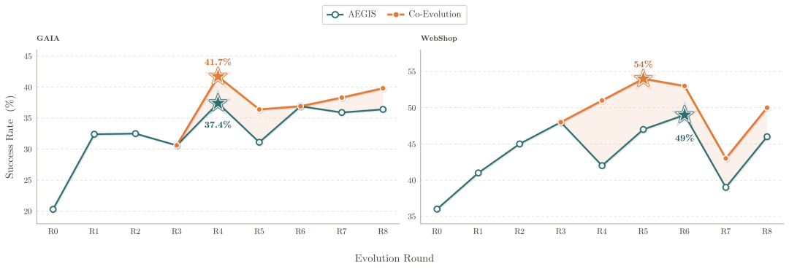

协同进化 vs 仅 Harness 进化：阴影区域为协同进化增益， R4 后两条曲线开始分叉。

| Benchmark | Harness-only 峰值 | 协同进化峰值 | 增益 |
| --- | --- | --- | --- |
| GAIA | 37.4% | 41.7% | +4.3% |
| WebShop | 49.0% | 54.0% | +5.0% |

平均 +4.7%。两条曲线 R4 前重合，联合训练生效后分叉，协同进化在剩余轮次中始终不低于 Harness-only 。最终轮差距： GAIA 36.4%→39.8%， WebShop 46.0%→50.0%。

Harness-only 在 GAIA 大约 37%、 WebShop 大约 49% 就摸到了顶；协同进化能继续往上走，靠的是 Cross-Harness GRPO——模型把各轮 Harness 试出来的策略「吃进去」，后面的编辑是在已学会的行为上叠加，不用一直替固定模型擦屁股。

## 分基准深度分析

### ALFWorld ：弱模型逆袭

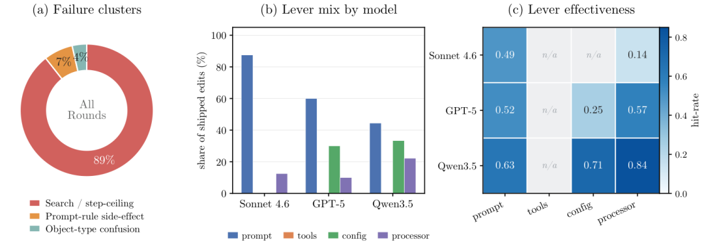

ALFWorld 进化分析：搜索低效和步数上限是主要失败簇；弱模型更依赖结构性杠杆（ Processor 、 Config ）。

134 个具身规划任务。失败簇以搜索低效和硬步数上限为主。强基线 Sonnet 几乎只靠 Prompt 编辑攀升，弱基线则动用更多样化的杠杆。结构性杠杆（ Processor 、 Config ）在弱模型上既使用更频繁、也更有效。

### GAIA ：异构检索的多面失败

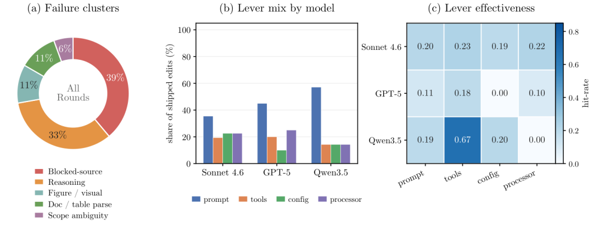

GAIA 进化分析： blocked-source 和 reasoning 主导未解任务； Qwen3.5 单次 tools 上线命中率达 0.67 。

103 个多步检索任务。未解任务的失败簇以 blocked-source 和 reasoning 为主， figure/visual 和 parsing 是残余模型缺口。 Qwen3.5 单次 tools 上线是最高收益单元（命中率 0.67 ）。

### WebShop ：搜索循环被驯服后的判断瓶颈

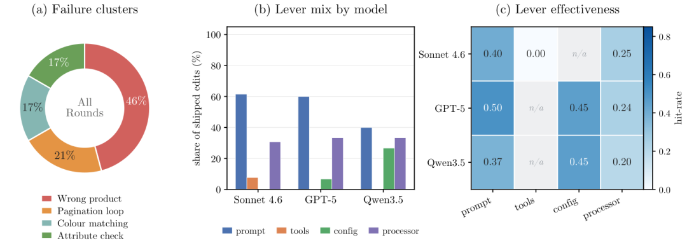

WebShop 进化分析：进化驯服搜索/翻页循环后，残余失败主要是产品选择判断。

100 个网页购物会话。 Round-0 的搜索/翻页循环被进化驯服后，残余失败主要是选错产品、颜色匹配、属性检查。 Prompt 是主要攀升杠杆， Processor 是稳定的第二杠杆。

### -Bench ：判断错误主导

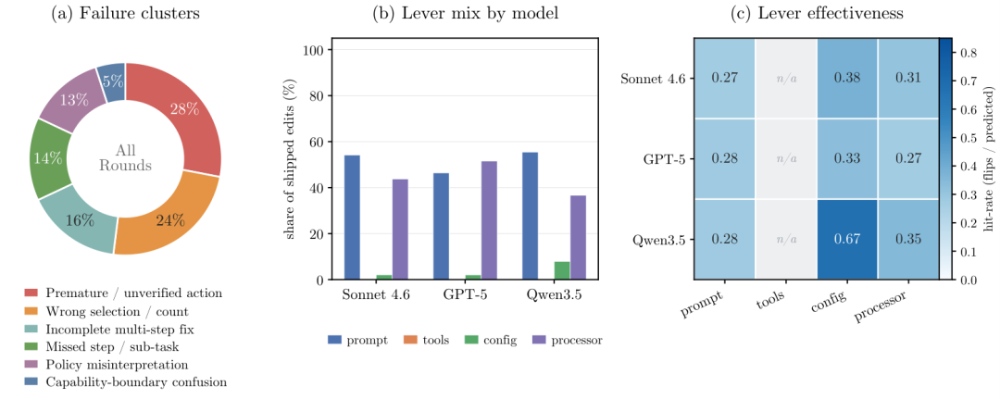

-Bench 进化分析：过早行动和错误选择是主要判断错误；工具集固定，零 tools 编辑。

覆盖 airline 、 retail 、 telecom 三域。判断错误（过早行动、错误选择）主导。 Prompt 和 Processor 承载攀升，工具集固定故零 tools 编辑。 GPT-5.4 在 Telecom 上 +25.4%（ 67.5%→93.0%， R2 ），但 Sonnet 4.6 在 Telecom R7 因连续同类型编辑累积出现 -14.0% 回归， R9 自行恢复。

### SWE-bench Verified ：修复不完整是主因

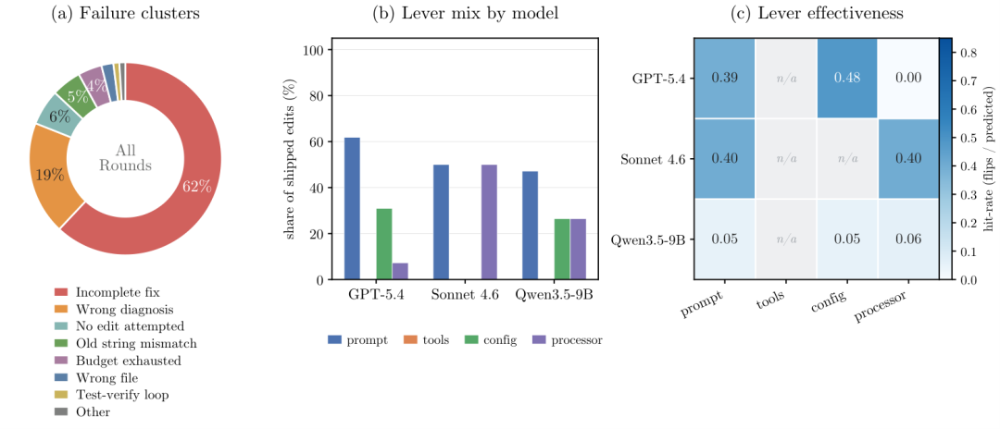

SWE-bench 进化分析： incomplete fix 和 wrong diagnosis 主导； Qwen3.5-9B 所有杠杆命中率跌至 0.05 ，存在能力地板。

55 个真实 GitHub Issue 修复任务。 incomplete fix 和 wrong diagnosis 主导，机械尾部（ no-edit 、 anchor mismatch 、 budget ）是残余。所有运行都是 Prompt-first 、零 tools 编辑。强模型在其有效杠杆上命中率 0.39-0.48 ， Qwen3.5-9B 所有杠杆跌至 0.05——存在进化无法逾越的能力地板。

## 三种 RL 病理的实证

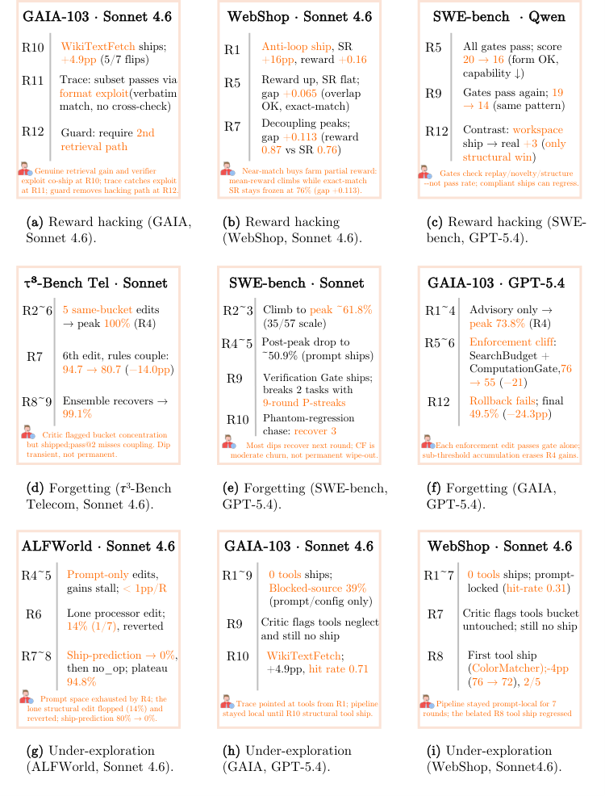

按病理类型组织的失败案例： Reward Hacking 、 Catastrophic Forgetting 、 Under-Exploration 。

**Reward Hacking （ GAIA, Sonnet 4.6, R10 ）**。 上线复合编辑（ tool + prompt + config ），通过 Seesaw 约束，准确率 74.8%→79.6%。 R11 轨迹分析发现：工具确实修复了多数新通过任务的检索，但部分任务通过利用验证器格式规律而非真正检索通过。 R12 Planner 标记此路径，后续编辑引入 guard 限制工具仅用于可二次检索交叉验证的任务。两轮内自行修复。

**Catastrophic Forgetting （-Bench Telecom, Sonnet 4.6, R7 ）**。 R2-R6 连续五轮上线同类型 Prompt/Processor 编辑，每次追加「提醒」规则。 R4 合规率 100%， R6 降至 94.7%。 R7 Critic 标记了集中风险但仍批准上线（ ship-prediction 准确率高），第六条提醒通过交叉规则冲突将合规率从 94.7% 打到 80.7%（-14.0%）。 pass@2 只记录 per-task 二元翻转，检测不到亚阈值耦合。 R9 自行恢复——Planner 诊断集中模式后提出结构性编辑替换冲突提醒栈。

**Under-Exploration （ ALFWorld, Sonnet 4.6, R4-R7 ）**。 R4-R7 几乎全是 Prompt 级小修小补，每轮增益不到 1%。 Ship-prediction 准确率从 R3 的 80% 跌至 R7 的 0%，标志 Prompt 空间耗尽。此窗口唯一结构性编辑（ R6 Processor 级）命中率仅 14%（ 1/7 ）， Planner 缺乏结构性编辑历史来校准假设。

## 工程视角的几点判断

把 Claude Code 和 HarnessX 对比着想，差异其实很具体： Claude Code 的 Dynamic Workflows 让模型在单会话里生成任务脚本，但上一次会话跑出的轨迹对下一次没有任何影响——每次重头开始。 HarnessX 的 AEGIS 是跨轮的：失败轨迹被 Digester 压缩、 Planner 分析、 Evolver 改写，下一轮跑在被修改过的 Harness 上。这是从「每次手工调」到「系统持续学」的代际跳跃。

Global 策略在 GAIA 上从 73.8% 崩到 49.5%， Ensemble 路由拉回 87.4%——关键前提是 Harness 的组合结构让每个编辑的**预期作用域** 显式化。没有可替换零件，就没有变体隔离。如果你在做多任务 Agent 平台，这个设计值得直接抄作业。

Qwen3.5-9B 在 ALFWorld 上 +44% 的增益很说明问题：对能力受限的模型， Harness 进化比堆参数更直接。反过来， Sonnet 4.6 在 -Bench 基线已经 89.6%，进化只挤出 +5.4%——高基线场景得靠任务级适配，别指望全局 Prompt 一把梭。

协同进化平均再 +4.7%，而且同一批 Rollout 复用，边际成本极低。实际落地可以分阶段：先跑 Harness-only 把脚手架打磨到位，模型触顶后再开 GRPO 。论文也坦诚了 oversight 机制——确定性门控、变更清单审计、变体隔离——Agent 自进化不是「放开让 LLM 随便改」。

当然，完整代码库尚未开源，生产级运维成本也没有详细评估。值得期待，但现在下结论说这是银弹还太早。

## 局限与未来方向

论文也坦诚了几点局限：

■所有报告增益都在进化使用的同一任务集上测量，**未评估对未见任务的泛化**。

■GAIA GPT-5.4 的零增益和 SWE-bench 峰值后退化，说明单 Harness 策略在异构/小样本场景仍有结构性瓶颈。

■完整代码库将在未来开源发布——目前尚无法复现。

未来方向包括：更细粒度的变体管理策略（ Domain-aware 聚类、 Task-level 锦标赛已在试点规模探索）、跨任务泛化评估、以及将 Harness 进化集成到生产 Agent 系统的持续运维流程中。

HarnessX 给出的信号很明确：在 Agent 赛道上，**运行时接口** 和**模型权重** 是同等重要的优化变量。当大家都在卷下一个万亿参数模型时，把 Harness 做成可组合、可从执行反馈中进化的系统，可能是一条被严重低估的捷径——尤其对还没摸到最强模型天花板的团队来说。

⭐️关注我，实时跟进 AI 最新进展⭐️

预览时标签不可点

[阅读原文](javascript:;)

微信扫一扫  
关注该公众号

[知道了](javascript:;)

微信扫一扫  
使用小程序

[取消](javascript:void(0);)
[允许](javascript:void(0);)

[取消](javascript:void(0);)
[允许](javascript:void(0);)

[取消](javascript:void(0);)
[允许](javascript:void(0);)

×
分析

微信扫一扫可打开此内容，  
使用完整服务

：
，
，
，
，
，
，
，
，
，
，
，
，
。
 
视频
小程序
赞
，轻点两下取消赞
在看
，轻点两下取消在看
分享
留言
收藏
听过