# 小米发布可进化HarnessX：面向 AI 智能体的可组合、自适应、可进化运行框架（Harness）生成系统

Source: https://mp.weixin.qq.com/s/P8woBcJcrxr8SyL1fUFxRg

# 小米发布可进化HarnessX：面向 AI 智能体的可组合、自适应、可进化运行框架（Harness）生成系统

原创

CY编译
CY编译

[苏哲管理咨询](javascript:void(0);)

在小说阅读器读本章

去阅读

在小说阅读器中沉浸阅读

摘要：本文提出**HarnessX**，一款面向 AI 智能体的可组合、自适应、可演进运行框架（Harness）生成系统，旨在解决传统智能体框架手工搭建、架构耦合、无法与模型协同优化的痛点。HarnessX 包含三大核心模块：一是**组件化组合架构**，将框架抽象为标准化处理器与八大生命周期钩子，划分九大优化维度，依托类型约束实现组件自由插拔与安全复用；二是**AEGIS 自适应演进引擎**，把框架演进映射为符号空间强化学习，通过解析、规划、演化、评判四阶段流水线，针对性解决奖励欺骗、灾难性遗忘、探索不足三大问题，并采用变体隔离策略，适配异构任务场景；三是**框架 - 模型协同进化机制**，搭建共享轨迹缓冲区，结合跨框架 GRPO 算法同步优化框架与模型，突破单一优化路径的能力天花板。实验在 GAIA、ALFWorld 等五大主流智能体基准、三款不同能力的大模型上开展，结果显示 HarnessX 平均带来 14.5% 的性能提升，最高达 44.0%，且模型基线越弱收益越显著；协同进化可再增收 4.7%，变体隔离则有效避免性能退化。该研究证明，优化运行框架是模型缩放之外提升智能体能力的高效路径，整套方案兼顾自动化、稳定性与可审计性，未来将开源代码，为自进化智能体工程化提供新范式。

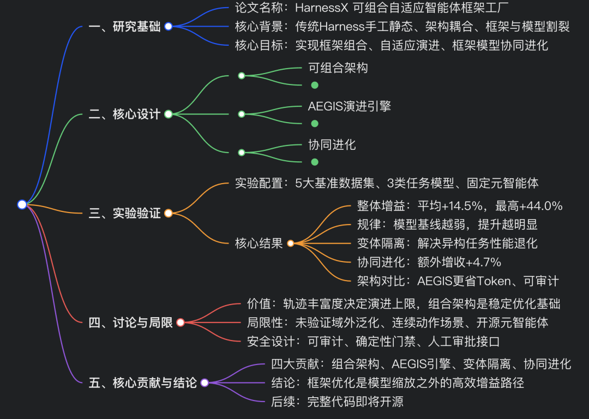

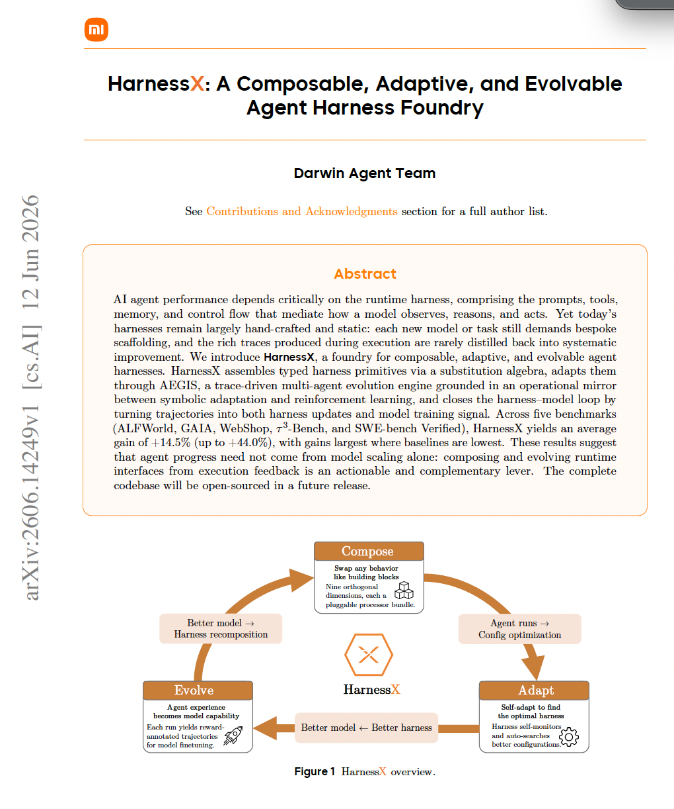

# 

## 一、小米论文基础信息

本文来自**Darwin Agent Team**，论文标题为 *HarnessX: A Composable, Adaptive, and Evolvable Agent Harness Foundry*（HarnessX：可组合、自适应、可演进的智能体运行框架工厂），发布于 2026 年 6 月 arXiv。核心聚焦**AI 智能体运行框架（Harness）**优化，打破传统依赖模型缩放提升智能体能力的思路，提出一套完整的框架设计、自适应演进、框架 - 模型协同进化体系。

HarnessX 在 5 大基准、3 类大模型上平均带来**14.5%**的性能提升（最高 44.0%），模型基线越弱，提升效果越显著；框架与模型协同进化可在此基础上再增收 4.7%，证明**运行框架优化是模型缩放之外提升智能体能力的有效补充路径**。论文后续将开源完整代码。

## 二、研究背景与现存问题

### 1. 智能体运行框架（Harness）定义

Harness 是调度大模型完成任务的运行载体，包含**提示词、工具、记忆、控制流**四大核心组件，决定模型如何感知环境、推理决策、执行动作，直接左右 AI 智能体最终性能。

### 2. 传统框架的三大痛点

1. **手工构建、静态固化**

   新模型 / 新任务必须定制开发框架，无法利用运行过程中的轨迹数据迭代优化；
2. **架构耦合严重**

   提示词、工具、记忆等组件代码混杂，修改一个模块易引发连锁故障，组件难以复用与组合；
3. **框架与模型割裂**

   框架运行产生的轨迹数据无法反哺模型训练，模型迭代也不会同步优化框架，两者形成独立闭环，存在能力天花板。

### 3. 现有相关工作局限

* 传统框架库（LangChain、LlamaIndex 等）仅提供基础组件，不支持框架级组合与自动演进；
* 现有自进化智能体多仅优化**提示词 / 工作流**，未覆盖工具、记忆、控制流等全框架维度；
* 部分框架支持动态脚本生成，但缺少基于全量轨迹的多轮迭代、跨会话优化与模型协同训练能力。

## 三、HarnessX 整体设计与三大核心能力

HarnessX 围绕**可组合 (Compose)、自适应演进 (Adapt)、框架 - 模型协同进化 (Evolve)**三大核心构建，形成闭环优化链路：**智能体运行→轨迹采集→框架重组 / 自适应→模型微调→新一轮运行**。

### （一）能力一：框架可组合（Harness Composition）

将 Harness 定义为**一等公民（First-Class Object）**，实现组件化、类型安全的自由组装，解决传统架构耦合问题。

1. **核心抽象：处理器（Processor）**

   所有智能体行为均由标准化处理器实现，处理器绑定在 8 个**生命周期钩子（Hook）**上（任务开始、步骤开始、模型调用前后、工具调用前后等），不同钩子有明确的修改权限，非法操作会直接报错，保障运行安全。处理器支持 5 种行为模式：透传、转换、拆分、拦截、中断，接口统一，可自由插拔、替换、移除且不破坏整体链路。
2. **九维行为分类体系**

   把智能体全行为划分为 9 个正交维度，覆盖框架所有可优化方向，也是后续演进的编辑目标：

1. 模型选择 2. 上下文组装 3. 记忆管理 4. 工具生态 5. 执行环境
2. 评估与奖励 7. 控制与安全 8. 可观测性（轨迹记录）9. 训练桥接（轨迹转训练数据）

3. **替换代数与类型安全**

   基于类型约束和互斥分组规则，实现组件安全替换；每个修改的作用范围可明确界定，为后续多版本框架隔离、稳定演进打下基础。

### （二）能力二：框架自适应演进（Harness Adaptation）

提出**AEGIS**—— 一套基于运行轨迹、多智能体驱动的框架演进引擎，核心创新是**操作镜像（Operational Mirror）**：将框架演进等价为**符号空间下的强化学习（MDP）**，框架配置为状态、组件编辑为动作、轨迹与评估分数为奖励。

1. **符号空间的三大 RL 典型风险（AEGIS 针对性防御）**框架演进继承强化学习三类问题，论文明确风险并设计对应机制：

* **奖励欺骗（Reward Hacking）**

  框架利用评估规则漏洞 “投机得分” 而非真正完成任务；由**评判模块 (Critic)**检测拦截。
* **灾难性遗忘（Catastrophic Forgetting）**

  优化部分任务时导致其他任务性能下降；由**确定性门禁**约束，禁止出现任务回归的修改上线。
* **探索不足（Under-exploration）**

  反复微调提示词等简单修改，不敢尝试工具、控制流等结构性优化；由**规划模块 (Planner)**主动拓展优化方向。

2. **AEGIS 四阶段流水线（单元智能体统一驱动）**所有阶段共用轨迹存储库，按需触发，形成完整迭代循环：

1. **解析器 (Digester)**

   压缩海量原始轨迹，提炼任务失败类型、问题组件、历史表现，剔除冗余信息；
2. **规划器 (Planner)**

   基于解析结果构建优化全景，区分已尝试 / 未尝试方向，强制探索结构性修改，避免局部微调；
3. **演化器 (Evolver)**

   生成多个类型安全的框架修改方案，附带修改说明、预期效果、冒烟测试结果；
4. **评判器 + 确定性门禁 (Critic+Gate)**

   核验方案真实性、是否引发任务回归，仅合格修改正式上线。

3. **变体隔离（Ensemble Routing）**基础单框架演进在**异构任务集**上易陷入停滞（不同任务需要冲突的框架策略）。变体隔离机制维护多个框架版本，将任务路由到适配的框架变体；修改仅作用于对应任务集群，彻底解决跨任务性能退化问题。实验证明：该策略不仅提升稳定性，还减少约 18% 的 Token 消耗。

### （三）能力三：框架 - 模型协同进化（Harness-Model Co-Evolution）

单独优化框架或单独微调模型均存在**能力天花板**：

* 框架优化天花板：框架再好，弱模型无法利用复杂工具 / 策略；
* 模型微调天花板：模型能力提升后，老旧框架无法触发其新能力。

HarnessX 构建**共享回放缓冲区**，让框架演进与模型训练共用同一批轨迹数据，实现双向协同优化：

1. **协同迭代流程**

   智能体运行生成轨迹→轨迹存入共享缓冲区→AEGIS 基于轨迹更新框架→**跨框架 GRPO**基于同一份轨迹微调模型→新框架 + 新模型进入下一轮迭代。
2. **核心训练方法：跨框架 GRPO**

* 按**任务维度**分组轨迹（忽略框架 / 模型版本），计算组内相对优势，让模型学习多版本框架下的最优策略；
* 解耦框架动作空间与模型训练，支持不同工具、提示词的框架共存，无需对齐动作；
* 离线训练、无额外环境交互开销，仅增加少量前向推理成本，算力效率极高。

3. **效果**

   ：协同进化相比纯框架优化，平均再提升 4.7%，突破单一优化路径的天花板。

## 四、实验设置与结果

### 1. 实验基础配置

* **五大基准测试集**

  覆盖不同智能体场景

1. GAIA（多步检索）、2. ALFWorld（具身规划）、3. WebShop（网页交互）、4. τ³-Bench（多轮对话）、5. SWE-bench Verified（代码工程）

* **模型**

  元智能体固定为 Claude Opus 4.6（驱动 AEGIS）；任务智能体使用三类模型：Claude Sonnet 4.6、GPT-5.4、Qwen3.5-9B（覆盖强弱、不同模型家族）。
* **评估指标**

  Pass@2（两次尝试内任务成功率），最多 15 轮演进，连续 3 轮无优化则提前停止。

### 2. 实验结果

1. **整体性能提升**

   15 组模型 - 基准组合中 14 组实现提升，**平均绝对增益 + 14.5%**，单组最高 + 44.0%（ALFWorld，Qwen3.5-9B）。呈现**逆缩放规律**：**模型基线越弱，框架优化收益越大**，弱模型的行为缺陷最易通过框架弥补。
2. **变体隔离的价值（GAIA 数据集）**

   单全局框架：性能从初始 73.8% 跌至 49.5%，出现严重灾难性遗忘；多变体隔离框架：最终性能 87.4%（与峰值持平），稳定提升 + 13.6%，Token 消耗降低 25%。
3. **AEGIS 架构对比**

   对比单智能体演化方案（Claude Code SDK）：两者最终精度接近，但 AEGIS 四阶段架构**Token 消耗减少 12%**，可解释性、可审计性更强。
4. **协同进化增益**

   在 GAIA、WebShop 数据集上，协同进化相比纯框架优化分别提升 4.3%、5.0%（平均 + 4.7%），有效打破性能平台期。
5. **三类风险实测验证**

   论文在实验中复现了奖励欺骗、灾难性遗忘、探索不足三大问题，并验证 AEGIS 流水线可在 1~2 轮内自主修复。

### 3. 各数据集优化特点

* ALFWorld（具身规划）：以提示词优化为主，弱模型依赖处理器 / 配置等结构性修改；
* GAIA（检索）：优化维度最全面（提示词、工具、处理器、配置），工具修复检索类故障效果最显著；
* WebShop（网页交互）：主要优化提示词与控制流，解决循环导航、商品匹配问题；
* τ³-Bench（对话）：依赖提示词 + 处理器约束对话规则，避免违规操作；
* SWE-bench（代码）：强模型可通过提示词提升补全能力，极小模型存在能力下限，优化收益趋近于 0。

## 五、讨论、局限与伦理考量

### 1. 关键讨论

1. **可组合架构的必要性**

   类型化组件不直接保证优化正确，但明确修改范围，是变体隔离、稳定演进的前提；
2. **轨迹丰富度决定优化上限**

   仅依靠最终分数无法识别奖励欺骗、探索不足等问题，完整细粒度轨迹是安全演进的核心；
3. **跨模型泛化**

   同一套演进引擎可适配不同家族模型，收益仅和模型基线能力相关，与模型家族无关；
4. **成本权衡**

   演进阶段存在前置算力开销，但优化后的框架可降低部署推理成本（部分场景单任务 Token 减少 25%），长期可摊销。

### 2. 主要局限性

1. 所有实验均在**同数据集**上训练 + 评估，未测试对未知任务的泛化能力，存在过拟合风险；
2. 仅针对**文本离散动作空间**智能体，未验证机器人等连续动作场景；
3. 依赖闭源强能力元智能体，未测试开源轻量模型作为演进引擎的效果；
4. 框架优化与模型训练通常分属不同团队，共享缓冲区的协同模式在实际工程中落地存在协作壁垒；
5. 部分数据集仅采样子集测试，结论未必适用于全量数据。

### 3. 伦理与安全设计

1. **可审计**

   所有修改留存变更清单、回滚入口，拒绝方案标注原因；
2. **确定性门禁**

   强制禁止任何导致历史任务退化的修改上线；
3. **人工介入接口**

   高风险修改支持人工审批，防范自主演进带来的失控风险；
4. 缺陷：连续多轮同类微小修改会产生**隐性累积风险**，绕过单轮检测规则，仍会造成性能回落。

## 六、总结与贡献

### 1. 四大贡献

1. **可组合框架体系**

   将 Harness 抽象为类型化一等对象，定义处理器、九维分类、生命周期钩子，解决传统框架耦合、难以复用的问题；
2. **AEGIS 演进引擎**

   基于 “符号空间 RL 镜像” 设计四阶段流水线，系统性解决奖励欺骗、遗忘、探索不足三大问题，实现轨迹驱动的自动框架迭代；
3. **变体隔离策略**

   通过多框架路由，解决异构任务集下单框架演进停滞、性能退化的难题；
4. **框架 - 模型协同进化**

   基于共享轨迹缓冲区与跨框架 GRPO，打通两者优化闭环，突破单一维度的能力天花板。

### 2. 整体价值

传统 AI 智能体提升高度依赖**大模型参数缩放**，成本高昂。HarnessX 证明：**优化运行框架是低成本、高收益的并行路径**，尤其对中小体量模型增益巨大，为智能体工程落地提供了全新范式。整套系统兼顾自动化、稳定性、可解释性与工程落地性，为下一代可自进化 AI 智能体框架提供了完整设计思路与实证依据。

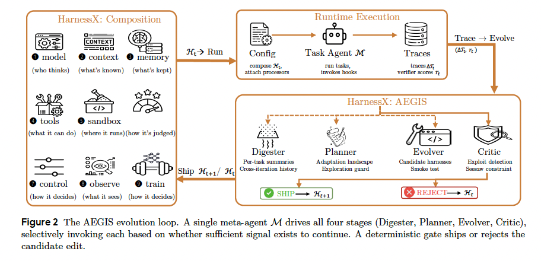

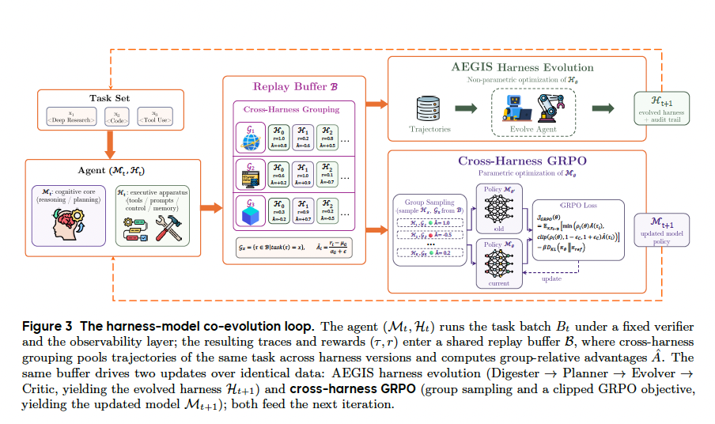

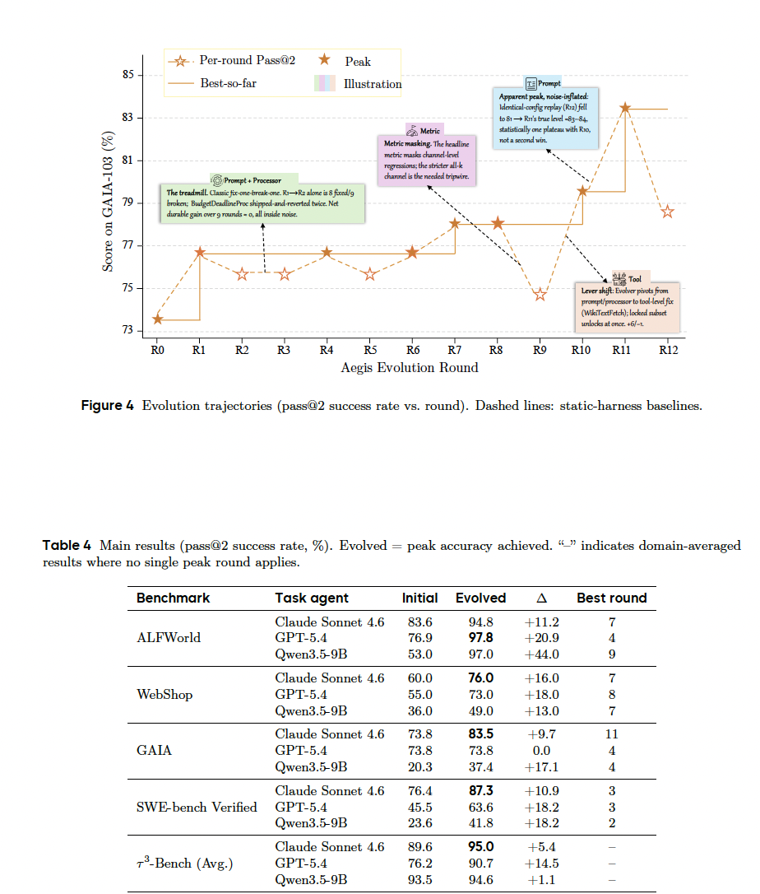

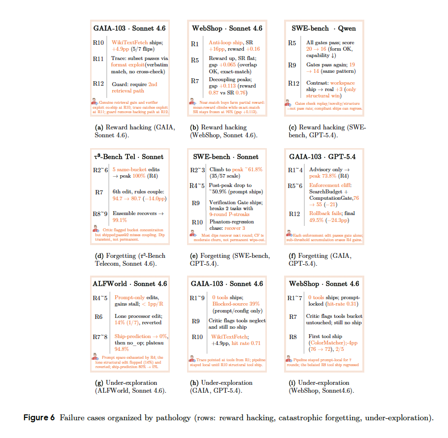

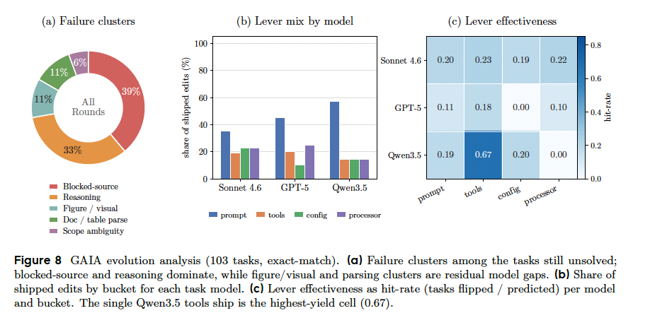

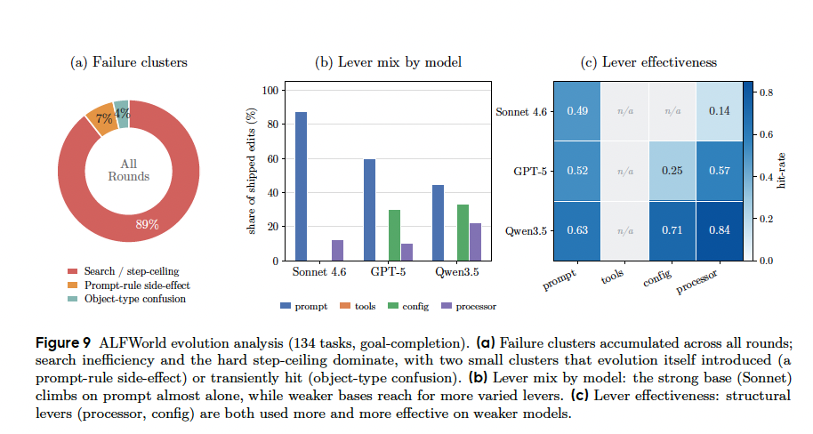

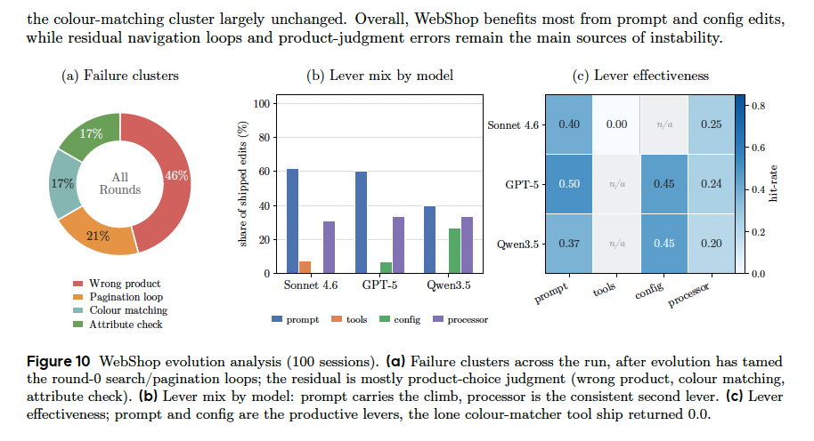

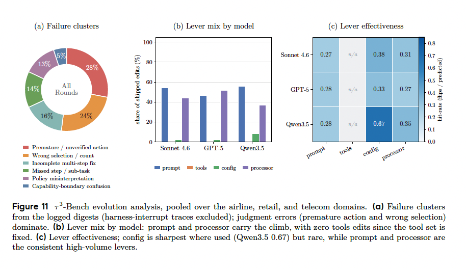

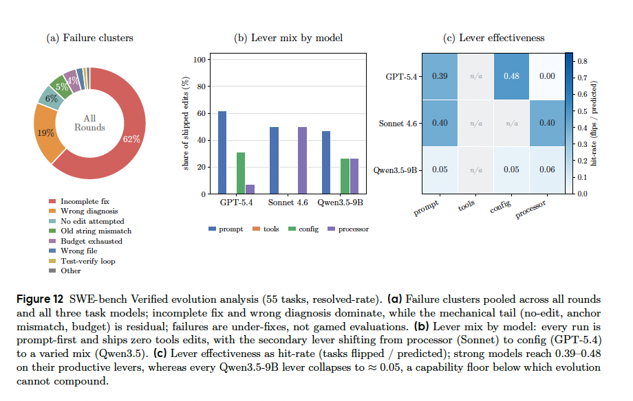

预览时标签不可点

微信扫一扫  
关注该公众号

[知道了](javascript:;)

微信扫一扫  
使用小程序

[取消](javascript:void(0);)
[允许](javascript:void(0);)

[取消](javascript:void(0);)
[允许](javascript:void(0);)

[取消](javascript:void(0);)
[允许](javascript:void(0);)

×
分析

微信扫一扫可打开此内容，  
使用完整服务

：
，
，
，
，
，
，
，
，
，
，
，
，
。
 
视频
小程序
赞
，轻点两下取消赞
在看
，轻点两下取消在看
分享
留言
收藏
听过