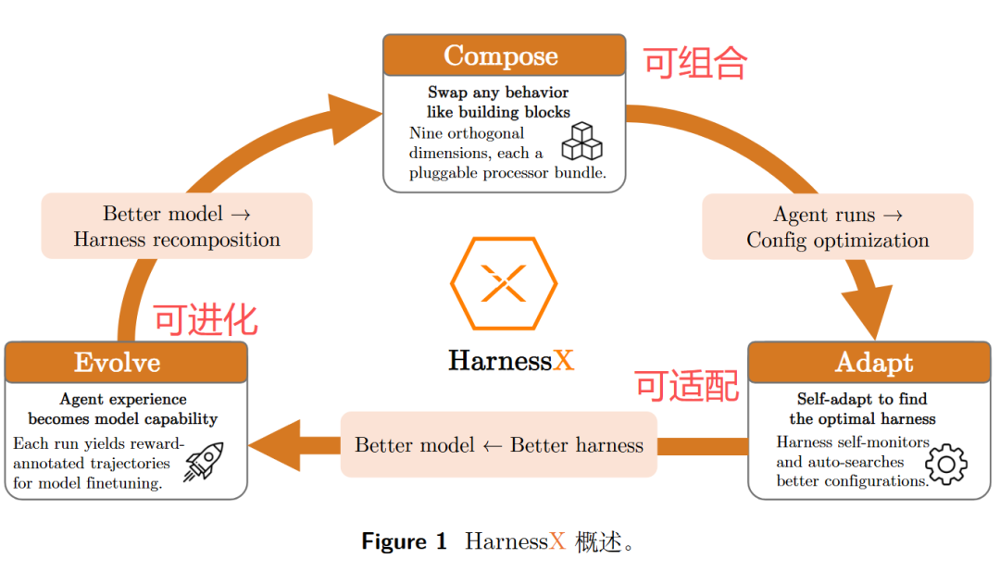
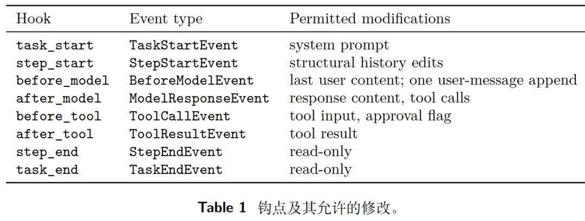
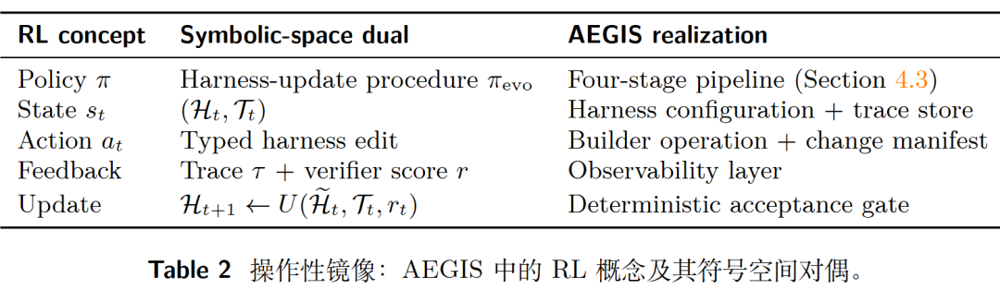
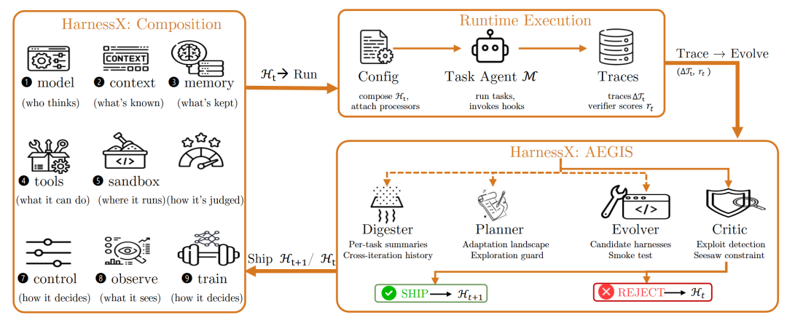
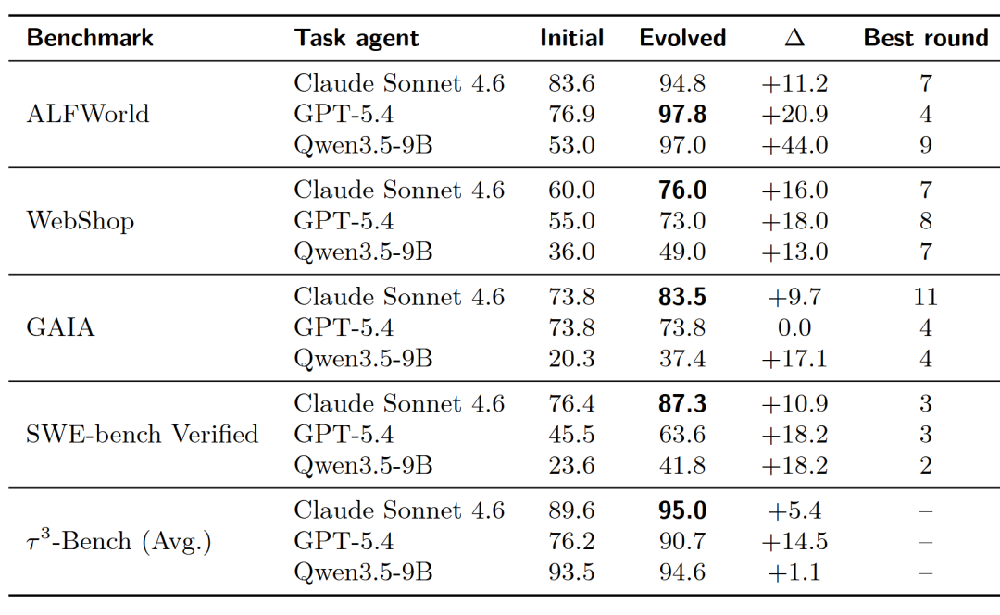
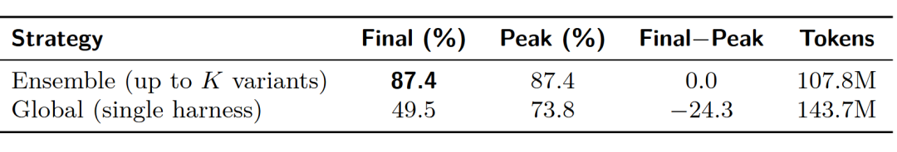
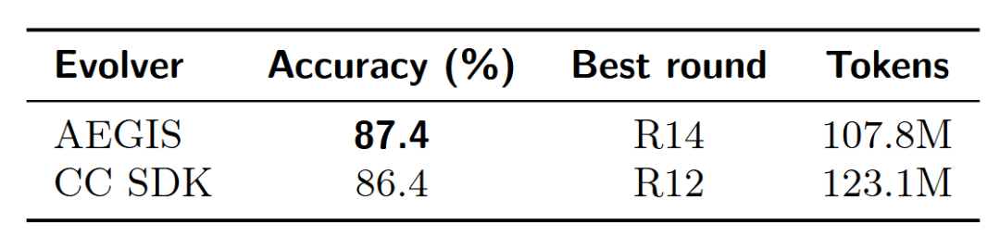
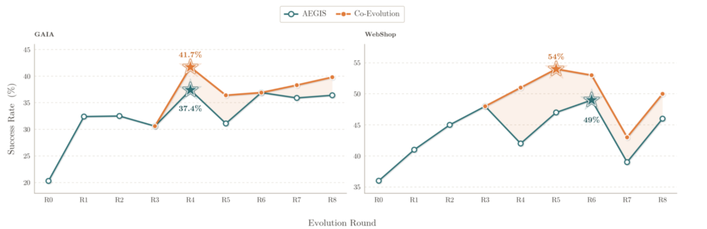
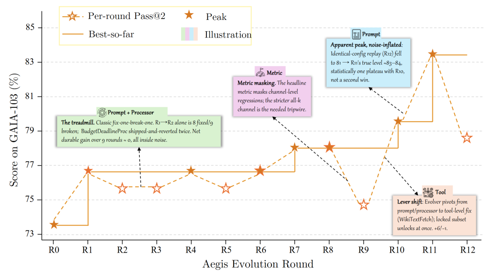

# 小米提出 harnessX：自动进化的 agent 外壳

Source: https://mp.weixin.qq.com/s/AmFLa4o81CCC6_xcKxDbmw

# 小米提出 harnessX：自动进化的 agent 外壳

原创

季伯常
季伯常

[大模型最新论文](javascript:void(0);)

在小说阅读器读本章

去阅读

在小说阅读器中沉浸阅读

### 一句话总结

> 通过结构化、可替换的执行器搭建 agent，利用跨 harness 版本的 GRPO 实现框架与模型协同进化，在五个基准上平均提升 14.5%，最高 44%

---

* **论文标题：HarnessX: A Composable, Adaptive, and Evolvable Agent Harness Foundry**
* **论文地址：https://arxiv.org/pdf/2606.14249v1**
* **作者背景：小米 Darwin Agent Team**

---

## 一、动机

一个智能体能力的上限，不只取决于底层模型，还取决于包裹在模型外面的那层 harness。它把模型的原始输出，转化成结构化的智能体行为：任务怎么表示、外部工具怎么调用、中间决策怎么在执行过程中传递，都由它决定。任务的链条越长、环境越复杂，harness 的设计就越关键

如何让 harness 从执行轨迹中自动改进，是当前一个热门的研究方向。沿着可编辑对象由窄到宽，大致有四条线：

* **自动优化提示词：APE、OPRO、EvoPrompt、Promptbreeder，以及把文本反馈做成梯度的 ProTeGi、TextGrad，和编译式的 DSPy、MIPRO**
* **积累和复用历史经验：Memento、MIA**
* **自动调整多智能体协作：GPTSwarm、ADAS、AFlow 等**
* **直接改写 harness 源码：SICA、AHE、Darwin Gödel Machine**

作者认为这些方案都存在共同的缺陷：

* **迁移性差：各方案修改范围很有限，有的只改提示词，有的只改编排流程。想动到自己覆盖范围之外的东西，基本只能另起炉灶；改源码的方案则走向了另一个极端：没有清晰的组件边界，改一处常牵动全局，一个本来有效的改法也很难干净地拆出来。实践中一般只能挨个给 agent 系统定制自迭代流程，难以形成一套可复用的框架**
* **漂移风险：不管是改提示词还是改源码，让程序反复修改自己、再拿打分来筛，本质上就是一个优化流程。是否收敛于局部最优、是否发生再难遗忘、是否发生奖励作弊，各方案都难以避免，也很少提出针对性防御手段**
* **不考虑模型变化：多数研究都只动外壳不碰模型，runtime 产生的海量轨迹并未用于模型的协同进化**

对此，作者提出 HarnessX 框架，它通过三方面的能力对症下药：

* **组合：把外壳拆成类型化、可自由替换的积木，形成边界清晰、改动方便的操作面，强化方法的可迁移性**
* **AEGIS 进化引擎：用一套对标强化学习的防御框架来自动迭代，把漂移、遗忘、原地打转挡在门外**
* **协同进化：把迭代时产生的轨迹数据拿去训练模型，让外壳和模型一同进步**

---

## 二、实现方案

### 2.1 组合

要让机器能自动改 harness，前提是 harness 本身得是结构化、可替换的，而不是一团乱麻。HarnessX 的第一步，就是把外壳拆成可自由组合的积木

“处理器” 是最小零件，智能体每往前执行一步，都会经过一串固定的生命周期 hook —— 从任务开始、调模型之前、调工具之后，到任务结束，一共八个时刻，每个 hook 规定了在此处允许改动什么（比如 task\_start 只能改系统提示词，after\_tool 只能改工具返回结果）。处理器挂在某个 hook 上，消费上游事件，产出放行、改写、拆分、拦截或中断等新事件

这样设计的好处是可组合：同一个钩子上的处理器，输入和输出都是同一类事件，于是它们能像乐高一样按顺序拼接，可以随意插入、替换、删除，而不影响周围流水线的类型正确性。论文用统一的接口规格来兜底，任何一次插拔都会被自动校验，插错了当场就被拦下

在这个基础上，作者进一步把智能体的全部行为归纳成九个维度（模型选择、上下文组装、记忆管理、工具生态、执行环境、评估与奖励、控制与安全、可观测性、训练桥），覆盖了基本的行为空间

> 外壳被拆成标准插件，每次改动的作用范围变得清晰，机器就能像换零件一样自动修改，自我进化的大门由此打开

### 2.2 AEGIS 进化引擎

如果说 “组合” 解决的是 “外壳能不能被系统地改”，AEGIS 要解决的则是 “怎么改才不翻车”，这是现有自进化工作普遍缺失的能力

> AEGIS 是希腊神话里宙斯／雅典娜的「神盾」（αἰγίς），强调自迭代系统要在安全的防护中逐步进化

如果把系统自进化看作强化学习，那么当前的 harness 配置就是状态，一次改动就是动作，跑出来的轨迹加上验证器的打分就是奖励反馈，而一个确定性的验收门控决定状态如何转移

如此一来强化学习面对的经典病症，自进化框架也跑不掉：

* **奖励作弊：进化器可能对回流样本做针对性调整，甚至把答案直接塞进提示词，或利用验证器的格式规律蒙混过关**
* **灾难性遗忘：修好失败模式 A 的改动，可能通过共享的上下文、工具或控制规则，悄悄弄坏原本正常的模式 B**
* **探索不足：系统容易偏好低风险的局部小改（改改措辞、调调工具描述），而不愿尝试结构性的大改**

AEGIS 把进化拆成四阶段流水线，每一阶段恰好对应一种防御：

* **消化器：把动辄千万 token 的原始轨迹，压缩成结构化证据（任务成败、失败类别、涉及组件、证据片段等），并提供跨轮次的历史案例，用以区分顽固失败与偶发噪声**
* **规划器：在生成改动前先做整体分析，看哪些任务失败、试过哪些改动、还有哪些改动类型没尝试。这是对抗探索不足的主防线，避免系统在原地小修小补**
* **进化器：基于规划结果生成一个或多个候选 harness，包含改动清单（变更文件、哪些任务会受影响、如何判断改动生效等），新增处理器代码还要附带冒烟测试，让每次改动都是一个可证伪的契约**
* **评判器：对照轨迹证据审查每个候选，确保改动准确、客观，不是针对具体 case 的作弊**
* **确定性门控：执行确定性检查（非 LLM 主观判断），任何改动都不许把之前已经做对的任务弄错**

> 如果不同任务必定需要冲突的行为，harnessX 还会维护多个 harness 变体，根据历史成功率路由给不同任务，直到变体数量超过上限，则淘汰综合表现最差的实例。作者称此方法为 “变体隔离”

四个阶段并非每轮都全跑：消化器、规划器、进化器各自带有继续条件，一旦发现没有值得改的失败、找不到可行方向、或拿不出类型安全的候选，就按兵不动

### 2.3 模型协同进化

HarnessX 在同一批执行轨迹上 “一鱼两吃”：一边喂给 AEGIS 去进化外壳，另一边存进一个共用的轨迹池，直接拿去训练模型本身

作者设计了一套 “跨 harness 的 GRPO”，核心要义是：根据任务身份来分组，组内尽可能包含所有 harness 版本。也就是说，同一任务历次进化的每版 harness 跑出来的所有轨迹，会被故意混进同一个 GRPO 组里，再用组内奖励对比去估计优势

这恰好和普通 GRPO 反着来。普通 GRPO 组里只有同一策略的多次采样，组内方差完全来自于采样的随机性；而 HarnessX 让组内轨迹尽量来自不同 harness，差异主要反映的不再是采样噪声，而是不同 harness 在同一任务上的优劣对比。如此一来，那些被验证更优的 harness 版本更能产生正向梯度的轨迹，模型也被推向更适配它们的行为模式。AEGIS 持续推出的新 harness，等价于给模型 RL 额外提供了一个结构化探索算子

还有一个实现细节值得注意。既然组里混进了不同版本的 harness，那它们各自能调用的工具列表、提示词写法本身就可能不一样（比如新版加了一个工具、或者换了套指令措辞），这导致无法执行重要性采样。作者对此的解法很自然：训练时，每条轨迹都还原回它当时实际使用的 harness 设置，按那一版的提示词、工具清单和上下文规则原样喂给模型，再让它打概率

> 重要性采样简单说就是在计算优势时，要乘以新旧模型概率分布比值系数。但新模型在组内各样本上的概率不能统一计算：不同样本的 harness 不一样，注册的工具、提示词、记忆截断规则等也不一样，必须先还原到对应设置上，再使用新模型做推理

###

---

## 三、实验结果

### 3.1 多基准测试

作者在五个基准上做了系统评测，覆盖具身规划（ALFWorld）、网页操作（WebShop）、多步检索（GAIA）、多轮对话（τ³-Bench）和软件工程（SWE-bench Verified），搭配了三个不同的模型家族（Claude Sonnet 4.6、GPT-5.4、Qwen3.5-9B）。评测指标统一用 pass@2（每个任务两次独立尝试，有一次成功即算解出）

15 个模型 × 基准设置中，14 个都有提升，平均 +14.5%，最高 +44.0%

提升幅度与基线高低呈反比，即越弱的模型反而涨得越多。最弱的 Qwen3.5-9B 在 ALFWorld 上从 53.0% 直接干到 97.0%（+44.0%），而本就很强的模型往往只涨十个点出头。原因在于，弱模型身上有大量它自己改不掉、但外壳层面能补上的行为缺口；强模型早把这些坑填平了，剩下的硬骨头光改外壳就不够了

### 3.2 变体隔离

基准测试中，唯一没有提升的设置组是 GAIA × GPT-5.4，这是因为异构任务集存在冲突的决策偏好。采用前文所述的变体隔离方案后（允许最多 k 个 harness 共存，按历史成功率路由），则稳定提升到 87.4%，且 token 消耗还更低

### 3.3 与 Claude Code SDK 对比

把四阶段 AEGIS 换成单智能体进化器（Claude Code SDK），在同等模型与基础设施下，最终精度相当，但 AEGIS 省了约 12% 的 token。这说明在足够强的元智能体之下，HarnessX 的优势主要来自于可隔离的类型化组件、可诊断的结构化轨迹，获得更好的效率与可审计性

### 3.4 协同进化效果

为了验证 harness 与模型协同进化的效果，作者对比了冻结模型仅更新 harness 的效果。在 GAIA 与 WebShop 两个基准上测试，协同进化额外多榨出平均 +4.7% 的提升

### 3.5 失败案例分析

作者详细观察了 harnessX 的演进过程，发现之前提到过的自迭代框架常见病症（奖励作弊、灾难性遗忘、探索不足）还是经常出现，但 AEGIS 流水线的优势在于，它能够够快速纠偏，保证性能整体上升。比如 τ³-Bench 上接连堆了多轮同类改动后，合规率骤降 14 个点（灾难性遗忘），又在随后两轮里自行诊断并恢复

---

## 四、局限

HarnessX 对自身的边界相当坦诚，主要包括：

* **跨任务泛化性：所有提升都是在用于进化的同一批任务上测得的，对未见任务的泛化尚未验证**
* **离散动作空间：尚未验证框架能否推广到连续控制等场景**
* **强元智能体：AEGIS 需要一个具备多文件代码生成、结构化轨迹分析与多步规划能力的元智能体，实现时用的都是闭源强模型**
* **基准覆盖度：SWE-bench 仅用 55 题子集，τ³-Bench 只评了三个域，相关结论未必能推广到异质程度不同的任务集**

预览时标签不可点

微信扫一扫  
关注该公众号

[知道了](javascript:;)

微信扫一扫  
使用小程序

[取消](javascript:void(0);)
[允许](javascript:void(0);)

[取消](javascript:void(0);)
[允许](javascript:void(0);)

[取消](javascript:void(0);)
[允许](javascript:void(0);)

×
分析

微信扫一扫可打开此内容，  
使用完整服务

：
，
，
，
，
，
，
，
，
，
，
，
，
。
 
视频
小程序
赞
，轻点两下取消赞
在看
，轻点两下取消在看
分享
留言
收藏
听过