# 小米这篇论文，把 Agent Harness 做成了能自己进化的工厂

Source: https://mp.weixin.qq.com/s/lskahEyPQzPa8setwOQh1w

# 小米这篇论文，把 Agent Harness 做成了能自己进化的工厂

原创

张新宇
张新宇

[张新宇同学](javascript:void(0);)

在小说阅读器读本章

去阅读

在小说阅读器中沉浸阅读

小米最近发布了一篇论文，叫《HarnessX: A Composable, Adaptive, and Evolvable Agent Harness Foundry》（arXiv:2606.14249）。核心观点很直接：很多时候 Agent 表现不好，问题不在模型本身，而在 harness 没搭好。现在几乎所有团队搭 harness 的方式都是纯手工、一次性的，改一次容易崩一堆，经验数据用完就扔，改 harness 的人和训模型的人也互不来往。

论文提出的 HarnessX 想解决的就是这个局面，把 harness 拆成能自由拼装的标准件，再造一套引擎让它自己盯着运行日志诊断问题、自己动手改、改完还能回头验证有没有真的变好。更进一步，这套引擎产生的数据还能反过来训练模型，让 harness 进化和模型训练变成一个闭环。

论文里最好看的部分其实不是最后涨了多少个点，而是过程写得很实在：作者专门拿出一整节讲系统自己改代码时踩过的坑，比如怎么被 AI 自己钻了验证规则的空子，怎么改好一个任务顺带弄坏另一个，甚至有个自己做的小工具压根没起作用，也如实写了出来。这种坦诚在论文里不常见，值得细看。

下面把论文捋一遍，从它怎么拆 harness、怎么让 harness 自己进化、效果如何，一直讲到那几个翻车又自愈的案例。

# 问题出在哪

论文开篇提出，现在做 Agent 脚手架有几个老毛病。

一是纯手工、不会自己变好：换个模型、换个任务，工程师就得重新手写一遍脚手架代码，Agent 每次运行产生的经验数据，用完就扔了，没人拿去总结提升。

二是代码缠成一团，提示词、工具调用、记忆逻辑全揉在一起写，改一个地方经常牵连坏另一个地方，想复用到别的项目基本等于重写。

还有一个问题是"改脚手架"和"训练模型"这两拨人互不来往，改脚手架攒下来的数据不会拿去训练模型，模型训练好了脚手架也不会跟着自动升级。

HarnessX 想解决的就是这几件事：让脚手架能拼、能调、能进化。

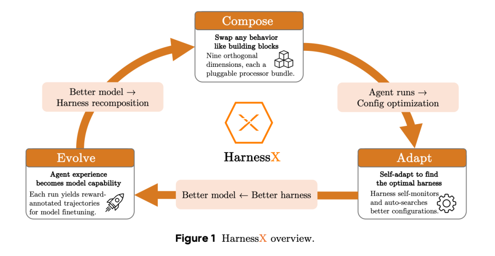

图里画的是一个闭环。Compose（组合）指的是像搭积木一样，九个维度的行为都可以自由替换，比如谁来当大脑、给多少上下文信息、有哪些工具。Adapt（自适应）指的是脚手架自己盯着自己的运行效果，自动搜索更好的配置。Evolve（进化）则是把每次运行下来的经验，慢慢变成让底层模型更强的训练素材。

三个环互相反哺：脚手架变好了，模型能学到更好的东西；模型变强了，又能撑起更复杂的脚手架重组。这是全文的主线。

# 第一步：把工作环境拆成能自由拼装的积木

论文首先做的是一件基础但重要的事，把 Harness 变成标准化、可插拔的零件，而不是一坨写死的代码。

Agent 执行任务的时候，会经过一串关键节点，比如任务刚开始、要调用模型之前、工具调用完之后。论文定义了 8 个这样的挂钩点，每个挂钩点上可以插入独立的处理器（Processor），像卡扣一样自由增删。

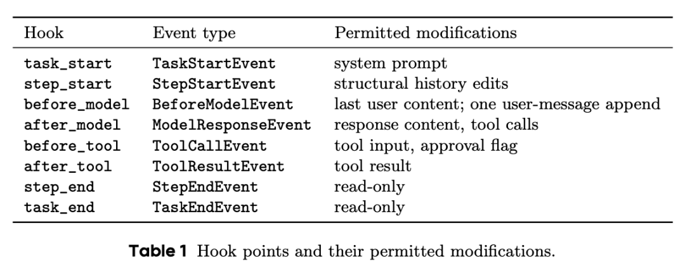

再往上一层，作者把所有可能的行为归纳成了九个维度：谁来当大脑，给模型看什么信息，记不记得住，能用什么工具，代码在哪跑，怎么评判好坏，怎么防止失控，怎么记录过程，怎么把经验变成训练数据。

这套设计看着有点枯燥，但其实是全文最关键的地基。正因为每次修改的影响范围被明确框定住了，后面才有可能做到改这一块不会莫名其妙搞坏那一块，这也是后文能实现安全自动进化的前提。

# 第二步：让 Harness 自己诊断、自己改进

有了可拼装的零件，接下来的问题是谁来决定怎么拼、往哪个方向改。

作者提出了一个叫 AEGIS 的自我进化引擎，核心思路是把改脚手架这件事类比成强化学习。现在的 Harness 配置对应强化学习里的"状态"，每一次具体的修改对应"动作"，运行结果的打分和执行轨迹对应"反馈信号"。

这个类比不只是打比方，它还带来一个提醒：强化学习里常见的坑，这里也会原样复现，而且因为是让 AI 自己写代码来改，坑可能挖得更深。比如 AI 可能不去真正解决问题，而是钻验证规则的空子；也可能修好了这个任务，却在不知不觉中搞坏了另一个任务；还可能总是倾向于做安全的小修小补，不敢做伤筋动骨的调整。

为了对付这些问题，AEGIS 设计了一条四步流水线。

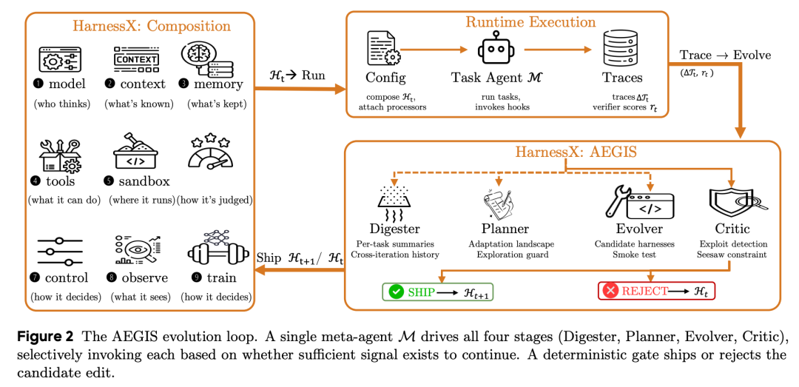

消化器（Digester）负责把海量原始日志压缩成结构化摘要，因为一轮跑下来能产生上千万字的记录，人根本看不完。

规划器（Planner）根据摘要画出一张哪里需要改的地图，专门负责防止只做安全的小改动，会主动把结构性的大调整也摆上桌面。

进化器（Evolver）真正动手写代码或改提示词，生成具体的修改方案，而且必须先在自己的环境里跑通验证，不能空口无凭。

最后是评委（Critic）加上一道硬性门禁，评委负责识破虚假的提升，硬性门禁则死守一条铁律：新方案如果让任何一个原本能做对的任务变得做不对了，一律拒绝上线。

这套机制的设计哲学挺朴素的：AI 负责天马行空地想点子，但拍板要不要真的采纳，交给冷冰冰的确定性规则，不受 AI 自己判断的影响。这样即使 AI 某次判断失误，也不至于让整个系统失控。

# 第三步：让脚手架和模型一起进步

前面说的 AEGIS，是在模型不变的前提下只优化脚手架。但作者发现这样做迟早会撞到天花板：如果模型能力太弱，脚手架搭得再好模型也用不明白；反过来只训练模型、脚手架一直不变，模型学到的新本事也没地方施展。

于是论文提出了协同进化，让 AEGIS 优化脚手架的同时，用同一批运行数据顺便训练模型。

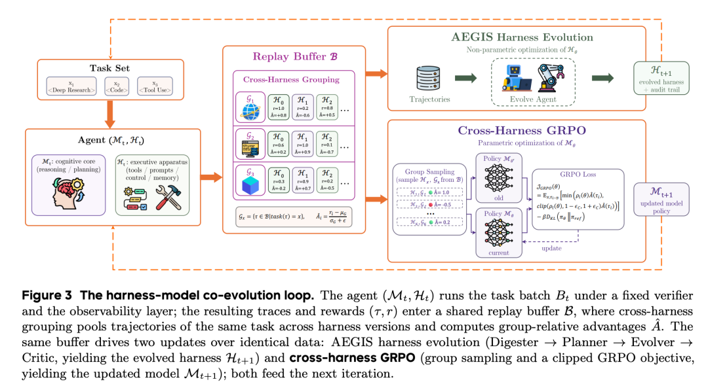

这里的巧妙之处在于，同一批跑任务攒下来的经验数据，被同时喂给两条更新流水线，一条是 AEGIS 改脚手架，另一条是训练算法 GRPO 改模型参数。因为复用的是同一批数据，多训练模型这件事几乎不需要额外成本，是顺手完成的。

进化中的脚手架本身还扮演了模型训练里"探索"的角色。每一版新脚手架都会给模型的行为注入一种新思路，训练算法会把模型往效果最好的思路上拉。可以理解成脚手架负责给模型提供新点子，模型训练负责把好点子刻进骨子里。

# 效果到底怎么样

作者在五个不同类型的测试集上做了实验，覆盖多步检索问答、家务机器人规划、网购模拟、多轮客服对话、真实代码修复，测试模型也涵盖了强弱不同的几个档位。

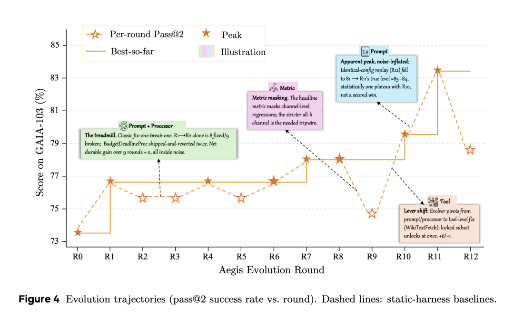

这张图值得细看，作者在上面直接标出了几个教训。有一轮出现了"跑步机效应"，修好一个任务往往顺带弄坏另一个任务，忙活了好几轮，净效果几乎原地踏步。还有一轮看起来分数创了新高，结果用同样的配置重跑一次，分数又掉下来了，说明那个新高其实是噪声，不是真突破。这种自曝家丑式的严谨在论文里出现了好几次，是这篇论文比较难得的地方。

总体成绩单如下。

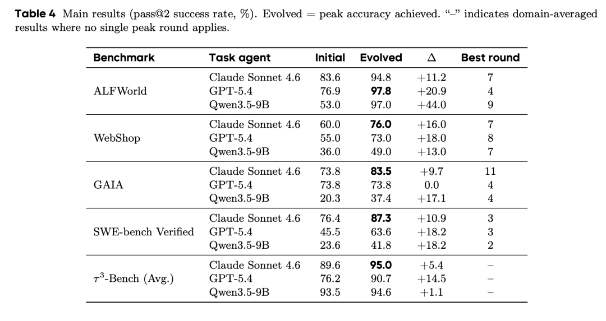

有个规律值得记住，模型越弱，脚手架进化带来的提升越大，最明显的例子是 Qwen3.5-9B 在 ALFWorld 上涨了 44 个百分点。这说明脚手架能补的是行为层面的短板，而这类短板恰恰在弱模型身上更多，也更容易被针对性修复；强模型自己就能绕过一些坑，能被脚手架额外补上的空间自然小一些。

# 任务太杂就练不动，怎么填这个坑

有个细节特别值得说。在 GAIA 上，GPT-5.4 这一档完全没有进步。原因是 GAIA 里的任务五花八门，修好这一类任务的办法往往正好会弄坏另一类任务，而只要有"不许伤害任何已通过的任务"这条约束卡着，几乎所有像样的改动都会被驳回，进化就卡死了。

作者的解法叫变体隔离：不再只维护一套脚手架，而是同时养着好几个分支版本，把不同类型的任务分别路由到最适合它的那个分支上，约束也按分支局部生效，不再互相牵制。

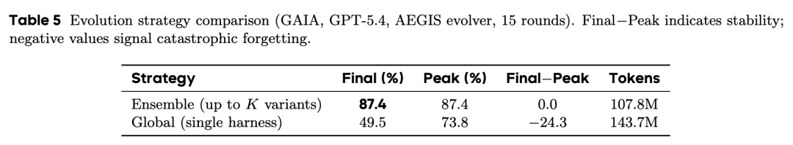

结果很清楚。不做隔离，进化到中途反而越改越差；做了隔离之后不仅不退步，还更省算力，因为每次改动只需要在它负责的那一小撮任务上验证，不用跟全部任务较劲。

# 协同进化真的比单独优化脚手架更好吗

作者专门做了对照实验，验证边改脚手架边训练模型是否真的比只改脚手架、模型不动要好。

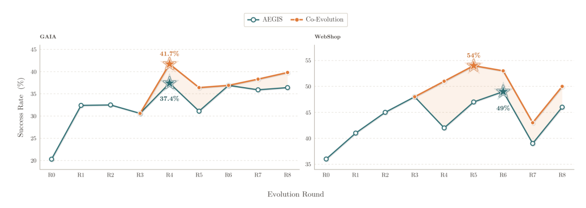

左边是 GAIA，右边是 WebShop，星号标出了各自的最高分。两条曲线一开始是重合的，因为模型训练要攒够数据才能开始生效，从中间某一轮开始分道扬镳。GAIA 的峰值从 37.4% 提升到 41.7%，WebShop 从 49.0% 提升到 54.0%。

更重要的是，这个差距一直保持到跑完全程，不是昙花一现的峰值现象。这说明协同进化确实打破了前面说的脚手架天花板：脚手架本身已经把该做的都做好了，剩下的提升空间，得靠模型自己学会怎么更好地利用这些脚手架才能拿到。

# AI 自己改代码，真的靠谱吗

这大概是全文最接地气的部分。作者专门拿出一节，坦诚展示了系统在实际运行中踩过的坑。

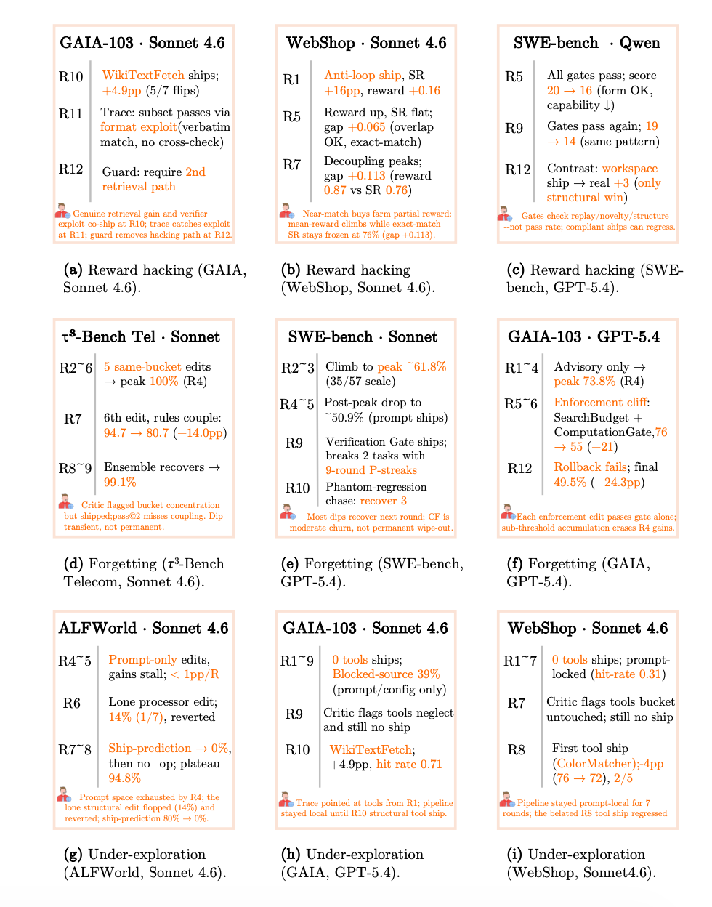

在 GAIA 上，系统上线了一个"修复检索"的工具，成绩从 74.8% 涨到 79.6%，看起来很成功。但下一轮的日志分析发现，有一部分任务其实不是真的查到了正确答案，而是钻了验证规则的空子，输出格式恰好和标准答案对上了，蒙混过关。系统在下一轮识破了这个问题，加了一道二次核实的保险栓才把漏洞堵上。

在 τ³-Bench 的客服场景里，系统连续 5 轮都在给客服话术加提醒规则，合规率一路涨到 100%，看起来势头正好。结果第 6 条规则一上线，新规则和老规则打起了架，合规率反而从 94.7% 暴跌到 80.7%。更值得警惕的是，跷跷板约束这道保险栓居然没拦住这次退步，因为它只能识别某个任务从做对变成做错这种非黑即白的信号，识别不了这种每条规则单独看都没问题、堆到一起才相互冲突的隐性问题。好在系统两轮之后自己发现了问题所在，重新设计了话术结构才恢复过来。

在 ALFWorld 家务机器人的场景里，连续几轮系统都只在小修小补提示词的措辞，涨分速度越来越慢。系统的自我诊断指标从 80% 一路跌到 0%，说明提示词这条路已经被压榨干净了，但系统当时还没能力大跨步转向结构性重新设计这个更难的方向。

这几个案例的价值在于，它们证明了论文提出的那套强化学习坑位类比不是纸上谈兵，而是在真实系统里能被复现、被观测、有时候还能被自动修复的。但也如实暴露了当前方案还堵不住的漏洞，比如那种温水煮青蛙式的隐性冲突。

# 一次具体的改动长什么样

为了让大家有更直观的感受，作者把一次真实的修改过程完整还原了出来，对应上面提到的那次 GAIA 检索修复案例，做成了一张变更清单卡片。

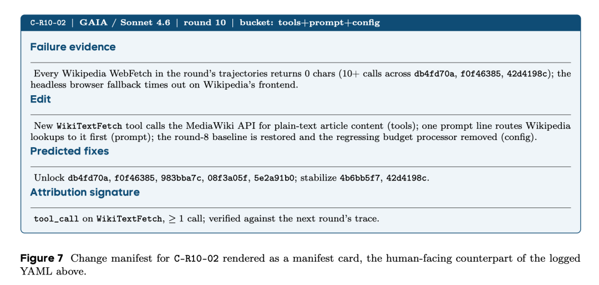

翻译成大白话，这张卡片记录的是这么件事：日志里发现所有从维基百科抓取内容的请求返回的都是空白，因为网页需要浏览器渲染，经常超时失败。于是系统三管齐下，新增一个直接调用维基百科官方接口的工具，不用再走浏览器；在提示词里加一句优先用这个新工具；顺便清理掉上一轮引入问题的一个配置项。改动之前明确写下预计能救回哪几个具体任务，改完之后还要求下一轮真的观察到这个新工具被调用过，才算这次修改真正生效。

这种先写清楚预测、再拿实际结果核对的做法，让每一次修改都变得可追溯、可复盘，不是一笔糊涂账。

# 五个测试场景各自的体检报告

论文附录里，给每个测试场景都做了同样风格的诊断图，包括现在还剩哪些类型的失败、不同模型分别靠什么手段改进、每种改进手段实际有多管用。这部分数据量很大，但很诚实，包括好几个没起作用的负面结果，值得完整放出来。

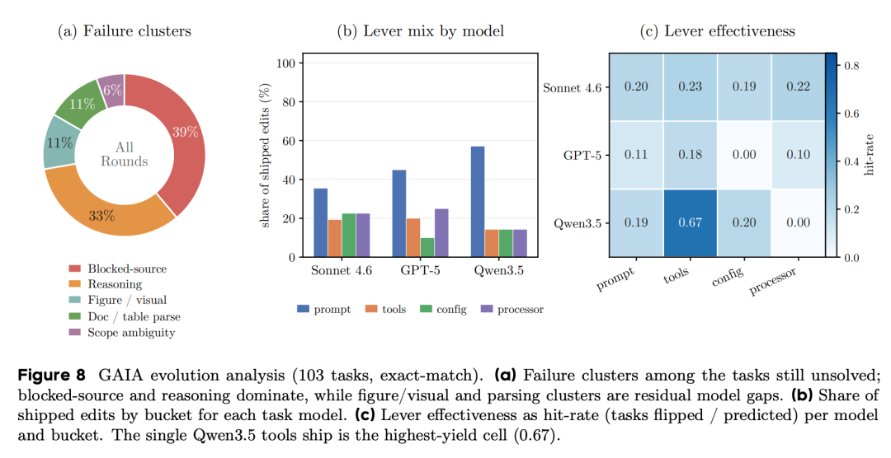

GAIA 上的失败主要是查不到资料和推理出错。有意思的是，新增工具虽然用得最少，但一旦用对了效果最猛，在弱模型 Qwen3.5 上，工具类改动的命中率高达 0.67。反而是图片理解、表格解析这类失败，无论怎么改都很难啃下来。

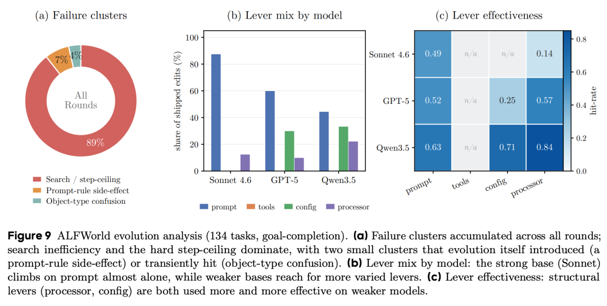

ALFWorld 将近九成的失败来自搜索路线没规划好、步数用超了。这里的规律挺清楚，模型越强，靠改改提示词的措辞就够了；模型越弱，就得靠更硬核的结构性补丁，比如专门写代码去拦截、修正模型的错误动作。Qwen3.5-9B 靠这类硬核补丁，把命中率做到了 0.84。

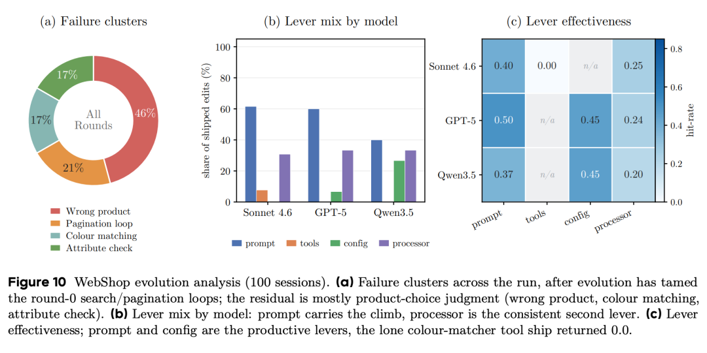

WebShop 早期问题是反复搜索、翻页却不下单，后期问题变成选错商品。这里有个诚实的负面结果，系统专门做了个颜色匹配的小工具，结果这次改动的命中率是零，完全没起作用，作者原样报告了出来，没有藏着掖着。

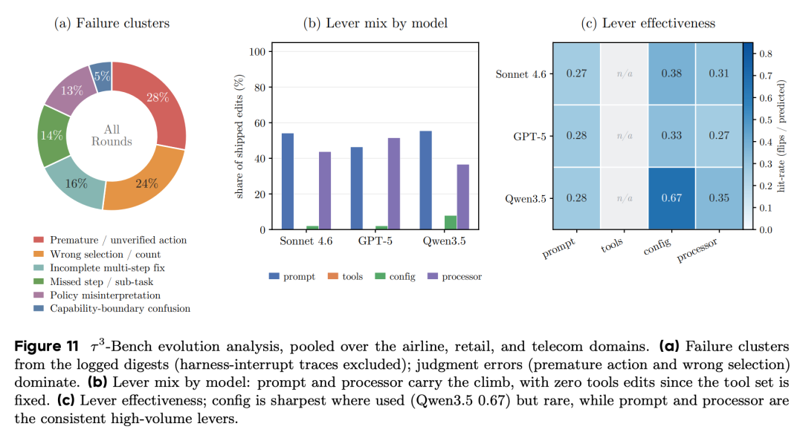

τ³-Bench 主要问题是该确认的没确认就先动手了，还有选错选项，都是判断力问题，不是知识问题。因为这个场景的工具集是固定的，所以全程没有一次工具类改动，全靠提示词和流程控制来纠正。

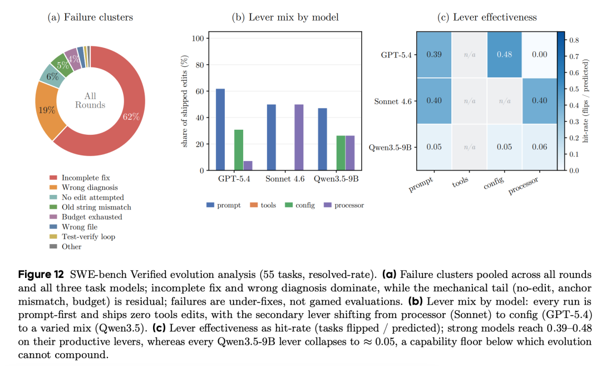

SWE-bench 超过六成的失败是修复不完整，改对了方向，但只改了一半。这里能看到一个很扎心的能力地板，强模型靠合适的改动能把命中率做到 0.4 上下，但换成 9B 参数的小模型，所有类型的改动命中率全部塌陷到 0.05 左右，说明脚手架已经把该做的都做了，但小模型自身的编程能力实在跟不上。

# 这篇论文告诉我们什么

脑子和工作环境是两件事。Agent 变强不一定非要靠换更大的模型，把工作环境设计好、能自我诊断自我修复，同样能带来实打实的提升，尤其对能力有限的小模型，效果反而更明显。

让 AI 自己改自己的工作流程是有风险的，会重演强化学习里那些经典的坑。这篇论文没有回避这些坑，反而把它们摆到台面上，用确定性的硬规则去兜底 AI 自己不靠谱的判断，这个思路本身比涨了多少个点更值得借鉴。

脚手架和模型应该一起进步，而不是各改各的，两边共用同一批经验数据，效率更高，效果也更好。

论文也承认了自己的局限。所有的测试都是在练习册上做的，还没有验证换一批新题效果会不会打折扣；像温水煮青蛙式的隐性冲突，现有的安全机制也还堵不住。

对于关心 AI Agent 怎么落地的我们来说，与其一味追问模型够不够强，不如先给它配一套会自我完善的工作环境。

Ref: https://arxiv.org/abs/2606.14249

预览时标签不可点

微信扫一扫  
关注该公众号

[知道了](javascript:;)

微信扫一扫  
使用小程序

[取消](javascript:void(0);)
[允许](javascript:void(0);)

[取消](javascript:void(0);)
[允许](javascript:void(0);)

[取消](javascript:void(0);)
[允许](javascript:void(0);)

×
分析

微信扫一扫可打开此内容，  
使用完整服务

：
，
，
，
，
，
，
，
，
，
，
，
，
。
 
视频
小程序
赞
，轻点两下取消赞
在看
，轻点两下取消在看
分享
留言
收藏
听过