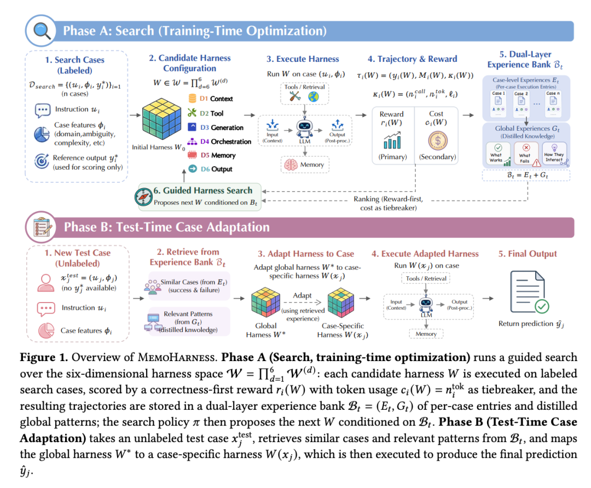
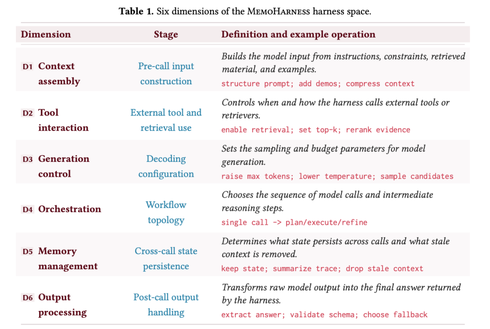
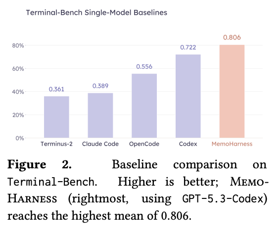
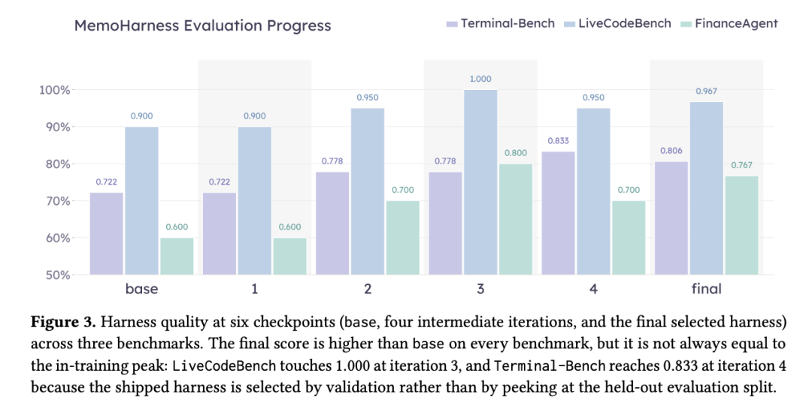
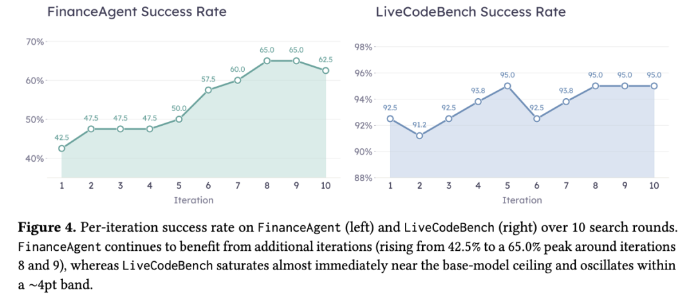
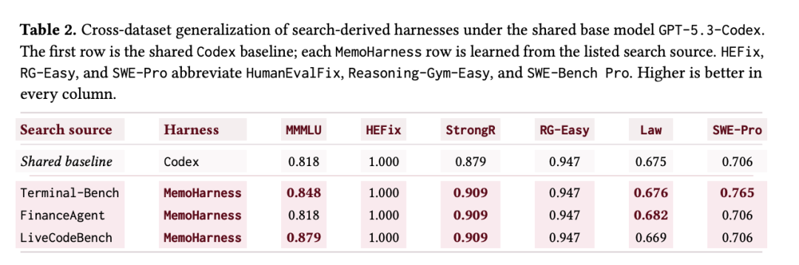
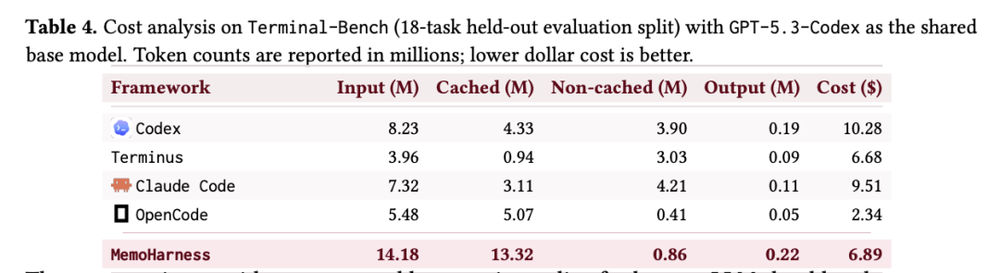
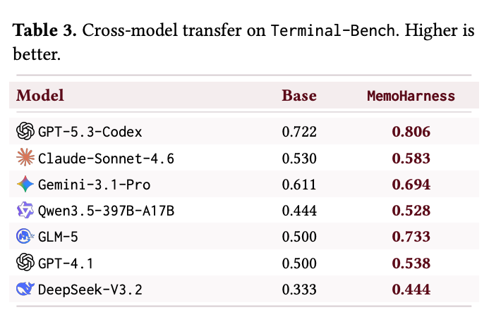

# MemoHarness：让Agent根据历史成败，为每个任务定制执行框架

Source: https://mp.weixin.qq.com/s/cL4JYYIgpVMRcWoUVtqlzg

# MemoHarness：让Agent根据历史成败，为每个任务定制执行框架

原创

无影寺
无影寺

AI帝国

在小说阅读器读本章

去阅读

在小说阅读器中沉浸阅读

同一个底座模型和工具集，agent harness 的上下文、工具接口、编排、memory 与输出处理方式会改变端到端任务表现。MemoHarness 的切入点是：搜索阶段保存成功与失败轨迹，测试时再用这些经验为未见案例选择更合适的 harness 配置。

在Terminal-Bench的18题评估分片上，MemoHarness使用GPT-5.3-Codex，平均分数为0.806；文中最强固定配置Codex为0.722，差值为0.084。测试时不再使用标签、反馈或新的搜索轮次，但会检索已有经验并生成案例专属配置。这是受控基准结果，不代表所有agent任务都会获得同等幅度增益。

> **[图1：MemoHarness 概览]** 阶段 A（搜索，训练时优化）对六维控制层空间 W 执行引导式搜索，每个候选控制层在已标注搜索案例上执行，由正确性优先的奖励函数 ri(W) 打分，token 用量 ci(W) 作为平局决胜，结果轨迹存入双层经验库 Bt=(Et,Gt)；阶段 B（测试时案例自适应）对未标注测试案例 x\_test\_j，从经验库检索相似案例和相关模式，将全局控制层 W\* 映射为案例专属控制层 W(x\_j) 并执行以产生最终预测。

## agent harness 管理模型在任务中如何运行

所谓 agent harness，在本文中特指把基础大模型变成一个可执行 agent 的那层外围控制系统。它不负责模型本身的推理，但决定了模型看见什么、能调用什么、怎么调用、调用多久、中间状态怎么记忆、最终输出怎么验证和返回。具体来说，它管六件事：上下文如何构造、工具和检索接口如何暴露、跨轮推理如何编排、memory 如何保留、解码参数怎么设、输出如何后处理。

就是这六件事，同样的模型和工具，不同设计能让端到端成功率差出几十个百分点。而在实践中，绝大多数部署的 agent 对所有案例都用同一套全局配置。一个在平均水平上表现很强的控制层，完全可能在某一类特定案例上出现系统性失配。

## 六个可编辑维度把 harness 拆成可诊断的部件

MemoHarness 做的第一件事，是把控制层按推理的时间流拆成六个可独立编辑的功能维度。这六个维度对应 agent 执行过程中信息依次经过的六个控制关口，组合起来覆盖了从“模型看到什么”到“模型产出什么”的全流程。

> **[表1：MemoHarness 控制层空间的六个维度]** D2 工具交互控制何时及如何调用外部工具或检索器，例如启用检索、设 top-k、重排证据；D4 编排选择模型调用序列和中间推理步骤，例如单次调用 → 规划/执行/精炼；D6 输出处理将原始模型输出转换为控制层返回的最终答案，例如提取答案、校验 schema、选择回退。

这种拆解让搜索能对具体控制“开关”进行编辑和诊断，也让整个控制层不必作为不透明黑箱遍历。搜索从一套最小化控制层起步：没有示例、结构化指令脚手架、外部工具、跨轮memory，使用单次确定性解码和原始输出直传。**最终配置中的每一项组件都由搜索过程积累的经验证据驱动。**

## 双层经验库把搜索轨迹带入测试时配置

搜索产生的不只是分数。MemoHarness 把每次执行的轨迹、诊断和配置变更都存进一个双层经验库。底层是每个案例每次执行的具体条目，记录了成功或失败标记、主要失败维度、次要贡献维度、以及一段自然语言分析。上层是每隔若干轮从失败簇中蒸馏出的全局模式，总结反复出现的现象、支持证据以及针对性的控制维度修复建议。

到了测试时，整个自适应过程不再需要任何反馈、梯度更新或新的搜索轮次。对一个未见过的测试案例，系统检索最相似的历史成功案例、最相似的历史失败案例、与当前案例特征匹配的全局模式，然后让控制器在这些证据的条件下，从搜索阶段学到的全局最优控制层出发，生成一个专属于这个案例的控制层配置。简单案例保持轻量，检索密集、多步推理或格式敏感的案例才会按需调用更丰富的编排策略。

跨数据集测试中，Terminal-Bench上学出的控制层让MMMLU、StrongReject、SWE-Bench Pro分别提高0.030、0.030、0.059。跨模型转移里，六个未见基座模型都高于自身基础设置，平均增益为**+0.098**，范围从Claude-Sonnet-4.6的+0.053到GLM-5的+0.233。控制层的搜索源模型只有一个，这些结果提示部分编排决策可能具有跨模型可迁移性。

> **[图2：Terminal-Bench 基准对比]** MemoHarness（最右，使用 GPT-5.3-Codex）达到最高平均值 0.806，相较最强固定配置 Codex 的 0.722 提升 0.084，相较其他 baseline 提升 0.250 到 0.445。Codex 本身已是专为终端场景设计的控制层，并非弱 baseline。

> **[图3：三项基准上六个检查点的控制层质量]** 从基础配置到最终选定配置，三项基准均有提升：Terminal-Bench 0.722→0.806，LiveCodeBench 0.900→0.967，FinanceAgent 0.600→0.767。最终分数有时低于训练中峰值，因为选择依据是验证集而非评估集。

> **[图4：搜索过程中每轮迭代的成功率变化]** FinanceAgent 在整个搜索过程中持续提升，到第 8–9 轮达峰值 65.0%；LiveCodeBench 几乎即时饱和，围绕 91.2%–95.0% 的窄带振荡，说明搜索在长周期 agent 任务上收益最大。

> **[表2：搜索所得控制层的跨数据集泛化（共享基座模型 GPT-5.3-Codex）]** 第一行为 Codex baseline；Terminal-Bench 学到的控制层在 MMMLU (+0.030)、StrongReject (+0.030)、SWE-Bench Pro (+0.059) 上给出最广泛的正向迁移，LiveCodeBench 控制层改善 MMMLU 和 StrongReject，FinanceAgent 控制层主要改善 StrongReject 和 LawBench。已饱和的 HumanEvalFix 和 Reasoning-Gym-Easy 无变化。

## 准确率优先，成本也不失控：缓存决定了账怎么算

对于要上生产的系统，光谈准确率不谈成本是不完整的。MemoHarness 在搜索阶段采用“正确性优先，成本仅做决胜”的词典序选择规则：主指标是任务奖励，token 用量只在主指标打平时才比较。这意味着优化不会因为贪便宜而漂移到“便宜但错”的配置上。

> **[表4：Terminal-Bench 成本分析（18 题评估分片，基座模型 GPT-5.3-Codex）]** MemoHarness 总输入 token 14.18M，其中 13.32M 可缓存，非缓存输入仅 0.86M，报告总成本 6.89 美元，低于 Codex 的 10.28 美元和 Claude Code 的 9.51 美元，且达成更高任务成功率。更便宜的 Terminus 和 OpenCode 成本优势来自大幅降低的精度。

在 Terminal-Bench 的 18 题评估分片上，MemoHarness 比最强 baseline 多用了输入 token，但其中绝大多数（13.32M 中的 14.18M）是可跨请求缓存的。报告总成本 6.89 美元，比 Codex 和 Claude Code 都低，同时成功率更高。当然，这个成本竞争力建立在“大量检索到的经验可以被缓存复用”的前提之上——缓存命中率低的部署场景账单会完全不同。

> **[表3：Terminal-Bench 跨模型迁移]** 搜索所得控制层（GPT-5.3-Codex 为源模型）直接应用到六个未见过的基座模型，每个模型均相较自身基础设置有所提升，平均增益 +0.098；GPT-4.1 仅 +0.038，GLM-5 则达到 +0.233，表明更强的或已校准较好的基础模型留给控制层干预的空间较小。

## 迁移并不均匀，经验复用仍需评测验证

FinanceAgent这类长周期分析任务上，搜索到第8–9轮仍在发现有效编辑；LiveCodeBench的搜索则在窄带内振荡。跨数据集迁移具有选择性：LawBench有升有降，部分源任务学出的控制层更保守。统计显著性和六个维度各自的贡献仍需要更细的实验归因。

**MemoHarness给出的可验证方向是：把执行轨迹组织成可检索经验，再用它调整案例级harness配置。** 是否值得采用，取决于目标任务能否可靠评测、经验是否可缓存复用，以及跨任务验证是否显示出稳定收益。

📄 原文标题

MemoHarness: Agent Harnesses That Learn from Experience

🔗 原文链接

https://arxiv.org/abs/2607.14159

预览时标签不可点

微信扫一扫  
关注该公众号

知道了

微信扫一扫  
使用小程序

取消
允许

取消
允许

取消
允许

×
分析

微信扫一扫可打开此内容，  
使用完整服务

：
，
，
，
，
，
，
，
，
，
，
，
，
。
 
视频
小程序
赞
，轻点两下取消赞
在看
，轻点两下取消在看
分享
留言
收藏
听过