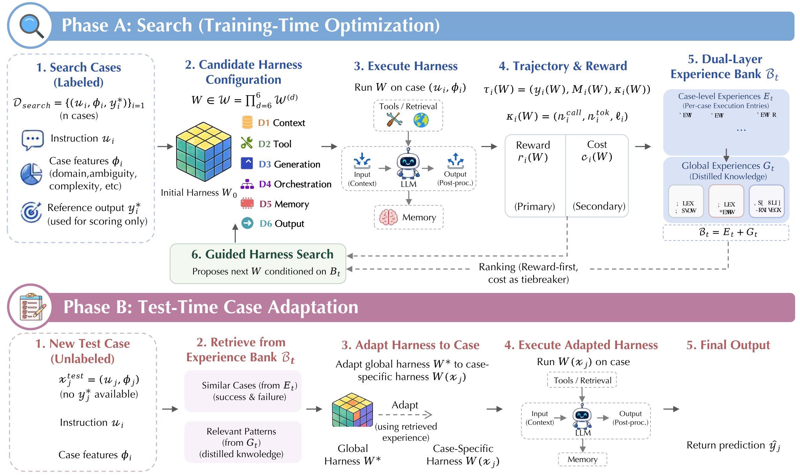
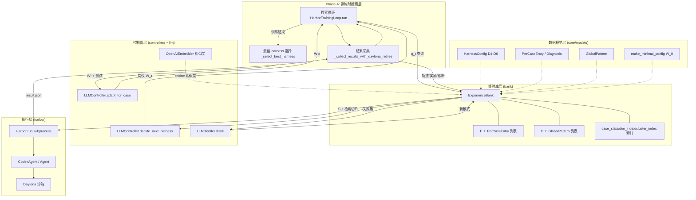
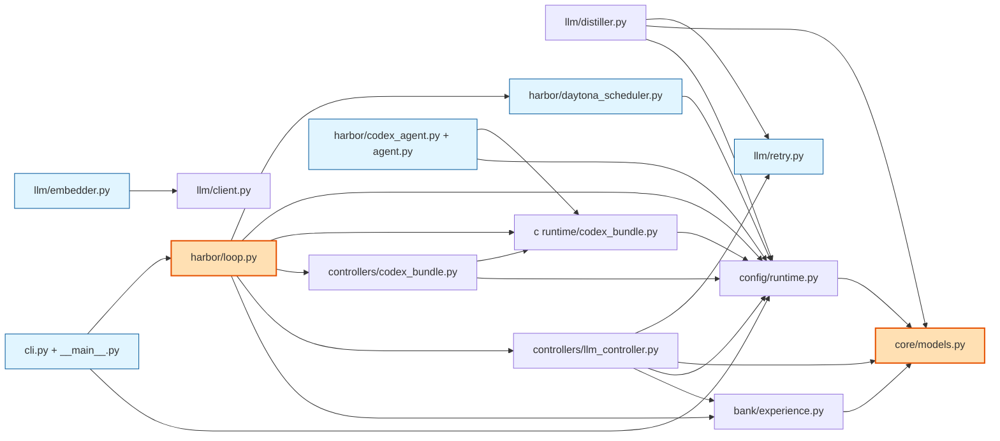
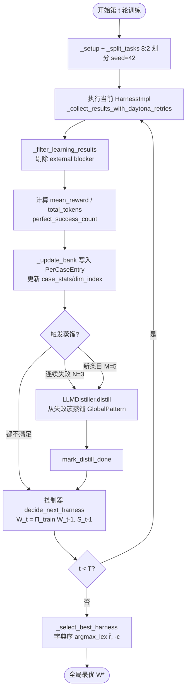
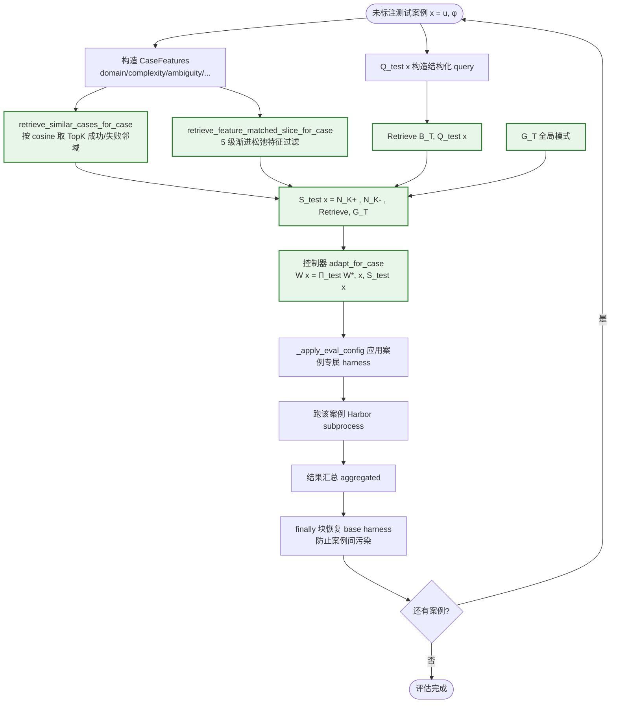
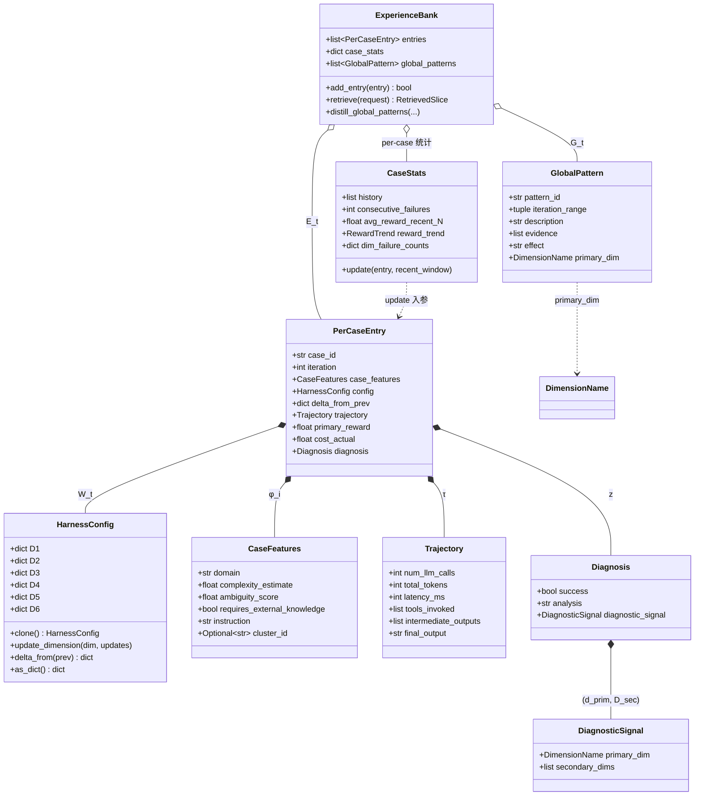
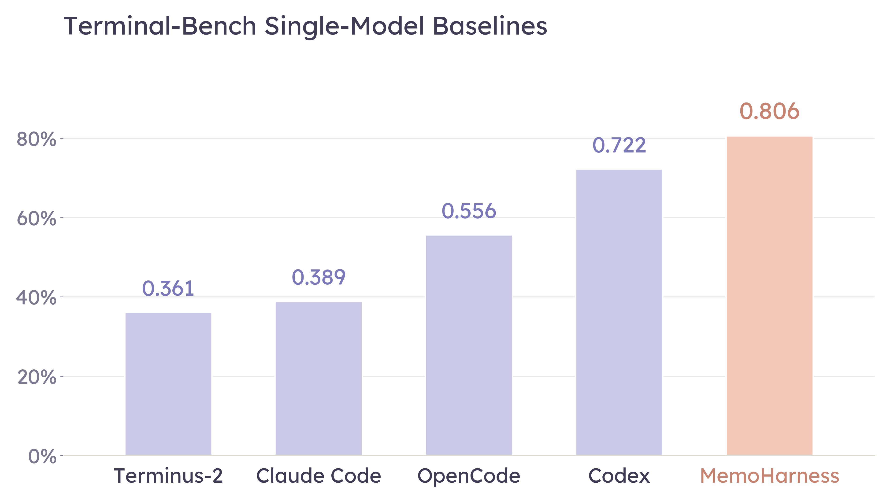
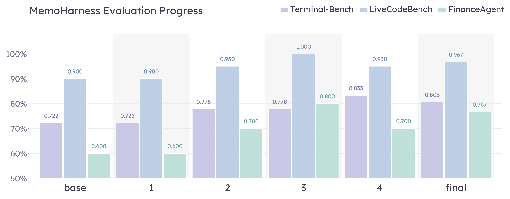
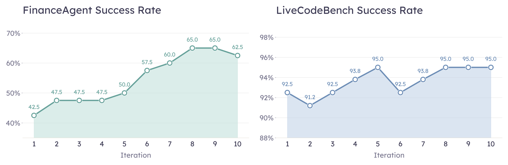

# MemoHarness 论文调研报告

> 论文：*MemoHarness: Agent Harnesses That Learn from Experience* (arXiv:2607.14159, 2026-07-14)
> 代码：[github.com/HowieHwong/MemoHarness](https://github.com/HowieHwong/MemoHarness)

---

## 📋 基本信息

<p align="center"><b>表1：论文基本信息</b></p>

| 项目 | 内容 |
|-----|------|
| 论文标题 | MemoHarness: Agent Harnesses That Learn from Experience |
| 作者 | Yue Huang, Wenjie Wang, Han Bao (共同一作 †), Yuchen Ma, Xiaonan Luo, Yi Nian, Haomin Zhuang, Zheyuan Liu, Yue Zhao, Xiangliang Zhang (通讯) |
| 所属机构 | University of Notre Dame (Xiangliang Zhang 通讯)、USC (Yi Nian / Yue Zhao)、LMU Munich (Yuchen Ma) 等 |
| 发表会议/期刊 | 预印本（under review），arXiv:2607.14159 [cs.AI; cs.CL] |
| 发表年份 | 2026（提交于 2026-07-14） |
| 论文链接 | https://arxiv.org/abs/2607.14159 |
| HTML 全文 | https://arxiv.org/html/2607.14159v1 |
| 项目主页 | 论文未提供独立主页，README 见代码仓库 |
| 代码仓库 | https://github.com/HowieHwong/MemoHarness |
| 许可证 | CC BY 4.0（论文）；代码仓库见仓库 LICENSE |
| 引用数 | 暂无统计（2026-07-19，发布不足一周） |

---

## 1. 研究背景与动机

### 1.1 问题定义

论文将 **agent harness（agent 控制层 / 外壳）** 定义为：把一个基础大模型 (base LLM) 转变成可执行 agent 的那层外围控制系统。它不负责模型本身的推理，但决定模型**看见什么、能调用什么、怎么调用、调用多久、中间状态怎么记忆、最终输出怎么验证和返回**，即管理六件事：

- context（上下文构造）
- tools / retrieval（工具与检索接口）
- orchestration（跨轮推理编排）
- memory（记忆保留）
- decoding（解码参数）
- output handling（输出后处理）

作者指出，实践表明：**同样的底座模型和工具集，harness 的设计差异能让端到端任务成功率相差几十个百分点**。因此 harness 是与模型权重同等重要、却长期被忽视的优化对象。

### 1.2 研究动机

论文同时点出 **三个具体痛点**：

1. **harness 是高维且耦合的**：改动检索（retrieval）会连带改变有用的 prompt 格式、解码预算、workflow 拓扑、memory 策略、validation 行为。把 harness 当作单一 opaque 对象来搜索，难以做诊断式改进。
2. **benchmark 分数对搜索而言是弱监督**：分数只告诉结果（成功/失败），却不告诉**哪个维度导致了失败、哪些经验该迁移到新案例**。
3. **测试时适配必须避免标签泄漏**：只能用可见输入 + 训练阶段积累的经验，要处理领域、歧义、推理深度、检索需求、输出格式各异的案例。

现有自动优化方法（OPRO、Promptbreeder、Self-Refine、Reflexion、DSPy、AFlow 等）大多只优化**单一 prompt 或单次流水线**这一更窄的产物，且优化是**预部署 (pre-deployment) 过程**；部署后的 agent 通常对**所有案例复用同一套全局 harness**，缺少针对每个具体测试案例的案例级适配。这正是 MemoHarness 要补的空白。

### 1.3 研究目标

让 harness 的搜索**既诊断又可复用**：

- 把单块 harness 分解为 **六个可编辑控制维度**，使搜索能在可分离的控制面上做结构化编辑；
- 用 **双层经验库** 累积每次执行的诊断条目与蒸馏出的全局模式，使搜索积累的是可复用的诊断知识，而非仅标量分数；
- 在测试时**无需标签、反馈、梯度更新或额外搜索轮次**，仅靠检索经验把搜索得到的全局 harness $W^*$ 适配成案例专属 $W(x_j)$。

---

## 2. 核心贡献

### 2.1 主要贡献

<p align="center"><b>表2：论文主要贡献</b></p>

| 编号 | 贡献描述 |
|-----|---------|
| C1 | **结构化 harness 优化框架**：把单块 agent harness 分解为六个可编辑控制面，配以双层经验库，使搜索累积可复用的诊断知识而非仅标量分数（§2.3、§2.4）。 |
| C2 | **测试时案例适配机制**：用检索到的成功案例、失败案例与全局模式，把搜索得到的全局 harness 适配到每个新案例，无需测试时反馈（§2.6）。 |
| C3 | **跨领域/跨模型实证**：在 in-domain、cross-dataset、cross-model 三类评估中，任务成功率提升、出现选择性正向迁移、被评测基础模型家族普遍受益，且在检索经验可缓存时成本表现良好（§3）。 |

### 2.2 创新点

1. **方法创新**：首次把 "harness 作为优化对象" 从预部署延伸到**部署时的逐案例适配**，且适配**不引入测试时反馈闭环**——这是与 Meta-Harness、AlphaEvolve 等 "搜索即优化" 路线的关键区别。
2. **技术创新**：双层经验库 $B_t = (E_t, G_t)$ 用 typed pair 而非 set union，因为 per-case 条目与 global pattern 的 schema 不同；控制器不直接读整个库，而是发出结构化 query $q \in Q$，取回有界切片 $S_t(q)$，使上下文预算不随库增长而膨胀。
3. **实验创新**：**正确性优先的字典序选择规则**（primary reward 决定排序，token 成本仅作 tiebreaker），从机制上防止搜索漂向 "便宜但错" 的配置；并提出 operation-level 诊断（Appendix G），把每个 shell 操作的首次出现与 reward 提升的关联量化。

---

## 3. 方法详解

### 3.1 方法概述

MemoHarness 把 "harness 学习" 拆成两个解耦的阶段：

- **阶段 A（训练时搜索）**：在标注搜索集 $D_{search}$ 上对六维 harness 空间 $\mathcal{W} = \prod_{d=1}^{6} \mathcal{W}^{(d)}$ 执行引导式搜索。每个候选 harness $W$ 在标注案例上执行，由**正确性优先奖励** $r_i(W)$ 打分、token 用量 $c_i(W)$ 作 tiebreaker；执行轨迹存入双层经验库 $B_t = (E_t, G_t)$；搜索策略 $\pi$ 基于经验库提议下一个 $W$。
- **阶段 B（测试时案例适配）**：对未标注测试案例 $x_j^{test}$，从冻结的经验库 $B_T$ 检索相似案例与相关模式，把全局 harness $W^*$ 映射为案例专属 $W(x_j)$ 并执行，产出预测 $\hat{y}_j$。

核心设计选择有三：六维 harness 空间、双层经验库、测试时案例适配。下面分层展开。

### 3.2 整体架构



*Figure 1: MemoHarness 整体架构。左半 Phase A 是训练时搜索：对六维控制层空间 $\mathcal{W}$ 做引导式搜索，每个候选 harness 在标注案例上执行，由正确性优先奖励 $r_i(W)$ 打分、token 用量 $c_i(W)$ 作平局决胜，结果轨迹写入双层经验库 $B_t = (E_t, G_t)$（底层 per-case 条目 + 上层蒸馏全局模式）。右半 Phase B 是测试时案例适配：对未标注案例 $x_j^{test}$ 检索相似案例与相关模式，把全局最优 harness $W^*$ 映射为案例专属 $W(x_j)$ 后执行。两阶段的关键解耦点在于——训练阶段找稳健全局 harness，测试阶段用经验库为每个案例特化该 harness：简单案例保持轻量，检索密集 / 多步推理 / 格式敏感的案例才按需调用更丰富的编排。*

**架构文字描述**：

- **主要模块**：(1) 六维 harness 空间 $\mathcal{W}$（D1–D6），是搜索与适配的共同操作对象；(2) 双层经验库 $B_t=(E_t,G_t)$，存储 per-case 执行条目 $\xi_i^{(t)}$ 与蒸馏全局模式；(3) 控制器 $\Pi$，训练时为 $\Pi_{train}$（基于检索切片提议下一个 $W_t$），测试时为 $\Pi_{test}$（基于检索证据生成 $W(x)$）；(4) 诊断算子 $g$，把执行轨迹映射为诊断信号 $z_i^{(t)}$；(5) 蒸馏算子 Distill，定期从失败簇提取全局模式写入 $G_t$。
- **数据流向**：训练时，控制器构造 query $q_t = Q(W_{t-1}, B_{t-1})$ → 检索切片 $S_{t-1}(q_t) = \text{Retrieve}(B_{t-1}, q_t)$ → 提议 $W_t = \Pi_{train}(W_{t-1}, S_{t-1})$ → 在 $D_{search}$ 上执行收集轨迹 $\tau_i(W_t)$ → 计算奖励 $r_i$、成本 $c_i$、诊断 $z_i^{(t)}$ → 写入 $E_t$；每 $N$ 轮把失败簇蒸馏进 $G_t$。测试时，对每个 $x$ 检索 $S_{test}(x) = (N_K^+(x), N_K^-(x), \text{Retrieve}(B_T, Q_{test}(x)), G_T)$ → 生成 $W(x) = \Pi_{test}(W^*, x, S_{test}(x))$ → 执行。
- **关键设计决策**：(a) 从**最小 harness $W_0$** 起步（无 demo、无结构化脚手架、无外部工具、单次确定性解码、无跨轮 memory、原始输出直传），确保最终配置的每一项都由搜索中积累的经验证据驱动；(b) **正确性优先**字典序选择 $W^* \in \arg\max_{lex} (\bar{r}_t, -\bar{c}_t)$，主指标优先、token 成本仅作 tiebreaker；(c) 训练阶段全局优化与测试阶段逐案例适配**严格分离**——避免用测试集标签泄漏。

### 3.3 核心算法

#### 3.3.1 形式化定义

**定义 2.1（Benchmark Cases）**：区分标注搜索集与未标注评估集。

$$D_{search} = \{x_i^s = (u_i, \phi_i, y_i^*)\}_{i=1}^{n}, \quad D_{test} = \{x_j^{test} = (u_j, \phi_j)\}_{j=1}^{m}$$

其中 $u$ 为输入指令，$\phi$ 为案例特征（领域、歧义、复杂度、是否需要外部知识），$y_i^*$ 仅供搜索期打分。测试时适配只能依赖 $(u_j, \phi_j)$ 与经验库，不能用未知参考输出 $y_j^*$。

**定义 2.2（Harness Configuration）**：对每个维度 $d \in \{1,\dots,6\}$，$\mathcal{W}^{(d)}$ 为该维度的可选项集合，harness 配置是乘积空间元素：

$$W \in \mathcal{W} = \mathcal{W}^{(1)} \times \mathcal{W}^{(2)} \times \dots \times \mathcal{W}^{(6)}, \quad W = (W^{(1)}, \dots, W^{(6)})$$

在 $W$ 下执行 $(u_i, \phi_i)$ 产出预测 $y_i(W)$，执行轨迹 $\tau_i(W) = (y_i(W), M_i(W), \kappa_i(W))$，其中 $M_i(W)$ 为调用的工具与中间输出，$\kappa_i(W) = (n_i^{call}(W), n_i^{tok}(W), \ell_i(W))$ 为调用数、token 用量、延迟。

- **搜索期次级成本**：$c_i(W) = n_i^{tok}(W)$（低为优）；调用数与延迟仅供诊断/报告，不参与选择。美元成本是离线从 token 数与公开价目表换算的，与搜索期选择分离。
- **搜索期任务奖励**：$r_i(W) = R(y_i(W), y_i^*)$（高为优）。
- **搜索问题**：从候选执行中找出强全局 harness $W^*$；**评估期问题**：为每个未标注案例构造专属 harness $W(x_j)$。

#### 3.3.2 训练时搜索与正确性优先选择

训练在 $D_{search}$ 上跑 $T$ 轮，从最小 harness $W_0$ 起步。每轮：

$$q_t = Q(W_{t-1}, B_{t-1}), \quad S_{t-1}(q_t) = \text{Retrieve}(B_{t-1}, q_t), \quad W_t = \Pi_{train}(W_{t-1}, S_{t-1}(q_t))$$

候选 $W_t$ 在每个搜索案例上执行收集轨迹、奖励、成本、诊断，全部写入 $E_t$；每 $N$ 轮把持续失败簇蒸馏进 $G_t$。对每个候选计算均值 $\bar{r}_t = \frac{1}{n}\sum_{i=1}^{n} r_i(W_t)$、$\bar{c}_t = \frac{1}{n}\sum_{i=1}^{n} c_i(W_t)$。设 $C_T = \{W_0,\dots,W_T\}$ 为已探索候选，若设成本预算则 $C_{feas} \subseteq C_T$，否则 $C_{feas} = C_T$。最终全局 harness 由**字典序**选择：

$$W^* \in \mathop{\arg\max}_{lex,\ W_t \in C_{feas}} (\bar{r}_t, -\bar{c}_t)$$

主奖励优先优化；token 用量仅在与最高主奖励打平时的候选间作次级 tiebreaker。

#### 3.3.3 算法逐步解读

<p align="center"><b>表3：训练时搜索算法步骤解读</b></p>

| 步骤 | 操作 | 输入 | 输出 | 设计意图 |
|-----|-----|-----|-----|---------|
| 1 | 初始化最小 harness $W_0$ | 空白配置 | $W_0$（无 demo/工具/memory/validator） | 确保最终每一项都由经验证据驱动，而非继承自次优默认值 |
| 2 | 构造查询 $q_t$ | $W_{t-1}, B_{t-1}$ | 结构化 query | 控制器按当前 harness + 库状态表达"想看哪类证据" |
| 3 | 检索有界切片 $S_{t-1}(q_t)$ | $q_t, B_{t-1}$ | 全局模式 + 过滤后条目 + 聚合统计 | 控制器上下文有界，库可无限增长 |
| 4 | 提议下一配置 $W_t$ | $W_{t-1}, S_{t-1}(q_t)$ | 新 harness | 基于检索证据做结构化编辑而非盲目变异 |
| 5 | 执行 + 诊断 | $W_t, D_{search}$ | 轨迹 $\tau_i$、奖励 $r_i$、成本 $c_i$、诊断 $z_i^{(t)}$ | 把执行证据组织成可检索经验，而非仅标量分数 |
| 6 | 写入经验库 | $\tau_i, z_i^{(t)}$ | $E_t$ 新增条目 + 统计更新 | 累积可复用诊断知识 |
| 7 | 定期蒸馏 | $E_{\le t}$ 中失败簇 | $G_t$ 新增全局模式 | 把反复出现的失败现象抽象成跨案例可迁移的修复建议 |
| 8 | 字典序选 $W^*$ | 全部候选 $C_T$ | 全局最优 harness | 正确性优先，防止漂向"便宜但错"的配置 |

### 3.4 关键模块详解

#### 模块 A：六维 harness 空间（§2.3）

- **功能**：把单块 harness 按推理时间流分解为六个可独立编辑的功能维度，使搜索能对具体控制"开关"做针对性编辑和诊断，并让跨维度交互显式化。
- **设计依据**：每个维度对应推理信息流的一个独立功能阶段。

<p align="center"><b>表4：MemoHarness harness 空间的六个维度</b></p>

| 维度 | 阶段 | 定义 | 示例操作 |
|------|------|------|---------|
| **D1 Context**（上下文装配） | 调用前输入构造（assembly） | 从指令、约束、检索材料、示例构建模型输入 | 结构化 prompt；加 demo；压缩 context |
| **D2 Tool**（工具交互） | 外部工具与检索使用（interaction） | 控制何时、如何调用外部工具或检索器 | 启用检索；设 top-k；重排证据 |
| **D3 Generation**（生成控制） | 解码配置（control） | 设定采样本与预算参数 | 提高 max_tokens；降 temperature；采样多候选 |
| **D4 Orchestration**（编排） | workflow 拓扑 | 选择模型调用序列与中间推理步骤 | 单次调用 → 规划/执行/精炼 |
| **D5 Memory**（记忆管理） | 跨调用状态持久化（management） | 决定哪些状态跨调用保留、哪些过时上下文被移除 | 保留状态；总结 trace；丢弃过时上下文 |
| **D6 Output**（输出处理） | 调用后输出处理（processing） | 把原始模型输出转换为 harness 返回的最终答案 | 提取答案；校验 schema；选择回退 |

- **与论文其他部分的关系**：D1–D6 既是搜索空间（§2.3）、也是经验库中诊断信号 $z_i^{(t)}$ 的 primary/secondary 失败维度取值域 $\{1,\dots,6\}$（§2.4）、还是测试时适配 $\Pi_{test}$ 的编辑目标。

#### 模块 B：双层经验库（§2.4）

- **功能**：用 typed pair $B_t = (E_t, G_t)$ 累积 per-case 执行条目与蒸馏全局模式。用 pair 而非 set union，因为条目与模式 schema 不同。
- **Per-case 经验**：对每个搜索案例每轮存一条执行条目：

$$\xi_i^{(t)} = (i, t, \phi_i, W_t, \Delta_i^{(t)}, \tau_i(W_t), r_i(W_t), c_i(W_t), z_i^{(t)})$$

其中 $\Delta_i^{(t)} = \Delta(W_t, W_i^{\lt t})$ 是相对"案例 $i$ 上最近一次所用 harness"的配置 delta；$z_i^{(t)}$ 由诊断算子 $g$ 产出。

- **诊断算子与输出 schema**：

$$z_i^{(t)} = g(x_i^s, W_t, \tau_i(W_t), r_i(W_t)), \quad z_i^{(t)} = (s_i^{(t)}, d_{i,prim}^{(t)}, D_{i,sec}^{(t)}, a_i^{(t)})$$

$$s_i^{(t)} \in \{0,1\}\text{（成功标记）}, \quad d_{i,prim}^{(t)} \in \{1,\dots,6\} \cup \{\emptyset\}\text{（主失败维度）}, \quad D_{i,sec}^{(t)}\text{（次要贡献维度）}, \quad a_i^{(t)}\text{（自然语言分析）}$$

还维护轻量 per-case 统计：连续失败数、近期平均奖励、奖励趋势、维度级失败计数。

- **全局模式与检索**：每 $N$ 轮蒸馏算子从失败簇提取持续跨案例规律：$G_t \leftarrow G_{t-1} \cup \text{Distill}(E_{\le t})$。控制器不直接读整个库，而是发结构化 query $q \in Q$（覆盖案例特征、失败统计、迭代区间、维度级诊断），取回有界切片：

$$S_t(q) = \text{Retrieve}(B_t, q)$$

切片可含全局模式、过滤后 per-case 条目、聚合统计，使控制器上下文有界。

- **与论文其他部分的关系**：经验库是搜索（§2.5）与测试时适配（§2.6）共享的"记忆"；诊断信号 $z$ 是把"分数"升级为"哪个维度失败"的关键，使搜索能做诊断式而非盲目的改进。

#### 模块 C：测试时案例适配（无反馈，§2.6）

- **功能**：训练后进入评估，对每个未见案例 $x=(u,\phi)$ 用冻结经验库 $B_T$ 把 $W^*$ 适配成 $W(x)$，**全程无迭代反馈闭环**。
- **核心公式**：

指令表示 $\psi(u)$；历史条目 $\xi$ 关联指令 $u_\xi$；相似度 $\rho_\psi(x,\xi) = \cos(\psi(u), \psi(u_\xi))$。把历史条目按成败分桶：

$$E_T^+ = \{\xi \in E_T : s(\xi)=1\}, \quad E_T^- = \{\xi \in E_T : s(\xi)=0\}$$

检索最近邻：

$$N_K^+(x) = \text{TopK}_{\xi \in E_T^+}[\rho_\psi(x,\xi)], \quad N_K^-(x) = \text{TopK}_{\xi \in E_T^-}[\rho_\psi(x,\xi)]$$

测试时证据 $S_{test}(x) = (N_K^+(x), N_K^-(x), \text{Retrieve}(B_T, Q_{test}(x)), G_T)$，案例专属 harness：

$$W(x) = \Pi_{test}(W^*, x, S_{test}(x))$$

若评估标签后续可得，轨迹可**可选**地追加进经验库供未来复用，但当前评估期间不触发任何学习、重选或蒸馏。

- **与全局搜索的关系**：关键区分是**全局优化与实例级适配的分离**——训练在正确性优先选择下找稳健全局 harness；评估用经验库把该 harness 按案例特化。简单案例保持轻量；检索密集、多步、格式敏感的案例只在检索证据支持时才调用更丰富编排。

### 3.5 关键技术

<p align="center"><b>表5：关键技术点</b></p>

| 技术点 | 描述 | 作用 | 论文对应位置 |
|-------|-----|-----|------------|
| 六维分解 | 按推理时间流拆 harness 为 D1–D6 | 使搜索可对独立控制面做诊断式编辑 | §2.3 |
| 双层经验库 $B_t=(E_t,G_t)$ | typed pair 存 per-case 条目 + 全局模式 | 累积可复用诊断知识，控制器上下文有界 | §2.4 |
| 诊断算子 $g$ | 把轨迹映射为 (成功标记, 主失败维度, 次要维度, NL 分析) | 把弱分数监督升级为维度级失败归因 | §2.4 |
| 双触发蒸馏 | 固定每 $N$ 轮 + 同案例连续失败 $M$ 次触发 | 既捕获持续失败又控制蒸馏频率 | §2.4 / Appendix C |
| 字典序正确性优先选择 | $W^* = \arg\max_{lex}(\bar{r}, -\bar{c})$ | 防止漂向"便宜但错"的配置 | §2.5 |
| 测试时无反馈适配 | 检索相似成功/失败案例 + 全局模式生成 $W(x)$ | 案例级特化且不泄漏测试标签 | §2.6 |
| 渐进松弛检索 | 检索请求从严格特征过滤逐级放宽 | 在库稀疏时也能取回有用证据 | §2.4 / 代码 |
| Operation-level 诊断 | 统计每个 shell 操作首次出现与 reward 提升的关联 | 为搜索策略提供操作级偏置信号 | Appendix G |

### 3.6 方法设计的关键洞察

1. **洞察 1：分数是弱监督，诊断才是可迁移知识**。benchmark 分数只说成败，不说哪个维度该负责、哪些经验该迁移到新案例。MemoHarness 用诊断算子把执行证据组织成 $z_i^{(t)} = (s, d_{prim}, D_{sec}, a)$，让经验库存的不是"分数"而是"哪个维度失败、为什么"。Operation-level 分析（Appendix G）能成立，正是因为经验库存了 per-case 轨迹而非仅标量。
2. **洞察 2：全局最优不等于每个案例最优**。一个在平均水平上很强的 harness 完全可能在某类案例上系统性失配。把"找全局 $W^*$" 与 "为每个案例生成 $W(x)$" 解耦，是兼顾稳健性与案例针对性的关键。
3. **洞察 3：从最小 harness 起步**。$W_0$ 把 demo/工具/memory/validator 全关掉，迫使每一项最终配置都由经验证据支撑，避免继承次优默认值——这是"可解释性优先于便利性"的设计取向。

### 3.7 与现有方法的核心区别

<p align="center"><b>表6：与现有方法的对比</b></p>

| 环节 | 现有方法做法 | 本文做法 | 改变原因 |
|-----|------------|---------|---------|
| 优化对象 | OPRO/Promptbreeder/ProTeGi 优化单条 prompt；DSPy/MIPRO 优化模块化 pipeline；AFlow/AutoFlow 优化 workflow | 优化**整层 harness** 的六个控制维度 | harness 是高维耦合体，prompt-only 优化覆盖不到工具/编排/memory/输出处理 |
| 优化时机 | 多为预部署 (pre-deployment) | 预部署搜索 + **部署时逐案例适配** | 部署后案例千差万别，全局 harness 在特定案例上系统性失配 |
| 经验积累 | 多数方法只记标量分数 | 双层经验库存 per-case 诊断 + 蒸馏全局模式 | 分数不可迁移，诊断才可复用 |
| 测试时行为 | 用同一全局配置跑所有案例 | 检索经验生成案例专属 $W(x)$，无测试时反馈 | 案例针对性 + 防标签泄漏 |
| 与 Meta-Harness 的区别 | Meta-Harness 把 harness 代码作为搜索对象（预部署） | 增加**经验库 + 测试时案例适配** | Meta-Harness 无公开实现适合作直接 baseline，且未做案例级适配 |

---

## 4. 代码实现分析

### 4.1 代码仓库概述

<p align="center"><b>表7：代码仓库信息</b></p>

| 项目 | 内容 |
|-----|------|
| 仓库地址 | https://github.com/HowieHwong/MemoHarness |
| 主要语言 | Python 3.10+ |
| 代码行数 | src/memoharness 核心约数千行（loop.py 单文件 5801 行，含 Harbor/Daytona 运行时基础设施） |
| 开源时间 | 2026-07（与论文同月，README 在调研期间仍持续更新） |
| 依赖管理 | pyproject.toml（`pip install -e .`），依赖 Harbor + Daytona 运行时 + openai |
| 运行时栈 | Harbor（agent 评测框架）+ Daytona（云沙箱）+ Codex CLI（控制器）|
| 控制器实现 | 默认 `controller: codex`（用 Codex CLI 作 $\Pi_{train}/\Pi_{test}$），同时提供 `LLMController` 备选 |

### 4.2 目录结构

```
MemoHarness/
├── README.md
├── pyproject.toml
├── configs/
│   ├── experiment.json              # 统一运行时配置（providers/models/experiment/harness）
│   ├── harness_terminal.json/.py    # live harness（每轮被读写）
│   └── harness_codex/               # Codex bundle（w0 最小配置）
│       ├── policy.json              # D1-D6 最小 harness（对应论文 W_0）
│       ├── AGENTS.override.md       # 文本脚手架
│       └── .memoharness/             # memory.md + playbook.md（持久记忆）
├── images/                          # README 资产（method.png / result.png）
├── scripts/                         # Daytona 沙箱管理 + 评测自动化
└── src/memoharness/
    ├── core/models.py               # 全部数据结构（HarnessConfig/PerCaseEntry/GlobalPattern...）
    ├── bank/experience.py           # 双层经验库 ExperienceBank
    ├── controllers/
    │   ├── llm_controller.py        # LLMController（Π_train / Π_test 适配）
    │   └── codex_bundle.py          # Codex bundle 控制器
    ├── llm/
    │   ├── distiller.py             # LLMDistiller（全局模式蒸馏 Distill）
    │   ├── embedder.py              # OpenAIEmbedder（相似度检索）
    │   ├── client.py / retry.py     # OpenAI 客户端 + 重试
    ├── harbor/
    │   ├── loop.py                  # HarborTrainingLoop（训练/评估主循环）
    │   ├── codex_agent.py / agent.py # Harbor agent 实现
    │   └── daytona_scheduler.py     # Daytona 沙箱调度
    ├── runtime/codex_bundle.py     # bundle 读写
    ├── config/runtime.py            # MemoHarnessRuntimeConfig
    └── cli.py / __main__.py         # CLI 入口
```

### 4.3 核心模块分析

#### 4.3.1 核心数据结构

`core/models.py` 完整定义了论文 §2.2–2.4 的所有数据结构。关键类：

```python
# 论文 Definition 2.2：harness 配置 = 六维乘积空间元素
@dataclass
class HarnessConfig:
    D1: dict[str, Any] = field(default_factory=dict)   # Context
    D2: dict[str, Any] = field(default_factory=dict)   # Tool
    D3: dict[str, Any] = field(default_factory=dict)   # Generation
    D4: dict[str, Any] = field(default_factory=dict)   # Orchestration
    D5: dict[str, Any] = field(default_factory=dict)   # Memory
    D6: dict[str, Any] = field(default_factory=dict)   # Output
    def delta_from(self, previous) -> dict[...]: ...    # 论文 Δ_i^(t) 配置 delta
    # 论文 §2.4：per-case 执行条目 ξ_i^(t)
@dataclass
class PerCaseEntry:
    case_id: str
    iteration: int
    case_features: CaseFeatures           # φ_i
    config: HarnessConfig                 # W_t
    delta_from_prev: dict                 # Δ_i^(t)
    trajectory: Trajectory                # τ_i(W_t)，含 num_llm_calls/total_tokens/latency
    primary_reward: float                # r_i(W_t)
    cost_actual: float                   # c_i(W_t)
    diagnosis: Diagnosis                 # z_i^(t) = (success, analysis, DiagnosticSignal)
# 论文 §2.4：诊断信号 z_i^(t) 的 schema
@dataclass
class Diagnosis:
    success: bool                          # s_i^(t)
    analysis: str                          # a_i^(t)
    diagnostic_signal: DiagnosticSignal    # (primary_dim, secondary_dims) = (d_prim, D_sec)
# 论文 §2.4：全局模式 G_t 条目
@dataclass
class GlobalPattern:
    pattern_id: str
    iteration_range: tuple[int, int]
    description: str                       # 反复出现的现象
    evidence: list[str]                    # 支持证据（案例 id）
    effect: str                            # 期望的修复效果
    primary_dim: DimensionName             # 锚定的失败维度
```

`make_minimal_config()` 函数精确实现了论文 §2.5 的最小 harness $W_0$：D1 关 examples/structured_instruction、D2 tool_access=disabled/top_k=0、D3 temperature=0.0/max_tokens=256/candidate_count=1、D4 workflow=single_call/stop_rule=immediate、D5 memory_policy=disabled/history_keep=0、D6 postprocess=raw_passthrough/validator=disabled/fallback=none。`configs/harness_codex/policy.json` 也以 JSON 形式落盘了同一个 $W_0$。

#### 4.3.2 核心算法实现

**双层经验库**（`bank/experience.py` 的 `ExperienceBank`）：

- `add_entry(entry)`：写入 per-case 条目，更新 case_stats 与 dim/cluster 索引；返回是否触发蒸馏（对应论文双触发——连续失败触发）。关键代码：

```python
def add_entry(self, entry: PerCaseEntry) -> bool:
    self.entries.append(entry)
    self.case_stats.setdefault(entry.case_id, CaseStats()).update(entry)
    self.dim_index[entry.diagnosis.diagnostic_signal.primary_dim].add(entry.case_id)
    self.last_distill_entry_count += 1
    return self._check_consecutive_failure_trigger(entry.case_id)  # 连续失败触发
```

- `distill_global_patterns(...)`：实现论文 $G_t \leftarrow G_{t-1} \cup \text{Distill}(E_{\le t})$——收集 consecutive_failures >= 阈值的案例，按 primary_dim 分组，对每组用 `_build_pattern_description`/`_build_pattern_effect`/`_suggest_dim_action` 生成描述、证据、维度级修复建议（如 D1 建议 "enable structured_instruction"、D2 建议 "enable retrieval or increase top_k"、D4 建议 "plan_execute_refine"）。还提供 `distill_global_patterns_llm(distiller)` 走 LLM 蒸馏。
- `retrieve_similar_cases(instruction, top_k_success, top_k_failure)`：实现论文 §2.6 的 $N_K^+(x)/N_K^-(x)$——按 $\rho_\psi = \cos(\psi(u), \psi(u_\xi))$ 排序，分成功/失败两桶各取 TopK。
- `retrieve_feature_matched_slice_for_case(case)`：实现**渐进松弛检索**——构造从严格特征过滤（domain + requires_external_knowledge + complexity $\pm 0.25$ + ambiguity $\pm 0.25$ + input_length $\pm 50\%$ + cluster_id）到逐级放宽的 5 个候选 RetrievalRequest，命中即返回，保证库稀疏时也能取回有用证据。

**LLM 控制器**（`controllers/llm_controller.py` 的 `LLMController`）：

- `decide_next_harness(...)`：实现论文 §2.5 的 $W_t = \Pi_{train}(W_{t-1}, S_{t-1})$——构造含 `_HARNESS_INTERFACE_DOC` + `_DIMENSIONS_DOC` + `_DIMENSION_ACTION_PLAYBOOK_DOC` + `_build_bank_summary`（总体统计 + 持续失败案例 + 全局模式三段） + `_build_change_outcome_signals`（per-case 配置 delta 与 reward 关联）的 prompt，让 LLM 重写 HarnessImpl 并返回 `<config>` JSON。失败时回退到当前 code（不丢进度）。
- `adapt_for_case(bank, case, base_config)`：实现论文 §2.6 的 $W(x) = \Pi_{test}(W^*, x, S_{test}(x))$——构造含 target case 特征 + base 维度摘要 + `_build_test_time_evidence_summary`（结构化 query + 检索切片 + 最近成功/失败邻域）的 prompt，让 LLM 只在检索证据支持时调整维度，返回 `<config>` JSON。`_CONFIG_ONLY_DOC` 约束 LLM 只返回变化维度的简洁 JSON。
- `stabilize_config(config)`：把摘要 config 对齐到稳定 harness 模板的实际行为（如 D2 tool_access=bash、D4 workflow=agentic_loop、D5 history_keep=12、D6 validator=workspace_checks），使摘要与渲染出的 HarnessImpl 保持同步。
- `_render_harness_code(config)`：把 config 渲染成可执行的 `HarnessImpl` Python 源码（含 bootstrap workspace 探测、sliding-window 12 轮、native/bash_tags 工具协议、populate_context 输出收集等），即论文 Appendix B 所述的 "harness bundle"。

**全局模式蒸馏**（`llm/distiller.py` 的 `LLMDistiller`）：

- `distill(bank, current_iteration)`：实现论文 Distill 算子——`_collect_failing_cases` 取 consecutive_failures >= 阈值的 TopK 案例，`_build_prompt` 汇总每案例 domain/连续失败数/reward 趋势/维度失败计数/最近 3 条 history + config 快照，要求 LLM 输出 JSON 数组（每条 pattern 须跨 2 个或以上案例、指向具体维度 D1–D6、含可执行建议）；`_parse_patterns` 解析并 cap 到 `max_patterns`（对应论文 "Capping newly emitted patterns per round keeps the controller's prompt budget bounded"）。

**训练/评估主循环**（`harbor/loop.py` 的 `HarborTrainingLoop`）：

- `run(iterations, eval_after_train)`：实现论文 §2.5 训练循环——`_setup()` + `_split_tasks()`（80/20 划分，seed=42）后，每轮 `_collect_results_with_daytona_retries` 跑当前 HarnessImpl → `_filter_learning_results`（过滤 external blocker）→ 算 mean_reward/total_tokens/perfect_success_count → `_update_bank` 写入 per-case 条目 → `should_distill(distill_every)` 命中则 `_distill` + `mark_distill_done` → `_update_config` 让控制器提议下一 $W_t$。训练结束后 `_select_best_harness` 选 $W^*$。
- `_run_test_evaluation_with_case_adaptation(...)`：实现论文 §2.6——`test_time_case_adaptation=True` 时，对每个测试案例调 `_adapt_eval_config_for_case`（构造 CaseFeatures + 调 `controller.adapt_for_case`）生成 $W(x)$，再 `_apply_eval_config` 应用、跑该案例、汇总；finally 块恢复 base harness（防止案例间污染）。
- `_select_best_harness(iter_rewards, iter_perfect_success_counts, iter_total_tokens)`：实现论文字典序选择——`best_harness_selection_modes` 默认 `["mean_reward", "perfect_success_count"]`，primary mode 选出 $W^*$ 后 `_apply_best_harness_selection` 恢复该 iteration 的 harness 归档，并落盘 summary JSON。

#### 4.3.3 代码设计图

以下五幅 Mermaid 设计图从系统分层、模块依赖、训练流程、测试时适配、数据结构关系五个视角勾勒 MemoHarness 代码实现的全貌，与论文 §2 的公式和 §4.5 的论文-代码映射表互为参照。



*MemoHarness 系统分层架构图。系统自上而下分为五个层次：Phase A 训练时搜索层（`HarborTrainingLoop.run` 驱动搜索循环，`_collect_results_with_daytona_retries` 采集结果，训练结束 `_select_best_harness` 选 $W^*$）、经验库层（`ExperienceBank` 持有 per-case 条目 $E_t$、全局模式 $G_t$、以及 case_stats/dim_index/cluster_index 三套索引）、控制器层（`decide_next_harness` 作 $\Pi_{train}$、`adapt_for_case` 作 $\Pi_{test}$、`LLMDistiller.distill` 作 Distill 算子、`OpenAIEmbedder` 提供 cosine 相似度）、执行层（Harbor 子进程跑 CodexAgent + Daytona 云沙箱）、数据模型层（`HarnessConfig`/`PerCaseEntry`/`GlobalPattern`/`make_minimal_config`）。关键数据流：搜索循环发 query $q_t$ → 经验库返回检索切片 $S_t$ → 控制器提议 $W_t$ → 执行层跑出 result.json → 结果回写经验库。值得注意的设计决策是把"训练时全局优化"（上）与"测试时逐案例适配"（右侧 C2 旁路）解耦，且经验库作为唯一共享记忆横跨两阶段。*



*模块依赖关系图。以 `core/models.py` 和 `harbor/loop.py` 为两个核心枢纽（橙色）：`core/models.py` 被几乎所有业务模块依赖（bank/controllers/llm 都要引用数据结构），是数据本体；`harbor/loop.py` 反向依赖 bank/controllers/runtime/config/scheduler，是训练评估主循环的编排中枢。叶子节点（蓝色）包括 `cli`（仅依赖 config 与 loop 入口）、`retry`（纯工具，无依赖）、`embedder`/`scheduler`/`agent`（被上层调用，自身只依赖 config/runtime）。关键发现：依赖关系呈单向无环——controllers 依赖 bank 与 core，但 bank 不反向依赖 controllers，使经验库可独立测试；`harbor/loop.py` 集中了最多入边（7 个依赖），印证其 5801 行的"胶水代码"职责；`config/runtime.py` 是配置枢纽，被多个模块读取。无循环依赖，代码组织合理。*



*训练时搜索核心流程图（Phase A 单轮迭代）。每轮从执行当前 HarnessImpl 开始，经结果采集→过滤 external blocker→算统计量→写入经验库四步，然后进入双触发蒸馏判断：任一案例连续失败 N=3 次 或 新增条目累计 M=5 条（取先达者），就触发 `LLMDistiller.distill` 从失败簇蒸馏 GlobalPattern 并 `mark_distill_done` 重置计数。无论是否蒸馏，都进入控制器 `decide_next_harness`：基于检索切片 $S_{t-1}(q_t)$ 提议下一配置 $W_t = \Pi_{train}(W_{t-1}, S_{t-1})$。若 $t < T$ 则回到执行步进入下一轮；否则进入 `_select_best_harness` 做字典序选择 $\arg\max_{lex}(\bar{r}, -\bar{c})$ 输出全局最优 $W^*$。关键决策点有二：(1) 双触发蒸馏既保证持续失败被及时抽象成模式，又控制蒸馏频率不过载；(2) 字典序选择让正确性绝对优先、token 成本仅作 tiebreaker，从机制上防"便宜但错"漂移。双触发与字典序选择正是论文 Appendix C 与 §2.5 在代码中的精确落点。*



*测试时案例适配流程图（Phase B 逐案例）。对每个未标注测试案例 $x=(u,\phi)$，并行展开三条检索路径：(1) `retrieve_similar_cases_for_case` 按 cosine 相似度取成功/失败邻域 $N_K^+/N_K^-$；(2) `retrieve_feature_matched_slice_for_case` 用 5 级渐进松弛特征过滤（从严格 domain+complexity+ambiguity+cluster_id 逐级放宽到仅 domain）保证库稀疏时也能取回证据；(3) `Q_test(x)` 构造结构化 query 走通用 `Retrieve`。三者加上冻结的全局模式 $G_T$ 汇成测试时证据 $S_{test}(x)$（绿色冻结节点，强调全程不触发学习）。控制器 `adapt_for_case` 在 $S_{test}(x)$ 条件下从 $W^*$ 生成 $W(x) = \Pi_{test}(W^*, x, S_{test}(x))$，应用后跑该案例、结果汇总，finally 块恢复 base harness 防止案例间污染。关键设计点：整个过程**无迭代反馈闭环**——检索证据是冻结的，控制器只生成一次 $W(x)$，不触发学习/重选/蒸馏，与论文 §2.6 "test-time adaptation operates without any iterative feedback loop" 严格对应。*



*核心数据结构关系图。`PerCaseEntry`（论文 $\xi_i^{(t)}$）是经验库的原子单元，由组合关系聚合了四个对象：`CaseFeatures`（案例特征 $\phi_i$，含 domain/complexity/ambiguity/requires_external_knowledge）、`HarnessConfig`（六维配置 $W_t$）、`Trajectory`（执行轨迹 $\tau$，含 num_llm_calls/total_tokens/latency/tools_invoked）、`Diagnosis`（诊断信号 $z$，组合 `DiagnosticSignal` 携带 primary_dim 与 secondary_dims）。`GlobalPattern`（论文 $G_t$ 条目）持有 description/evidence/effect/primary_dim/iteration_range，是蒸馏产物。`ExperienceBank` 用聚合关系（空心菱形）持有三类集合：entries（$E_t$）、global_patterns（$G_t$）、case_stats（per-case 统计，由 `CaseStats` 接收 `PerCaseEntry` 增量更新）。值得注意的设计决策：(1) `Diagnosis` 与 `DiagnosticSignal` 的嵌套组合精确实现论文 $z_i^{(t)}=(s, d_{prim}, D_{sec}, a)$ 的四元组 schema，使诊断信号成为一等数据而非字符串；(2) `HarnessConfig.delta_from(prev)` 把"配置变更"也做成一等方法，支撑经验库存 $\Delta_i^{(t)}$ 与控制器 `_build_change_outcome_signals` 的变更-奖励关联分析（Appendix G 的 operation-level 诊断正是基于此）；(3) `ExperienceBank` 同时持有 per-case 条目与全局模式（typed pair 而非 set union），呼应论文"entries and patterns have different schemas"的设计理由。*

### 4.4 配置参数详解

<p align="center"><b>表8：配置参数说明（configs/experiment.json）</b></p>

| 参数 | 默认值 | 说明 | 论文对应 |
|-----|-------|------|---------|
| `active_model` | gpt-5.3-codex | harness 搜索的源模型 | §3.1、Table 5 |
| `experiment.iterations` | 20（harness.iterations=8） | 外层搜索轮数 $T$ | Appendix C "T=10 outer iterations" |
| `experiment.distill_every` | 5 | 每 N 条新条目触发蒸馏（对应论文 $M=5$） | Appendix C 双触发之一 |
| `experiment.min_consecutive_failures` | 3 | 同案例连续失败 N 次触发蒸馏（对应论文 $N=3$） | Appendix C 双触发之二 |
| `experiment.train_split` | 0.8 | 8:2 train/eval 划分 | §3.1 "80/20 split" |
| `experiment.seed` | 42 | 划分随机种子 | Appendix C "seed 42" |
| `experiment.n_concurrent` | 3 | Harbor 并发 trial 数 | 运行时参数 |
| `harness.tool_protocol` | bash_tags | 工具调用协议（native / bash_tags） | Appendix B 实现细节 |
| `harness.agent_runtime` | harbor_codex | agent 运行时模式 | README badges |
| `harness.codex_bundle_init_mode` | w0 | 从最小 harness 起步 | §2.5 "minimal harness W_0" |
| `harness.controller` | codex | 控制器实现（Codex CLI 作 $\Pi$） | Appendix B |
| `harness.best_harness_selection_modes` | [mean_reward, perfect_success_count] | $W^*$ 选择模式（主=mean_reward） | §2.5 字典序选择 |
| `harness.test_time_case_adaptation` | true | 启用测试时案例适配 | §2.6 |
| `harness.primary_metric` | accuracy | 主奖励度量 | §2.2 RewardConfig |
| `harness.judge_model` | gpt-4.1-mini | LLM judge 评分模型 | Appendix C |
| `harness.scorer / embedder / diagnostics` | llm_judge / openai / llm | 评分/嵌入/诊断后端 | §2.4 |

### 4.5 论文-代码对应关系

<p align="center"><b>表9：论文概念与代码实现的对应关系</b></p>

| 论文概念 | 代码实现 | 文件位置 |
|---------|---------|---------|
| harness 六维空间 $\mathcal{W}^{(1..6)}$ | `HarnessConfig` 的 D1–D6 字段 + `DIMENSIONS` 常量 | `core/models.py:9,19,44` |
| 最小 harness $W_0$ | `make_minimal_config()` + `configs/harness_codex/policy.json` | `core/models.py:280` |
| 案例特征 $\phi_i$ | `CaseFeatures` (domain/complexity/ambiguity/requires_external_knowledge...) | `core/models.py:23` |
| 执行轨迹 $\tau_i(W)$ | `Trajectory` (num_llm_calls/total_tokens/latency/tools_invoked/...) | `core/models.py:88` |
| per-case 条目 $\xi_i^{(t)}$ | `PerCaseEntry` (含 delta_from_prev/trajectory/diagnosis) | `core/models.py:118` |
| 配置 delta $\Delta_i^{(t)}$ | `HarnessConfig.delta_from(previous)` | `core/models.py:69` |
| 诊断信号 $z_i^{(t)}=(s,d_{prim},D_{sec},a)$ | `Diagnosis` + `DiagnosticSignal` | `core/models.py:105,111` |
| 双层经验库 $B_t=(E_t,G_t)$ | `ExperienceBank` (entries/case_stats/global_patterns) | `bank/experience.py:32` |
| 蒸馏 Distill | `distill_global_patterns` / `LLMDistiller.distill` | `bank/experience.py:329` / `llm/distiller.py:71` |
| 双触发蒸馏 ($M=5$/$N=3$) | `should_distill(every_n_entries)` + `_check_consecutive_failure_trigger` | `bank/experience.py:129,145` |
| 检索切片 $S_t(q)=\text{Retrieve}(B_t,q)$ | `retrieve(request)` + `_matches_request` | `bank/experience.py:161` |
| 相似案例邻域 $N_K^+/N_K^-$ | `retrieve_similar_cases_for_case` (按 cosine 排序分桶) | `bank/experience.py:196` |
| 渐进松弛检索 | `retrieve_feature_matched_slice_for_case`（5 级候选请求） | `bank/experience.py:211` |
| 控制器 $\Pi_{train}$ | `LLMController.decide_next_harness` | `controllers/llm_controller.py:192` |
| 控制器 $\Pi_{test}$ | `LLMController.adapt_for_case` | `controllers/llm_controller.py:277` |
| 字典序选择 $W^*=\arg\max_{lex}(\bar{r},-\bar{c})$ | `_select_best_harness` + `_build_best_harness_selections` | `harbor/loop.py:5564` |
| 测试时逐案例适配 | `_run_test_evaluation_with_case_adaptation` + `_adapt_eval_config_for_case` | `harbor/loop.py:2759,2847` |
| harness bundle（D1-D6 摘要 + 文本脚手架 + memory + playbook） | `configs/harness_codex/` 下 policy.json + AGENTS.override.md + .memoharness/ | `runtime/codex_bundle.py`、`configs/harness_codex/` |

### 4.6 代码质量评估

<p align="center"><b>表10：代码质量评估</b></p>

| 维度 | 评分 | 说明 |
|-----|------|------|
| 模块化 | ⭐⭐⭐⭐ | bank/controllers/llm/harbor/core 分层清晰，数据结构集中在 `core/models.py`，控制器与经验库解耦可独立测试。`harbor/loop.py` 单文件 5801 行偏大，但承担 Harbor+Daytona 运行时胶水代码职责，可理解。 |
| 可配置性 | ⭐⭐⭐⭐⭐ | 几乎所有论文超参数（T/distill_every/min_consecutive_failures/train_split/seed/selection_modes/test_time_adaptation）都通过 `experiment.json` 暴露；controller 可在 codex/llm 间切换；model registry 覆盖论文 Table 5 全部 7 个模型。 |
| 可扩展性 | ⭐⭐⭐⭐ | `EmbedFn`/`SimilarityFn` 可注入自定义嵌入；`LLMController` 与 `CodexBundleController` 走同一 `decide_next_*`/`adapt_for_case` 接口；蒸馏有启发式与 LLM 两条路径。新增维度需改 `DIMENSIONS` 常量与 HarnessConfig 字段。 |
| 文档 | ⭐⭐⭐⭐ | README 含 Method/D1-D6 表/Quick Start/Repo Layout；每个核心类有 docstring 说明论文对应；缺完整 API 参考与架构图（本报告补 Mermaid 图）。 |
| 测试 | ⭐⭐⭐ | 仓库未见独立 tests/ 目录；`should_normalize_harness` 等做结构校验，`_call_llm_for_harness` 保留 "Backwards-compatible parser retained for tests"。论文 Appendix A 也承认 "reference implementation instantiates the controller and diagnostic operators with practical heuristics"。 |
| 可复现性 | ⭐⭐⭐⭐ | 配置齐全（seed=42、8:2 划分、deterministic decoding）；但强依赖 Harbor+Daytona 云沙箱 + GPT-5.3-Codex API key，复现成本高。 |

### 4.7 复现指南

```bash
# 1. 环境准备
conda create -n harness python=3.11 -y
conda activate harness
git clone https://github.com/HowieHwong/MemoHarness.git
cd MemoHarness
pip install -e .
pip install -e ".[openai]"
pip install harbor daytona openai

# 2. 配置 configs/experiment.json
#    - providers: 填 OpenAI / OpenRouter API key
#    - models: 确认 active_model (默认 gpt-5.3-codex)
#    - experiment: 调 dataset / iterations / distill_every / train_split / seed
#    - daytona.api_keys: 填 Daytona 沙箱 key（Terminal-Bench 需要云沙箱）

# 3. 训练（训练时搜索 + 经验库积累）
memoharness --config configs/experiment.json
# 或：python -m memoharness.harbor.loop --config configs/experiment.json

# 4. 仅评估（加载已有 bank + split，跑测试集）
python -m memoharness.harbor.loop --config configs/experiment.json --eval-only

# 产出：
#   artifacts/<run_id>/bank.pkl         # 双层经验库
#   artifacts/<run_id>/bank.pkl.json    # 人类可读快照
#   artifacts/<run_id>/harness/iter-*.py  # 每轮 HarnessImpl 归档
#   artifacts/<run_id>/best_harness_summary.json  # W* 选择结果
```

---

## 5. 实验分析

### 5.1 实验设置

#### 数据集

<p align="center"><b>表11：实验数据集</b></p>

| 数据集 | 规模 | 任务 | 来源 / 用途 |
|-------|-----|-----|------------|
| Terminal-Bench | 89 题（8:2 划分→18 题评估分片） | 长周期 shell agency（多步工具使用、文件编辑、进程管理） | 主基准，§3.1 |
| LiveCodeBench | — | 近期竞赛编程单次代码生成 | §3.1，RQ2 |
| FinanceAgent | — | 金融文档 + 工具调用的多步分析推理 | §3.1，RQ2 |
| MMMLU | — | 知识密集 QA | 跨数据集，RQ3 |
| HumanEvalFix (OctoPack) | — | 代码修复 | 跨数据集，RQ3 |
| StrongReject | — | 安全拒答行为 | 跨数据集，RQ3 |
| Reasoning-Gym-Easy | — | 可验证推理 | 跨数据集，RQ3 |
| LawBench | — | 法律推理 | 跨数据集，RQ3 |
| SWE-Bench Pro | — | 长周期软件工程 | 跨数据集，RQ3 |

#### 评估指标

<p align="center"><b>表12：评估指标</b></p>

| 指标 | 定义 | 计算方式 |
|-----|-----|---------|
| Mean task success rate | 主指标，正确性优先奖励 $\bar{r}$ | 各案例 $r_i = R(y_i(W), y_i^*)$ 的均值，跨重复运行平均 |
| Token usage ($c$) | 次级 tiebreaker | $n_i^{tok}(W)$，搜索期进字典序选择 |
| Dollar cost | 离线从 token 数与公开价目表换算 | 报告期换算，不进搜索期选择 |
| Perfect success count | 评估分片全通过案例数 | `_count_perfect_successes`，作辅助选择模式 |
| Pos. rate / Lift (pp) | operation-level：操作首次出现后 reward 上升概率 − baseline | Appendix G，量化操作级偏置 |

#### 实现细节

- **模型**：搜索源模型 GPT-5.3-Codex；跨模型迁移评估 6 个模型（Claude-Sonnet-4.6 / Gemini-3.1-Pro / Qwen3.5-397B-A17B / GLM-5 / GPT-4.1 / DeepSeek-V3.2），跨 4 个家族，无再训练。
- **超参数**（Appendix C）：$T=10$ 外层迭代；蒸馏双触发 $M=5$ 新条目 或 $N=3$ 同案例连续失败；每轮给控制器 $K_{succ}=K_{fail}=10$ 条近期成功/失败；D2 semantic retrieval 关闭（top_k=0）；8:2 随机划分 seed=42；生成确定性（temperature 0.0、top-p 1.0、candidate 1、max 8192 tokens）。

### 5.2 主实验结果

#### RQ1：自适应 harness 优化是否提升任务成功率？



*Figure 2: Terminal-Bench 基准对比。MemoHarness（最右，使用 GPT-5.3-Codex）达到最高平均 0.806，相较最强固定配置 Codex 的 0.722 提升 +0.084，相较其他 baseline 提升 +0.250 到 +0.445。值得注意的是 Codex 本身已是专为终端场景设计的强 harness，并非弱 prompt-only baseline——因此这个比较是严苛的。对于底层生成器可固定的 baseline，比较更接近隔离出 surrounding harness 的效果；对产品特定 baseline，应读作与最接近的已发布系统配置对比，而非纯模型对照的 scaffold ablation。*

在 Terminal-Bench 18 题评估分片上，MemoHarness（GPT-5.3-Codex）达到 **0.806**，相较最强 baseline Codex（0.722）提升 **+0.084**，相较其他 baseline 提升 +0.250 到 +0.445。比较的严苛性在于 Codex 已是终端专用 harness。

#### RQ2：harness 质量在搜索中如何演化？



*Figure 3: 三项基准上六个检查点（base + 四个中间迭代 + 最终选定 harness）的 harness 质量。三项基准从 base 到最终均有提升，但最终分数并非总等于训练中峰值。LiveCodeBench 在第 3 轮触顶 1.000，Terminal-Bench 在第 4 轮达 0.833。最终交付的 harness 由验证集选择而非偷看评估集峰值。*

最终选定 harness 相对 base 的提升：**Terminal-Bench 0.722→0.806、LiveCodeBench 0.900→0.967、FinanceAgent 0.600→0.767**。FinanceAgent 增益最大（base 留空间最多）；LiveCodeBench 近饱和提升较小。最终检查点有时低于训练中峰值，因为选择基于验证集（防评估集泄漏）。



*Figure 4: FinanceAgent（左）与 LiveCodeBench（右）10 轮搜索的每轮成功率。FinanceAgent 在整个搜索中持续受益，从 42.5% 升至第 8–9 轮附近 65.0% 峰值；LiveCodeBench 几乎即时饱和在 base-model 上限附近，在 ~4pt 窄带内振荡。这诊断性地说明：harness 搜索在长周期 agent 工作负载上收益最大，在近饱和的单次代码生成上收益较小。*

FinanceAgent：42.5% → 65.0% 峰值（第 8–9 轮）；LiveCodeBench：91.2%–95.0% 窄带振荡。长周期 agent 任务暴露多样失败模式、可跨轮修复；近饱和任务 base 已解大部分、低 headroom。这支持了验证集选择，也 motivating 了 Appendix G 的 operation-level 分解。

#### RQ3：学到的 harness 能否迁移到未见评测套件？

在 GPT-5.3-Codex 下，把每个源基准学到的最终 harness 评估到 6 个外部套件，对比未调优 Codex base harness：

<p align="center"><b>表13：跨数据集泛化（共享基座模型 GPT-5.3-Codex，越高越好）</b></p>

| 搜索源 | harness | MMMLU | HumanEvalFix | StrongReject | RG-Easy | LawBench | SWE-Pro |
|---|---|---|---|---|---|---|---|
| 共享 baseline | Codex | 0.818 | 1.000 | 0.879 | 0.947 | 0.675 | 0.706 |
| Terminal-Bench | MemoHarness | 0.848 | 1.000 | 0.909 | 0.947 | 0.676 | 0.765 |
| FinanceAgent | MemoHarness | 0.818 | 1.000 | 0.909 | 0.947 | 0.682 | 0.706 |
| LiveCodeBench | MemoHarness | 0.879 | 1.000 | 0.909 | 0.947 | 0.669 | 0.706 |

**正向但选择性迁移**：

- Terminal-Bench 源 harness 提升最广：MMMLU +0.030、StrongReject +0.030、SWE-Bench Pro +0.059
- LiveCodeBench 源 harness 改善 MMMLU 与 StrongReject
- FinanceAgent 源 harness 主要改善 StrongReject 与 LawBench
- 已饱和套件（HumanEvalFix、Reasoning-Gym-Easy）无变化

学到的 harness 并非普适最优 prompt 模板；部分源基准产出更保守或领域特化的编辑，LawBench 仍混合。最强迁移出现在源搜索任务为长周期、工具中心时。组件级 ablation 未做，解释尚属初步。

#### RQ4：学到的 harness 能否跨基座模型迁移？

把 GPT-5.3-Codex 搜索得到的 harness 直接应用到 6 个额外模型（跨 4 个家族），无再训练：

<p align="center"><b>表14：Terminal-Bench 跨模型迁移（越高越好）</b></p>

| 模型 | Base | MemoHarness | 增益 |
|---|---|---|---|
| GPT-5.3-Codex | 0.722 | 0.806 | +0.084 |
| Claude-Sonnet-4.6 | 0.530 | 0.583 | +0.053 |
| Gemini-3.1-Pro | 0.611 | 0.694 | +0.083 |
| Qwen3.5-397B-A17B | 0.444 | 0.528 | +0.084 |
| GLM-5 | 0.500 | 0.733 | +0.233 |
| GPT-4.1 | 0.500 | 0.538 | +0.038 |
| DeepSeek-V3.2 | 0.333 | 0.444 | +0.111 |

每个被评测模型都优于自身 base 设置。**平均增益 +0.098**，范围从 +0.038（GPT-4.1）到 +0.233（GLM-5）。源模型 GPT-5.3-Codex 保持同样 +0.084 的 in-domain 改进。专有与开源权重模型均改善，提示（但不证明）学到的变更并非纯模型特定 prompt quirk，而与更可移植的执行策略一致。GPT-4.1 增益小，提示更强或已校准较好的 base 留给 harness 干预的空间更小。

#### RQ5：自适应 harness 是否成本有效？

<p align="center"><b>表15：Terminal-Bench 成本分析（18 题评估分片，GPT-5.3-Codex；token 单位百万，美元成本越低越好）</b></p>

| 框架 | 输入 (M) | 缓存 (M) | 非缓存 (M) | 输出 (M) | 成本 (美元) |
|---|---|---|---|---|---|
| Codex | 8.23 | 4.33 | 3.90 | 0.19 | 10.28 |
| Terminus | 3.96 | 0.94 | 3.03 | 0.09 | 6.68 |
| Claude Code | 7.32 | 3.11 | 4.21 | 0.11 | 9.51 |
| OpenCode | 5.48 | 5.07 | 0.41 | 0.05 | 2.34 |
| MemoHarness | 14.18 | 13.32 | 0.86 | 0.22 | 6.89 |

MemoHarness 因经验库检索用了更多原始输入 token，但**绝大部分上下文可缓存**（14.18M 输入中 13.32M 可缓存，非缓存仅 0.86M）。总成本 **\$6.89**，低于 Codex（\$10.28）与 Claude Code（\$9.51），同时任务成功率更高。Terminus（\$6.68）与 OpenCode（\$2.34）更便宜但精度大幅降低。成本比较需在缓存假设下理解——缓存命中率低的部署账单会完全不同。

### 5.3 消融实验

论文 Appendix A 明确承认**未对 MemoHarness 的每个组件做完全隔离 ablation**——经验库、全局模式、案例专属测试时适配在所有设置下未分别 ablate。Appendix G 的 operation-level 诊断可视作对"搜索偏置方向"的机制性 ablation 替代：

<p align="center"><b>表16：操作级提升分析（Appendix G，相邻迭代转移中操作首次出现与 reward 上升的关联；baseline ~13.2%）</b></p>

| 操作 | n_add | n_pos | Pos. rate | Lift (pp) | Rel. lift |
|---|---|---|---|---|---|
| cat | 11 | 8 | 72.7% | +59.5 | +451.9% |
| sed | 11 | 4 | 36.4% | +23.2 | +175.9% |
| which | 15 | 5 | 33.3% | +20.2 | +152.9% |
| test | 46 | 14 | 30.4% | +17.3 | +130.9% |
| pip | 10 | 3 | 30.0% | +16.8 | +127.6% |
| python3 | 19 | 5 | 26.3% | +13.1 | +99.7% |
| strings | 4 | 1 | 25.0% | +11.8 | +89.7% |
| pdftotext | 15 | 3 | 20.0% | +6.8 | +51.8% |
| head | 5 | 1 | 20.0% | +6.8 | +51.8% |
| grep | 9 | 1 | 11.1% | −2.1 | −15.7% |
| echo | 28 | 3 | 10.7% | −2.5 | −18.7% |
| curl | 19 | 1 | 5.3% | −7.9 | −60.1% |
| file / jq / rg / apt-get / wc / pip3 | 各 2-3 | 0 | 0.0% | −13.2 | −100.0% |

**关键发现**：`cat`/`sed`/`which`/`test` 与 reward 提升强相关（lift +17 到 +60 pp），提示它们常出现在修复 inspection 或 condition-checking 缺口的转移中；而 `curl`/`echo`/`grep` 弱相关或负相关，出现对 reward 提升转移的预测性弱。这种操作级分解**只有双层经验库存了 per-case 执行轨迹**（而非仅标量分数）才可能——它为搜索策略在后续迭代应偏向哪些操作提供了直接信号。

### 5.4 分析与讨论

- **正确性优先的必要性**：字典序选择规则让成本只在与最高主奖励打平时才比较，机制上阻止了"贪便宜漂向便宜但错"的退化路径。这是与"纯成本驱动搜索"路线的根本分野。
- **验证集选择的价值**：Figure 3 的最终点有时低于训练峰值，正是因为交付 harness 由验证集选而非偷看评估集——这是防泄漏的代价，也是 RQ3/RQ4 迁移可信的前提。
- **迁移不均匀**：跨数据集迁移选择性（LawBench 有升有降），跨模型迁移也非均匀（GPT-4.1 +0.038 vs GLM-5 +0.233）。提示学到的 harness 不是普适 prompt，而是与源任务形态相关的执行策略。
- **成本竞争力的前提**：RQ5 的 \$6.89 优势建立在"检索经验可缓存"假设上——经验库检索带来大量可缓存输入 token。缓存命中率低的部署场景账单会完全不同，这是 Appendix A 列明的边界。

### 5.5 实验结果总体分析

从全局视角综合解读五项 RQ，可见清晰的**"全局稳健性 → 案例针对性 → 跨域可迁移性 → 成本可控性"**验证层次：

1. **绝对提升验证（RQ1）**：在主基准 Terminal-Bench 上，MemoHarness 以 0.806 vs 0.722 超越最强固定 baseline，证明"自适应 harness 优化"作为模型 scaling 与人工 harness engineering 之外的第三条路径成立。比较严苛性（Codex 已是终端专用 harness）使该结论更可信。
2. **搜索过程验证（RQ2）**：Figure 3/4 从"结果"延伸到"过程"——三项基准从 base 到 final 均提升，且 FinanceAgent 在第 8–9 轮仍在发现有效编辑，LiveCodeBench 则快速饱和。这诊断性地揭示**harness 搜索的收益与任务 headroom 正相关**：长周期 agent 任务（FinanceAgent）暴露多样失败模式可跨轮修复，近饱和单次任务（LiveCodeBench）则少有空间。
3. **跨域迁移验证（RQ3/RQ4）**：RQ3 证明学到的 harness 不是"过拟合源基准"——它在 6 个外部套件上选择性正向迁移（Terminal-Bench 源提升最广，SWE-Bench Pro +0.059）。RQ4 进一步证明它不是"过拟合源模型"——同一 harness 跨 6 个未见模型（4 个家族）平均 +0.098，且开源/闭源均受益。两者共同支持"学到的变更与更可移植的执行策略一致"的解释。
4. **成本可控性验证（RQ5）**：在保持更高成功率的同时，总成本 \$6.89 < Codex \$10.28 与 Claude Code \$9.51，关键机制是经验库检索带来 13.32M 可缓存输入 token（占 14.18M 的 94%）。这把"自适应 harness"从学术增益变为可上生产的选择——但前提是经验可缓存复用。

**核心结论**：把执行轨迹组织成可检索经验、再用它调整案例级 harness 配置，是一条可验证有效的方向。**适用边界**：(a) 目标任务必须能可靠评测（否则搜索无监督信号）；(b) 经验需可缓存复用（否则成本优势消失）；(c) 跨任务验证需显示稳定收益（论文承认统计显著性与组件级归因仍需更多实验）。**统计边界**：主基准仅 18 题评估分片，报告点估计而非置信区间或显著性检验（Appendix A 限制 1）；非所有 baseline 都是纯 scaffold 移植（限制 2）；经验库/全局模式/测试时适配未分别 ablate（限制 3）。

---

## 6. 相关工作

### 6.1 相关工作列表

<p align="center"><b>表17：相关工作列表（Appendix F）</b></p>

| 论文/方法 | 年份 | 核心思想 | 与本文关系 |
|----------|-----|---------|-----------|
| ReAct (Yao et al.) | 2023 | 推理+动作交替，引入外部反馈 | agent 基础范式 |
| Toolformer (Schick et al.) | 2023 | 自监督学调用工具 | 工具使用基础 |
| Tree of Thoughts (Yao et al.) | 2023 | 搜索中间推理状态 | 规划式搜索 |
| LATS (Zhou et al.) | 2023 | 语言 agent 树搜索 | 规划式搜索 |
| OPRO (Yang et al.) | 2023 | LLM 作优化器优化 prompt | prompt 优化，单 prompt turn |
| ProTeGi (Pryzant et al.) | 2023 | 迭代 prompt 优化 | prompt 优化 |
| Promptbreeder (Fernando et al.) | 2023 | 进化 prompt | prompt 优化 |
| Self-Refine (Madaan et al.) | 2023 | 自反馈精炼 | 单 prompt turn 内，未考虑系统级配置 |
| Reflexion (Shinn et al.) | 2023 | 反思式迭代 | 单 prompt turn 内 |
| DSPy (Khattab et al.) | 2023 | 模块化 pipeline 编译/优化 | 系统级，但预部署 |
| MIPRO (Opsahl-Ong et al.) | 2024 | 多目标 prompt 优化 | 系统级 |
| TextGrad (Yuksekgonul et al.) | 2024 | 文本梯度优化 | 系统级 |
| AutoFlow (Li et al.) | 2024 | 自动化 agent workflow | workflow 优化 |
| AFlow (Zhang et al.) | 2024 | workflow 优化 | workflow 优化 |
| **Meta-Harness (Lee et al.)** | 2026 | 把 harness 代码作为搜索对象 | **最近先验，作 related work 而非 baseline**（无公开实现适合作直接对比） |
| AlphaEvolve (Novikov et al.) | 2025 | 评估器反馈下进化代码 | 代码级进化，最接近搜索设置 |
| Anthropic Building Effective Agents | 2024 | 组合式 workflow / context / 工具设计 | practitioner 工程指南 |
| Anthropic Tool Design | 2025 | 工具命名/描述/响应塑形/评估 | practitioner 工程指南 |
| LangChain Context Engineering | 2025 | 把可靠性框定为写/选/压/隔 | practitioner 工程指南 |
| OpenAI Harness Engineering (Lopopolo) | 2026 | 仓库可读性、结构化 in-repo 知识、反馈环 | practitioner 工程指南 |
| Natural-Language Agent Harnesses (Pan et al.) | 2026 | 自然语言 harness | 学术，harness 作为一类对象 |
| Terminal-Bench (Merrill et al.) | 2026 | shell-agent 基准 | 本文主基准 |
| SWE-agent (Yang et al.) | 2024 | 软件工程 agent | 学术 harness |
| OpenHands (Wang et al.) | 2024 | 开源 agent | 学术 harness |

### 6.2 本文与相关工作的区别

论文 Appendix F 点明的关键 gap：上述工作里，**优化主要是预部署过程**。较少被探索的是**在部署时针对每个具体测试案例的需求做 harness 级适配**。MemoHarness 通过双层经验库与测试时案例适配填补此 gap。与最接近的 Meta-Harness 区别在于：Meta-Harness 把 harness 代码作为搜索对象（预部署、无经验库），MemoHarness 增加了"经验库累积可复用诊断 + 测试时逐案例适配"两件事，且 Meta-Harness 无公开实现适合作直接 baseline（Appendix E）。

---

## 7. 局限性分析

### 7.1 论文声明的局限性（Appendix A）

1. 主基准 Terminal-Bench 评估用 18 题评估分片，报告点估计而非置信区间或显著性检验。结果应读作"固定评估协议下的证据"，而非完整统计刻画。
2. 非每个 baseline 都是纯 scaffold 移植（同底层模型 + 同运行时表面）。不同系统暴露不同模型/工具/产品级接口时，比较必然是"与最接近的可复现已发布配置"的系统级比较。
3. 当前实验未完全隔离 MemoHarness 的每个组件：经验库、全局模式、案例专属测试时适配未在所有设置下分别 ablate。
4. 成本分析依赖观测到的检索经验可缓存性；缓存复用较低的部署会看到不同成本画像。
5. 参考实现用实用启发式实例化控制器与诊断算子，可复现可检查，但未来工作应研究学习型或更通用的控制器、更大评估分片、跨部署的在线累积。

### 7.2 发现的潜在问题

<p align="center"><b>表18：潜在问题分析</b></p>

| 问题类型 | 描述 | 影响 |
|---------|-----|------|
| 统计层面 | 18 题评估分片偏小，无置信区间/显著性检验 | 增益（+0.084、+0.098）的统计稳健性未经检验，单题随机性可能放大点估计 |
| 实验层面 | 组件未分别 ablate | 无法区分经验库 / 全局模式 / 测试时适配各自的贡献，增益归因模糊 |
| 实验层面 | baseline 非纯 scaffold 移植 | 部分 baseline 是系统级对比而非纯 harness 对照，增益可能混入模型/产品差异 |
| 方法层面 | 诊断算子 $g$ 与控制器 $\Pi$ 用启发式实例化 | 诊断与提议质量依赖启发式设计，论文承认未来应用学习型控制器 |
| 方法层面 | 成本竞争力依赖缓存假设 | 缓存命中率低的部署（如经验库高频更新、案例长尾）成本优势消失 |
| 应用层面 | 跨模型迁移基于单源模型（GPT-5.3-Codex） | +0.098 平均迁移的稳健性未经多源模型验证 |
| 应用层面 | LawBench 跨数据集迁移有升有降 | 选择性迁移可能在特定领域（如法律）失效，需任务级验证 |

### 7.3 未来工作方向

论文 Conclusion 与 Appendix A 提出的未来方向：

1. **完全无监督搜索**：去掉搜索期对标注 $y_i^*$ 的依赖（当前仍需参考输出打分）。
2. **更大规模验证**：扩大评估分片、补置信区间与显著性检验，做完整统计刻画。
3. **更细的组件归因**：分别 ablate 经验库 / 全局模式 / 测试时适配，量化各自贡献。
4. **在线经验累积**：跨部署持续把测试轨迹追加进经验库（当前测试期适配"可选追加"但不在当前评估触发学习）。
5. **学习型控制器**：用学习型/更通用的控制器替换当前启发式实例化的 $\Pi_{train}/\Pi_{test}$ 与诊断算子 $g$。

---

## 8. 个人评价

### 8.1 优点

1. **问题定位精准**：把"agent harness"提升为与模型权重并列的一类优化对象，并精确指出既有方法（prompt/workflow 优化）覆盖不到工具/编排/memory/输出处理，立意有说服力。
2. **设计自洽**：六维分解 → 双层经验库 → 诊断算子 → 测试时无反馈适配 → 字典序正确性优先选择，五个组件环环相扣，每个都有明确的论文公式与代码实现对应（§4.5 的 17 行映射表可逐条核对）。
3. **实证层次完整**：从绝对提升（RQ1）→ 过程演化（RQ2）→ 跨数据集（RQ3）→ 跨模型（RQ4）→ 成本（RQ5），验证层次清晰；还用 operation-level 诊断（Appendix G）提供机制性证据。
4. **工程可落地**：代码与论文高度一致（distill_every=5/min_consecutive_failures=3/train_split=0.8/seed=42 等超参在 `experiment.json` 与 Appendix C 严格对应），且支持 Codex/LLM 双控制器、7 个模型 registry。

### 8.2 不足

1. **统计稳健性弱**：18 题评估分片、点估计、无显著性检验——这是论文自认的最大短板，对 +0.084、+0.098 等关键增益的可信度构成实质影响。
2. **组件归因缺失**：经验库 / 全局模式 / 测试时适配未分别 ablate，无法回答"增益主要来自哪个组件"，削弱方法解释力。
3. **成本竞争力有前提**：\$6.89 优势依赖 94% 缓存命中率，这一前提在经验库高频更新或案例长尾的部署中难以保证，论文虽声明但未给出非缓存场景的退化曲线。
4. **控制器依赖启发式与强模型**：$\Pi$ 与 $g$ 用启发式 + GPT-5.3-Codex 实例化，方法本身对强控制器模型有隐含依赖，与"学习型控制器"的未来方向存在张力。

### 8.3 适用场景

- **长周期、工具密集的 agent 任务**（如 Terminal-Bench、FinanceAgent）：harness 搜索 headroom 大，诊断式改进收益高。
- **可评测的任务**：有可靠 verifier 打分（shell 检查、测试通过、schema 校验），搜索期有监督信号。
- **经验可缓存复用的部署**：相似案例高频出现、经验库检索可跨请求缓存，成本优势成立。
- **多模型、想统一 harness 的团队**：跨模型迁移 +0.098 提示一次搜索可服务多模型。

### 8.4 不适用场景

- **近饱和任务**：如 LiveCodeBench，base 已解大部分案例，harness 搜索在 ~4pt 窄带振荡，投入产出比低。
- **无法可靠评测的任务**：无 verifier → 搜索期 $r_i(W)=R(y_i,y_i^*)$ 无监督信号，诊断算子 $g$ 也失去 grounded 输入。
- **缓存命中率低的部署**：案例长尾、经验库高频更新，成本优势消失甚至反转。
- **强统计保证要求的场景**：当前 18 题点估计不满足需要置信区间/显著性检验的严苛评估。

---

## 9. 启发与思考

### 9.1 技术启发

1. **把弱分数监督升级为维度级诊断**：$z=(s,d_{prim},D_{sec},a)$ 是把"分数→经验"做厚的关键。任何"搜索型"方法（超参搜索、prompt 优化、架构搜索）都可借鉴——存"哪个维度失败"而非仅"分数"，能让搜索做诊断式而非盲目的改进。
2. **typed pair 经验库 + 结构化 query 检索**：用 $(E_t, G_t)$ 而非 set union，是因为条目与模式 schema 不同；控制器发 $q \in Q$ 取有界切片 $S_t(q)$，使上下文预算不随库增长而膨胀——这是"记忆系统"设计的通用范式。
3. **全局优化与实例适配解耦**：训练找稳健全局 $W^*$，测试用经验库生成 $W(x)$，且测试期不触发学习——既保案例针对性又防标签泄漏。这个"两阶段、测试期冻结"的结构对任何"预部署学习 + 部署时适配"场景都适用。
4. **字典序正确性优先选择**：$\arg\max_{lex}(\bar{r}, -\bar{c})$ 用机制约束（成本仅作 tiebreaker）而非软权重平衡，从根上防"便宜但错"的漂移——比加权目标函数更稳健。

### 9.2 可借鉴之处

- **可迁移到本仓库 auto-harness 系列其他报告**：MemoHarness 的六维分解（D1 Context / D2 Tool / D3 Generation / D4 Orchestration / D5 Memory / D6 Output）可作为"harness 是什么"的标准本体，用于横向对比 Meta-Harness、Self-Harness、Hermes 等同类工作。
- **operation-level 诊断方法论**：把"操作首次出现 → reward 变化"的关联量化（Appendix G）可迁移到任何"搜索产物 + 标量奖励"场景，作为机制性 ablation 替代。
- **代码组织参考**：`core/models.py` 集中数据结构 + `bank`/`controllers`/`llm` 分层 + 配置全走 `experiment.json` 的工程范式，值得自研 harness 系统借鉴。

### 9.3 潜在改进方向

1. **补完整 ablation**：分别评估仅经验库、仅全局模式、仅测试时适配、仅字典序选择的贡献，回答组件归因问题。
2. **扩大评估分片 + 统计检验**：用完整 89 题 Terminal-Bench + bootstrap 置信区间，给 +0.084 等增益加统计可信度。
3. **多源模型迁移**：不仅 GPT-5.3-Codex 作源，补 Claude/GLM 作源的迁移矩阵，验证 +0.098 的稳健性。
4. **非缓存场景成本曲线**：给出缓存命中率从 0% 到 94% 的成本退化曲线，明确成本竞争力的适用边界。
5. **学习型控制器**：把 $\Pi_{train}/\Pi_{test}$ 与诊断算子 $g$ 从启发式升级为学习型，减少对强控制器模型的隐含依赖。

### 9.4 后续行动

- [ ] 深入阅读 Meta-Harness（Lee et al., 2026）——本仓库已有 meta-harness 调研报告，可对照"harness 作为搜索对象"的两条路线差异
- [ ] 复现 Appendix G 的 operation-level 诊断：用代码仓库的 `_build_change_outcome_signals` 跑一次 Terminal-Bench 搜索，验证 `cat`/`sed`/`which` 的高 lift
- [ ] 尝试改进方向 1（组件 ablation）： fork 仓库，分别关掉经验库检索 / 全局模式 / 测试时适配，跑 18 题评估分片对比
- [ ] 横向对比本目录下其他 auto-harness 报告（self-harness / meta-harness / harness_x / retro-harness 等），整理"harness 学习"路线谱系

---

## 参考文献

> 论文引用的关键文献（Appendix F，共 33 篇，选录）

```bibtex
@misc{huang2026memoharness,
  title={MemoHarness: Agent Harnesses That Learn from Experience},
  author={Huang, Yue and Wang, Wenjie and Bao, Han and Ma, Yuchen and Luo, Xiaonan and Nian, Yi and Zhuang, Haomin and Liu, Zheyuan and Zhao, Yue and Zhang, Xiangliang},
  year={2026},
  eprint={2607.14159},
  archivePrefix={arXiv},
  primaryClass={cs.AI}
}

@misc{lee2026metaharness,
  title={Meta-Harness},
  author={Lee et al.},
  year={2026},
  note={最近先验，把 harness 代码作为搜索对象；无公开实现适合作直接 baseline}
}

@misc{novikov2025alphaevolve,
  title={AlphaEvolve},
  author={Novikov et al.},
  year={2025},
  note={评估器反馈下进化代码，最接近搜索设置}
}

@inproceedings{khattab2023dspy,
  title={DSPy: Compiling Declarative Language Model Calls into Self-Improving Pipelines},
  author={Khattab et al.},
  year={2023}
}

@inproceedings{shinn2023reflexion,
  title={Reflexion: Language Agents with Verbal Reinforcement Learning},
  author={Shinn et al.},
  year={2023}
}

@misc{anthropic2024agents,
  title={Building Effective Agents},
  author={Anthropic},
  year={2024}
}

@misc{merrill2026terminalbench,
  title={Terminal-Bench},
  author={Merrill et al.},
  year={2026},
  note={本文主基准}
}
```

---

## 附录

### A. 关键图表索引

<p align="center"><b>表19：关键图表索引</b></p>

| Figure | 描述 | 报告内位置 |
|--------|------|-----------|
| Figure 1 | MemoHarness 整体架构（Phase A 训练时搜索 + Phase B 测试时案例适配） | Section 3.2 整体架构 |
| Figure 2 | Terminal-Bench 基准对比（MemoHarness 0.806 vs Codex 0.722） | Section 5.2 RQ1 |
| Figure 3 | 三项基准六个检查点的 harness 质量演化 | Section 5.2 RQ2 |
| Figure 4 | FinanceAgent / LiveCodeBench 每轮迭代成功率 | Section 5.2 RQ2 |

| Table | 描述 | 报告内位置 |
|------|------|-----------|
| Table 1（论文） | 六维 harness 空间 | Section 3.4 模块 A（表4） |
| Table 2（论文） | 跨数据集泛化 | Section 5.2 RQ3（表13） |
| Table 3（论文） | Terminal-Bench 跨模型迁移 | Section 5.2 RQ4（表14） |
| Table 4（论文） | Terminal-Bench 成本分析 | Section 5.2 RQ5（表15） |
| Table 5（论文） | 基座模型 | Section 5.1 实现细节 |
| Table 6（论文） | 操作级提升分析 | Section 5.3 消融（表16） |

### B. 流程图索引

<p align="center"><b>表20：Mermaid 设计图索引</b></p>

| 图表 | 描述 | 报告内位置 |
|------|------|-----------|
| 系统分层架构图 | MemoHarness 两阶段分层（搜索层 / 经验库层 / 控制器层 / 执行层） | Section 4.3.3 |
| 模块依赖关系图 | src/memoharness 各模块 import 依赖 | Section 4.3.3 |
| 训练时搜索核心流程图 | Phase A 单轮迭代流程 | Section 4.3.3 |
| 测试时案例适配流程图 | Phase B 逐案例适配流程 | Section 4.3.3 |
| 核心数据结构关系图 | HarnessConfig / PerCaseEntry / Diagnosis / GlobalPattern 组合关系 | Section 4.3.3 |

### C. 调研信息

- 调研人：Claude（research skill）
- 调研时间：2026-07-19
- 论文版本：arXiv:2607.14159v1（2026-07-14 提交）
- 参考来源：
  - 论文 arXiv 摘要页 + HTML 全文（arxiv.org/abs/2607.14159, arxiv.org/html/2607.14159v1）
  - 代码仓库 github.com/HowieHwong/MemoHarness（src/memoharness 核心源码 + configs + README）
  - arXiv e-print 源文件（提取 Figure 1-4 原图）
  - 微信公众号文章《MemoHarness：让Agent根据历史成败，为每个任务定制执行框架》（references/ 下，用文章原标题命名）
- 用户确认报告无误后清理：已删除 arXiv 源文件临时目录（source/source2/source*.tar.gz）、将删除克隆的代码仓库（code-reference/）、保留 report.md + assets/ 论文图片 + references/ 参考资料。

---

*报告版本: v1.0 | 按 paper-research-template v2.2 + 代码实现分析章节撰写*
