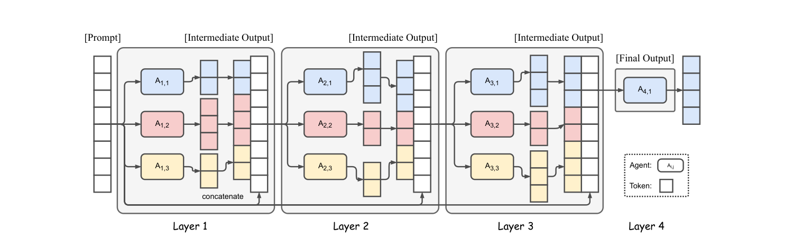
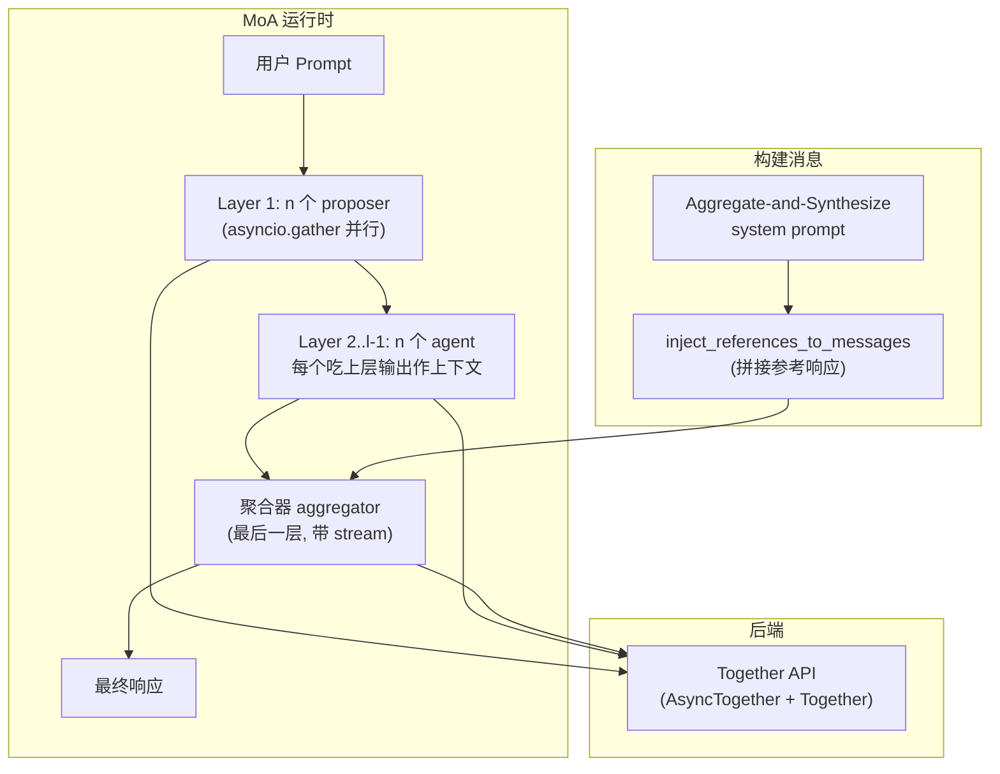
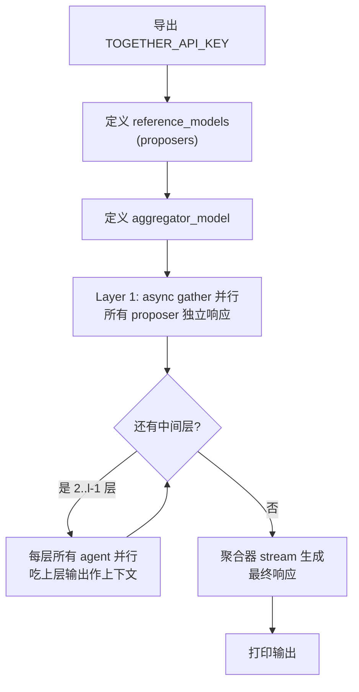
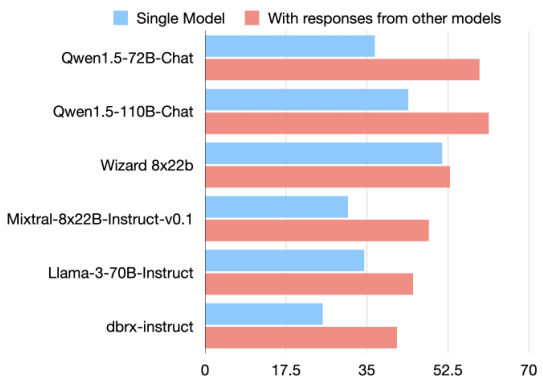
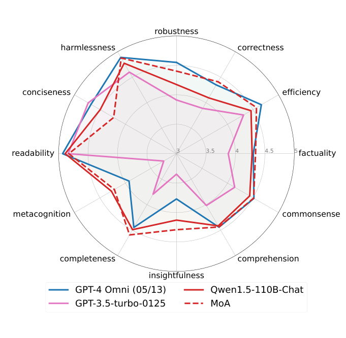
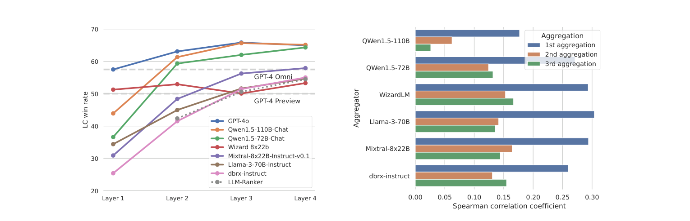
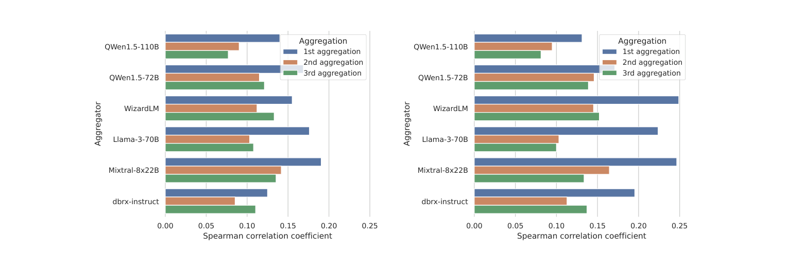
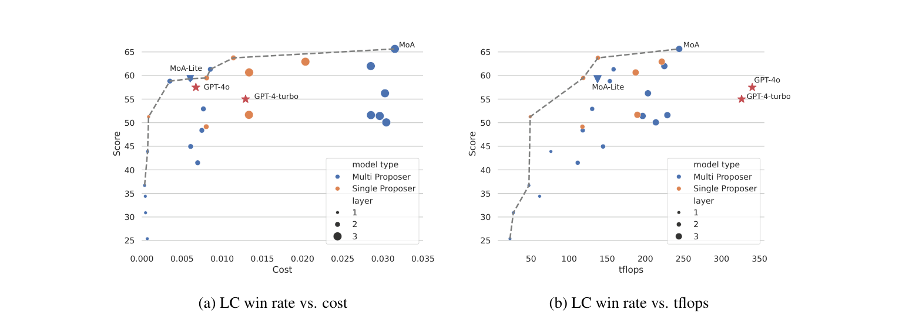

# Mixture-of-Agents Enhances Large Language Model Capabilities 调研报告

> 本报告调研 MoA 原始论文（arXiv 2406.04692，ICLR 2025），是 LLM Ensemble 调研计划**阶段 1 MoA 主线的奠基工作**。本文提出 layered 的 Mixture-of-Agents 架构，是后续所有 MoA 变体（Self-MoA、SMoA、RMoA、Together MoA 部署等）的 baseline。挂在综述 taxonomy 的 **(c1) 非级联 / selection-then-regeneration** 格，是 LLM-Blender 范式的 layered 推广。

---

## 📋 基本信息

<p align="center"><b>表1：论文基本信息</b></p>

| 项目 | 内容 |
|-----|------|
| 论文标题 | Mixture-of-Agents Enhances Large Language Model Capabilities |
| 作者 | Junlin Wang（Duke/Together AI）、Jue Wang、Ben Athiwaratkun、Ce Zhang、James Zou |
| 主要单位 | Together AI + Duke / Chicago / Stanford |
| 发表会议 | ICLR 2025 |
| 发表年份 | 2024（arXiv v1 2024-06-07） |
| 论文链接 | https://arxiv.org/abs/2406.04692 |
| 代码仓库 | https://github.com/togethercomputer/moa （Apache-2.0） |
| 引用数 | 高（MoA 是 LLM Ensemble after-inference 方向的奠基/必引工作） |
| 关联产品 | Together MoA（https://www.together.ai/blog/together-moa） |

---

## 1. 研究背景与动机

### 1.1 问题定义

如何**利用多个 LLM 的集体专长**来提升生成质量？MoA 回答：不是选一个模型，也不是简单投票，而是让模型**协作**——通过分层迭代，让每个模型看到其它模型的输出后生成更好的响应。

### 1.2 研究动机

1. **单个 LLM 的固有约束**：模型受限于规模与训练数据，进一步 scale 极其昂贵（需在数万亿 token 上重训）。
2. **模型的多样性**：不同 LLM 各有所长（如有的擅长指令跟随、有的擅长代码），这种多样性提供了"组合即提升"的空间。
3. **关键现象——collaborativeness（可协作性）**：论文发现 LLM 在**看到其它模型的输出时倾向于生成更好的响应，即使这些输出质量更低**。这是 MoA 的立论基石。

### 1.3 研究目标

1. 提出 Mixture-of-Agents（MoA）框架，用分层架构利用多 LLM 优势，提升推理与生成能力。
2. 揭示并实证"LLM 的可协作性"现象。
3. 在 AlpacaEval 2.0、MT-Bench、FLASK 达到 SOTA。

---

## 2. 核心贡献

### 2.1 主要贡献

<p align="center"><b>表2：论文主要贡献</b></p>

| 编号 | 贡献描述 |
|-----|---------|
| C1 | **分层 MoA 框架**：提出 layered MoA 架构，每层多个 LLM agent，每个 agent 把上一层所有输出作为辅助信息生成响应，迭代精炼。 |
| C2 | **发现 LLM 可协作性（collaborativeness）**：实证 LLM 在参考其它模型输出时生成更好响应，即使参考输出质量更低。 |
| C3 | **SOTA 性能**：用纯开源模型在 AlpacaEval 2.0 达到 65.1%（超越 GPT-4 Omni 的 57.5%），MT-Bench 9.25，FLASK 多维度领先。 |

### 2.2 创新点

1. **方法创新**：把 MoE 思想从"模型内激活层"推广到"模型间"——用现成 LLM、完全通过 prompt 接口协作，不触碰内部权重/激活，无需微调。这是对 MoE 的 model-level 类比。
2. **角色分化（proposer/aggregator）**：首次系统区分两类协作角色——proposer（擅长产出供他人使用的参考响应）与 aggregator（擅长综合他人响应为高质量输出），并实证不同模型角色倾向。
3. **实验创新**：不仅报结果，还做机理分析（MoA vs ranker、BLEU 相关性）+ 成本/tflops Pareto 分析，回答"MoA 为什么有效、值不值"。

---

## 3. 方法详解

### 3.1 方法概述

MoA 的核心是**分层迭代精炼**：第一层多个 LLM（proposers）独立生成响应 → 把这些响应作为辅助信息喂给下一层模型 → 迭代多轮 → 最后一层用 aggregator 综合出最终响应。整个过程只靠 prompt 接口，无微调。

### 3.2 整体架构



*Figure 2（论文 Figure 2）：MoA 分层结构示意。图中展示 4 层、每层 3 个 agent 的示例。第 1 层 agent A1,1..A1,3 独立响应 prompt，产出中间输出；第 2 层 agent A2,1..A2,3 把第 1 层所有输出拼接作为上下文，生成改进后的中间输出；逐层迭代；第 4 层输出最终结果。注意 agent 可以共享同一模型（同层或跨层复用），indicates temperature 采样带来的随机性。*

**架构文字描述**：

- **分层结构**：MoA 有 $l$ 层，每层 $n$ 个 LLM，记为 $A_{i,1}, A_{i,2}, \ldots, A_{i,n}$（第 $i$ 层第 $j$ 个 agent）。
- **模型复用**：LLM 可在同层或跨层复用。当一层内多个 agent 是同一模型时，对应"单模型生成多个可能不同输出"（因 temperature 采样随机性），论文称 **single-proposer** 设置——只有稀疏子集模型被激活。
- **数据流**：每个 agent 读取输入文本并生成续写。第 $i$ 层输出 $y_i$ 作为第 $i+1$ 层输入。
- **聚合器（aggregator）**：最后一层只需一个 LLM 即可，用其输出 $A_{l,1}(x_l)$ 作为最终结果。
- **无需微调**：方法只利用 LLM 的 prompt 与生成接口，可应用于任意最新 LLM，不依赖其规模或架构。

**核心公式**：

给定输入 prompt $x_1$，第 $i$ 层 MoA 层的输出 $y_i$ 可表示为：

$$y_i = \bigoplus_{j=1}^{n} \left[ A_{i,j}(x_i) \right] + x_1, \quad x_{i+1} = y_i$$

其中 $+$ 表示文本拼接；$\bigoplus$ 表示对模型输出应用 **Aggregate-and-Synthesize prompt**（见表 3）。

**与 MoE 的类比**：MoE 的层内是专家网络 + 门控网络 + 残差连接：

$$y_i = \sum_{j=1}^{n} G_{i,j}(x_i) E_{i,j}(x_i) + x_i$$

MoA 把这种思想提升到 model level：用 LLM 同时承担门控和专家角色（LLM 内在能力可正则化输入、解释 prompt、生成连贯输出，无需外部协调机制），且在 prompt 层运作而非激活层。

### 3.3 核心算法流程

```
Algorithm 1: Mixture-of-Agents (MoA)
Input: prompt x_1, 层数 l, 每层模型集 {A_{i,j}}, 聚合器 A_{l,1}
1. 第 1 层：所有 proposer 独立生成响应
   y_1 = ⊕_{j=1}^{n} [A_{1,j}(x_1)]
2. 第 2..l-1 层：每层所有 agent 把上一层输出作为上下文，生成改进响应
   For i = 2 to l-1:
     For each agent A_{i,j}:
       output = A_{i,j}( 拼接(Aggregate-and-Synthesize prompt, 上层输出, 原始prompt) )
     y_i = ⊕_{j=1}^{n} [ 各 agent 输出 ]
3. 最后一层：用聚合器综合所有输出
   final = A_{l,1}( 拼接(Aggregate-and-Synthesize prompt, 上层输出, 原始prompt) )
Output: final
```

### 3.4 关键模块详解

#### 模块 A: Aggregate-and-Synthesize Prompt（聚合提示词）

- **功能**：让聚合器综合多个参考模型的响应，生成单一高质量响应。
- **关键设计**：提示词明确要求"**批判性评估**这些响应（可能有偏颇或错误）"、"**不要简单复述**，要精炼准确全面"。
- **完整提示词**（论文 Table 1）：

> "You have been provided with a set of responses from various open-source models to the latest user query. Your task is to synthesize these responses into a single, high-quality response. It is crucial to critically evaluate the information provided in these responses, recognizing that some of it may be biased or incorrect. Your response should not simply replicate the given answers but should offer a refined, accurate, and comprehensive reply to the instruction. Ensure your response is well-structured, coherent, and adheres to the highest standards of accuracy and reliability. Responses from models: 1. [response A1] 2. [response A2] ..."

#### 模块 B: 角色设计（Proposer vs Aggregator）

- **Proposer（提案者）**：擅长产出生效的参考响应。好的 proposer 不一定自身分数高，但提供更多上下文与多元视角，最终帮助聚合器产出更好结果。
- **Aggregator（聚合器）**：擅长综合多模型响应为单一高质量输出。好的聚合器即使在输入质量低于自身时也能保持/提升输出质量。
- **实证结论**（论文 Section 3.3 + Table 4）：GPT-4o、Qwen1.5、LLaMA-3 是全能型（既擅 proposer 也擅 aggregator）；**WizardLM 是优秀 proposer 但 aggregation 表现差**。

### 3.5 关键技术点

<p align="center"><b>表3：关键技术点</b></p>

| 技术点 | 描述 | 作用 | 论文对应位置 |
|-------|-----|-----|------------|
| 分层迭代 | 多层 proposer 逐层精炼 | 逐步提升响应质量 | Section 2.2 |
| Aggregate-and-Synthesize prompt | 明确的综合提示词 | 让聚合器批判综合而非复述 | Table 1 |
| 模型复用 | 同层/跨层可复用同一模型 | 支持 single-proposer 与异构 | Section 2.2 |
| 无微调 | 纯 prompt 接口 | 零训练开销、通用性 | Section 2.3 |
| 角色分化 | proposer / aggregator | 指导模型选择 | Section 2.1, 3.3 |

### 3.6 方法设计的关键洞察

1. **洞察 1（可协作性）**：LLM 看到其它模型输出能生成更好响应，即使参考输出质量更低。这是"为什么多层聚合有效"的根因——不是 voting，而是**上下文增强**。
2. **洞察 2（聚合非选择）**：MoA 显著优于 LLM-ranker（让聚合器直接从 proposer 输出里选一个）。说明聚合器**不是简单选择**，而是做**复杂的综合**（sophisticated aggregation）。
3. **洞察 3（多样性红利）**：多 proposer（异构模型）持续优于 single-proposer（同模型多采样），且分数随 proposer 数 $n$ 单调上升。异构 + 更多 proposer = 更好。
4. **洞察 4（角色专门化）**：不同模型有不同角色专长，选聚合器不能只看单模型分数，要看其 aggregation 能力。

### 3.7 与现有方法的核心区别

<p align="center"><b>表4：与现有方法的对比</b></p>

| 环节 | 现有方法做法 | 本文做法 | 改变原因 |
|-----|------------|---------|---------|
| 多模型利用 | 选优（ranker/router）或投票 | 分层迭代聚合 | 选优丢弃信息，投票需对齐；聚合利用全部信息 |
| 集成粒度 | after-inference 响应级 | 响应级但分层多轮 | 通过多轮精炼补偿单轮响应级的信息粗粒度 |
| 训练需求 | 有监督聚合需训练（如 LLM-Blender GenFuser） | 完全无训练 | 避免训练代价，保持通用性 |
| 类比对象 | MoE 在激活层 | MoE 在模型层（prompt 层） | 用现成 LLM + prompt 实现专家/门控职责 |

---

## 4. 代码实现分析

> 论文开源了 Together MoA 仓库，`moa.py` 仅 50 行即可实现 MoA 核心，是理解部署形态的最佳入口。本仓库同时是调研计划 **1.2 Together MoA（工程参考实现）** 的核心，此处一并分析。

### 4.1 代码仓库概述

<p align="center"><b>表5：代码仓库信息</b></p>

| 项目 | 内容 |
|-----|------|
| 仓库地址 | https://github.com/togethercomputer/moa |
| 主要语言 | Python |
| 开源时间 | 2024-06（arXiv 同时） |
| 依赖管理 | requirements.txt（openai, fire, loguru, datasets, typer, rich）+ together SDK |
| 许可证 | Apache-2.0 |

### 4.2 目录结构

```
moa/
├── moa.py                 # MoA 核心实现（50 行，2 层 4 模型示例）
├── advanced-moa.py         # 多层 MoA 示例（3+ 层）
├── bot.py                  # 交互式 CLI 多轮对话 demo
├── utils.py                # 通用工具（generate_together/generate_openai/inject_references 等）
├── tests.py                # 单元测试
├── eval_mt_bench.py        # MT-Bench 推理脚本
├── generate_for_alpaca_eval.py  # AlpacaEval 生成脚本
├── generate_for_flask.py   # FLASK 生成脚本
├── show_mt_bench_result.py # MT-Bench 结果展示
├── run_eval_*.sh           # 各 benchmark 运行脚本
├── alpaca_eval/            # AlpacaEval 评测代码（修改版）
├── FastChat/               # MT-Bench 评测代码（修改版）
├── FLASK/                  # FLASK 评测代码（修改版）
└── outputs/                # 输出目录
```

### 4.3 系统架构图



*MoA 运行时架构。核心是"并行 proposer → 逐层精炼 → 聚合器 stream 输出"。第一层用 `asyncio.gather` 并行调用所有 proposer；后续层的每个 agent 都通过 `inject_references_to_messages` 把上层全部输出拼进 system prompt 作为上下文；最后聚合器用 streaming 输出最终响应。整个流程通过 Together API（AsyncTogether 异步 + Together 同步 stream）调用现成 LLM，无任何训练。*

### 4.4 核心流程图



### 4.5 核心数据结构

MoA 用 Together SDK 的 chat completions 接口，无复杂自定义数据结构。关键概念映射：

| 论文概念 | 代码实现 |
|---------|---------|
| proposer 模型 | `reference_models` 列表 |
| aggregator 模型 | `aggregator_model` |
| Aggregate-and-Synthesize prompt | `aggreagator_system_prompt` 常量 |
| 上层输出注入 | `getFinalSystemPrompt(system_prompt, results)` → 拼接成 `"Responses from models:\n1. ...\n2. ..."` |
| 并行调用 | `asyncio.gather(*[run_llm(model) for model in reference_models])` |
| 层间精炼 | `advanced-moa.py` 的 `for _ in range(1, layers-1)` 循环 |

### 4.6 核心算法实现

**单层精炼（advanced-moa.py 核心）**：

```python
# Layer 1: 所有 proposer 独立响应
results = await asyncio.gather(*[run_llm(model) for model in reference_models])

# 中间层：每层所有 agent 吃上层输出作上下文
for _ in range(1, layers - 1):
    results = await asyncio.gather(
        *[run_llm(model, prev_response=results) for model in reference_models]
    )

# 最后一层：聚合器 stream 输出
finalStream = client.chat.completions.create(
    model=aggregator_model,
    messages=[
        {"role": "system", "content": getFinalSystemPrompt(aggreagator_system_prompt, results)},
        {"role": "user", "content": user_prompt},
    ],
    stream=True,
)
```

**关键点**：
- `run_llm` 带 `prev_response` 参数时，构造 system prompt 为聚合提示词 + 上层输出编号列表，实现"参考上层输出"。
- 第一层无 `prev_response`，proposer 直接响应原始 prompt。
- 内建 rate-limit 重试（`for sleep_time in [1,2,4]`）。
- 并行用 `asyncio.gather`，多 proposer 同时运行（对应论文"多 proposer 可并行"的成本分析假设）。

### 4.7 配置参数详解

<p align="center"><b>表6：配置参数说明</b></p>

| 参数 | 默认值 | 说明 |
|-----|-------|------|
| `reference_models` | 4 个开源模型 | proposer 列表 |
| `aggregator_model` | Qwen2.5-72B-Instruct-Turbo | 最终聚合器 |
| `temperature` | 0.7 | 采样温度（proposer 多样性来源） |
| `max_tokens` | 512 | 单次生成上限 |
| `layers`（advanced） | 3 | MoA 层数 |
| `rounds`（bot.py） | — | 精炼轮数（= 层数-1） |
| `num_proc`（bot.py） | — | 并行进程数 |

### 4.8 论文-代码对应关系

<p align="center"><b>表7：论文概念与代码实现的对应关系</b></p>

| 论文概念 | 代码实现 | 文件位置 |
|---------|---------|---------|
| proposer 并行 | `asyncio.gather` | `advanced-moa.py:66` / `moa.py:38` |
| Aggregate-and-Synthesize prompt | `aggreagator_system_prompt` | `moa.py:17` |
| 上层输出注入 | `getFinalSystemPrompt()` | `advanced-moa.py:24` |
| 多层迭代 | `for _ in range(1, layers-1)` | `advanced-moa.py:68` |
| 聚合器 stream 输出 | `client.chat.completions.create(stream=True)` | `advanced-moa.py:73` |
| 评测推理 | `generate_for_alpaca_eval.py` 等 | 各 generate_for_*.py |
| 参考注入工具 | `inject_references_to_messages` | `utils.py` |

### 4.9 代码质量评估

<p align="center"><b>表8：代码质量评估</b></p>

| 维度 | 评分 | 说明 |
|-----|------|------|
| 模块化 | ⭐⭐⭐⭐ | 核心逻辑清晰，`moa.py` 50 行即演示；utils 抽公共逻辑 |
| 可配置性 | ⭐⭐⭐⭐ | bot.py 提供 CLI 参数（aggregator/reference/temperature/max_tokens/rounds/num_proc） |
| 可扩展性 | ⭐⭐⭐⭐ | advanced-moa.py 展示层数扩展；评测脚本分离 |
| 文档 | ⭐⭐⭐⭐ | README 详尽（quickstart/advanced/bot/evaluation/results） |
| 测试 | ⭐⭐⭐ | tests.py 有基本断言测试，但较简单 |

### 4.10 复现指南

```bash
# 环境准备
pip install together
export TOGETHER_API_KEY=your_key

# 基础 MoA（2 层 4 模型）
python moa.py

# 多层 MoA（3+ 层）
python advanced-moa.py

# 交互式 CLI 多轮 demo
pip install -r requirements.txt
python bot.py

# 评测（复现论文结果）
bash run_eval_alpaca_eval.sh
bash run_eval_mt_bench.sh
bash run_eval_flask.sh
```

---

## 5. 实验分析

### 5.1 实验设置

#### 数据集

<p align="center"><b>表9：实验基准</b></p>

| 基准 | 规模 | 任务 | 说明 |
|-------|-----|-----|-----|
| AlpacaEval 2.0 | 805 指令 | 对齐评估 | 与 GPT-4(gpt-4-1106-preview) 对比，GPT-4 评估器，LC win rate 消除长度偏置 |
| MT-Bench | — | 对话质量 | GPT-4 评分，含 multi-turn |
| FLASK | — | 12 技能细粒度评分 | robustness/correctness/.../harmlessness 等 |

#### 默认 MoA 配置
- **proposers**（每层同套）：Qwen1.5-110B-Chat、Qwen1.5-72B-Chat、WizardLM-8x22B、LLaMA-3-70B-Instruct、Mixtral-8x22B-v0.1、dbrx-instruct
- **3 层**，每层同一套模型
- **聚合器**：Qwen1.5-110B-Chat（最后一层）
- **变体**：
  - MoA w/ GPT-4o：聚合器换成 GPT-4o（追求高质量）
  - MoA-Lite：2 层 + Qwen1.5-72B-Chat 聚合器（追求成本效益）

### 5.2 主实验结果



*Figure 1（论文 Figure 1）：AlpacaEval 2.0 LC win rate 展示了 LLM 的 collaborativeness。6 个流行 LLM 在提供其它模型响应后，LC win rate 显著提升——即使辅助响应质量低于模型自身独立生成。这实证"可协作性"是普遍现象，是 MoA 多层聚合有效性的根基。*

**AlpacaEval 2.0 结果**（论文 Table 2a）：

<p align="center"><b>表10：AlpacaEval 2.0 结果（LC win. / win.）</b></p>

| 模型 | LC win. | win. |
|-----|---------|------|
| **MoA w/ GPT-4o** | **65.7±0.7%** | 78.7±0.2% |
| **MoA** | **65.1±0.6%** | 59.8±0.3% |
| MoA-Lite | 59.3±0.2% | 57.0±0.7% |
| GPT-4 Omni (05/13) | 57.5% | 51.3% |
| GPT-4 Turbo (04/09) | 55.0% | 46.1% |
| WizardLM 8x22B | 51.3% | 62.3% |
| Qwen1.5 110B Chat | 43.9% | 33.8% |
| Llama 3 70B Instruct | 34.4% | 33.2% |

**关键结论**：MoA 用纯开源模型超 GPT-4o（65.1% vs 57.5%，+7.6% 绝对）；MoA-Lite 少层仍超 GPT-4o 1.8%；MoA w/ GPT-4o 达 65.7%。

**MT-Bench 结果**（论文 Table 2b）：

<p align="center"><b>表11：MT-Bench 结果</b></p>

| 模型 | Avg. | 1st turn | 2nd turn |
|-----|------|---------|---------|
| MoA w/ GPT-4o | 9.40±0.06 | 9.49 | 9.31 |
| GPT-4 Turbo | 9.31 | 9.35 | 9.28 |
| MoA | 9.25±0.10 | 9.44 | 9.07 |
| MoA-Lite | 9.18±0.09 | 9.38 | 8.99 |

MT-Bench 提升相对增量（因单模型已>9 分），但 MoA 仍居榜首，说明即使在高度优化基准上也能推高边界。



*Figure 3（论文 Figure 3）：FLASK 12 技能细粒度评分。MoA 在 robustness、correctness、efficiency、factuality、commonsense、insightfulness、completeness 上显著优于聚合器单模型 Qwen-110B-Chat；并在 correctness、factuality、insightfulness、completeness、metacognition 上超 GPT-4 Omni。唯一弱项是 conciseness（输出略冗长）。*

### 5.3 机理分析实验



*Figure 4（论文 Figure 4）：(a) 不同聚合器在 6-proposer MoA 下的 LC win rate——所有曲线用相同 6 个 proposer，仅最终聚合器不同；(b) BLEU 分数（3/4/5-gram）与 proposer 输出 win rate 的 Spearman 相关。两张图揭示 MoA 的机理：(a) 聚合器选择显著影响结果，Qwen1.5-110B 与 GPT-4o 类聚合器表现好，而 WizardLM 聚合时明显掉队（印证其"擅 proposer 不擅聚合"）；(b) BLEU 与 win rate 正相关，说明聚合器倾向于采纳最好的 proposer 答案。*

**关键机理结论 1——MoA 显著优于 LLM-ranker**：聚合器直接从 proposer 输出里选一个（ranker 方式）远不如 MoA 的生成式聚合。证明聚合器做的是复杂的综合（sophisticated aggregation），而非简单选择。

**关键机理结论 2——MoA 倾向采纳最佳提案**：聚合器响应与 proposer 响应间的 BLEU 相似度与 win rate 正相关（Figure 4b）。论文在附录还用 TF-IDF 与 Levenshtein 两种替代相似度度量验证了同一结论（Figure 6），排除度量选择带来的偶然性：



*Figure 6（论文 Figure 6 附录）：(a) TF-IDF 相似度与 win rate 的 Spearman 相关；(b) Levenshtein 相似度与 win rate 的 Spearman 相关。两图都呈现正相关，与正文 Figure 4b 用 BLEU 度量的结论一致，证明"聚合器倾向于采纳最佳 proposer 提案"这一机理不依赖特定相似度度量，具有稳健性。*

### 5.4 消融实验（模型多样性 / proposer 数量 / 角色）

**proposer 数量与多样性的影响**（论文 Table 3，Qwen1.5-110B 聚合，2 层）：

<p align="center"><b>表12：proposer 数量与多样性效应</b></p>

| n | Multiple-Proposer | Single-Proposer |
|---|---|---|
| 6 | 61.3% | 56.7% |
| 3 | 58.0% | 56.1% |
| 2 | 58.8% | 54.5% |
| 1 | 47.8% | 47.8% |

**结论**：分数随 $n$ 单调上升（更多辅助信息有益）；多 proposer（异构）持续优于单 proposer（同模型多采样）。宽度（width）扩展是未来方向。

**角色专门化**（论文 Table 4）：Qwen1.5-110B-Chat 作聚合器 61.3%、作 proposer 56.7%；**LLaMA-3-70B 作聚合器仅 45.0% 但作 proposer 60.6%**；**WizardLM 聚合 52.9% 但 proposer 63.8%**——鲜明体现"某模型擅 proposer 不擅聚合"。

### 5.5 成本与 Token 分析



*Figure 5（论文 Figure 5）：(a) LC win rate vs. 平均推理成本；(b) LC win rate vs. tflops（作为延迟代理）。两图都呈现 Pareto 前沿：MoA 落在前沿上，而 GPT-4 Turbo/GPT-4o 对同 LC win rate 更贵。MoA-Lite 可匹配 GPT-4o 成本同时保持更高质量，且比 GPT-4 Turbo 高约 4% 而便宜 2 倍多。*

**成本结论**：
- 追求质量 → MoA 最佳。
- 追求质量/成本平衡 → MoA-Lite 匹配 GPT-4o 成本但质量更高，超 GPT-4 Turbo ~4% 且便宜 >2×。
- 计算 tflops 时按"每层 proposer 最大 tflops 之和"（因多 proposer 可并行）。

### 5.6 实验结果总体分析

MoA 的实验设计围绕"**为什么有效 + 值不值**"三个层次展开：

1. **现象验证（collaborativeness）**：Figure 1 证明多模型协作的基本前提成立——模型看到他人输出会更好。
2. **端到端验证（SOTA）**：AlpacaEval 2.0 / MT-Bench / FLASK 证明 MoA 框架整体有效，纯开源超 GPT-4o。
3. **机理与价值验证**：通过"MoA vs ranker"证明聚合非选择；通过 BLEU 相关性证明聚合器采纳最佳提案；通过 proposer 数量/多样性消融证明"更多异构=更好"；通过角色表格证明需按角色选模型；通过 Pareto 成本分析证明工程价值。

**边界条件**：
- MoA 收益在 AlpacaEval 2.0 最显著（+7.6%），在 MT-Bench 较温和（因单模型已高）。
- 聚合器选择是关键——选错聚合器（如 WizardLM）会明显掉队。
- conciseness 是弱项（输出更冗长）。

---

## 6. 相关工作

### 6.1 相关工作列表

<p align="center"><b>表13：相关工作列表</b></p>

| 论文/方向 | 年份 | 核心思想 | 与本文关系 |
|----------|-----|---------|-----------|
| CoT / ToT / GoT | 2022-2023 | 推理提示工程 | 单模型推理增强，本文是跨模型 |
| PAIRRANKER（Jiang 2023） | 2023 | 两两比较选最优 | 相关——选优而非聚合，本文证明聚合更强 |
| LLM-Blender（Jiang 2023） | 2023 | PairRanker+GenFuser | **最相关**——本文是其 selection-then-regeneration 范式的 layered 推广 |
| FrugalGPT（Chen 2023） | 2023 | 级联降本 | 相关——级联 vs 本文非级联 |
| Router（RouteLLM 等） | 2024 | 预测最佳模型 | 相关——选模型 vs 本文聚合所有模型 |
| 多 agent 讨论（MAD/ReConcile） | 2023 | 对称/非对称讨论 | 相关——但本文 agent 地位对称、无角色分工（除 proposer/aggregator 功能角色） |
| Huang 2024 | 2024 | 平均输出概率分布 | 相关——token 级聚合 vs 本文响应级 |

### 6.2 本文与相关工作的区别

- **vs 选优类（ranker/router）**：MoA 不丢弃信息，聚合所有 proposer 输出，且实证优于选一个的 ranker。
- **vs LLM-Blender**：LLM-Blender 是"选子集 + GenFuser 再生"两阶段；MoA 是多层"聚合器迭代"，每层所有 agent 都吃上层输出，且**无需训练**（LLM-Blender 的 PairRanker/GenFuser 需训练）。
- **vs 多 agent 讨论**：讨论类方法有角色分工（debater/judge）且通常需交互多轮 token 交换；MoA 是分层流水线，模型地位对称（仅有功能性 proposer/aggregator 差异），直接聚合。

---

## 7. 局限性分析

### 7.1 论文声明的局限性

1. **高 TTFT（Time to First Token）**：迭代聚合响应意味着**最后一层到达前模型无法决定第一个 token**，TTFT 高，影响用户体验。
2. **缓解**：限制层数（第一次聚合增益最大）；未来可探索 chunk-wise aggregation（逐块聚合而非整响应一次聚合）以降 TTFT。

### 7.2 发现的潜在问题

<p align="center"><b>表14：潜在问题分析</b></p>

| 问题类型 | 描述 | 影响 |
|---------|-----|------|
| 方法层面 | 异构 MoA 是否总有益未深究——本文默认"多异构 proposer 更好"，但未讨论异构的边界条件（后续 Self-MoA 质疑此点） | 阶段 1 调研 1.3 Self-MoA 时需对照 |
| 实验层面 | tflops 计算用 GPT-4 的社区传闻规模（8x220B），非官方数据 | 图 5b 的 GPT-4 点有不确定性 |
| 方法层面 | MoA 收益依赖"好聚合器"——Table 4 显示 WizardLM 聚合掉队，但论文未给聚合器选择的明确准则/算法 | 实际选型需试错 |
| 应用层面 | conciseness 弱（输出冗长），对某些场景（如摘要）可能不利 | 需按场景权衡 |

### 7.3 未来工作方向

1. 系统优化 MoA 架构（层数/宽度/聚合器选择）。
2. 进一步扩展 MoA 宽度（更多 proposer）。
3. chunk-wise aggregation 降低 TTFT。
4. 探索异构模型协作的边界条件（这是 Self-MoA 等的切入点）。

---

## 8. 个人评价

### 8.1 优点

1. **立论清晰**：先证明"collaborativeness"现象，再基于此设计 MoA，逻辑闭环。
2. **机理透明**：不仅报 SOTA，还通过"MoA vs ranker"、BLEU 相关性、角色表回答"为什么有效"，对后续研究者极具价值。
3. **工程友好**：开源 50 行核心实现，部署门槛极低，是 MoA 得以广泛采用的关键。
4. **成本视角**：Pareto 分析让"聚合值不值"有量化答案，MoA-Lite 是实用的降本变体。

### 8.2 不足

1. **异构假设未证伪**：默认"异构 melhor"，但未系统研究异构何时不益（留下 Self-MoA 的质疑空间）。
2. **聚合器选择无准则**：Table 4 显示聚合器差异大，但论文未给"如何选聚合器"的方法论。
3. **TTFT 未解决**：承认高 TTFT 但未给强方案（仅建议限制层数）。
4. **评测偏对齐/对话**：AlpacaEval/MT-Bench 偏 RLHF 对齐，泛化到更硬核任务（数学/代码）未同深度验证。

### 8.3 适用场景

- 需要**零训练、即插即用**提升多 LLM 组合质量的场景（API 层包装即可）。
- 对响应质量要求高、对延迟（TTFT）不敏感的场景。
- 作为 MoA 系列所有变体的对照 baseline。

### 8.4 不适用场景

- **延迟敏感场景**（实时对话、TTFT 关键）——MoA 的迭代聚合不适合。
- **成本极敏感**——多层多模型调用成本高（MoA-Lite 缓解但仍有）。
- 需要**开放式生成 + 严格一致性**的场景——聚合可能引入偏颇。

---

## 9. 启发与思考（对接调研计划阶段 1）

### 9.1 技术启发

1. **proposer/aggregator 角色分化**是理解 MoA 变体的关键 lens——评估任何 MoA 变体时先问"它优化了 proposer 还是 aggregator"。
2. **聚合 prompt 的"批判性综合"设计**（不简单复述、识别偏颇）是聚合器有效的关键，值得在后续变体对比中关注 prompt 差异。
3. **多样性红利**（多异构 proposer > 同模型多采样）是后续 SMoA/RMoA 做 diversity selection 的理论基础。

### 9.2 可借鉴之处

- MoA 的"聚合 prompt 注入上层输出"模式可作为任何 ensemble 系统的通用组件。
- MoA 的机理分析实验设计（MoA vs ranker、BLEU 相关性、角色表）可作为评估 MoA 变体的标准实验模板。

### 9.3 潜在改进方向（对接计划 1.3 Self-MoA）

- **异构是否总有益**：MoA 默认异构更好，但未证伪边界。Self-MoA（1.3）正是对此发问——评估任何 MoA 变体时，对照组应至少含"同模型 baseline"（Single-proposer）与"完全 MoA"两种。
- **信息流退化**：多层迭代是否引入噪声/退化？SMoA（1.4）做 response selection + early stopping，RMoA（1.5）做 diversity selection + residual 提取，都是针对此子问题。

### 9.4 后续行动（对接调研计划阶段 1）

- [ ] 1.2 Together MoA 工程实现：本报告代码分析章节已覆盖（`moa.py`/`advanced-moa.py`），可复用。
- [ ] 1.3 Self-MoA（2502.00674）：重点对照"异构 MoA 是否总有益"。
- [ ] 1.4 SMoA / 1.5 RMoA：对照"信息流退化"的两个解法。
- [ ] 1.12-1.14 AlpacaEval/MT-Bench/FLASK：这三个正是 MoA 用的评测，阶段 1 评测配套已确认。

---

## 参考文献（论文关键引用）

```bibtex
@inproceedings{wang2024moa,
  title={Mixture-of-Agents Enhances Large Language Model Capabilities},
  author={Wang, Junlin and Wang, Jue and Athiwaratkun, Ben and Zhang, Ce and Zou, James},
  booktitle={ICLR},
  year={2025},
  note={arXiv:2406.04692}
}
```

---

## 附录

### A. 关键图表索引

<p align="center"><b>表15：关键图表索引</b></p>

| Figure | 描述 | 报告内位置 |
|--------|------|-----------|
| Figure 1 | LLM 可协作性（AlpacaEval LC win rate） | Section 5.2 |
| Figure 2 | MoA 分层结构 | Section 3.2 |
| Figure 3 | FLASK 12 技能评分 | Section 5.2 |
| Figure 4 | 聚合器差异 + BLEU 相关性 | Section 5.3 |
| Figure 5 | 成本/tflops Pareto 分析 | Section 5.5 |
| Figure 6 | TF-IDF/Levenshtein 相似度相关性（验证 BLEU 结论稳健性） | Section 5.3 |

### B. 流程图索引

<p align="center"><b>表16：Mermaid 流程图索引</b></p>

| 图表 | 描述 | 报告内位置 |
|------|------|-----------|
| MoA 运行时架构图 | 分层 proposer → 聚合器 架构 | Section 4.3 |
| MoA 核心流程图 | 层间迭代流程 | Section 4.4 |

### C. 调研信息

- 调研人：本调研会话
- 调研时间：2026-08-05
- 论文版本：arXiv v1（2406.04692v1，2024-06-07）→ ICLR 2025 接收
- 参考来源：arXiv PDF 全文、Together MoA 开源仓库（moa.py / advanced-moa.py / README）
- 调研计划归属：LLM Ensemble 调研计划阶段 1 MoA 主线，工作编号 1.1，⭐⭐⭐ 必读

---

*本报告是 LLM Ensemble 调研计划阶段 1（MoA 主线）的奠基工作，为后续 Self-MoA / SMoA / RMoA / Together MoA 部署提供 baseline 与对照框架。*