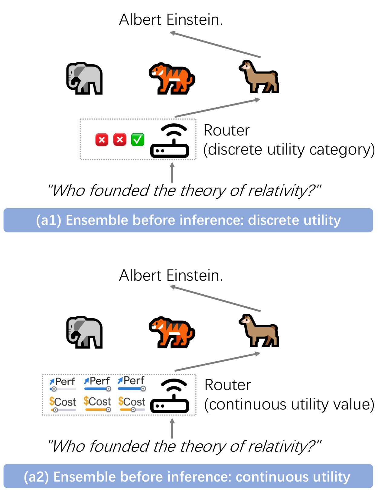
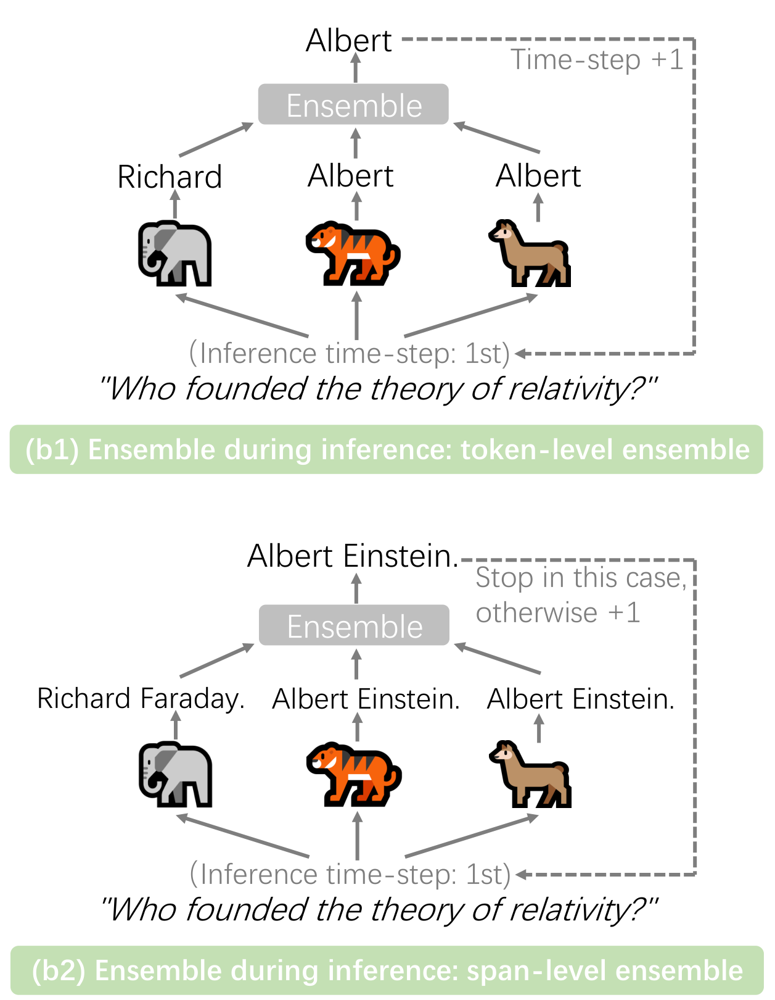
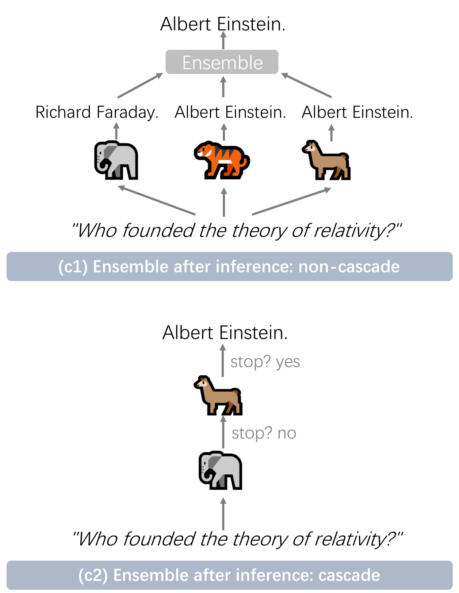
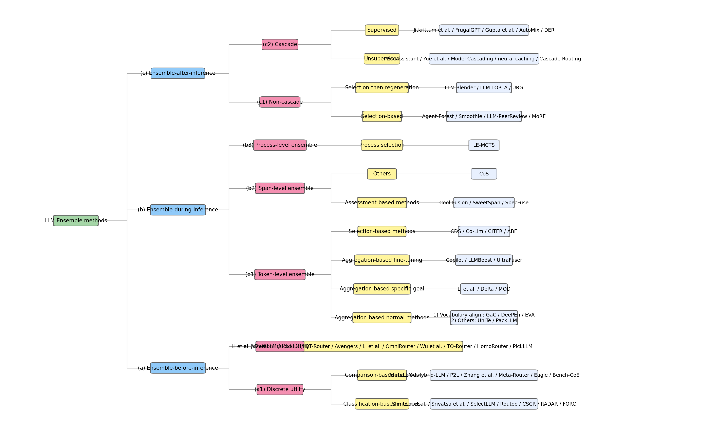
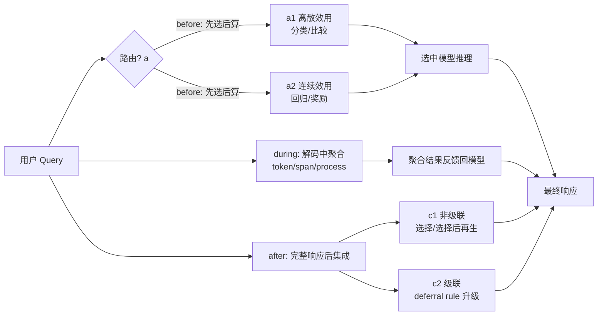

# Harnessing Multiple Large Language Models: A Survey on LLM Ensemble 调研报告

> 本报告调研 LLM Ensemble 领域首篇系统性综述，用于建立 before / during / after inference 三段 taxonomy 坐标系，为后续按主线（MoA、路由、级联、评测）深挖提供分类骨架。本报告是 LLM Ensemble 调研计划阶段 0 的奠基产出。

---

## 📋 基本信息

<p align="center"><b>表1：论文基本信息</b></p>

| 项目 | 内容 |
|-----|------|
| 论文标题 | Harnessing Multiple Large Language Models: A Survey on LLM Ensemble |
| 作者 | Zhijun Chen, Xiaodong Lu, Jingzheng Li, Pengpeng Chen, Zhuoran Li, Kai Sun, Yuankai Luo, Qianren Mao, Ming Li, Likang Xiao, Dingqi Yang, Xiao Huang, Yikun Ban, Hailong Sun, Philip S. Yu |
| 通讯作者 | Yikun Ban, Hailong Sun（北航），Philip S. Yu（UIC） |
| 主要单位 | 北京航空航天大学（State Key Lab of Complex & Critical Software Environment）、中关村实验室、清华、南大、港理工、UIC 等 |
| 发表会议 | IJCAI Survey Track 2026（arXiv: 2502.18036，v6 修订于 2026-04-22） |
| 论文链接 | https://arxiv.org/abs/2502.18036 / HTML: https://arxiv.org/html/2502.18036 |
| 项目主页 | https://junchenzhi.github.io/LLM-Ensemble/ |
| 代码/索引仓库 | https://github.com/junchenzhi/Awesome-LLM-Ensemble （254 star，Apache-2.0，论文维护的 living bibliography，非实现代码） |
| DOI | 10.48550/arXiv.2502.18036 |
| 学科 | cs.CL |
| 篇幅 | 12 页，2 张 Figure |

> **说明**：本论文为综述（survey），其"代码仓库"是 Awesome-LLM-Ensemble 索引清单而非可执行实现，因此本报告不设"代码实现分析"章节，改为以 taxonomy 坐标系、各分支方法图谱、评测体系、未来方向为主线组织，并附与本项目调研计划的对照表，作为后续逐主线深挖的导航底图。

---

## 1. 研究背景与动机

### 1.1 问题定义

**LLM Ensemble** 指在下游推理过程中，为处理用户查询而**综合使用多个 LLM**——每个模型各有所长——以利用其各自优势。综述将其明确定义为：

> "the comprehensive use of multiple large language models (LLMs), each aimed at handling user queries during downstream inference, to benefit from their individual strengths."

需要强调综述划定的**范围边界**：
- **针对的是"系统层面多 LLM 的组合"**，即在推理时把多个 LLM 当作可调度资源来组合；
- **不涉及模型内部的 Mixture-of-Experts（MoE）专家路由**——那是单个模型内部的稀疏激活问题，不属于本综述；
- **与传统 Ensemble Learning 的关系**：继承其精神（hard voting / boosting / 多模型投票），但落地在 LLM 推理栈上。

### 1.2 研究动机

综述从两条主线论证 LLM Ensemble 的必要性：

1. **性能焦虑（performance concerns）**：单模型直接 zero-shot 或 few-shot（in-context-learning）推理仍存在准确率、幻觉、与人意图错位等问题。HF 模型库已超 18.2 万个，但"可用"不等于"好用"。

2. **模型间强弱与代价差异（varying strengths and weaknesses + 不同推理成本）**：因架构、规模、tokenizer、词表、训练数据、训练方法的不同，各 LLM 表现差异巨大且响应显著不同，且每个模型推理成本不同。

> 关键洞察：与其按公开排行榜或其它单一标准选**一个**模型，不如为**每个 query** 同时考虑多个候选 LLM（均开箱即用），取其各自所长。这正是 Ensemble Learning 思想在 LLM 时代的直接体现。

### 1.3 研究目标

综述自述为"**首个**对 LLM Ensemble 的系统综述"，目标包括：
1. 提出统一的 LLM Ensemble **taxonomy**，讨论相关研究问题；
2. 在 before / during / after inference 三个大类下深入分类并综述方法；
3. 介绍相关 benchmark 与应用；
4. 总结现有研究、指出局限与未来方向。

对本项目调研计划而言，本综述的核心价值正是**第 1 点**——提供后续所有工作挂载的坐标系。

---

## 2. 核心贡献

### 2.1 主要贡献

<p align="center"><b>表2：论文主要贡献</b></p>

| 编号 | 贡献描述 |
|-----|---------|
| C1 | 提出 LLM Ensemble 的**统一 taxonomy**：按"LLM 推理"与"集成"的先后顺序，分为 before / during / after inference 三大类，并进一步细分为 7 个子类（a1/a2、b1/b2/b3、c1/c2）。这是后续工作的坐标系骨架。 |
| C2 | 在三大类下系统综述 ~50 篇代表方法，并给出 4 张对照表（before/during/after 各一张方法属性表 + 一张全维度 summary 表），从参数化与否、目标、损失函数、粒度、监督方式、是否效率感知、是否可泛化等多维度对照。 |
| C3 | 梳理相关研究问题（LLM Merging / Collaboration / Multi-LLM RL / Weak Supervision），划定 LLM Ensemble 与近邻领域的边界，避免概念混用。 |
| C4 | 汇总 LLM Ensemble 专属 benchmark（MixInstruct / RouterEval / RouterBench / FusionFactory / RouterArena / LLMRouterBench）与应用领域，并指出 4 个未来方向。 |

### 2.2 创新点

1. **方法创新（taxonomy 维度）**：首次以"推理-集成先后"为正交轴组织整个领域，把路由（before）、解码融合（during）、响应聚合/级联（after）统一进同一框架，使三大主线不再割裂看待。
2. **技术创新（粒度对照）**：引入"集成粒度（granularity）"作为贯穿三类的横向坐标（response → span → process → token），并在 summary 表里用 ♣ 数量直观呈现粒度由粗到细，回答"哪类方法信息利用最充分"。
3. **对照创新**：每类方法都给出"是否泛化到新领域 / 是否效率感知 / 是否需要监督"等工程关键属性，使综述不仅是文献罗列，而是可直接用来选型。

---

## 3. Taxonomy 坐标系（核心）

### 3.1 三大类总览

综述的核心分类依据是**"LLM 推理"与"集成"发生的先后顺序**：

| 大类 | 含义 | 类比传统 Ensemble |
|---|---|---|
| (a) Ensemble **before** inference | 推理前用路由算法把 query 分配给最合适的模型，再让选中模型推理 | hard voting（只选一个） |
| (b) Ensemble **during** inference | 推理过程中聚合多个模型的不完整输出（token 级等），并把组合结果反馈回所有模型 | 最细粒度集成 |
| (c) Ensemble **after** inference | 所有/部分模型生成**完整**响应后再做集成 | — |



*Figure 1(a)：Ensemble before inference。query 进入后，先经路由算法在多个 LLM 候选中选一个最合适的模型，再由该模型完成推理。本质是"先选后算"，对应传统 Ensemble 的 hard voting——每条 query 最终只触发一个模型，成本可控但放弃了多模型信息融合。*



*Figure 1(b)：Ensemble during inference。多个模型在解码过程中实时聚合彼此的不完整输出（如 token 级分布），把聚合结果拼上前文再喂回所有模型，形成解码级的多模型协同。这是三类里粒度最细的形式，但要求模型间词表对齐或有对齐机制。*



*Figure 1(c)：Ensemble after inference。各模型先各自生成完整响应，再在完整响应层面做选择/聚合/再生成，或按模型能力链式级联。粒度最粗（response 级），但实现门槛最低、对模型黑盒程度要求最低，是工程上最容易落地的形态。*

> 注意：图(b) 未画出 (b3) process-level ensemble，综述在 caption 说明因排版与该方法实例较少而省略，本报告在 3.4 节文字补全。

### 3.2 完整方法分类树

下图是综述的 Figure 2，给出 LLM Ensemble 全部 7 个子类下的代表方法分布，是本报告后续每条主线调研的"挂载点"地图：



*Figure 2：LLM Ensemble 方法 taxonomy 树。根节点分三大支：(a) before-inference 下按 router 效用是否离散化分为 a1 离散效用（classification-based / comparison-based）与 a2 连续效用；(b) during-inference 下按集成粒度分为 b1 token 级（聚合型正常/特定目标/微调型 + 选择型）、b2 span 级（评估型 + 其它）、b3 process 级；(c) after-inference 下按是否级联分为 c1 非级联（选择型 / 选择后再生型）与 c2 级联（无监督 / 有监督）。读者可据此把后续每篇主线论文定位到唯一一格。*

### 3.3 七个子类的边界与判别

为避免后续主线调研时把工作放错格子，这里把每个子类的判别准则与典型方法列出（与调研计划阶段 1–3 对应）：

<p align="center"><b>表3：七个子类的边界判别</b></p>

| 子类 | 判别准则 | 典型方法 | 调研计划对应 |
|---|---|---|---|
| (a1) 离散效用 | router 把模型效用离散成类别标签（如满意/不满意二分类，或两两比较偏好） | RouteLLM、Hybrid-LLM、FORC、SelectLLM、Routoo | 阶段 2 路由主线 |
| (a2) 连续效用 | router 把模型效用建模为连续实值（响应长度/性能分数/奖励），可融合多目标 | MetaLLM、MixLLM、IRT-Router、OmniRouter、PickLLM、TO-Router | 阶段 2 路由主线 |
| (b1) token 级 | 每个解码步聚合/选择 token；分聚合型（平均/加权平均 + 词表对齐）与选择型 | GaC、DeePEn、EVA、UniTe、PackLLM、CDS、Co-Llm、CITER、ABE | 阶段 5 during（按需） |
| (b2) span 级 | 在片段（如 4 词）粒度做"生成-评估-选择" | Cool-Fusion、SweetSpan、SpecFuse、CoS | 阶段 5 during（按需） |
| (b3) process 级 | 在复杂推理链的每个推理步选最优 | LE-MCTS | 阶段 5 during（按需） |
| (c1) 非级联 | 聚合多个完整响应，分选择型（多数投票/相似度）与选择后再生型 | Agent-Forest、Smoothie、LLM-PeerReview、MoRE、LLM-Blender、LLM-TOPLA、URG | 阶段 1 MoA 主线（after-inference 核心） |
| (c2) 级联 | 按模型能力链式升级，核心是 deferral rule | FrugalGPT、AutoMix、EcoAssistant、Model Cascading、Cascade Routing、DER | 阶段 3 级联主线 |

> **关键判别提示**：
> - **before vs after**：看集成发生在"完整响应生成之前"还是"之后"。路由一定在推理前（before），聚合/级联一定在响应产出后（after）。
> - **during vs after**：看聚合的是"不完整片段（token/span/step）"还是"完整响应"。during 在解码中、需把聚合结果反馈回模型；after 在解码完成后、不反馈。
> - **c1 选择 vs 选择后再生**：选择型直接从候选里挑一个；选择后再生型先选子集再喂给生成模型重写（LLM-Blender 的 PairRanker+GenFuser 范式）。
> - **c2 无监督 vs 有监督**：看 deferral rule 是否用训练数据学（class uncertainty 是无监督核心信号；scoring function / MDP 是有监督核心）。

### 3.4 三类方法的横向属性对照（summary 表）

综述在 Section 5.1 给出全维度 summary 表（论文 Table 5），从**集成策略、粒度、目标**三轴统一对照：

<p align="center"><b>表4：LLM Ensemble 各类关键属性（对应论文 Table 5）</b></p>

| 大类 | 子类 | 集成策略 | 集成粒度 | 集成目标 |
|---|---|---|---|---|
| (a) before | (a1) 离散效用 | Selection | Response-level ♣ | Performance（and cost） |
| (a) before | (a2) 连续效用 | Selection | Response-level ♣ | Performance and cost |
| (b) during | (b1) token 级 | Aggregation, Selection | Token-level ♣♣♣ | Performance § |
| (b) during | (b2) span 级 | Selection | Span-level ♣♣ | Performance |
| (b) during | (b3) process 级 | Selection | Process-level ♣♣ | Performance |
| (c) after | (c1) 非级联 | Selection, Regeneration | Response-level ♣ | Performance |
| (c2) after | (c2) 级联 | Selection | Response-level ♣ | Performance and cost |

> ♣ 数量代表粒度细度，越多越细。§：(b1) 中 Li et al. 主要目标是减小大模型部署时的负面问题（版权/数据投毒），是 performance 之外的特例。

综述由此归纳三条横向规律：
1. **策略维度**：aggregation（平均/加权平均所有输出）比 selection（选单个，等同 hard voting）更精致；regeneration 还需额外的模型训练数据与训练代价。
2. **粒度维度**：response 级最粗；token 级最细，能最有效利用解码阶段各模型的分布信息。
3. **目标维度**：(b) during 与 (c1) 非级联不受成本约束，可用更灵活策略 + 更细粒度，性能上限更高；(a) before 与 (c2) 级联受成本约束，倾向于 selection + response 级。



*三类集成在推理-集成时间轴上的位置。before（a1/a2）在推理前完成选模型，during（b1/b2/b3）在解码中聚合并反馈，after（c1/c2）在完整响应后处理。粒度由粗到细：response → process → span → token。成本约束主要落在 before 与 c2，性能上限主要在 during 与 c1。*

---

## 4. 方法详解：Before-Inference（路由主线）

> 对应调研计划阶段 2。本节是后续精读 RouteLLM / GraphRouter / MixLLM / BEST-Route 的导航骨架。

### 4.1 核心思想

before-inference 方法的核心是**在推理前预测各候选模型对给定 query 的效用**（utility），据此路由。按效用是否离散化分两类：

- **(a1) 离散效用**：把模型效用离散成类别标签。又分：
  - **classification-based**：对每个候选估计"能否产出满意响应"的概率（通常二分类 0/1），routing 退化为多标签二分类。可结合成本做加权决策（如 RADAR）。
  - **comparison-based**：只需推断**两个模型输出**之间的相对偏好（pairwise），简化监督难度。偏好数据形如 $(q, M_1, M_2, y)$，$y=1$ 表 $M_1$ 更好，router 预测 $M_1$ 的 win rate。**RouteLLM 即此线代表。**

- **(a2) 连续效用**：把模型效用建模为连续实值（响应长度/性能分数），可自然聚合多目标（latency/cost/perf）成统一标量。又分：
  - 显式效用预测（回归损失，如 OmniRouter 训两个 MLP 分别预测性能与成本，再做成本约束的性能优化）；
  - 直接学选择策略（输出选择概率，把效用当反馈信号，如 bandit/RL 范式，Li et al. 用多目标策略梯度，PickLLM 用 RL 优化 accuracy+latency+cost 加权奖励）。

### 4.2 before-inference 方法对照表

<p align="center"><b>表5：Ensemble-before-inference 方法汇总（对应论文 Table 1）</b></p>

| 子类 | 方法 | 参数/非参数 | 目标 | 损失 | 任务 | 泛化 | 代码 |
|---|---|---|---|---|---|---|---|
| a1 分类 | Shnitzer 2023 | Param | Performance | Binary CE | OE-G/EM-G | ✗ | — |
| a1 分类 | Srivatsa 2024 | Param | Performance | Class-balanced CE | EM-G | ✓ | [github](https://github.com/kvadityasrivatsa/llm-routing) |
| a1 分类 | SelectLLM | Param | Perf+cost | Class-balanced CE | EM-G | ✗ | — |
| a1 分类 | Routoo | Param | Perf+cost | CE | EM-G | ✗ | — |
| a1 分类 | CSCR | Param | Perf+cost | InfoNCE | OE-G/EM-G | ✗ | — |
| a1 分类 | RADAR | Param | Perf+cost+time | Binary CE | EM-G | ✗ | — |
| a1 分类 | FORC | Param | Perf+cost | 多指标集成均值 | OE-G/EM-G | ✓ | [github](https://github.com/epfl-dlab/forc) |
| a1 比较 | **RouteLLM (Ong 2025)** | Param | Perf+cost | Binary CE | OE-G/EM-G | ✓ | [github](https://github.com/lm-sys/RouteLLM) |
| a1 比较 | Hybrid-LLM | Param | Perf+cost | Binary CE | OE-G/EM-G | ✗ | [github](https://github.com/m365-core/hybrid_llm_routing) |
| a1 比较 | P2L | Param | Perf+cost | Binary CE | OE-G/EM-G | ✗ | [github](https://github.com/lmarena/p2l) |
| a1 比较 | Meta-Router | Non-param | Perf+cost | — | OE-G/EM-G | ✗ | — |
| a1 比较 | Eagle | Non-param | Perf+cost | — | OE-G/EM-G | ✗ | — |
| a1 比较 | Bench-CoE | Param | Performance | CE | EM-G | ✓ | [github](https://github.com/ZhangXJ199/Bench-CoE) |
| a2 | Li 2025a | Param | Perf+cost | MSE | OE-G/EM-G | ✓ | — |
| a2 | MetaLLM | Param | Performance | MSE | EM-G | ✗ | [github](https://github.com/mail-research/MetaLLM-wrapper/) |
| a2 | **MixLLM (Wang 2025)** | Param | Perf+cost+time | Negative Expected Reward | OE-G/EM-G | ✗ | — |
| a2 | IRT-Router | Param | Perf+cost+time | Binary CE | OE-G/EM-G | ✗ | [github](https://github.com/Mercidaiha/IRT-Router) |
| a2 | Avengers | Non-param | Performance | Clustering | OE-G/EM-G | ✗ | [github](https://github.com/ZhangYiqun018/Avengers) |
| a2 | OmniRouter | Param | Perf+cost | MSE+Binary CE | EM-G | ✗ | [github](https://github.com/agiresearch/OmniRouter) |
| a2 | Li 2025b | Non-param | Perf+cost | — | OE-G/EM-G | ✗ | — |
| a2 | Wu 2025 | Non-param | Perf+cost | — | OE-G/EM-G | ✗ | [github](https://github.com/fzwark/PORT) |
| a2 | TO-Router | Param | Perf+cost+time | KL divergence | OE-G/EM-G | ✓ | — |
| a2 | HomoRouter | Param | Perf+cost | MSE | EM-G | ✓ | — |
| a2 | PickLLM | Param | Perf+cost+time | Negative Expected Reward | OE-G/EM-G | ✓ | — |

> 任务缩写：OE-G = Open-Ended Generation（开放式生成）；EM-G = Exact-Match Generation（客观可验证答案，如数学）。泛化列指能否迁移到新领域。

### 4.3 路由主线的设计选择

综述从 before-inference 方法的演化里抽出几条工程关心的设计轴（后续精读时按此对照）：

1. **监督信号来源**：绝对 pointwise 评分（classification）vs 相对 pairwise 偏好（comparison）vs 连续奖励（reward/bandit）。Pairwise 监督难度最低（RouteLLM 路线）；连续奖励最灵活但训练复杂（MixLLM/PickLLM bandit 路线）。
2. **目标维度**：纯 Performance → Performance+cost → Performance+cost+query time（latency）。目标越多越贴近生产，但 router 训练越复杂。
3. **泛化能力**：能否迁移到新领域/新模型池。FORC、RouteLLM、Li2025a、TO-Router、HomoRouter、PickLLM 标 ✓，是工程上"换池不改 router"的关键。
4. **router 是否参数化**：非参数方法（Meta-Router、Eagle、Avengers、Li2025b、Wu2025）省训练、靠相似度/检索，是 few-shot 接入新模型的路子。

---

## 5. 方法详解：During-Inference（推理中集成，按需）

> 对应调研计划阶段 5。调研计划已判断"多半跳过"，本节仅作导航，不深入。

### 5.1 核心思想与最大障碍

during-inference 在解码过程中聚合多个模型的**不完整输出**并反馈回模型。最大障碍是**词表差异（vocabulary discrepancies）**：不同 LLM embedding 长度不同，概率分布无法直接平均。

### 5.2 三种粒度

- **(b1) token 级**：每个解码步，聚合型用（加权）平均概率分布，选择型直接选某模型输出 token。
  - **词表对齐**派：GaC（构造 union dictionary）、DeePEn/EVA（投影到相对/锚点空间）。
  - **特定目标**派：DeRa（解码时再对齐）、MOD（多目标解码）、Li2024（用小模型净化大模型负面问题）。
  - **微调**派：Copilot/LLMBoost（boosting）、UltraFuser（MoE gating）。
  - **选择**派：CDS、Co-Llm、CITER（RL）、ABE（agreement-based）。
- **(b2) span 级**：多为"生成-评估-选择"管线，用 perplexity 评分选片段。Cool-Fusion 按词边界分段，SweetSpan/SpecFuse 按固定词数。CoS 引入 speculative decoding 加速。
- **(b3) process 级**：LE-MCTS 用训练的 MCTS 在每推理步选最高奖励输出，定最优推理链。

### 5.3 during-inference 方法对照表（论文 Table 2 摘要）

<p align="center"><b>表6：Ensemble-during-inference 方法汇总（对应论文 Table 2）</b></p>

| 子类 | 方法 | 粒度 | 主策略 | 无监督? | 模型数 | 效率感知 | 代码 |
|---|---|---|---|---|---|---|---|
| b1 聚合-正常 | GaC | Token | 平均聚合+词表对齐 | ✓ | ≥2 | ✗ | [github](https://github.com/yaoching0/GaC) |
| b1 聚合-正常 | DeePEn | Token | 聚合+词表对齐 | ✓ | ≥2 | ✗ | [github](https://github.com/OrangeInSouth/DeePEn) |
| b1 聚合-正常 | EVA | Token | 平均聚合+词表对齐 | ✓ | ≥2 | ✗ | [github](https://github.com/xydaytoy/EVA) |
| b1 聚合-正常 | UniTe | Token | 平均聚合+TOP-K union | ✓ | ≥2 | ✓ | — |
| b1 聚合-正常 | PackLLM | Token | 加权平均+perplexity | ✓ | ≥2 | ✗ | [github](https://github.com/cmavro/PackLLM) |
| b1 特定目标 | Li 2024b | Token | 加权平均 | ✓ | =2 | ✗ | — |
| b1 特定目标 | DeRa | Token | 加权平均 | ✓ | =2 | ✗ | [github](https://github.com/liutianlin0121/decoding-time-realignment) |
| b1 特定目标 | MOD | Token | 加权平均 | ✓ | ≥2 | ✗ | [github](https://github.com/srzer/MOD) |
| b1 微调 | Copilot | Token | 加权平均+boosting | ✗ | =2 | ✗ | [github](https://github.com/jiaruzouu/TransformerCopilot) |
| b1 微调 | LLMBoost | Token | 加权平均+boosting | ✗ | ≥2 | ✗ | — |
| b1 微调 | UltraFuser | Token | 加权平均+gating | ✗ | ≥2 | ✗ | — |
| b1 选择 | CDS | Token | token 级 routing | ✗ | =2 | ✗ | — |
| b1 选择 | Co-Llm | Token | token 级 routing | ✗ | =2 | ✗ | [github](https://github.com/clinicalml/co-llm) |
| b1 选择 | CITER | Token | token 级 routing | ✗ | =2 | ✓ | [github](https://github.com/aiming-lab/CITER) |
| b1 选择 | ABE | Token | agreement-based | ✓ | =2 | ✗ | [github](https://github.com/mjpost/abe) |
| b2 span | Cool-Fusion | Span | 生成-评估-选择 | ✓ | ≥2 | ✗ | — |
| b2 span | SweetSpan | Span | 生成-评估-选择 | ✓ | ≥2 | ✗ | — |
| b2 span | SpecFuse | Span | 生成-评估-选择 | ✓ | ≥2 | ✓ | — |
| b2 span | CoS | Span | 协同解码+speculative | ✓ | ≥2 | ✓ | [github](https://github.com/Kamichanw/CoS/) |
| b3 process | LE-MCTS | Process | 推理过程选择+MCTS | ✗ | ≥2 | ✗ | — |

> 模型数列：=2 表示方法在推导时针对 2 模型，但通常可扩展到 K 模型。

---

## 6. 方法详解：After-Inference（聚合与级联，核心）

> 对应调研计划阶段 1（MoA/聚合，c1）与阶段 3（级联，c2）。本节是后续精读 MoA / Self-MoA / FrugalGPT / AutoMix / Unified 的导航骨架。

### 6.1 (c1) 非级联：选择 vs 选择后再生

- **选择型**：从多个完整响应里选一个。
  - 无监督：Agent-Forest、Smoothie 用响应间相似度做**多数投票**（选与其它最相似者）。Agent-Forest 是同模型多采样（等价同质多模型），发现"集成更多响应"的 scaling 性质。Smoothie 用 SentenceBERT 欧氏距离度量相似度。LLM-PeerReview 用 LLM-as-Judge 评分取最高。
  - 有监督：MoRE 用随机森林分类器选响应，特征含响应间相似度。
- **选择后再生型**：先选响应子集，再喂生成模型重写。
  - LLM-Blender（开创）：第一阶段 PairRanker 选子集，第二阶段 GenFuser 合成。
  - LLM-TOPLA：在选子集时"最大化多样性"。
  - URG：端到端统一选择与再生。

> **与 MoA 主线的关系**：综述把 after-inference 非级联的"选择后再生"视为 LLM-Blender 范式。后续调研计划阶段 1 的 **MoA（Mixture-of-Agents）** 本质也是 layered 的"聚合→再生"，可视为该范式的 layered 推广——这是阶段 1 调研时挂载到本格的关键判别。

### 6.2 (c2) 级联：deferral rule 为核心

所有级联方法围绕 **deferral rule / decision maker**：决定是采纳当前模型输出，还是调用后续更强模型。按是否用训练数据分：

- **无监督**：
  - user judgment（EcoAssistant 用用户判断终止）；
  - answer consistency（Yue 等用多 prompt 答案一致性判断弱模型是否够自信）；
  - **class uncertainty**（核心信号，变种含 Maximum Softmax Probability、Distance To Uniform、Margin Sampling、Prediction Entropy——本质是判断当前模型主导类概率是否超阈值）。Model Cascading 是开创者，neural caching 嵌入此策略，Cascade Routing 把 routing 引入级联。
- **有监督**：
  - post-hoc deferral（Jitkrittum：除当前模型不确定度，还估下一更强模型的不确定度）；
  - scoring function（FrugalGPT、Gupta：学一个置信度分数；Gupta 用 token 级 class uncertainty 的 Quantile 特征）；
  - **MDP**（AutoMix、DER：把"是否终止+路由到哪个更强模型"建成 MDP）。

> **与级联主线的关系**：综述的 c2 直接对应调研计划阶段 3。FrugalGPT（scoring function）、AutoMix（MDP）、Cascade Routing/Unified（routing 引入级联）是阶段 3 必读三件套，挂载点明确。

### 6.3 after-inference 方法对照表（论文 Table 3 摘要）

<p align="center"><b>表7：Ensemble-after-inference 方法汇总（对应论文 Table 3）</b></p>

| 子类 | 方法 | 监督 | 主策略 | 模型数 | 效率感知 | 任务 | 代码 |
|---|---|---|---|---|---|---|---|
| c1 选择 | Agent-Forest | 无 | 相似度选择 | >2 | ✗ | OE-G/EM-G | [github](https://github.com/MoreAgentsIsAllYouNeed/AgentForest) |
| c1 选择 | Smoothie | 无 | 相似度选择 | >2 | ✗ | OE-G/EM-G | [github](https://github.com/HazyResearch/smoothie) |
| c1 选择 | LLM-PeerReview | 无 | PeerReview | >2 | ✗ | OE-G/EM-G | [github](https://github.com/zeyuji/LLM-PeerReview) |
| c1 选择 | MoRE | 有 | 监督相似度选择 | >2 | ✗ | EM-G | [github](https://github.com/NoviScl/MoRE) |
| c1 再生 | LLM-Blender | 有 | 选择后再生 | >2 | ✗ | OE-G/EM-G | [github](https://github.com/yuchenlin/LLM-Blender) |
| c1 再生 | LLM-TOPLA | 有 | 选择后再生 | >2 | ✗ | OE-G/EM-G | [github](https://github.com/git-disl/llm-topla) |
| c1 再生 | URG | 有 | 选择后再生 | >2 | ✓ | OE-G/EM-G | — |
| c2 无监督 | EcoAssistant | 无 | user judgment | ≥2 | ✓ | OE-G(code) | [github](https://github.com/JieyuZ2/EcoAssistant) |
| c2 无监督 | Yue (large) | 无 | answer consistency | ≥2† | ✓ | EM-G | [github](https://github.com/MurongYue/LLM_MoT_cascade) |
| c2 无监督 | Model Cascading | 无 | class uncertainty | ≥2 | ✓ | EM-G | — |
| c2 无监督 | neural caching | 无 | class unc./ans. cons. | =2 | ✓ | EM-G | [github](https://github.com/guillemram97/neural-caching) |
| c2 无监督 | **Cascade Routing** | 无 | class uncertainty | >2 | ✓ | EM-G | [github](https://github.com/eth-sri/cascade-routing) |
| c2 有监督 | Jitkrittum | 有 | post-hoc deferral | ≥2† | ✓ | EM-G | — |
| c2 有监督 | **FrugalGPT** | 有 | scoring function | ≥2 | ✓ | EM-G | — |
| c2 有监督 | Gupta 2024 | 有 | scoring function | =2 | ✓ | OE-G/EM-G | — |
| c2 有监督 | **AutoMix** | 有 | MDP | ≥2 | ✓ | EM-G | — |
| c2 有监督 | DER | 有 | MDP+ans. cons. | ≥2 | ✓ | EM-G | — |

> † 表示方法推导针对 2 模型但可扩展到 K 模型。

---

## 7. 评测体系与应用（对应调研计划阶段 4）

### 7.1 Benchmark

综述指出 LLM Ensemble 专属 benchmark 分两类：

1. **面向 after-inference（性能）**：**MixInstruct**（Jiang et al.，LLM-Blender 提出），含 11K 测试样本、11 个流行 LLM，评 instruction-following。
2. **面向 before-inference（路由）**——多数后期 benchmark 都属此：
   - **RouterEval**：偏纯性能导向。
   - **RouterBench**：评 performance-cost。
   - **FusionFactory**、**RouterArena**、**LLMRouterBench**：进一步评 performance-cost。
   - RouterEval 的经验结论：**现有 router 有分类能力，但性能仍达不到最佳模型水平，且无 router 一致性占优**——凸显该领域改进空间。

> 与调研计划阶段 4 对应：RouterBench、RouterEval、RouterArena 均已在计划必用清单。综述还补充了 FusionFactory 与 LLMRouterBench 两个 2026 年新 benchmark，可作前沿补强候选。

### 7.2 应用领域

LLM Ensemble 概念已渗入：Instruction-Tuning 数据生产（Lee et al. 用 ROUGE-L 相似度选响应）、表格数据补全、win rate 评估、SQL 生成、RAG 工具路由（HomoRouter）等。

---

## 8. 相关研究问题与边界（防混淆）

综述在 Section 2.2 划定 LLM Ensemble 与近邻领域的边界，对后续调研避免概念串台很重要：

<p align="center"><b>表8：LLM Ensemble 与近邻领域边界</b></p>

| 近邻领域 | 定义 | 与 LLM Ensemble 的关系 |
|---|---|---| 
| **LLM Merging / Fusion** | 整合多个 LLM 的**参数**构造通用模型，不需原始训练数据 | 都促进知识融合，但 Merging 在参数层、Ensemble 在推理层，正交 |
| **LLM Collaboration** | 给每个 LLM 分配**不同角色**，交换响应信息解任务 | Collaboration 模型地位不对称（有角色分工），Ensemble 模型地位对称、直接面对用户 query |
| **Multi-LLM RL** | 多 agent 在共享环境学最优决策策略 | Collaboration 的近亲，主要关注 zero-shot 推理外的学习 |
| **Weak Supervision / Learning from Crowds** | 用多个弱标注源做信息聚合或训分类器 | 对应 LLM Ensemble 的 non-cascade after-inference，但多聚焦分类而非开放式生成 |

> **判别要点**：本调研关注的 LLM Ensemble = 模型地位**对称**、直接面对用户 query、在**推理层**组合。有角色分工的（如 multi-agent 角色协作）属 Collaboration，不属本调研范围。

---

## 9. 局限性与未来方向

### 9.1 综述自陈的 4 个未来方向

综述在 Section 5.2 明确给出 4 个方向（与调研计划阶段 1–3 的痛点高度对应）：

1. **标签高效的（无/弱监督）模型画像（before-inference）**：现有 router 依赖记录模型输出正确性的监督画像数据，标注代价大。可利用模型内部状态（预测熵、self-consistency、内部表示）做低画像成本的路由。→ **对应 before 主线的成本痛点。**
2. **模型分布演化下的高效适配（before-inference）**：真实部署中模型池与能力持续变化，router 需在模型增删改时快速、少样本重标定。→ **对应 before 主线的动态池痛点（调研计划 2.14 UniRoute 即此方向）。**
3. **有原则的 span 级集成方法（during-inference）**：现 span 分段太简单（如死板定 4 词长度），更原则化的分段能给集成更丰富信息。→ **during 主线，调研计划已判按需跳过。**
4. **面向开放式生成的复杂无监督级联方法（after-inference）**：现有级联多不能处理开放式生成或依赖有监督学习失泛化，需通用的无监督级联。→ **对应级联主线（阶段 3）的泛化痛点。**

### 9.2 阅读中发现的潜在问题

<p align="center"><b>表9：潜在问题分析</b></p>

| 问题类型 | 描述 | 影响 |
|---|---|---|
| 范围 | 综述聚焦"系统层多 LLM 组合"，但 MoA（Mixture-of-Agents）这一 after-inference 重要变体在分类树中未被单独命名，仅以 LLM-Blender 范式概括 | 后续阶段 1 调研 MoA 时需自行把 MoA 挂到 c1"选择后再生"格并标注其 layered 推广属性 |
| 时效 | arXiv v6 修订于 2026-04，但 2026 年细分方向（MTRouter、Conformal Routing、ICL-Router、ZeroRouter、CP-Router、R2-Route、RouteMoA、Attention-MoA、BiCSRouter 等）未纳入主体 | 与调研计划一致：2026 前沿统一放到主线吃透后再补强 |
| 评测 | benchmark 章节较短，对各 benchmark 的数据规模、候选模型数、指标定义未展开 | 阶段 4 集中梳理时需从各 benchmark 原始来源补全 |
| 边界 | before/during/after 三分对 routing 与 cascade 的统一处理较薄（仅 Cascade Routing 一例桥接） | 调研计划阶段 3 的 Unified Approach（ICML 2025）需自行作为统一框架补强 |

---

## 10. 个人评价

### 10.1 优点

1. **坐标系清晰**：before/during/after + 7 子类的 taxonomy 简洁且正交，几乎可把所有 LLM 组合工作挂上去，作为阶段 0 坐标系名副其实。
2. **对照表工程价值高**：每类方法的"是否泛化/是否效率感知/是否监督/损失函数/模型数"等属性表，直接支撑后续选型与对照实验设计，不是空泛文献罗列。
3. **边界划定到位**：明确排除模型内部 MoE、明确区分 Merging/Collaboration/Weak Supervision，避免读者把概念串台。
4. **粒度横轴**：引入集成粒度（response→process→span→token）作为贯穿三类的横向坐标，给出"哪类信息利用最充分"的直觉。

### 10.2 不足

1. **MoA 处理偏弱**：Mixture-of-Agents 作为 after-inference 的重要 layered 范式未被单独命名，仅以 LLM-Blender 概括，对阶段 1 调研的导航不够直接。
2. **routing 与 cascade 统一较薄**：仅 Cascade Routing 一例桥接 before 与 c2，统一框架论述不足。
3. **benchmark 章节简略**：对各 benchmark 的规模、候选模型数、指标定义未展开，需阶段 4 自行补全。
4. **2026 前沿未纳入主体**：与调研计划一致可接受，但读者需知综述主体停在 ~2025 中。

### 10.3 适用场景

- 作为 LLM Ensemble 领域的**入门坐标系与选型地图**——本报告的核心用途。
- 为后续按主线深挖（阶段 1 MoA、阶段 2 路由、阶段 3 级联、阶段 4 评测）提供"把每篇工作挂到哪一格"的判别准则。

### 10.4 不适用场景

- 不能直接用来了解 MoA 的 layered 细节（需阶段 1 精读原始 MoA）。
- 不能用来选具体 router 产品形态（需阶段 2 看 LiteLLM/Not Diamond 等工程实现）。
- 不能作为 benchmark 数据来源（需阶段 4 集中梳理）。

---

## 11. 启发与思考

### 11.1 技术启发

1. **"推理-集成先后"是组织多 LLM 系统的正交轴**：比"模型数/拓扑/粒度"更适合做顶层分类，因为它直接对应工程上"在哪一步做决策"。
2. **粒度与成本/性能的 trade-off 清晰**：response 级粗但便宜且黑盒友好；token 级细但需词表对齐且贵；span/process 居中。选型先定粒度预算。
3. **pairwise 偏好是路由监督的低成本路径**：RouteLLM 路线证明 pairwise 比绝对评分更易获取且泛化更好，是路由工程化的首选信号源。
4. **class uncertainty 是级联的"瑞士军刀"**：MSP/Entropy/Margin/Distance-to-Uniform 都是同一信号变种，无监督级联的核心抓手。

### 11.2 可借鉴之处（对本项目调研计划）

- 综述的 taxonomy 可直接用作调研计划的"挂载表"——每读一篇主线论文，先在表3/4 找它的格子。
- 综述的属性对照表（泛化/监督/目标/粒度）可作为后续每篇精读报告的固定字段模板。
- 综述指出的 4 个未来方向可作为本调研最终"切入点候选"的来源。

### 11.3 潜在改进方向

- 若做 LLM Ensemble 系统，before-inference 方向 1（无监督画像）+ 方向 2（动态池适配）组合最具落地价值——直接对应真实部署痛点。
- after-inference 方向 4（通用无监督级联）若解决，可同时覆盖成本约束与开放式生成，是级联主线的圣杯。

### 11.4 后续行动（对接调研计划）

- [ ] 阶段 1 MoA 主线：把 MoA 原始 / Self-MoA / Together MoA / SMoA / RMoA 挂到 c1"选择后再生"格，并标注其 layered 推广属性。
- [ ] 阶段 2 路由主线：RouteLLM（a1 comparison）、GraphRouter（待定，综述未单列但属 a）、MixLLM（a2 bandit）、BEST-Route（a2 + test-time compute 桥梁）。
- [ ] 阶段 3 级联主线：FrugalGPT（c2 scoring）、AutoMix（c2 MDP）、Unified Approach（c2 routing-equipped 桥接）。
- [ ] 阶段 4 评测：RouterBench / RouterEval / RouterArena 集中梳理数据规模与指标。
- [ ] 前沿补强：MTRouter / Conformal Routing / ICL-Router / ZeroRouter / CP-Router / R2-Route / RouteMoA / Attention-MoA / BiCSRouter 等主线吃透后针对性补强。

---

## 12. 与本项目调研计划的对照

> 本综述是调研计划阶段 0 的奠基工作，下表把综述的 7 子类与调研计划阶段 1–5 对应，作为后续逐阶段深挖的导航。

<p align="center"><b>表10：综述 taxonomy 与调研计划阶段对照</b></p>

| 综述子类 | 代表方法 | 调研计划阶段 | 计划优先级 |
|---|---|---|---|
| (a1) 离散效用 / comparison | RouteLLM | 阶段 2 路由 | ⭐⭐⭐ 必读 |
| (a1) 离散效用 / classification | FORC、GraphRouter* | 阶段 2 路由 | ⭐⭐⭐ 必读 |
| (a2) 连续效用 / bandit | MixLLM | 阶段 2 路由 | ⭐⭐⭐ 必读 |
| (a2) 连续效用 / +test-time compute | BEST-Route | 阶段 2 路由 | ⭐⭐⭐ 必读 |
| (b1) token 级 | GaC/DeePEn/CDS | 阶段 5 during | ⭐ 按需 |
| (b2)/(b3) span/process | SweetSpan/LE-MCTS | 阶段 5 during | ⭐ 按需 |
| (c1) 非级联 / 选择后再生 | LLM-Blender → MoA 系列 | 阶段 1 MoA | ⭐⭐⭐ 必读 |
| (c1) 非级联 / 选择 | Agent-Forest/Smoothie | 阶段 1 MoA（Self-MoA 近亲） | ⭐⭐⭐ |
| (c2) 级联 / scoring | FrugalGPT | 阶段 3 级联 | ⭐⭐⭐ 必读 |
| (c2) 级联 / MDP | AutoMix | 阶段 3 级联 | ⭐⭐⭐ 必读 |
| (c2) 级联 / routing-equipped | Cascade Routing = Unified | 阶段 3 级联 | ⭐⭐⭐ 必读 |
| benchmark | RouterBench/RouterEval/RouterArena | 阶段 4 评测 | ⭐⭐⭐ 必用 |

> *GraphRouter 在综述主体未单列但属 a 类图建模路线，调研计划已纳入阶段 2 必读。

---

## 参考文献（关键引用摘录）

综述引用 ~150 篇文献，下列为后续主线必读工作的核心引用（仅列与本调研计划直接相关的）：

```bibtex
@inproceedings{ong2025routellm,
  title={RouteLLM: Learning to Route LLMs from Preference Data},
  author={Ong, Isaac and others},
  booktitle={ICLR},
  year={2025}
}

@inproceedings{wang2025mixllm,
  title={MixLLM: Dynamic Routing in Mixed Large Language Models},
  author={Wang and others},
  booktitle={NAACL},
  year={2025}
}

@inproceedings{jiang2023llm,
  title={LLM-Blender: Ensembling Large Language Models with Pairwise Ranking and Generative Fusion},
  author={Jiang and others},
  year={2023}
}

@inproceedings{chenfrugalgpt,
  title={FrugalGPT: How to Use Large Language Models While Reducing Cost and Improving Performance},
  author={Chen and others}
}

@inproceedings{aggarwal2023automix,
  title={AutoMix: Automatically Mixing Language Models},
  author={Aggarwal and others},
  booktitle={NeurIPS},
  year={2024}
}

@inproceedings{dekoninck2024unified,
  title={A Unified Approach to Routing and Cascading for LLMs},
  author={Dekoninck and others},
  booktitle={ICML},
  year={2025}
}
```

---

## 附录

### A. 关键图表索引

<p align="center"><b>表11：关键图表索引</b></p>

| Figure | 描述 | 报告内位置 |
|--------|------|-----------|
| Figure 1(a) | Ensemble before inference 示意 | Section 3.1 |
| Figure 1(b) | Ensemble during inference 示意 | Section 3.1 |
| Figure 1(c) | Ensemble after inference 示意 | Section 3.1 |
| Figure 2 | Taxonomy of LLM Ensemble methods 完整分类树 | Section 3.2 |

### B. 流程图索引

<p align="center"><b>表12：Mermaid 流程图索引</b></p>

| 图表 | 描述 | 报告内位置 |
|------|------|-----------|
| 三类集成时间轴流程图 | before/during/after 在推理-集成时间轴上的位置与粒度对照 | Section 3.4 |

### C. 调研信息

- 调研人：本调研会话
- 调研时间：2026-08-05
- 论文版本：arXiv v6（2026-04-22 修订），IJCAI Survey Track 2026
- 参考来源：arXiv 源文件（main.tex + section1–6.tex + figures/）、arXiv abstract page、Awesome-LLM-Ensemble GitHub 仓库
- 调研计划归属：LLM Ensemble 调研计划阶段 0（坐标系），工作编号 0.1，⭐⭐⭐ 必读

---

*本报告是 LLM Ensemble 调研计划阶段 0 的奠基产出，为后续阶段 1（MoA）/ 阶段 2（路由）/ 阶段 3（级联）/ 阶段 4（评测）提供 taxonomy 坐标系与挂载表。*
