# OpenSpec 技术调研报告

> 调研时间：2026-05-18
> 项目地址：https://github.com/Fission-AI/OpenSpec
> 官网：https://openspec.dev/

---

## 一、概述与背景

### 1. 项目概述

#### 1.1 项目定位与核心价值

| 项目 | 信息 |
|-----|------|
| **项目名称** | OpenSpec |
| **GitHub** | https://github.com/Fission-AI/OpenSpec |
| **官网** | https://openspec.dev/ |
| **Stars** | 48,833 ⭐ |
| **Forks** | 3,430 |
| **主要语言** | TypeScript |
| **许可证** | MIT |
| **创建时间** | 2025-08-05 |

**一句话描述**：OpenSpec 为 AI 编码助手提供规范驱动开发(SDD)方法论和工具支持。

**核心价值主张**：OpenSpec 为 AI 编码助手提供规范驱动开发(SDD)方法论和工具支持，通过结构化的规范文件和变更管理流程，帮助开发者和 AI 助手更高效地协作。核心理念是让规范文件成为系统的"真相来源"，通过增量规范(Delta Specs)机制管理需求变更，实现迭代式而非瀑布式的开发流程。

#### 1.2 解决的核心问题

**目标痛点**：
- 传统的 AI 编码助手缺乏对现有代码库行为的系统化记录和管理机制
- 当需求变更时，AI 助手往往基于不完整或过时的上下文进行修改
- 缺乏结构化的变更管理流程，使得团队协作和代码审查变得困难
- 容易导致代码质量下降、功能回归等问题

**解决方案核心思路**：
1. 建立 specs 目录作为系统行为的"真相来源"
2. 引入 changes 目录管理变更提案和实现过程
3. 采用 Delta Specs 增量规范机制，清晰记录 ADDED/MODIFIED/REMOVED 需求
4. 提供标准化的模板和工作流命令，降低使用门槛

### 2. 设计动机与目标

#### 2.1 设计哲学

OpenSpec 建立在四个核心原则之上：

| 原则 | 英文 | 含义 |
|-----|------|------|
| **流动而非僵化** | fluid not rigid | 没有阶段门控(phase gates)，做有意义的工作 |
| **迭代而非瀑布** | iterative not waterfall | 边构建边学习，边进行边优化 |
| **简单而非复杂** | easy not complex | 轻量级设置，最小化流程 |
| **棕地优先** | brownfield-first | 与现有代码库配合工作，不只是绿地项目 |

#### 2.2 目标用户与使用场景

**目标用户群体**：
- 使用 AI 编码助手（如 Claude、Cursor、Copilot）的开发者
- 需要管理复杂代码库规范的团队
- 希望在 AI 辅助开发中保持代码质量的个人和团队
- 跨多仓库协作的项目维护者

**典型使用场景**：
| 场景 | 描述 |
|-----|------|
| 新功能开发 | 通过规范的提案流程，确保 AI 助手理解需求和设计意图 |
| 需求变更管理 | 使用 Delta Specs 清晰记录变更影响范围 |
| 代码库文档化 | 将系统行为规范保存在 specs 目录，作为 AI 助手的上下文 |
| 跨仓库协调 | 使用 Workspace 功能管理涉及多个仓库的变更 |
| 团队协作 | 通过标准化的工件流转，提升代码审查和协作效率 |

---

## 二、架构设计

### 3. 架构概览

#### 3.1 整体架构风格

OpenSpec 采用**文件系统驱动的事件流架构风格**。核心是以 Markdown 文件为基础的结构化工件系统，通过目录组织（specs/、changes/）和模板规范定义工件的形态和流转关系。这种设计使得工具可以轻量级集成到任何 AI 编码助手中，同时保持人类可读性。

##### 整体架构图

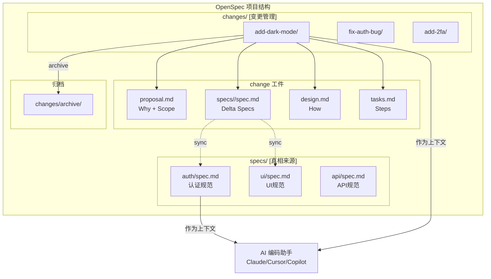

##### 组件交互架构图

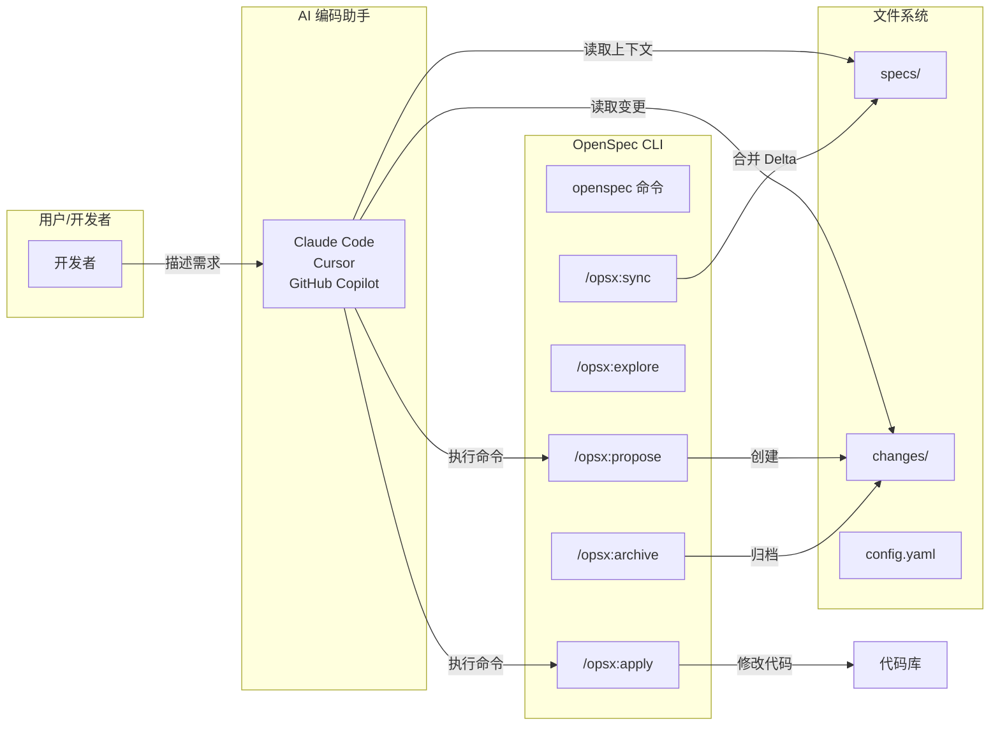

#### 3.2 核心设计原则

| 原则 | 描述 |
|-----|------|
| **真相来源(Single Source of Truth)** | specs/ 目录中的规范文件代表系统当前行为的权威记录 |
| **增量管理(Delta Management)** | 变更通过 Delta Specs 格式清晰记录新增、修改、删除的需求 |
| **工件流转(Artifact Flow)** | proposal -> specs -> design -> tasks -> implement 的渐进式工件演化 |
| **轻量集成(Lightweight Integration)** | 基于 Markdown 和 YAML 的格式，无需复杂工具链即可使用 |

#### 3.3 核心概念

| 概念 | 描述 |
|-----|------|
| **Spec（规范）** | 描述系统当前行为的文件，存储在 specs/ 目录中，是系统的"真相来源" |
| **Change（变更）** | 一个完整的变更单元，包含 proposal.md、design.md、tasks.md 和 delta specs |
| **Delta Spec（增量规范）** | 使用 ADDED/MODIFIED/REMOVED 格式描述需求变更的规范片段 |
| **Workspace（工作区）** | 支持跨多个仓库或文件夹协调规划的机制 |
| **Schema（模式）** | 定义工件的模板结构，包括 spec-driven 和 workspace-planning 两种模式 |

### 4. 系统分解与层次结构

#### 4.1 目录结构

```
openspec/
├── specs/              # 真相来源（系统当前行为）
│   └── <domain>/
│       └── spec.md
├── changes/            # 提议的修改（每个变更一个文件夹）
│   └── <change-name>/
│       ├── proposal.md     # 为什么做（Why + Scope）
│       ├── design.md       # 如何做（How）
│       ├── tasks.md        # 具体步骤（Steps）
│       └── specs/          # Delta specs（变更内容）
│           └── <domain>/
│               └── spec.md
└── config.yaml         # 项目配置（可选）
```

#### 4.2 组件职责

| 组件 | 职责 |
|-----|------|
| **specs/ 目录** | 存储系统的当前行为规范，作为"真相来源"。按领域(domain)组织，每个领域一个 spec.md 文件。描述系统"是什么"而非"如何实现"。 |
| **changes/ 目录** | 管理变更提案和实现过程。每个变更创建一个独立的子目录，包含 proposal.md、design.md、tasks.md 和 delta specs。 |
| **config.yaml** | 项目级配置文件，定义使用的 schema、编辑器设置等可选配置。 |
| **Workspace** | 工作区配置，支持跨多仓库协调。包含 workspace.yaml（共享工作区身份和链接名称）和 local.yaml（本地路径配置）。 |

##### Delta Specs 合并流程图

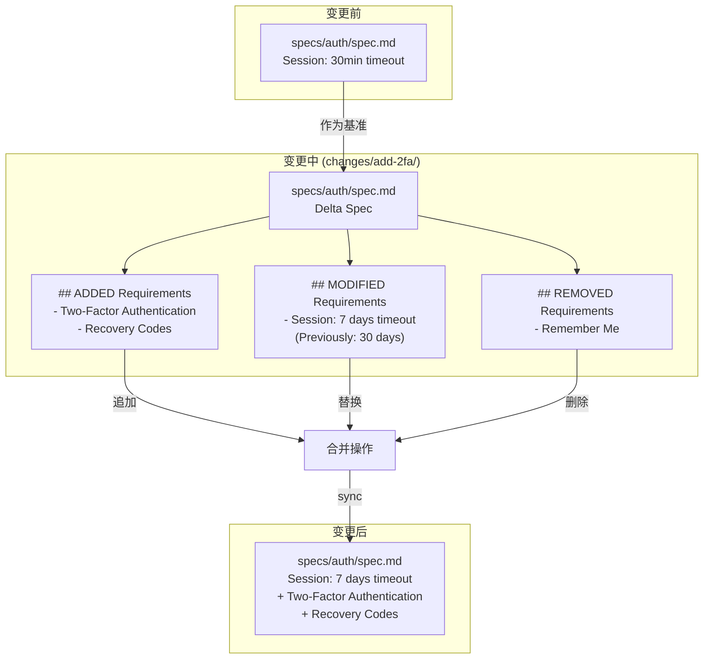

### 5. 模块与组件设计

#### 5.1 CLI 命令模块

**Core Profile 命令集**：

| 命令 | 描述 | 阶段 |
|-----|------|------|
| `/opsx:propose` | 创建变更和规划工件。启动一个新的变更提案，生成 proposal.md 和相关工件模板。 | 规划 |
| `/opsx:explore` | 探索和调查。在实现前深入理解代码库和需求，可以独立于变更流程使用。 | 调研 |
| `/opsx:apply` | 实现任务。根据 design.md 和 tasks.md 执行实际的代码修改。 | 实现 |
| `/opsx:sync` | 同步 delta specs。将变更后的 delta specs 合并回主 specs 目录。 | 同步 |
| `/opsx:archive` | 归档变更。完成变更后将 changes/ 目录中的变更移动到归档位置。 | 归档 |

##### CLI 命令流程图

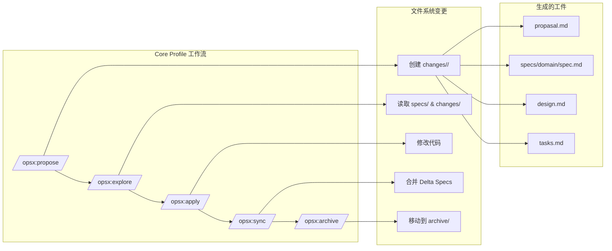

##### Workspace 跨仓库协调架构图

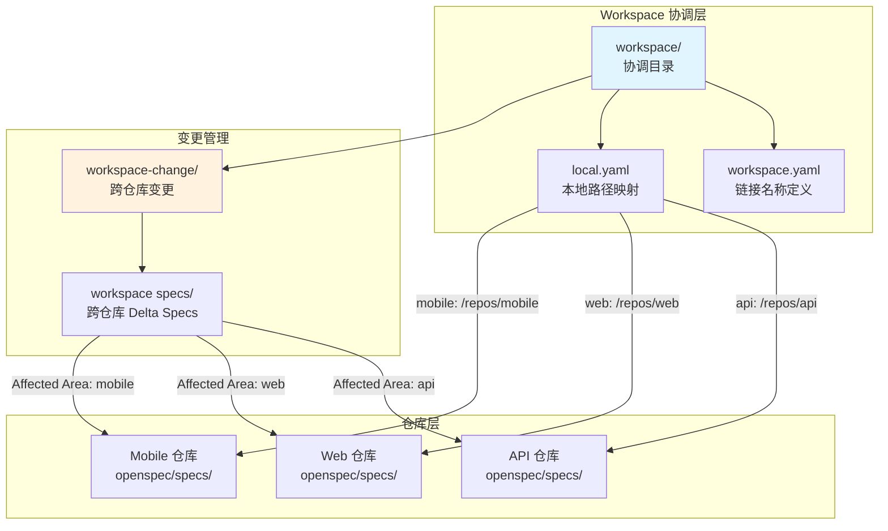

#### 5.2 模板系统

OpenSpec 提供两种 Schema 模式：

| Schema | 描述 | 模板文件 |
|--------|------|---------|
| **spec-driven** | 标准规范驱动模式，适用于单仓库项目 | proposal.md, spec.md, design.md, tasks.md |
| **workspace-planning** | 工作区规划模式，适用于跨多仓库协调项目 | proposal.md, spec.md, design.md, tasks.md |

#### 5.3 技术栈

| 类型 | 技术 |
|-----|------|
| **编程语言** | TypeScript |
| **核心依赖** | [不确定] 需查看 package.json |
| **构建工具** | [不确定] 需查看项目配置 |

---

## 三、核心工作流

### 6. 工作流哲学

#### 6.1 核心理念

OpenSpec 采用 **Actions not phases** 的理念，传统工作流强制你通过阶段：规划，然后实现，然后完成。但实际工作并不总是整齐地划分为阶段。

```
传统模式（阶段锁定）：

  PLANNING ────────► IMPLEMENTING ────────► DONE
      │                    │
      │   "无法返回"       │
      └────────────────────┘

OpenSpec 模式（流动操作）：

  proposal ──► specs ──► design ──► tasks ──► implement
```

#### 6.2 工作模式

| 模式 | 流程 | 描述 |
|-----|------|------|
| **完整变更流程** | propose -> explore -> design -> apply -> sync -> archive | 标准流程，适用于需要完整文档记录的重要变更 |
| **快速探索** | explore | 独立使用 explore 命令调研代码库，无需创建完整变更流程 |
| **迭代优化** | propose -> apply -> sync -> (返回 propose 继续优化) | 支持在实现过程中发现新需求后返回规划阶段 |

#### 6.3 关键用例运行视图

##### 用例1：标准功能开发流程

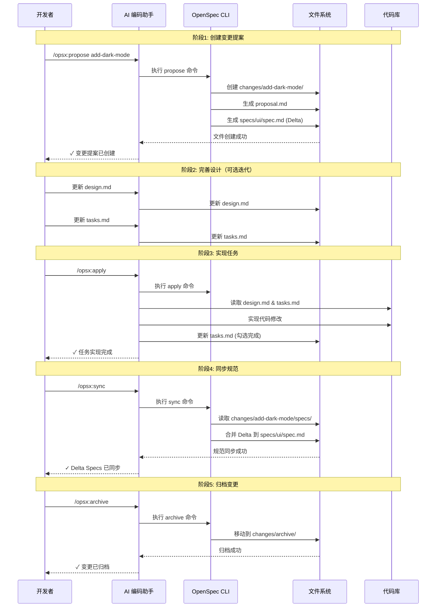

##### 用例2：探索性开发流程

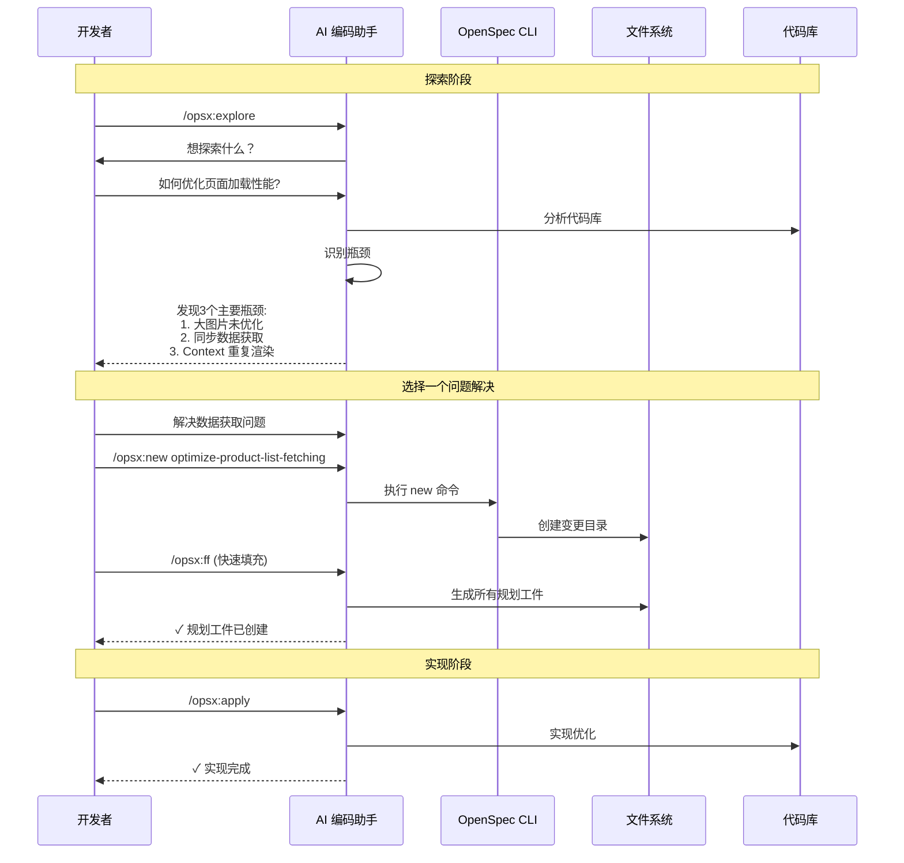

##### 用例3：跨仓库协调流程 (Workspace)

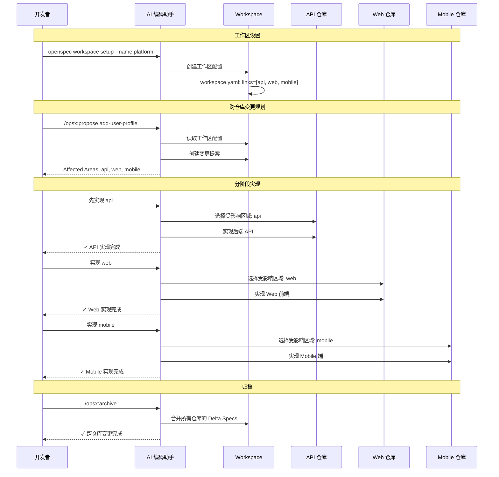

##### 工件流转状态图

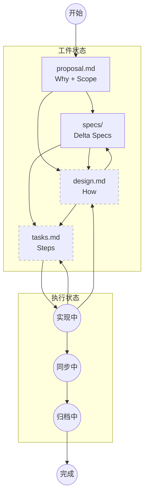

### 7. 核心命令详解

#### 7.1 命令列表

| 命令 | 用途 | 输入 | 输出 |
|-----|------|------|------|
| `/opsx:propose` | 创建变更提案 | 变更描述、目标领域 | changes/\<name\>/proposal.md, delta 文件 |
| `/opsx:explore` | 探索和调研 | 调研问题、目标范围 | 调研结果（可选择性保存） |
| `/opsx:apply` | 实现变更任务 | design.md, tasks.md | 代码修改、更新后的 delta specs |
| `/opsx:sync` | 同步 delta specs | changes/\<name\>/specs/ | 更新后的 specs/ 目录 |
| `/opsx:archive` | 归档变更 | 已完成的变更目录 | 归档记录 |

#### 7.2 典型变更流程

```
1. /opsx:propose     - 创建变更提案
2. /opsx:explore     - 深入调研（可选）
3. 更新 design.md    - 完善设计
4. /opsx:apply       - 实现任务
5. /opsx:sync        - 同步规范
6. /opsx:archive     - 归档变更
```

### 8. Delta Specs 机制

#### 8.1 格式说明

Delta Specs 使用三种标记描述需求变更：

```markdown
# Delta for <Domain>

## ADDED Requirements
### Requirement: <New Requirement Name>
<requirement description>

#### Scenario: <scenario name>
- **WHEN** <condition>
- **THEN** <expected outcome>

## MODIFIED Requirements
### Requirement: <Existing Requirement Name>
<modified requirement description>

## REMOVED Requirements
### Requirement: <Requirement to Remove>
<reason for removal>
```

| Section | 含义 | 归档时操作 |
|---------|------|----------|
| **ADDED Requirements** | 新增的需求 | 追加到主规范 |
| **MODIFIED Requirements** | 修改的现有需求 | 替换现有需求 |
| **REMOVED Requirements** | 删除的需求 | 从主规范中删除 |

#### 8.2 合并流程

```
1. 在 changes/<name>/specs/ 目录中创建 delta spec 文件
2. 使用 ADDED/MODIFIED/REMOVED 格式描述变更内容
3. 执行 /opsx:apply 实现代码修改
4. 执行 /opsx:sync 将 delta specs 合并回 specs/ 目录
5. 主 specs 文件更新，反映新的系统行为
```

#### 8.3 Delta Specs 的优势

| 优势 | 描述 |
|-----|------|
| **清晰记录变更内容** | 通过 ADDED/MODIFIED/REMOVED 分类，一目了然地了解变更影响 |
| **支持增量更新** | 无需重写整个规范文件，只需描述变化部分 |
| **便于代码审查** | 审查者可以快速理解变更范围和影响 |
| **AI 助手友好** | 结构化格式便于 AI 理解和生成规范内容 |
| **历史可追溯** | 变更记录保存在 changes 目录，便于回溯历史决策 |

### 9. 工件流转

#### 9.1 工件类型

| 工件 | 角色 | 描述 |
|-----|------|------|
| **proposal.md** | Why + Scope | 描述变更的原因和范围 |
| **specs/** | What | 描述系统行为规范 |
| **design.md** | How | 描述技术设计方案 |
| **tasks.md** | Steps | 描述具体实现步骤 |

#### 9.2 工件依赖关系

```
proposal ──────► specs ──────► design ──────► tasks ──────► implement
    │               │             │              │
   why            what           how          steps
 + scope        changes       approach      to take
```

##### 工件依赖与迭代关系图

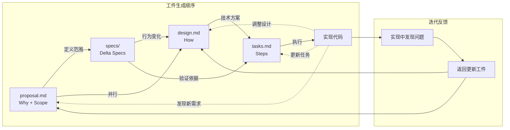

##### Schema 模式对比图

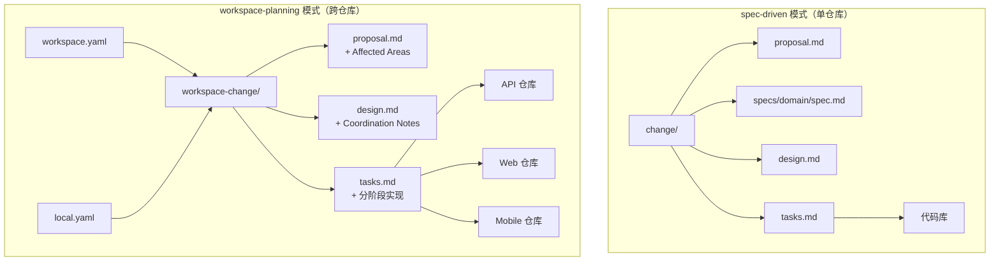

**依赖说明**：
- proposal.md 定义变更范围，指导 delta specs 的创建
- delta specs 描述行为变化，影响 design.md 的设计决策
- design.md 的技术方案决定 tasks.md 的任务分解
- tasks.md 的任务项指导实际代码实现

---

## 四、模板文件详解

### 10. Spec-Driven 模板

#### 10.1 proposal.md 模板

```markdown
## Why
<!-- 描述共享的产品目标、问题或机会 -->

## What Changes
<!-- 变更内容列表 -->
-

## Affected Areas
<!-- 受影响的区域 -->
-

## Capabilities
### New Capabilities
<!-- 新增能力 -->
-

### Modified Capabilities
<!-- 修改的能力 -->
-

## Impact
<!-- 影响范围 -->
- Workspace planning:
- Linked repos or folders:
- User-facing behavior:
```

#### 10.2 spec.md 模板（Delta 格式）

```markdown
## ADDED Requirements

### Requirement: <!-- 需求名称 -->
<!-- 需求描述 -->

#### Scenario: <!-- 场景名称 -->
- **WHEN** <!-- 条件 -->
- **THEN** <!-- 预期结果 -->
```

#### 10.3 design.md 模板

```markdown
## Context
<!-- 背景和当前状态 -->

## Goals / Non-Goals
**Goals:**
<!-- 设计目标 -->

**Non-Goals:**
<!-- 明确不在范围内的事项 -->

## Decisions
<!-- 关键设计决策和理由 -->

## Risks / Trade-offs
<!-- 已知风险和权衡 -->
```

#### 10.4 tasks.md 模板

```markdown
## 1. <!-- 任务组名称 -->

- [ ] 1.1 <!-- 任务描述 -->
- [ ] 1.2 <!-- 任务描述 -->

## 2. <!-- 任务组名称 -->

- [ ] 2.1 <!-- 任务描述 -->
- [ ] 2.2 <!-- 任务描述 -->
```

### 11. Workspace-Planning 模板

Workspace-Planning 模式用于跨多仓库协调项目，与 Spec-Driven 模式有以下差异：

| 方面 | Workspace-Planning | Spec-Driven |
|-----|-------------------|-------------|
| **工作区协调** | 支持跨多仓库/文件夹协调 | 单仓库项目 |
| **受影响区域管理** | 明确跟踪 Affected Areas 和 Allowed Edit Root | 无此概念 |
| **实现时机** | 在选择受影响区域后才创建仓库本地工件 | 直接在变更目录中创建工件 |
| **协调笔记** | design.md 包含 Coordination Notes 和 Open Questions | design.md 不包含这些部分 |

#### 11.1 design.md 模板（Workspace-Planning）

```markdown
## Context
总结工作区规划上下文...

## Goals / Non-Goals
**Goals:**
-

**Non-Goals:**
- 在选择受影响区域之前创建仓库本地实现工件

## Decisions
### Decision: <标题>
<决策和理由>
考虑的替代方案: <替代方案及未选择的原因>

## Risks / Trade-offs
- <风险> -> <缓解措施>

## Coordination Notes
- Affected areas:
- Open handoffs:
- Implementation entry criteria:

## Open Questions
-
```

#### 11.2 tasks.md 模板（Workspace-Planning）

```markdown
## 1. Workspace Planning
- [ ] 1.1 确认共享产品目标和未解决的范围内问题
- [ ] 1.2 使用注册的工作区链接名称识别受影响区域
- [ ] 1.3 在选择实现区域之前审查工作区范围的规范和设计

## 2. Affected Area Implementation
- [ ] 2.1 选择一个受影响区域并在实现前确认其允许的编辑根目录
- [ ] 2.2 仅在选择区域后创建或更新仓库本地实现工件

## 3. Verification
- [ ] 3.1 验证工作区规划工件保持为真相来源
- [ ] 3.2 记录手动验收证据和后续修复
```

### 12. 模板使用示例

#### 12.1 示例：添加双因素认证功能

**proposal.md 示例**：

```markdown
## Why
当前系统仅使用用户名密码认证，安全性不足。需要添加双因素认证(2FA)功能以提升账户安全性。

## What Changes
- 添加 TOTP（基于时间的一次性密码）认证方式
- 添加备用恢复码功能
- 更新登录流程支持 2FA 验证

## Affected Areas
- auth 模块
- user 模块
- login 页面

## Capabilities
### New Capabilities
- 用户可启用/禁用 2FA
- 用户可配置 TOTP 应用
- 用户可生成备用恢复码

### Modified Capabilities
- 登录流程需支持 2FA 验证步骤
```

**spec.md 示例（Delta 格式）**：

```markdown
# Delta for Auth

## ADDED Requirements
### Requirement: Two-Factor Authentication
系统应支持基于 TOTP 的双因素认证。用户可选择启用此功能以增强账户安全。

#### Scenario: Enable 2FA
- **WHEN** 用户在安全设置中选择启用双因素认证
- **THEN** 系统生成 TOTP 密钥并显示 QR 码

#### Scenario: Login with 2FA
- **WHEN** 用户使用正确的密码登录且已启用 2FA
- **THEN** 系统提示输入验证码
- **AND** 验证码正确时完成登录

## MODIFIED Requirements
### Requirement: Session Expiration
会话超时时间从 30 天调整为 7 天（当启用 2FA 时保持 30 天）

## REMOVED Requirements
### Requirement: Remember Me
移除"记住我"选项，由 2FA 状态决定会话长度
```

**design.md 示例**：

```markdown
## Context
当前认证系统基于 JWT，仅支持用户名密码认证。

## Goals / Non-Goals
**Goals:**
- 集成 TOTP 库实现 2FA
- 保持向后兼容性

**Non-Goals:**
- SMS 验证方式
- 硬件密钥支持

## Decisions
选择 otplib 库实现 TOTP，原因是社区活跃、文档完善。

## Risks / Trade-offs
- 用户可能丢失 TOTP 应用访问 -> 提供备用恢复码
- 增加登录步骤可能影响用户体验 -> 可选择性启用
```

**tasks.md 示例**：

```markdown
## 1. 后端实现
- [ ] 1.1 添加 OTP 密钥生成和验证逻辑
- [ ] 1.2 创建 2FA 设置 API
- [ ] 1.3 修改登录 API 支持 2FA 验证

## 2. 前端实现
- [ ] 2.1 创建 2FA 设置页面
- [ ] 2.2 修改登录流程添加验证码输入
- [ ] 2.3 添加备用码显示和管理

## 3. 测试
- [ ] 3.1 添加单元测试
- [ ] 3.2 添加集成测试
- [ ] 3.3 手动验收测试
```

#### 12.2 最佳实践

| 建议 | 描述 |
|-----|------|
| **从小处开始** | 先填写 proposal.md 明确范围，再逐步完善其他工件 |
| **迭代填充** | 不需要一次性完成所有内容，可以在实现过程中不断更新 |
| **保持简洁** | 模板中的内容应该简洁明了，避免过度文档化 |
| **利用 Delta** | 充分利用 Delta Specs 的增量格式，只描述变化部分 |
| **及时同步** | 实现完成后及时执行 sync 操作，保持规范的准确性 |

---

## 五、技术评估总结

### 13. 技术优势

#### 13.1 架构优势

| 优势 | 描述 |
|-----|------|
| **轻量级设计** | 基于 Markdown 文件系统，无需复杂数据库或服务 |
| **增量式管理** | Delta Specs 格式清晰记录变更，避免全量重写 |
| **灵活的工作流** | 支持迭代式开发，无严格的阶段门控 |
| **可扩展架构** | Schema 系统支持自定义模板和工作流模式 |

#### 13.2 易用性优势

| 优势 | 描述 |
|-----|------|
| **低学习成本** | Markdown 格式人人可读，模板结构简单明了 |
| **AI 原生设计** | 专门为 AI 编码助手优化，结构化格式便于 AI 理解和生成 |
| **渐进式采用** | 可以在现有项目中逐步引入，不需要全量迁移 |
| **标准化命令** | 核心命令集设计合理，覆盖完整变更生命周期 |

#### 13.3 集成优势

| 优势 | 描述 |
|-----|------|
| **工具无关** | 可以与任何 AI 编码助手配合使用 |
| **版本控制友好** | 所有工件都是文本文件，便于 Git 管理 |
| **Workspace 支持** | 原生支持跨仓库协调，适合大型项目 |

### 14. 技术劣势与风险

#### 14.1 局限性

| 局限 | 描述 |
|-----|------|
| **依赖 AI 助手配合** | 需要 AI 编码助手支持 OpenSpec 命令才能发挥最大价值 |
| **手动维护成本** | 规范文件需要人工维护，可能存在与实际代码不同步的风险 |
| **学习曲线** | 虽然模板简单，但需要理解完整工作流才能有效使用 |

#### 14.2 潜在风险

| 风险 | 描述 |
|-----|------|
| **过度文档化风险** | 团队可能过度追求文档完善而忽视实际开发 |
| **规范漂移** | 如果不同步及时，规范可能偏离实际系统行为 |
| **小团队收益有限** | 对于小型项目或个人开发，可能增加不必要的开销 |

#### 14.3 改进方向

| 方向 | 描述 |
|-----|------|
| **自动化工具** | 可以增加更多自动化验证工具，检查规范与代码的一致性 |
| **IDE 集成** | 更好的 IDE 插件支持可以提升使用体验 |
| **规范演化** | 支持规范文件的版本管理和演化追踪 |

### 15. 适用场景建议

#### 15.1 推荐使用场景

| 场景 | 原因 |
|-----|------|
| **中大型项目开发** | 复杂代码库需要系统化的规范管理，OpenSpec 可以有效组织需求变更 |
| **AI 辅助开发团队** | 使用 Claude、Cursor 等 AI 编码助手的团队，可以最大化 OpenSpec 的价值 |
| **跨仓库项目协调** | Workspace 功能支持多仓库变更管理，适合微服务架构或 monorepo 项目 |
| **需要严格变更记录的项目** | Delta Specs 格式提供清晰的变更历史，便于审计和回溯 |

#### 15.2 不推荐使用场景

| 场景 | 原因 |
|-----|------|
| **小型个人项目** | 对于简单的个人项目，OpenSpec 可能增加不必要的流程开销 |
| **快速原型开发** | 探索性开发阶段不需要严格的规范管理，可以先编码后补充规范 |
| **不使用 AI 助手的团队** | OpenSpec 的核心价值在于与 AI 编码助手的配合，纯人工使用收益有限 |

#### 15.3 集成建议

| 建议 | 描述 |
|-----|------|
| **渐进式引入** | 先在单个模块或功能中试用，验证效果后再推广 |
| **从 proposal 开始** | 让团队先习惯填写 proposal.md，再逐步使用完整工作流 |
| **定期同步** | 建立规范的 sync 流程，确保 specs 目录保持最新 |
| **定制模板** | 根据团队需求定制模板内容，避免过度文档化 |
| **培训 AI 助手** | 确保使用的 AI 编码助手支持 OpenSpec 命令 |

##### 场景适用性评估矩阵

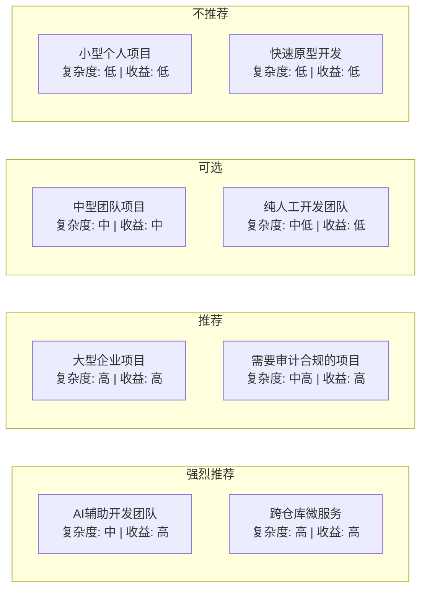

| 场景 | 复杂度 | 收益 | 推荐度 |
|-----|--------|------|--------|
| AI辅助开发团队 | 中 | 高 | ⭐⭐⭐⭐⭐ |
| 跨仓库微服务 | 高 | 高 | ⭐⭐⭐⭐⭐ |
| 大型企业项目 | 高 | 高 | ⭐⭐⭐⭐ |
| 需要审计合规的项目 | 中高 | 高 | ⭐⭐⭐⭐ |
| 中型团队项目 | 中 | 中 | ⭐⭐⭐ |
| 纯人工开发团队 | 中低 | 低 | ⭐⭐ |
| 小型个人项目 | 低 | 低 | ⭐ |
| 快速原型开发 | 低 | 低 | ⭐ |

##### 技术评估

| 维度 | 评分 | 说明 |
|-----|------|------|
| **易用性** | ★★★★☆ | Markdown 格式简单，模板结构清晰 |
| **扩展性** | ★★★★☆ | Schema 系统支持自定义模板 |
| **AI 集成** | ★★★★★ | 专为 AI 编码助手设计 |
| **文档质量** | ★★★★☆ | 官方文档完善，示例丰富 |
| **社区活跃度** | ★★★★★ | 48.8K stars，活跃开发 |
| **学习曲线** | ★★★☆☆ | 需要理解完整工作流 |

---

## 附录

### A. 参考资源

- **官方文档**：https://openspec.dev/
- **GitHub 仓库**：https://github.com/Fission-AI/OpenSpec
- **Getting Started**：https://github.com/Fission-AI/OpenSpec/blob/main/docs/getting-started.md
- **Concepts**：https://github.com/Fission-AI/OpenSpec/blob/main/docs/concepts.md
- **Workflows**：https://github.com/Fission-AI/OpenSpec/blob/main/docs/workflows.md

### B. 术语表

| 术语 | 定义 |
|-----|------|
| **Artifact（工件）** | 变更中的文档（proposal、design、tasks 或 delta specs） |
| **Archive（归档）** | 完成变更并将 deltas 合并到主规范的过程 |
| **Change（变更）** | 对系统的提议修改，打包为包含工件的文件夹 |
| **Delta Spec（增量规范）** | 描述相对于当前规范的变更（ADDED/MODIFIED/REMOVED）的规范 |
| **Domain（领域）** | 规范的逻辑分组（如 auth/、payments/） |
| **Requirement（需求）** | 系统必须具有的特定行为 |
| **Scenario（场景）** | 需求的具体示例，通常使用 Given/When/Then 格式 |
| **Schema（模式）** | 工件类型及其依赖关系的定义 |
| **Spec（规范）** | 描述系统行为的规格说明，包含需求和场景 |
| **Source of truth（真相来源）** | openspec/specs/ 目录，包含当前约定的行为 |

### C. 调研信息

- **调研人**：Claude Code Agent
- **调研时间**：2026-05-18
- **调研版本**：[不确定]
- **数据来源**：GitHub API、官方文档

### D. 不确定字段

| 字段 | 原因 |
|-----|------|
| `dependencies` | 需查看 package.json 文件 |
| `build_tools` | 需查看项目配置 |
| `core_modules` | 需分析源代码结构 |

---

*报告生成时间：2026-05-18*
