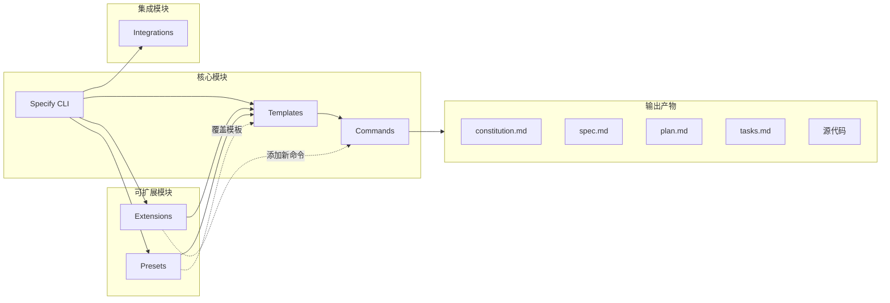
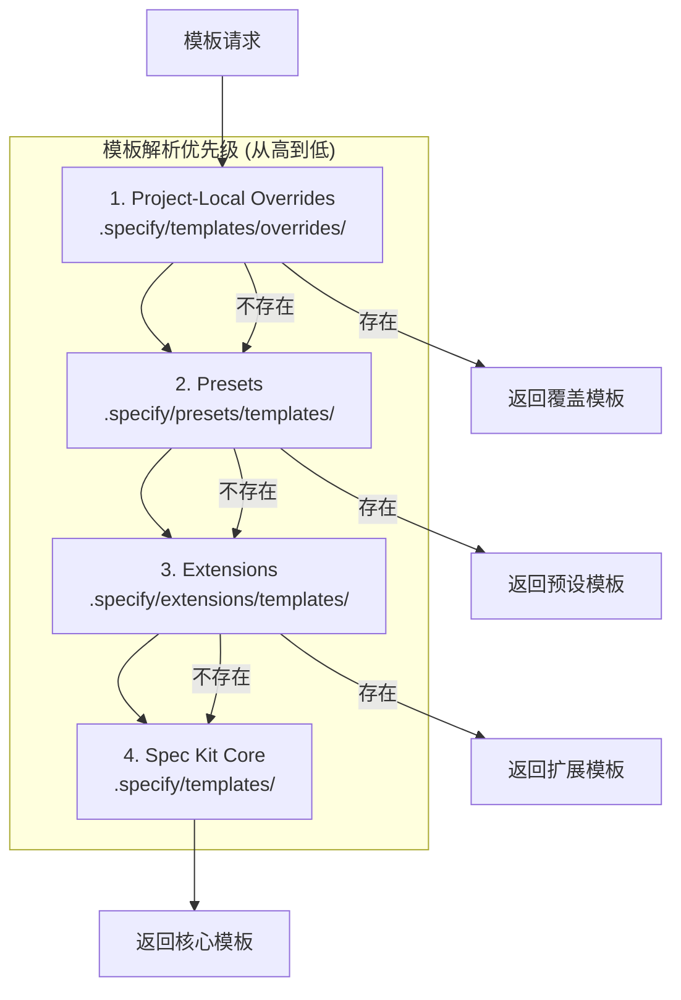
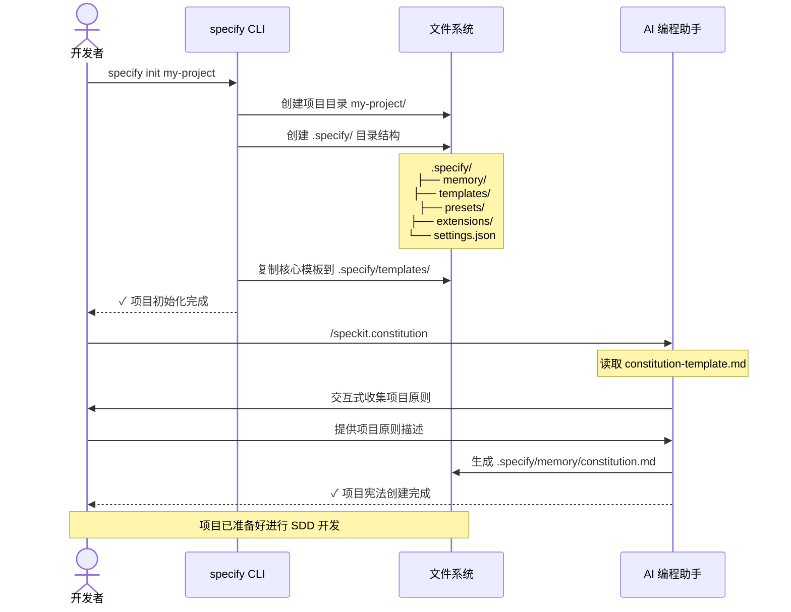
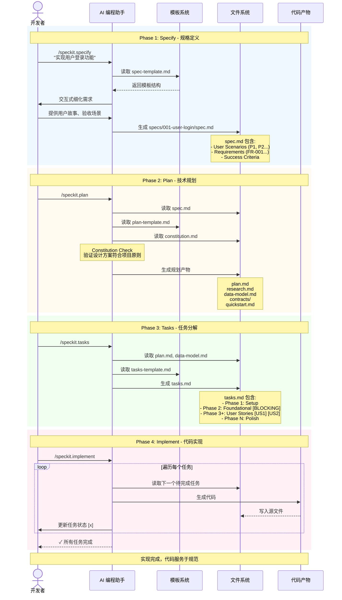
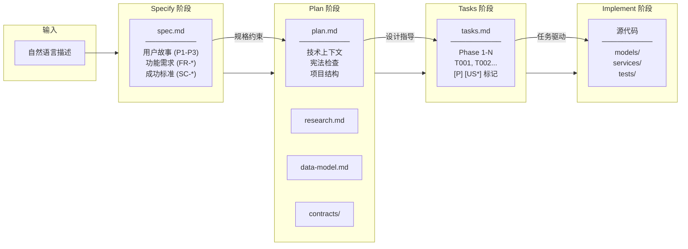
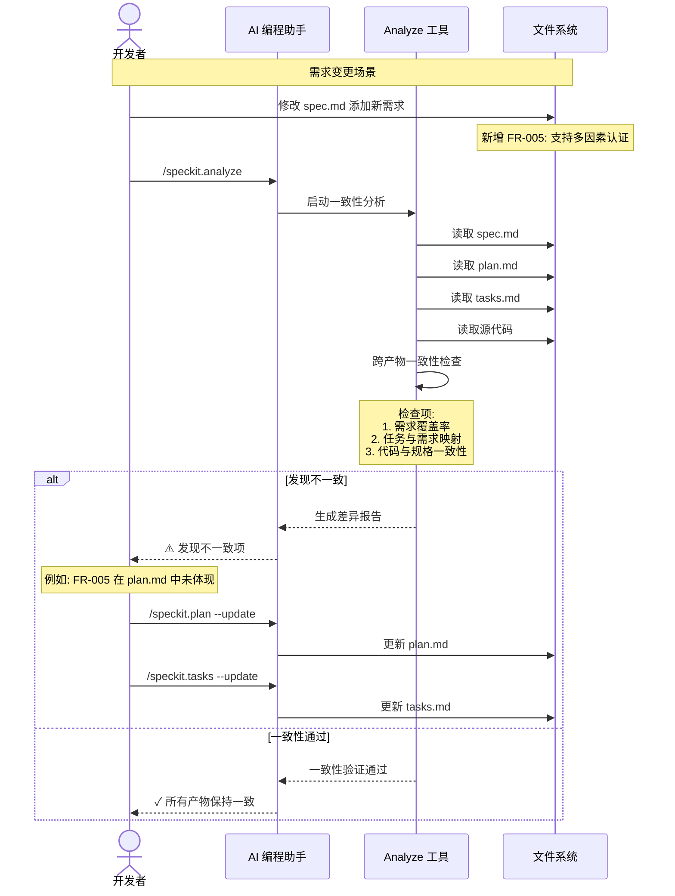
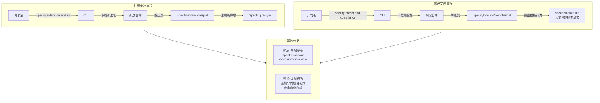

# spec-kit 技术调研报告

> **调研时间**：2026-05-18
> **调研版本**：基于 GitHub 主分支最新代码
> **GitHub**：https://github.com/github/spec-kit

---

## 一、概述与背景

### 1. 项目概述

#### 1.1 项目定位与核心价值

| 项目 | 信息 |
|-----|------|
| **项目名称** | spec-kit 🌱 |
| **GitHub** | https://github.com/github/spec-kit |
| **Slogan** | Build high-quality software faster. |
| **核心价值** | 开源工具集，实现 **Spec-Driven Development（规范驱动开发）**，让规范可执行，代码服务于规范 |

**一句话描述**：spec-kit 让开发者专注于产品场景和可预测的结果，而非"vibe coding"每一行代码。

#### 1.2 项目背景与起源

- **开发者**：GitHub
- **所属领域**：软件开发方法论工具 / AI 编程助手集成
- **发展历程**：随着 AI 编程能力提升，GitHub 开发此工具解决 AI 时代软件开发中的问题

#### 1.3 解决的核心问题

**痛点**：
传统开发中"代码是王"，规范只是脚手架。AI 编程助手普及后，开发者往往直接让 AI 写代码而没有清晰的规范，导致：
- 代码质量不可控
- 难以维护
- 缺乏系统性设计
- 技术债务累积

**解决方案**：
**Spec-Driven Development（SDD）反转权力结构**：
- 规范不服务于代码，**代码服务于规范**
- PRD 不是实现指南，而是**生成实现的源头**
- 技术计划不是指导编码的文档，而是**产生代码的精确定义**

#### 1.4 目标用户与使用场景

**目标用户**：
- 使用 AI 编程助手（GitHub Copilot、Cursor、Claude Code 等）的开发者
- 需要规范驱动开发的团队
- 希望提高代码质量和可维护性的项目

**典型使用场景**：
| 场景 | 描述 |
|-----|------|
| Greenfield 开发 | 从零开始构建新项目 |
| 技术探索 | 并行探索多种技术方案 |
| Brownfield 开发 | 迭代增强现有项目 |
| 团队协作 | 规范管理和版本控制 |

#### 1.5 项目成熟度评估

| 指标 | 数据 |
|-----|------|
| Python 文件数 | 139 |
| Markdown 文件数 | 100 |
| Python 代码行数 | ~22,000 |
| 社区扩展 | 30+ |
| 支持的 AI 编程助手 | 30+ |
| 许可证 | MIT |
| 文档体系 | 完善（README.md, AGENTS.md, CONTRIBUTING.md, CHANGELOG.md 等） |

---

### 2. 设计动机与目标

#### 2.1 设计动机

**为什么开发这个项目？**

> "For decades, code has been king. Specifications served code—they were the scaffolding we built and then discarded once the 'real work' of coding began."

**三个趋势使 SDD 成为必要**：

1. **AI 能力达到阈值**：自然语言规范可以可靠地生成工作代码
2. **软件复杂度指数增长**：现代系统整合数十个服务、框架和依赖，手动保持对齐越来越难
3. **变化节奏加速**：需求变化比以往更快，pivot 成为常态而非例外

#### 2.2 与竞品的差异化定位

| 特点 | spec-kit | 传统开发方式 |
|-----|---------|------------|
| 规范地位 | 主要产物，代码是表达形式 | 脚手架，代码是真理 |
| 规范可执行性 | 直接生成工作实现 | 仅作指导参考 |
| AI 编程助手 | 支持 30+ 工具，不绑定 | 无专门支持 |
| 模板体系 | 完整的模板和扩展机制 | 无或零散 |
| 方法论 | SDD（规范驱动开发） | 无统一方法论 |

#### 2.3 核心设计目标

| 优先级 | 目标 | 描述 |
|-------|-----|------|
| 1 | 意图驱动开发 | 规范定义"做什么"而非"怎么做" |
| 2 | 可执行规范 | 规范必须精确、完整、无歧义，能生成工作系统 |
| 3 | 持续精炼 | 一致性验证持续进行，非一次性检查 |
| 4 | 研究驱动上下文 | 研究代理收集技术选项、性能影响、组织约束 |
| 5 | 双向反馈 | 生产现实反馈到规范演进 |

---

## 二、系统架构

### 4. 架构设计

#### 4.1 架构风格

spec-kit 采用 **CLI 工具 + 模板引擎 + 扩展插件** 的分层架构风格：

```
┌─────────────────────────────────────────────────────────────────────┐
│                         AI 编程助手层                                 │
│   (Claude Code / Cursor / Copilot / Codex CLI / ...)               │
│                         ↓ 斜杠命令调用                               │
├─────────────────────────────────────────────────────────────────────┤
│                      Integration 集成层                              │
│              (integrations/ - 30+ AI 编程助手适配)                    │
├─────────────────────────────────────────────────────────────────────┤
│                       CLI 工具层                                      │
│                  (src/specify_cli/)                                  │
│         init / extension / preset / integration 命令                 │
├─────────────────────────────────────────────────────────────────────┤
│                     模板系统层                                        │
│            (templates/ + commands/)                                  │
│     spec / plan / constitution / tasks / clarify / analyze          │
├─────────────────────────────────────────────────────────────────────┤
│                    扩展与预设层                                       │
│         extensions/ (新功能)  |  presets/ (行为定制)                 │
├─────────────────────────────────────────────────────────────────────┤
│                      项目文件层                                       │
│        .specify/ 目录（规范文件、模板覆盖、项目配置）                   │
└─────────────────────────────────────────────────────────────────────┘
```

#### 4.2 系统架构图（Mermaid）

```mermaid
flowchart TB
    subgraph AI_Layer["AI 编程助手层"]
        CC["Claude Code"]
        CUR["Cursor"]
        COP["GitHub Copilot"]
        COD["Codex CLI"]
        OTHER["其他 30+ 工具..."]
    end

    subgraph Integration_Layer["集成层"]
        INT["integrations/"]
        SKILLS["Skills 文件<br/>(.md)"]
        CONFIG["集成配置<br/>(settings.json)"]
    end

    subgraph CLI_Layer["CLI 工具层"]
        CLI["specify CLI<br/>(Python)"]
        INIT["init 命令"]
        EXT["extension 命令"]
        PRE["preset 命令"]
        INTL["integration 命令"]
    end

    subgraph Template_Layer["模板层"]
        TPL["templates/"]
        SPEC["spec-template.md"]
        PLAN["plan-template.md"]
        CONST["constitution-template.md"]
        TASKS["tasks-template.md"]
        CMD["commands/"]
    end

    subgraph Extension_Layer["扩展与预设层"]
        EXT_SYS["extensions/<br/>添加新功能"]
        PRE_SYS["presets/<br/>定制行为"]
        CAT_EXT["catalog.community.json"]
        CAT_PRE["catalog.community.json"]
    end

    subgraph Project_Layer["项目文件层"]
        DOT_SPEC[".specify/"]
        MEMORY["memory/<br/>constitution.md"]
        SPECS["specs/<br/>spec.md"]
        PLANS["plan.md<br/>research.md<br/>data-model.md"]
        TASKS_F["tasks.md"]
    end

    AI_Layer --> Integration_Layer
    Integration_Layer --> CLI_Layer
    CLI_Layer --> Template_Layer
    CLI_Layer --> Extension_Layer
    Template_Layer --> Project_Layer
    Extension_Layer --> Template_Layer
    Extension_Layer --> Project_Layer
```



#### 4.3 模块依赖关系



**依赖说明**：

| 依赖关系 | 描述 |
|---------|------|
| CLI → Templates | CLI 读取模板文件生成规范产物 |
| CLI → Extensions/Presets | CLI 管理扩展和预设的安装、列表 |
| Extensions → Templates | 扩展可添加新模板和命令 |
| Presets → Templates | 预设可覆盖现有模板行为 |
| Commands → Output | 命令执行生成各类产物文件 |

#### 4.4 模板优先级机制



---

### 5.1 核心模块划分

| 模块 | 职责 | 位置 |
|-----|------|-----|
| **Specify CLI** | 命令行工具，项目初始化、扩展/预设管理 | `src/specify_cli/` |
| **Templates** | 核心模板文件（spec, plan, constitution, tasks） | `templates/` |
| **Commands** | AI 代理命令文件，定义各阶段工作流程 | `templates/commands/` |
| **Extensions** | 扩展系统，添加新功能和新命令 | `extensions/` |
| **Presets** | 预设系统，自定义现有工作流程行为 | `presets/` |
| **Integrations** | AI 编程助手集成配置 | `integrations/` |

```
spec-kit/
├── src/specify_cli/     # CLI 工具核心代码 (Python)
├── templates/           # 核心模板文件
│   ├── spec-template.md
│   ├── plan-template.md
│   ├── constitution-template.md
│   ├── tasks-template.md
│   ├── checklist-template.md
│   └── commands/        # AI 代理命令定义
│       ├── specify.md
│       ├── plan.md
│       ├── tasks.md
│       ├── implement.md
│       ├── constitution.md
│       ├── clarify.md
│       ├── analyze.md
│       └── checklist.md
├── extensions/          # 扩展系统
│   ├── EXTENSION-API-REFERENCE.md
│   ├── EXTENSION-DEVELOPMENT-GUIDE.md
│   ├── catalog.community.json
│   └── git/, selftest/, template/
├── presets/             # 预设系统
│   ├── ARCHITECTURE.md
│   ├── catalog.community.json
│   └── lean/, scaffold/, self-test/
├── integrations/        # AI 编程助手集成
├── docs/                # 文档
├── tests/               # 测试代码
├── workflows/           # 工作流配置
├── scripts/             # 辅助脚本 (bash/powershell)
├── spec-driven.md       # SDD 方法论详细说明
├── AGENTS.md            # AI 代理集成说明
├── pyproject.toml       # Python 项目配置
└── README.md            # 项目说明
```

---

## 三、核心用例运行流程

### 6. 核心工作流程

SDD 的核心工作流程分为 **5 个阶段**：

```
┌─────────────────┐
│  Constitution   │ ─── 创建项目核心原则和开发指南
│  /speckit.constitution │
└────────┬────────┘
         │
         ▼
┌─────────────────┐
│   Specify       │ ─── 从自然语言描述生成功能规格说明书
│  /speckit.specify │
└────────┬────────┘
         │
         ▼
┌─────────────────┐
│     Plan        │ ─── 将规格说明书转化为技术实现计划
│   /speckit.plan │      (研究、数据模型、契约、快速入门)
└────────┬────────┘
         │
         ▼
┌─────────────────┐
│     Tasks       │ ─── 从计划生成可执行的任务列表
│  /speckit.tasks │
└────────┬────────┘
         │
         ▼
┌─────────────────┐
│   Implement     │ ─── 执行任务列表，生成代码实现
│/speckit.implement│
└─────────────────┘
```

### 各阶段详细说明

| 阶段 | 命令 | 输入 | 输出 | 描述 |
|-----|------|-----|------|------|
| Constitution | `/speckit.constitution` | 自然语言原则描述 | `.specify/memory/constitution.md` | 定义项目的核心原则和开发指南 |
| Specify | `/speckit.specify` | 自然语言功能描述 | `specs/NNN-feature-name/spec.md` | 生成结构化的功能规格说明书 |
| Plan | `/speckit.plan` | spec.md + 技术栈描述 | plan.md, research.md, data-model.md, contracts/, quickstart.md | 技术实现计划和设计文档 |
| Tasks | `/speckit.tasks` | plan.md + 设计文档 | tasks.md | 可执行的任务列表 |
| Implement | `/speckit.implement` | tasks.md | 源代码文件 | 执行任务生成代码 |

### 7. 关键用例运行视图

#### 7.1 用例一：新项目初始化

**场景描述**：开发者从零开始创建一个新项目，建立 spec-kit 工作环境。



**产物结构**：
```
my-project/
├── .specify/
│   ├── memory/
│   │   └── constitution.md    # 项目宪法
│   ├── templates/             # 模板覆盖
│   ├── presets/               # 已安装预设
│   ├── extensions/            # 已安装扩展
│   └── settings.json          # 项目配置
└── specs/                     # 功能规格目录（待创建）
```

#### 7.2 用例二：完整功能开发流程

**场景描述**：从自然语言功能描述到代码实现的完整 SDD 流程。



**产物流转图**：



#### 7.3 用例三：规范迭代与一致性验证

**场景描述**：当需求变更时，更新规范并验证产物一致性。



#### 7.4 用例四：扩展与预设安装

**场景描述**：通过扩展添加新功能，通过预设定制工作流行为。



---

## 四、核心技术实现

### 8. 核心模板文件详解

> 📁 模板文件已复制到：`./templates/`（相对于本报告所在目录）

#### 8.1 spec-template.md - 功能规格说明书模板

**用途**：从自然语言功能描述生成结构化的功能规格说明书

**核心章节**：

| 章节 | 必需性 | 描述 |
|-----|-------|------|
| User Scenarios & Testing | 必需 | 用户场景与测试，按优先级排序的用户故事 |
| Requirements | 必需 | 功能需求列表，编号为 FR-001, FR-002... |
| Key Entities | 可选 | 关键实体定义 |
| Success Criteria | 必需 | 成功标准，可测量、技术无关 |
| Assumptions | 可选 | 假设和依赖 |

**关键特性**：
- 用户故事按优先级排序（P1, P2, P3...），每个故事独立可测试
- 使用 Given-When-Then 格式的验收场景
- 支持 `[NEEDS CLARIFICATION: specific question]` 标记未明确项（最多 3 个）
- 自动生成质量检查清单

**示例结构**：
```markdown
# Feature Specification: [FEATURE NAME]

## User Scenarios & Testing *(mandatory)*

### User Story 1 - [Brief Title] (Priority: P1)

**Why this priority**: [Explain the value]

**Independent Test**: [How to test independently]

**Acceptance Scenarios**:
1. **Given** [initial state], **When** [action], **Then** [expected outcome]

## Requirements *(mandatory)*

### Functional Requirements
- **FR-001**: System MUST [specific capability]
- **FR-002**: System MUST [specific capability]

## Success Criteria *(mandatory)*
- **SC-001**: [Measurable metric]
```

---

#### 8.2 plan-template.md - 技术实现计划模板

**用途**：将功能规格说明书转化为技术实现计划

**核心章节**：

| 章节 | 描述 |
|-----|------|
| Summary | 摘要，提取自功能规格 |
| Technical Context | 技术上下文（语言、依赖、存储、测试、平台等） |
| Constitution Check | 宪法检查，作为开发前的质量门禁 |
| Project Structure | 项目结构，支持单项目/Web应用/移动应用 |
| Complexity Tracking | 复杂度追踪，记录违反宪法的设计决策 |

**Phase 划分**：
- **Phase 0**: Outline & Research - 解决所有 NEEDS CLARIFICATION
- **Phase 1**: Design & Contracts - 生成数据模型、契约、快速入门

**项目结构选项**：
```
# Option 1: Single project (DEFAULT)
src/
├── models/
├── services/
├── cli/
└── lib/
tests/
├── contract/
├── integration/
└── unit/

# Option 2: Web application (frontend + backend)
backend/src/, frontend/src/

# Option 3: Mobile + API
api/src/, ios/src/ or android/src/
```

---

#### 8.3 constitution-template.md - 项目宪法模板

**用途**：定义项目的核心原则和治理规则

**核心章节**：

| 章节 | 描述 |
|-----|------|
| Core Principles | 核心原则（通常 5-7 条） |
| Additional Sections | 附加约束（安全、性能、合规等） |
| Governance | 治理规则（修订程序、版本策略、合规检查） |

**原则格式**：
```markdown
### [PRINCIPLE_NAME]

[PRINCIPLE_DESCRIPTION]

- 使用 MUST/SHOULD 等声明性语言
- 原则可测试、可验证

**Version**: 2.1.1 | **Ratified**: 2025-06-13 | **Last Amended**: 2025-07-16
```

---

#### 8.4 tasks-template.md - 任务列表模板

**用途**：从技术实现计划生成可执行的任务列表

**Phase 划分**：

| Phase | 描述 | 特点 |
|-------|------|------|
| Phase 1: Setup | 项目初始化 | 基础结构搭建 |
| Phase 2: Foundational | 基础设施 | **阻塞点**，完成后才能开始用户故事 |
| Phase 3+: User Stories | 用户故事实现 | 按故事组织，独立可测试 |
| Phase N: Polish | 收尾工作 | 文档、优化、安全加固 |

**任务格式**：
```
- [ ] T001 [P] [US1] Create [Entity] model in src/models/[entity].py
       │     │      │
       │     │      └── 用户故事编号
       │     └── 可并行执行标记
       └── 任务编号
```

**执行策略**：
- **MVP First**：只完成 Setup + Foundational + User Story 1
- **Incremental Delivery**：逐个添加用户故事，每个故事独立部署
- **Parallel Team**：多人并行处理不同用户故事

---

### 10. API与扩展机制

#### 10.1 命令行接口

**核心命令**：

| 命令 | 描述 |
|-----|------|
| `specify init <project-name>` | 初始化新项目 |
| `specify init .` | 在当前目录初始化 |
| `specify extension list` | 列出已安装扩展 |
| `specify extension add <name>` | 安装扩展 |
| `specify preset list` | 列出已安装预设 |
| `specify preset add <name>` | 安装预设 |
| `specify integration list` | 列出支持的 AI 编程助手 |

**斜杠命令（Slash Commands）**：

| 命令 | 技能名称 | 描述 |
|-----|---------|------|
| `/speckit.constitution` | `speckit-constitution` | 创建/更新项目宪法 |
| `/speckit.specify` | `speckit-specify` | 定义功能规格 |
| `/speckit.plan` | `speckit-plan` | 创建技术实现计划 |
| `/speckit.tasks` | `speckit-tasks` | 生成任务列表 |
| `/speckit.implement` | `speckit-implement` | 执行任务生成代码 |
| `/speckit.clarify` | `speckit-clarify` | 澄清规格不明确之处 |
| `/speckit.analyze` | `speckit-analyze` | 跨产物一致性分析 |
| `/speckit.checklist` | `speckit-checklist` | 生成质量检查清单 |

#### 10.3 扩展机制

**优先级顺序（从高到低）**：

| 优先级 | 组件类型 | 位置 |
|-------|---------|------|
| 1（最高） | Project-Local Overrides | `.specify/templates/overrides/` |
| 2 | Presets | `.specify/presets/templates/` |
| 3 | Extensions | `.specify/extensions/templates/` |
| 4（最低） | Spec Kit Core | `.specify/templates/` |

**Extensions vs Presets**：

| 维度 | Extensions | Presets |
|-----|-----------|---------|
| 用途 | 添加新功能 | 自定义现有行为 |
| 示例 | Jira 集成、代码审查 | 合规格式、领域术语 |
| 命令 | `specify extension add` | `specify preset add` |

**社区生态**：
- `extensions/catalog.community.json` - 社区扩展目录
- `presets/catalog.community.json` - 社区预设目录

---

### 11. 代码质量分析

#### 11.1 代码规模与结构

| 指标 | 数据 |
|-----|------|
| Python 文件数 | 139 |
| Markdown 文件数 | 100 |
| Python 代码总行数 | ~22,000 |
| 主要编程语言 | Python 3.11+ |

#### 11.3 测试体系

- **测试框架**：pytest
- **覆盖率工具**：pytest-cov
- **测试类型**：单元测试、集成测试

#### 11.4 代码规范

- 使用 `pyproject.toml` 管理项目依赖
- 遵循 Python 编码规范
- 完善的文档体系

---

## 五、技术评估总结

### 15. 技术评估

#### 15.1 技术优势

| 维度 | 优势 |
|-----|------|
| **方法论** | 规范驱动开发方法论先进，适合 AI 时代软件开发 |
| **模板体系** | 完善的模板体系，覆盖从需求到实现的完整流程 |
| **兼容性** | 支持 30+ AI 编程助手，不绑定特定工具 |
| **扩展性** | 灵活的扩展和预设机制，支持深度自定义 |
| **生态** | 文档完善，社区活跃，开源免费 |
| **开源** | MIT 许可证，可自由使用和修改 |

#### 15.2 技术劣势与风险

| 维度 | 劣势/风险 |
|-----|---------|
| **学习曲线** | 较陡峭，需要理解 SDD 方法论 |
| **初期投入** | 配置和模板填写工作量较大 |
| **AI 依赖** | 高度依赖 AI 编程助手的能力 |
| **复杂度** | 对于简单项目可能过于复杂 |
| **维护成本** | 模板文件的维护需要持续投入 |

#### 15.3 适用场景建议

**✅ 推荐使用场景**：
- 使用 AI 编程助手的中大型项目
- 需要严格规范和质量控制的团队
- 技术探索和原型验证
- 需要多种技术方案对比的场景
- 迭代开发的长期项目

**❌ 不推荐使用场景**：
- 小型简单项目
- 快速原型验证（不需要长期维护）
- 不使用 AI 编程助手的传统开发
- 团队对 SDD 方法论不熟悉且缺乏培训时间

**⚠️ 使用注意事项**：
- 建议先在小型项目中试用，熟悉工作流程后再推广
- 团队需要统一培训 SDD 方法论
- 根据项目特点定制模板和预设

---

## 附录

### A. 参考资源

- **官方文档**：https://github.github.io/spec-kit/
- **GitHub 仓库**：https://github.com/github/spec-kit
- **方法论说明**：spec-driven.md（仓库根目录）
- **视频介绍**：https://www.youtube.com/watch?v=a9eR1xsfvHg

### B. 术语表

| 术语 | 解释 |
|-----|------|
| SDD | Spec-Driven Development，规范驱动开发 |
| Constitution | 项目宪法，定义核心原则和治理规则 |
| Extension | 扩展，添加新功能和命令 |
| Preset | 预设，自定义现有工作流程行为 |
| Vibe Coding | 即兴编码，没有清晰规范的编码方式 |

### C. 调研信息

- **调研人**：Claude Code
- **调研时间**：2026-05-18
- **调研版本**：基于 GitHub 主分支最新代码

---

## 模板文件

本次调研已将主要模板文件复制到本报告所在目录的 `./templates/` 下：

```
./templates/
├── spec-template.md          # 功能规格说明书模板
├── plan-template.md          # 技术实现计划模板
├── constitution-template.md  # 项目宪法模板
└── tasks-template.md         # 任务列表模板
```

---

*报告生成时间：2026-05-18*
