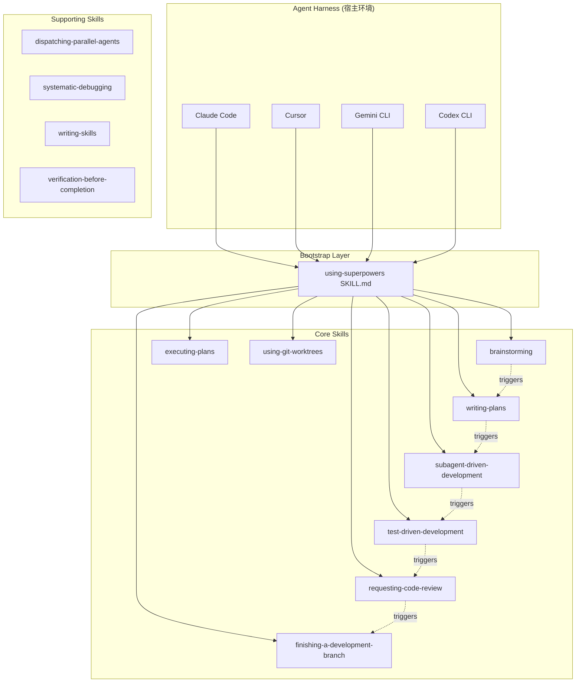
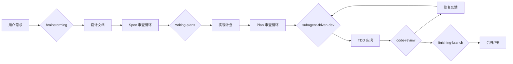
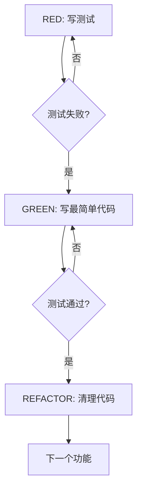

# Superpowers 开源项目调研报告

## 一、项目概述

| 属性 | 值 |
|------|-----|
| **项目名称** | Superpowers |
| **GitHub 地址** | https://github.com/obra/superpowers |
| **作者** | [obra](https://github.com/obra) |
| **Star 数** | ~197,258 |
| **Fork 数** | ~17,598 |
| **主要语言** | Shell |
| **许可证** | MIT |
| **创建时间** | 2025-10-09 |
| **最后更新** | 2026-05-19 |
| **项目类型** | Agentic Skills 框架 / 软件开发方法论 |

### 1.1 项目定位与核心价值

Superpowers 是一个**面向 coding agent 的 agentic skills 框架和软件开发方法论**。它不是一段代码或库，而是一套完整的**提示词工程 + 工作流规范**，旨在让 AI 编程助手（Claude Code、Cursor、Gemini CLI、Codex CLI 等）能够按照系统化的软件工程流程工作，而非直接跳入写代码。

**一句话描述：** 让 AI 编程助手具备"先设计、再规划、后实现"的结构化开发能力。

### 1.2 解决的核心问题

当前 AI 编程助手的典型问题：
- 收到需求后直接写代码，缺乏设计阶段
- 没有 spec 文档，导致实现偏离意图
- 缺乏 TDD 习惯，测试覆盖不足
- 长时间编码后偏离方向（scope creep）

Superpowers 通过一组**可组合的 skills（技能）**，将软件开发流程结构化为 7 个阶段：

```
brainstorming → using-git-worktrees → writing-plans → executing-plans/subagent-driven-development → test-driven-development → requesting-code-review → finishing-a-development-branch
```

### 1.3 项目成熟度评估

- **Star 增速极快**：创建不到 8 个月已达 ~197K stars，表明社区接受度极高
- **Fork 活跃**：~17.6K forks
- **Contributor 活跃**：778 subscribers
- **PR 审核严格**：94% 的 PR 拒绝率，维护者对代码质量要求极高
- **持续活跃**：最后提交为 2026-05-14，仍在快速迭代

---

## 二、架构设计

### 2.1 整体架构

Superpowers 是一个**零依赖的纯提示词框架**，没有运行时代码。其架构由以下层次组成：



### 2.2 核心设计原则

1. **Skill 即代码**：Skills 不是文档，是塑造 agent 行为的"代码"
2. **自动触发**：通过 bootstrap 机制在会话启动时自动加载，无需用户手动调用
3. **零依赖**：纯 Markdown 文件，不依赖任何运行时库
4. **TDD 哲学**：将 TDD 应用于 skill 本身——先写压力场景（测试），再写 skill 内容（代码）
5. **YAGNI & DRY**：贯穿整个方法论

### 2.3 技术栈

- **格式**：Markdown（SKILL.md 文件）
- **图表**：DOT graphviz（部分 skill 中用于流程图）
- **无运行时依赖**：纯提示词工程，无需安装任何包

### 2.4 支持的平台（Harness）

| 平台 | 安装方式 |
|------|---------|
| Claude Code | `.claude/` 目录安装 |
| Codex CLI | `.codex-plugin/` 目录 |
| Codex App | 专门适配 |
| Factory Droid | 专用配置 |
| Gemini CLI | `.cursor-plugin/` + `GEMINI.md` |
| OpenCode | `.opencode/` 目录 |
| Cursor | `.cursor-plugin/` |
| GitHub Copilot CLI | 专用配置 |

---

## 三、核心 Skills 库

### 3.1 核心 Skills（主流程）

| Skill | 文件路径 | 职责 |
|-------|----------|------|
| **using-superpowers** | `skills/using-superpowers/SKILL.md` | 核心路由 skill，控制所有 skills 的发现和调用 |
| **brainstorming** | `skills/brainstorming/SKILL.md` | 需求探索阶段——在写代码前先设计 |
| **writing-plans** | `skills/writing-plans/SKILL.md` | 编写实现计划——bite-sized 任务分解 |
| **executing-plans** | `skills/executing-plans/SKILL.md` | 在并行会话中执行计划 |
| **subagent-driven-development** | `skills/subagent-driven-development/SKILL.md` | 子 agent 驱动开发——自动 dispatch + review 循环 |
| **test-driven-development** | `skills/test-driven-development/SKILL.md` | 严格 TDD——先写失败测试 |
| **requesting-code-review** | `skills/requesting-code-review/SKILL.md` | 调度代码审查 |
| **finishing-a-development-branch** | `skills/finishing-a-development-branch/SKILL.md` | 分支完成与清理 |
| **using-git-worktrees** | `skills/using-git-worktrees/SKILL.md` | Git worktree 管理 |

### 3.2 辅助 Skills

| Skill | 文件路径 | 职责 |
|-------|----------|------|
| **dispatching-parallel-agents** | `skills/dispatching-parallel-agents/SKILL.md` | 并行 agent 调度 |
| **systematic-debugging** | `skills/systematic-debugging/SKILL.md` | 四阶段系统化调试 |
| **writing-skills** | `skills/writing-skills/SKILL.md` | Skill 编写方法论（TDD for skills） |
| **verification-before-completion** | `skills/verification-before-completion/SKILL.md` | 完成前强制验证 |

---

## 四、主要模版文件

### 4.1 模版文件概览

Superpowers 本身**不是传统意义上带有独立模版文件的框架**，它的"模版"是以 **SKILL.md 文件中定义的结构化指令格式** 的形式存在的。以下是关键模版结构：

| 模版类型 | 对应文件 | 说明 |
|---------|---------|------|
| **设计规范模版** | `skills/brainstorming/SKILL.md` + `docs/superpowers/specs/` | 设计文档的结构和审查流程 |
| **架构设计模版** | `docs/plans/` 中的设计文档示例 | 架构决策、代码复用策略 |
| **Spec 文件模版** | `docs/superpowers/specs/` 中的 spec 文档 | 技术规范的结构化格式 |
| **计划文件模版** | `skills/writing-plans/SKILL.md` + `docs/superpowers/plans/` | 实现计划的结构化格式 |
| **PR 模版** | `.github/PULL_REQUEST_TEMPLATE.md` | 严格的 PR 提交要求 |
| **Issue 模版** | `.github/ISSUE_TEMPLATE/` | Bug/Feature/Platform 报告模版 |
| **Skill 编写模版** | `skills/writing-skills/SKILL.md` | 如何编写新 Skill 的规范 |

### 4.2 设计规范模版（来自 brainstorming SKILL.md）

设计规范的核心结构：

```markdown
# Feature: [功能名称]

## Context
- [当前系统状态]
- [用户目标]
- [约束条件]

## Design
### Approach
[选择的方法论及理由]

### Architecture
[架构图 - 使用 DOT graphviz]

### Components
[组件列表及其职责]

### Data Flow
[数据流向]

## Self-Review Checklist
- [ ] 设计是否解决了用户的实际问题？
- [ ] 是否遵循 YAGNI？
- [ ] 是否考虑了边界情况？
```

### 4.3 Spec 文件模版（来自 `docs/superpowers/specs/`）

实际示例：`2026-04-06-worktree-rototill-design.md` 的结构：

```markdown
# 标题: [功能名称] Design Spec

## 问题描述
- 现有问题
- 三个失败模式

## 设计原则
1. [原则1]
2. [原则2]
3. [原则3]

## 解决方案
### Step 0: [检测阶段]
[具体步骤]

### Step 1a: [实现阶段A]
[具体步骤]

### Step 1b: [实现阶段B]
[具体步骤]

## 打包的 Bug 修复
- [#940](url): 问题描述
- [#999](url): 问题描述

## 风险
- [风险1] + 缓解措施
- [风险2] + 缓解措施

## 解决的问题
| Issue | 描述 | 解决方案 |
|-------|------|---------|

## 涉及的文件
- path/to/file1
- path/to/file2
```

### 4.4 计划文件模版（来自 writing-plans SKILL.md）

```markdown
# Plan: [功能名称]

## Goal
[清晰的目标描述]

## Architecture
[架构概览，包含架构图]

## Tech Stack
[技术栈选择]

## Tasks

### Task 1: [任务名称]
- **Files**: [涉及的文件列表]
- **Steps**:
  - [ ] Step 1 description
  - [ ] Step 2 description
  ```code block with implementation```
  - **Verify**: [验证命令]
  - **Commit**: [commit message]

### Task 2: [任务名称]
...

## Self-Review Checklist
- [ ] 所有 spec 需求都被覆盖
- [ ] 没有 TBD/TODO 占位符
- [ ] 类型一致性检查
```

### 4.5 PR 模版（`.github/PULL_REQUEST_TEMPLATE.md`）

```markdown
## What problem are you trying to solve?
[详细描述，包含具体 session 中的问题]

## What does this PR change?
[具体变更内容]

## Is this change appropriate for the core library?
- [ ] 确认变更属于核心库范围

## What alternatives did you consider?
[替代方案分析]

## Does this PR contain multiple unrelated changes?
- [ ] 确认只解决一个问题

## Existing PRs
- [ ] 已搜索现有 PR

## Environment
| Harness | Version | Model |
|---------|---------|-------|
|         |         |       |

## Evaluation
- [ ] 经过对抗性压力测试
- [ ] 有 eval 证据

## Human Review
- [ ] 人工已审查完整 diff
```

### 4.6 Issue 模版

**Bug Report** (`bug_report.md`):
- 问题描述
- 复现步骤
- 预期行为
- 实际行为
- 环境信息

**Feature Request** (`feature_request.md`):
- 问题陈述
- 期望解决方案
- 替代方案

**Platform Support** (`platform_support.md`):
- 平台名称
- 安装方式
- 集成测试记录

---

## 五、核心流程图

### 5.1 Superpowers 开发流程



### 5.2 Brainstorming 流程


### 5.3 TDD 铁律流程



---

## 六、文档目录结构

```
superpowers/
├── README.md                    # 项目说明
├── CLAUDE.md                    # Claude Code 贡献者指南
├── AGENTS.md                    # 通用 Agent 指南（同 CLAUDE.md）
├── GEMINI.md                    # Gemini CLI 入口
├── CODE_OF_CONDUCT.md           # 行为准则
├── RELEASE-NOTES.md             # 发布说明
├── LICENSE                      # MIT 许可证
├── package.json                 # 包定义
│
├── .claude-plugin/              # Claude Code 插件配置
├── .codex-plugin/               # Codex CLI 插件配置
├── .cursor-plugin/              # Cursor 插件配置
├── .opencode/                   # OpenCode 插件配置
│
├── skills/                      # 核心 Skills 库
│   ├── using-superpowers/       #   核心路由
│   ├── brainstorming/           #   需求探索
│   ├── writing-plans/           #   计划编写
│   ├── executing-plans/         #   计划执行
│   ├── subagent-driven-development/  # 子agent开发
│   ├── test-driven-development/ #   TDD
│   ├── requesting-code-review/  #   代码审查
│   ├── finishing-a-development-branch/  # 分支完成
│   ├── using-git-worktrees/     #   Git worktree
│   ├── dispatching-parallel-agents/     # 并行agent
│   ├── systematic-debugging/    #   系统调试
│   ├── writing-skills/          #   Skill编写
│   └── verification-before-completion/  # 完成验证
│
├── docs/                        # 文档
│   ├── plans/                   #   设计文档（opencode等）
│   │   ├── 2025-11-22-opencode-support-design.md
│   │   └── 2025-11-28-skills-improvements-from-user-feedback.md
│   ├── superpowers/
│   │   ├── plans/               #   实现计划
│   │   │   ├── 2026-01-22-document-review-system.md
│   │   │   ├── 2026-02-19-visual-brainstorming-refactor.md
│   │   │   ├── 2026-03-11-zero-dep-brainstorm-server.md
│   │   │   ├── 2026-03-23-codex-app-compatibility.md
│   │   │   └── 2026-04-06-worktree-rototill.md
│   │   └── specs/               #   技术规格
│   │       ├── 2026-01-22-document-review-system-design.md
│   │       ├── 2026-02-19-visual-brainstorming-refactor-design.md
│   │       ├── 2026-03-11-zero-dep-brainstorm-server-design.md
│   │       ├── 2026-03-23-codex-app-compatibility-design.md
│   │       └── 2026-04-06-worktree-rototill-design.md
│   └── testing.md               #   测试文档
│
├── hooks/                       # Git hooks
├── scripts/                     # 脚本
├── tests/                       # 测试
│   ├── skill-triggering/        #   Skill 触发测试
│   ├── explicit-skill-requests/ #   显式 Skill 请求测试
│   └── subagent-driven-dev/     #   子agent开发测试
│
└── .github/
    ├── ISSUE_TEMPLATE/
    │   ├── bug_report.md        #   Bug 报告模版
    │   ├── feature_request.md   #   功能请求模版
    │   └── platform_support.md  #   平台支持模版
    └── PULL_REQUEST_TEMPLATE.md # PR 模版
```

---

## 七、技术评估

### 7.1 优势

1. **结构化开发流程**：将 AI agent 从"直接写代码"转变为"设计→规划→实现→审查"
2. **零依赖架构**：纯 Markdown，无需任何运行时依赖，跨平台兼容
3. **TDD 文化**：Iron Law 级别的规则约束（无测试不写代码、无验证不声称完成）
4. **社区规模**：197K+ stars 表明广泛认可
5. **高质量标准**：94% PR 拒绝率体现严格的代码质量要求
6. **多平台支持**：覆盖主流 AI 编程 IDE/CLI

### 7.2 风险与局限

1. **依赖 agent 行为**：效果高度依赖底层 LLM 的指令遵循能力
2. **学习曲线**：需要理解整个方法论才能有效使用
3. **无 GUI**：纯 CLI 体验，非技术用户可能难以上手
4. **维护门槛高**：修改 skill 需要 eval 证据，贡献者需要深入理解

### 7.3 适用场景

- **适合**：使用 AI 编程助手进行中大型项目开发
- **不适合**：快速原型、单次脚本、不需要结构化流程的小改动

---

## 八、参考资源

- **官方仓库**：https://github.com/obra/superpowers
- **作者**：https://github.com/obra
- **调研时间**：2026-05-19
