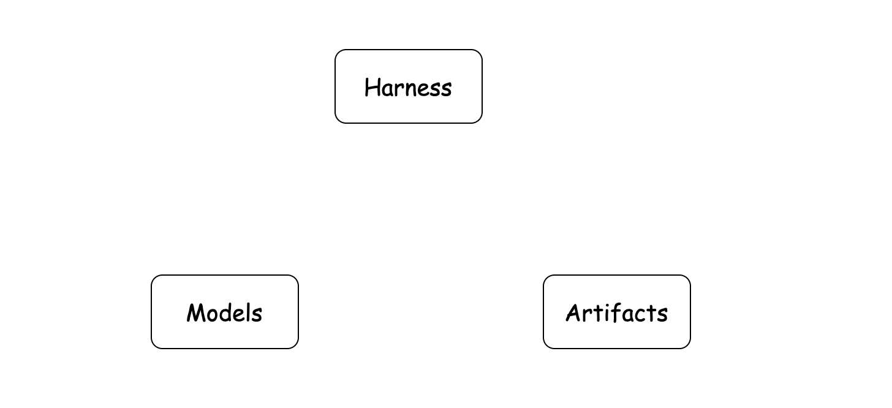
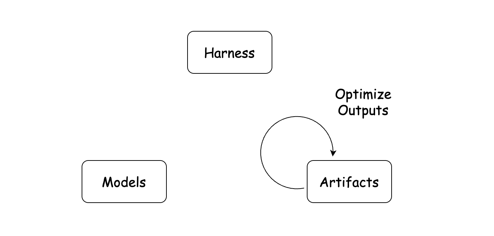
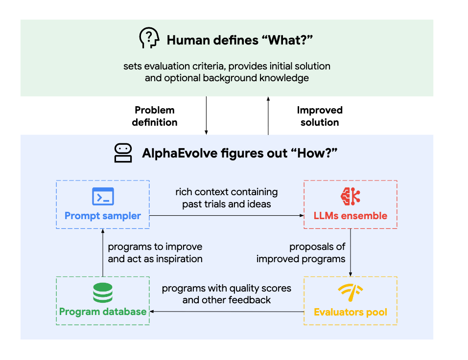
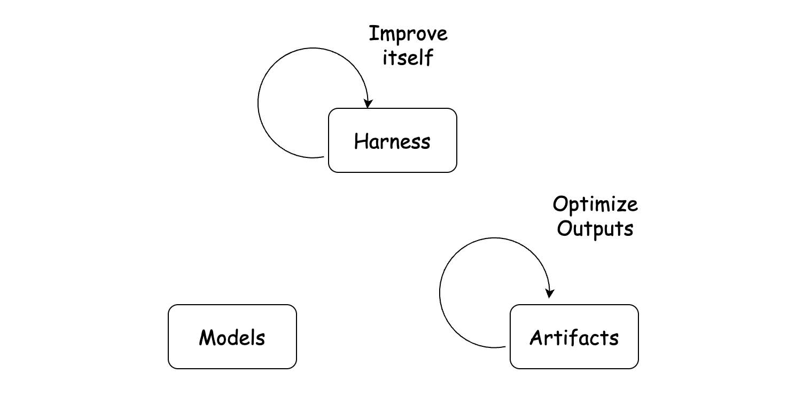
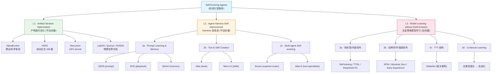

# A Taxonomy of Self-Evolving Agents 综述调研报告

> **博客调研报告** — Shilong Liu（刘世隆）提出的「自进化智能体分类法」，把 self-evolving / self-improving / continual learning / RSI 等一锅术语收敛到 Model · Harness · Artifact 三个维度上。

---

## 📋 基本信息

<b>表1：博客基本信息</b>

| 项目 | 内容 |
|-----|------|
| 标题 | A Taxonomy of Self-Evolving Agents |
| 作者 | Shilong Liu（刘世隆） |
| 发布日期 | 2026-07-08（最后更新 2026-07-09） |
| 博客地址 | https://lsl.zone/blog/2026/a-taxonomy-of-self-evolving-agents/ |
| 作者主页 | https://shilong-liu.com/blog/ |
| 相关推文 | https://x.com/atasteoff/status/2074800880017342665 |
| 分类 | 综述 / 观点（research） |
| 关键词 | agents、llm、self-evolving、taxonomy |
| 参考资料补充 | 微信公众号文章 https://mp.weixin.qq.com/s/zytrPK0Falnn4T4jp2qP-g（访问时触发环境异常验证门，未能抓取正文；本报告以博客原文为准） |

---

## 0. 为什么需要又一篇「综述」

近两年 self-evolving agents 井喷：Hermes Agent 自动沉淀可复用技能、RSI Lab 递归发现新算法、NVIDIA 让机器人在 agentic loop 里进化新策略、auto-research agents 试图在科学发现上自进化。随之而来的是一个术语混乱问题——**self-evolving、self-improving、learning、adapting 是否同义？**它们与 recursive self-improvement (RSI)、continual learning、test-time training (TTT) 又是什么关系？

作者给出的答案不是一个新名词，而是一个**分类坐标系**：

> 与其争论名字，不如问三个问题：**What evolves?（什么在进化）What feedback drives it?（什么反馈在驱动）Where does the loop close?（闭环闭合在哪里）**

这三个问题，正是本报告要展开的核心。整套分类法的元坐标，是三个"进化可以发生的地点"：**Model（模型）/ Harness（脚手架）/ Artifact（产物）**。

---

## 1. 元坐标：Model · Harness · Artifact

*图1（博客 fig1）：Models 与 Harness 组合成 Agent，Agent 产出 Artifacts。三者各自是"进化可以发生"的地方。*

### 1.1 三个基本量

<b>表2：自进化系统的三个基本量</b>

| 基本量 | 含义 | 在系统中的角色 |
|-------|------|---------------|
| **Model（模型）** | 通常是 LLM，响应 prompt 的"大脑" | 提供底层能力；权重可被更新 |
| **Harness（脚手架）** | loop 设计、memory、tools 等把模型变成 agent 的外围组件 | 著名等式 **Agent = Model + Harness** 的右半边 |
| **Artifact（产物）** | agent 产出的东西：发现的 kernel 算法、AI 生成的论文、新的机器人策略 | 价值最终落地的载体 |

### 1.2 这三者为分类提供了什么

三者的连接关系是：**Model + Harness → Agent → Artifact**。

这给出一个清晰的组织框架：当我们看到任何一篇 "self-evolving / self-improving" 工作时，先问它**改的是三者中的哪一个**：

- 改 **Artifact**：agent 在迭代优化外部产物（算法、论文、策略）；
- 改 **Harness**：agent 在改自己的 prompt / memory / tool / skill；
- 改 **Model**：系统在更新模型权重本身。

据此，作者把现有系统归到**三个层级**：

<b>表3：自进化三层结构总览</b>

| 层级 | 名称 | 进化的对象 | 是否动模型权重 | 反馈来源 | 代表工作 |
|-----|------|-----------|--------------|---------|----------|
| **L1** | Artifact Iterative Optimization | 外部产物 | 否 | 人类设定的评估准则 | AlphaEvolve、FARS、Recursive、LabOS、Qumus、NVIDIA |
| **L2** | Agent Harness Self-improvement | agent 自身（prompt/memory/tool/skill） | 否（"软更新"） | agent 自身的执行经验 | GEPA、ACE、Mem0、Alita、Mem-UI、Eevee、Alita-G |
| **L3** | Model Learning without Gold Answers | 模型权重 | **是** | 伪标签/内部信号/环境弱信号/自博弈 | Self-training、TTRL、DeepSeek-R1、SPIN、Absolute Zero、TTT |

下面三层逐一展开。

---

## 2. L1 — Artifact Iterative Optimization（产物迭代优化）

*图2（博客 fig2）：人类设定目标与评估准则；agent 反复"找改进点 → 产新输出 → 验收"，未达标则继续循环。*

### 2.1 动机

这一层被作者称为"最近这一波的主驱动力"。动机很直白：**用强大的 LLM 去为复杂优化问题创造新的产物**。人类给目标与验收准则，agent 在循环里反复打磨产物直到达标。

### 2.2 代表工作

<b>表4：L1 代表工作</b>

| 工作 | 链接 | 产物是什么 | 备注 |
|-----|------|-----------|------|
| **AlphaEvolve** | https://arxiv.org/pdf/2506.13131 | 发现的算法 / 科学发现 | 用 coding agent 做算法发现，发现物即 artifact |
| **Analemma AI · FARS** | https://arxiv.org/html/2606.31651v1 | 166 篇全 AI 生成的论文 | 跑了 417 小时，花费约 18 万美元 |
| **Recursive Superintelligence** | https://www.recursive.com/articles/first-steps-toward-automated-ai-research | 更好的 GPU kernel 算法 | RSI Lab 递归发现新算法 |
| **NVIDIA Enpire** | https://research.nvidia.com/labs/gear/enpire/ | 机器人新策略 | 通过 agentic loop 控制机器人发现新 policy |
| **LabOS** | https://arxiv.org/abs/2510.14861 | 生物实验结果 | agent 连接生物实验室做实验 |
| **Qumus** | https://arxiv.org/abs/2605.18407 | 量子材料实验 | 构建量子材料实验家 |

工具类（Codex、Claude Code、OpenClaw）也遵循同样的"产出-验收"行为模式，只是产物是代码改动。

### 2.3 AlphaEvolve 流水线（典型 L1 循环）

*图3（博客 image.png）：AlphaEvolve 的改进-验证循环——agent 既是"算子"又是"优化器"。*

### 2.4 机制拆解

作者把 L1 的机制讲得很清楚，可以提炼成一个闭环：

<b>表5：L1 循环机制</b>

| 步骤 | 行为 | 说明 |
|-----|------|------|
| ① 设定 | 人类设定目标 + 评估准则 | 界定"什么是好的产物" |
| ② 定位 | agent 自己找"哪里可以改进" | LLM 兼任探索方向决策 |
| ③ 生成 | agent 产出新输出 | LLM 作为算子（operator） |
| ④ 验收 | 检查产物是否满足准则 | 满足 → 结束；否则 → 回到 ② |

### 2.5 与前 LLM 时代的关系：算子与优化器的合一

作者给了一段重要历史对照，这是理解 L1 为何"新"的关键：

> **前 LLM 时代**：研究者手工设计算子/动作（operators/actions），再在其上设计搜索或优化方法。典型如神经架构搜索（NAS）——EfficientNet（https://arxiv.org/pdf/1905.11946）先定义网络算子搜索空间，再搜出更好的设计。

> **LLM 时代的关键变化**：模型本身**既是算子又是优化器**。它能发明候选、检视过往结果、决定下一步往哪搜，从而支撑更大的搜索空间和更好的启发式搜索。

这是一个本质性的跃迁：搜索空间不再被预先手工定义，而是由模型在运行中动态发明。

### 2.6 长程能力的进步

L1 能跑起来，依赖模型长程任务能力的提升：

- **2024**：LLaVA-Plus（https://arxiv.org/abs/2311.05437）只能做 < 5 次工具调用，频繁需要人工介入；
- **现在**：agent 可以连续跑数小时、几乎不需要干预。

这恰好是 L1 从"实验室玩具"走向"真实流水线"的前提。

### 2.7 数字世界 vs 物理世界

作者明确点出当前 L1 的边界与野心：

- **当前主流**：大多跑在数字环境（代码库、浏览器、仿真器、终端）；
- **更野心的方向——物理世界**：
  - NVIDIA：agent 通过 agentic loop 控制机器人，发现新 policy；
  - LabOS：agent 接入生物实验室；
  - Qumus：量子材料实验家。

作者以一句"The world is the agents' oyster."（世界任 agent 摆布）收束本节——这句也在文末以更沉重的版本重现。

---

## 3. L2 — Agent Harness Self-improvement（Harness 自改进）

*图4（博客 fig3）：agent 修改自身的 prompt / memory / tool / skill，但不更新模型权重。*

### 3.1 动机：能否部署后仍改进，但不训权重？

L2 与 L1 几乎同时兴起，但动机不同：**模型训练昂贵，那么 agent 能否在部署之后继续改进、却不更新权重？** 作者的答案是肯定的，且给出两条主要路径（外加一条多智能体延伸）。

> ⚠️ 关键区分：L1 是"优化外部产物"，L2 是"agent 改自己的组件（prompt/memory）"。这是它与 L1 的分水岭。

### 3.2 路径 2a — Prompt Learning 与 Memory

死记 Q&A 对（作者类比中学背题）泛化性差。更好的做法是**抽取可复用规则并存储**：

<b>表6：路径 2a 代表工作</b>

| 工作 | 链接 | 规则存哪 | 要点 |
|-----|------|---------|------|
| **GEPA** | https://arxiv.org/abs/2507.19457 | prompt | 把规则存进 prompt |
| **ACE** | https://arxiv.org/abs/2510.04618 | playbook | 把规则存进 playbook |
| **Mem0** | https://arxiv.org/abs/2504.19413 | memory 系统 | 把规则存进 memory |

作者点出一个语义陷阱：这些方法名字里带 "learning"，**但并不调整模型权重**。然而如果把 harness 视作 agent 的一部分，那么对 prompt 的更新就应当被**类比地视作参数更新**。

> 这是一个相当重要的立场：**prompt/memory 的更新，是 harness 层面的"软参数更新"**。本仓库中 Meta-Harness、Self-Harness、RHO、MemoHarness、HarnessX 等一系列 harness 优化工作，都落在这个判断的射程之内。

### 3.3 路径 2b — Tool 与 Skill 的创造

纯文本信息有时不够。比如"理解长视频并找到关键帧"，光靠 memory 是冗余的——**需要的是一个可执行的工具或技能**。

<b>表7：路径 2b 代表工作</b>

| 工作 | 链接 | 创造什么 | 要点 |
|-----|------|---------|------|
| **Alita** | https://arxiv.org/abs/2505.20286 | 可复用工具 | 把工具编码成代码，agent 直接生成 |
| **Mem-UI** | https://arxiv.org/abs/2602.05832 | 可复用技能 | skill 是 tool 的高层封装 |

要点：
- **工具 = 代码**，所以 agent 可以直接生成；**技能 = 工具的高层封装**。生成后被加入 agent 供后续复用。
- **skill 同时是上下文管理手段**——它缩短上下文长度，因为 agent 不必把每个细节都塞进 context window。作者反复强调"Context matters."。
- skill 已成为流行方案，由 **Claude Code 形式化**，并被 Codex、OpenClaw、Hermes Agent 采纳。
- 因为 tool/skill 属于 harness，**这要求 agent 修改自身**——这就是为什么它属于 L2 而非 L1。

### 3.4 路径 2c — 走向多智能体自进化

单 agent 难以扩展：playbook 越长、工具/技能越多，系统越不可靠、越低效。

> 作者举了一个生动例子：用户关心股票问题，却不需要烹饪工具；语义混淆随之而来——"squeeze"这个词，可能指市场动作，也可能是"挤橙子"。

解法是 **task experts（任务专家）**：把烹饪 agent 和股票 agent 分开，而不是让一个 agent 兼顾两者。这引出多智能体自进化：

<b>表8：路径 2c 代表工作</b>

| 工作 | 链接 | 思路 |
|-----|------|------|
| **Eevee** | https://arxiv.org/abs/2606.11182 | 观察到数据来自不同源/分布时单 agent 受限，提出多专家 agent + 路由 |
| **Alita-G** | https://arxiv.org/abs/2510.23601 | 给 agent 配上生成式工具来构建特定领域的 specialist |

作者把多智能体也归为**另一种上下文管理**：每个专家只携带相关上下文——"Context matters."第三次出现。

#### 路由瓶颈

> 找到合适的 agent（routing）并不简单。需要更强的基座模型才能做好路由，参见路由研究 https://arxiv.org/abs/2605.07180 。

作者给出一个漂亮的类比：

> **"A human is a router."（人就是一个路由器。）**

人类最有价值的能力之一，恰恰是路由——判断任务是否该推进到下一步。

---

## 4. L3 — Model Learning without Gold Answers（无金标准答案的模型学习）

*图5（博客 fig-all.png）：直接更新模型权重；信号来自伪标签、内部信号、环境弱信号、自博弈。*

### 4.1 与 L1/L2 的本质区别

L3 的关键特征：**learning 改变模型权重**。但难点在于——当只有问题、弱信号或可选的环境访问、而**没有 gold answer**时，如何让模型更新？

> 注意：L3 里很多工作**并不自称 "self-evolving agents"**——它们以 self-training、weak supervision、self-play、RL、test-time training、online learning、continual learning 等名目出现。这正是全文"名字会变、本体不变"主旨的实证。

### 4.2 路径 3a — 伪 Ground Truth 或内部信号

没有 gold answer 时的两条路：从数据构造伪 ground truth，或利用内部信号。

<b>表9：路径 3a 代表工作</b>

| 工作 | 链接 | 信号来源 |
|-----|------|---------|
| **Self-training** | https://arxiv.org/abs/2202.12040 | 构造伪标签 |
| **TTRL** | https://arxiv.org/abs/2504.16084 | 用内部信号 |
| **DeepSeek-R1** | https://arxiv.org/abs/2501.12948 | 把信号变成 RL 的 reward |

**作者的直觉例子**：给一张有 5 个苹果的图、但没有标签，预训练模型对 4、5、6 这几个答案更自信——这些**内部信号虽不完美，但仍有信息量**。

### 4.3 路径 3b — Self-play 与来自环境的弱信号

学习信号可以来自模型外部，另一个玩家也可被视为环境的一部分。

<b>表10：路径 3b 代表工作</b>

| 工作 | 链接 | 要点 |
|-----|------|------|
| **SPIN** | https://arxiv.org/abs/2401.01335 | 自博弈 |
| **Absolute Zero** | https://arxiv.org/abs/2505.03335 | 自博弈 |
| **Agent Learning via Early Experience** | https://arxiv.org/abs/2510.08558 | 通过环境交互学习 |

> **作者的日常类比**：约人出去玩对方没回——"没回应"本身也是一种信息。**即使是环境的"无响应"也可以是弱信号。**

### 4.4 路径 3c — Test-time Training（TTT）作为模型架构

- **TTT**（https://test-time-training.github.io/e2e.pdf）：一个**特例**，从不自称 "self-evolving"——大概是因为它有个更花哨的名字。
- 这条线表明，**某些序列模型可被理解为在推理时做基于梯度的更新**：模型在推理过程中持续更新一个矩阵。
- 作者推荐参考 **DeltaNet 博客**（https://sustcsonglin.github.io/blog/2024/deltanet-1/）。

> 这是 L3 里最"硬核"的一条：它把"学习"下沉到**架构层面**——不是训完后保存权重，而是**推理即更新**。这与本仓库关心的 harness/agent 自进化形成有趣对照：TTT 把进化做进了模型本身的前向计算。

### 4.5 路径 3d — 与 Continual Learning 的连接

**Continual Learning**（https://arxiv.org/abs/2302.00487），又名 online learning / lifelong learning，可追溯到前 LLM 时代。

经典设定：一个识别轿车的模型，现在要识别 SUV。在 SUV 图片上微调可能损害轿车识别（**灾难性遗忘 catastrophic forgetting**）。最有效的解法之一仍是——在 SUV 上微调时**重放部分轿车样本**。

作者借"multi-modal"含义随时间漂移，类比 continual learning 也在变义：

<b>表11："multi-modal"含义的时代漂移</b>

| 年份 | "multi-modal" 的所指 | 代表 |
|------|---------------------|------|
| ~2017 | image captioning | Bottom-Up and Top-Down Attention（https://arxiv.org/abs/1707.07998） |
| ~2021 | CLIP 类模型 | CLIP（https://arxiv.org/abs/2103.00020） |
| ~2023 | 视觉-语言模型如 GPT-4V | — |
| ~2025 | 同时处理图像理解与生成的统一模型 | — |

> 同理，今天 LLM 讨论里的 continual learning，含义往往更接近 self-evolving agents，而不是老的灾难性遗忘设定。
>
> **"Both humans and terms change with time."（人与术语都会随时间变化。）**

---

## 5. 模糊的边界：三层并非永远隔离

作者没有把三层做成僵化分类，而是明确指出**边界会模糊、且应当模糊**：

1. **跨层耦合**：优化一个 kernel 算法（L1 artifact）往往**同时**需要改进 agent 的 prompt / tool / memory / search 策略（L2 harness）。
2. **从 harness 到 model 的自然过渡**：agent 的知识受预训练约束；一旦 harness 到达极限，更新模型参数就变得自然。
3. **已有整合工作**：**SIA**（https://arxiv.org/abs/2605.27276）已经探索把这些方向**合并**。

### 5.1 抽象层级上移的类比

作者用一个编码进化的类比来收束这一节——这是理解全文"三层终将合一"主旨的关键：

<b>表12：编码抽象层级的演进类比</b>

| 时间 | 我们如何写代码 | 优化目标 |
|-----|--------------|---------|
| 几年前 | 每行都自己写 | words（词） |
| ChatGPT 出现 | 写片段 | snippets（代码片段） |
| Copilot | 写函数/文件 | files（文件） |
| 今天 | coding agent 处理整个项目 | projects（项目） |

> 我们不断把东西**打包成组**、给它们新的抽象、在更高层次上思考。
>
> self-evolving 系统也应如此：**model、harness、artifact 不应永远隔离。一旦足够强，自然方向是作为一个整体一起进化。**

---

## 6. 为了真实世界：三个问题

作者把全文落到一个明确的工程立场——**自进化的最终价值，必须由它帮助造出了"更好的东西"来衡量**：

> 更好的 prompt / memory / tool / model 都有用，但**最终价值应取决于它是否帮我们造出了更好的东西**：更快的 kernel、更强的软件、新的科学假设、新材料、更好的机器人行为。

这正是 Model · Harness · Artifact 三分法的根本理由——它们描述的是**进化可以发生的三个地点**：

<b>表13：进化发生地点与典型反馈</b>

| 进化地点 | 改什么 | 反馈来源 |
|---------|-------|---------|
| **Model** | 模型权重 | 弱信号 |
| **Harness** | memory / prompt / tool / skill | agent 自身执行经验 |
| **Artifact** | 外部产物 | 人类设定的评估准则 |

### 6.1 未来系统：三层一起生长

作者描绘了一个闭合的未来图景——**三层闭环互相喂养**：

> 在早期系统里，这些 loop 是分开出现的。在未来系统里，它们会一起生长。

### 6.2 名字为何总在变

作者把同一思想在不同年代的不同名字列出，点明"名字会变、本体不变"：

<b>表14：自进化思想在不同年代的名字</b>

| 名字 | 出现年代背景 |
|-----|------------|
| recursive self-improvement | 经典 RSI 叙事 |
| continual learning | 在线/终身学习 |
| online learning | 在线学习 |
| automated discovery | 自动化发现 |
| test-time adaptation | 测试时适应 |

> 名字变了，是因为**可用的系统变了**。今天我们有：大模型、用工具的 agent、并行执行、更丰富的环境、更有用的验证信号。

### 6.3 三个问题（全文核心主张）

作者最终提议：与其争论名字，不如问三个问题：

<b>表15：自进化的三个判别问题</b>

| 问题 | 含义 |
|-----|------|
| **What evolves?** | 什么在进化——model / harness / artifact？ |
| **What feedback drives it?** | 什么反馈在驱动——评估准则 / 执行经验 / 弱信号？ |
| **Where does the loop close?** | 闭环闭合在哪里？ |

**闭环闭合位置决定 agent 长成什么**：

<b>表16：闭环闭合位置与结果</b>

| 闭环闭合于 | 结果 |
|-----------|------|
| benchmarks | 更强的 benchmark solver |
| code | 更好的软件 |
| science / engineering | 更好的发现 |
| 物理世界 | agent 成为建造和改进真实系统的新方式 |

### 6.4 全文结语

> "The world is still the hardest environment. It is also the place where self-evolving agents matter most."
>
> **世界仍然是最难的环境。它也是自进化 agent 最有意义的地方。**

这是对 L1 末尾 "The world is the agents' oyster." 的回响与升华：从轻快的"任 agent 摆布"到沉重的"世界最难、但也最重要"。

---

## 7. 综合分类树（结构化总览）

---

## 8. 三层的横向对比

把 L1/L2/L3 放在一起横向对比，能更清楚看到分类法的一致性与张力：

<b>表17：L1 / L2 / L3 横向对比</b>

| 维度 | L1 Artifact | L2 Harness | L3 Model |
|-----|-------------|-----------|----------|
| 改的对象 | 外部产物 | agent 自身组件 | 模型权重 |
| 是否动权重 | 否 | 否（"软更新"） | **是** |
| 反馈来源 | 人类设定的评估准则 | agent 自身执行经验 | 伪标签/内部信号/环境弱信号/自博弈 |
| 代表 | AlphaEvolve、FARS | GEPA、ACE、Alita | TTRL、DeepSeek-R1、TTT |
| 是否自称 self-evolving | 多数是 | 多数是 | **多数不是**（以 self-training/RL/TTT 等名目出现） |
| 与本仓库已调研工作的对应 | MLEvolve、Arbor、autoresearch | Meta-Harness、Self-Harness、RHO、MemoHarness、HarnessX、AutoHarness(Aha/DeepMind)、Continual Harness、LIFE-HARNESS、Meta-Evolution、RewardHarness、Autogenesis、Hermes | TeamTR、EvoMAS、Skill-MAS（偏 L2/L3 之间） |

---

## 9. 与本仓库既有调研的对照

把分类法当"坐标系"，能看清本仓库已调研的工作分别落在哪一区。这有助于把单篇调研串成一张地图：

<b>表18：本仓库已调研工作在分类法中的落点</b>

| 仓库路径 | 工作 | 落点 | 理由 |
|---------|-----|------|------|
| `auto-harness/meta-harness` | Meta-Harness | **L2** | 以 Coding Agent 为 Proposer 搜 harness 代码空间，不动权重 |
| `auto-harness/self-harness` | Self-Harness | **L2** | 三阶段闭环自优化 harness，无需更强外部模型 |
| `auto-harness/retro-harness` | RHO | **L2** | 把轨迹数据集作离线优化信号 + 自偏好，改 harness |
| `auto-harness/memo-harness` | MemoHarness | **L2** | 双层经验库 + 测试时案例适配 harness |
| `auto-harness/harness_x` | HarnessX | **L2→L3** | 跨 harness GRPO 让模型内化历代策略，开始动权重 |
| `auto-harness/auto-harness-deepmind` | AutoHarness | **L2** | 自动合成代码约束框架，代码即策略 |
| `auto-harness/auto-harness-aha` (framework) | Aha | **L2** | 三层治理 harness 框架 |
| `auto-harness/continual-harness` | Continual Harness | **L2** | 具身 agent 在线适应脚手架 |
| `auto-harness/life-harness` | LIFE-HARNESS | **L2** | 运行时外壳，"适配接口而非模型" |
| `auto-harness/meta-evolution-harness` | Meta-Evolution | **L2** | 两层演化蓝图优化 harness |
| `auto-harness/reward-harness` | RewardHarness | **L2↔L3** | 自演进奖励建模，介于 harness 与权重之间 |
| `auto-harness/autogenesis` | Autogenesis | **L2** | 自进化协议，AEU 最小可进化组件 |
| `product/hermes/agent-self-evolution` | Hermes | **L2** | API 调用优化 prompt/instruction/few-shot，无 GPU 训练 |
| `auto-research/arbor` | Arbor | **L1** | 假设树自主研究，产物是研究结论 |
| `auto-research/ml-evolve` | MLEvolve | **L1** | 自演化发现 ML 算法，超越 AlphaEvolve |
| `evolution-of-mas/evo-mas` | EvoMAS | **L2** | 配置空间演化生成 MAS（harness 侧） |
| `evolution-of-mas/skill-mas` | Skill-MAS | **L2** | Meta-Skill 演化编排能力，冻结 LLM 不动权重 |
| `agent_rl/teamtr` | TeamTR | **L3** | 多智能体信任域微调，动权重 |
| `context_engineering/token-pilot`、`self-gc` | TokenPilot / Self-GC | **L2（支撑）** | 上下文管理是 harness 自进化的使能组件 |

> 这一对照也印证了作者的判断：**本仓库绝大多数工作落在 L2（Harness 自改进）**，少量落在 L1（产物优化）与 L3（模型学习）——这正反映了"模型训练昂贵，先在不训权重的前提下改进"这一现实动机。而 HarnessX、RewardHarness 已经站在 L2→L3 的过渡带上，呼应了第 5 节"边界会模糊、且应当模糊"。

---

## 10. 个人评注与批判性思考

### 10.1 分类法的真正贡献

这套分类法最大的价值，不在于"又造了三个名词"，而在于它**给出了一个可操作的判别流程**：面对任何一篇自称/未自称 self-evolving 的工作，先问"改的是 Model/Harness/Artifact 哪一个"，再问"反馈从哪来、闭环闭在哪"。这把一团浆糊的术语争论，转成了一个可机械执行的三问。作者那句"a human is a router"也点明：路由能力本身就是智能体化的核心，这与本仓库 AgentSpace 把多 runtime 归一化为统一执行契约的思路异曲同工。

### 10.2 需要保持清醒的地方

- **L2 "软参数更新"的类比要慎用**。把 prompt/memory 更新类比成参数更新，在概念上有启发性，但二者在**泛化性、稳定性、可回滚性、灾难性遗忘**等维度上行为差异巨大。作者本人也承认"死记 Q&A 泛化差"，这恰恰是软更新与真参数更新的本质差距。
- **L3 的"不自称 self-evolving"是双刃剑**。一方面它印证"名字会变、本体不变"；另一方面，把 TTT、continual learning、self-play 全部收编进"self-evolving agents"的伞下，存在**概念稀释**风险——当所有 learning 都叫 self-evolving，这个词就失去了区分力。分类法用"What evolves / What feedback / Where loop closes"三问部分缓解了这点，但仍需读者自行甄别。
- **物理世界的乐观**。作者两次以"the world"收束（轻版 "oyster" + 重版 "hardest & matter most"），但 LabOS/Qumus/NVIDIA 这类物理世界工作目前仍受限于**真实环境的反馈延迟、成本与安全约束**——闭环闭在物理世界的代价，远高于闭在 benchmark/code 上。分类法对此尚未给出细化。

### 10.3 对本仓库后续调研的指引

这套三问可以直接作为后续调研的"填空模板"：对每篇新工作，补上一张"What evolves / What feedback / Where loop closes"的小表，就能立刻把它在地图上定位。建议把这张三问表标准化进调研模板。

---

## 11. 关键金句索引

为便于检索，集中收录全文的点睛之句：

<b>表19：博客关键金句</b>

| 金句 | 出现位置 | 主旨 |
|-----|---------|------|
| "Agent = Model + Harness" | §1 | harness 是 agent 的右半边 |
| "The world is the agents' oyster." | §2.7 末 | 数字→物理世界的野心（轻版） |
| "Context matters."（出现 3 次） | §3.3、§3.4 | skill/多智能体都是上下文管理 |
| "A human is a router." | §3.4 末 | 路由能力即核心智能 |
| "Both humans and terms change with time." | §4.5 末 | 术语漂移的元规律 |
| "The world is still the hardest environment. It is also the place where self-evolving agents matter most." | §6.4 末 | 全文结语（重版） |

---

## 附录

### A. 关键图表

<b>表A-1：报告图表索引</b>

| 报告图号 | 博客原图 | 描述 | 来源 | 报告内位置 |
|---------|--------|------|------|-----------|
| 图1 | fig1.png | Model、Harness、Artifact 三者关系 | https://lsl.zone/assets/img/blog/self-evolving-agents/fig1.png | §1 |
| 图2 | fig2.png | Artifact 迭代优化循环 | https://lsl.zone/assets/img/blog/self-evolving-agents/fig2.png | §2 |
| 图3 | image.png | AlphaEvolve 流水线 | https://lsl.zone/assets/img/blog/self-evolving-agents/image.png | §2.3 |
| 图4 | fig3.png | Harness 自改进 | https://lsl.zone/assets/img/blog/self-evolving-agents/fig3.png | §3 |
| 图5 | fig-all.png | 无金答案的模型学习 | https://lsl.zone/assets/img/blog/self-evolving-agents/fig-all.png | §4 |

### B. 完整参考文献表

<b>表B-1：博客引用的全部工作</b>

| 工作 | 链接 | 所属层级 |
|-----|------|---------|
| Hermes Agent | https://hermes-agent.nousresearch.com/docs/user-guide/features/skills | L2（skill） |
| RSI Lab / Recursive | https://www.recursive.com/ | L1 |
| NVIDIA Enpire | https://research.nvidia.com/labs/gear/enpire/ | L1（物理世界） |
| AlphaEvolve | https://arxiv.org/pdf/2506.13131 | L1 |
| FARS (Analemma AI) | https://arxiv.org/html/2606.31651v1 | L1 |
| Recursive Superintelligence article | https://www.recursive.com/articles/first-steps-toward-automated-ai-research | L1 |
| EfficientNet | https://arxiv.org/pdf/1905.11946 | 前LLM时代NAS对照 |
| LLaVA-Plus | https://arxiv.org/abs/2311.05437 | 长程能力对照 |
| LabOS | https://arxiv.org/abs/2510.14861 | L1（物理世界） |
| Qumus | https://arxiv.org/abs/2605.18407 | L1（物理世界） |
| GEPA | https://arxiv.org/abs/2507.19457 | L2-2a |
| ACE | https://arxiv.org/abs/2510.04618 | L2-2a |
| Mem0 | https://arxiv.org/abs/2504.19413 | L2-2a |
| Alita | https://arxiv.org/abs/2505.20286 | L2-2b |
| Mem-UI | https://arxiv.org/abs/2602.05832 | L2-2b |
| Eevee | https://arxiv.org/abs/2606.11182 | L2-2c |
| Alita-G | https://arxiv.org/abs/2510.23601 | L2-2c |
| Routing study | https://arxiv.org/abs/2605.07180 | L2-2c（路由瓶颈） |
| Self-training | https://arxiv.org/abs/2202.12040 | L3-3a |
| TTRL | https://arxiv.org/abs/2504.16084 | L3-3a |
| DeepSeek-R1 | https://arxiv.org/abs/2501.12948 | L3-3a |
| SPIN | https://arxiv.org/abs/2401.01335 | L3-3b |
| Absolute Zero | https://arxiv.org/abs/2505.03335 | L3-3b |
| Agent Learning via Early Experience | https://arxiv.org/abs/2510.08558 | L3-3b |
| TTT (Test-time Training) | https://test-time-training.github.io/e2e.pdf | L3-3c |
| DeltaNet blog | https://sustcsonglin.github.io/blog/2024/deltanet-1/ | L3-3c（参考） |
| Continual Learning survey | https://arxiv.org/abs/2302.00487 | L3-3d |
| Bottom-Up and Top-Down Attention | https://arxiv.org/abs/1707.07998 | 术语漂移对照 |
| CLIP | https://arxiv.org/abs/2103.00020 | 术语漂移对照 |
| SIA | https://arxiv.org/abs/2605.27276 | 跨层整合（§5） |

### C. 参考资料

本报告参考的微信公众号补充资料（访问时触发环境异常验证门，正文未能抓取，仅作存档）：

1. 微信公众号文章 — https://mp.weixin.qq.com/s/zytrPK0Falnn4T4jp2qP-g

### D. 调研信息

- 调研人：Claude
- 调研时间：2026-08-03
- 主要来源：博客原文 https://lsl.zone/blog/2026/a-taxonomy-of-self-evolving-agents/（含 5 张原图）
- 参考来源：微信公众号文章（验证门未通过，未纳入正文）
- 博客作者：Shilong Liu（刘世隆）

---

*模板版本: v2.2*
