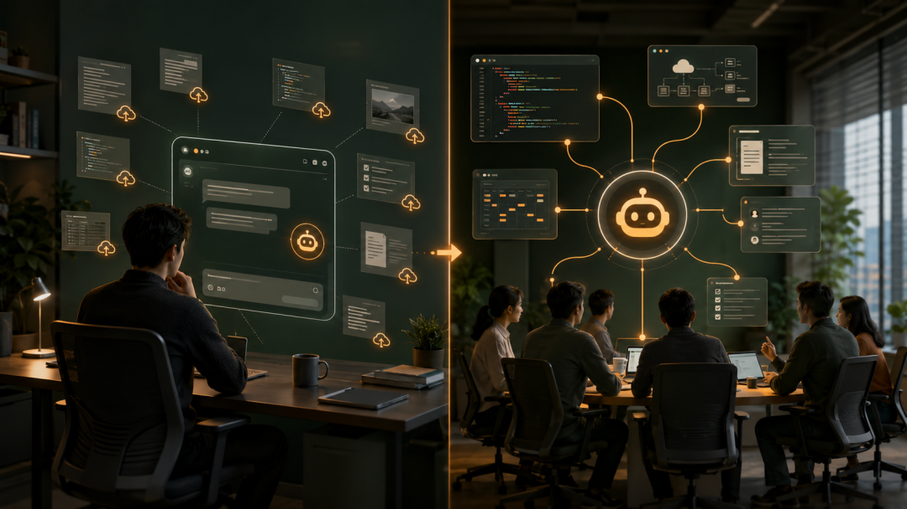

# 65%的产品代码由 AI 生成：Claude 不再等你打开聊天框，而是直接住进了工作群

> 公众号: 我用AI做事 | 发布时间: 2026-07-20 13:04 | 原文链接: https://mp.weixin.qq.com/s/NEZnQMpzM_MWQcmZ8O_Tdw

---

CLAUDE TAG · 团队协作2026.07复制结果回群AI 住进团队现场协作方式变了共享上下文 · 主动跟进 · 异步执行 · 权限审计Leohang AI 工作流实战SLACKAGENT📦 11 Parts + Conclusion👉 滑动PART 01真正的变化，不是多阅读地图PART 02第一，AI 开始拥阅读地图PART 03第二，它不只回答，阅读地图PART 04第三，它可以异步工阅读地图PART 05第四，它终于有了团阅读地图PART 06放进实际工作群，会阅读地图PART 07真正该先设计的，是阅读地图PART ///写在最后收束我最近越来越不愿意打开一个全新的 AI 对话框。不是 AI 不好用，而是每次都要从头解释：项目是什么、谁负责什么、上周做了什么、现在卡在哪里。等 AI 给出结果，我还要复制回工作群，再补一句：“这是我让 AI 整理的，大家看看。”真正的协作现场明明在群里，AI 却一直站在门外。2026 年 6 月，Anthropic 发布了 Claude Tag：它不再只等你去聊天框里提问，而是以 @Claude 的方式进入 Slack频道。Anthropic 同时披露了一个很抓眼球的数据：其产品团队目前有 65% 的代码由内部版本的 Claude Tag 创建。先把边界说清楚：这是 Anthropic 对自身团队的描述，不是第三方生产力基准；“65% 的代码由 AI 创建”也不等于 65% 的工程工作被替代。需求判断、架构取舍、验收、上线责任和事故处置，仍然落在人身上。但这个数字依然重要，因为它透露出一件事：AI 生成代码已经不是某个工程师偷偷开的“外挂”，而是被嵌进团队协作流程里的正式能力。01PART真正的变化，不是多了一个群机器人TEAM · AGENT过去我们使用 AI，基本是“单人模式”：一个人打开聊天框、喂背景、拿答案、再转发。问题也很明显：上下文只存在于某个人的对话里；同事看不到 AI 为什么得出这个结论；换个人接手，就要重新交代背景；人必须守在聊天框前，一问一答地推动任务。Claude Tag 想改变的是整个路径：同一个频道里只有一个共享的 Claude，团队成员能看到它做了什么，也能沿着前一个人的任务继续追问。AI 不再属于某个员工，而是属于一个明确的协作空间。

个人聊天与团队共享 Agent 的差别这听起来像“把机器人拉进群”，但真正有价值的不是入口，而是它背后的四种能力。02PART第一，AI 开始拥有“多人上下文”TEAM · AGENT项目讨论最麻烦的地方，不是资料少，而是资料散。需求在文档里，决定在群聊里，代码在仓库里，故障在工单里，进度又在另一张表里。普通聊天机器人只看到你临时复制给它的那一小段；共享 Agent 则可以在被授权的范围内理解频道历史，并连接团队使用的工具。于是，同事 A 可以让它调查一个问题，同事 B 可以继续追问影响范围，同事 C 再让它整理成行动清单。大家面对的是同一个上下文，而不是三个互不相干的聊天窗口。这会减少大量“背景搬运”。更重要的是，AI 的推理过程被放回团队可以检查、补充和纠正的地方。03PART第二，它不只回答，还会主动跟进TEAM · AGENT传统 AI 的默认状态是沉默：你不问，它就不动。Claude Tag 支持管理员开启主动行为。它可以关注频道中的相关信息、提醒被忽略的风险、追踪停滞的讨论，并对迟迟没有推进的任务发起跟进。想象一下：群里有人说“今晚前补齐回滚方案”，几个小时后没有任何更新。AI 可以提醒责任人，并把当前缺失项列出来。它做的不是替老板催人，而是把团队已经承诺过的事情从聊天洪流里捞回来。04PART第三，它可以异步工作TEAM · AGENT我们习惯把 AI 当成“即时问答”：发一句，等十秒，拿一个结果。但真实工作很少这么整齐。查一次线上问题，可能要读日志、对比版本、翻历史讨论、验证假设；准备一份项目周报，也要跨多个系统收集变化。Claude Tag 可以在后台持续数小时甚至数天，也能按计划执行任务。人不用一直守着聊天框，AI 完成阶段性工作后再回到频道汇报。这意味着 AI 的单位不再只是“一条回答”，而可能是“一段持续推进的工作”。05PART第四，它终于有了团队级的权限边界TEAM · AGENT一个能读资料、调用工具、修改内容的 Agent，如果没有权限控制，能力越强，风险越大。Anthropic 在 Claude Tag 中给出的思路是：管理员按频道决定它能使用哪些工具和信息；不同频道的记忆与身份可以隔离；组织和频道可以设置 token 支出上限；管理员还能查看它做过什么，以及是谁发起了请求。

共享 Agent 的四种能力这比“让大家各自注册一个 AI 账号”更接近企业真正需要的形态：能力是共享的，但访问不是无限的；任务可以自动推进，但责任必须能追溯。06PART放进实际工作群，会发生什么？TEAM · AGENT对技术团队来说，这种变化非常具体。在运维与故障群里AI 可以根据频道讨论、监控信息和被授权的日志，整理故障时间线，区分“已确认事实”和“待验证假设”，给出下一轮排查清单，并持续更新状态摘要。但我不会一开始就给它生产环境写权限。更稳妥的做法是：先让它读、让它分析、让它提出命令，由值班工程师审核后执行。在项目交付群里它可以每天汇总新增决定、阻塞项、责任人和截止时间；周五自动生成一版周报；当某个依赖迟迟没有结论时，提醒团队补齐决策。项目经理不再需要逐条翻聊天记录，团队也少了一次“你以为我知道、我以为你会做”的误会。在内容团队里选题、资料、品牌规范和修改意见往往散在多个对话中。共享 Agent 可以维护选题池，按固定格式生成提纲，核对事实来源，再把长文拆成公众号、小红书和短视频脚本。它最有价值的不是一次写出完美稿件，而是记住团队共同的写作标准，并让每一次修改继续沉淀。在研发协作群里一条需求可以被拆成：理解 issue、定位代码、提出方案、生成补丁、运行测试、提交 PR 草稿。人负责定义目标、检查差异和批准合并，AI 负责处理中间那些耗时、可验证的步骤。“65% 的代码”更可能来自这种大量日常任务的累积，而不是 AI 独自想出并交付了 65% 的产品。07PART真正该先设计的，是权限而不是提示词TEAM · AGENT很多团队上 AI 的第一件事，是收集一百条提示词。我更建议先画出权限边界。Anthropic 的连接器规则强调：AI 继承数据源原有权限，只能缩小访问范围，不能凭空扩大；管理员还可以把读取、写入、删除分别设置为始终允许、需要批准或直接阻止。

AI 权限、审批与审计边界如果准备在团队里试用，我会从下面五步开始：1只选一个私密测试频道。 不要一上来覆盖整个公司。2先给最小读取权限。 只连接完成任务必需的资料和工具。3写清三件能做、三件不能做的事。 比如能整理日志，不能直接重启生产服务。4关键动作必须人工批准。 写数据库、发外部消息、合并代码都应有确认点。5同时看质量、风险和成本。 记录完成时间、人工纠错次数、越权尝试和 token 花费。这套顺序看上去慢一点，却能避免“先全量接入，出问题再收权限”的被动局面。08PART三个可以直接拿去试的群聊任务TEAM · AGENT故障群：...text@Claude 请基于本频道和已授权监控信息，整理本次故障时间线。把内容分成：已确认事实、待验证假设、影响范围、下一步检查。不要执行任何生产变更；每条结论附上来源或对应消息时间。项目群：...text@Claude 每周五 16:00 汇总本周决定、完成项、阻塞项和下周动作。每个动作标注负责人和截止时间；如果频道里没有明确负责人，请写“待指定”，不要自行猜测。研发群：...text@Claude 调查这个 issue，先给出根因假设和最小改动方案。经我确认后再生成补丁并运行测试；不要合并代码，不要修改生产配置。最终输出改动摘要、测试结果和仍需人工检查的风险。好的任务描述，不是让 AI “自由发挥”，而是同时交代目标、证据、权限和完成标准。09PART哪些团队适合，哪些团队先别急？TEAM · AGENT如果你的团队有清晰的频道分工、可连接的数据源、稳定的审批机制，而且大量工作依赖异步协作，那么共享 Agent 很值得试。如果群聊本身就缺少规范、资料权限混乱、谁都可以直接改生产系统，那么先把 AI 拉进来只会放大原有问题。还有一类任务不适合直接自动化：涉及人事、财务、法律结论，或不可逆的生产操作。AI 可以协助收集和整理，但最终决定必须由有责任的人做出。10PART以后还需要专门打开 AI 聊天框吗？TEAM · AGENT当然需要。私人思考、探索性问题、敏感草稿，仍然适合一对一对话。但越来越多工作不会从“打开 AI”开始，而会从正在发生工作的地方开始：在项目群里 @AI，在工单里交给 Agent，在代码评审里让它先检查，在周会前让它自动准备材料。这才是 Claude Tag 最值得注意的地方：AI 不再要求人离开工作流去适应它，而是开始进入人的协作现场。未来的分界线，可能不是“会不会用 AI”，而是团队有没有把目标、上下文、权限和责任设计成一套 AI 也能参与的工作系统。AI 可以住进工作群，但别急着把管理员权限也交给它。我是 LeoHang，持续记录 AI 工具、技术学习和真实工作流。希望这篇文章能帮你在把 AI 拉进团队之前，先想清楚上下文、权限和责任边界。既然看到这里了，如果觉得有用，随手点个赞、在看、转发三连吧。赞点赞看在看转转发THANKS FOR READING
