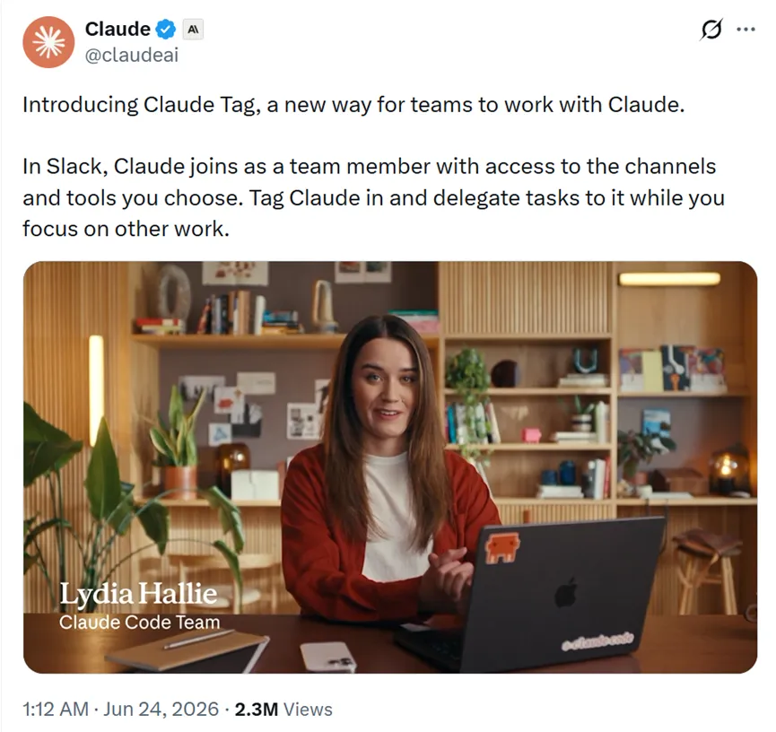

# Claude深夜炸场！新增Tag，一键帮你干完脏活累活，打工人爽翻了

> 公众号: 真的很AI | 发布时间: 2026-07-19 14:31 | 原文链接: https://mp.weixin.qq.com/s/CR9Yypl5Y5EYYKFkFpV1RA

---

今天凌晨1点，Anthropic又放了一个大招，正式推出了Claude Tag新功能。但这次跟以前那种你问一句它答一句的AI完全不是一回事，Claude直接杀进了Slack频道，像个真正的团队成员一样蹲在群里等着你@它干活。说真的，看完资料我第一反应是，这下打工人可能真的要解放了。

Claude Tag强在哪先说说最直观的变化。以前我们用Claude，基本上都是一对一的对话模式，你问一句它回答一句，有点像AI客服。但Claude Tag不太一样，它直接住进Slack频道里了，你只要@它一下就能派活。简单来说可以把它看成团队里的一名员工，或者简化版的OpenClaw。目前Claude内部产品团队自己也在使用，65%的代码都是Tag写出来的。不光是写代码，连查数据、找Bug根源、甚至回工单这种杂活都扔给它来干。

那这个跟之前的Claude Code或者Cowork有什么区别呢？我觉得最核心的升级就是它不再孤军奋战了。一个频道里只有一个Claude，但所有人都能跟它互动，你能看到它正在忙什么，也能接着别人的话茬继续往下聊。这就很像是跟真人队友合作，而不是跟一个冷冰冰的工具打交道。然后Tag还自带学习能力。只要待在频道里，就会默默观察和积累上下文，时间越长它就越懂你们团队在做什么、习惯用什么方式沟通。你不需要每次从头跟它解释项目背景，自己心里有数。当然它不会偷看私密频道，这一点隐私安全上做得还算谨慎。还有个让我觉得挺惊艳的地方，就是它会主动出击。如果开启了所谓的环境感知模式，Claude 会自己判断有什么信息是你应该知道但还没人告诉你的，然后主动跳出来提醒你。

比如某个讨论了很久的线程突然没人说话了，Tag还会跟一句“这个事后来解决了吗”。异步处理也是个大亮点。你可以给 Claude 丢一个任务，然后该干嘛干嘛去，它自己在后台慢慢折腾。要是任务比较复杂，还能自己给自己排期，花几个小时甚至几天去完成。这样一来你就能同时开着好几个 Claude 帮你干活效率直线上升。

顺便提一嘴，Claude Tag目前使用的是Opus 4.8模型，Fable 5暂时还是无法使用。安全与使用当然，可能有人会担心安全性，毕竟把 AI 放进公司群聊里，万一嘴瓢了乱干活咋办。这点Tag想得挺周全。管理员可以精细设置 Claude 在哪个频道能用什么工具、访问哪些数据。不同用途的 Claude 身份是互相隔离的，比如销售那边的 Claude 不会把记忆带到工程频道，反过来工程那边的人也碰不到销售数据。这种设计很大程度上缓解了企业对数据安全的担忧。最后说下大家关心的如何使用，如果你是Claude Enterprise或者Team的付费客户，今天开始就能在测试版里体验了。设置流程不算复杂，先把Claude Tag跟Slack工作区绑在一起，然后给个授权工具，再设个月度消费上限。最后找个私密频道跑一遍测试，确认没问题就可以正式用了。同时会把之前Slack 上那个旧版Claude应用替换掉，管理员有30天时间做迁移。说实话，看完Claude Tag我最大的感受是，AI这个东西终于不再需要我们专门腾出时间去伺候它了。这种存在感越低、存在价值反而越高的东西，才是咱们打工人真正想要的吧。来源：经管之家，综合整理自网络。版权归原作者或平台所有，本号尊重原创，转载旨在分享，如有版权问题请联系删除。
