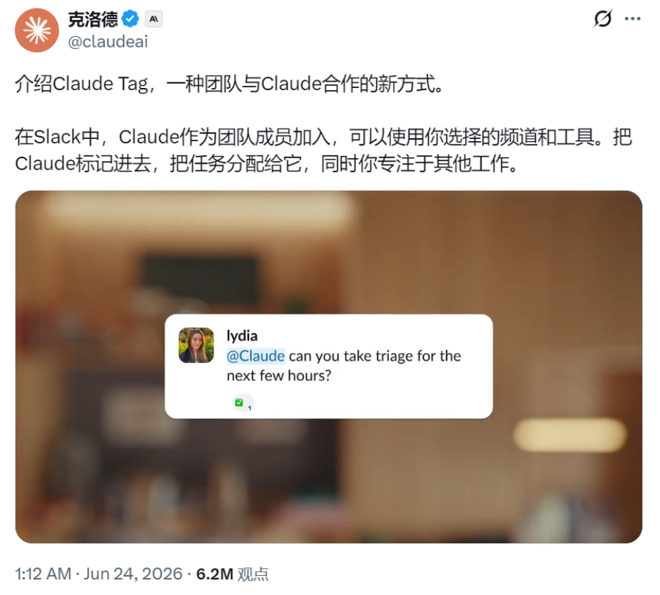
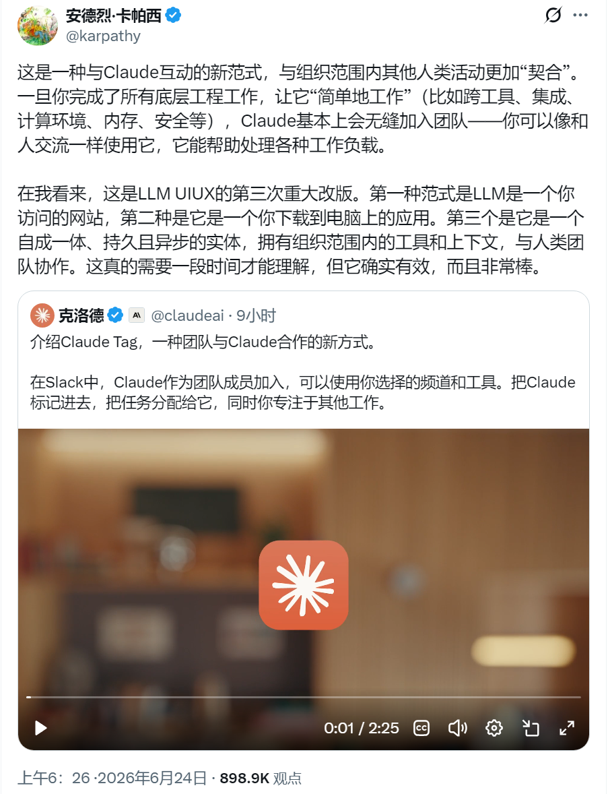
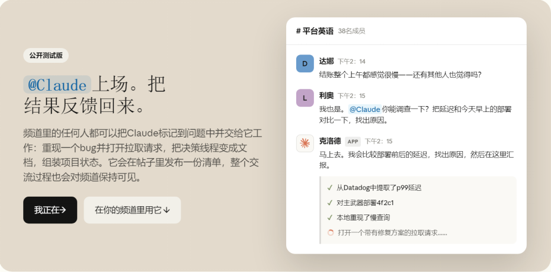
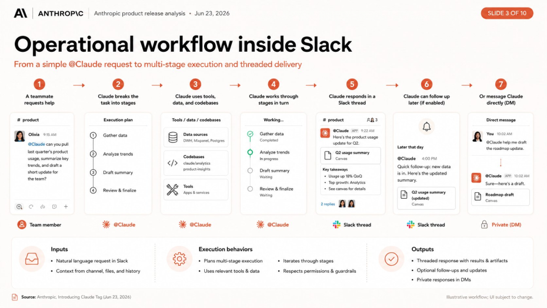
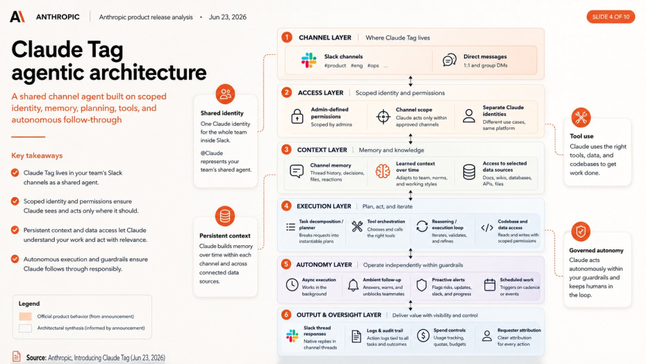

# Claude重磅升级！AI同事这次真要上班了 ，卡帕西兴奋表示：这是LLM UI的第三次改革。

> 公众号: 51CTO技术栈 | 发布时间: 2026-06-24 12:39 | 原文链接: https://mp.weixin.qq.com/s/ZMNOPRG_ayH6YHN0GFihCw

---

编辑 | 大石今天凌晨，Anthropic给Claude来了一个重磅升级：名字叫Claude Tag。把Claude放进Slack频道。团队成员在群里@Claude，就能让它查资料、看代码、拆任务、追问题，最后把结果返回到原来的线程里。Claude在北京时间6月24日凌晨发布消息时，用一句话总结：“一种团队与Claude合作的新方式”。

Claude官方X账号卡帕西也第一时间转发。他兴奋的表示，这是“LLM UI/UX的第三次重大改版”。

与此同时，Anthropic还在评论区透露，内部版Claude Tag已经成为他们完成任务的主要方式之一，公司产品团队65%的代码来自它。

这些信息透露出，似乎并不仅仅是Claude code更新这么简单！Claude被@进工作群了Claude Tag率先进入了Slack！管理员把Claude加入指定频道，再给它开通对应的工具、数据和代码库权限。之后，频道里的人只要@Claude，就能把任务交给它。

Anthropic官方物料视频：Claude Tag完整演示，从频道里接任务，到在线程中反馈结果。比如工程频道里有人发现一个接口延迟突然变高，以前大概率要在Slack、监控平台、代码仓库和工单系统之间来回切换寻找。现在可以直接在频道里@Claude。它会先理解这条线程里的上下文，再去查最近的部署、看监控数据、找相关代码，最后把可疑原因和下一步动作发回线程。

基于Anthropic官方信息整理真实的场景下，很多工作很少是从说一句完整提示词开始。它往往从一段抱怨、一个截图、一次排查、几个人的补充里开始的。Claude Tag做的，就是让AI待在这些事情可能发生的地方。一个频道，一个Claude，信息不再是孤岛个人AI聊天最大的问题，是信息不流通，你的Agent只能在你自己的窗口中工作。你没有办法让别人的Agent理解自己的工作环境。你想要知道同事问过什么，做了那些事情，模型又要重新理解背景。Claude Tag的设计换了一个角度。在同一个Slack频道里，大家面对的是同一个Claude。一个人发起任务，其他人可以看到进展，也可以在同一条线程里补充信息。Claude做了哪些步骤，查了什么，最后给出什么结论，团队每个人能看到。这对开发团队的帮助很大。很多协作成本，都花在“把话再说一遍”上。产品群讲过一遍，工程群再讲一遍；事故复盘里解释过的背景，下次排查又要重新翻。Claude Tag把这些重复同步的事情统统解决。Claude Tag才是真正的AgentClaude Tag更像Agent，因为它背后有一套分层逻辑。从截图看，它至少包含频道层、权限层、上下文层、执行层、自治层和审计层。

基于Anthropic官方发布信息整理频道层决定Claude在哪里出现。权限层决定Claude能看什么、能做什么。上下文层让它记住频道里的相关信息。执行层负责拆任务、调用工具、访问代码库。自治层让它能在后台继续推进任务。审计层则记录谁发起了任务、Claude做过什么、花了多少资源。这也是Claude Tag和传统Slack机器人的差别。机器人通常是收一条消息，回一条消息。Claude Tag能直接处理一段工作，从任务发起到结果交付，中间会经过多个系统。主动冒泡：一个认真到有点烦人的项目助理Claude Tag还有一个很特别的能力：主动介入。Anthropic把这类行为叫ambient behavior。开启之后，Claude可以跟进没人处理的线程，提醒被卡住的问题，也可以在发现相关信息后把团队叫回来。说白了，它不一定非要等你主动派送任务。这听起来很像一个认真到有点烦人的项目助理。但现实工作里，很多事都是因为疏忽而失败的。线上异常在群里说了几句，没人认领；一个PR卡在review里，两天没人动；客户问题被转来转去，最后只剩下一串聊天记录。Claude Tag能做的，就是主动把这些动作都整理出来，并且告诉整个团队。当然，主动性越强，越需要规则的限制。它能不能主动发消息，能提醒谁，能不能改代码，能不能访问客户数据，这些都需要团队自己衡量。进公司之前，Claude先过权限、预算和日志Claude Tag目前只面向Claude Team和Claude Enterprise客户开放Beta。这个开放范围已经表示，它不是给个人尝鲜的小插件，而是准备进公司流程的AI同事。一旦进公司，企业最先问的往往不是“它有多聪明”，而是“它能不能被管住”。先看它能进哪里。Claude不能随便出现在任何Slack频道里。管理员要先指定频道范围。不同部门的Claude不能随意进入别的部门。再看它能拿到什么。官方文档提到，管理员可以控制Claude可访问的工具、数据源和代码库。也就是说，Claude能查数据库，还是只能看文档；能读代码，还是能提交改动，要提前规划。第三个问题是花多少钱。Claude Tag支持组织级和频道级Token预算。Agent一旦开始跑长任务，就很容易从“个人订阅”变成“部门账单”。谁能用、用多少、超了怎么办，都得提前说清楚。最后是日志。企业必须知道Claude做过什么、谁让它做的、调用了哪些工具。没有这条记录，AI干得好不好先不说，一旦出问题，连追溯都很难。

基于Anthropic官方文档整理把AI放进聊天工具不难。难的是把它放进真实公司流程里，还能让权限、账单和责任说得清。开发者要适应一个新入口最近几个月，AI编程工具的入口一直在变。Cursor把Agent放进IDE，让它改代码、跑测试、处理长任务。Claude Code把命令行、代码库和本地工程接到模型身边。Claude Tag则把入口放到了Slack。这对开发者的影响很大。以后你让AI干活，不一定先打开编辑器。任务可能从一次群聊开始，从一次事故排查开始，也可能从一次产品讨论开始。以后开发者要能把任务拆清楚，把上下文补完整，把权限边界说清楚，最后还能检查AI交回来的结果。社媒已经吵起来了这次更新发布后，各大平台的网友都纷纷发表意见。有的把它概括成“Slack里的持久AI团队成员”，也有人提醒，这类总结可能会出错，最好是根据官方信息核对。

评论区的反应也很真实。有人第一眼想到的是Fable那类“AI社交/协作”产品，觉得这次更新像是把同事关系又往前推了一点。更多的是想要Fable赶快回来。

也有人更关心能不能给非企业用户用。

Claude Tag现在看起来很酷，但它离普通用户还有距离。Team和Enterprise客户可以先使用，这意味着价格、权限、稳定性和企业治理会先成为主线。Anthropic这次推出的不是一个人人马上能玩的新玩具。它更像是在提前告诉市场，AI同事开始进入公司工作流了。当@Claude出现在群里，真正的问题也会跟着出现。谁能给它派活？它能看哪些数据？它改出来的代码谁负责？一个频道的Token烧超了算谁的？这些问题越具体，说明AI同事离真实工作越近。参考链接：https://www.youtube.com/watch?v=VojDzHaciKQ——好文链接——Cursor首届大会直接摊牌：95%用量来自Agent，创始人搬出三项重磅更新AI下一站是多模型融合？AI 独角兽发布Fugu：号称基准测试比肩Fable！网友：这不就是AI服务包装器？在编程上没有难题能难倒Fable！Claude Code 创始人自曝：Loop工程将兴起，用一句提示词搞定 CI 优化

