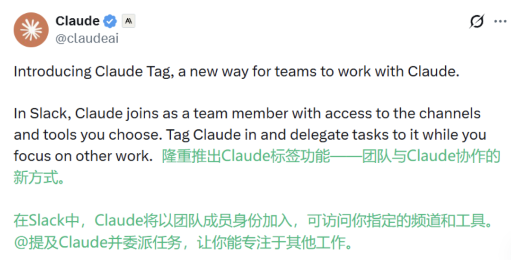
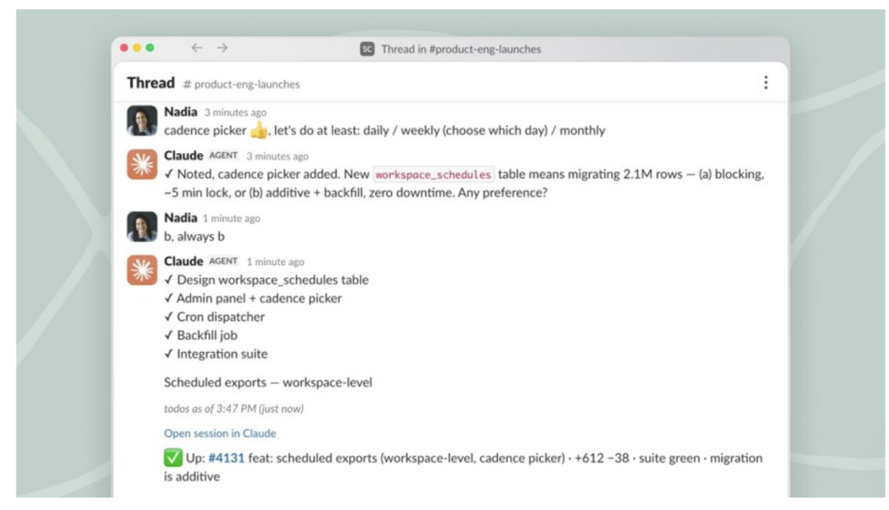
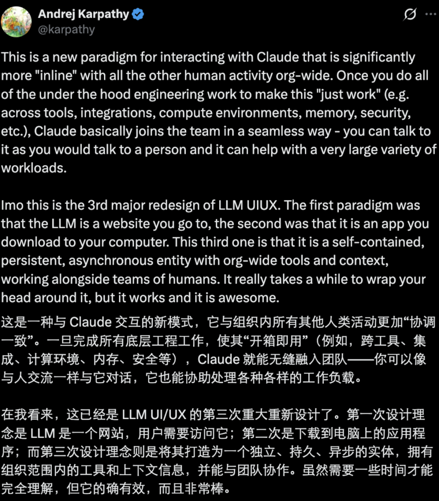

# 一夜之间，Claude成我同事了

> 公众号: 机器之心 | 发布时间: 2026-06-24 09:21 | 原文链接: https://mp.weixin.qq.com/s/34OgEvysvJynD7Tm-GIlvQ

---

机器之心编辑部现在，是一群人围着一个 AI 工作了。今天凌晨，Claude Code 迎来了一波重磅更新：Claude Tag。简单来说，Claude Tag 可让 Claude 以团队成员的身份直接加入用户的团队，用户只需在聊天框、文档等地方 @claude ，就能直接调用它来处理任务。或者按 Anthropic 的说法是「Claude Tag 是一种全新的团队协作方式，让团队成员能够与 Claude 一起工作。」

目前，这项功能仅支持 Slack 平台。Claude 作为一个智能体同事，具备持续记忆，能主动介入工作，可以像团队成员一样加入 Slack。用户可以授予 Claude 访问特定频道的权限，并根据需要连接各种工具、数据源，甚至代码库。

随后，频道中的任何人都可以通过 @Claude 指派任务，在自己专注于其他工作的同时，将任务交给它处理。Claude 会通过记住所在频道中的相关信息来积累上下文，并能够规划未来需要完成的任务。Anthropic 表示，将 Claude Tag 视为 Claude Code 演进的开端，它能够让模型变得更加主动，也更适合与整个团队协同工作。对于这次更新，Karpathy 给了很高的评价，称它是「LLM UIUX 的第三次重大重新设计。」「第一次设计理念是 LLM 是一个网站，用户需要访问它；第二次是下载到电脑上的应用程序；而第三次设计理念则是将其打造为一个独立、持久、异步的实体，拥有组织范围内的工具和上下文信息，并能与团队协作。」

而在 Anthropic 内部，「@Claude」已经成为团队完成工作的主要方式之一，产品团队 65% 的代码都由内部版本的 Claude Tag 生成。Claude Code 之父 Boris Cherny 透露称，「过去几个月里，Claude Tag 已经在 Anthropic 内部重塑了团队使用 Claude 的方式。」

此外，同样的模式也正在迅速扩展到工程之外的领域，他们会让 Claude 去追踪产品指标和数据、处理支持工单，甚至协助定位复杂 Bug 的根本原因。Anthropic 表示，之所以选择首先在 Salesforce 旗下的 Slack 上推出 Claude Tag，是因为 Slack 天然适合团队与 AI 协作，而且 Anthropic 的大量日常工作本就发生在那里。从某种程度上来说，Claude Tag 选择先进入 Slack，本质上是在抢占企业 AI 的「工作流入口」。今天起，Claude Enterprise 和 Team 客户即可使用 Beta 版 Claude Tag。下面具体介绍一下 Claude Tag 的多种能力。Claude Tag：为团队协作而生如果你使用过 Claude Code 或 Cowork，那么 Claude Tag 会让你感到熟悉。你只需用自然语言向 @Claude 提出请求，它就会将任务拆解为多个阶段，并利用自己能够访问的工具逐步完成。任务结束后，它会在 Slack Thread 中回复成果。不过，它还带来了一些全新的优势：Claude Tag 是多人共享的在同一个 Slack 频道中，只有一个 Claude 与所有人互动。这意味着每个人都能看到它正在处理什么，也能够在前一个人结束的地方继续接手对话。这使得与 Claude 协作和传统的一对一聊天完全不同。它更像是在与一位团队同事共同完成工作。Claude Tag 会持续学习随着 Claude 长期参与频道讨论，它会逐渐积累更多与工作相关的上下文信息。这意味着用户不必一次又一次从零开始解释背景。只要获得授权，Claude 甚至还能自动从其他 Slack 频道和数据源中学习。（它不会泄露私密频道的信息。）这些长期积累的隐性知识，使它能够提供更高质量的工作成果。Claude Tag 会主动行动如果启用了「Ambient」模式，Claude 会主动向你同步它认为重要的信息。它会从自己所在的频道和连接的工具中发现相关信息并提醒你，也会主动跟进那些长期没有进展、尚未解决的讨论串或任务。Claude Tag 支持异步工作你只需要把任务交给 Claude，然后专注于自己的其他优先事项即可。Claude 不仅能够执行任务，还能够为自己安排后续工作，在数小时甚至数天的时间跨度内持续推进项目。Anthropic 表示：「我们发现这一点在 Anthropic 内部尤其有价值。如今，我们花在并行委派任务给多个 Claude 的时间，远远多于亲自执行这些任务。」你还可以直接向 Claude 发送私信。它会在私密环境中回复，并使用你个人配置的工具和连接器。怎么用？Claude Tag 从一开始就是为团队和组织设计的，因此可以对 @Claude 访问敏感数据和专用工具的权限进行极为严格的控制。在部署过程中，系统管理员需要为不同频道指定 Claude 可以访问哪些工具和信息。你可以把这理解为创建多个不同身份的 Claude。无论是记忆还是上下文，都会被严格限制在管理员指定的频道范围内。例如：面向销售团队配置的 Claude 不会将其记忆共享给工程团队使用的 Claude。工程师也无法通过 Claude 获取销售数据或销售工具的访问权限。关于权限配置的更多信息，可参考相关文档。权限设置完成后，团队成员即可立即开始使用 @Claude。管理员还可以设置组织级和频道级 Token 消耗上限、查看 @Claude 执行过的所有操作日志、查看每个任务由谁发起。怎么开通？如果你是 Claude Enterprise 或 Team 客户，从今天开始即可使用 Claude Tag Beta 版。开通流程仅需四步：将 Claude Tag 与你的 Slack Workspace 配对；为 Claude 配置工具访问权限；设置组织的月度支出上限；在私有频道中测试 Claude，确认其运行正常。Claude Tag 将取代现有的 Claude in Slack 应用。管理员可以在未来 30 天内选择迁移。对于符合条件的 Enterprise 和 Team 组织，Anthropic 还将提供启动体验额度（Launch Credit），让整个公司都能试用这项新能力。Claude Tag 基于 Opus 4.8 运行。更多信息请参阅官方文档和产品页面。文档：https://claude.com/docs/claude-tag/overview产品页面：https://claude.com/product/tag有人在评论区提到，使用 Claude Tag 似乎要额外收费。

从官方公告来看，Claude Tag 本身没有单独额外收费，它是 Team/Enterprise 计划用户可用的 Beta 功能（会逐步扩大）。但它会消耗 token 用量（因为是主动、异步、带上下文的代理），管理员可以设置组织 / 频道层面的每月花费上限。如果超出计划包含的用量，就会触发 extra usage /additional billing，按标准 API 费率计费。Anthropic 还给符合条件的 Team/Enterprise 组织发放了 introductory launch credit（推出信用），方便大家先试用。不过，有些用户还是更期待 Fable 5 回归：

有没有用过的朋友分享一下，这个新功能消耗 token 的情况究竟如何？参考链接：https://x.com/claudeai/status/2069468693017268244https://www.reuters.com/technology/anthropic-launches-claude-tag-research-preview-slack-users-2026-06-23/https://techcrunch.com/2026/06/23/anthropics-claude-tag-is-learning-your-company-one-slack-message-at-a-time/

© THE END 转载请联系本公众号获得授权投稿或寻求报道：liyazhou@jiqizhixin.com
