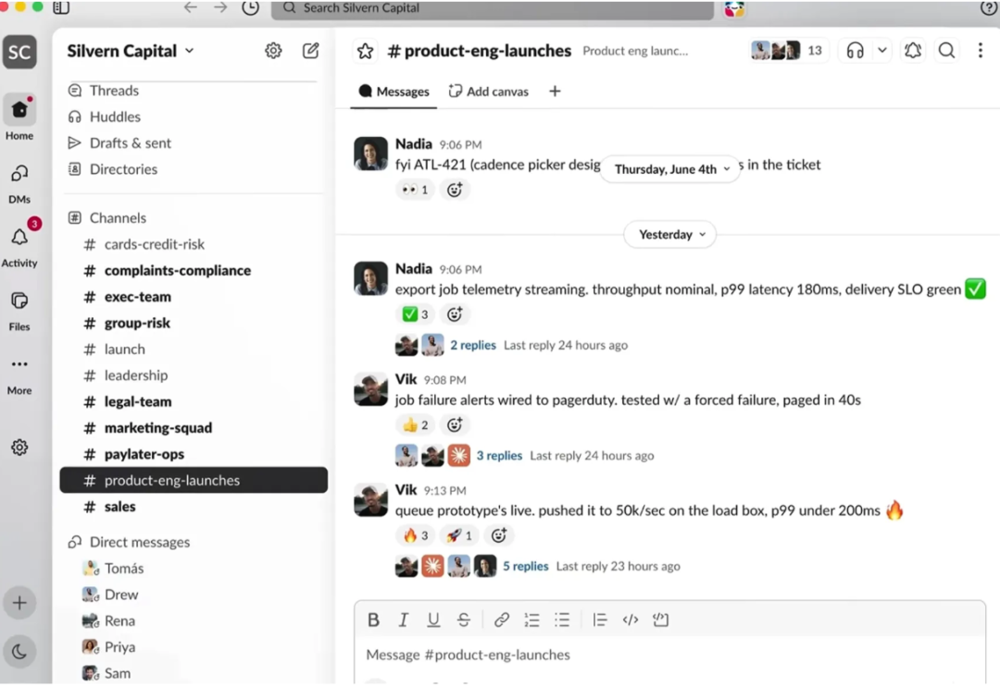
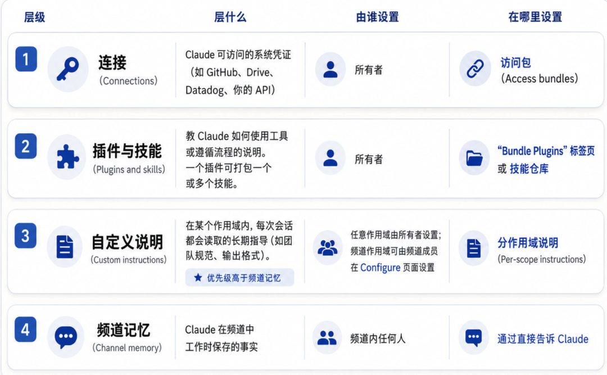
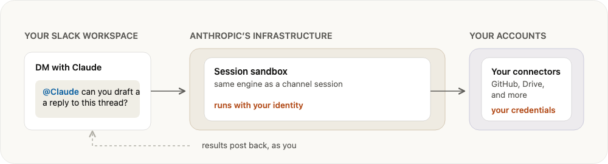

# 万字深度解析 Claude Tag！9 大落地场景全覆盖！干货拉满！

> 公众号: Lin夕的AI沉思录 | 发布时间: 2026-07-04 08:00 | 原文链接: https://mp.weixin.qq.com/s/_bS4LHzJ41eziyJ1RjAAiw

---

万字 Claude Tag 深度解析：错过了Claude Code，不要再错过 Claude Tag一年前claude code 发布，谁都没想到会掀起这样的巨浪，彻底改变了我们的编码习惯。已经错过了学习掌握Claude Code 的最佳机会，最新推出 Claude Tag一定不能错过，Karpathy 称之为大语言模型的第三次重大的范式转变。::: 第一阶段： 基于网页的传统对话聊天（Web-based Chat，如 ChatGPT、Claude.ai 网页版）。第二阶段： 桌面端应用或本地开发工具（如终端工具 Claude Code、Cursor 等）。第三阶段（Claude Tag）： LLM 演变为一个独立且持续运行的系统。它直接嵌入到企业组织现有的工具和上下文（如 Slack 频道）中，能够作为团队的一员，与人类成员实现无缝的自主协同工作。Claude Tag 适合什么场景先看一个场景。上午 9:02，你所在的 #platform-eng 频道，Dana 发了一条消息：“"checkout has felt slow all morning — anyone else seeing it?"紧接着 Leo 回复：“"same. @Claude can you investigate? Compare latency against this morning's deploy and find what's causing it."然后奇迹发生了。Claude 在 3 秒内回复：“"On it. I'll compare latency before and after the deploy, track down the cause, and report back here."接着，一条实时的任务清单出现在线程里：✅ Pulled p99 latency from Datadog✅ Diffed deploy 4f2c1 against main✅ Reproduced the slow query locally🔄 Opening a pull request with the fix…整个频道都看得到这个进展。没有人需要分配任务、没有人需要写工单、没有人需要拉群开会。从问题被发现，到原因被定位，再到 PR 被开出——整个过程发生在 Slack 的一条线程里，耗时不到十分钟。这就是 Claude Tag。不是概念 Demo，不是未来愿景。

Claude Tag 究竟是什么？简单说：Claude Tag 是把 Claude 以团队身份嵌入到你的 Slack 频道中。未来不只是 Slack，其他的 APP 也可能会进入，比如 teams，discord。它不是一个聊天机器人，不是帮你查资料的 Copilot，它是一个能在你的工具链里真实干活的工作 Agent。就像我们平时使用的 Claude Code，只不过 Claude Code 是工作在我们本地，但是 Claude Tag，是工作在我们平时的工作空间。2.1 基于 Slack 原生的交互交互方式简单到令人发指（究极建单）——在频道里输入 @Claude，后面跟你的需求，就够了。不需要安装 IDE 插件、不需要打开网页、不需要跳转到任何其他界面。Slack 就是你唯一的操作界面。整个团队的对话上下文、决策过程、工作流，全部发生在同一个地方，没有任何工具切换的成本。2.2 服务账号身份（不是你的身份）这里是最重要的架构决策：在频道里，Claude 用的是管理员事先配置好的服务账号，而不是你的个人账号。这意味着什么？所有操作可审计、可追溯不需要把你的个人 GitHub Token 暴露给任何人权限可以精细控制——#eng 频道能看到 GitHub 和 Datadog，#sales 频道能看到 Salesforce 和 Gong新同事加入团队，不需要配置任何东西，直接就能使用 Claude2.3 一个线程 = 一个工作 Session每次你在 Slack 里 @Claude，就会创建一个独立的 Session。这个 Session 运行在 Anthropic 托管的临时沙箱中，沙箱里有：完整的代码运行环境读写文件的能力网络访问（需要通过 Agent Proxy 控制）Session 结束时沙箱被销毁。下一次你再回复这个线程，沙箱会被重新构建。这种设计确保了隔离性和安全性——每次任务之间的状态是干净的。每个 Slack 线程对应一个 Session，非活跃时沙箱释放，回复时重建管理员部署指南：首先 Claude Tag，只有Slack 的管理员可以设置，只有管理员设置完了之后，其他人才可以使用。如果你是团队的管理员（Owner），部署 Claude Tag 大约需要 15 分钟。不需要写代码，不需要配服务器。先决条件：开始之前，有一些需要满足的先决条件：首先你得是 Claude 的 team 或者企业用户，订阅了相关的套餐，不适用于个人版套餐，个人版就没办法了。一个交没有ling配对工作空间：打开 **claude.com/claude-for-slack**[1] ，点击 “添加到 Slack” ，并授予 Slack 显示的所有权限。如果应用已安装，请跳过此步骤。在任何频道或 @Claude 信中向 @Claude connect 。Claude 会回复一个配对码。只有 Slack 工作区管理员（或 Grid 组织管理员）才能运行此命令；如果您不是管理员， **请向他们发送安装请求**[2] ，并让他们返回配对码。在 `**claude.ai/admin-settings/claude-tag**`[3] ，选择 “设置” （如果工作区已配对，则选择 “Claude Tag 工作区域” 旁边的“ + 连接” ），打开 “为您的工作区设置 Claude Tag” 向导。粘贴代码，选择是为整个工作区还是特定频道启用 Claude，然后单击 “下一步” 。向导会直接进入授予 Claude 访问权限的步骤，因此此时无需勾选任何选项；继续执行 **“授予 Claude 访问权限”**[4] 操作。向导完成后， “Claude Tag 工作位置” 下的 Slack 行会显示您的工作区已连接，并且其**作用域**[5] （您将在此处绑定工具访问权限）会出现在 Claude Tag 访问权限的 Slack 选项卡中。授予访问权限：前往 `**claude.ai/admin-settings/claude-tag**`[6] 。在 Claude Tag 的访问权限下， “Slack” 选项卡显示您的权限范围（默认 Slack 访问权限，然后是每个工作区）。在您希望应用捆绑包的范围内，单击 “访问捆绑包” 旁边的 “+”号 ，然后选择 “创建新捆绑包” 。这将一步创建捆绑包并将其附加到该范围；此时将打开捆绑包对话框。单击 “未命名配置文件” 旁边的铅笔图标以重命名它（控制台会交替使用“配置文件”和“访问包”）。设定消费上限频道中的工作消耗的是组织的 Usage Balance，而不是个人的按席位计费。管理员需要设定每个计费周期的 Spend Limit。Claude Slack APP 能获取什么Claude 阅读和发帖的地方：Claude 只会在工作区成员添加它的频道中阅读和发布内容，以及在与关联了 Claude 帐户的用户的私信中发布内容。安装此应用不会将其添加到任何频道。成员可以使用 /invite @Claude 命令邀请 Claude 加入，或者 Claude 也可以在成员请求时自动加入公共频道（` channels:join 权限范围）。无论哪种方式，都是由工作区中的用户发起；Claude 不会主动加入频道。要查看频道的完整历史记录，需要先被添加到该频道。工作区搜索可以显示公共频道的内容，就像任何具有搜索范围的应用一样。Claude Tag不会授予什么：GitHub、Google Drive、数据仓库或其他任何服务的凭证均由 Claude 组织所有者单独提供，并且存储在 Anthropic 的服务器上，而不是 Slack 服务器上。当被 @ 提及时，它会做出回应；对于它认为值得回复的其他消息，它也可能做出回应。也就是说 Claude Tag 并不能做到主动回复。定制Claude Tag：克劳德·塔格的行为受四个层面的影响，每个层面都位于不同的位置：

管理员控制：设置功能更多自定义说明每次会话中都会朗读的固定指导，例如团队惯例。优先级高于频道记忆。添加自定义说明[7]插件教 Claude 如何使用特定工具的技能包添加插件[8]连接每个频道可以访问哪些系统添加连接[9]默认模型Claude 在特定会话中处理的模型为特定会话选择模型[10]Slack 中的 Claude 版本在特定范围内选择哪个版本的答案（新版、旧版或关闭）从早期版本的 Claude in Slack 迁移[11]改变Channel的行为：不需要管理员也可以设置的能力：更改类似这样说更多Claude 如何格式化输出“记住，对于此频道：以表格形式发布报告”记忆[12]Claude 的健谈程度“发布超过一屏的内容前请先询问”记忆[13]Claude 何时关注某个主题“除非有人标记你，否则请保持沉默”控制 Claude Tag 何时回复[14]Claude 的定时任务“每天早上 9 点，发布未完成主题的摘要”设置例程[15]Claude 的记忆“你还记得这个频道的哪些内容？” 然后进行更正记忆[16]一些小贴士：先拿一个私有频道做 Pilot，验证所有连接正常工作后再推广每个服务创建专用账号（比如 claude@yourcompany.com），而不是绑任何人的个人账号IP 白名单要求提前和网络团队沟通——Anthropic 发布了固定的出口 IP 段，很多企业需要走流程授权Claude Tag里面的Agent是如何运作的：在 Slack 频道里面，Claude 具有特定的身份，属于其自身的服务账户，而不是属于某个特定的人，也没有特定的身份，跟某些数字分身的产品不同。Claude 中在系统中拥有自己的账号，Slack 中的 Claude 应用，Github 的 Claude Github，所有其他的链接工具的服务账户。在用户和 Claude 之间的私信中，已配置的身份不适用，私信仅限一对一交流，不支持群组私信。Channel Sessions：Claude 处理 channel 的时候会涉及三个系统：请求发生在您的 Slack 工作区中，当用户标记 Claude 执行某些操作或计划任务开始时。Claude 的工作是在 Anthropic 的基础设施上的沙盒环境中运行的，不会在您的网络中安装任何东西。代理的凭据用于连接其他系统，例如 GitHub 或数据仓库，以获取所需信息。下面是完整的一个流程：

在Channel 中@Claude tag：用户请求 Claude 绘制上周的注册数据图表或修复部署测试。该请求会启动一个新的会话。会话沙箱开始：Claude 在一个隔离环境中执行工作，Anthropic 为此线程构建环境，读取文件、写入文档并运行代码。您提供的凭据不会放置在沙箱中；它们保留在凭据存储中，并在代理服务器处注入。该请求通过代理服务器：当工作需要访问沙箱之外的资源时，例如调用 GitHub API 或查询数据仓库，请求会经过代理服务器（Agent Proxy），它是沙箱与其他所有网络环境之间的边界。代理服务器附加凭据：匹配的凭据来自凭据存储库，管理员的**连接信息**[17]就保存在这里。返回结果：经过身份验证的请求到达您的系统（例如 GitHub 或仓库），并将结果返回到线程。DM：直接消息私聊：与 Claude 的私信 (DM) 工作方式与频道不同。私信没有身份绑定机制，因此私信会话使用您自己的 claude.ai 帐户运行，就像在网页上使用 Claude Code 会话一样，使用您自己的连接器和凭据，并将结果归于您名下。此图与上面的频道路径形成对比；沙箱是相同的引擎，但其周围的一切都由您掌控。

非常重要的一个，channel 中的 claude 和 claude tag 的对比：在频道中在私信中作为其自身的服务帐户您访问权限频道的访问权限包您的个人连接器归属代理帐户，在每个工具的审核日志中您的姓名计费组织您的席位另外一个 Claude tag和 Claude Code 的对比：很多人不能理解，claude tag 和直接把 claude code 拉到群里面来有什么区别。Claude TagSlack 中的 Claude Code运行平台管理员配置的代理身份您在 Claude 应用中关联的 Claude 帐户访问权限遵循频道的访问权限套餐遵循您的权限计费组织您的席位架构深度拆解：三层模型要真正理解 Claude Tag，需要理解它的三层架构模型。我把它总结为 作用域（Scope）— 频道（Channel）— 线程（Thread） 三层。作用域层（Scope）这一层由组织的 Owner 配置，是整个模型的根基。它包括：身份与权限（Identity & Access）：管理员在此配置 Access Bundle——一组服务账号凭证和工具授权的集合全局指令（Custom Instructions）：跨所有频道的默认行为规则技能库（Skills Repository）：可复用的技能包，Claude 可以根据需要调用作用是定义这个团队能做什么——连接哪些工具、有多少预算、执行哪些规则。频道层（Channel）每个频道独立的配置空间：Channel Memory（频道记忆）：Claude 在公开频道中学习到的知识会变成工作区记忆，分享给所有公开频道；私有频道的记忆只对自己可见。频道级指令（Channel Instructions）：任何频道的成员都可以在 Claude 回复的 Configure 页面编辑，告诉 Claude 这个频道的沟通规范、语气偏好等。独立的连接授权：管理员可以为 #platform-eng 配置 GitHub + Datadog，为 #gtm-west 配置 Salesforce + Gong。关键点：权限跟频道走，不跟人走。 你在 #platform-eng 频道里问的问题，可以触及 Datadog 和 GitHub API。但同一个你在 #general 频道里问同样的问题，Claude 可能只能访问 Slack 历史消息。线程层（Thread）这就是每个具体任务的执行空间：每个线程拥有独立的沙箱每个线程的执行进度通过 Checklist 实时展示在频道中任何频道成员都可以在已有线程中回复来引导方向工作产物（文件、PR、图表）直接 post 在线程里，全频道可见一个例子理解三层假设你的团队有这样的配置：Scope: Acme Corp  ├── Access Bundle: Engineering Stack (GitHub + Datadog + Snowflake)  ├── Access Bundle: Sales Stack (Salesforce + Gong + HubSpot)  ├── 全局指令: "所有回复保持中文，用 Markdown 格式"  │  ├── #platform-eng (公开频道)  │   ├── 授权: Engineering Stack  │   ├── 频道指令: "用 emoji 标注状态 🟢🟡🔴"  │   └── 记忆: 工作区共享  │       └── Thread: "修复 checkout 延迟" ✅ PR #1423 merged  │       └── Thread: "分析 Q3 数据库性能" 📊 报告已发布  │  ├── #gtm-west (公开频道)  │   ├── 授权: Sales Stack  │   └── 记忆: 工作区共享  │       └── Thread: "本周 Pipeline Digest" 📈  │  └── #legal-review (私有频道)      ├── 授权: 无外部工具      └── 记忆: 仅本频道当你在 #platform-eng 里问 "帮我看下最近的错误率趋势"，Claude 会：读取这个频道的连接——它有 Datadog 授权查询 Datadog API 拉取指标在沙箱里生成图表把结果和图表 post 回你的线程如果你在 #legal-review 里问同样的问题，Claude 会说 "我没有连接 Datadog，无法查询。"这就是三层模型的优雅之处——它把授权、知识和执行解耦到了不同的层级，使得安全管理变得清晰可控。9 大用例场景全解析Anthropic 官方给出了 9 种经过验证的使用场景。我把它们分成四类来介绍：第一类：零配置即时可用（无需连接任何外部工具）这些场景的魔力在于——即使管理员只安装了 Slack App、什么都没连，Claude 也能干活。因为它能：读取 Slack 频道的历史消息（最多 50 条）搜索整个工作区的公开频道在沙箱里运行代码、生成文件场景 1：补进度（Catch Up）@Claude 帮我总结一下 #product-feedback 过去一周的重点讨论Claude 会扫描频道里的所有公开线程，提取主题、待办事项和关键决策，然后给出一个结构化的摘要。适用场景：休假回来后、跨团队同步时、项目中期复盘。场景 2：工单分流（Triage Requests）如果你有一个支持频道或需求收集频道，Claude 可以：直接回答它能力范围内的问题标记重复问题为复杂问题分配负责人定期生成热点主题汇总只需要两个 Setup Message 就能完成配置。场景 3：线程变文档（Turn Threads into Docs）@Claude 把#launch-plan 这个线程的决策整理成一份会议纪要Claude 可以从一条长线程里提取出决策点、行动项、负责人和时间线，输出为一份结构化的文档——可以直接发、可以存 Google Drive、也可以转化成 Jira Ticket（如果有连接的话）。场景 4：项目追踪（Track Projects）这对 PM 来说简直是降维打击。配置一个定时任务：@Claude 每天早上 9 点，post 一次 #project-aurora 的完成状态，按 P0-P2 排序Claude 会每天自动生成一份项目进度报告，并发到频道里。不依赖任何项目管理工具，完全靠频道里的讨论和线程。第二类：知识检索与数据分析（需要连接文档或数据工具）场景 5：文档问答（Find Answers in Docs）连接 Google Drive、Notion 或 Confluence 后：@Claude 查一下我们的假期政策——Remote 团队的产假是多少周？Claude 会在连接的文档库中搜索，找到相关文档，提取答案，并在回复中注明来源。相当于给你的团队配了一个 24/7 的文档专家。场景 6：数据问答（Answer Data Questions）连接 BigQuery、Snowflake 或 Redshift 后：@Claude 上周的 DAU 趋势怎么样？按平台分组，画个图Claude 会：理解你的自然语言问题将其转化为 SQL 查询在数据仓库上运行只读查询用返回的数据生成图表把图表直接发到线程里甚至不需要数据仓库连接——@Claude 从这个 CSV 画个趋势图，贴上 CSV，它也能在沙箱里用代码完成分析和制图。第三类：工程研发（需要连接 GitHub 和监控工具）场景 7：修 Bug（Fix Bugs）这是最能体现 Claude Tag 工程实力的场景。@Claude 用户反馈说登录页在 Safari 上白屏，帮我排查一下CRASH_STACKTRACE: ...Claude 会：从 Sentry 拉取错误堆栈Clone 对应仓库到沙箱复现 Bug定位根因开出 Draft PR持续观察 CI 状态直到全绿这一切都发生在线程里，整个频道实时看到进展。不需要分配任务、不需要写 Bug 报告、不需要来回沟通。这是 AI 从"帮你想"进化到"帮你干"的最典型场景。场景 8：监控告警（Watch Monitors and Alerts）连接 Datadog、Sentry 或 PagerDuty 后，配置定时检查：@Claude 每 2 小时检查一次 #alerts，每个告警一行：🔴 需要人工介入 / 🟡 观察中 / 🟢 已恢复Claude 会定期轮询你的监控系统，生成一个极简的"红绿灯"面板发到频道。你不用再被大量告警通知轰炸，一眼就能看清现状。第四类：商业化运营（连接 CRM 与销售工具）场景 9：商机与客户状态（Pull Deal and Account State）连接 Salesforce、HubSpot 或 Gong 后：@Claude 今天下午我和 Acme Corp 打电话，帮我做一个会前简报Claude 会拉取 Salesforce 中的商机阶段、历史互动记录、来自 Gong 的过往通话纪要，然后生成一份结构化的会前简报。甚至可以在每周一自动生成 Pipeline Digest：@Claude 每周一早上 9 点，Post 本周 Pipeline 摘要：Top 5 商机、风险项、下周预测这个场景对销售团队的价值不用我多说——省去了写周报、追数据、做会前准备的大量时间。Claude Tag 的工作习惯：让任务可终结Anthropic 的文档里有一段非常值得反复读的建议——如何写出"能终结的任务"。因为 Claude Tag 的核心交互模式是一个任务 = 一个线程，如果任务写不清楚，这个线程就永远关不掉。坏例子：“@Claude 研究一下我们的数据库性能然后呢？怎样才算做完？Claude 会写出一份长篇报告，你读完之后觉得还要更多分析，于是回复，沙箱重建，继续产出，你又觉得方向不对……线程永远不会终结。好例子：“@Claude 对比一下这段时间的 P99 延迟，定位根因，开一个 Draft PR这个任务的终止条件非常明确：PR 开出且 CI 变绿。Claude 可以自己关闭这个任务。Anthropic 归纳了四种终止条件：终止条件谁来关闭例子客观条件满足Claude 自动关闭"CI 变绿就算完成"你审批确认你，点一下"Draft 报告发在这里等我确认"你选择方案你，说一句"调研 A/B 方案并推荐一个"无明确条件没人能关闭"看看这个"——永远没有做完的那天给任务一个可验证的终点。 这是用好 Claude Tag 的最重要的一个习惯。记忆系统：Claude 记住了什么？Claude Tag 的记忆系统设计也很有意思。公开频道的记忆 → 工作区共享：你在 #launch-week 里教会 Claude 的某个知识，其他公开频道也能用到私有频道的记忆 → 仅本频道可见：安全性有保障记忆内容谁都能看、谁都能改：@Claude what do you remember about this channel?如果 Claude 搞错了某些事，任何人都可以纠正：“@Claude 记住：我们团队的发布窗口是周二和周四下午，不是每天都可以另外还有几个"知识写入点"，它们的优先级从高到低是：频道 Configure 页面 → 频道级指令，最高优先级CLAUDE.md → 仓库根目录的指引文件，任何涉及该仓库的任务都会读到频道记忆 → 自然交流中积累的知识Skills 仓库 → 组织级的技能包，由 Owner 维护值得一提的是，如果 Claude 在任务中学会了某个有用的查询模式，它可以自动开 PR 到 Skills 仓库——让它自己改进自己。一场静悄悄的变革Claude Tag 的意义，远不止是一个"给 Slack 加个 AI 机器人"的功能更新。它在做的事情，其实是重新定义团队协作的方式。在过去的工作模式里，一个问题的解决流程大致是：“发现问题 → 记下来 → 排优先级 → 分配给人 → 等人做 → 做完通知但有了 Claude Tag 之后，这个流程被压缩成了：“发现问题 → @Claude → 解决这中间跳过了多少环节？每个环节节省了多少时间？这不仅仅是效率的提升，这是工作流范式的切换——从"人驱动"到"意图驱动"。你说"帮我查一下延迟原因"，Claude 就去查了。你说"帮我画个图"，它就画了。你说"开个 PR"，它就开了。你不再需要告诉它怎么做，只需要告诉它要什么。当然，这还只是开始。Claude Tag 目前还是 Public Beta，还有很多不完善的地方：还没有提供自托管选项ZDR 组织无法使用线程读入上限只有 50 条消息沙箱文件不能持久化目前只支持 Slack但方向已经非常清晰了。AI 从对话助手到工作 Agent 的演进，正在从"我给你写代码"进化到"我加入你的团队"。如果你还没有尝试过 Claude Tag，现在可能是最好的时机。它给你一个低成本的窗口，去感受一个 AI Agent 真正"在团队里干活"是什么样的体验。不需要招新人、不需要改流程、不需要迁工具。在 Slack 频道里，@Claude 一下，试试看。Claude Tag 目前处于 Public Beta 阶段，部分功能和行为可能在正式发布时发生变化。本文基于官方文档_claude.com/docs/claude-tag_[18]以及公开资料整理。Routines：让 Claude 主动干活上面讨论的场景都是"你问它答"。但 Claude Tag 还有一个非常强大的能力——Routines（例行任务）。你可以让 Claude 按照你设定的计划，主动执行任务，而不需要每次都手动触发。定时任务@Claude 每天早上 10 点，检查 #alerts，post 一条告警摘要Claude 会记住这个设定（频道记忆），之后每天 10 点自动执行。不需要你每天早上手动触发。频道监控@Claude 留意 #bug-reports 频道里新发的消息，如果是前端相关的 Bug，自动帮我贴上下文并分配 P1 级别Claude 会被动地"看"着这个频道，一旦新消息满足条件，就自动介入处理。PR 订阅@Claude 帮我关注 #eng 频道里所有 P0 的 PR review 请求，超过 2 小时没被 review 的提醒我这对工程团队的 PR 周转率提升非常直接。如何管理 Routines所有活跃的 Routine 可以通过 @Claude 列出当前的例行任务 来查看。要暂停或删除：@Claude 取消每天早上 10 点的告警检查Routines 让 Claude Tag 从一个"被动的应答者"变成了"主动的团队成员"。这种从 reactive 到 proactive 的转变，才是 Agent 区别于 Chatbot 的核心。Skills 仓库：让 Claude 自己升级自己这是 Anthropic 比较有远见的一个设计——Skills 仓库。思路是这样的：你用一个 Git 仓库来存放组织里 Claude 可以使用的 Skills（技能包），每个 Skill 是一组结构化的指令，告诉 Claude 如何完成特定类型的任务。比如：datadog-query.md：如何正确查询 Datadog 指标salesforce-deal-review.md：如何做商机评审incident-response.md：事件响应的标准操作流程把这些 Skills 放在一个仓库里，授权 Claude 可以读取甚至写入这个仓库，神奇的事情就发生了——当 Claude 在频道里学会了一种更好的查询方式或工作流程，它可以自己开 PR 来更新 Skills 仓库。“"That worked. Open a PR to the skills repo so this query pattern is part of the Datadog skill."这意味着，你团队的最佳实践会随着 Claude 的使用自动沉淀下来。不是管理层自上而下推行，而是在日常工作中自然累积。每个新成员加入频道时，Claude 已经拥有了团队之前的所有积累。这其实就是机构知识管理的圣杯——知识不再沉睡在 Wiki 页面里，而是活在 Agent 的执行过程中。Prompt Library：最实用的开场白最后，Anthropic 官方整理了一份 Prompt Library，包含了经过验证的 Prompt 模板。我挑几个最好用的分享出来：探索性 Prompt@Claude what can you access from this channel?— 最简单的开始：让 Claude 自己告诉你它在这个频道里能做什么。频道行为设置@Claude 记住这个频道：把报告以表格形式输出，超过一屏的内容先问再发。— 设定频道的沟通规则。记忆检查@Claude 你记得关于这个频道的什么？— 查看 Claude 记住了哪些内容，也可以随时纠正。日常 Catch-up@Claude 帮我总结过去 24 小时 #product-feedback 里未关闭的线程，每个线程不超过 3 句话。— 高效的异步信息同步。文献级别的文档生成@Claude 从这个关于 Q2 发布的协作线程里，提取所有决策、行动项和时间线，整理成一份决策纪要。用中文，结构化的 Markdown 格式。— 把混乱的讨论变成结构化的文档。监控类@Claude 每 6 小时检查 #alerts，每个条目一行：🔴 需要人工介入、🟡 观察中、🟢 正常。除非有变化否则跳过 🟢。— 极简的监控面板。FAQ：常见问题速览Q: Claude Tag 支持 Slack 以外的平台吗？ A: 从现在的情况看，只支持 Slack。REST API 和 Web 界面都还没有开放出来。Q: 每个组织的 minimum plan 要求是什么？ A: 需要 Team 或 Enterprise 计划。Pro 和 Free 不支持。同时需要关闭 ZDR（Zero Data Retention）。Q: Claude Tag 的计费方式是什么样的？ A: 频道工作消耗组织的 Usage Balance，按用量计费（不是按人头），需要设定消费上限。私信走的是个人 claude.ai 账户配额。Q: 一个线程能读取多少历史消息？ A: 最多 50 条。长线程中，重要的上下文最好在 Prompt 里主动复述。Q: Claude Tag 和之前的老版 "Claude in Slack" 是什么关系？ A: Claude Tag 是在原位置替换老版本。现有 App 不受影响，但频道会被迁移到新版本。详细变化见 迁移指南[19]。Q: 能不能限制 DMs 不让团队使用？ A: 可以。管理员在设置中可以禁用 DMs。写在最后Claude Tag 是 Anthropic 在"AI Agent 进入工作流"这个方向上迈出的非常务实的一步。它没有去造一个新的协作平台，没有推一个新的聊天工具，而是直接嵌入到数百万人已经在用的 Slack 里。它没有搞一个复杂的配置界面让每个用户学习，而是在频道里 @ 一下就工作。它没有用一个巨贵的按人头定价模式，而是用按用量计费。这些选择都指向一个方向：把摩擦降到最低，让团队以一个**@**的代价来尝试 AI Agent。我们总是高估一年的变化，低估五年的变化。但 Claude Tag 让我觉得，这个变化可能比我们想象的要快。如果你的团队已经在用 Slack，花 15 分钟设置一下 Claude Tag，花一天时间在频道里 @Claude 试试。看看它能不能真正成为团队的一员。参考资源Claude Tag 官网[20]Claude Tag 官方文档[21]Claude Tag 架构与安全[22]安全与数据处理[23]Agent 身份模型[24]使用场景库[25]Prompt 示例库[26]参考资料[1] claude.com/claude-for-slack: https://claude.com/claude-for-slack[2] 请向他们发送安装请求: https://claude.com/docs/claude-tag/admins/pair-workspace#send-the-install-request-to-your-slack-admin[3] **claude.ai/admin-settings/claude-tag**: https://claude.ai/admin-settings/claude-tag[4] “授予 Claude 访问权限”: https://claude.com/docs/claude-tag/admins/add-connections[5] 作用域: https://claude.com/docs/claude-tag/concepts/glossary#scope[6] **claude.ai/admin-settings/claude-tag**: https://claude.ai/admin-settings/claude-tag[7] 添加自定义说明: /claude-tag/admins/attach-to-scope#add-custom-instructions[8] 添加插件: /claude-tag/admins/add-connections#attach-plugins[9] 添加连接: /claude-tag/admins/add-connections[10] 为特定会话选择模型: #choose-the-model-for-a-scope[11] 从早期版本的 Claude in Slack 迁移: /claude-tag/admins/restrict-access#migrate-from-the-earlier-claude-in-slack[12] 记忆: /claude-tag/users/memory[13] 记忆: /claude-tag/users/memory[14] 控制 Claude Tag 何时回复: /claude-tag/users/when-claude-responds[15] 设置例程: /claude-tag/users/proactivity[16] 记忆: /claude-tag/users/memory[17] 连接信息: https://claude.com/docs/claude-tag/admins/add-connections[18] claude.com/docs/claude-tag: https://claude.com/docs/claude-tag/overview[19] 迁移指南: https://claude.com/docs/claude-tag/admins/migrate-from-earlier[20] Claude Tag 官网: https://claude.com/product/tag[21] Claude Tag 官方文档: https://claude.com/docs/claude-tag/overview[22] Claude Tag 架构与安全: https://claude.com/docs/claude-tag/concepts/how-it-works[23] 安全与数据处理: https://claude.com/docs/claude-tag/concepts/security-and-data[24] Agent 身份模型: https://claude.com/docs/claude-tag/concepts/agent-identity[25] 使用场景库: https://claude.com/docs/claude-tag/users/use-cases[26] Prompt 示例库: https://claude.com/docs/claude-tag/users/prompt-library如果这篇文章对你有启发，欢迎【点赞】【转发】【收藏】评论区一起聊聊。— — — —
