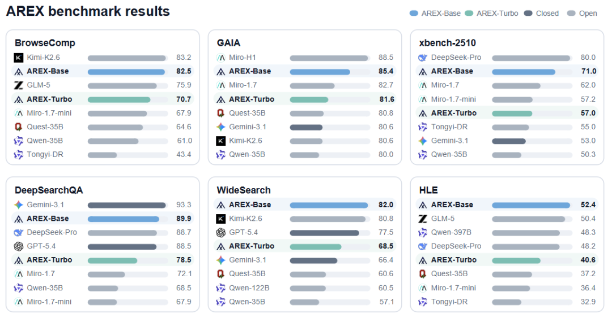
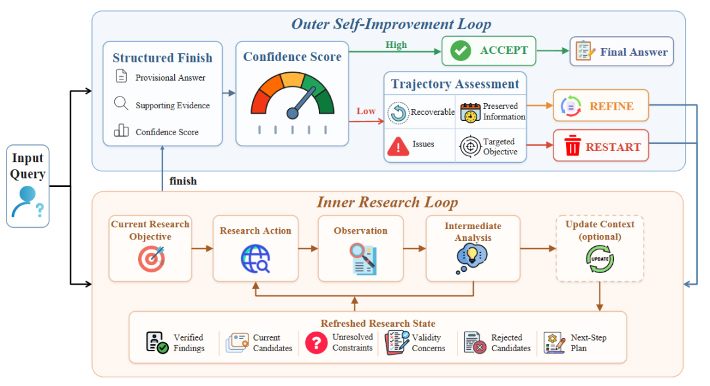
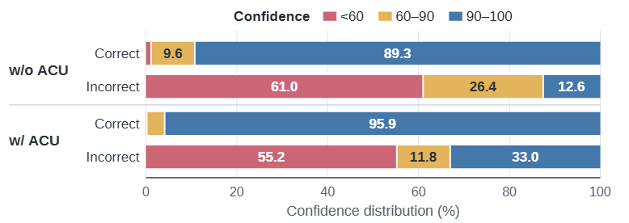
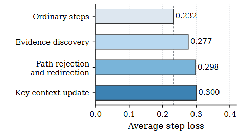

# AREX: 迈向递归自我改进的DeepResearch智能体

Source: https://mp.weixin.qq.com/s/cpYDNG_06tj_wJAg6_a5kA

原创

fireThunderbolt
fireThunderbolt

大模型视界

在小说阅读器读本章

去阅读

在公众号小说中沉浸阅读

大家好，我是视界君。

去年 DeepSearch、DeepResearch 还是很火的概念。那时候大家讨论的是：AI 能不能自己搜索网页、打开资料、比对信息，最后整理出一份像样的报告。

但到了现在，DeepSearch 这个词已经很少被单独提了。原因很简单，随着AI技术发展，“会搜索”已经不稀奇了。真正难的是，模型搜完之后，能不能判断哪些信息已经坐实，哪些条件还没满足，哪些方向其实早该放弃。

很多 DeepResearch 产品用久了都会遇到这个问题：它看起来查了很多资料，报告也写得很完整，但你仔细一看，会发现它不一定真的知道自己查到了哪一步。

BAAI 最近发表了一篇最新的论文 **AREX: Towards a Recursively Self-Improving Agent for Deep Research**，切中的正是这个变化。

DeepResearch 的下一步，不是继续把搜索链路拉长，而是让 Agent 学会递归式地修正自己。

Figure 1: Benchmark performance of AREX

AREX 在多个 Deep Research 和工具使用 benchmark 上取得了稳定表现。这里最值得看的不是单点分数，而是它证明了研究能力不只来自模型规模，也来自更好的研究流程设计。

## 搜索更久，不等于研究更深

DeepResearch 和普通搜索问答最大的区别，不是步骤更多，而是约束更多。普通搜索可能只需要找到一个事实。

比如某家公司什么时候成立，某篇论文是谁写的，某个产品价格是多少。但 DeepResearch 经常不是找一个点，而是找一个同时满足多重条件的答案。

它要确认时间对不对，来源靠不靠谱，候选对象是否唯一，不同资料之间有没有冲突，最后还要把证据组织成一个可信结论。

这时候，单纯“多搜几轮”并不一定有用。模型可能会反复访问类似网页，也可能会在一个错误候选上越查越深。更常见的是，它找到了一部分正确证据，然后提前给出一个看似完整、其实缺条件的答案。

AREX 抓住了一个关键判断：**发现一个完全正确的答案很难，但验证一个候选答案是否满足某个条件，往往容易得多。**

这就是论文里说的 discovery-verification asymmetry。发现难，验证相对容易。

AREX 的思路，就是把验证从最后一步，提前变成整个研究过程的控制信号。

## AREX 做的不是“再搜一次”，而是“带着问题重搜”

AREX 可以理解成两个循环。

内层循环负责做研究：搜索、浏览、读材料、整合证据，最后给出一个临时答案、证据和置信度。

外层循环负责审查这个临时答案：如果置信度足够高，就接受；如果不够高，就判断这轮研究有没有可保留的进展。

如果有，它会保留已经验证的部分，把没解决的问题转成下一轮更具体的研究目标。

如果这轮轨迹太乱，证据不可靠，方向也不值得继续，就直接重启。

Figure 2: AREX recursive self-improvement framework

AREX 的核心是内外两层循环：内层负责搜索和形成临时答案，外层负责验证、保留进展、发现缺口，并把下一轮研究变得更有针对性。这个设计很像真实研究。

人做调研时，很少是一条线查到底。更多时候是先形成一个候选判断，然后回头检查：这个结论哪里有证据，哪里只是猜测，哪里还需要补资料。

确认过的部分保留，没确认的部分继续查，方向错了就换。AREX 想让 Agent 学会的，就是这种“研究后的研究”。

## 长上下文不是越长越好

DeepResearch 跑久了，另一个问题会变得很明显：上下文会变脏。

搜索结果、网页摘录、失败假设、临时计划、重复信息，全都堆在上下文里。表面上看信息更多了，实际上模型更容易失焦。

很多系统会做摘要，或者等到 token 快满了再压缩。但这更像是“清理内存”，不一定真的服务于研究任务。

AREX 提出了一个机制：**Autonomous Context Updating，ACU**。它让模型主动调用 `update_context`，把当前研究过程整理成一个结构化状态。这个状态里会保留几类东西：

已经验证的事实；

当前候选答案；

还没解决的约束；

被排除的候选和原因；

下一步应该查什么。

这和普通摘要不一样，普通摘要关心“前面说了什么”，ACU 关心“接下来该怎么做”，这点非常关键。

DeepResearch 最怕的不是忘记所有信息，而是忘记某条路为什么已经走不通。模型一旦忘了被排除候选的原因，就很容易几轮之后又绕回去。

论文里的数据也说明，ACU 不是被上下文长度逼出来的被动压缩。在 BrowseComp 上，AREX 会在 80.3% 的案例里调用 `update_context`。平均调用时上下文长度约 25,721 tokens，远低于 128K 的上限。

也就是说，它不是等到上下文爆了才总结，而是在研究方向发生变化时主动刷新状态。其中，66.9% 的调用发生在修正搜索策略时，13.6% 发生在排除候选时。这更像是 Agent 自己在做阶段性复盘。

Figure 3: Confidence distributions for correct and incorrect outputs

AREX 会为临时答案生成置信度。正确答案更多集中在高置信度区间，错误答案则更多落在低置信度区间，这让外层循环可以判断什么时候接受、什么时候继续查。

## 真正该训练的，是关键步骤

AREX 还有一个很值得看但容易被忽略的点：它没有把一条成功轨迹里的所有步骤都看得一样重要。

长程研究任务里，大部分步骤其实很普通。打开网页、换个关键词、读一段资料、继续搜索。但少数步骤会决定整条轨迹能不能成功。比如第一次找到关键证据；比如意识到某个候选是错的；比如把搜索方向从 A 改到 B；比如在信息越来越乱时更新研究状态。如果训练时平均学习整条轨迹，这些关键步骤的信号会被稀释。

AREX 的做法是 key-step focused supervision，也就是重点训练关键步骤。论文里有个分析：普通步骤的平均 loss 是 0.232；而证据发现、路径拒绝与重定向、关键上下文更新这些步骤，loss 分别升到 0.277、0.298 和 0.300。这说明模型最难学的，并不是机械地继续浏览，而是那些真正改变研究方向的判断。

所以 AREX 会把训练信号集中到这些决策点上。

Figure 4: Average step loss after full-trajectory mid-training

关键步骤的 loss 明显高于普通步骤，说明模型在长程研究中最难学的不是常规浏览，而是证据发现、方向修正和上下文更新这些决策点。

这件事对 Agent 训练很有启发。我们过去经常关心最终答案对不对，但长任务的成败，往往是在中间几个岔路口决定的。

## 效果说明：流程结构开始变得和模型大小一样重要

AREX 做了两个版本：一个是 4B dense 模型 AREX-Turbo，另一个是 122B 总参数、10B 激活参数的 MoE 模型 AREX-Base。

结果里最有意思的，不是它某个单点 benchmark 多高，而是它在多个 Deep Research 和工具使用任务上都比较稳定。在 BrowseComp 上，AREX-Base 达到 82.5，在 GAIA 上达到 85.4，在 DeepSearchQA 上达到 89.9，在 WideSearch-en 上达到 82.0，在 HLE with tools 上达到 52.4。

这些指标并不是靠最大模型硬堆出来的。比如 Qwen3.5-397B 在 BrowseComp 上是 78.6，AREX-Base 是 82.5；在 WideSearch-en 上，Qwen3.5-397B 是 74.0，AREX-Base 是 82.0。

通过这些实验数据可以看出：DeepResearch 能力不只是参数规模问题，也是流程结构问题。

模型当然要强，但它也要知道怎么保存进展，怎么验证约束，怎么排除错误方向，怎么在低置信度时重新定义下一轮问题。

消融实验的结果也能看出问题，在 BrowseComp 上，如果没有 ACU，也没有外层自我改进循环，准确率是 59.6。如果加上外层循环后到 69.8，只加 ACU 到 71.4，两个都加上，达到 82.5，完整系统比基础配置高了 22.9 个点。

这说明“递归式研究流程”不是装饰，而是长程 Agent 能力的一部分。

## DeepResearch 接下来方向是什么

去年大家讨论 DeepSearch，是因为 AI 第一次像一个会动手查资料的助手。但现在 DeepSearch 没什么声音了，也说明这件事已经进入下一阶段。单纯搜索不再稀缺，更重要的是，模型能不能在搜索过程中维护一个清楚的研究状态。它应该知道：

我确认了什么；

我还没确认什么；

哪些候选已经排除；

哪些证据相互冲突；

下一步最该查哪个缺口。

这也是 DeepResearch 产品接下来真正要卷的地方。不是报告写得更长；不是网页搜得更多；不是上下文塞得更满。而是让用户能看出来：这个 Agent 不是在堆材料，而是在推进一个可验证的研究过程。

## 但 AREX 也有边界

AREX 的前提，是任务本身可以被验证。

如果一个问题可以拆成多个约束，每个约束都能找到证据判断真假，那这套方法很适合。比如事实核查、竞品调研、论文调研、市场信息整理、复杂资料综合。

但如果任务本身是开放创意、审美判断、战略取舍，或者验证本身和发现一样难，AREX 这套外层循环的效果就会下降。

另外，真实世界的信息环境比 benchmark 更复杂。网页会变化，来源会冲突，证据会过期，搜索工具也会返回噪声。要把这套机制做成稳定产品，还需要大量工程细节。

但方向已经很清楚。DeepResearch 不能只是“会查”，它要能在查的过程中不断校准自己。去年 DeepSearch、DeepResearch 火起来，是因为 AI 从回答器变成了搜索助手。

AREX 这类工作指向的是下一步：AI 从搜索助手，变成会验证、会复盘、会递归推进的研究型 Agent。这可能才是 DeepResearch 真正变深的开始。

## 参考资料

* arXiv: AREX: Towards a Recursively Self-Improving Agent for Deep Research

今日荐文

* [深度爆料：训练一个层就能吊打全参数？大模型RL后训练惊现“权力中心”！](https://mp.weixin.qq.com/s?__biz=MzYzNjI4NjMzNw==&mid=2247484658&idx=1&sn=d47ce6a352a0f322ac0e825382e5b68d&scene=21#wechat_redirect)
* [如何从零开始成为一名智能体人工智能工程师](https://mp.weixin.qq.com/s?__biz=MzYzNjI4NjMzNw==&mid=2247484688&idx=1&sn=8a5bfe12f3ca8e6b623f9582bcfe764c&scene=21#wechat_redirect)
* [深度爆料：训练一个层就能吊打全参数？大模型RL后训练惊现“权力中心”！](https://mp.weixin.qq.com/s?__biz=MzYzNjI4NjMzNw==&mid=2247484658&idx=1&sn=d47ce6a352a0f322ac0e825382e5b68d&scene=21#wechat_redirect)
* [DSpark：DeepSeek 如何让大模型推理提速 85%？](https://mp.weixin.qq.com/s?__biz=MzYzNjI4NjMzNw==&mid=2247484639&idx=1&sn=ed623aa736df223b5369082938d6c5e2&poc_token=HGM5Rmqj0ZP3BsKvzgaAb8az8bK0c60mVvEpEWbr&scene=21#wechat_redirect)
* [Codex 插件进了 Claude Code：AI 编程开始从“单模型冲锋”变成“多模型协作”](https://mp.weixin.qq.com/s?__biz=MzYzNjI4NjMzNw==&mid=2247484639&idx=1&sn=ed623aa736df223b5369082938d6c5e2&poc_token=HGM5Rmqj0ZP3BsKvzgaAb8az8bK0c60mVvEpEWbr&scene=21#wechat_redirect)
* [Agent记忆框架选型：自己搭，还是用开源](https://mp.weixin.qq.com/s?__biz=MzYzNjI4NjMzNw==&mid=2247484601&idx=1&sn=59d88cbee96ebda011d604bea4755190&scene=21#wechat_redirect)
* [AIHOT 更新了一版，这次它更像一个真正能用的信息工作台](https://mp.weixin.qq.com/s?__biz=MzYzNjI4NjMzNw==&mid=2247484572&idx=1&sn=07daeef1bb5e831b8e5a722d01234752&scene=21#wechat_redirect)
* [谷歌DeepMind最新报告：AGI之后，人类将面对什么？](https://mp.weixin.qq.com/s?__biz=MzYzNjI4NjMzNw==&mid=2247484589&idx=1&sn=156a60f81a5020c5bd0bf8e92045fd68&scene=21#wechat_redirect)
* [任何文件都可转 Markdown：一个值得收藏的 Agent 开发工具](https://mp.weixin.qq.com/s?__biz=MzYzNjI4NjMzNw==&mid=2247484558&idx=1&sn=3270c1ffb80f5621593d3dc224600d21&scene=21#wechat_redirect)
* [智能体开发实战｜从零开始构建 Claude Code（五）：Skill 机制与按需加载领域知识](https://mp.weixin.qq.com/s?__biz=MzYzNjI4NjMzNw==&mid=2247484530&idx=1&sn=5d209473eb22730242fd8b0537b30e5f&scene=21#wechat_redirect)
* [我最近是怎么用 Codex 的：把它真正用顺手的 6 个方法](https://mp.weixin.qq.com/s?__biz=MzYzNjI4NjMzNw==&mid=2247484511&idx=1&sn=6073a346a080a25075bb88beec8f5184&scene=21#wechat_redirect)
* [大多数公司根本没有为 AI 做好准备](https://mp.weixin.qq.com/s?__biz=MzYzNjI4NjMzNw==&mid=2247484490&idx=1&sn=398ba631ce92db887ec7d68eaad679e8&scene=21#wechat_redirect)
* [Claude 越来越能干活，Anthropic 先解决的却是“它最多能闯多大祸”](https://mp.weixin.qq.com/s?__biz=MzYzNjI4NjMzNw==&mid=2247484545&idx=1&sn=9438979ec100444648fabf54204cc7ac&scene=21#wechat_redirect)

*如果你对大模型的前沿技术感兴趣，欢迎关注“大模型视界”，一起学习更多AI知识！*

预览时标签不可点

使用小程序

取消
允许

取消
允许

取消
允许

×
分析

：
，
，
，
，
，
，
，
，
，
，
，
，
。
 
