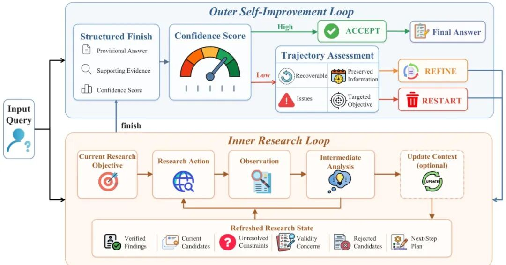
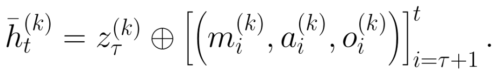
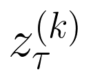
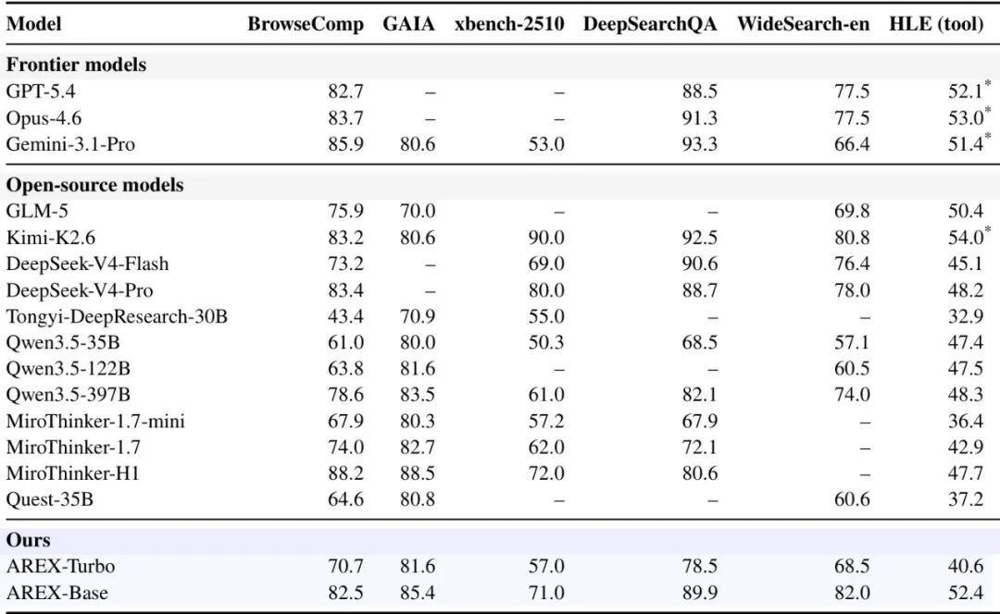
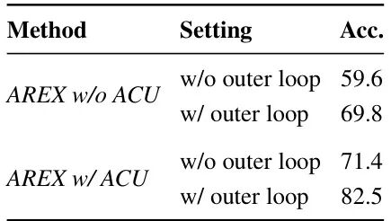
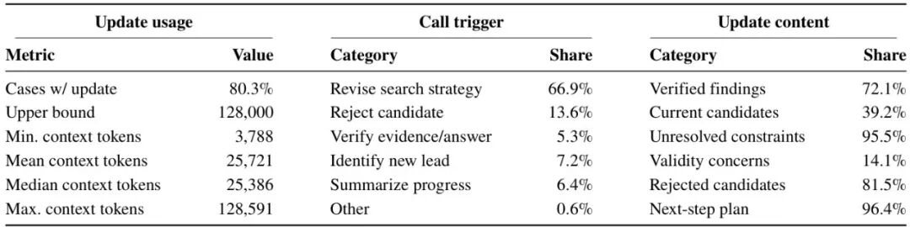
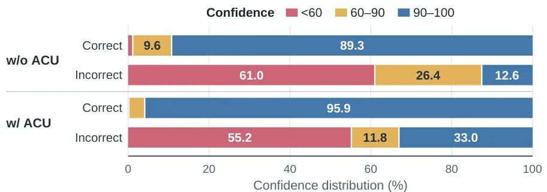
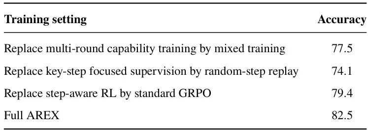

# AREX递归自我改进深度研究智能体 多榜超同规模基线 模型已开源

Source: https://mp.weixin.qq.com/s/nOPNSR2mTtT5mlvQH2OFsA

AI论文速读

在小说阅读器读本章

去阅读

在公众号小说中沉浸阅读

**每天分享高价值AI前沿成果，干货不断，点个关注不迷路！**

**[论文刷不完？让优质文献主动找上门](https://mp.weixin.qq.com/s?__biz=MzkyOTk5MTcxMQ==&mid=2247494081&idx=1&sn=36830bcd086835a8d5ea3c5474996d63&scene=21#wechat_redirect)**

正文开始

**文章原标题**：AREX: Towards a Recursively Self-Improving Agent for Deep Research 

**文章作者**：AREX Team etc.

**关键词**：深度研究智能体|递归自我改进|长时序研究|自主上下文更新|步感知强化学习

---

### 深度研究找答案难？让AI一步步自我优化答案

现在面对复杂深度研究任务，比如多约束信息检索、学术调研、复杂问题推理，AI智能体往往要在海量信息里找同时满足多个条件的答案——找到正确答案成本极高，但验证一个候选答案却可以拆成简单的逐个约束检查。这种「找答案难、验答案易」的不对称性，之前的AI框架都没好好利用：现有方法大多只是单纯延长搜索时间，早期错误会一直残留，还经常重复走已经证明无效的搜索方向，甚至提前接受不完美的半成品答案。

来自北京智源人工智能研究院（BAAI）的最新工作，针对这个痛点提出了全新的递归自我改进框架，让AI自动验证已有答案、保留正确部分、针对性优化未解决问题，实现系统性的答案迭代进步。

---

### 论文技术速览

▌核心贡献：提出基于发现-验证不对称性的双层递归自我改进深度研究智能体框架

▌性能指标：AREX-Base WideSearch准确率82.0% | BrowseComp准确率提升22.9个点 | 超同规模基线，性能匹敌大参数模型

▌代码状态：模型已开源

▌技术谱系：单轨迹搜索扩展 → 验证排序候选 → 验证引导递归自我改进

---

### 从盲目搜索到针对性优化：深度研究智能体的进化

深度研究智能体的发展其实一直绕不开一个痛点：搜索时间越长，积累的错误和冗余信息越多，反而越难得到正确结果。最早的方法就是简单给搜索加步数、加上下文，希望搜得越长结果越好，但实际上早期错误会一直保留，AI还经常重复搜索已经被排除的方向，算力浪费非常严重。

后来研究者们发现了深度研究的一个核心特性：**发现-验证不对称性**——要从零找到满足所有约束的正确答案，需要搜索巨大的空间，成本极高；但如果已经有了一个候选答案，要验证它对不对、哪里不对，就可以拆成一个个简单的约束检查，容易很多。之前的工作已经开始用验证来给候选答案排序，或者在单条搜索轨迹里修正局部决策，但都没有把验证用在整个研究流程的迭代上。

既然验证可以告诉我们「哪些对了、哪些还不对」，为什么不直接用验证结果来定义下一轮的搜索目标？把已经验证正确的部分保留，把不对的部分摘出来针对性再搜索，这样不就能一步步递归改进答案了？这个思路就是AREX诞生的起点。

---

### 双层递归+关键训练：拆解AREX的技术设计

AREX的核心设计是一套双层递归自我改进框架，配合自主上下文管理和针对性训练方法，解决长时序深度研究的痛点，我们一步步拆解来看：

#### 整体双层递归框架

图1：AREX的递归自我改进框架，内循环维护研究状态输出带置信度的临时答案，外循环根据置信度和轨迹评估选择接受、精炼还是重启研究。

整个框架分为两层循环交替工作：

**内层研究循环**：负责收集证据、整合信息、生成临时答案。从初始研究目标出发，一步步调用搜索、浏览工具，把得到的证据整合进当前答案，直到当前目标已经被充分研究，最后输出结构化的临时答案：包含最终答案、支持证据、以及模型对这个答案的置信度分数。 

**外层自我改进循环**：负责验证临时答案、决定下一步动作。如果置信度超过阈值，直接输出答案；如果没超过，就检查当前轨迹还有没有可用信息：有用就保留已经验证正确的部分，把未解决的问题提炼成下一轮的研究目标，回到内层循环继续优化；如果轨迹完全没用，就直接扔掉重来，避免错误信息干扰。 

#### 自主上下文更新：解决长研究的历史冗余问题

深度研究动辄几十上百步交互，对话历史会越来越长：如果全保留，冗余信息会干扰推理；如果随便截断，又会丢掉已经验证的证据和被排除的错误路径。传统方法用固定规则截断或者固定长度触发总结，本质只是控制上下文长度，不是维护研究状态，经常丢关键信息。

AREX的解决方法是**让模型自己决定什么时候调用`update_context`工具**，把积累的交互历史压缩成紧凑的改进状态：保留已经验证的发现、当前候选、未解决约束、有效性问题、被拒绝的候选和下一步计划，删掉冗余的过时信息。压缩后的状态完全围绕当前研究目标组织，比保留全历史更有利于后续决策。

压缩后的有效上下文定义为：

其中就是压缩后的改进状态，后续只需要基于这个状态加新的交互做决策即可。

#### 分阶段关键步聚焦训练：让模型学会正确的研究行为

为了训练AREX的递归研究能力，作者团队先构造了专用的训练数据集：合成了大量需要多轮搜索、多约束验证的深度研究任务，再用强教师模型生成高质量研究轨迹，过滤掉错误、无效的轨迹后用来训练。

训练过程分为多阶段逐步提升能力：

**渐进式能力获取**：先训练浏览密集型任务，让模型学会工具使用和网页浏览；再训练推理密集型任务，强化长思考和假设验证能力；最后混合巩固，避免不同能力互相干扰。 

**关键步聚焦监督**：作者发现，长轨迹里大多数都是常规步骤，只有少数关键步骤（比如找到关键证据、排除错误方向、更新上下文）决定最终成败，但这些步骤恰恰是模型最不容易学好的。因此训练时把更多的监督信号放在这些关键步骤上，集中优化高价值的决策，比均匀训练全轨迹效果好很多。 

**步感知强化学习**：在强化学习阶段，同样对关键步骤做奖励塑形，给成功轨迹里的关键步骤额外奖励，同时用分层归一化解决长轨迹信用分配不均的问题，进一步优化研究策略。 

---

### 多基准验证：小模型也能打过更大的 baseline

本文在六个覆盖不同类型深度研究任务的基准上做了评测，总体结果如下：

表1：各模型在深度搜索和智能体推理任务上的对比结果

从结果可以看到：

 122B总参数、10B激活参数的AREX-Base， consistently超过同规模的开源基线，甚至超过了参数大很多的Qwen3.5-397B；在WideSearch-en上拿到了82.0%的当前最优成绩，在多个任务上性能和前沿闭源模型相比也不落下风。 

 4B参数的AREX-Turbo，在六个基准里有五个超过了35B参数的Qwen3.5-35B，充分体现了框架的效率优势。 

作者进一步做了组件消融，验证每个设计的作用：

表2：自主上下文更新（ACU）和外自我改进循环的效果，在BrowseComp上测试准确率

可以看到，两个设计都带来了非常大的提升：同时加上两个组件，比两个都不加的基线准确率提升了22.9个百分点，充分证明了递归自我改进的有效性。

对于上下文更新的行为分析显示：

表3：BrowseComp上上下文更新的行为统计

AREX会主动在研究的转折点调用上下文更新，80.3%的任务都会触发，平均更新时上下文只有2.5万token，远低于128K的上限，说明模型确实把它作为整理研究状态的工具，而不是爆上下文后的被迫操作。更新后95.5%都会保留未解决约束，96.4%保留下一步计划，完全符合设计预期。

置信度评分的有效性也得到了验证：

图3：正确和错误输出的置信度分布，每个柱都按组归一化

结果显示，95.9%的正确输出置信度都在90-100之间，超过一半的错误输出置信度低于60，可以很好地支撑外循环的决策，不需要重新解读全轨迹就能判断要不要继续优化。

最后对训练方法的消融也验证了各个组件的贡献：

表4：训练方法各组件的消融结果

把渐进式训练改成直接混合训练掉5个点，把关键步监督改成随机步 replay掉8.4个点，把步感知RL改成标准GRPO掉3.1个点，说明每个训练设计都对最终效果有重要贡献。

---

### 资源汇总

**论文来源**：https://arxiv.org/abs/2607.21461 

**相关模型**：https://huggingface.co/collections/BAAI/arex 

### 总结

AREX抓住了深度研究任务中发现-验证的不对称性，提出了递归自我改进的全新框架：通过内层研究循环生成临时答案，外层自我改进循环按约束验证、分离已解决和未解决问题

预览时标签不可点

使用小程序

取消
允许

取消
允许

取消
允许

×
分析

：
，
，
，
，
，
，
，
，
，
，
，
，
。
 
