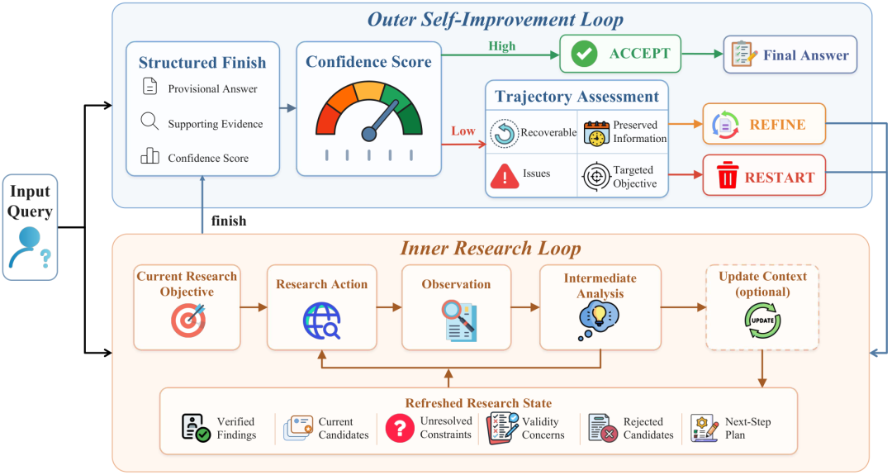
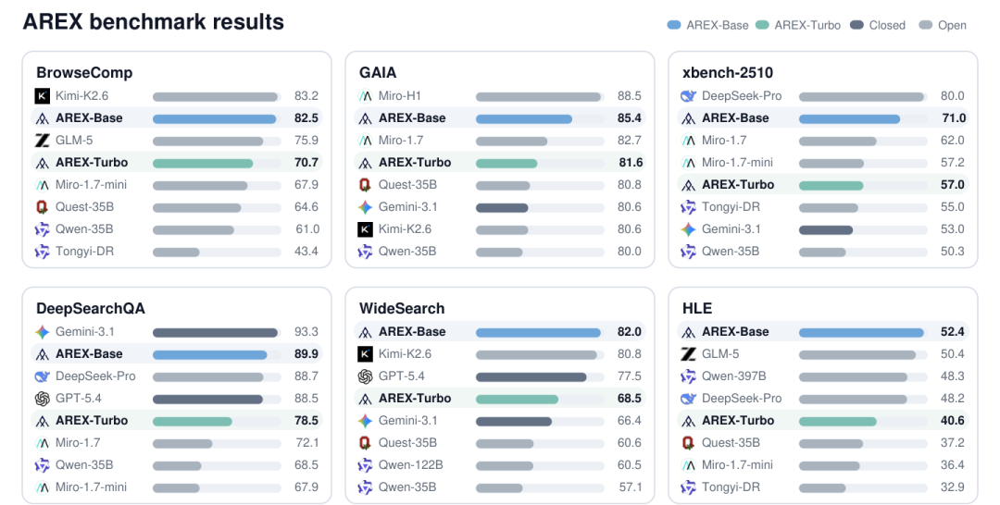

# BAAI提出AREX：递归自我改进的深度研究Agent

Source: https://mp.weixin.qq.com/s/SCxf0UGXMffbCRCtarZSGg

原创

日行一力扣
日行一力扣

paper艾克赛

在小说阅读器读本章

去阅读

在公众号小说中沉浸阅读

# AREX: Towards a Recursively Self-Improving Agent for Deep Research

> **作者**：Shuqi Lu, Chaofan Li, Kun Luo, Zhang Zhang, Hui Wang, Hongwang Xiao, Zheng Liu, Lei Xiong, Jiahao Wang, Sen Wang, Xiyan Jiang, Wanli Li, Yuyang Hu, Hongjin Qian, Bingyu Yan, Ziyi Xia, Yingxia Shao, Kang Liu, Zhicheng Dou, Di He, Chaozhuo Li, Qiwei Ye, Zhongyuan Wang, Zheng Liu  
> **核心发表机构**：Beijing Academy of Artificial Intelligence (BAAI)  
> **论文链接**：arXiv:2607.21461v1  
> **发布于**：arXiv 预印本（cs.AI）

---

## 一、核心贡献 / Core Contributions

* **形式化深度研究为递归自改进过程**：基于深度研究中“发现”与“验证”之间的不对称性，本文提出一个双层递归框架，使智能体能够通过逐约束的审计与定向跟进，系统性地改进临时答案，而非简单地延长单条搜索轨迹。
* **提出AREX框架**：该框架由内研究循环和外自改进循环构成。内循环负责执行具体的搜索、阅读与证据整合，并输出带有置信度的结构化答案。外循环则对答案进行逐约束审计，根据置信度与轨迹可恢复性进行接受、精炼或重启决策，从而实现递归改进。
* **引入自主学习的上下文更新工具**：针对长程研究中历史轨迹急剧膨胀的问题，AREX使模型自主学会调用一个名为`update_context`的工具，将已验证证据、未决约束、下一步计划等核心研究状态压缩为紧凑的改进状态，从而在长程交互中维持高效、准确的决策能力。
* **提出多阶段训练框架与关键步骤聚焦策略**：为解决长程强化学习中的稀疏奖励与信用分配难题，本文设计了三阶段训练流程（能力获取、智能体中期训练、长程RL），并特别强调对证据发现、方向修正、关键上下文更新等决策关键步骤的额外监督与奖励塑形。
* **实现并验证了不同规模的AREX模型**：实现了密集4B参数（AREX-Turbo）和122B-A10B MoE（AREX-Base）两种变体。在BrowseComp、WideSearch、DeepSearchQA、HLE等多个深度研究与推理工具使用基准上，AREX大幅超越同规模基线，并与使用更多激活参数的模型保持竞争力。

## 二、研究背景与动机 / Background & Motivation

深度研究智能体的核心任务是找到一个能够同时满足多个约束条件的答案。例如，回答“某公司在特定年份发布的一款采用自研架构的移动芯片，其GPU核心频率是多少？”这一问题，需要同时满足时间、公司、产品、芯片架构、属性等多个约束关系。在此类任务中，**发现答案的成本极高**，因为模型必须在广阔的搜索空间中组合证据并迭代推理；然而，**验证一个候选答案却相对容易**，因为验证过程可以分解为若干个独立的、可追踪的单约束检查，例如“时间是否正确？”“架构是否匹配？”“频率是否来源于可信文档？”这种“发现-验证不对称性”是本文方法论的基石。

现有的深度研究方法，如长程推理时扩展或多轮语义搜索，往往倾向于在一条轨迹内进行更深入的探索。这虽然能增加找到答案的概率，但存在根本性缺陷：早期探索阶段形成的错误假设可能在整个轨迹中延续并污染最终结果；已充分探索的无效方向可能被反复访问，造成计算资源的浪费；而那些部分正确、但存在局部缺陷的候选答案，可能在没有诊断其原因的情况下被过早接受。简单增加搜索轮次并不能解决上述问题，关键在于如何识别当前答案中哪些约束尚未解决，并利用诊断结果来指导下一轮更具针对性的研究。

现有工作中，验证通常被用作一种排序手段（对已完成的多条轨迹进行排名），或在单条轨迹内辅助决策精炼。AREX的创新之处在于，它将验证升级为递归过程的**转换算子**：验证的输出不再仅仅是评估分数，而是一个经过部分验证的“研究状态”，该状态明确区分了已被证据支持的约束和仍需进一步调查的缺失环节。这使智能体能够从“漫无目的地搜索”转变为“基于缺失信息驱动的高效调查”。

此外，长程研究中庞大的交互历史对模型是一个巨大的负担。传统的方案使用固定启发式（例如丢弃工具响应全文、设定固定Token阈值触发摘要）来管理上下文。这些方法本质上是一种预算控制，而非智能的状态维护。它们会丢失关键信息，如来源出处、被证伪的候选原因、证据之间的冲突、以及尚未解决的约束，从而导致模型重复探索或做出次优决策。因此，需要一个由模型自主控制的、能够动态压缩历史并维持研究状态的方法。

## 三、方法 / Methodology

### 3.1 总体框架 / Overall Architecture

AREX的核心是一个双层递归自改进循环，其整体架构如下所示。

AREX

1. \*\*内研究循环 (Inner Research Loop)\*\*：该循环负责具体的执行过程。给定一个由外循环或原始问题指定的研究目标 ，内循环中的策略  会产生一系列动作，如发起搜索（`search`）、浏览网页（`visit`）、调用上下文更新（`update_context`）以及最终完成（`finish`）。每一步的动作  都会从环境中获得观察 ，并伴随模型的中间分析 ，从而构成轨迹 。当模型认为当前目标已充分研究时，会调用 `finish` 接口，输出一个包含临时答案 、支持证据集  和置信度分数  的结构化结果 。
2. \*\*外自改进循环 (Outer Self-Improvement Loop)\*\*：该循环负责质量审计与决策。它接收内循环的输出，并根据置信度分数  和一个阈值  做出决策决策：

* 若 ，则 **接受 (Accept)** 当前答案为最终答案。
* 若  且轨迹可恢复（），则进入 **精炼 (Refine)** 模式。外循环的诊断模块  会分析当前结果，识别尚未满足的约束 ，提炼需要保留的有用信息 ，并生成下一轮的研究目标 。
* 若  且轨迹不可恢复（，如完全走入了死胡同），则 \*\*重启 (Restart)\*\*，下一轮从头开始研究。

### 3.2 关键模块 / Key Modules

**自主上下文更新（`update_context` 工具）**

长程轨迹会累积大量冗余信息（如原始工具响应、被推翻的中间结论、过时的计划），这使得直接基于完整历史  决策变得困难。为解决此问题，AREX赋予模型一个可自主调用的 `update_context` 工具。当模型认为需要进行重大认知更新时（例如解决了有意义的子问题、排除了主要候选答案、协调了冲突证据、或改变了研究计划），即可调用该工具。

该工具的输出是一个被压缩的“研究状态” ：

理想的  应包含：经核实的发现及其来源标识、当前候选答案、所有未解决的约束、关于有效性的担忧、已被拒绝的候选及其原因、以及下一步研究计划。它抛弃了所有冗余信息。

在后续决策中，模型不再使用完整历史，而是使用“有效上下文” ，该上下文由压缩后的状态  和最后一次调用 `update_context` 之后的少量新步骤构成。这使得模型能在远低于最大长度限制的上下文中进行高效决策。研究表明，`update_context` 的使用频率很高（80.3%的案例中均被调用），主要触发原因是有策略地修订搜索方向（66.9%）或拒绝无效候选（13.6%）。

**结构化答案外化（`finish` 接口）**

不同于直接输出最终答案，AREX的内循环通过 `finish` 接口输出一个结构化的研究结果，其显式地包含答案 、支撑证据  和置信度 。置信度分数是模型对自己答案的自我评估，它不仅考虑了答案的正确性，还整合了完整性、一致性、证据出处可信度和时间有效性等因素。这个结构化结果是外循环进行递归决策的关键输入，它使得外循环可以“审计”内循环的工作，而非简单地接受一个文本结果。

**置信度引导的外循环决策**

外循环的决策逻辑基于置信度阈值 。实验表明，模型的置信度分数能够有效地区分正确和错误的答案，如下图所示，正确的答案倾向于聚集在高置信区间（90-100），而错误的答案则在低置信区间（<60）有大量分布。尽管低置信度区间存在大量错误，仍有一部分正确答案处于低置信度，这为外循环的Refine机制提供了价值窗口。

*[表：ACU 与外循环对 BrowseComp 准确率的影响（原文表格）]*

tab:browsecomp-accuracy

## 四、实验 / Experiments

### 4.1 数据集与评估指标 / Datasets & Metrics

AREX在多个标准基准上进行评估，涵盖深度研究、广域搜索、智能体推理和工具使用等维度。

* **深度学习研究**: 采用 **BrowseComp** 和 **DeepSearchQA**。前者要求从多源网页信息中综合出满足多个约束的答案，以准确率评估；后者评估信息搜索与整合能力，以F1分数评估。
* **广域搜索**: 采用 **WideSearch**，评估在开放网络上的广覆盖检索与综合能力，使用Item-F1评估。
* **智能体任务完成**: 采用 **GAIA**，评估通用AI助手在完成真实世界任务时的能力，以准确率评估。
* **高级推理与工具使用**: 采用 **Humanity's Last Exam (HLE with tools)** 和 **xbench-DeepSearch-2510**，评估模型在解决极困难问题时的推理与工具调用能力，以准确率评估。

### 4.2 主实验结果 / Main Results

AREX的主实验结果，包括AREX-Turbo（4B密集）和AREX-Base（122B-A10B MoE）的关键结果如下。

Benchmark performance of AREX

* **总体性能**: AREX-Base 在多个基准上表现卓越。在BrowseComp上，它达到了82.5%的准确率，超越了此前同规模及以下的模型，甚至优于参数量更大的Qwen3.5-397B（78.6%）。在WideSearch-en基准上，它达到了82.0的Item-F1，在所有报告中模型中最优，超过了GPT-5.4和Opus-4.6等专有模型。在DeepSearchQA上，其F1分数达到了89.9。在与Kimi-K2.6、MiroThinker-H1等顶尖开源研究智能体的比较中也表现出相当或更优的性能。
* **规模效率**: AREX-Turbo（4B）的表现极具竞争力，在6个基准测试中的5个上超越了Qwen3.5-35B，证明了AREX框架在较小规模模型上的有效性，其递归自改进机制能极大地释放模型的能力。

### 4.3 消融实验 / Ablation Study

AREX的消融实验系统性地验证了其训练配方中各个组件的贡献，所有消融均在BrowseComp基准上进行。

| 消融变体 | BrowseComp 准确率 | 说明 (性能下降) |
| --- | --- | --- |
| **完整 AREX-Base** | **82.5** | - |
| 变体A: 移除关键步聚焦监督 | 74.1 | 下降8.4点 |
| 变体B: 移除步感知强化学习 | 79.4 | 下降3.1点 |
| 变体C: 移除多轮能力混合训练 | 77.5 | 下降5.0点 |

* **关键步骤聚焦监督的重要性（变体A）**：用来自相同浏览密集型轨迹池的随机普通步骤替代精心挑选的关键步骤。结果显示性能骤降8.4点，是所有消融中下降最大的。这表明，将额外的监督信号精确地用于模型在学习过程中最困难、最具决策性的节点（如证据发现、方向修正），比简单地均匀分配给任意中间步骤要有效得多。
* **步感知强化学习的贡献（变体B）**：直接将步感知RL目标替换为标准GRPO。性能下降3.1点，虽然不如变体A大，但依然证明，在中训练获得基础能力后，基于轮次级精细信用分配的RL优化是微调研究策略、突破性能瓶颈的关键步骤。
* **渐进式多轮能力训练的必要性（变体C）**：将浏览密集型训练和专家推理训练从一开始就混合。性能下降5.0点，表明异构能力的直接混合可能导致学习干扰。渐进式的、先浏览后推理的课程学习策略是稳定且高效建立长程行为模式的基础。

下图展示了关键步与普通步在监督训练前后的损失差异。实心条（有监督）相对于条纹条（无监督）在三种关键步骤上的损失下降更为显著，直接印证了额外监督的针对性价值。

*[图：关键步与普通步 loss 对比（原文 Figure 4）]*

fig:key-step-loss

## 五、相关工作 / Related Work

**工具增强的深度研究**：现有工作（如WebGPT、Search-o1、MiroThinker）大多数力于扩展单条轨迹内的探索能力，通过工具使用微调、合成轨迹、强化学习和推理时计算扩展来加强搜索和综合。AREX解决的是一个互补但根本不同的问题：在取得部分进展后，智能体必须识别哪些约束已满足、哪些未解决，并基于此诊断定义下一阶段的研究问题。这是一个关于**状态识别与问题重构**的问题，超越了单纯“更深入地搜索”。

**作为递归研究控制的验证**：早期工作将验证用作最终答案的过滤器（对候选轨迹排序）或局部动作的批评者。本文将验证提升为不同研究轮次之间的**转换算子**。审计过程将临时答案转换为一个部分验证的状态，该状态的结构决定了下一轮研究是“精炼”还是“重启”。这种用法使验证不再是终点的评价，而是进程中的决策引擎。

**研究状态管理与长程训练**：为应对长程交互，现有方法包括层次化记忆（如MemGPT）、虚拟上下文管理和周期性摘要。而AREX的不同之处在于，其上下文更新工具是由模型**自主学会调用**的，它生成的是一个围绕研究目标组织的“改进状态”，内含证据、引用、约束状态、未解决差距和下一步计划。这种结构化状态比纯文本摘要更适合长程决策。在训练上，本文提出的关键步聚焦策略解决了长程信用分配问题，其效果在稠密和MoE模型上均得到了验证。

## 六、局限性与展望 / Limitations & Future Work

* **对可验证任务的依赖**：AREX的关键步骤标注、置信度分数学习以及外循环的诊断决策都强烈依赖于存在清晰参考答案和可验证约束的合成或结构化任务。在答案开放性极高或创造力要求强的任务（如开放式科学假设生成）中，如何自动定义“约束”并实现有效的验证引导，仍是一个开放挑战。该方法在更广泛任务上的有效性尚待验证。
* **大规模计算的瓶颈**：尽管AREX-Base（122B-A10B MoE）性能卓越，但在部分任务上仍落后于少数使用更多激活参数或更大计算预算的专有模型。这表明模型容量和计算规模仍然是进一步提升上限的潜力瓶颈。AREX-Turbo（4B）虽表现出色，但与最前沿模型仍有明确差距。
* **状态压缩的有损性**：虽然`update_context`工具能有效压缩历史，但这种有损压缩可能会丢弃一些看似冗余、但在后续步骤中突然变得重要的信息。完全依赖于模型自主评判“什么该保留、什么该丢弃”可能存在风险，未来研究可探索更鲁棒的自适应压缩策略。
* **未来方向**：论文指出，研究更通用、更自主的机制来动态估计每一步的效用，并据此分配细粒度的训练信号，是构建更可靠、更通用的长程研究智能体的重要方向。此外，轨迹自蒸馏等初步探索也显示了通过自我生成数据来对齐策略分布与动作分布的可能性，是未来迭代中的一个潜在途径。

## 七、总结 / Conclusion

本文提出了AREX，一个用于深度研究的递归自改进智能体。其核心洞察在于利用深度研究中的“发现-验证不对称性”，通过双层循环机制——内循环负责探索与构建，外循环负责审计与重构——将临时答案转化为部分验证的研究状态，从而驱动系统性的、目标明确的递归改进。自主学习的上下文更新工具与多阶段训练框架（特别是关键步骤聚焦策略）是支撑这一机制得以在长程任务中有效运行的关键技术。在多个涵盖深度搜索、广域搜索和高级推理的基准上，AREX取得了卓越的性能，其4B和MoE变体均展现了框架的强大潜力和规模泛化能力。此项工作验证了验证引导的状态细化和步感知优化是构建可靠长程研究智能体的一个有前途方向。

**原文摘要:** Deep research requires agents to find answers that jointly satisfy multiple constraints. Discovering such answers is costly, whereas verifying a candidate can often be decomposed into tractable constraint-wise checks. This discovery--verification asymmetry suggests that a research agent should do more than simply search longer: it should recursively improve its current answer by verifying intermediate results and using the partially verified state to guide subsequent refinement. We introduce AREX, a family of Recursively Self-Improving (RSI) deep research agents. AREX alternates between an inner research loop that gathers evidence and constructs a provisional answer, and an outer self-improvement loop that audits the answer constraint-wise, identifies unresolved claims, and launches targeted follow-up research. To sustain RSI over long horizons, AREX learns an autonomous context-update tool that compresses growing interaction history into a compact improvement state preserving verified evidence and unresolved constraints, without relying on an external model. We train AREX on verified synthetic tasks and high-quality trajectories through agentic mid-training and long-horizon reinforcement learning. To mitigate sparse final rewards during long horizon learning, we emphasize key steps where decisive evidence is acquired or erroneous research directions are corrected. We instantiate a dense 4B model and a 122B-A10B Mixture-of-Experts model. Across BrowseComp, WideSearch, DeepSearchQA, Humanity's Last Exam (HLE), and other reasoning and tool-use benchmarks, AREX substantially outperforms comparable-scale baselines and remains competitive with models using substantially more activated parameters.

**PDF链接:** https://arxiv.org/pdf/2607.21461v1

预览时标签不可点

微信扫一扫  
关注该公众号

知道了

微信扫一扫  
使用小程序

取消
允许

取消
允许

取消
允许

×
分析

：
，
，
，
，
，
，
，
，
，
，
，
，
。
 
视频
小程序
赞
，轻点两下取消赞
在看
，轻点两下取消在看
分享
留言
收藏
听过
