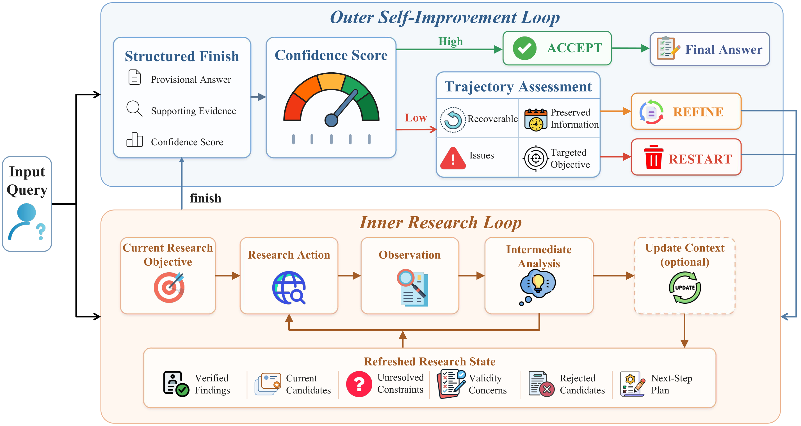
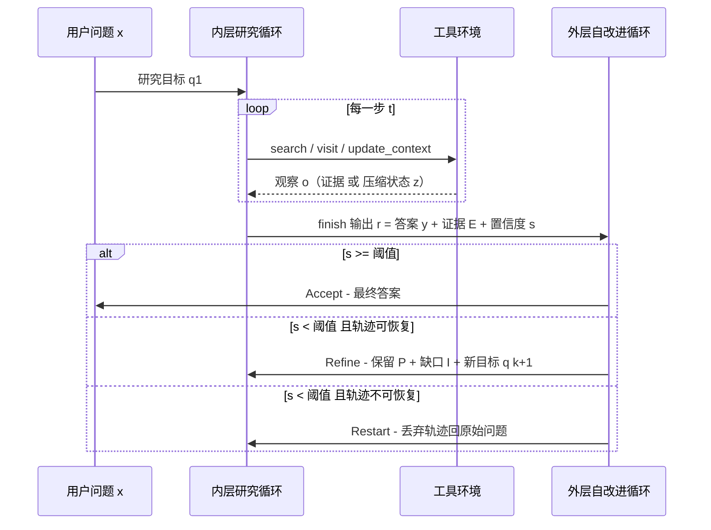
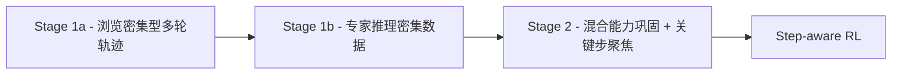
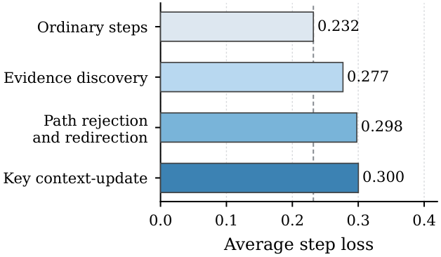
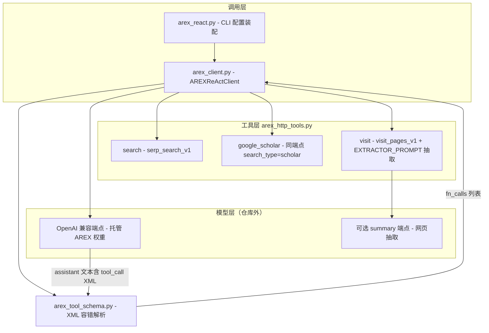
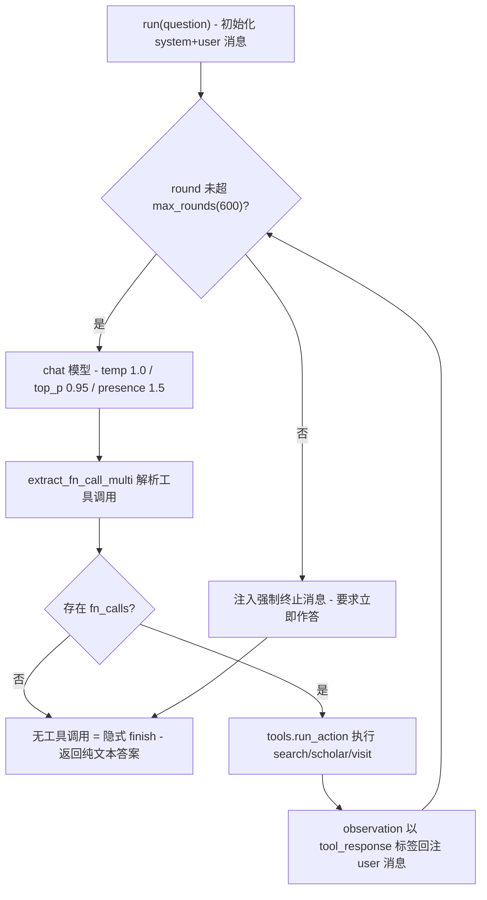
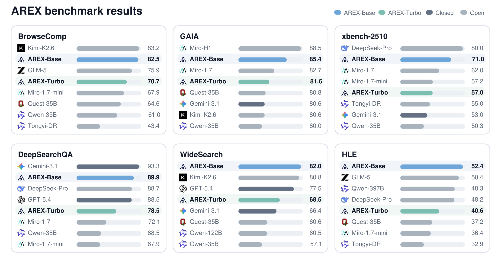
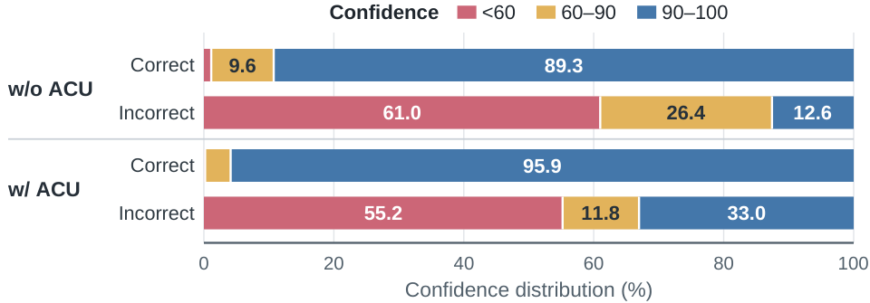

# AREX：递归自我改进的深度研究 Agent —— 论文与代码调研报告

> 调研时间：2026-09-09 ｜ 论文版本：arXiv:2607.21461v3（2026-09-01）｜ 子模式：C1+C3（论文为主 + 代码分析）

---

## 📋 基本信息

<p align="center"><b>表1：论文基本信息</b></p>

| 项目 | 内容 |
|-----|------|
| 论文标题 | AREX: Towards a Recursively Self-Improving Agent for Deep Research |
| 作者 | Shuqi Lu, Chaofan Li, Kun Luo, Zhang Zhang, Hui Wang, Hongwang Xiao, Lei Xiong, Jiahao Wang, Sen Wang, Xiyan Jiang, Wanli Li, Yuyang Hu, Hongjin Qian, Bingyu Yan, Jianlyu Chen, Ziyi Xia, Yingxia Shao, Kang Liu, Zhicheng Dou, Di He, Chaozhuo Li, Qiwei Ye, Zhongyuan Wang, Zheng Liu（24 人） |
| 核心机构 | Beijing Academy of Artificial Intelligence（BAAI，智谱/智源系）；代码归于 VectorSpaceLab |
| 发表形式 | arXiv 预印本 cs.AI，v1 提交于 2026-07-23，当前 v3 修订于 2026-09-01 |
| 论文链接 | https://arxiv.org/abs/2607.21461 |
| 项目主页 | https://vectorspacelab.github.io/arex-model/ |
| 在线应用 | https://arex-research.com |
| 代码仓库 | https://github.com/VectorSpaceLab/arex-model（推理侧 quickstart，⚠️ 不含训练代码，详见第 5 章） |
| 模型权重 | https://huggingface.co/collections/BAAI/arex（AREX-Turbo 4B dense；AREX-Base 122B-A10B MoE） |
| 引用数 | 预印本过新，暂未收录 |

**一句话定位**：AREX 把"发现难、验证易"的不对称性（discovery–verification asymmetry）作为第一性原理，将深度研究建模为**内层研究循环 + 外层自改进循环**的双层递归过程——验证不再只是终局打分，而是驱动"接受 / 精炼 / 重启"三种状态转移的控制信号；再用自主上下文更新工具（ACU）把膨胀的研究历史压缩为可继承的改进状态；最后用"关键步聚焦监督 + 步感知强化学习"把上述行为训练进模型权重。产物是 4B 与 122B-A10B 两档开源权重，在 BrowseComp、WideSearch、DeepSearchQA、HLE(tools)、GAIA、xbench 六个基准上以 10B 激活参数超越了 397B 的 Qwen3.5-397B。

---

## 1. 研究背景与动机

### 1.1 问题定义：多约束深度研究

深度研究（deep research）与普通检索问答的本质区别不在步骤多少，而在**约束耦合**：一个有效答案必须同时满足多个相互纠缠的条件。论文给的典型形态如"某公司在特定年份发布的、采用自研架构的移动芯片，其 GPU 核心频率是多少？"——需要时间、公司、产品、架构、属性五类约束同时成立，且每条约束都要有可追溯的证据支撑。

<p align="center"><b>表2：深度研究任务的四类瓶颈</b></p>

| 瓶颈 | 表现 | 根因 |
|-----|------|------|
| 证据发现难 | 正确答案在巨大稀疏的搜索空间中 | 联合满足多约束的候选极少 |
| 早期错误残留 | 第一条轨迹里的错误假设一路污染到终局 | 单轨迹延伸范式无法"回头" |
| 重复探索 | 已被证伪的方向被再次访问 | 没有显式记录"为什么放弃某候选" |
| 过早接受 | 部分满足约束的答案被当成最终答案 | 缺少逐约束的完成度诊断 |

### 1.2 现有方法的局限：搜索更久 ≠ 研究更深

主流 DeepResearch 系统（Search-R1、WebDancer、DeepSeek 系、MiroThinker 等）的应对方式是**延长单条轨迹**：更多推理步、更多工具调用、更长上下文。论文指出这条路线的三个失效模式：早期错误持续存在、耗尽的方向被重复访问、部分有效的候选被过早接受。"更长的搜索并不必然带来系统性进展"——问题的关键是**识别当前解中哪些约束仍未满足，并用这个诊断构造更聚焦的下一轮研究问题**。

### 1.3 核心洞察：发现-验证不对称性

论文的立论基石是一个被此前工作低估的结构性事实：

> **发现**一个满足全部约束的答案代价高昂（要在稀疏信息的大空间里导航）；**验证**一个候选答案却常常可以分解为一串"约束-wise"的简单检查（时间对不对？架构匹配吗？频率有可信出处吗？）。

三种验证用法决定了能力上限（论文原文归纳 + 三方 BAAI 公众号佐证）：

1. **终局式**：对已完成的多条候选轨迹排名/择优（如 best-of-N）；
2. **轨迹内动作式**：在一条轨迹内部做局部决策精炼（MiroThinker 的逐步验证）；
3. **AREX 的过程式/转换算子**：验证输出一个"部分验证状态"，区分已证实约束与未解决缺口，**由该状态定义研究轮次之间的转移**——这是 AREX 与前两类工作的根本分界。

### 1.4 研究目标

把深度研究形式化为**递归自我改进（RSI）**过程：反复将"部分验证的解"转化为"目标更准的研究问题"，同时解决两个长程瓶颈——(a) 膨胀的交互历史需要一个紧凑、可行动的研究状态（ACU）；(b) 长轨迹的稀疏奖励需要细粒度的信用分配（关键步监督 + 步感知 RL）。

---

## 2. 核心贡献

<p align="center"><b>表3：论文声明的四项主要贡献</b></p>

| 编号 | 贡献描述 | 对应论文章节 |
|-----|---------|-------------|
| C1 | 基于发现-验证不对称性，将多约束深度研究形式化为递归自我改进（RSI）过程 | §1, §2 |
| C2 | 提出 AREX：研究循环 + 逐约束自改进循环；信念估计控制定向继续与证据感知终止；学习的 context-update 工具在长程中维持紧凑改进状态 | §2.1–2.3 |
| C3 | 多阶段训练框架：验证合成任务 + 高质量轨迹；关键区间曝光（critical-interval exposure）改善长轨迹信用分配 | §3, §4 |
| C4 | 落地 dense 4B 与 122B-A10B MoE 两个变体，在深度研究/广域搜索/推理/工具使用基准上一致超越同规模基线 | §5 |

### 2.1 创新点分层

1. **方法创新**：验证 = 轮次间状态转移算子（接受/精炼/重启三态），而非终局过滤器；置信度分数 `s ∈ [0,100]` 是内→外的唯一结构化接口。
2. **技术创新**：ACU 把上下文管理从"预算控制"重定义为"研究状态维护"——模型自主决定何时刷新状态，保留未决约束与被否候选的"死因"；训练侧 key-step focused supervision + step-aware GRPO 双管齐下解决长程稀疏奖励。
3. **实验创新**：以 10B 激活参数击败 397B 同系模型；4B 的 AREX-Turbo 在 6 项基准中的 5 项超过 Qwen3.5-35B，建立"能力来自流程结构而非参数堆叠"的实证。

---

## 3. 方法详解

### 3.1 方法概述：一个查询如何被 AREX 处理

AREX 采用 Qwen3.5-4B 作为 **AREX-Turbo** 骨干、Qwen3.5-122B-A10B 作为 **AREX-Base** 骨干，推理时执行一个层次化的双层递归过程：

1. 给定输入问题 $x$，派生初始研究目标 $q^{(1)}$；
2. **内层研究循环**：执行研究动作（search / visit / update_context）、整合证据、更新当前答案，直到目标被充分处理，输出"临时答案 + 支持证据 + 答案级置信度"的结构化结果 $r^{(k)}$；
3. **外层自改进循环**：用置信度 $s^{(k)}$ 对照阈值 $\tau$ 做三态决策——**Accept**（接受返回）/ **Refine**（保留有用轨迹、把未决问题转成下一轮目标 $q^{(k+1)}$）/ **Restart**（轨迹太噪，回原始问题重来）；
4. 递归受最大轮数（推理协议中为 5）约束；若始终没有答案过阈值，返回所有已完成答案中置信度最高的那个。

### 3.2 整体架构（论文 Figure 2）



*Figure 2: AREX 的双层递归框架总览。左半（Inner Research Loop）是模型态：维护上下文、通过 `<search>` / `<visit>` / `<update_context>` / `<finish>` 与环境动作空间交互，输出带证据与置信度的候选答案；右半（Outer Self-improvement Loop）是验证器：对候选答案逐约束审计（约束-wise verification），置信度过阈值即 Final Answer，否则经"轨迹保留 + 定向目标重构"产生下一个精炼问题，或判定轨迹太噪直接回原始问题重启。读者要抓住的核心洞察是：验证输出不是分数而是**状态**——它把"哪条约束还缺证据、哪个候选死于什么原因"结构化地传回内层，使下一轮搜索是"带着问题重搜"而不是"从头再搜"。*

**架构文字拆解**（不看图也能理解）：

- **Inner Research Loop（证据收集）**：每步由策略 $\pi_\theta$ 基于（原问题 $x$、当前轮目标 $q^{(k)}$、有效上下文 $\bar{h}$）产出中间分析 $m$ 与研究动作 $a$，环境返回观察 $o$，轨迹按时序拼接。
- **Outer Self-improvement Loop（约束审计与状态转移）**：读取内层的结构化输出 $r^{(k)}$，按置信度与轨迹可恢复性决定 Accept / Refine / Restart。
- **关键设计决策**：两层之间**只通过结构化结果 $r^{(k)}$（答案 + 证据 + 置信度）通信**，外层不接触原始轨迹，避免决策被冗余工具输出污染；而 Refine 分支通过 `Refresh` 函数把"保留信息 $\mathcal{P}$ + 待查问题 $\mathcal{I}$"注入下一轮初始状态，保证已验证进展跨轮继承。

用 Mermaid 重绘的运行时序视图（补充 Figure 2 的动态维度）：



*AREX 推理时序图（Mermaid 重绘）。突出三个设计要点：(1) `update_context` 是轨迹内的**普通工具调用**，由模型自主择机（区别于固定 token 阈值的被动摘要）；(2) `finish` 只终止**当前内层循环**而非整个过程——外层拿到 $r^{(k)}$ 后仍可开启新一轮；(3) Refine 与 Restart 的分岔由轨迹可恢复性指示 $v^{(k)}$ 控制，保证"精炼"不继承噪声、"重启"不浪费有效进展。*

### 3.3 内层研究循环（Inner Research Loop）

#### 3.3.1 轨迹与策略的形式化

递归轮 $k$ 的第 $t$ 步，交互轨迹定义为：

$$h_t^{(k)} = \left[ \left( m_i^{(k)},\ a_i^{(k)},\ o_i^{(k)} \right) \right]_{i=1}^{t}$$

其中 $m$ 为模型中间分析、$a$ 为研究动作、$o$ 为工具观察。研究策略与状态更新：

$$\left( m_{t+1}^{(k)},\ a_{t+1}^{(k)} \right) = \pi_\theta \left( x,\ q^{(k)},\ h_t^{(k)} \right), \qquad o_{t+1}^{(k)} = \mathcal{T}\left( a_{t+1}^{(k)} \right)$$

$$h_{t+1}^{(k)} = h_t^{(k)} \oplus \left( m_{t+1}^{(k)},\ a_{t+1}^{(k)},\ o_{t+1}^{(k)} \right)$$

其中 $\mathcal{T}$ 为外部研究环境（搜索/浏览工具），$\oplus$ 为时序拼接。**首轮**目标 $q^{(1)}$ 由原问题 $x$ 派生；**后续轮**目标 $q^{(k)}$ 由外层给出——可能是"验证某个未支撑约束"、"解决证据冲突"、"检查时间有效性"或"候选被证伪后探索替代项"。

策略随证据自适应调整的行为规则（论文原文归纳）：支持性观察 → 推进剩余约束；矛盾性观察 → 使当前候选失效并转向替代；来源冲突 → 寻求更高权威 / 更直接出处 / 时间更相关的证据；无可行候选 → 扩大搜索空间、分解目标或重构查询。

#### 3.3.2 自主上下文更新 ACU（Autonomous Context Updating）

给定累计轨迹 $h_t^{(k)}$，模型调用 `update_context` 工具构造刷新状态：

$$z_t^{(k)} = f_\theta \left( h_t^{(k)} \right)$$

$z$ 保留：已验证发现及其来源标识、当前候选、未解决约束、有效性担忧、被拒绝候选（含原因）、下一步计划；删除冗余观察、被取代结论、过时计划。设最近一次更新发生在第 $\tau$ 步，此后模型的**有效上下文**变为：

$$\bar{h}_t^{(k)} = z_\tau^{(k)} \oplus \left[ \left( m_i^{(k)},\ a_i^{(k)},\ o_i^{(k)} \right) \right]_{i=\tau+1}^{t}$$

若从未更新则 $\bar{h}_t^{(k)} = h_t^{(k)}$，后续动作从有效上下文生成：$(m_{t+1}, a_{t+1}) = \pi_\theta(x, q^{(k)}, \bar{h}_t^{(k)})$。

**与既有方案的本质区别**（论文 + 三方解读交叉验证）：

<p align="center"><b>表4：三种上下文管理方案对比</b></p>

| 方案 | 触发 | 视角 | 缺陷 |
|------|------|------|------|
| MiroThinker 式规则丢弃 | 预定义规则丢工具响应 | 预算控制 | 丢来源出处、负面证据 |
| DeepSeek 式固定阈值摘要 | 到达固定 token 数 | 预算控制 | "摘要关心前面说了什么" |
| **AREX ACU** | **模型自主**（解决子问题/否决候选/证据调和/改计划时） | **研究状态维护** | 有损压缩风险（见 §7） |

"大模型视界"的文章点出要害：*DeepResearch 最怕的不是忘记所有信息，而是忘记某条路为什么已经走不通*——ACU 的保留清单（尤其"rejected candidates + 原因"）正对准此。

#### 3.3.3 结构化答案外化（Structured Answer Externalization）

内层终态 $\bar{h}_{T_k}^{(k)}$ 经 `finish` 接口外化：

$$r^{(k)} = F_\theta \left( \bar{h}_{T_k}^{(k)} \right) = \left( y^{(k)},\ \mathcal{E}^{(k)},\ s^{(k)} \right)$$

$y$ 为临时答案、$\mathcal{E}$ 为支持证据与文档标识、$s \in [0,100]$ 为答案级置信度。置信度估计涵盖**完整性、一致性、出处、时间有效性**四个维度。`finish` 只终止当前内层循环，外层随后接管评估。

### 3.4 外层自改进循环（Outer Self-improvement Loop）

外层在第 $k$ 轮接收 $r^{(k)}$ 与有效终态 $\bar{h}_{T_k}^{(k)}$。置信度 $s^{(k)}$ 作为内层所建证据信念状态的紧凑摘要（含已验证发现、冲突证据、未解决约束）。判定规则：

$$d^{(k)} = \begin{cases} \textsc{Accept}, & s^{(k)} \geq \tau, \[3pt] \textsc{Refine}, & s^{(k)} < \tau \ \land\ v^{(k)} = 1, \[3pt] \textsc{Restart}, & s^{(k)} < \tau \ \land\ v^{(k)} = 0. \end{cases}$$

低置信下的轨迹评估由诊断函数 $G_\theta$ 给出：

$$g^{(k)} = G_\theta \left( x,\ r^{(k)},\ \bar{h}_{T_k}^{(k)} \right) = \left( v^{(k)},\ \mathcal{P}^{(k)},\ \mathcal{I}^{(k)},\ q^{(k+1)} \right)$$

$v^{(k)} \in \{0,1\}$ 为轨迹可恢复性指示，$\mathcal{P}$ 为应保留信息，$\mathcal{I}$ 为待进一步调查/修正的问题，$q^{(k+1)}$ 为下一轮研究目标。

**Refine 分支**：下一轮从刷新状态出发，继承有效进展、聚焦不确定部分：

$$h_0^{(k+1)} = \operatorname{Refresh} \left( \bar{h}_{T_k}^{(k)},\ \mathcal{P}^{(k)},\ \mathcal{I}^{(k)} \right)$$

**Restart 分支**：轨迹太噪/误导/无信息时丢弃，仅从原问题初始化：

$$h_0^{(k+1)} = \operatorname{Init}(x)$$

递归受最大轮数上限约束；若无答案达阈值，返回已完成答案中置信度最高者。

<p align="center"><b>表5：外循环三种决策的状态语义</b></p>

| 决策 | 触发条件 | 对已获进展 | 对研究状态 |
|------|---------|-----------|-----------|
| Accept | $s^{(k)} \geq \tau$ | 直接返回 | 终止 |
| Refine | $s^{(k)} < \tau,\ v^{(k)}=1$ | 继承 $\mathcal{P}^{(k)}$ | 定向为 $q^{(k+1)}$ 补缺口 $\mathcal{I}^{(k)}$ |
| Restart | $s^{(k)} < \tau,\ v^{(k)}=0$ | 全部丢弃 | 回原始问题 $x$ 重新初始化 |

### 3.5 训练数据构造

训练数据分两阶段：递归研究任务合成 + 教师轨迹收集与质量控制。

**3.5.1 递归任务合成**：抽取目标实体/解 $y$，识别关联约束集 $\mathcal{C}(y)=\{c_1,\ldots,c_n\}$（时间/数值/实体关系/技术属性/证据要求），再将约束改写为**间接描述** $\mathcal{C}'$ 以逼出多跳搜索、降低与原文的词面重叠：

$$x = f(y, \mathcal{C}')$$

有效任务三条件：答案不可由查询直接推出、每条约束可由现有证据验证、联合约束唯一确定答案。自动校验正确性/唯一性/证据可得性/难度，独立 rollout 丢弃"浅检索可解"或"穷搜仍无解"的任务。

**3.5.2 教师轨迹与质控**：强教师模型在 AREX 同款工具环境采样轨迹 $\tau_i \sim \pi_{\text{teacher}}(\tau \mid x)$。四道过滤：(1) 保留有真正迭代调查、连贯状态维护、对新证据自适应的轨迹；(2) 验证工具交互有效性；(3) 证据可重构性——答案必须能从已收集证据重建；(4) 置信过滤 $s_{\text{conf}} < \tau_{\text{conf}}$ 丢弃。最终 $\mathcal{D}_{\text{traj}} = \{(x,\tau) \mid V(x,\tau)=1\}$。

### 3.6 训练流程（Training Pipeline）

#### 3.6.1 多阶段智能体中期训练（Agentic Mid-training）

异构能力（工具调用、网页导航、证据获取、专家推理、上下文跟踪、答案合成）若混在单一分布上直接训练会互相干扰、不稳定。AREX 采用两阶段渐进配方：



*AREX 训练课程（Mermaid 重绘）。Stage 1a 先立住工具使用与网页导航；1b 引入长程思考/假设比较/难题求解，但作者观察到过度专精推理会**反过来削弱**已学好的浏览行为（能力干扰）；Stage 2 用"能力扩展任务（学术论文研究、知识密集推理）+ 从浏览轨迹中挑选关键步做选择性回放"来巩固、抑制干扰；最后进入步感知 RL。消融（表13）证实该顺序显著优于"从头混合训练"。*

**关键步聚焦监督（Key-step Focused Supervision）**：长轨迹绝大多数是常规步，少数决定成败。三类高精规则检测器：(a) 多轮探索后首个带来答案相关实体/约束证据的工具结果；(b) 首个拒绝先前错误候选并转向的步骤；(c) 关键上下文更新步（调用 `update_context` 保留证据、记录未决、备好下步计划）。仅对通过终答验证的轨迹保留标注。损失只施加在关键步、掩掉前缀：

$$\mathcal{L}_{\text{key}} = -\mathbb{E}_{s_j \sim \mathcal{K}} \left[ \frac{1}{\lvert s_j \rvert} \sum_{k=1}^{\lvert s_j \rvert} \log \pi_\theta \left( a_{j,k} \mid c_{j,k} \right) \right]$$

**步级 loss 诊断（论文 Figure 4）**证明这些步确实欠拟合：普通步平均 loss 0.232，证据发现 0.277、路径拒绝重定向 0.298、关键上下文更新 0.300——分别高出约 19%/28%/29%。



*Figure 4: 全轨迹中期训练后，按 assistant 步计算的 token 级平均负对数似然。普通步 0.232，三类关键步（证据发现、路径拒绝与重定向、关键上下文更新）分别为 0.277/0.298/0.300，一致地显著高于普通步。核心洞察：全轨迹监督"抹平"了信号——模型容易学会常规浏览动作，却学不好那些**建立证据、改写研究方向、刷新状态**的高价值决策点；这正是后续 selective supervision 与 RL shaping 要补的洞。*

#### 3.6.2 步感知强化学习（Step-aware RL）

标准 GRPO 用序列级 advantage 给整条长轨迹所有 token，对工具型长轨迹信用分配过粗。AREX 采用轮次级（turn-level）策略优化 + 层次化步平衡归一化 + 与中期训练共享的关键步 shaping。

对 token $a_{i,j,k}$ 定义概率比，聚合到步级长度归一 ratio（几何平均，保证不同长度步可比）：

$$\rho_{i,j}(\theta) = \exp \left( \frac{1}{L_{i,j}} \sum_{k=1}^{L_{i,j}} \log r_{i,j,k}(\theta) \right)$$

先轨迹内对步平均、再组内对轨迹平均（防长轨迹仅因步多而主导目标）：

$$\mathcal{L}_{\text{step}} = -\mathbb{E}_{x \sim \mathcal{D}} \left[ \frac{1}{G} \sum_{i=1}^{G} \frac{1}{M_i} \sum_{j=1}^{M_i} \min \left( \rho_{i,j} A_{i,j},\ \operatorname{clip}(\rho_{i,j}, 1-\epsilon, 1+\epsilon) A_{i,j} \right) \right]$$

叠加 KL 惩罚：$\mathcal{L} = \mathcal{L}_{\text{step}} + \beta_{\text{KL}} \mathbb{E}[D_{KL}(\pi_\theta \Vert \pi_{\text{ref}})]$。

**步奖励塑形**：组相对结果优势 $A_i^{\text{out}} = (R_i - \mu_R)/(\sigma_R + \epsilon)$，对标注关键步、且仅在轨迹结果有效时（$\mathbb{I}[R_i>0]$）叠加有界辅助 bonus $\widetilde{B}_{i,j}$：

$$A_{i,j} = A_i^{\text{out}} + \lambda_{\text{key}} \widetilde{B}_{i,j}, \qquad \widetilde{B}_{i,j} = \mathbb{I}[R_i > 0] \cdot B_{i,j}$$

即保留"最终答案正确"为主信号，仅对可识别且经验重要的少数关键步给轻量辅助偏好，防止奖励投机中间行为。

---

## 4. 代码实现分析

### 4.1 代码仓库概述

<p align="center"><b>表6：官方仓库 VectorSpaceLab/arex-model 概况</b></p>

| 项目 | 内容 |
|-----|------|
| 仓库地址 | https://github.com/VectorSpaceLab/arex-model |
| 主要语言 | Python（requires-python >= 3.10） |
| 代码规模 | src 共 697 行（5 个模块），examples 23 行，全仓约 720 行 |
| 开源时间 | 2026-07-23 创建（与论文 v1 提交同日）；最后 push 2026-07-24 |
| 依赖 | 仅 `httpx` + `openai`，无训练框架（无 verl/TRL/transformers 训练栈） |
| 社区数据 | Stars 25 / Forks 2 / Contributors 1 / Open issues 1（截至 2026-09-09） |
| 交付形态 | `pip install -e .` 后可用 `arex-quickstart` 命令行 + Python SDK |
| 网页部分 | `web/` 与 `index.html` 为 GitHub Pages 项目主页源码 |

⚠️ **同机构易混项目**：`VectorSpaceLab/AREX-Skill`（253 stars）描述为 "A Skill Library for Automated Machine Learning"，是**另一个项目**（AutoML 技能库），与本论文 AREX 无关，检索时勿混淆。

**仓库定性**：这是论文的**推理侧 quickstart 参考实现**——提供可跑通的 ReAct 研究循环客户端；它**不包含** (1) 训练代码（中期训练 / RL / 数据合成）、(2) 模型权重（权重在 HuggingFace `BAAI/AREX-Base`、`BAAI/AREX-Turbo`）、(3) 论文方法核心的 `update_context` 工具与外层自改进循环的显式框架代码。

### 4.2 目录结构

```
arex-model/
├── src/
│   ├── arex_react.py        # CLI 入口（93 行）：argparse + 环境变量装配
│   ├── arex_client.py       # AREXReActClient（210 行）：ReAct 主循环
│   ├── arex_http_tools.py   # AREXHTTPTools（185 行）：search/scholar/visit 的 HTTP 客户端
│   ├── arex_tool_schema.py  # 工具 JSON schema + XML tool-call 容错解析（155 行）
│   └── arex_prompts.py      # 系统/用户/网页抽取器三段 prompt（54 行）
├── examples/quickstart.py   # 环境变量版最小示例（23 行）
├── web/ + index.html        # GitHub Pages 项目主页（论文图、对比图、结果表）
└── pyproject.toml           # 打包：arex-quickstart entrypoint
```

### 4.3 系统架构图



*AREX quickstart 仓库架构（Mermaid 绘制）。三层结构清晰：调用层只做配置装配与循环调度；模型层是**外部端点**——仓库本身不加载权重，模型能力由 HF 上托管的 AREX-Base/Turbo 在服务侧提供；工具层把 search/scholar/visit 封装为 HTTP 客户端。值得注意的设计决策：(1) `visit` 的网页摘要走独立 summary client + `EXTRACTOR_PROMPT`，用 JSON（rational / evidence / summary）结构化裁剪网页内容，避免整页 HTML 灌爆上下文——这是**推理框架层的上下文卫生**，与论文里训练进权重的 ACU 是两回事；(2) XML tool-call 解析器做了 6 条正则容错，因为模型输出的尖括号 function 标签格式常有偏差；(3) NATIVE_TOOLS 里没有 `update_context` 的 schema，`finish` 也不是显式工具——模型输出不含工具调用的纯文本即视为终止。*

### 4.4 核心流程图：ReAct 主循环



*AREXReActClient.run 执行流程（Mermaid 绘制）。关键观察：这是一个**单循环** ReAct——没有外层 Accept/Refine/Restart 判定，没有显式置信度解析，没有 update_context。终止条件只有两个：模型不再调用工具（隐式 finish），或 600 轮预算耗尽（注入 "MUST finish NOW" 强制作答）。论文评测协议中 300 内层步 + 5 外循环的操作框架在该 quickstart 中**并未实现**——外层循环被期望"内化在权重里"：模型在单轨迹内自主穿插研究、自查、定向补查行为。这是评估论文可复现性时最重要的事实（见 4.7）。*

### 4.5 关键实现片段

**（1）XML 工具调用容错解析**（`arex_tool_schema.py`）：`extract_fn_call_multi` 先调 `normalize_tool_call_xml` 把带 `name="x"` 属性写法的 parameter 标签归一为简写形式，再用正则抓取所有尖括号 function 块；若相邻两个 function 块行距小于 4 则视为同组，**只执行最后一组**——防止模型把旧工具调用抄写进新分析时重复执行。arguments 以 parameter 键值对形式提取，经 `maybe_json` 尝试 JSON / literal_eval 还原列表型参数（多 query、多 url）。

**（2）搜索与 Scholar 共用一个端点**（`arex_http_tools.py`）：`search(args, use_scholar=True/False)` 同一实现切换 `search_type`，POST 载荷统一带 `token` 字段做工具侧鉴权；结果格式化为带 markdown 链接、日期、来源、被引数的 snippets，并过滤网页噪音（"Your browser can't play this video."）。

**（3）visit 的两段式证据抽取**：`visit` 拉取整页（截断至 `visit_page_max_chars=180000`）后交给 `_summarize_page`，用 `EXTRACTOR_PROMPT` 让 summary 模型返回 rational / evidence / summary 三键 JSON，再由 `tolerant_json_parse`（先试整体 JSON、再截首尾花括号重试）兜底解析——**面向 goal 的按需抽取**而非全页灌入，与论文中"ACU 保留 decision-relevant 信息"一脉相承，只是实现层级不同。

### 4.6 论文-代码对应关系

<p align="center"><b>表7：论文概念与 quickstart 代码实现映射</b></p>

| 论文概念 | 代码实现情况 | 文件位置 |
|---------|-------------|---------|
| 研究动作 a：search / visit | ✅ 显式工具 schema + HTTP 执行 | `arex_tool_schema.py:11`、`arex_http_tools.py:70,94` |
| google_scholar（学术检索扩展） | ✅（论文实验协议未单列，主页与代码均有） | `arex_tool_schema.py:31` |
| `update_context`（ACU，论文核心机制） | ❌ quickstart 未实现，仅权重内部行为可触发 | — |
| `finish`（结构化输出 y/E/s） | ⚠️ 隐式：模型停止调用工具即终止；无置信度字段解析 | `arex_client.py:151` |
| 外层循环 Accept / Refine / Restart | ❌ 未实现为框架代码；期望模型在单轨迹内自我递归 | — |
| 300 内层步 / 5 外层操作预算 | ⚠️ 单参数 max_rounds=600 近似替代 | `arex_client.py:70,146` |
| 128K 上下文窗口（论文 ACU 实验设置） | ⚠️ max_tokens=128000 配置存在但未做主动截断 | `arex_client.py:71` |
| 工具观察 o 回注 | ✅ tool_response 标签包裹回注 user 消息 | `arex_client.py:158-159` |
| 推理超参（temp=1.0 等，呼应 RL 采样设置） | ✅ | `arex_client.py:188` |
| 强制终止兜底 | ✅ 注入 "You MUST finish the task NOW" | `arex_client.py:161` |

### 4.7 论文-代码一致性评估

**一致性结论**：quickstart 与论文**兼容但不等价**。它能跑通论文描述的"search → visit → 整合 → 作答"行为主干，也能复现主页 demo 级别的效果；但论文贡献的三个机制中只有一个（工具使用环境）在代码里显式存在，ACU 与外循环均**只存在于模型权重中**——这是 BAAI 有意的设计选择（发布推理客户端而非复现框架），但也意味着：

1. **主结果不可仅凭该仓库复现**：BrowseComp 82.5 需要论文完整评测 harness（300+5 预算、置信度阈值、update_context 工具端点），仓库未提供；
2. **训练完全未开源**：任务合成、教师轨迹、中期训练、step-aware RL 均无代码；
3. **权重可替代验证**：若 HF 权重自带 ACU 能力（模型在自己的输出里生成 update_context 调用），接入自研 harness 仍可复现行为——25 stars / 1 contributor / push 停在 7-24 的活跃度显示该仓库目前定位为"展示与最小可用"，非社区维护项目。

### 4.8 配置参数速查

<p align="center"><b>表8：quickstart 主要配置项</b></p>

| 环境变量 / 参数 | 默认值 | 说明 |
|-----|-------|------|
| AREX_BASE_URL / API_KEY / MODEL | 必填 | 模型推理端点三元组（OpenAI 兼容） |
| AREX_SEARCH_URL / KEY | 必填 | SERP 搜索服务（search 与 scholar 同一端点） |
| AREX_VISIT_URL / KEY | 必填 | 网页抓取服务 |
| AREX_MAX_ROUNDS | 600 | ReAct 轮数上限（论文评测用 300+5） |
| AREX_MAX_TOKENS | 128000 | 上下文窗口（与论文 ACU 实验的 128K 一致） |
| AREX_RESPONSE_MAX_TOKENS | 4096 | 单次生成上限 |
| AREX_VISIT_PAGE_MAX_CHARS | 180000 | 单页字符截断阈值 |
| AREX_TIMEOUT_SECONDS | 600 | 请求超时 |
| AREX_MODEL_EXTRA_BODY_JSON | 空 | 追加推理端点 extra_body（如采样细节） |

### 4.9 复现指南

```bash
git clone https://github.com/VectorSpaceLab/arex-model && cd arex-model
pip install -e .
# 自备：vLLM/SGLang 部署 BAAI/AREX-Base 或 AREX-Turbo 得到 OpenAI 兼容端点
export AREX_BASE_URL=... AREX_API_KEY=... AREX_MODEL=...
export AREX_SEARCH_URL=... AREX_SEARCH_API_KEY=...
export AREX_SCHOLAR_URL=... AREX_SCHOLAR_API_KEY=...
export AREX_VISIT_URL=... AREX_VISIT_API_KEY=...
arex-quickstart --prompt "你的研究问题"
```

**缺口提醒**：复现论文表格成绩需要自行补 (a) update_context 工具及状态替换逻辑、(b) 置信度解析与外层三态判定、(c) 300+5 预算调度；数据合成与训练配方无任何公开代码。

---

## 5. 实验分析

### 5.1 实验设置

<p align="center"><b>表9：评测基准概览（六基准、四种互补能力域）</b></p>

| 基准 | 考察能力 | 指标 | 备注 |
|------|---------|------|------|
| BrowseComp | 深度研究：多步检索、查询改写、证据聚合 | Accuracy | OpenAI 经典难题基准 |
| DeepSearchQA | 深度研究：信息搜索与整合 | F1 | |
| GAIA | 智能体任务完成：信息检索 + 规划 + 工具 | Accuracy | |
| xbench-DeepSearch-2510 | 智能体深度搜索 | Accuracy | 中文团队基准 |
| WideSearch（en 子集） | 广覆盖检索与综合 | Item-F1 | |
| HLE with tools | 专家级推理 + 检索/计算工具 | Accuracy | 星号=全量 HLE，无标注=text-only |

**评测协议**：统一长程搜索 agent 接口（`search`、`visit`、`update_context`、`finish`；HLE 额外加 `python`）；每条 episode 最多 **300 内层研究步** + **5 次外层自改进操作**（沿用 MiroThinker 设定）。采样温度 1.0 / top_p 0.95。

### 5.2 主实验结果



*Figure 1: AREX-Turbo（4B）与 AREX-Base（122B-A10B）在 HLE(with tools)、xbench-DeepSearch、WideSearch 三个基准上与前沿闭源（GPT-5.4、Claude Opus 4.6、Gemini 3.1 Pro）及开源模型（GLM-5、Kimi K2.5、DeepSeek V3.2、Qwen3.5 全系 4B-397B、MiroThinker 全系、Tongyi-DeepResearch）的雷达对比。AREX-Base 的紫色多边形在三个面板上全面包住同规模绿色 Qwen3.5 系（骨干提升），在 HLE 上甚至外扩超过 Qwen3.5-397B；4B 的 AREX-Turbo 相对同尺寸基线亦有大幅扩张。读者应从中得到的核心洞察：训练范式（RSI 双循环 + 关键步训练）带来的增益是"跨规模平移"的——同样的骨干换 AREX 配方，小模型直接够到下一级大模型的能力带。*

<p align="center"><b>表10：六基准主结果（转排自论文 Table 1）</b></p>

| 模型 | BrowseComp | GAIA | xbench-2510 | DeepSearchQA | WideSearch-en | HLE (tool) |
|------|-----------|------|-------------|--------------|---------------|------------|
| **前沿闭源** | | | | | | |
| GPT-5.4 | 82.7 | -- | -- | 88.5 | 77.5 | 52.1* |
| Claude Opus-4.6 | 83.7 | -- | -- | 91.3 | 77.5 | 53.0* |
| Gemini-3.1-Pro | 85.9 | 80.6 | 53.0 | 93.3 | 66.4 | 51.4* |
| **开源** | | | | | | |
| Kimi-K2.6 | 83.2 | 80.6 | 90.0 | 92.5 | 80.8 | 54.0* |
| DeepSeek-V4-Pro | 83.4 | -- | 80.0 | 88.7 | 78.0 | 48.2 |
| Qwen3.5-397B | 78.6 | 83.5 | 61.0 | 82.1 | 74.0 | 48.3 |
| Qwen3.5-122B（骨干） | 63.8 | 81.6 | -- | -- | 60.5 | 47.5 |
| Qwen3.5-35B | 61.0 | 80.0 | 50.3 | 68.5 | 57.1 | 47.4 |
| MiroThinker-H1 | 88.2 | 88.5 | 72.0 | 80.6 | -- | 47.7 |
| Tongyi-DeepResearch-30B | 43.4 | 70.9 | 55.0 | -- | -- | 32.9 |
| **AREX（本文）** | | | | | | |
| AREX-Turbo（4B dense） | 70.7 | 81.6 | 57.0 | 78.5 | 68.5 | 40.6 |
| AREX-Base（122B-A10B） | 82.5 | 85.4 | 71.0 | 89.9 | **82.0** | 52.4 |

*注：星号为全量 HLE、其余为 text-only 子集，跨行比较需注意口径。*

**逐维度解读**：

1. **对骨干（Qwen3.5-122B）**：BrowseComp 63.8 → 82.5（+18.7）、WideSearch 60.5 → 82.0（+21.5）、GAIA 81.6 → 85.4——**同一初始化、不同训练配方**的提升幅度就是"训练框架价值"的最纯净估计。
2. **对更大同系（397B）**：AREX-Base 仅 10B 激活参数，却在**全部 6 项**优于 Qwen3.5-397B（BrowseComp 82.5 vs 78.6、GAIA 85.4 vs 83.5、xbench 71.0 vs 61.0、DeepSearchQA 89.9 vs 82.1、WideSearch 82.0 vs 74.0、HLE 52.4 vs 48.3），是"流程结构 > 参数规模"最直接的实证。
3. **对顶尖开源（Kimi / DeepSeek / Miro）**：在 GAIA（85.4）与 WideSearch-en（82.0）两项上超过 Kimi-K2.6，但其余维度 Kimi-K2.6 仍更强（BrowseComp 83.2 / xbench 90.0 / DeepSearchQA 92.5 / HLE 54.0）——AREX 并非全维开源最强，其优势区集中在**广覆盖检索与通用智能体任务**。对 DeepSeek-V4-Pro 则胜在 DeepSearchQA / WideSearch / text-only HLE。对同走"验证"路线的 MiroThinker-H1 互有胜负：Miro 在 BrowseComp（88.2）、GAIA（88.5）更高，AREX 在 DeepSearchQA（89.9 vs 80.6）、HLE（52.4 vs 47.7）领先、xbench 接近（71.0 vs 72.0）。这印证 §1.3 的判断——"轨迹内动作式验证（Miro）"与"轮次间转换式验证（AREX）"在不同基准上各有适配场景。
4. **对闭源前沿**：WideSearch-en 82.0 为全部报告模型最优（超过 GPT-5.4 / Opus-4.6 的 77.5）；BrowseComp、DeepSearchQA 接近但略逊（82.5 vs 83.7 / 89.9 vs 91.3）；HLE 52.4 属第一梯队。
5. **小模型侧**：4B Turbo 在 6 项基准中的 5 项超过 35B 的 Qwen3.5-35B（BrowseComp 70.7 vs 61.0、GAIA 81.6 vs 80.0、DeepSearchQA 78.5 vs 68.5、WideSearch 68.5 vs 57.1、xbench 57.0 vs 50.3；HLE 40.6 vs 47.4 为唯一例外）——**RSI 训练在小尺寸上同样成立**，框架与规模无强耦合。

### 5.3 推理框架分析

#### 5.3.1 ACU 的运行时行为统计（BrowseComp）

<p align="center"><b>表11：Context-Update 行为剖析（原文 Table 2）</b></p>

| 维度 | 关键数字 | 含义 |
|------|---------|------|
| 使用率 | 80.3% 的 case 调用了 update_context | ACU 是常态行为而非兜底 |
| 调用时上下文长度 | 均值 25,721 / 中位 25,386（上限 128K） | 主动刷新远早于容量压力 |
| 触顶比例 | 仅 0.01% 在 >=128K 时触发 | 硬上限是安全阀不是主因 |
| 触发原因 Top2 | 修订搜索策略 66.9% + 拒绝候选 13.6% | 8 成调用发生在"研究方向变化"时 |
| 保留内容 Top | 下一步计划 96.4%、未决约束 95.5%、被拒候选 81.5%、已验证发现 72.1% | 状态面向未来行动而非回顾摘要 |

三方"大模型视界"文章的评论精准："*这更像 Agent 自己在做阶段性复盘*"——ACU 的触发分布证明它是**语义里程碑驱动**（研究拐点），与固定 token 阈值的被动摘要形成本质区别。

#### 5.3.2 ACU 与外循环的增益分解（BrowseComp 准确率）

<p align="center"><b>表12：2x2 机制消融（原文 Table 3）</b></p>

| 方法 | 无外循环 | 有外循环 | 外循环增益 |
|------|---------|---------|-----------|
| AREX w/o ACU | 59.6 | 69.8 | +10.2 |
| AREX w/ ACU | 71.4 | 82.5 | +11.1 |
| ACU 增益 | +11.8 | +12.7 | |

完整系统（82.5）比双无配置（59.6）高 **22.9 点**。两个机制**近似可加、互相放大**：ACU 提供"干净的研究状态"，外循环利用它做更好的 Refine；外循环产生多轮需求，反过来让 ACU 的压缩价值更大。这直接回应 §3.4 的设计动机——RSI 的收益来自两层的组合而非任一单独。

#### 5.3.3 置信度校准



*Figure 3: BrowseComp 上按方法（左 w/o ACU、右 w/ ACU）与结果（正确/错误）分组的置信度直方图，各条按组内归一化。正确答案高度集中于 90-100 高置信区间（w/o ACU 89.3%、w/ ACU 95.9%），错误答案则有大质量落在 <60 低置信区（61.0% / 55.2%）。核心洞察：外循环的置信度阈值决策是**可行的控制信号**——多数失败无需重读整条轨迹即可被置信度捕获；且 ACU 同时改善正确侧集中度与错误侧分离度，与表 12 中 ACU +11.8/+12.7 的一致增益互证。*

### 5.4 训练配方消融（BrowseComp）

<p align="center"><b>表13：训练配方组件消融（原文 Table 5）</b></p>

| 消融变体 | Accuracy | 相对完整系统 |
|---------|----------|-------------|
| 完整 AREX | **82.5** | -- |
| 多轮能力渐进训练 → 直接混合训练 | 77.5 | -5.0 |
| 关键步聚焦监督 → 等预算随机步回放 | 74.1 | **-8.4（最大降幅）** |
| 步感知 RL → 标准 GRPO | 79.4 | -3.1 |

三项消融与 §3.6 的设计主张一一对应：课程式顺序防能力干扰（-5.0）；**监督信号要集中在欠拟合的决策点**（-8.4，配合图 4 的 loss 证据链：随机步大多是低 loss 常规步，等预算重放等于浪费）；步级信用分配优于序列级（-3.1）。附录另报告两项初步实验：**轨迹自蒸馏**（中间 agent 重采样轨迹再训新副本，BrowseComp 52.3 → 57.1，+4.8）与 **TIES 模型合并**（browse 专家与 reasoning 专家合并得部分权衡结果），均明确标注为未来迭代方向而非成品组件。

### 5.5 实验结果总体分析

六组实验构成一条完整的证据链，按"现象 → 机制 → 配方"三层递进：

1. **现象层（5.2）**：RSI 训练范式跨规模成立——同骨干 +18~21 点、4B 胜 35B、10B 激活胜 397B，说明增益来源是流程结构而非参数堆叠；
2. **机制层（5.3）**：两个新机制各自有效（ACU +11.8、外循环 +10.2）且**超可加组合**（+22.9），并以运行时统计（80.3% 主动调用、策略修订时触发）与校准分布证明机制按设计意图在工作；置信度阈值被验证是廉价可靠的门控信号；
3. **配方层（5.4）**：关键步监督贡献最大（-8.4），呼应 loss 分析，确立"长轨迹训练应聚焦决策拐点"的方法论。

**边界与保留**：对比 MiroThinker-H1 并未全维胜出（BrowseComp/GAIA 仍落后），提示"更多轮搜索"在部分基准上仍有 AREX 未覆盖的收益；所有分析性实验只在 BrowseComp 上做，跨基准的机制有效性是合理外推而非实证；主表星号（全量 HLE vs text-only）提示闭源对比存在口径混合。

---

## 6. 相关工作

<p align="center"><b>表14：关键相关工作与 AREX 的关系</b></p>

| 论文/方法 | 年份 | 核心思想 | 与 AREX 关系 |
|----------|-----|---------|-------------|
| ReAct | 2022 | 推理与动作交替 | 内层循环的行为基座 |
| WebGPT | 2021 | 网页浏览 + RL 偏好 | 工具增强检索的先驱 |
| Search-R1 / R1-Searcher | 2025 | RL 训练检索调用时机 | 单轨迹 RL 延伸路线的代表 |
| WebDancer / WebThinker | 2025 | 长轨迹合成 + 分阶段训练 | 同为多阶段训练，但无轮次间验证转移 |
| DeepSeek 系（context trigger 摘要） | 2025 | 固定 token 阈值触发总结 | ACU 的直接批判对象（预算控制视角） |
| MemGPT / HiAgent | 2023-25 | 分层记忆 / 层次化 agent | 研究状态管理的外部机制路线 |
| MEM1 / SUPO / Resum | 2025-26 | RL 内化记忆管理 / 摘要策略 | 与 ACU 同方向（内化压缩），AREX 强调面向改进状态而非通用摘要 |
| MiroThinker | 2026 | 逐步动作验证 + 长轨迹（"beyond ten turns"） | **最强对照系**：动作式验证 vs AREX 轮次间转换式验证 |
| Process reward（Math-Shepherd / Let's Verify / Leto） | 2023-25 | 过程奖励建模 | 步级信号来源之一；AREX 用规则检测关键步而非训练 PRM |
| Turn-level credit（turn credit / RAGEN） | 2025 | 轮次级优势估计 | step-aware GRPO 的直接技术前驱 |
| GRPO | 2024 | 组相对策略优化 | AREX 将其从序列级改为步级 + 层次归一 |
| BrowseComp / WideSearch / GAIA / HLE / xbench | 2025-26 | 评测基准 | 实验舞台 |

**AREX 的差异化定位**：验证用法三分法（终局排序 → 轨迹内动作 → 轮次间状态转移）中，前两类各有代表（best-of-N、MiroThinker），第三类由 AREX 首次系统化——验证的输出是**部分验证的研究状态**，直接决定下一轮研究问题与状态继承方式。

---

## 7. 局限性分析

### 7.1 论文声明的局限

- **自蒸馏与合并均为初步实验**：作者明确不主张其进入成品系统（自蒸馏未与 ACU/关键步配方组合验证；合并非 Pareto 改进）；
- **关键步标注依赖可验证任务**：规则检测器只在"有参考答案 + 工具观察可验证"的训练任务上离线构造；
- **关键区间曝光是"轻量 shaping"**：作者自认不解决一般性长程信用分配。

### 7.2 本报告发现的潜在问题

<p align="center"><b>表15：潜在问题清单</b></p>

| 问题类型 | 描述 | 影响 |
|---------|-----|------|
| 任务依赖 | 整套机制预设"答案可拆成可验证约束"，对开放创意/审美/战略任务退化（三方解读均指出） | 适用范围边界清晰但也受限 |
| 有损压缩 | ACU 丢什么由模型自判，可能丢弃暂时无用后变关键的信息 | 长任务偶发"失忆回溯"风险 |
| 置信度耦合 | 外循环完全依赖 $s^{(k)}$ 校准；校准随任务分布漂移会失灵 | 跨域部署需重校准阈值 $\tau$ |
| 复现门槛 | 训练代码全闭源、quickstart 不含 RSI harness；论文主结果短期内第三方不可复现 | 独立验证周期拉长 |
| 口径混合 | 主表 HLE 全量与 text-only 混排（星号标注但跨组比较仍易误读） | 闭源对比需打折阅读 |
| 分析基准单一 | 机制分析与消融仅在 BrowseComp；WideSearch 等未见 ACU/外循环分解 | 机制普适性是外推 |

### 7.3 论文提出的未来方向

更通用的每步效用估计与细粒度训练信号分配；轨迹自蒸馏与模型合并进入正式配方；把"验证驱动状态转移"扩展到更广任务类型。

---

## 8. 个人评价

### 8.1 优点

1. **第一性原理清晰**：发现-验证不对称性 → 验证升级为转移算子，一步完成从洞察到架构的推导，叙事连贯度罕见地高；
2. **机制有运行时证据**：ACU 不止报效果（+11.8），还报行为统计（80.3% 主动、25K 均长触发、96.4% 保留下一步计划），可解释性远超一般 agent 论文；
3. **训练配方贡献独立成立**：key-step loss 分析（图 4）→ 选择性监督（-8.4）→ RL shaping（-3.1）的证据链完整，可迁移到任何长程 agent 训练；
4. **开源模型权重与最小客户端**，项目页/在线 demo 齐全，工程完整度高。

### 8.2 不足

1. 训练代码与数据管线不开源，社区只能"用结果"不能"学配方"；
2. 与 MiroThinker-H1 的对比中未讨论"两者结合"（轮次间 + 轨迹内验证可叠加）；
3. 置信度阈值 $\tau$、最大轮数等关键超参未给敏感性分析；
4. quickstart 与论文协议脱节（见 4.7），可能给复现者造成"代码即方法"的误判。

### 8.3 适用场景

多约束事实检索（尽调、合规核查、竞品/市场调研）、学术文献综述与证据综合、长文档多跳问答——一切"答案可拆成可验证约束"的研究型任务。

### 8.4 不适用场景

开放生成（创意写作、假设发明）、验证成本≈发现成本的任务（数学猜想证明）、无清晰参考答案的主观判断；以及预算极紧、无法承受 300+5 步推理成本的轻量应用。

### 8.5 本仓库分类定位

按《A Taxonomy of Self-Evolving Agents》分类法三问定位：**什么在进化？**→ 研究产物（答案 $r^{(k)}$ 与研究状态 $\bar h$），外层循环基于当前答案重写研究目标 $q^{(k+1)}$ 再产出更好的答案。**反馈是什么？**→ 约束-wise 的正确性验证（规则判定），置信度 $s$ 指导三态转移。**闭环闭在哪里？**→ 闭在 episode 内，答案跨轮继承但跨任务丢弃。

AREX 归 **L1（产物迭代优化）**而非联合优化的理由：其"自改进"的对象是单次研究调查的结果（产物），并非系统自身（Harness 不变、控制流固定）；权重后训练（Qwen3.5→AREX）由人工配方驱动（任务合成+规则判分+手动超参），不构成 AI 驱动训练的闭环。与同目录工作对比：auto-research 进化的是代码（train.py 被 git 跟踪），arbor 进化的是假设树库（持久选择压力），AREX 进化的是答案与研究状态（episode 内递归精化）——三者都符合"循环中唯一跨代际变化的是产物"这一 L1 判据。

---

## 9. 启发与思考

### 9.1 技术启发

- **验证的正确打开方式是"状态化"**：把 verifier 输出从 scalar 升级为结构化 belief state，就自然获得了继续/终止/重构的决策依据——这与本仓库 self-harness / memo-harness 等工作的"复盘即状态"思想同构；
- **上下文压缩应以"未来行动"为目标函数**："摘要关心前面说了什么，ACU 关心接下来该怎么做"；保留负面证据（被否候选+死因）是被普遍忽视的刚需；
- **长轨迹训练 = 决策点训练**：等量监督花在欠拟合关键步 vs 均摊全轨迹，差 8.4 个点；"step-level loss 体检"可作为任何 agent SFT 的标准前置分析。

### 9.2 可借鉴之处

在我们自己的调研/agent 系统中可立即移植：(1) 任务定义时显式列约束清单并逐条打支撑标签；(2) 每 N 步强制"研究状态刷新"（已证/未决/已排除+原因/下一步）；(3) 用规则检测器找轨迹中的高价值步做重点回放；(4) 输出带置信度的结构化答案，让上游编排器据此决定是否追加预算。

### 9.3 潜在改进方向

为不可验证任务学一个约束生成器（先合成可验证代理约束）；ACU 的可逆性（保留指针索引按需解压缩）；把 MiroThinker 式动作内验证与 AREX 式轮次间验证做正交组合消融；外循环 Refine 时引入"反事实检索"（如果约束 c 为假，什么证据会翻案）。

### 9.4 后续行动

- [ ] 精读：MEM1（记忆内化 RL）、MiroThinker（对照系）、turn-level credit assignment
- [ ] 复现：用 HF 权重 + 自补 update_context/外循环 harness，验证表 12 的 2x2 消融是否可重现
- [ ] 追踪：AREX-Skill（同实验室 AutoML 线）是否与本模型形成"模型+技能"双线
- [ ] 关联：与本仓库 wikiskill（技能-Wiki 共进化）、continual-harness（联合优化）做"产物优化 vs Harness 优化 vs 联合优化"路线对比笔记

---

## 参考文献

论文关键引用（节选）：

```bibtex
@article{team2026mirothinker, title={MiroThinker: Pushing Performance in Tool-Calling Agents}, year={2026}}
@article{lu2025deepseek, title={DeepSeek-R1: Incentivizing Reasoning Capability via RL}, year={2025}}
@article{yao2022react, title={ReAct: Synergizing Reasoning and Acting in Language Models}, year={2022}}
@article{shao2024deepseekmath, title={DeepSeekMath: Pushing the Limits of Mathematical Reasoning (GRPO)}, year={2024}}
@article{cobbe2025browsecomp, title={BrowseComp: A Sharp Benchmark for Web Browsing Agents}, year={2025}}
@misc{qwen35, title={Qwen3.5 Technical Report}, year={2026}}
```

完整文献见论文 `citation.bib`（arXiv 源文件）。

---

## 附录

### A. 论文图表索引

<p align="center"><b>表16：论文 Figure 完整性自检（4/4 已提取并插入正文）</b></p>

| Figure | 内容 | 报告内位置 | 文件 |
|--------|------|-----------|------|
| Figure 1 | AREX 基准雷达图组（3 panels） | §5.2 主实验 | `assets/fig1_benchmark.png` |
| Figure 2 | 递归自改进双循环框架总览 | §3.2 整体架构 | `assets/fig2_method.png` |
| Figure 3 | 置信度分布直方图（正确 vs 错误） | §5.3.3 置信度校准 | `assets/fig3_confidence.png` |
| Figure 4 | 全轨迹训练后各步平均 loss | §3.6.1 关键步监督 | `assets/fig4_keystep_loss.png` |

论文正文共 4 张 Figure（附录无新增图；Table 1–5 为数据表，关键数值已转排入本报告表 10–13）。源文件 `img/` 中另有 `data.pdf`/`method.pdf`（旧版方法图）等未被 v3 引用的历史资产，未提取。

### B. Mermaid 图表索引

<p align="center"><b>表17：本报告自制图</b></p>

| 图表 | 类型 | 报告内位置 |
|------|------|-----------|
| AREX 推理时序图 | sequenceDiagram | §3.2 |
| AREX 训练课程图 | flowchart LR | §3.6.1 |
| quickstart 仓库架构图 | graph TB | §4.3 |
| ReAct 主循环流程图 | flowchart TB | §4.4 |

### C. 三方资料索引

<p align="center"><b>表18：三方解读文章与交叉验证要点</b></p>

| 资料 | 来源 | 交叉验证要点 | 保存位置 |
|------|------|-------------|---------|
| 《BAAI提出AREX：递归自我改进的深度研究Agent》 | 微信公众号"日行一力扣" | 消融降幅、置信度分离、局限（可验证性依赖/压缩有损）与原文一致 | `references/BAAI提出AREX：递归自我改进的深度研究Agent/` |
| 《AREX: 迈向递归自我改进的DeepResearch智能体》 | 微信公众号"大模型视界" | ACU 主动刷新（80.3%、66.9% 策略修订）、关键步 loss、+22.9 组合增益的通俗化解读与原文一致 | `references/AREX_ 迈向递归自我改进的DeepResearch智能体/` |
| 《AREX递归自我改进深度研究智能体 多榜超同规模基线 模型已开源》 | 微信公众号"AI论文速览" | "验证排序候选 → 验证引导递归改进"技术谱系归纳；确认模型已开源口径 | `references/AREX递归自我改进深度研究智能体 多榜超同规模基线 模型已开源/` |

### D. 调研信息

- 调研人：Claude Code（research skill，模式 C1+C3）
- 调研时间：2026-09-09
- 论文版本：arXiv:2607.21461v3（基于 arXiv e-print 源文件 LaTeX 全文提取）
- 参考来源：arXiv 论文 + 官方仓库源码（浅克隆分析）+ 官方项目页 + HF 模型页 + 3 篇微信公众号解读
- 分类定位：递归自我改进 / **L1 产物迭代优化**（递归作用对象是研究产物——答案 $r^{(k)}$ 与研究状态 $\bar h$，而非 Harness；权重训练是人工配方后训练）→ `artifact-optimization/paper/arex`
- 迁移记录：原置于 `joint-optimization/paper/arex`，2026-09-13 依据与库主讨论结论迁入 L1——AREX 的 RSI 仅重写研究目标 $q^{(k+1)}$ 与工作上下文（episode 内），Harness（工具集/外层控制流）人设固定、无自编程；与 Continual Harness 模式3 / HarnessX（真实更新权重或 harness 结构）不同，其外层循环不改系统本身
