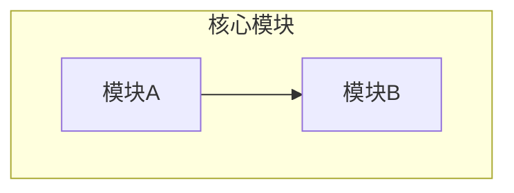
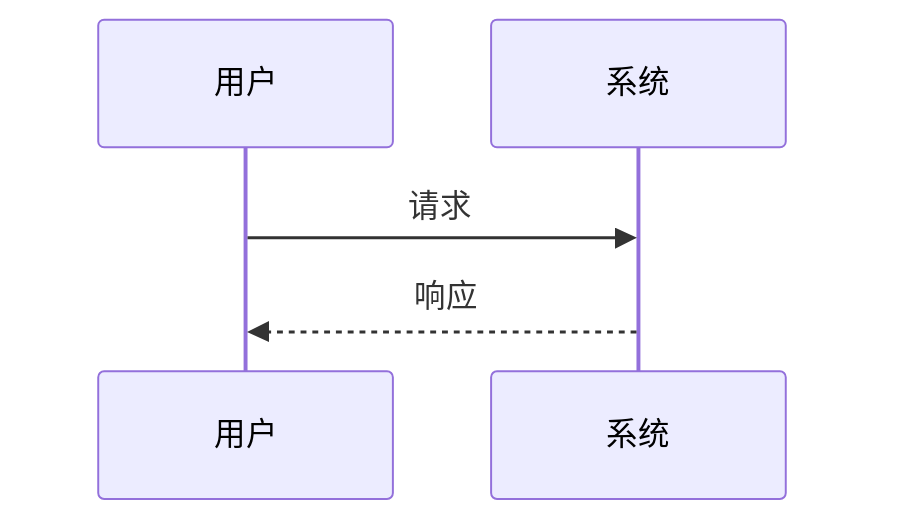
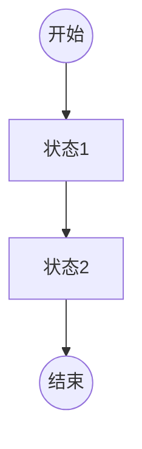
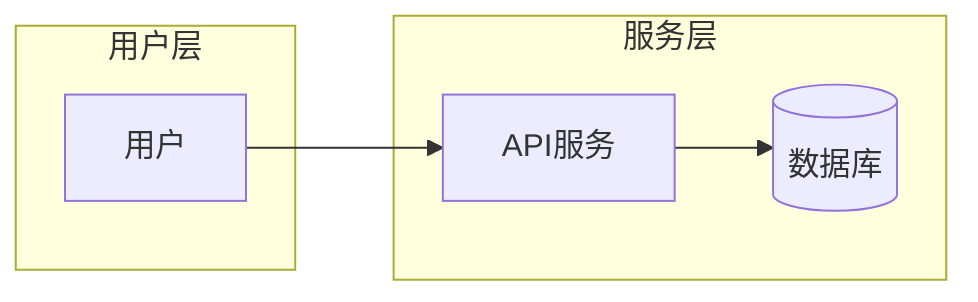

# 开源项目技术调研报告模板（技术实现篇）

> 本模板专注于技术实现层面，适用于开源项目的技术调研、技术选型、代码分析等场景。
> 标注 `【可选】` 的章节根据项目实际情况决定是否包含。

## ⚠️ 重要说明

**本模板仅为参考框架，并非固定标准。** 开源项目类型多样（框架、库、工具、中间件、应用系统等），架构风格各异，请根据具体项目特点：

- **灵活调整章节结构**：合并、拆分、增加或删除章节
- **选择合适的视角**：不同项目适合不同的架构表达方式
- **聚焦关键内容**：复杂项目深入核心模块，简单项目避免过度分析
- **产出物按需选择**：不是所有图表都必须产出，选择最有价值的部分

---

## 一、概述与背景

### 1. 项目概述

#### 1.1 项目定位与核心价值
- 项目名称、Logo、官网、GitHub地址
- 一句话描述项目目标
- 核心价值主张

#### 1.2 项目背景与起源
- 项目起源与发展历史
- 所属领域（数据库/中间件/Web框架/AI框架等）

#### 1.3 解决的核心问题
- 目标痛点是什么
- 解决方案的核心思路

#### 1.4 目标用户与使用场景
- 目标用户群体
- 典型使用场景列表

#### 1.5 项目成熟度评估
- 当前版本号
- 活跃度指标：Star数、Fork数、Contributor数量
- Commit频率、Issue处理速度、PR合并效率
- 版本发布节奏（是否稳定迭代）

### 2. 设计动机与目标

#### 2.1 设计动机
- 为什么要开发这个项目
- 当时市场上缺少什么解决方案

#### 2.2 与竞品的差异化定位
- 竞品列表
- 核心差异化优势

#### 2.3 核心设计目标
- 性能？易用性？可扩展性？安全性？
- 设计目标的优先级排序

#### 2.4 技术约束与取舍 【可选】
- 技术选型的约束条件
- 关键设计取舍及理由

---

## 二、架构设计

> 💡 **提示**：架构设计的表达方式因项目类型而异：
> - **应用系统**：适合用分层架构图、部署架构图
> - **库/SDK**：适合用模块依赖图、API结构图
> - **框架**：适合用核心流程图、扩展点图
> - **编译器/解释器**：适合用流水线图、IR结构图
> - **算法库**：适合用算法流程图、数据流图
> 请根据项目特点选择合适的表达方式，不必拘泥于以下结构。

### 3. 架构概览

#### 3.1 整体架构风格 【按项目类型选择表述方式】

根据项目类型，选择合适的架构描述方式：

| 项目类型 | 常见架构风格 | 描述重点 |
|---------|-------------|---------|
| 应用系统 | 单体/微服务/Serverless | 服务划分、通信方式 |
| 库/SDK | 分层/模块化 | 模块职责、依赖关系 |
| 框架 | 插件式/管道式 | 核心流程、扩展点 |
| 编译器/解释器 | 流水线架构 | 处理阶段、中间表示 |
| 中间件 | 分层架构 | 协议层、存储层、接口层 |

**内容要点**：
- 整体架构形态
- 架构风格选择的理由
- 核心设计理念

#### 3.2 系统边界与上下文 【按需选择】

根据项目特点选择合适的边界描述：

- **应用系统**：系统边界定义、外部依赖、用户角色
- **库/SDK**：对外接口边界、依赖的外部库、使用方式
- **框架**：框架边界、与宿主应用的交互方式
- **工具**：输入输出边界、与其他工具的集成方式

**产出物（按需选择）**：
- System Context图（C4模型）
- 系统边界图
- 交互关系图

#### 3.3 架构设计原则
- 核心设计原则（如SOLID、DRY、KISS等）
- 领域特定设计原则
- 设计原则在实际代码中的体现

#### 3.4 非功能性设计 【可选】
- 性能设计（吞吐量、延迟目标）
- 可扩展性设计
- 容错与可靠性设计
- 其他质量属性（安全性、可用性等）

### 4. 系统分解与层次结构

> 💡 **提示**：本章节根据项目复杂度和类型灵活调整，简单项目可与第5章合并。

#### 4.1 系统分解视图

根据项目类型选择合适的分解方式：

**应用系统/服务类项目**：
- 服务/应用划分及职责
- 服务间通信方式

**库/SDK类项目**：
- 核心模块划分
- 模块间依赖关系

**框架类项目**：
- 核心引擎与扩展模块
- 插件/扩展机制

**编译器/解释器类项目**：
- 编译/解释阶段划分
- 各阶段职责

**产出物（按需选择）**：
- 架构分层图
- 模块结构图
- 系统分解图

#### 4.2 核心流程与数据流 【可选】
- 核心业务/处理流程
- 数据在各模块间的流转
- 关键路径分析

**产出物**：流程图、数据流图

#### 4.3 部署架构 【可选 - 适用于需独立部署的项目】

> 注：库/SDK/工具类项目通常跳过此节。

- 部署拓扑结构
- 部署方式（Docker/K8s/二进制等）
- 环境要求

**产出物**：部署架构图

#### 4.4 技术栈
- 编程语言及版本
- 核心框架与依赖库
- 构建工具与包管理
- 关键技术选型理由

### 5. 模块与组件设计

> 💡 **提示**：模块设计的深度取决于项目复杂度。简单项目可简要描述，复杂项目需深入分析核心模块。

#### 5.1 核心模块/包划分
- 主要模块/包列表
- 各模块职责定义
- 模块命名规范（如有）

#### 5.2 模块依赖关系
- 模块间调用/依赖关系
- 依赖方向与层次
- 循环依赖分析（如有）

**产出物**：模块依赖图、包结构图

#### 5.3 核心组件/类设计 【可选 - 深度分析时使用】
- 关键组件/类列表
- 组件职责与对外接口
- 组件间协作关系

**产出物**：组件图、类图

#### 5.4 项目目录结构
```
project/
├── src/           # 源代码
├── tests/         # 测试代码
├── docs/          # 文档
└── ...
```
- 目录组织方式
- 各目录职责说明
- 命名规范

#### 5.5 接口设计概览 【按需】
- 对外暴露的主要接口/API
- 接口分类（同步/异步、内部/外部等）
- 接口契约定义方式（如OpenAPI、Protobuf）

---

## 三、核心流程与用例

### 6. 核心用例运行流程

#### 6.1 主要业务场景
- 场景列表与优先级
- 典型用户故事

#### 6.2 核心用例时序图
- 关键场景的交互流程
- 组件间调用时序

**产出物：时序图（Sequence Diagram）**

#### 6.3 状态流转 【可选】
- 有状态实体的状态机
- 状态转换条件

**产出物：状态图（State Diagram）**

#### 6.4 异常处理流程 【可选】
- 错误处理策略
- 重试/降级机制

---

## 四、核心技术实现

### 7. 核心算法与原理 【可选 - 适用于涉及算法的项目】

> 注：纯工程项目（如Web框架、工具库）可能不涉及复杂算法，可跳过此章节。

#### 7.1 算法原理说明
- 算法背景与理论基础
- 数学模型/公式
- 伪代码或流程描述

#### 7.2 算法流程图

**产出物：算法流程图**

#### 7.3 复杂度分析
- 时间复杂度
- 空间复杂度
- 瓶颈分析

#### 7.4 算法优化策略
- 已实现的优化
- 潜在优化空间

### 8. 关键模块/特性实现

#### 8.1 核心模块实现原理
- 选2-3个核心模块深入分析
- 设计思路与实现细节

#### 8.2 关键数据结构
- 核心数据结构定义
- 选择该结构的原因

#### 8.3 核心代码路径分析
- 关键功能的代码执行路径
- 重要函数/方法解析

#### 8.4 设计模式应用 【可选】
- 使用的设计模式列表
- 模式应用场景与效果

#### 8.5 创新点与亮点分析
- 技术创新点
- 工程实践亮点
- 值得借鉴的设计

### 9. 数据模型与存储 【可选 - 适用于涉及数据存储的项目】

> 注：纯计算型项目（如编译器、算法库）可能不涉及持久化存储，可跳过此章节。

#### 9.1 核心数据实体
- 实体定义
- 实体属性说明

#### 9.2 实体关系图

**产出物：ER图（Entity-Relationship Diagram）**

#### 9.3 存储方案选型
- 数据库选型（关系型/NoSQL/时序等）
- 选型理由
- 存储格式（行存/列存等）

#### 9.4 缓存策略 【可选】
- 缓存层次（本地缓存/分布式缓存）
- 缓存更新策略
- 缓存穿透/击穿/雪崩处理

#### 9.5 数据一致性保证 【可选 - 适用于分布式系统】
- 一致性模型（强一致/最终一致）
- 分布式事务方案
- 数据同步机制

### 10. API与扩展机制

#### 10.1 API设计
- API风格（REST/GraphQL/gRPC）
- API版本管理策略
- 核心API列表

#### 10.2 核心API详解
- 重要接口的请求/响应格式
- 参数说明与示例

#### 10.3 插件/扩展系统 【可选 - 适用于可扩展项目】
- 插件架构设计
- 扩展点定义
- 插件加载机制

#### 10.4 钩子与回调机制 【可选】
- 钩子点定义
- 回调注册与触发

---

## 五、质量与安全

### 11. 代码质量分析

#### 11.1 代码规模与结构
- 代码行数统计
- 文件数量与分布
- 主要编程语言占比

#### 11.2 代码复杂度评估 【可选】
- 圈复杂度分析
- 模块耦合度
- 代码重复率

#### 11.3 测试体系
- 测试框架与工具
- 测试类型：单元测试/集成测试/E2E测试
- 测试覆盖率
- 测试运行方式

#### 11.4 代码规范
- 代码风格规范（Lint工具）
- 命名约定
- 注释与文档规范

### 12. 安全性设计 【可选 - 适用于涉及安全的项目】

> 注：内部工具、数据处理库等可能不涉及安全认证，可跳过此章节。

#### 12.1 认证授权机制
- 认证方式（OAuth/JWT/Session等）
- 权限模型（RBAC/ABAC等）
- 用户/角色管理

#### 12.2 数据安全
- 数据加密方案（传输/存储）
- 敏感数据处理
- 数据脱敏机制

#### 12.3 安全边界与防护
- 输入验证
- 注入防护（SQL/XSS/命令注入等）
- 限流与防滥用

#### 12.4 安全风险评估
- 已知漏洞（CVE）
- 安全审计结果
- 风险缓解措施

---

## 六、运维与生态

### 13. 部署与运维 【可选 - 适用于需要独立部署的项目】

> 注：库/SDK类项目通常不需要独立部署，可跳过此章节。

#### 13.1 部署方式
- 部署要求（硬件/软件环境）
- 部署方式（Docker/K8s/二进制等）
- 部署步骤

#### 13.2 配置管理
- 配置文件结构
- 环境变量
- 配置热更新机制

#### 13.3 监控与日志
- 监控指标
- 日志格式与收集
- 告警机制

#### 13.4 CI/CD流程 【可选】
- 持续集成配置
- 自动化测试流程
- 发布流程

### 14. 扩展生态 【可选 - 适用于有生态的项目】

> 注：新项目或封闭项目可能无生态，可跳过此章节。

#### 14.1 插件生态
- 官方插件列表
- 社区插件生态

#### 14.2 社区活跃度
- 贡献者结构
- 社区讨论活跃度
- 文档完善程度

#### 14.3 第三方集成
- 已支持的集成列表
- 集成方式说明

---

## 七、技术评估总结

### 15. 技术评估

#### 15.1 技术优势
- 架构优势
- 性能优势
- 易用性优势
- 生态优势

#### 15.2 技术劣势与风险
- 架构缺陷
- 性能瓶颈
- 技术债务
- 潜在风险

#### 15.3 适用场景建议
- 推荐使用场景
- 不推荐使用场景
- 使用注意事项

#### 15.4 选型决策建议
- 选型评估矩阵（可选）
- 与竞品对比（可选）
- 最终建议

---

## 附录

### A. 参考资源
- 官方文档链接
- 源码仓库链接
- 相关论文/博客

### B. 术语表 【可选】
- 项目特定术语解释
- 缩写对照表

### C. 调研信息
- 调研人
- 调研时间
- 调研版本

---

## 模板使用指南

### 核心原则

1. **按需裁剪**：模板仅为参考框架，根据项目实际情况增删章节
2. **聚焦重点**：复杂项目深入核心模块，简单项目避免过度分析
3. **灵活表达**：选择最适合项目的架构表达方式，不拘泥于特定图形
4. **实用优先**：产出物应有助于理解项目，而非为文档而文档

### 不同项目类型的章节建议

以下建议仅供参考，请根据具体项目特点调整：

| 项目类型 | 核心章节 | 常跳过章节 | 备注 |
|---------|---------|-----------|------|
| **库/SDK** | 1-2, 5, 8, 10-11, 15 | 4.3(部署), 7(算法), 9(存储), 12(安全), 13(运维) | 重点分析API设计和使用方式 |
| **框架** | 1-2, 4-6, 8, 10-11, 15 | 按需选择 | 重点分析扩展机制和核心流程 |
| **中间件/数据库** | 1-6, 8-11, 13, 15 | 按需选择 | 重点分析存储、性能、可靠性 |
| **算法库/AI框架** | 1-2, 5, 7-8, 11, 15 | 4(架构分解), 9(存储), 12(安全), 13(运维) | 重点分析算法原理 |
| **编译器/解释器** | 1-2, 4, 5, 7-8, 11, 15 | 按需选择 | 重点分析流水线和IR设计 |
| **应用系统/SaaS** | 全部章节 | 按需裁剪 | 可能涉及所有章节 |
| **工具类（CLI等）** | 1-2, 5-6, 8, 10-11, 15 | 4.3(部署), 7(算法), 9(存储), 12(安全) | 重点分析使用流程 |

### 产出物选择建议

**不必产出所有图表，根据项目选择最有价值的产出物**：

| 产出物 | 适用项目类型 | 价值 |
|-------|-------------|------|
| 系统上下文图 | 应用系统、中间件 | 理解系统边界 |
| 架构分层图 | 大多数项目 | 理解整体结构 |
| 模块依赖图 | 库、框架、复杂项目 | 理解模块关系 |
| 核心流程图/时序图 | 大多数项目 | 理解运行机制 |
| 数据流图 | 数据密集型项目 | 理解数据处理 |
| 算法流程图 | 算法相关项目 | 理解算法原理 |
| ER图/数据模型图 | 数据存储项目 | 理解数据结构 |
| 部署架构图 | 需独立部署的项目 | 理解运维方式 |

---

## 架构视图参考

不同架构视图适用于不同类型的项目，以下为参考：

| 视图类型 | 适用场景 | 典型产出物 |
|---------|---------|-----------|
| **分层视图** | 大多数项目 | 分层架构图 |
| **模块视图** | 库、框架、复杂项目 | 模块依赖图、包图 |
| **组件视图** | 组件化项目 | 组件图 |
| **流程视图** | 有明确处理流程的项目 | 流程图、数据流图 |
| **时序视图** | 有交互场景的项目 | 时序图 |
| **状态视图** | 有状态管理的项目 | 状态图 |
| **部署视图** | 需独立部署的项目 | 部署架构图 |

---

## 与业界标准对应

本模板参考业界标准，但根据开源项目特点进行了简化：

| 本模板章节 | arc42 | C4模型 | 说明 |
|-----------|-------|--------|------|
| 1-2 | Introduction | - | 项目背景 |
| 3 | Context | Context | 系统边界 |
| 4 | Building Block View | Container/Component | 结构分解 |
| 5 | Building Block View | Component | 模块设计 |
| 6 | Runtime View | - | 运行时 |
| 7-8 | Implementation View | Code | 代码实现 |
| 9 | Concepts | - | 数据模型 |
| 10 | Crosscutting Concepts | - | API设计 |
| 11-12 | Quality Scenarios | - | 质量属性 |
| 13 | Deployment View | Deployment | 部署视图 |
| 15 | Decisions | - | 技术评估 |

---

## 图表规范

### 推荐图表类型

| 图表 | 语法 | 用途 | 示例位置 |
|-----|------|------|---------|
| 整体架构图 | `graph TB` | 展示系统整体结构 | 3. 架构概览 |
| 组件交互图 | `flowchart LR` | 展示组件间调用关系 | 3. 架构概览 |
| 时序图 | `sequenceDiagram` | 关键用例运行流程 | 6. 核心流程 |
| 状态流转图 | `flowchart TB` | 工件/数据状态变化 | 6. 核心流程 |
| 数据流图 | `flowchart TB` | 数据处理流程 | 4. 系统分解 |
| CLI流程图 | `flowchart LR` | 命令执行流程 | 5. 模块设计 |
| ER图 | `erDiagram` | 实体关系模型 | 9. 数据模型 |

### 禁止使用的图表类型

| 类型 | 问题 | 替代方案 |
|-----|------|---------|
| `stateDiagram-v2` | note 语法有兼容性问题 | 使用 `flowchart TB` |
| `quadrantChart` | 不是所有渲染器支持 | 使用表格 + flowchart |

### 图表示例

#### 整体架构图示例


#### 时序图示例


#### 状态流转图示例（使用 flowchart 代替 stateDiagram）


#### 组件交互图示例


---

*模板版本: v1.2*
*最后更新: 2026-05*
*说明: 本模板为参考框架，请根据具体项目特点灵活调整*
