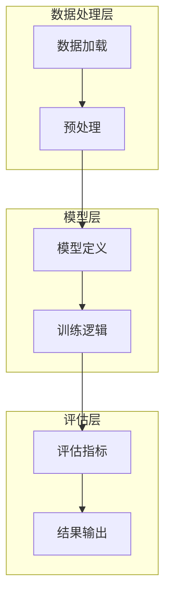
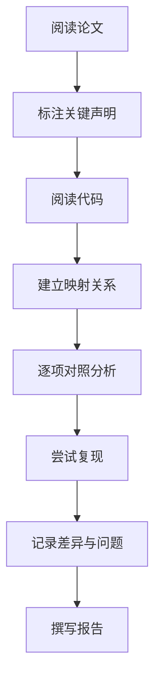

# 论文开源代码分析报告模板

> 本模板专门用于分析学术论文对应的开源代码实现，核心特点是**论文声明与代码实现的对照分析**。
> 适用于：复现论文实验、评估论文可信度、学习论文实现细节、论文代码审查等场景。

---

## ⚠️ 使用说明

**本模板的核心价值**：验证论文声明与代码实现的一致性，评估可复现性和代码质量。

**适用场景**：
- 复现论文实验结果
- 评估论文代码的可信度
- 学习论文的实现细节
- 论文代码审查与技术选型
- 学术研究方法论学习

**不适用场景**：
- 纯工程项目的调研（请使用开源项目技术调研模板）
- 不涉及代码实现的纯理论论文

---

## 一、论文与代码概述

### 1. 论文基本信息

| 项目 | 内容 |
|-----|------|
| 论文标题 | |
| 作者 | |
| 发表会议/期刊 | |
| 发表年份 | |
| 论文链接 | |
| 代码仓库 | |
| 论文引用数 | |

### 2. 论文核心贡献摘要

#### 2.1 研究问题与动机
- 论文解决的核心问题是什么？
- 研究动机和背景是什么？

#### 2.2 声明的核心贡献
> 逐条列出论文中明确声明的主要贡献

| 编号 | 论文声明的贡献 | 对应章节 |
|-----|---------------|---------|
| C1 | | Section X.X |
| C2 | | Section X.X |
| C3 | | Section X.X |

#### 2.3 核心方法/算法概述
- 方法论名称
- 核心思想简述
- 关键技术要点

### 3. 代码项目概述

#### 3.1 代码项目基本信息

| 项目 | 内容 |
|-----|------|
| 项目名称 | |
| GitHub 地址 | |
| Star 数 | |
| 开源协议 | |
| 主要编程语言 | |
| 代码行数 | |
| 最后更新时间 | |
| 维护活跃度 | |

#### 3.2 代码与论文的对应关系

| 论文部分 | 代码位置 | 对应程度 |
|---------|---------|---------|
| 核心算法 | `src/algorithm.py` | ✅ 完整对应 |
| 实验脚本 | `experiments/` | ✅ 完整对应 |
| 数据处理 | `data/` | ⚠️ 部分对应 |
| 评估指标 | `metrics/` | ❌ 未找到对应 |

---

## 二、论文-代码对照分析（核心章节）

### 4. 核心算法实现对照

> 💡 **这是本模板的核心章节**：逐项对比论文描述与代码实现

#### 4.1 算法流程对照

**论文描述的算法流程**：
```
Algorithm 1: XXX
Input: ...
Output: ...
1. ...
2. ...
```

**代码实现的流程**：
```python
# 对应代码位置：src/xxx.py
def algorithm_xxx():
    # Step 1: ...
    # Step 2: ...
```

**对照分析**：

| 算法步骤 | 论文描述 | 代码实现 | 一致性 | 备注 |
|---------|---------|---------|--------|------|
| Step 1 | | | ✅/⚠️/❌ | |
| Step 2 | | | ✅/⚠️/❌ | |
| Step 3 | | | ✅/⚠️/❌ | |

#### 4.2 关键公式/模型对照

| 论文公式 | 公式描述 | 代码实现位置 | 实现一致性 |
|---------|---------|-------------|-----------|
| Eq.1: loss = ... | 损失函数 | `loss.py:23` | ✅ 一致 |
| Eq.2: attention = ... | 注意力机制 | `attention.py:45` | ⚠️ 有细微差异 |

**差异详情**：
- 差异1：论文中...代码中实际实现为...
- 差异原因推测：...

#### 4.3 超参数与配置对照

| 超参数 | 论文值 | 代码默认值 | 位置 | 一致性 |
|-------|-------|-----------|------|--------|
| learning_rate | 1e-4 | 1e-4 | `config.yaml` | ✅ |
| batch_size | 32 | 64 | `config.yaml` | ⚠️ 不一致 |
| hidden_dim | 512 | 512 | `model.py` | ✅ |

### 5. 实验设置对照

#### 5.1 数据集对照

| 数据集 | 论文描述 | 代码实现 | 一致性 |
|-------|---------|---------|--------|
| Dataset A | 规模、划分方式 | 数据加载代码位置 | ✅/⚠️/❌ |

**数据处理差异**：
- 论文声称：...
- 代码实际：...

#### 5.2 评估指标对照

| 指标 | 论文定义 | 代码实现 | 一致性 |
|-----|---------|---------|--------|
| Accuracy | 定义方式 | `metrics/accuracy.py` | ✅ |
| F1-Score | 定义方式 | `metrics/f1.py` | ⚠️ 计算方式略有不同 |

#### 5.3 Baseline 对照

| Baseline | 论文声称对比 | 代码实现情况 | 一致性 |
|---------|-------------|-------------|--------|
| Method A | ✅ 有对比 | ✅ 有实现 | ✅ |
| Method B | ✅ 有对比 | ❌ 未实现 | ❌ |

### 6. 实验结果对照

#### 6.1 主要结果对照表

| 实验 | 论文报告结果 | 代码复现结果 | 差异 | 可接受范围 |
|-----|-------------|-------------|------|-----------|
| Exp 1 | 95.2% | 94.8% | -0.4% | ✅ |
| Exp 2 | 87.5% | 85.1% | -2.4% | ⚠️ |

#### 6.2 消融实验对照

| 消融项 | 论文报告 | 代码复现 | 一致性 |
|-------|---------|---------|--------|
| 去掉组件A | -3.2% | -2.9% | ✅ |
| 去掉组件B | -1.5% | -0.8% | ⚠️ |

---

## 三、代码质量与技术实现

### 7. 代码架构分析

#### 7.1 项目结构
```
project/
├── src/           # 核心实现
├── experiments/   # 实验脚本
├── data/          # 数据处理
├── configs/       # 配置文件
└── README.md
```

#### 7.2 架构图



### 8. 代码质量评估

#### 8.1 代码规范

| 维度 | 评估 | 说明 |
|-----|------|-----|
| 代码风格 | ⭐⭐⭐⭐ | 遵循 PEP8 规范 |
| 命名规范 | ⭐⭐⭐ | 变量命名基本清晰 |
| 注释质量 | ⭐⭐ | 缺少关键算法注释 |
| 文档完整度 | ⭐⭐⭐ | README 基本完整 |

#### 8.2 测试覆盖

| 类型 | 是否存在 | 覆盖范围 |
|-----|---------|---------|
| 单元测试 | ✅/❌ | |
| 集成测试 | ✅/❌ | |
| 端到端测试 | ✅/❌ | |

#### 8.3 可复现性支持

| 复现要素 | 支持情况 | 说明 |
|---------|---------|-----|
| 环境配置 | ✅ 有 requirements.txt | |
| 随机种子固定 | ✅/❌ | |
| 预训练模型 | ✅/❌ | |
| 详细运行说明 | ✅/❌ | |

### 9. 论文未提及的实现细节

> 记录代码中存在但论文未详细描述的重要实现

| 实现细节 | 代码位置 | 重要性 | 说明 |
|---------|---------|--------|-----|
| 数据增强策略 | `data/augment.py` | 高 | 论文未详细描述 |
| 训练技巧 | `train.py` | 中 | 混合精度训练等 |

---

## 四、可复现性评估

### 10. 可复现性评分

#### 10.1 总体评分

| 维度 | 评分（1-5） | 说明 |
|-----|------------|-----|
| **环境配置** | ⭐⭐⭐⭐ | 有完整的依赖说明 |
| **数据获取** | ⭐⭐⭐ | 部分数据需申请 |
| **运行说明** | ⭐⭐⭐⭐ | README 较详细 |
| **结果一致性** | ⭐⭐⭐ | 复现结果与论文基本一致 |
| **代码质量** | ⭐⭐⭐ | 中等水平 |

**综合可复现性评分**：⭐⭐⭐ (3/5)

#### 10.2 复现障碍清单

| 障碍类型 | 描述 | 解决方案 |
|---------|-----|---------|
| 环境依赖 | CUDA 版本要求严格 | 使用 Docker |
| 数据缺失 | 某些数据集未公开 | 联系作者 |
| 配置缺失 | 某些超参数未说明 | 默认值尝试 |

### 11. 复现建议

#### 11.1 环境配置建议

```bash
# 推荐环境配置
conda create -n paper_repro python=3.8
pip install -r requirements.txt
```

#### 11.2 复现步骤

1. 环境准备：...
2. 数据准备：...
3. 训练命令：...
4. 评估命令：...

#### 11.3 已知问题与解决方案

| 问题 | 原因 | 解决方案 |
|-----|-----|---------|
| OOM 错误 | 批量大小过大 | 减小 batch_size |
| 训练不收敛 | 学习率过大 | 调低学习率 |

---

## 五、技术评估总结

### 12. 论文与代码一致性总结

#### 12.1 一致性统计

| 类别 | 完全一致 | 部分一致 | 不一致 | 未实现 |
|-----|---------|---------|--------|--------|
| 核心算法 | 3 | 1 | 0 | 0 |
| 实验设置 | 4 | 1 | 1 | 0 |
| 评估指标 | 2 | 0 | 0 | 0 |

#### 12.2 关键发现

**正面发现**：
1. 核心算法实现与论文描述高度一致
2. 主要实验结果可复现
3. ...

**负面发现**：
1. 部分超参数与论文不一致
2. 某些 Baseline 未提供实现
3. ...

### 13. 技术评估

#### 13.1 论文可信度评估

| 维度 | 评估 | 说明 |
|-----|------|-----|
| 理论完整性 | ⭐⭐⭐⭐ | 理论推导清晰 |
| 实验充分性 | ⭐⭐⭐⭐ | 实验覆盖全面 |
| 结果可信度 | ⭐⭐⭐ | 基本可复现 |
| 代码质量 | ⭐⭐⭐ | 中等水平 |

#### 13.2 代码实用性评估

| 维度 | 评估 | 说明 |
|-----|------|-----|
| 易用性 | ⭐⭐⭐ | 需要一定门槛 |
| 可扩展性 | ⭐⭐⭐⭐ | 架构较清晰 |
| 维护性 | ⭐⭐ | 文档较少 |

#### 13.3 适用场景建议

**推荐使用场景**：
- 学习论文实现细节
- 基于该方法的进一步研究
- ...

**不推荐使用场景**：
- 生产环境直接部署
- 大规模数据处理
- ...

### 14. 改进建议

#### 14.1 对作者的改进建议

| 建议 | 优先级 | 说明 |
|-----|-------|-----|
| 补充缺失的配置文件 | 高 | 影响复现 |
| 增加代码注释 | 中 | 提高可读性 |
| 完善文档 | 中 | 降低使用门槛 |

#### 14.2 对使用者的建议

1. 仔细阅读论文后再阅读代码
2. 注意论文与代码的差异点
3. 复现时固定随机种子
4. ...

---

## 六、附录

### A. 详细对照清单

> 可选：提供更细粒度的论文-代码对照表

### B. 复现日志

> 可选：记录复现过程中的详细日志

### C. 相关资源

- 论文链接
- 代码仓库
- 相关讨论（Reddit、Twitter 等）
- 引用该论文的后续工作

### D. 分析信息

- 分析人：
- 分析时间：
- 代码版本/commit：

---

## 模板使用指南

### 核心原则

1. **对照为核心**：始终以论文-代码对照为主线
2. **客观记录**：如实记录差异，不做主观臆断
3. **可复现优先**：重点关注可复现性评估
4. **实用性导向**：提供切实可行的复现建议

### 分析流程建议



### 一致性标记说明

| 标记 | 含义 |
|-----|------|
| ✅ | 完全一致 |
| ⚠️ | 部分一致 / 有细微差异 |
| ❌ | 不一致 / 未实现 |
| ❓ | 无法判断 / 信息不足 |

### 评分标准参考

**可复现性评分标准**：

| 分数 | 标准 |
|-----|------|
| 5分 | 一键复现，结果完全一致 |
| 4分 | 需少量调整，结果基本一致 |
| 3分 | 需一定努力，结果大致可接受 |
| 2分 | 需大量工作，结果有明显偏差 |
| 1分 | 无法复现 |

---

*模板版本: v1.0*
*创建时间: 2026-05*
*基于: 开源项目技术调研报告模板*
